# Product Development

> **BIS Handbook 2.0** — Roadmap, Backlog Management, and Release Strategy  
> **Last Updated:** September 13, 2025  
> **Navigation:** [🏠 Main Handbook](../README.md) | [Previous: Operating Model](10-Operating-Model.md) | [Next: Best Practices](12-Best-Practices.md)

---

## Section Overview

**Overview:** Roadmap management, backlog strategy, and release cycles. Covers product management and development planning.

**Target Audience:** Product managers, development teams, project managers, and business stakeholders.

**How to Use:** Use for roadmap planning, backlog management, release planning, and product strategy development.

**Key Content:** Roadmap management, backlog strategy, release cycles, product planning frameworks, stakeholder management.

**Use Cases:** Product planning, roadmap development, release management, backlog prioritization, stakeholder communication.

---

## Table of Contents

- [High-Level BIS Roadmap](#high-level-bis-roadmap)
- [Backlog Management and Prioritization](#backlog-management-and-prioritization)
- [Release and Deployment Strategy](#release-and-deployment-strategy)
- [Platform Evolution Plan](#platform-evolution-plan)
- [Deployment Rings and Environments](#deployment-rings-and-environments)
- [Release Cycles](#release-cycles)
- [Navigation](#navigation)
- [Agile Development Framework](#agile-development-framework)

---

## High-Level BIS Roadmap

```mermaid
flowchart LR
  v4["BIS 4\n(legacy - Allianz support)"]
  v45["BIS 4.5\n(current)"]
  v5["BIS 5\n(AI‑first release)"]
  v51["BIS 5.1\n(OneDrive automation)"]
  v6["BIS 6\n(Robocorp runtime)"]
  v7["BIS 7\n(DuckDB + Databricks lake)"]

  od["OneDrive (automation)"]
  robo["Robocorp (orchestration)"]
  dbx["Databricks (lake)"]
  duck["DuckDB (local parity)"]

  v4 --> v45 --> v5 --> v51 --> v6 --> v7

  v51 --> od
  v6 --> robo
  v7 --> dbx
  v7 --> duck

  subgraph Legend[" "]
    L1["→ = progression / upgrade path"]
    L2["Nodes show major runtime/orchestration change"]
  end
```



### Detailed Product Roadmap Timeline

```mermaid
gantt
    title BIS Product Roadmap Timeline
    dateFormat YYYY-MM-DD
    section Current (BIS 4.5)
        Legacy Support          :done, legacy, 2023-01-01, 2025-12-31
        Production Operations   :active, prod, 2024-01-01, 2025-12-31
        Daily SLA Reporting     :active, sla, 2024-01-01, 2025-12-31

    section BIS 5.0 (AI-First)
        AI Agent Integration    :ai1, 2025-01-01, 2025-06-30
        Persona Framework       :ai2, after ai1, 2025-03-01, 2025-08-31
        Prompt Engineering      :ai3, after ai2, 2025-04-01, 2025-09-30
        AI Workflow Automation  :ai4, after ai3, 2025-05-01, 2025-10-31

    section BIS 5.1 (OneDrive Automation)
        OneDrive Integration    :od1, 2025-07-01, 2025-10-31
        Automated Execution     :od2, after od1, 2025-08-01, 2025-11-30
        Minimal Human Action    :od3, after od2, 2025-09-01, 2025-12-31

    section BIS 6.0 (Robocorp Runtime)
        Robocorp Migration      :rc1, 2025-10-01, 2026-03-31
        Orchestration Engine    :rc2, after rc1, 2025-11-01, 2026-04-30
        Pipeline Replacement    :rc3, after rc2, 2025-12-01, 2026-05-31

    section BIS 7.0 (Databricks Lake)
        Databricks Integration  :db1, 2026-01-01, 2026-06-30
        Data Lake Migration     :db2, after db1, 2026-02-01, 2026-07-31
        DuckDB Parity           :db3, after db2, 2026-03-01, 2026-08-31
```

### Release Cycle Visualization


### Implementation Stages Roadmap


### Version Evolution
- **BIS 3**: Final version working on single customer – stabilized core functionality
- **BIS 4**: Legacy version maintained only to support daily operations for Allianz
- **BIS 4.5**: Current stable version of BIS used in production
- **BIS 5**: AI-First baseline with integrated AI agents, personas, and prompts
- **BIS 5.1**: Integrates automation to run BIS 5 from OneDrive with minimal human action
- **BIS 6**: BIS pipeline replaced by Robocorp orchestration
- **BIS 7**: Same operating model as 6, with DuckDB connected to a Databricks data lake

---

## Backlog Management and Prioritization

### Backlog Sources
- Customer requests
- CSI items
- Technical debt

### Prioritization Framework
- **MoSCoW Method:** Must have, Should have, Could have, Won't have
- **T-shirt Sizing:** XS, S, M, L, XL for effort estimation
- **Definition of Ready:** Clear owners, data access, acceptance criteria

### Work Organization
- **Streams:** Engine, Workspace, Excel, Delivery
- **Epics:** Group related stories (e.g., "Improve Excel Reporting")
- **User Stories:** "As a [user], I want [feature] so that [benefit]"

---

## Release and Deployment Strategy

### Environments
- **Dev:** Local development and testing
- **Test:** Shared testing environment
- **Pilot:** Customer staging environment
- **Prod:** Live production environment

### Branching Strategy
- **Main:** Production-ready code
- **Dev:** Development integration branch
- **Feature Branches:** Individual feature development

### Release Cadence
- **Weekly Releases:** Regular feature releases
- **Hotfixes:** Critical bug fixes as needed
- **Versioning:** Managed via release.yml

---

## Platform Evolution Plan

### Migration Strategy
- **Robocorp:** For RPA and orchestration capabilities
- **Databricks:** For cloud data lake storage
- **DuckDB:** Maintain local development parity

### Experimentation Framework
- Controlled experiments with clear success criteria
- ADR documentation for architectural decisions
- Default to simple single-host model unless scale demands change

---

## Deployment Rings and Environments

### Ring Structure
- **Dev Ring:** Rapid iteration and feature testing
- **Test Ring:** User acceptance testing
- **Pilot Ring:** Limited production deployment
- **Prod Ring:** Full production release

### Promotion Criteria
- Automated CI checks must pass
- Manual approvals for production deployment
- Data hygiene and security validation
- Performance and compatibility testing

---

## Release Cycles

### Engine vs Reports
- **Coordinated Trains:** Engine and reports release together
- **Compatibility Guarantees:** Backward compatibility maintained
- **Hotfix Strategy:** Forward-fix with retrofit guidance

### Cycle Management
- **Customer Report Delivery:** Business-aligned release cycle
- **Engine Development:** Technical release cycle
- **Unified Backlog:** Single source for both cycles
- **Synchronized Calendars:** Aligned sprints and releases

---

## Implementation Stages & Outcomes

BIS can be implemented in stages, each building on the previous:

### 1. Report as Code (RAC)
- Collect requirements, connect data sources, deliver reports (including SLA reports).
- Assumes stable, fixed reporting needs.

### 2. Business Observability (BO)
- Integrate all SLAs and metrics into a single, holistic view.
- Monitor monthly and daily metrics, consult reports to improve business results.
- Assumes flexible, frequently changing requirements.

### 3. Service Management Augmentation (SMA)
- Integrate with ITSM and CSI processes.
- Define stakeholders/owners, deliver personalized actions.

### Outcomes & Products
- **Generic Reports**: Configured as code, generated in Excel, with rich visualization.
- **SLA Reports**: Monthly (closed period) and daily (month-to-date) snapshots.
- **Business Observability Dashboards**: Unified, filterable views for stakeholders.
- **Augmented Actions**: Automated, prioritized notifications to owners, replacing manual coordination.
- **Automated documentation**: All code and configuration is self-documented for AI agents.

### Release Strategy Comparison Framework

| **Strategy** | **Release Frequency** | **Risk Level** | **Coordination** | **Rollback Complexity** | **BIS Fit** | **Recommendation** |
|-------------|---------------------|---------------|-----------------|-----------------------|------------|-------------------|
| **Continuous Deployment** | Multiple/day | High | Automated | Low | 🟡 Medium | Future consideration |
| **Daily Releases** | Daily | Medium-High | Semi-automated | Medium | 🟡 Medium | Optional for hotfixes |
| **Weekly Releases** | Weekly | Medium | Manual gates | Medium | 🟢 Good | Current approach |
| **Bi-weekly Releases** | Every 2 weeks | Medium-Low | Sprint-aligned | Medium | 🟢 Good | Recommended for features |
| **Monthly Releases** | Monthly | Low | Planned | High | 🟡 Medium | Legacy systems |
| **Feature Flags** | On-demand | Variable | Controlled | Low | 🟢 Excellent | Recommended for gradual rollout |

#### Deployment Ring Strategy Comparison

| **Ring Strategy** | **User Impact** | **Validation Depth** | **Time to Production** | **Resource Requirements** | **Best Use Case** |
|------------------|----------------|-------------------|----------------------|-------------------------|------------------|
| **Single Ring** | High impact | Basic validation | Fastest | Low | Small teams, low risk |
| **Two Rings** | Medium impact | Standard testing | Fast | Medium | Standard development |
| **Three Rings** | Low impact | Comprehensive | Medium | High | Enterprise, critical systems |
| **Canary Deployment** | Minimal impact | Production validation | Slowest | Very High | High-reliability systems |
| **Blue-Green** | Zero downtime | Full validation | Medium | High | 24/7 services, zero tolerance |

### Backlog Prioritization Frameworks

| **Framework** | **Primary Criteria** | **Complexity** | **Time Investment** | **Best For** | **BIS Application** |
|---------------|---------------------|---------------|-------------------|-------------|-------------------|
| **MoSCoW** | Business value, urgency | Low | Low | Quick prioritization | Current primary method |
| **Kano Model** | Customer satisfaction | Medium | Medium | Customer-focused features | Secondary analysis |
| **Value vs. Effort** | ROI, implementation cost | Low | Low | Resource optimization | Sprint planning |
| **Risk-Adjusted** | Technical risk, dependencies | High | High | Complex features | Architecture decisions |
| **Cost of Delay** | Time-to-market impact | Medium | Medium | Competitive features | Strategic initiatives |
| **Weighted Scoring** | Multiple criteria matrix | High | High | Comprehensive evaluation | Major releases |

#### Sprint Capacity Planning Matrix

| **Team Size** | **Sprint Length** | **Available Hours** | **Focus Factor** | **Effective Capacity** | **Buffer Recommendation** |
|---------------|------------------|-------------------|----------------|----------------------|-------------------------|
| **3-5 people** | 2 weeks | 320-800 hours | 80% | 256-640 hours | 20% (50-130 hours) |
| **6-8 people** | 2 weeks | 960-1280 hours | 75% | 720-960 hours | 25% (180-240 hours) |
| **9-12 people** | 2 weeks | 1440-1920 hours | 70% | 1008-1344 hours | 30% (300-400 hours) |
| **Cross-functional** | 2 weeks | Variable | 85% | Variable | 15% |
| **AI-Augmented** | 2 weeks | Standard | 90% | +20% capacity | 10% |

### Product Roadmap Visualization Enhancements

#### Roadmap Confidence Levels

| **Confidence Level** | **Time Horizon** | **Detail Level** | **Commitment Level** | **Change Frequency** | **Visualization Style** |
|---------------------|----------------|-----------------|-------------------|-------------------|----------------------|
| **Committed** | 0-3 months | Detailed stories | Fixed scope | Rare changes | Solid bars/timeline |
| **Planned** | 3-6 months | Epic-level features | High confidence | Occasional changes | Dashed lines |
| **Exploratory** | 6-12 months | Theme areas | Medium confidence | Regular updates | Cloud shapes |
| **Vision** | 12+ months | Strategic goals | Low confidence | Frequent evolution | Dotted outlines |
| **Research** | Variable | Technology spikes | Experimental | As needed | Question marks |

#### Release Readiness Checklist

| **Readiness Area** | **Pre-Release** | **Release Day** | **Post-Release** | **Owner** | **Success Criteria** |
|-------------------|----------------|----------------|-----------------|-----------|-------------------|
| **Code Quality** | Unit tests pass, code review complete | Static analysis clean | No critical defects | Engineering Lead | 95%+ test coverage |
| **Documentation** | User guides updated, API docs current | Release notes published | Knowledge base updated | Technical Writer | Complete, accurate docs |
| **Data Validation** | Test data verified, migration tested | Data integrity confirmed | Production data validated | Data Engineer | Zero data quality issues |
| **Security** | Security scan passed, vulnerabilities patched | Access controls verified | Security monitoring active | Security Lead | No high-risk vulnerabilities |
| **Performance** | Load testing complete, benchmarks met | System monitoring active | Performance metrics tracked | SRE | Meets SLAs and benchmarks |
| **User Acceptance** | UAT completed, sign-off received | User training delivered | User feedback collected | Product Owner | Stakeholder approval |

---

## Navigation

**[🏠 Main Handbook](../README.md)** | **[Previous: Operating Model](10-Operating-Model.md)** | **[Next: Best Practices](12-Best-Practices.md)**

### Quick Links
- [📋 Complete Table of Contents](../README.md#table-of-contents)
- [🎯 Executive Summary](../README.md#executive-summary)
- [🔗 Key Resources](../README.md#key-resources)
- [📚 All Handbook Sections](../README.md#handbook-sections)

### Related Handbook Sections
- [📊 Business Architecture](03-Business-Architecture.md) — Business strategy and observability
- [⚙️ Engineering Processes](06-Engineering-Processes.md) — Development workflows and CI/CD
- [🤖 Augmented Workload](09-Augmented-Workload.md) — AI integration in development
- [📋 Best Practices](12-Best-Practices.md) — Development methodologies and standards

---

## Agile Development Framework

### Scrum Methodology Implementation

#### Scrum Roles and Responsibilities
- **Product Owner**: Defines product vision, manages backlog, prioritizes features, accepts deliverables
- **Scrum Master**: Facilitates ceremonies, removes impediments, coaches team on Scrum practices, protects sprint goals
- **Development Team**: Cross-functional members who deliver potentially releasable increments each sprint

#### Core Scrum Ceremonies

##### Sprint Planning (2-4 hours for 2-week sprint)
**Purpose**: Define sprint goal and select backlog items for implementation
- **What will be delivered?** Product Owner presents prioritized backlog items
- **How will the work be done?** Team breaks down items into tasks and estimates effort
- **Sprint Goal Definition**: Team commits to achievable objectives
- **Capacity Planning**: Consider team velocity, availability, and historical performance

##### Daily Scrum (15 minutes)
**Purpose**: Synchronize progress and identify impediments
- **What did I accomplish yesterday?** Individual progress updates
- **What will I work on today?** Commitment to immediate tasks
- **What obstacles are in my way?** Identification of blockers and impediments
- **Focus on Collaboration**: Team discusses dependencies and offers help

##### Sprint Review (2 hours for 2-week sprint)
**Purpose**: Inspect increment and adapt backlog
- **Demonstration**: Team showcases completed work to stakeholders
- **Feedback Collection**: Product Owner and stakeholders provide input
- **Metrics Review**: Velocity, burndown charts, and quality metrics
- **Backlog Adaptation**: Update priorities based on new information

##### Sprint Retrospective (1.5 hours for 2-week sprint)
**Purpose**: Inspect process and identify improvements
- **What went well?** Celebrate successes and positive practices
- **What could be improved?** Identify challenges and bottlenecks
- **Action Items**: Define specific, measurable improvements
- **Continuous Improvement**: Implement changes in next sprint

#### Sprint Duration and Cadence
- **Standard Sprint Length**: 2 weeks (common for BIS development)
- **Sprint Zero**: Initial setup and planning sprint
- **Special Sprints**: Hardening sprints for major releases, innovation sprints for experimentation

### Backlog Management and Refinement

#### Product Backlog Structure
- **Epic Level**: Large features or themes (e.g., "AI Integration", "Cloud Migration")
- **Feature Level**: User-facing capabilities with business value
- **Story Level**: Detailed user stories with acceptance criteria
- **Task Level**: Technical implementation details

#### Backlog Refininement Process
- **Regular Cadence**: 1-2 hours per week during sprint
- **Story Writing**: "As a [user], I want [feature] so that [benefit]"
- **Acceptance Criteria**: Clear, testable conditions for completion
- **Story Point Estimation**: Relative sizing using Fibonacci sequence (1, 2, 3, 5, 8, 13)
- **Definition of Ready**: Checklist ensuring stories are prepared for sprint

#### Prioritization Techniques
- **MoSCoW Method**: Must have, Should have, Could have, Won't have
- **Kano Model**: Basic needs, performance needs, delighters
- **Value vs. Effort Matrix**: High value/low effort prioritized first
- **Risk-Adjusted Prioritization**: Consider technical risk and dependencies

### Agile Metrics and Measurement

#### Velocity and Capacity
- **Sprint Velocity**: Average story points completed per sprint
- **Capacity Planning**: Team availability and historical performance
- **Burndown Charts**: Visual progress tracking against sprint goals

#### Quality Metrics
- **Defect Density**: Bugs per story point or per lines of code
- **Code Coverage**: Percentage of code covered by automated tests
- **Technical Debt**: Accumulated maintenance burden

#### Delivery Metrics
- **Lead Time**: Time from backlog entry to production deployment
- **Cycle Time**: Time from work start to completion
- **Throughput**: Number of items completed per unit time

### Product Management Practices

#### Product Vision and Strategy
- **Vision Statement**: Clear articulation of product purpose and value
- **Product Roadmap**: High-level timeline of feature delivery
- **Market Analysis**: Competitive landscape and customer needs
- **OKR Framework**: Objectives and Key Results for goal alignment

#### Stakeholder Management
- **Stakeholder Mapping**: Identify and categorize stakeholders by influence and interest
- **Communication Planning**: Regular updates and feedback mechanisms
- **Expectation Management**: Clear delivery commitments and scope boundaries

#### Release Planning and Management
- **Release Planning**: Multi-sprint planning for major features
- **Feature Flags**: Controlled rollout of new functionality
- **Beta Testing**: Early access programs for user validation
- **Go-Live Checklist**: Comprehensive validation before production release

### DevOps Integration

#### Continuous Integration/Continuous Deployment (CI/CD)
- **Automated Testing**: Unit tests, integration tests, end-to-end tests
- **Code Quality Gates**: Static analysis, security scanning, performance checks
- **Automated Deployment**: Infrastructure as code and deployment pipelines
- **Rollback Strategies**: Quick recovery mechanisms for failed releases

#### Infrastructure as Code
- **Version Control**: All infrastructure configurations in Git
- **Automated Provisioning**: Environment setup and configuration management
- **Immutable Infrastructure**: Consistent, reproducible environments

#### Monitoring and Observability
- **Application Monitoring**: Performance metrics and error tracking
- **Log Aggregation**: Centralized logging for troubleshooting
- **Alert Management**: Automated notifications for system issues
- **User Analytics**: Usage patterns and feature adoption metrics

### Risk Management and Compliance

#### Technical Risk Assessment
- **Architecture Risks**: Scalability, security, and maintainability concerns
- **Dependency Risks**: Third-party library and service reliability
- **Integration Risks**: API compatibility and data consistency

#### Compliance and Security
- **Security by Design**: Threat modeling and secure coding practices
- **Data Privacy**: GDPR, CCPA, and industry-specific regulations
- **Audit Trails**: Comprehensive logging and change tracking

#### Contingency Planning
- **Business Continuity**: Backup systems and disaster recovery
- **Incident Response**: Escalation procedures and communication plans
- **Crisis Management**: Stakeholder communication and decision frameworks

### Innovation and Experimentation

#### Innovation Sprints
- **Hackathons**: Time-boxed innovation events
- **Proof of Concepts**: Rapid validation of new ideas
- **Spike Stories**: Time-boxed research and investigation

#### A/B Testing Framework
- **Hypothesis Development**: Clear success criteria and measurement plans
- **Test Design**: Statistical significance and sample size calculations
- **Result Analysis**: Data-driven decision making and learning

#### Continuous Learning
- **Retrospective Culture**: Regular process improvement
- **Knowledge Sharing**: Documentation and cross-training
- **Technology Radar**: Emerging technology evaluation and adoption

This comprehensive agile framework ensures BIS development follows industry best practices while maintaining flexibility for innovation and rapid delivery.
