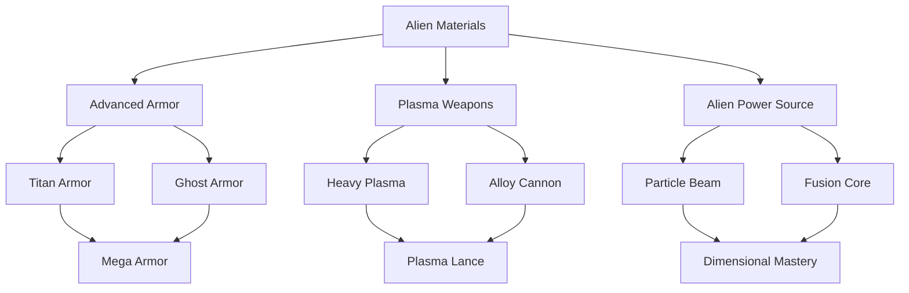

# Quick Comparison: New vs. Wiki Content

## At a Glance

| Metric | New Folder | Wiki Folder | Gap |
|--------|-----------|-------------|-----|
| **Total Files** | 235 files | 317 files | -82 files (-26%) |
| **Avg File Length** | 30-50 lines | 200-400 lines | -75% content |
| **Documentation Score** | 2.0/10 | 9.4/10 | -74% quality |
| **Has Integration Docs** | ❌ No | ✅ Yes | Missing entirely |
| **Has Architecture Docs** | ❌ No | ✅ Yes | Missing entirely |
| **Has Technical Specs** | ❌ Minimal | ✅ Comprehensive | ~10% coverage |
| **Has Examples/Templates** | ❌ No | ✅ Yes | Missing entirely |

---

## Side-by-Side Examples

### Example 1: Facilities.md

#### New Folder (30 lines)
```markdown
# Facilities

## Overview
Facilities are the core buildings in bases...

## Mechanics
- **Types**: Housing, production, defense.
- **Costs**: Credits and time.
- **Benefits**: Capacities and bonuses.

## Examples
- Lab: Research capacity.
- Hangar: Craft storage.
```

#### Wiki Folder (157 lines)
```markdown
# Facilities

## Table of Contents
- [Overview](#overview)
- [Mechanics](#mechanics)
  - [Size and Footprint System](#size-and-footprint-system)
  - [Construction Lifecycle Management](#construction-lifecycle-management)
  - [Connectivity Requirements](#connectivity-requirements)
  - [Health and Damage System](#health-and-damage-system)
  - [Capacity Contribution Framework](#capacity-contribution-framework)
  - [Service Tag System](#service-tag-system)
  - [Tactical Integration Framework](#tactical-integration-framework)
  - [Operations and Maintenance](#operations-and-maintenance)
  - [Failure Mode Handling](#failure-mode-handling)

## Overview
Facilities serve as the modular building blocks of bases in Alien Fall, 
representing primary strategic choices through data-driven modules that 
define physical footprint, operational capacities, service capabilities, 
and connectivity requirements...

## Mechanics

### Size and Footprint System
Facilities occupy base tiles with configurable dimensions:
- Standard Units: Baseline 1×1 tile occupation for compact facilities
- Multi-Tile Structures: Support for larger footprints (2×1, 2×2, 3×2, etc.)
- Placement Metadata: Width and height parameters integrated with base map systems
- Space Efficiency: Larger facilities typically provide greater capacity per tile
- Layout Constraints: Geometric limitations affecting base expansion...

### Construction Lifecycle Management
Facilities undergo structured development from placement to operation:
- Building State: Initial construction phase upon placement with progress tracking
- Time Requirements: Configurable construction duration in game days
- Cost Structure: Upfront or incremental payment options for construction...

[continues with detailed specifications]
```

**Difference:** New has generic bullets. Wiki has 9 subsystems with specifications, formulas, and integration notes.

---

### Example 2: Research Tree.md

#### New Folder (40 lines)
```markdown
# Research Tree

## Overview
Visualizes research dependencies, supporting various connection types.

## Mechanics
- **Dependencies**: Prerequisites.
- **Visualization**: Tree view.
- **No Progress**: Managed separately.

## Examples
Tree:
- Basic -> Advanced.
- Branches: Weapons, armor.
```

#### Wiki Folder (392 lines)
```markdown
# Research Tree

## Table of Contents
- [Overview](#overview)
- [Mechanics](#mechanics)
  - [Graph Structure and Relationships](#graph-structure-and-relationships)
  - [Choice and Branching Systems](#choice-and-branching-systems)
  - [Discovery and Interaction Mechanics](#discovery-and-interaction-mechanics)
  - [Event Hooks and Integration](#event-hooks-and-integration)
  - [Planning and Management Tools](#planning-and-management-tools)
  - [Meta-Progression and Balancing](#meta-progression-and-balancing)
- [Examples](#examples)
  - [Branching Pathway Examples](#branching-pathway-examples)
    - [Alien Materials Technology Tree](#alien-materials-technology-tree)
    - [Weapons Technology Progression](#weapons-technology-progression)
    - [Biological Research Branches](#biological-research-branches)
  - [Contest and Cooperation Scenarios](#contest-and-cooperation-scenarios)
  - [Hidden Branch Reveals](#hidden-branch-reveals)
  - [Capstone and Milestone Examples](#capstone-and-milestone-examples)

## Overview
The research tree system establishes a comprehensive technological progression 
framework structured as a directed acyclic graph (DAG) of research entries. 
It creates meaningful advancement pathways, mutually exclusive choices, 
contest mechanics, and cooperative research opportunities...

## Research Tree Visualization

### Technology DAG Structure


### Branching Pathway Example
[Detailed mermaid diagram]

## Mechanics

### Graph Structure and Relationships
Research entries form a directed acyclic graph (DAG) where nodes represent 
individual projects and edges represent prerequisite dependencies:
- Node Types: Standard entries, branching choice points, hidden discoveries
- Edge Types: Hard prerequisites, soft recommendations, mutually exclusive...

[continues with extensive DAG specifications, formulas, and integration]
```

**Difference:** New has trivial example. Wiki has DAG structure, branching mechanics, contest systems, mermaid diagrams, and 10+ detailed scenarios.

---

### Example 3: Unit Actions.md

#### New Folder (40 lines)
```markdown
# Unit Actions

## Overview
Unit Actions define available commands...

## Mechanics
- **Movement**: Position changes, costing MP and AP.
- **Combat**: Shoot, melee, throw grenades.
- **Special**: Overwatch, reload, use items.
- **Limitations**: AP/TU constraints limit combinations.

## Examples
Action List:
- Move: 1-2 AP
- Shoot: 1 AP
- Overwatch: 1 AP
- Grenade: 2 AP
```

#### Wiki Folder (Distributed across battlescape/mechanics/)
```markdown
# Action System

## Overview
The battlescape action system implements a turn-based tactical framework 
where units spend Action Points (AP) from a 4 AP budget to execute 
movement, combat, and utility actions...

## Mechanics

### Action Point Economy
All units operate on a standardized 4 AP per turn budget:
- Movement Actions: Cost = ceil(Distance / (Speed × TerrainMultiplier))
- Combat Actions: Snap Shot (1 AP), Aimed Shot (3 AP), Auto Fire (2 AP)
- Special Actions: Reload (1 AP), Use Item (1 AP), Overwatch (1 AP)
- No AP Banking: Unused AP does not carry to next turn

### Movement System
Distance = (AP_Spent × Speed_Stat) / Terrain_Multiplier
Where:
- Speed_Stat: Unit's Speed attribute (typically 6-12)
- Terrain_Multiplier: 1.0 (flat), 1.5 (rough), 2.0 (very rough)
- Result: Tiles of movement available

Example: Unit with Speed 10 spending 2 AP on flat terrain:
Distance = (2 × 10) / 1.0 = 20 tiles

### Combat Actions
Accuracy Formula: BaseAccuracy × RangeMultiplier × CoverMultiplier × StanceMultiplier

Snap Shot:
- Cost: 1 AP
- Accuracy: 100% of base
- Use: Quick shots, reaction fire

Aimed Shot:
- Cost: 3 AP
- Accuracy: 150% of base
- Use: High-value targets, long range

Auto Fire:
- Cost: 2 AP
- Accuracy: 75% of base per shot
- Shots: 3 rounds
- Use: Suppression, close range

### Reaction Fire System
Units can reserve AP for reaction fire when enemies move in line of sight:
- Reserve Cost: 1 AP minimum (sets Overwatch state)
- Trigger: Enemy movement within LOS and weapon range
- Resolution: Interrupts enemy action, uses reaction fire AP for shot
- Priority: Higher Speed stat units react first

[continues with detailed formulas and integration]
```

**Difference:** New lists actions generically with inconsistent AP costs (1-2 AP?). Wiki specifies 4 AP system, complete formulas, reaction fire mechanics, and integration with morale/fatigue/suppression.

---

## Critical Missing Content

### 1. Integration Documentation (NEW: ❌ | WIKI: ✅)

**What's Missing:**
- System interaction matrix
- Event flow diagrams
- Service dependency chains
- Mission lifecycle (5 phases: Detection → Generation → Travel → Interception → Battlescape)
- Cross-system integration patterns
- Anti-patterns and debugging guides

**Why It Matters:**
Without integration docs, developers can't understand how systems connect. This is the #1 blocker for implementation.

---

### 2. Technical Architecture (NEW: ❌ | WIKI: ✅)

**What's Missing:**
- Love2D implementation plan (1829 lines)
- Service architecture with dependency injection
- State stack management
- Data pipeline (TOML → Lua tables)
- Deterministic RNG patterns
- Complete file structure blueprint

**Why It Matters:**
Without architecture, developers don't know where code goes or how to structure systems.

---

### 3. Damage Calculations (NEW: ❌ | WIKI: ✅)

**What's Missing:**
- 7-stage damage pipeline
- Type multiplication formulas
- Armor penetration mechanics
- Multi-channel distribution (health, stun, energy, morale)
- Derived effects (wounds, death, panic)
- Provenance logging for telemetry

**Why It Matters:**
Combat is central to the game. Without damage calculations, combat can't be implemented correctly.

---

### 4. Core Systems Unification (NEW: ❌ | WIKI: ✅)

**What's Missing:**
- Unified Action Economy (4 AP across tactical/operational contexts)
- Capacity Management (binary constraints)
- Energy Systems (0-100 pools)
- Time Progression (5-min ticks, 30-sec rounds, 6-sec turns)
- Cross-system terminology consistency

**Why It Matters:**
Core systems provide the foundation for all other mechanics. Without them, systems will be inconsistent.

---

## Folder Structure Comparison

### New Folder Has (Wiki Doesn't)
- ✅ Battle Map Generator/ (wiki has this in battlescape/map/)
- ✅ Content Generator/ (new concept?)
- ✅ Engine Tests/ (Love2D specific)
- ✅ Game API/ (new abstraction layer?)
- ⚠️ Advanced Modding/ (wiki has in mods/, less organized)

### Wiki Has (New Folder Doesn't) - HIGH VALUE ⭐
- ⭐⭐⭐ **integration/** - CRITICAL - System interactions, mission lifecycle
- ⭐⭐⭐ **technical/** - CRITICAL - Architecture, service patterns
- ⭐⭐ **examples/** - HIGH - Reference implementations, TOML samples
- ⭐⭐ **templates/** - HIGH - Modding templates, content authoring
- ⭐⭐ **ai/** - HIGH - Unified AI framework (new has scattered)
- ⭐⭐ **widgets/** - HIGH - UI component specs
- ⭐ **meta/** - MEDIUM - Development processes
- ⚠️ **history/** - LOW - Legacy Python docs (archival)

---

## Content Depth by Category

| Category | New Lines | Wiki Lines | New Quality | Wiki Quality |
|----------|-----------|------------|-------------|--------------|
| **Integration** | 0 | ~1500 | ❌ 0/10 | ✅ 10/10 |
| **Architecture** | 0 | ~2000 | ❌ 0/10 | ✅ 10/10 |
| **Basescape** | ~600 | ~1200 | ⚠️ 3/10 | ✅ 9/10 |
| **Economy** | ~400 | ~1500 | ⚠️ 2/10 | ✅ 9/10 |
| **Battlescape** | ~800 | ~2000 | ⚠️ 3/10 | ✅ 9/10 |
| **Items/Combat** | ~500 | ~1200 | ⚠️ 2/10 | ✅ 9/10 |
| **AI** | ~400 | ~800 | ⚠️ 4/10 | ✅ 9/10 |
| **GUI** | ~300 | ~600 | ⚠️ 3/10 | ✅ 8/10 |

---

## What Makes Wiki Superior?

### 1. **Comprehensive Table of Contents**
- New: Often none or minimal
- Wiki: Detailed ToC with 10+ subsections per major file

### 2. **Mechanical Depth**
- New: "Costs: Credits and time"
- Wiki: "Construction cost = Base_Cost × (1 + Facility_Size_Multiplier) paid upfront or over N days"

### 3. **Integration Notes**
- New: Standalone descriptions
- Wiki: "Facilities emit 'basescape:facility_completed' event consumed by EconomyService for capacity updates and FinanceService for maintenance tracking"

### 4. **Examples with Numbers**
- New: "Lab: Research capacity"
- Wiki: "Research Lab (2×2): Provides 50 research capacity, costs 500k credits, requires Power and Access services, emits 'research_boost' tag, 100 HP / 10 Armor, 20k monthly maintenance"

### 5. **Formulas**
- New: Rarely present
- Wiki: Always present with variable definitions

### 6. **TOML Integration**
- New: Never shown
- Wiki: Always includes TOML data structure examples

### 7. **Mermaid Diagrams**
- New: None
- Wiki: Extensive use for workflows and system interactions

### 8. **Cross-References**
- New: Minimal "See also" sections
- Wiki: Comprehensive "Related Wiki Pages" with links

---

## Recommended Approach

### Don't Copy-Paste
- ❌ Don't just copy wiki files to new folder
- ✅ Read, understand, synthesize, rewrite

### Prioritize by Impact
1. **Integration + Architecture** (Week 1-2) - Foundation
2. **Core Systems** (Week 2-3) - Unified mechanics
3. **Major Systems** (Week 3-6) - Basescape, Economy, Combat
4. **Supporting Systems** (Week 7-8) - AI, GUI, Templates

### Maintain Quality Standards
- ✅ 80+ lines minimum per file
- ✅ Table of Contents for complex files
- ✅ Mechanics with 5+ subsections
- ✅ Formulas with variable definitions
- ✅ Examples with specific numbers
- ✅ Integration notes showing connections
- ✅ TOML data structure examples
- ✅ Mermaid diagrams for workflows
- ✅ Cross-references to related files

---

## Bottom Line

**The wiki is not just "better" - it's in a completely different league.**

- New folder: Outline-level documentation
- Wiki folder: Implementation-ready specifications

**You cannot implement the game from the new folder documentation alone.**

**You CAN implement the game from the wiki documentation.**

**The solution is to systematically rewrite the new folder using wiki content as the authoritative source, transforming it from an outline into a comprehensive design document.**

**Start with integration/ and technical/ folders - they are the foundation for everything else.**
