# Alien Fall Architecture Diagrams

**Version:** 1.0  
**Last Updated:** September 30, 2025  
**Format:** Mermaid Diagrams (viewable in GitHub, VS Code, and compatible tools)

---

## Table of Contents

1. [System Overview](#system-overview)
2. [Service Dependencies](#service-dependencies)
3. [Game State Machine](#game-state-machine)
4. [Data Flow Diagrams](#data-flow-diagrams)
5. [Class Hierarchies](#class-hierarchies)
6. [Combat System Flow](#combat-system-flow)
7. [Mod Loading Pipeline](#mod-loading-pipeline)

---

## System Overview

### High-Level Architecture

---

## Service Dependencies

### Service Registry and Dependencies

### Core Service Flow

---

## Game State Machine

### Main Game States

### Screen State Lifecycle

---

## Data Flow Diagrams

### Mod Loading Pipeline

### Combat Damage Calculation

### Save/Load Flow

---

## Class Hierarchies

### Widget Inheritance

### Entity Component System

---

## Combat System Flow

### Turn-Based Combat Loop

### AI Decision Making

---

## Performance Cache Architecture

### Cache System Structure

### Cache Lifecycle

---

## Event System Architecture

### Publish-Subscribe Pattern

---

## Rendering Pipeline

### Frame Rendering Flow

```mermaid
flowchart LR
    Start([love.draw]) --> ClearScreen[Clear Screen]
    ClearScreen --> PushCanvas[Push Canvas]
    
    PushCanvas --> RenderGame[Render Game at 800x600]
    RenderGame --> RenderBG[Render Background]
    RenderBG --> RenderEntities[Render Entities]
    RenderEntities --> RenderUI[Render UI Widgets]
    RenderUI --> RenderTooltips[Render Tooltips]
    
    RenderTooltips --> PopCanvas[Pop Canvas]
    PopCanvas --> ScaleCanvas[Scale Canvas to Window]
    ScaleCanvas --> DrawCanvas[Draw Scaled Canvas]
    
    DrawCanvas --> End([Frame Complete])
```

---

## Data Registry System

### Content Registration

---

## Using These Diagrams

### Viewing in VS Code

1. Install **Markdown Preview Mermaid Support** extension
2. Open this file in VS Code
3. Open preview (Ctrl+Shift+V)

### Viewing on GitHub

GitHub natively renders Mermaid diagrams in markdown files.

### Exporting Diagrams

Use online tools like [Mermaid Live Editor](https://mermaid.live/) to export to PNG/SVG.

---

## Maintenance

These diagrams should be updated when:
- Major architectural changes occur
- New systems are added
- Service dependencies change
- Data flow significantly changes

---

**Document Version:** 1.0  
**Last Updated:** September 30, 2025  
**Format:** Mermaid.js Diagrams
