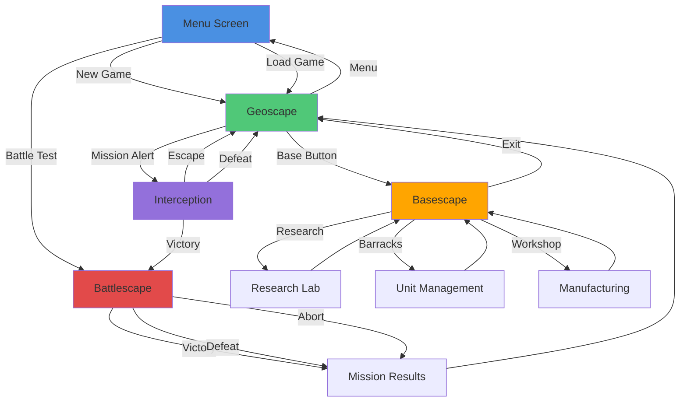
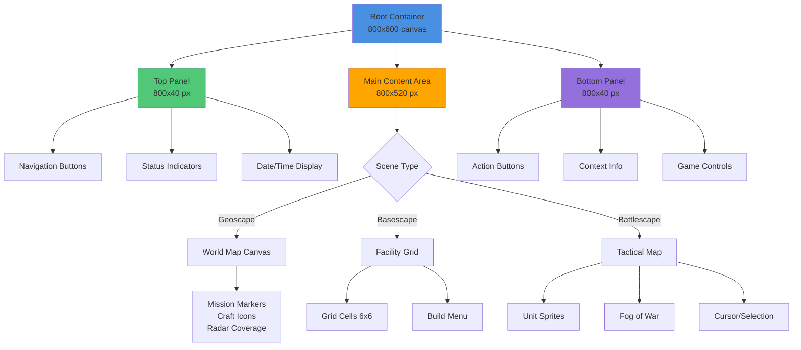
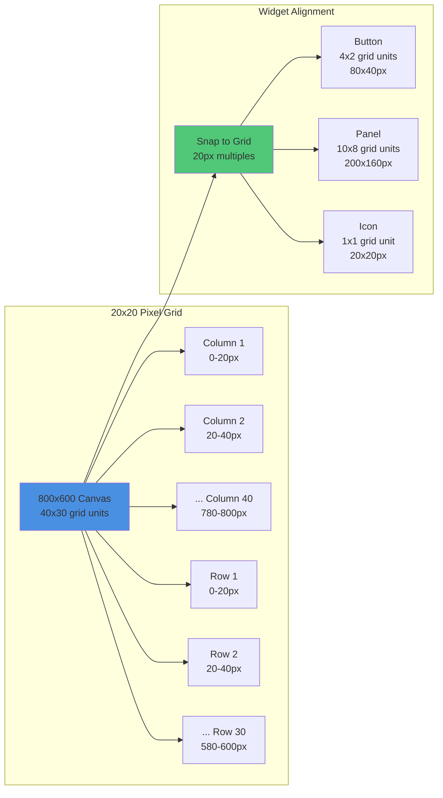

# GUI Design System

## Table of Contents
- [Overview](#overview)
- [Mechanics](#mechanics)
  - [Scene-Based Navigation Architecture](#scene-based-navigation-architecture)
  - [Shared Interface Elements](#shared-interface-elements)
  - [Layout and Interaction Systems](#layout-and-interaction-systems)
  - [Performance Optimization](#performance-optimization)
- [Examples](#examples)
  - [Strategic Resource Management](#strategic-resource-management)
  - [Tactical Combat Transition](#tactical-combat-transition)
  - [Economic Planning Session](#economic-planning-session)
- [Related Wiki Pages](#related-wiki-pages)
- [References to Existing Games and Mechanics](#references-to-existing-games-and-mechanics)

## Overview

The GUI Design System for Alien Fall establishes a cohesive user interface framework built around five core screens that seamlessly integrate strategic and tactical gameplay modes. This system prioritizes intuitive navigation, visual consistency, and performance optimization while maintaining immersion in the XCOM-inspired turn-based strategy experience.

The five core screens are:

- **Geoscape**: Turn-based strategic world map management for missions, crafts, provinces, and global operations.
- **Basescape**: Base management for facilities, units, research, and resources within individual bases.
- **Interception**: Tactical craft battles against UFOs, sites, or alien bases.
- **Battlescape**: Turn-based land combat between units and enemy forces.
- **Menu**: Game options, new game setup, and exit functionality.

Each screen (except Menu) features a top panel with buttons to switch between subscreens, allowing deep navigation within each operational context. The core philosophy centers on minimal UI intrusion during active gameplay, with contextual information appearing precisely when and where needed. This approach allows players to focus on strategic decision-making and tactical execution while providing immediate access to critical information through persistent status indicators and modal overlays.

---

## GUI Architecture Diagrams

### Screen Navigation Flow

### Widget Hierarchy

### Layout Grid System

---

## Mechanics

### Scene-Based Navigation Architecture
The interface organizes gameplay into five distinct scenes that correspond to different operational contexts, each with dedicated subscreens accessible via top panel buttons:

- **Geoscape Scene**: Strategic world map management with subscreens for:
  - World map with missions, crafts, and provinces
  - Manufacturing global view
  - Research global view
  - Special map modes for countries, regions, and analytics
  - Reports (budget, scoring, funding, charts)
  - Government (company politics, karma/fame summary)
  - Diplomacy (faction relations, supplier contacts, country relations)
  - Quests (game progress, ongoing quests, goals)
  - World switching (up to 4 worlds)

- **Basescape Scene**: Base management interface with subscreens for:
  - Build new facilities in the current base
  - Barracks (units management, equipment, training, promotion)
  - Hangars (crafts management, equipment, promotion, unit assignment)
  - Prison (live captives management)
  - Hospital (unit healing, sanity, transformations)
  - Research laboratory
  - Workshop manufacturing
  - Marketplace (buy/sell, black market)
  - Transfer (move items, units, crafts to other bases)
  - Reports (base-specific information and capacity summaries)
  - Base switching (up to 12 bases)

- **Interception Scene**: Tactical craft deployment with energy management and positioning mechanics (detailed in separate documentation)

- **Battlescape Scene**: Turn-based land combat with a bottom panel containing:
  - Four order buttons (WATCH, CROUCH, WAIT, ???)
  - Unit image display
  - Unit stats panel
  - Three item buttons (weapons and armor)
  - Menu and end turn buttons

- **Menu Scene**: Game options with buttons for:
  - NEW GAME
  - BATTLE
  - OPTIONS
  - EXIT

Each scene maintains consistent navigation patterns while adapting interface elements to the specific gameplay mode, ensuring players can quickly orient themselves regardless of context switches. The top panel buttons provide seamless subscreen transitions within each operational context.

### Detailed Screen Interfaces

Each core screen has detailed specifications in dedicated files:

- **Geoscape Subscreens**: World Map (default), Manufacturing, Research, Map Modes, Reports, Government, Diplomacy, Quests, World Switch. See [Geoscape UI Specification](Geoscape.md).
- **Basescape Subscreens**: Build, Barracks, Hangars, Prison, Hospital, Research, Workshop, Marketplace, Transfer, Reports, Base Switch. See [Basescape UI Specification](Basescape.md).
- **Battlescape Interface**: Bottom panel with order buttons, unit portrait, stats, item slots, menu and end turn. See [Battlescape UI Specification](Battlescape.md).
- **Interception Interface**: Engagement canvas, craft status, command deck, timeline. See [Interception UI Specification](Interception.md).
- **Menu Screen**: New Game, Battle Test, Archives, Options, Mod Manager, Exit. See [Menu and Meta UI Specification](MenuAndMeta.md).

### Shared Interface Elements
Persistent UI components provide continuity across all scenes:
- Top Panel: Universal navigation bar displaying current date, funding levels, and quick-access buttons for scene transitions
- Status Indicators: Real-time displays of critical resources, ongoing operations, and alert notifications
- Modal Overlays: Contextual information windows that appear for confirmations, detailed statistics, and strategic planning

See [Widget Library](../widgets/README.md) for detailed shared components, widgets, and accessibility frameworks.

### Design Principles
- **Clarity over decoration:** Prioritise legible information density aligned to the 20×20 grid.
- **Deterministic feedback:** Surface seeds, timers, or thresholds that explain outcomes whenever relevant.
- **Modularity:** Compose screens from reusable widgets so behaviour stays consistent across states.

### Interaction Standards
- **Focus management:** Define keyboard focus order per screen; wrap-around navigation is permitted.
- **Hover/active states:** All interactive elements ship with idle/hover/pressed visuals adhering to theme tokens.
- **Confirmations:** Critical actions trigger modal confirmation summarising consequences and RNG scope.
- **Undo support:** Where feasible (facility placement, manufacturing queues), support undo/redo with bounded history.
- **Equipment management:** Left-click for drag-and-drop, right-click for quick actions (assign/remove).

### Accessibility Framework
- **Text scaling:** Allow increments of 0.1× up to 2.0× with live layout reflow.
- **Colour-blind support:** Provide presets for protanopia, deuteranopia, and tritanopia via theme tokens.
- **Screen reader integration:** Publish ARIA-like labels to the optional narration system.
- **Motion reduction:** Offer a toggle that replaces animated transitions with fades.

### Layout and Interaction Systems
The GUI employs a grid-based design system with 20x20 pixel units for precise alignment and scaling:
- Grid Snap: Every widget snaps to the 20x20 logical grid; placement values must be multiples of 20 to prevent sub-pixel drift in Love2D
- Sprite Sourcing: Visual assets are authored at 10x10 pixels and rendered at 2.0x scale to preserve clarity while matching the logical grid
- Responsive Scaling: Interface elements adapt to different screen resolutions while maintaining pixel-perfect aesthetics
- Input Handling: Comprehensive support for mouse, keyboard, and gamepad controls with customizable key bindings
- Accessibility Features: High-contrast options, adjustable font sizes, and keyboard navigation for all interface elements

### Performance Optimization
The system prioritizes rendering efficiency to maintain 60 FPS gameplay:
- Asset Management: Texture atlases and sprite batching reduce draw calls
- Element Pooling: Reusable UI components minimize memory allocation during scene transitions
- Lazy Loading: Interface elements load on-demand to optimize initial scene loading times

## Examples

### Strategic Resource Management
During a Geoscape session, the top panel displays funding at 1,247,000 credits with a low-resource warning indicator. Players can switch to the Reports subscreen to view detailed budget breakdowns, scoring metrics, and funding trend charts. Hovering over a base icon reveals modal overlays with construction progress (75% complete on a new laboratory) and estimated completion time (2 days, 14 hours). The Government subscreen provides access to company politics configuration and karma/fame summaries. Status indicators flash when new missions become available on the World Map subscreen, prompting immediate strategic decision-making through the Diplomacy subscreen for faction relations management.

### Tactical Combat Transition
When transitioning from Interception to Battlescape, the interface smoothly animates from craft positioning to unit deployment on the tactical grid. The Battlescape bottom panel activates with order buttons (WATCH, CROUCH, WAIT) for unit control, displaying the selected unit's image and stats. Three item buttons allow quick access to weapons and armor. Contextual tooltips appear when selecting units, showing accuracy modifiers, movement ranges, and special abilities without obstructing the grid. The menu and end turn buttons provide access to additional tactical options and phase progression.

### Economic Planning Session
In Basescape mode, the Build subscreen presents facility construction with drag-and-drop planning for expanding base capabilities. Progress bars animate construction completion in real-time. The Workshop subscreen manages manufacturing operations and production queues, with resource flow diagrams visualizing production chains. Alert notifications appear when research projects complete in the Research subscreen, offering immediate allocation of newly discovered technologies. The Marketplace subscreen enables buying/selling operations, including black market access, while the Transfer subscreen handles logistics for moving resources between up to 12 bases. The Reports subscreen provides base-specific capacity summaries and operational metrics.

## Related

### Scene Management Integration
The GUI system directly interfaces with the game's scene management mechanics, ensuring smooth transitions between operational contexts. Each scene change preserves relevant game state while updating interface elements to reflect current objectives and available actions.

### Data Binding Systems
Interface elements automatically synchronize with underlying game data, creating a live representation of strategic and tactical conditions. This binding ensures that funding displays, unit status indicators, and progress bars always reflect current game state without manual updates.

### Event-Driven Notifications
The GUI responds to game events through a comprehensive notification system. Mission detections trigger visual alerts, construction completions generate progress updates, and combat outcomes produce detailed outcome summaries that guide subsequent strategic decisions.

### Modding and Customization
The GUI framework supports extensive modding through configurable layout templates and theme systems. Modders can create custom interface elements, adjust color schemes, and implement new status indicators while maintaining consistency with the core design system.

### Performance Monitoring
Built-in performance tracking ensures the interface maintains target frame rates across different hardware configurations. Memory usage monitoring and rendering optimization tools help maintain smooth gameplay even with extensive custom content.

## Related Wiki Pages

- [Geoscape UI Specification](Geoscape.md) - Detailed layout and interaction rules for the strategic layer
- [Basescape UI Specification](Basescape.md) - Facilities, staffing, and logistics interface flows
- [Battlescape UI Specification](Battlescape.md) - Tactical HUD, actions, and feedback systems
- [Interception UI Specification](Interception.md) - Craft engagement controls and telemetry
- [Menu and Meta UI Specification](MenuAndMeta.md) - Front-end menus, options, and archives
- [Widget Library](../widgets/README.md) - Shared widgets, accessibility, and notifications
- [Geoscape Overview](../geoscape/World.md) - Strategic world map interface and operations
- [Battlescape Overview](../battlescape/README.md) - Tactical combat interface and mechanics
- [Basescape Overview](../basescape/README.md) - Base management interface and facilities
- [Interception Overview](../interception/Overview.md) - Craft deployment and interception mechanics
- [Modding Guide](../technical/Modding.md) - Interface customization and modding systems
- [Widgets Library](../widgets/Widgets.md) - UI component library (in LOVE folder)
- [Technical Documentation](../technical/README.md) - Technical implementation details

## References to Existing Games and Mechanics

- **XCOM Series**: Strategic geoscape and tactical battlescape UI design
- **Civilization Series**: Complex strategic interface with multiple information layers
- **Total War Series**: Detailed battle UI with unit management and terrain display
- **Crusader Kings Series**: Intricate family tree and realm management interfaces
- **Stellaris**: Information-dense galactic interface with multiple view modes
- **Hearts of Iron Series**: Complex management UI with timeline and event systems
- **Europa Universalis Series**: Detailed strategic interface with diplomatic and economic displays
- **Fire Emblem Series**: Clean tactical UI with unit stats and ability displays
- **Final Fantasy Tactics**: Turn-based combat interface with job and equipment systems
- **Advance Wars**: Streamlined tactical interface with resource and unit management