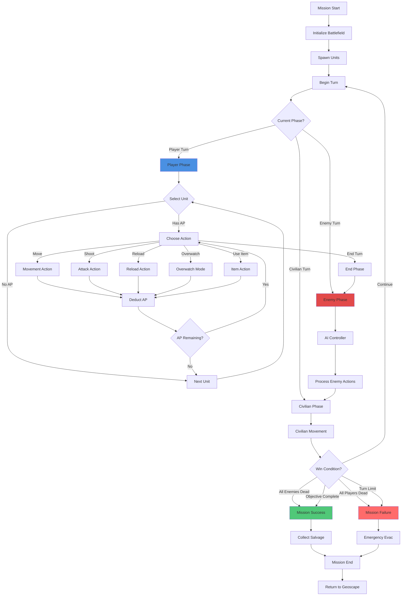
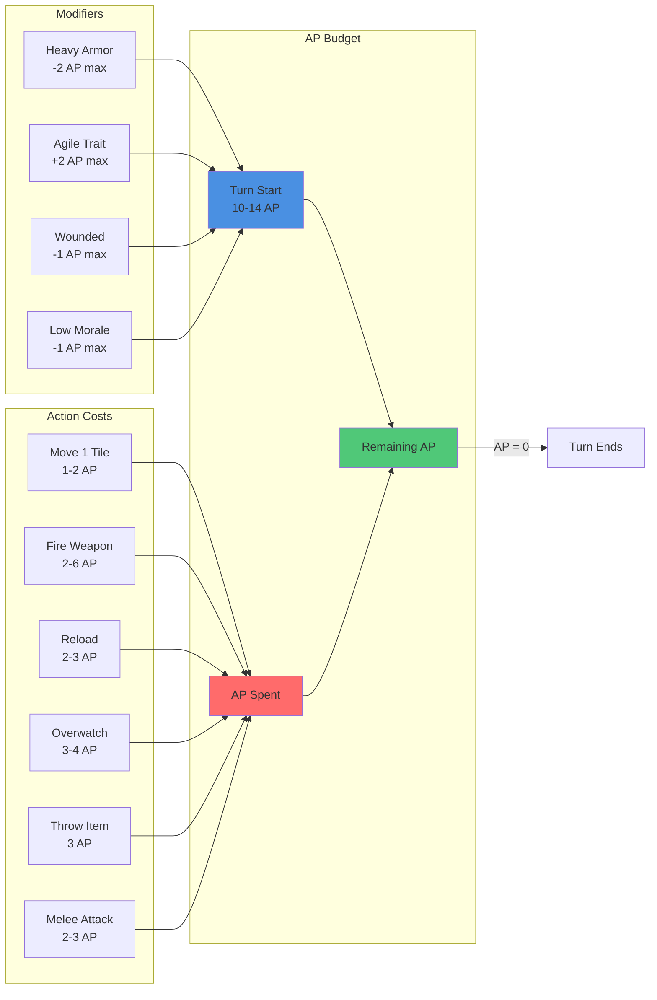
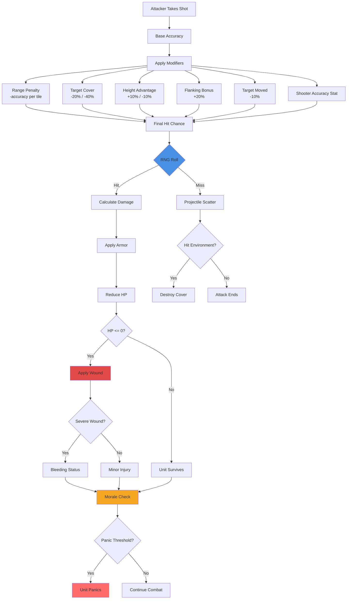
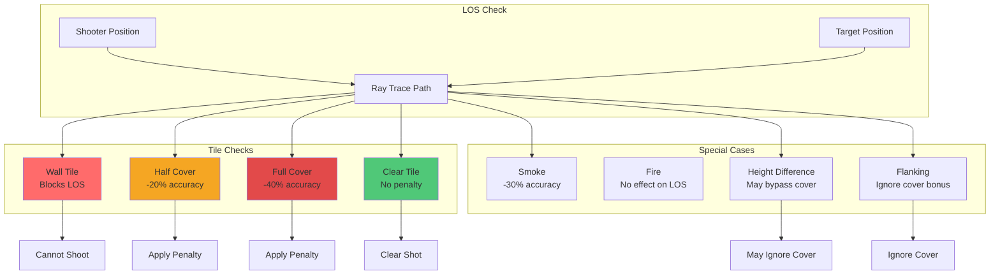

# Battlescape Overview

> **Purpose:** Describe the deterministic tactical layer and the hooks required to implement it inside the Love2D engine.

## Role in AlienFall
- Resolve ground combat in a readable, turn-based format that rewards positioning and squad management.
- Feed strategic layers with deterministic outcomes: wounds, salvage, morale, and experience.
- Showcase environmental storytelling using reusable map blocks authored at 10×10 pixels and scaled ×2.

## Player / Design Goals
- **Fair information:** Fog-of-war is predictable; line-of-sight preview always matches outcome.
- **Meaningful positioning:** Cover, elevation, and suppressive fire offer tangible advantages and trade-offs.
- **Tempo control:** Action Point budgets and morale effects create suspense without overwhelming micromanagement.

## System Boundaries
- Covers map generation, unit actions, AI behaviour, morale, wounds, environmental hazards, and post-mission salvage.
- Interfaces with items (weapons, armour), units (stats, traits), economy (salvage ➜ manufacturing), and basescape (injury recovery).
- Interception transitions deliver initial squads, spawn points, and objectives.

---

## Battlescape System Diagrams

### Combat Turn Flow

### Action Point System

### Combat Resolution Flow

### Line of Sight & Cover System

---

## Documentation Structure

This battlescape documentation is organized into the following subdirectories for easier navigation:

### [core/](./core/)
Fundamental battlescape concepts and core mechanics:
- [Battlefield.md](./core/Battlefield.md) - Complete tactical combat area definition
- [Battle side.md](./core/Battle%20side.md) - Combatant factions and sides
- [Battle size.md](./core/Battle%20size.md) - Map dimensions and scaling

### [map/](./map/)
Map generation, blocks, tiles, and grid systems:
- [Battle Grid.md](./map/Battle%20Grid.md) - Detailed tactical battlefield grid
- [Battle Map generator.md](./map/Battle%20Map%20generator.md) - Map generation pipeline
- [Battle map.md](./map/Battle%20map.md) - Overall map structure
- [Battle tile.md](./map/Battle%20tile.md) - Individual tactical cells
- [Map Blocks.md](./map/Map%20Blocks.md) - Building blocks for maps
- [Map scripts.md](./map/Map%20scripts.md) - Assembly rules for map creation
- And more map-related documentation...

### [units/](./units/)
Unit mechanics, actions, and squad management:
- [Unit actions.md](./units/Unit%20actions.md) - Available unit actions
- [Unit Distribution.md](./units/Unit%20Distribution.md) - Unit placement logic
- [Unit.md](./units/Unit.md) - Unit system overview
- [Squad Autopromotion.md](./units/Squad%20Autopromotion.md) - Squad progression

### [combat/](./combat/)
Combat mechanics, damage, and weapon systems:
- [Accuracy at Range.md](./combat/Accuracy%20at%20Range.md) - Range-based accuracy
- [Action - Movement.md](./combat/Action%20-%20Movement.md) - Movement mechanics
- [Action - Overwatch.md](./combat/Action%20-%20Overwatch.md) - Overwatch system
- [Line of sight.md](./combat/Line%20of%20sight.md) - Vision and targeting
- And more combat-related documentation...

### [mechanics/](./mechanics/)
Core battlescape mechanics and systems:
- [Physics.md](./mechanics/Physics.md) - Box2D physics integration for bullets, explosions, and collision detection
- And more mechanics documentation...

### [environment/](./environment/)
Terrain, lighting, and environmental effects:
- [Biome.md](./environment/Biome.md) - Environmental themes
- [Terrain.md](./environment/Terrain.md) - Terrain types and effects
- [Smoke & Fire.md](./environment/Smoke%20&%20Fire.md) - Environmental hazards
- [Lighting & Fog of War.md](./environment/Lighting%20&%20Fog%20of%20War.md) - Visibility systems
- And more environmental documentation...

### [mission/](./mission/)
Objectives, deployment, and mission mechanics:
- [Deployment Zones.md](./mission/Deployment%20Zones.md) - Player deployment areas
- [Mission objectives.md](./mission/Mission%20objectives.md) - Victory conditions
- [Spawn Point.md](./mission/Spawn%20Point.md) - Unit spawn locations
- And more mission-related documentation...

### [ai/](./ai/)
AI systems, behavior, and psychological mechanics:
- [Morale.md](./ai/Morale.md) - Morale system and effects
- [Panic.md](./ai/Panic.md) - Panic and fear mechanics
- [Psionics.md](./ai/Psionics.md) - Psychic abilities and effects
- [Map Node AI.md](./ai/Map Node%20AI.md) - AI pathfinding and decision making
- [Strategic Level AI.md](./ai/Strategic%20Level%20AI.md) - Mission-level AI coordination
- [Squad Level AI.md](./ai/Squad%20Level%20AI.md) - Unit squad coordination and tactics
- [Individual Unit AI.md](./ai/Individual%20Unit%20AI.md) - Personal unit decision making
- [Unit Behavior Types.md](./ai/Unit%20Behavior%20Types.md) - Specialized behaviors for different unit types
- [Map Discovery and Exploration AI.md](./ai/Map%20Discovery%20and%20Exploration%20AI.md) - Fog of war and exploration
- [AI Movement Using Map Nodes.md](./ai/AI%20Movement%20Using%20Map%20Nodes.md) - Dynamic node-based navigation
- And more AI-related documentation...

## Battlescape Terminology and Generation

### Core Concepts Glossary

#### Province
- **Biome**: A definition that specifies the fauna, flora, and potential terrains for a province, influencing battlescape generation.
- **Terrain**: A specification of available map blocks and map scripts for generating battlefields in different provinces.

#### Blocks
- **Map Block**: A 15x15 grid of map tiles used as building blocks for assembling larger tactical maps.
- **Map Tile**: An individual cell in a map block, represented by a character, defining terrain or objects with links to visual graphics.
- **Map Script**: A script that contains rules for assembling map blocks into a coherent map grid layout.
- **Map Grid**: A 2D array of map blocks that defines the overall structure and size of a tactical map.

#### Battlefield
- **Battlefield**: The complete tactical combat area, consisting of the battle grid with all integrated game elements.
- **Battle Tile**: A single cell in the battle grid containing a map tile plus optional units, environmental effects (smoke/fire), objects, and fog of war state.
- **Battle Grid**: The detailed 2D array of battle tiles that forms the playable tactical battlefield, converted from the map grid.
- **Spawn Point**: The initial position where a unit is placed on the battlefield, distributed to ensure proper spacing.
- **Unit**: A selectable entity that occupies a single battle tile and participates in tactical combat.
- **Map Node AI**: The AI priority value assigned to each map block, determining unit distribution and behavior patterns for different battle sides.

#### Deployment
- **Unit Distribution**: The process of placing units across map blocks based on mission faction power and AI priority values.
- **Deployment Zones**: Special map blocks designated for player unit deployment, with the number increasing based on map size.
- **Fog of War**: A visibility system that limits player knowledge of enemy positions and movements on the battlefield.
- **Objects**: Static or interactive elements placed on the battlefield, such as cover, destructible items, or environmental features.
- **Smoke/Fire Effects**: Visual and gameplay effects that can obscure vision, damage units, or create tactical opportunities.
- **Tileset**: A PNG image file containing multiple tile graphics, referenced by map tiles for visual rendering.

### Battlefield Creation Process

The battlescape generation follows a structured pipeline that transforms high-level strategic decisions into detailed tactical battlefields:

#### 1. Strategic Context Establishment
- **Biome Selection**: The province's biome determines the environmental theme and available terrain types
- **Terrain Configuration**: Terrain definitions provide the pool of map blocks and map scripts available for the region
- **Mission Parameters**: Faction power levels and unit rosters are established based on the strategic situation

#### 2. Map Generation Phase
- **Map Script Execution**: The selected map script runs its assembly rules to create a coherent map grid layout
- **Map Block Assembly**: Individual 15x15 map blocks are combined according to the script's rules and size requirements (4x4 to 7x7 blocks)
- **Deployment Zone Assignment**: Special map blocks are marked for player deployment, with more zones available on larger maps

#### 3. AI and Unit Setup Phase
- **AI Checkpoint Assignment**: Each map block receives priority values for different battle sides (ally, neutral, enemy), creating strategic zones
- **Unit Distribution**: Based on faction power budgets and AI priorities, units are allocated to specific map blocks
- **Spawn Point Calculation**: Within each map block, valid spawn locations are identified for unit placement

#### 4. Battlefield Assembly Phase
- **Battle Grid Formation**: The map grid is converted to a detailed battle grid, with each map tile becoming an interactive battle tile
- **Unit Placement**: Units are positioned at calculated spawn points, ensuring proper spacing and tactical positioning
- **Environmental Effects Application**: Fog of war is initialized, smoke/fire effects are placed, and objects are distributed
- **Visual and Gameplay Integration**: Tilesets provide visual variety while maintaining consistent gameplay mechanics

#### 5. Integration Phase
- **Geoscape Connection**: The completed battlefield is linked to the active mission and strategic context
- **Combat Readiness**: All systems are initialized and the battlefield is prepared for tactical gameplay
- **Dynamic Updates**: The battlefield can respond to ongoing mission events and player actions

This process ensures that each battlescape is unique while maintaining strategic coherence with the geoscape layer, providing varied and challenging tactical experiences within the Alien Fall gameplay framework.

## Mechanics / Implementation
### Tactical Grid & Movement
- Maps are 40×30 logical tiles at 800×600 resolution; each tile = 20×20 pixels.
- Movement uses Action Points (AP) with deterministic costs for orthogonal/diagonal steps and terrain multipliers.
- Path preview displays AP cost, morale risk (if applicable), and exposure changes.

### Combat Resolution
- Accuracy uses banded range tables per weapon. Each band references deterministic modifiers (cover, stance, suppression).
- Damage pipeline: hit confirmation ➜ damage roll ➜ armour mitigation ➜ wound roll ➜ status effects.
- Reactive fire (Overwatch) reserves AP and uses the same deterministic checks as active fire.

### Environmental Systems
- Map blocks authored as 10×10 sprites combine into 20×20 logical tiles with metadata (cover value, material, elevation, flammability).
- Smoke, fire, and destruction update tile metadata in deterministic order (spread, dissipate, collapse).
- Day/Night lighting adjusts vision radii and colour grading without altering the underlying grid alignment.

### Morale, Panic, and Psionics
- Morale meter ranges 0–100; thresholds trigger panic, berserk, or surrender states.
- Psionics consume Mind Energy, interact with morale, and can induce sanity damage tracked for post-battle recovery.
- All checks pull from encounter seed `mission:<id>` to remain reproducible.

### Post-Mission Flow
- Salvage tables read the map’s tag set (e.g., `urban`, `alien_base`) and surviving inventory.
- Wounds convert mission damage into strategic recovery time via deterministic tables defined in `data/battlescape/wounds.toml`.

### Grid & Visual Standards
- Tile size: 20×20 logical pixels. Sprites: 10×10 art scaled ×2.
- UI elements such as action buttons align to the same grid (see [GUI spec](../GUI.md)).
- Camera scroll uses increments of 10 pixels to avoid sub-pixel shimmering.

## Data & Events
- **Primary Catalogs:** `data/battlescape/maps.toml`, `blocks.toml`, `actions.toml`, `morale.toml`, `wounds.toml`, `environment.toml`, `accuracy.toml`, `objectives.toml`.
- **Services:** `battlescape/map_generator.lua`, `battlescape/action_system.lua`, `battlescape/morale_system.lua`, `battlescape/environment_system.lua`, `units/stats_system.lua`.
- **Events:** `battlescape:turn_started`, `battlescape:unit_action`, `battlescape:environment_tick`, `battlescape:mission_end`, `battlescape:unit_status_changed`.

## Integration Hooks
- **State Stack:** Battlescape state owns `update`, `draw`, and input handlers in Love2D. It uses a camera snapped to 20×20 increments.
- **Data Tables:** `data/battlescape/*.toml` drive action costs, morale thresholds, environmental propagation, and salvage calculations.
- **Event Bus:** Major events propagate to Debriefing, Economy, Unit, and Telemetry services via the names above.
- **Serialization:** Save after every player turn with compressed action history for deterministic replays.

## Master References

📖 **For comprehensive system documentation, see:**
- **[Action Economy](../core/Action_Economy.md)** - Complete AP system and action costs across all game layers
- **[Time Systems](../core/Time_Systems.md)** - Time scale definitions including tactical 6-second turns

The Battlescape uses tactical-level time (6-second turns) with 4 AP per turn. For understanding how this integrates with:
- Operational time (30-second rounds in air combat)
- Strategic time (5-minute ticks on geoscape)
- Time conversions and display formats

Please refer to the master documents linked above.

## Related Reading
- [AI README](../ai/README.md)
- [Items README](../items/README.md)
- [Units README](../units/README.md)
- [Interception README](../interception/README.md)
- [Economy README](../economy/README.md)

## Tags
`#battlescape` `#grid20x20` `#love2d` `#determinism`
