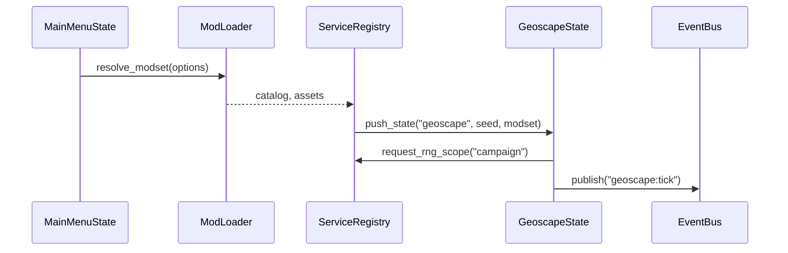

# Architecture Spine

> **Purpose:** Provide a concise jump-off for engineers implementing AlienFall in Love2D. Pair this with [`Love2D_Implementation_Plan.md`](../Love2D_Implementation_Plan.md) for deeper breakdowns and subsystem specifics.

## Snapshot
- **Engine Entry:** `LOVE/main.lua` bootstraps services, resolves enabled mods, then pushes `MainMenuState` on the state stack.
- **Determinism:** Namespaced RNG scopes (`campaign`, `director`, `mission`, `actor`) must be requested through `services/rng.lua`; never call `math.random` directly.
- **Data Layout:** TOML catalogs live under `data/` with schemas mirrored by Lua domain tables. Loader responsibility sits with `services/data_registry.lua`.
- **Rendering Contract:** UI and maps operate on a 20×20 logical grid with 10×10 source sprites scaled ×2 at draw time.

## State Stack Overview
| State | Responsibilities | Key Events Published | Dependent Services |
|-------|------------------|-----------------------|--------------------|
| `MainMenuState` | Menu navigation, mod selection, settings | `menu:new_campaign`, `menu:load_campaign` | Registry, ModLoader, SaveService |
| `GeoscapeState` | Time slicing, mission scheduling, craft launches | `geoscape:tick`, `geoscape:mission_spawned`, `geoscape:mission_expired` | TimeService, MissionScheduler, EconomyService, NotificationFeed |
| `BasescapeState` | Facility layout, staffing, manufacturing queues | `basescape:facility_started`, `basescape:monthly_report_ready` | BaseGrid, ServiceGraph, EconomyService |
| `InterceptionState` | 3×3 engagement resolution | `interception:round_resolved`, `interception:craft_destroyed` | EncounterModel, ActionResolver, Audio (optional) |
| `BriefingState` | Squad selection, deployment prep | `briefing:mission_confirmed` | LoadoutService, MissionCatalog |
| `BattlescapeState` | Tactical loop, action resolution, salvage tally | `battlescape:turn_started`, `battlescape:unit_action`, `battlescape:mission_end` | MapGenerator, ActionSystem, MoraleSystem, Telemetry |
| `DebriefingState` | Outcome summary, rewards routing | `debriefing:resolved` | EconomyService, UnitService |

States push/pop via `StateStack` helpers: `push(name, payload)`, `replace(name, payload)`, `pop(result?)`. Payloads should be serializable tables (no functions) to protect determinism.

## Service Registry
| Service | Module | Primary Role | Notes |
|---------|--------|--------------|-------|
| `EventBus` | `services/event_bus.lua` | Publish/subscribe across subsystems | Payloads must be plain tables; no userdata. |
| `RngService` | `services/rng.lua` | Scoped RNG handles with provenance logging | Returns objects implementing `:random()`, `:shuffle(list)`. |
| `TimeService` | `services/time.lua` | Deterministic cron scheduler (Geoscape days, hours, minutes) | Drives `geoscape:tick` cadence and monthly crons. |
| `ModLoader` | `mods/loader.lua` | Resolve dependencies, merge catalogs, register assets | Emits diagnostics on conflicts; see technical README. |
| `DataRegistry` | `services/data_registry.lua` | Typed access to TOML-derived catalogs | Augments entries with `source_mod`. |
| `SaveService` | `services/save.lua` | Serialize/deserialize campaign state | Writes to Love2D save directory. |
| `Telemetry` | `services/telemetry.lua` | Record deterministic event log | Optional in release builds; always on in dev. |
| `EconomyService` | `economy/economy_service.lua` | Credits, debt, research/manufacturing timers | Consumes events from Geoscape and Basescape. |

Services register themselves in `services/registry.lua` and expose `init(registry)`, `update(dt)`, and `shutdown()` where applicable.

## Data ➜ Domain ➜ State Flow
```mermaid
digraph Flow {
  rankdir=LR;
  Data[TOML Catalogs] -> Loader[ModLoader]
  Loader -> Registry[DataRegistry]
  Registry -> Services[Domain Services]
  Services -> States
  States -> EventBus
  EventBus -> Services
  Telemetry -> Saves
}
```

- **Catalog ingestion:** ModLoader parses TOML files, validates against schemas (see upcoming `docs/style-guide.md`), and merges them into typed tables.
- **Domain services:** Geoscape, Battlescape, and Economy modules hydrate domain objects from DataRegistry snapshots, never holding references to raw TOML.
- **Event propagation:** All cross-system coordination runs through EventBus topics (e.g., `economy:funding_paid`).

## Sequence Highlights
### New Campaign Bootstrap


### Mission Lifecycle (Condensed)
```mermaid
digraph Mission {
  rankdir=LR;
  MissionSeed -> Scheduler[label="MissionScheduler"];
  Scheduler -> Detection[label="DetectionSystem"];
  Detection -> Interception[label="InterceptionState"];
  Interception -> Battlescape[label="BattlescapeState"];
  Battlescape -> Debrief[label="DebriefingState"];
  Debrief -> Economy[label="EconomyService"];
}
```

## Implementation Checklist
- [ ] Services expose clear contracts in `technical/README.md` and this spine references them. (Update when new service lands.)
- [ ] Every state documents entry payload and exit payload in its module comment.
- [ ] New events are appended to the event catalogue in `integration/README.md`.
- [ ] Telemetry records: state transitions, RNG scopes, mission outcomes.

Tags: `#architecture` `#love2d` `#services` `#state-stack`
