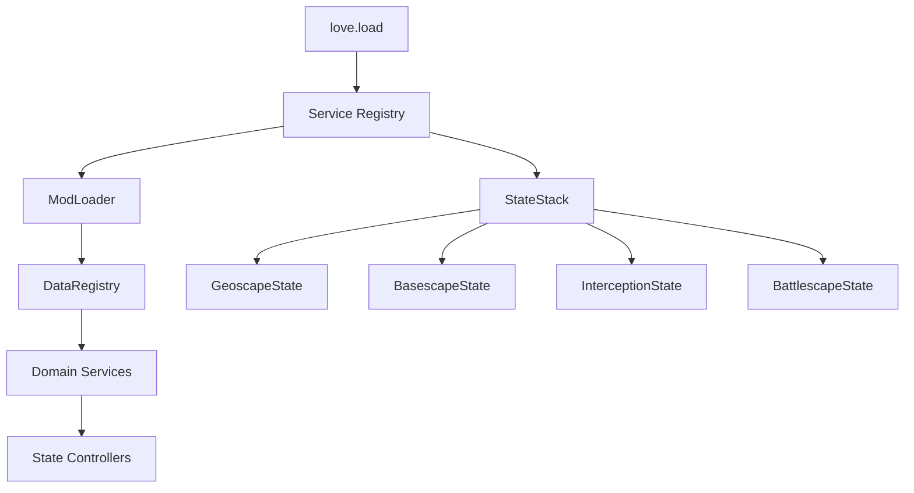
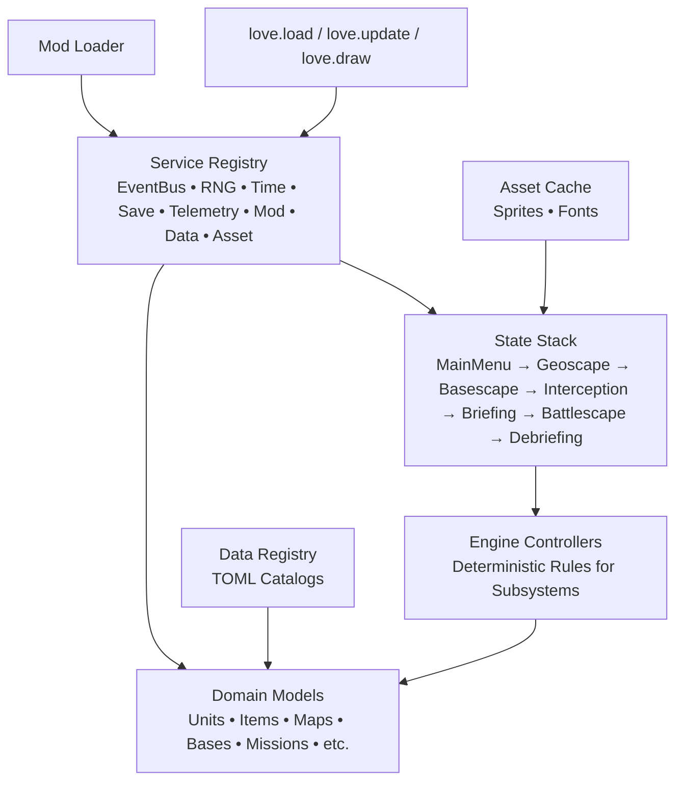
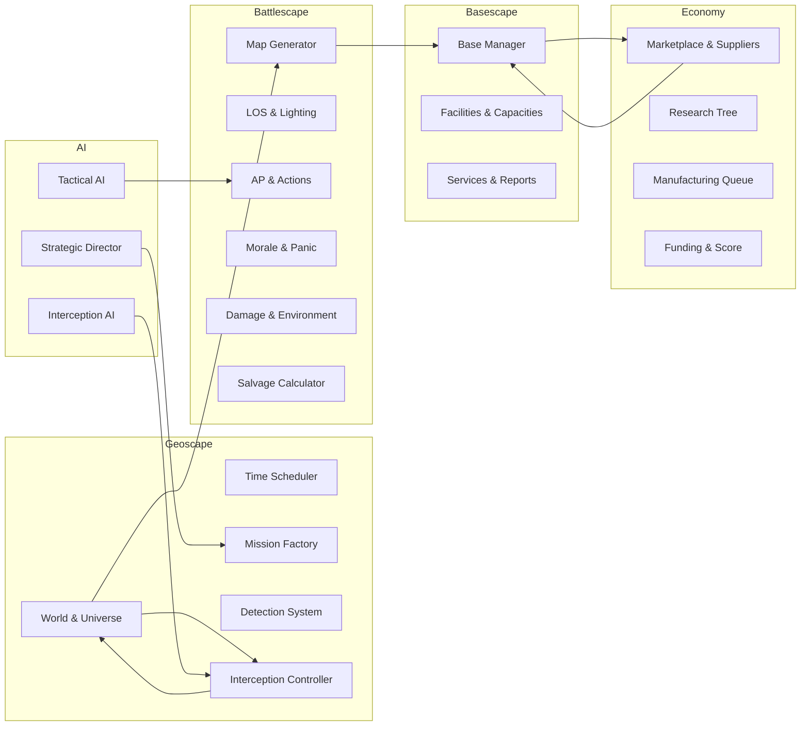
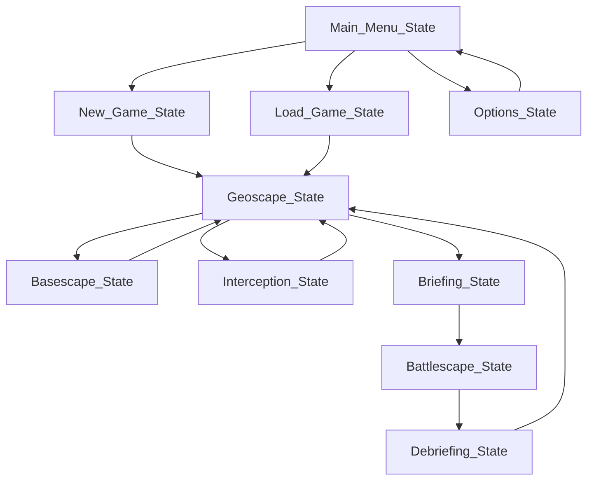
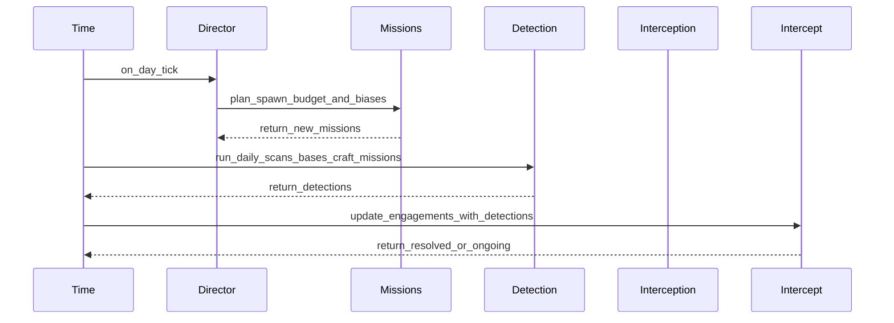
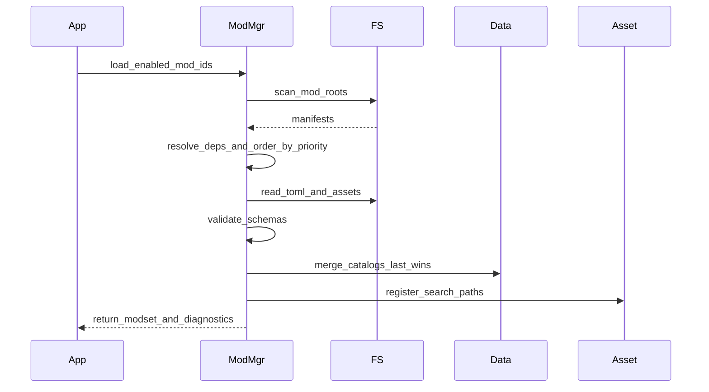
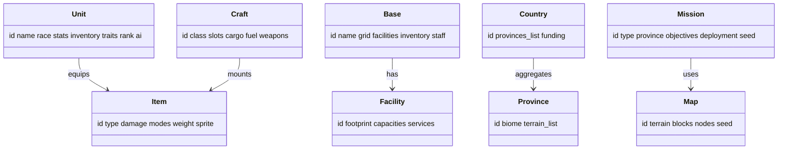

# AlienFall Love2D Imp- [8. Staffing & Collaboration Notes](#8-staffing--collaboration-notes)
- [9. Risks & Mitigations](#9-risks--mitigations)mentation Plan

> **Scope**: Ship AlienFall as a deterministic, moddable, X-COM-inspired strategy game using Love2D (Lua 5.1+) for desktop platforms only, with engine code separated from mod-delivered TOML/Lua content, low-resolution pixel art, and no bundled audio. Open source single-player game with no monetization or user tracking.

## Table of Contents
- [1. Vision and Context](#1-vision-and-context)
- [2. Architecture Spine](#2-architecture-spine)
- [3. Module Implementation Blueprint](#3-module-implementation-blueprint)
  - [3.1 Engine Kernel & Shared Services](#31-engine-kernel--shared-services)
  - [3.2 Mod System & Data Authoring](#32-mod-system--data-authoring)
  - [3.3 Geoscape Directorate](#33-geoscape-directorate)
  - [3.4 Basescape Operations](#34-basescape-operations)
  - [3.5 Economy & Research Bureau](#35-economy--research-bureau)
  - [3.6 Interception Command](#36-interception-command)
  - [3.7 Battlescape Tactics](#37-battlescape-tactics)
    - [3.7.1 Units, Crafts & Items System](#371-units-crafts--items-system)
    - [3.7.2 Lore & Narrative System](#372-lore--narrative-system)
  - [3.8 Lore & Narrative Directorate](#38-lore--narrative-directorate)
  - [3.9 Organization & Reputation Directorate](#39-organization--reputation-directorate)
  - [3.10 AI & Simulation Governance](#310-ai--simulation-governance)
  - [3.11 GUI & UX Framework](#311-gui--ux-framework)
  - [3.12 Telemetry, Saves & Tooling](#312-telemetry-saves--tooling)
- [4. Development Roadmap](#4-development-roadmap)
- [5. Testing & Quality Gates](#5-testing--quality-gates)
- [6. Tooling & Automation](#6-tooling--automation)
- [7. Love2D/Lua Development Resources](#7-love2dlua-development-resources)
- [8. Staffing & Collaboration Notes](#8-staffing--collaboration-notes)
- [8. Risks & Mitigations](#8-risks--mitigations)
- [Appendix A. Mermaid Diagrams](#appendix-a-mermaid-diagrams)
- [Appendix B. Reference Index](#appendix-b-reference-index)

## 1. Vision and Context
AlienFall follows the blueprint in `AF_WIKI/` and `architecture.md`, merging strategic geoscape management, deterministic tactical battlescape combat, base development, economy, and lore delivery. Inspirations explicitly include UFO: Enemy Unknown, Terror from the Deep, Phoenix Point, Jagged Alliance, Total War, and other references cited per subsystem notebooks.

**Open Source Single-Player Desktop Game**: Built exclusively for desktop platforms using Love2D, with no monetization, user tracking, or multiplayer features. Emphasizes moddability and community contributions through comprehensive documentation and tooling.

Guiding pillars:
- **Fully Turn-Based Gameplay**: All game screens operate on a turn-based system where 1 turn = 1 day. No real-time progression, animations, or continuous updates - all actions and events resolve instantly when the player ends their turn.
- **Deterministic simulation**: Every subsystem consumes namespaced RNG (campaign ➜ director ➜ mission ➜ actor) as defined in architecture §§2 and 4.
- **Mod-first content**: Engine ships a minimal `core` mod; the majority of missions, factions, equipment, and lore travel in TOML/Lua packages (see `AF_WIKI/technical/Modding.md`).
- **20×20 logical grid fidelity**: Geoscape, bases, and tactical scenes share tile metrics (10×10 art scaled ×2) per GUI specification.
- **Community-driven development**: Open source project encouraging contributions, mod creation, and community balancing through deterministic replay systems.
- **Desktop-only focus**: No mobile, web, or console considerations; optimized for desktop Love2D deployment on Windows, Linux, and macOS.

## 2. Architecture Spine
## 2. Architecture Spine
- **State Stack** (`StateStack` module): Pushdown automaton coordinating Menu → Geoscape → Basescape → Interception → Briefing → Battlescape → Debriefing. Derived from architecture §1.3.
- **Service Registry** (`services/registry.lua`): Instantiates singleton services (event bus, RNG, turn manager, save, telemetry, audio stub, asset cache) and exposes dependency injection.
- **ECS-inspired Domain** (`engine/domain/*.lua`): Lightweight tables representing units, facilities, missions, craft, items; mirrors schema in `AF_WIKI/*/*.md`.
- **Love2D Integration**: `main.lua` loads services, resolves enabled mods, and pushes `MainMenuState`. Update/draw callbacks delegate to the top of the stack; input handlers map to GUI actions defined in `AF_WIKI/GUI/*.md`.



## 3. Complete Solution File Structure

This section provides the comprehensive file/folder structure for the entire AlienFall Love2D implementation, covering all systems documented in AF_WIKI. The structure separates engine code from mod-delivered content, with deterministic data-driven design throughout.

### Root Project Structure
```
AlienFall/
├── main.lua                           # Love2D entry point, service initialization
├── conf.lua                           # Love2D configuration (window, modules)
├── README.md                          # Project documentation
├── LICENSE                            # Open source license
├── CHANGELOG.md                       # Version history
├── docs/                              # Implementation documentation
│   ├── architecture.md                # System architecture overview
│   ├── modding_guide.md               # Mod creation documentation
│   ├── data_formats.md                # TOML/Lua data structure specs
│   └── testing_guide.md               # Testing methodologies
├── src/                               # Engine source code (Love2D/Lua)
│   ├── engine/                        # Core engine systems
│   │   ├── kernel/                    # Fundamental services
│   │   │   ├── event_bus.lua          # Publish/subscribe messaging
│   │   │   ├── rng.lua                # Namespaced random number generation
│   │   │   ├── turn_manager.lua          # Turn-based progression (1 turn = 1 day)
│   │   │   ├── save.lua               # YAML/TOML hybrid serialization
│   │   │   ├── telemetry.lua          # Deterministic event logging
│   │   │   ├── asset_cache.lua        # Sprite atlas/texture management
│   │   │   └── audio_stub.lua         # Audio placeholder (no audio)
│   │   ├── domain/                    # ECS-inspired data models
│   │   │   ├── unit.lua               # Unit entity definition
│   │   │   ├── craft.lua              # Craft entity definition
│   │   │   ├── facility.lua           # Base facility entity
│   │   │   ├── mission.lua            # Mission entity definition
│   │   │   ├── item.lua               # Equipment item entity
│   │   │   └── faction.lua            # Faction entity definition
│   │   └── states/                    # Love2D state management
│   │       ├── state_stack.lua        # Pushdown automaton
│   │       ├── main_menu_state.lua    # Title screen
│   │       ├── geoscape_state.lua     # Strategic layer
│   │       ├── basescape_state.lua    # Base management
│   │       ├── interception_state.lua # Dogfight resolution
│   │       ├── briefing_state.lua     # Mission preparation
│   │       ├── battlescape_state.lua  # Tactical combat
│   │       └── debriefing_state.lua   # Mission results
│   ├── mods/                          # Mod system implementation
│   │   ├── loader.lua                 # Dependency resolution
│   │   ├── catalog_merger.lua         # Data table merging
│   │   ├── hook_runner.lua            # Mod hook execution
│   │   └── validator.lua              # Mod integrity checking
│   ├── geoscape/                      # Strategic layer systems
│   │   ├── world_model.lua            # 80×40 hex grid management
│   │   ├── universe_manager.lua       # Multi-world campaign support
│   │   ├── world_time.lua             # Turn-based time progression (1 turn = 1 day)
│   │   ├── illumination.lua           # Day/night cycle calculations
│   │   ├── pathfinder.lua             # A* routing for craft movement
│   │   ├── mission_scheduler.lua       # Deterministic mission spawning
│   │   ├── radar_system.lua           # Detection coverage calculations
│   │   ├── craft_manager.lua          # Fleet sortie management
│   │   ├── region_manager.lua         # Province grouping logic
│   │   ├── country_ledger.lua         # Funding calculation engine
│   │   ├── biome_service.lua          # Terrain type management
│   │   ├── portal_manager.lua         # Inter-world travel gates
│   │   ├── notification_feed.lua      # Event messaging system
│   │   ├── detection_system.lua       # Sensor coverage mechanics
│   │   ├── craft_operations.lua       # Movement fuel calculations
│   │   ├── terrain_selector.lua       # Biome-weighted map selection
│   │   ├── mission_generator.lua      # Map script coordination
│   │   └── base_layout_integrator.lua # Defense mission sourcing
│   ├── basescape/                     # Base management systems
│   │   ├── facility_grid.lua          # 20×20 tile placement logic
│   │   ├── service_graph.lua          # Power/comms dependency chains
│   │   ├── capacity_tracker.lua       # Storage/living/workshop limits
│   │   ├── report_generator.lua       # Monthly base analytics
│   │   ├── expansion_manager.lua      # New base founding mechanics
│   │   ├── construction_queue.lua     # Build order management
│   │   ├── overflow_policy.lua        # Resource limit handling
│   │   ├── facility_manager.lua       # Health/damage systems
│   │   ├── organization_integrator.lua # Fame/karma effects
│   │   └── personnel_manager.lua      # Staffing and recruitment
│   ├── economy/                       # Economic systems
│   │   ├── economy_service.lua        # Credits/debt/funding core
│   │   ├── research_tree.lua          # DAG prerequisite management
│   │   ├── research_manager.lua       # Lab allocation and queues
│   │   ├── manufacturing_system.lua   # Production capacity management
│   │   ├── manufacturing_project.lua  # Man-hour tracking
│   │   ├── capacity_allocator.lua      # Workshop distribution
│   │   ├── supplier_catalog.lua       # Market refresh mechanics
│   │   ├── transfer_manager.lua       # Logistics movement timers
│   │   ├── finance_service.lua        # Debt/score calculations
│   │   ├── monthly_reports.lua        # Deterministic finance analytics
│   │   ├── score_system.lua           # Reputation tracking
│   │   └── marketplace.lua            # Transaction processing
│   ├── interception/                  # Dogfight systems
│   │   ├── encounter_model.lua        # 3×3 grid zone management
│   │   ├── action_resolver.lua        # Manoeuvre resolution
│   │   ├── outcome_handler.lua        # Crash/escape consequences
│   │   ├── energy_manager.lua         # Craft power systems
│   │   ├── weapon_runtime.lua         # Projectile travel mechanics
│   │   ├── detection_system.lua       # Ambush mechanics
│   │   ├── transition_handler.lua     # Land battle handoff
│   │   └── landing_zone_generator.lua # Crash site creation
│   ├── battlescape/                   # Tactical combat systems
│   │   ├── map_generator.lua          # Deterministic terrain creation
│   │   ├── los_system.lua             # Line-of-sight calculations
│   │   ├── action_system.lua          # AP/energy management
│   │   ├── accuracy_system.lua        # Range/falloff mechanics
│   │   ├── overwatch_system.lua       # Reactive fire mechanics
│   │   ├── morale_system.lua          # Will test and panic states
│   │   ├── environment_system.lua     # Smoke/fire propagation
│   │   ├── objective_system.lua       # Win/loss condition tracking
│   │   ├── enemy_deployment.lua       # Unit spawn mechanics
│   │   ├── concealment_system.lua     # Stealth budget mechanics
│   │   ├── tile_system.lua            # Terrain interaction
│   │   ├── turn_manager.lua           # Initiative and phase control
│   │   ├── salvage_calculator.lua     # Post-battle loot generation
│   │   ├── movement_system.lua        # AP consumption calculations
│   │   ├── action_catalog.lua         # Available action definitions
│   │   └── wound_system.lua           # Damage/health mechanics
│   ├── lore/                          # Narrative systems
│   │   ├── campaign_system.lua        # Wave scheduling mechanics
│   │   ├── event_system.lua           # Monthly interruption logic
│   │   ├── quest_system.lua           # Narrative gating mechanics
│   │   ├── faction_system.lua         # Adversary management
│   │   ├── mission_system.lua         # Spawn lifecycle control
│   │   ├── calendar_system.lua        # Time progression master
│   │   ├── ufo_script_system.lua      # Behavioral pattern execution
│   │   ├── enemy_base_system.lua      # Persistent threat management
│   │   └── narrative_integrator.lua   # Story state coordination
│   ├── organization/                  # Reputation systems
│   │   ├── organization_service.lua   # Central coordination
│   │   ├── fame_system.lua            # Visibility tracking
│   │   ├── karma_system.lua           # Moral alignment mechanics
│   │   ├── policy_system.lua          # Slot-based directives
│   │   ├── company_system.lua         # Tier progression
│   │   └── reputation_integrator.lua  # Cross-system effects
│   ├── ai/                            # Simulation systems
│   │   ├── director.lua               # Strategic AI coordination
│   │   ├── interception_controller.lua # Dogfight AI
│   │   ├── battlescape_controller.lua # Tactical AI
│   │   ├── blackboard.lua             # Squad coordination memory
│   │   ├── utility_scorer.lua         # Decision evaluation
│   │   └── personality_loader.lua     # AI behavior profiles
│   ├── gui/                           # User interface systems
│   │   ├── common/                    # Shared UI components
│   │   │   ├── button.lua             # Interactive elements
│   │   │   ├── panel.lua              # Container widgets
│   │   │   ├── scrollbar.lua          # Navigation controls
│   │   │   ├── tooltip.lua            # Information displays
│   │   │   └── meter.lua              # Progress indicators
│   │   ├── geoscape/                  # Strategic UI
│   │   │   ├── world_map.lua          # Province visualization
│   │   │   ├── radar_overlay.lua      # Detection display
│   │   │   ├── mission_panel.lua      # Active mission tracking
│   │   │   ├── time_controls.lua      # Turn advancement controls
│   │   │   └── notification_feed.lua  # Event messaging
│   │   ├── basescape/                 # Base management UI
│   │   │   ├── facility_grid.lua      # Build placement interface
│   │   │   ├── staff_roster.lua       # Personnel management
│   │   │   ├── production_queue.lua   # Manufacturing display
│   │   │   ├── research_tree.lua      # Tech progression view
│   │   │   └── monthly_report.lua     # Analytics dashboard
│   │   ├── interception/              # Dogfight UI
│   │   │   ├── grid_display.lua       # 3×3 zone visualization
│   │   │   ├── craft_status.lua       # Fleet condition display
│   │   │   ├── energy_meters.lua      # Power tracking
│   │   │   └── event_timeline.lua     # Action sequencing
│   │   ├── battlescape/               # Tactical UI
│   │   │   ├── unit_portraits.lua     # Soldier representation
│   │   │   ├── action_menu.lua        # Command selection
│   │   │   ├── inventory_panel.lua    # Equipment management
│   │   │   ├── los_overlay.lua        # Visibility display
│   │   │   └── turn_indicator.lua     # Initiative tracking
│   │   ├── organization/              # Reputation UI
│   │   │   ├── fame_meter.lua         # Visibility tracking
│   │   │   ├── karma_display.lua      # Moral alignment
│   │   │   ├── policy_cards.lua       # Directive management
│   │   │   └── company_progress.lua   # Tier advancement
│   │   └── lore/                      # Narrative UI
│   │       ├── campaign_tracker.lua   # Wave progress
│   │       ├── event_notifications.lua # Monthly interruptions
│   │       ├── quest_journal.lua      # Story progression
│   │       └── faction_relations.lua  # Adversary status
│   └── units/                         # Unit management systems
│       ├── stats_system.lua           # Combat calculations
│       ├── class_system.lua           # Role definitions
│       ├── equipment_system.lua       # Item management
│       ├── promotion_system.lua       # Advancement mechanics
│       ├── recruitment_system.lua     # Personnel acquisition
│       └── veterancy_system.lua       # Experience tracking
├── data/                              # Mod-delivered content (TOML)
│   ├── core/                          # Base game content
│   │   ├── geoscape/
│   │   │   ├── worlds.toml            # Planet definitions
│   │   │   ├── provinces.toml         # Geographic regions
│   │   │   ├── regions.toml           # Strategic groupings
│   │   │   ├── countries.toml         # Funding entities
│   │   │   ├── missions.toml          # Mission templates
│   │   │   ├── portals.toml           # Inter-world gates
│   │   │   ├── biomes.toml            # Terrain types
│   │   │   ├── terrains.toml          # Map generation rules
│   │   │   ├── craft_operations.toml  # Movement mechanics
│   │   │   └── detection.toml         # Sensor configurations
│   │   ├── basescape/
│   │   │   ├── facilities.toml        # Building definitions
│   │   │   ├── services.toml          # Infrastructure networks
│   │   │   ├── capacities.toml        # Resource limits
│   │   │   ├── monthly_reports.toml   # Analytics templates
│   │   │   ├── base_phases.toml       # Expansion stages
│   │   │   ├── overflow_policies.toml # Limit handling rules
│   │   │   └── facility_health.toml   # Damage systems
│   │   ├── economy/
│   │   │   ├── funding.toml           # Financial mechanics
│   │   │   ├── research.toml          # Tech progression
│   │   │   ├── manufacturing.toml     # Production systems
│   │   │   ├── suppliers.toml         # Market entities
│   │   │   ├── black_market.toml      # Covert trading
│   │   │   ├── transfers.toml         # Logistics rules
│   │   │   └── research_tree.toml     # DAG prerequisites
│   │   ├── finance/
│   │   │   ├── monthly_reports.toml   # Financial analytics
│   │   │   ├── funding.toml           # Country contributions
│   │   │   ├── debt.toml              # Interest mechanics
│   │   │   ├── score.toml             # Performance tracking
│   │   │   └── win_loss.toml          # Victory conditions
│   │   ├── interception/
│   │   │   ├── weapons.toml           # Armament systems
│   │   │   ├── addons.toml            # Craft modifications
│   │   │   ├── scenarios.toml         # Engagement types
│   │   │   ├── base_defense.toml      # Facility protection
│   │   │   ├── transitions.toml       # Battle handoff
│   │   │   └── underwater.toml        # Submarine combat
│   │   ├── battlescape/
│   │   │   ├── maps.toml              # Terrain definitions
│   │   │   ├── blocks.toml            # Map prefabs
│   │   │   ├── actions.toml           # Combat mechanics
│   │   │   ├── morale.toml            # Psychology systems
│   │   │   ├── damage_models.toml     # Hit calculations
│   │   │   ├── wounds.toml            # Injury mechanics
│   │   │   ├── salvage.toml           # Loot generation
│   │   │   ├── movement.toml          # AP consumption
│   │   │   ├── los.toml               # Visibility rules
│   │   │   ├── environment.toml       # Hazard propagation
│   │   │   ├── accuracy.toml          # Range mechanics
│   │   │   ├── overwatch.toml         # Reactive fire
│   │   │   ├── objectives.toml        # Win conditions
│   │   │   ├── deployments.toml       # Spawn mechanics
│   │   │   └── lighting.toml          # Visibility effects
│   │   ├── lore/
│   │   │   ├── campaigns.toml         # Wave scheduling
│   │   │   ├── events.toml            # Monthly interruptions
│   │   │   ├── quests.toml            # Story progression
│   │   │   ├── factions.toml          # Adversary definitions
│   │   │   ├── missions.toml          # Spawn templates
│   │   │   ├── calendar.toml          # Time mechanics
│   │   │   ├── ufo_scripts.toml       # Behavioral patterns
│   │   │   └── enemy_bases.toml       # Threat progression
│   │   ├── organization/
│   │   │   ├── reputation.toml        # Fame/karma scales
│   │   │   ├── policies.toml          # Directive definitions
│   │   │   ├── company.toml           # Tier progression
│   │   │   ├── fame_sources.toml      # Visibility mechanics
│   │   │   └── karma_sources.toml     # Moral consequences
│   │   ├── units/
│   │   │   ├── stats.toml             # Combat attributes
│   │   │   ├── classes.toml           # Role definitions
│   │   │   ├── equipment.toml         # Item specifications
│   │   │   ├── promotions.toml        # Advancement paths
│   │   │   ├── recruitment.toml       # Personnel acquisition
│   │   │   └── veterancy.toml         # Experience systems
│   │   ├── crafts/
│   │   │   ├── stats.toml             # Vehicle attributes
│   │   │   ├── classes.toml           # Chassis types
│   │   │   ├── weapons.toml           # Armament systems
│   │   │   ├── fuel.toml              # Energy mechanics
│   │   │   ├── inventory.toml         # Cargo capacity
│   │   │   └── salaries.toml          # Crew compensation
│   │   ├── items/
│   │   │   ├── weapons.toml           # Firearm specifications
│   │   │   ├── armor.toml             # Protection systems
│   │   │   ├── ammo.toml              # Munition types
│   │   │   ├── medical.toml           # Healing items
│   │   │   ├── tools.toml             # Utility equipment
│   │   │   └── artifacts.toml         # Alien technology
│   │   └── ai/
│   │       ├── personalities.toml     # Behavior profiles
│   │       ├── utility_weights.toml   # Decision factors
│   │       └── director_weights.toml  # Strategic priorities
│   └── mods/                          # Mod-specific overrides
│       └── <mod_id>/                  # Individual mod content
├── assets/                            # Static game assets
│   ├── sprites/                       # 10×10 pixel art sprites
│   │   ├── units/                     # Character portraits
│   │   ├── crafts/                    # Vehicle representations
│   │   ├── facilities/                # Base building icons
│   │   ├── items/                     # Equipment visuals
│   │   ├── terrain/                   # Map tile graphics
│   │   ├── ui/                        # Interface elements
│   │   └── effects/                   # Visual effects
│   ├── atlases/                       # Sprite sheet collections
│   │   ├── ui_atlas.png              # Interface spritesheet
│   │   ├── terrain_atlas.png         # Map tiles spritesheet
│   │   └── units_atlas.png           # Character spritesheet
│   ├── fonts/                         # Pixel-perfect typography
│   │   ├── ui_font.ttf               # Interface text
│   │   └── title_font.ttf            # Menu/display text
│   └── palettes/                      # Color scheme definitions
│       ├── ui_colors.toml            # Interface theming
│       └── faction_colors.toml       # Adversary identification
├── tests/                             # Comprehensive test suite
│   ├── spec/                          # RSpec-style unit tests
│   │   ├── engine/                    # Core system validation
│   │   │   ├── event_bus_spec.lua     # Messaging system tests
│   │   │   ├── rng_spec.lua           # Randomness validation
│   │   │   ├── time_spec.lua          # Scheduler accuracy
│   │   │   ├── save_spec.lua          # Persistence integrity
│   │   │   └── telemetry_spec.lua     # Logging completeness
│   │   ├── geoscape/                  # Strategic layer tests
│   │   │   ├── world_model_spec.lua   # Grid management
│   │   │   ├── pathfinder_spec.lua    # Routing algorithms
│   │   │   ├── radar_spec.lua         # Detection calculations
│   │   │   └── time_spec.lua          # Progression mechanics
│   │   ├── battlescape/               # Tactical combat tests
│   │   │   ├── los_spec.lua           # Visibility calculations
│   │   │   ├── accuracy_spec.lua      # Range mechanics
│   │   │   ├── morale_spec.lua        # Psychology systems
│   │   │   └── action_spec.lua        # AP management
│   │   ├── economy/                   # Economic system tests
│   │   │   ├── research_spec.lua      # DAG validation
│   │   │   ├── manufacturing_spec.lua # Production throughput
│   │   │   ├── finance_spec.lua       # Budget calculations
│   │   │   └── supplier_spec.lua      # Market mechanics
│   │   ├── lore/                      # Narrative system tests
│   │   │   ├── campaign_spec.lua      # Wave scheduling
│   │   │   ├── event_spec.lua         # Monthly interruptions
│   │   │   ├── quest_spec.lua         # Story progression
│   │   │   └── mission_spec.lua       # Spawn mechanics
│   │   ├── organization/              # Reputation tests
│   │   │   ├── fame_spec.lua          # Visibility tracking
│   │   │   ├── karma_spec.lua         # Moral alignment
│   │   │   ├── policy_spec.lua        # Directive mechanics
│   │   │   └── company_spec.lua       # Tier progression
│   │   └── integration/               # Cross-system validation
│   │       ├── campaign_flow_spec.lua # End-to-end scenarios
│   │       ├── save_load_spec.lua     # Persistence integrity
│   │       └── determinism_spec.lua  # Reproducibility checks
│   ├── fixtures/                      # Test data and scenarios
│   │   ├── campaigns/                 # Campaign test cases
│   │   ├── battles/                   # Combat scenarios
│   │   ├── economies/                 # Financial situations
│   │   └── worlds/                    # Map configurations
│   ├── helpers/                       # Test utility functions
│   │   ├── rng_stubs.lua             # Deterministic randomness
│   │   ├── time_mocks.lua            # Scheduler control
│   │   └── state_builders.lua        # Test state creation
│   └── performance/                   # Performance benchmarks
│       ├── memory_usage.lua          # Memory consumption tests
│       ├── frame_rate.lua            # Rendering performance
│       └── simulation_speed.lua      # Calculation throughput
├── tools/                             # Development utilities
│   ├── mod_validator.lua              # Mod integrity checking
│   ├── data_compiler.lua              # TOML optimization
│   ├── sprite_packer.lua              # Atlas generation
│   ├── map_validator.lua              # Terrain verification
│   ├── balance_tuner.lua              # Parameter adjustment
│   └── replay_analyzer.lua            # Provenance inspection
├── mods/                              # User-created modifications
│   ├── core/                          # Base game mod structure
│   │   ├── manifest.toml              # Mod metadata
│   │   ├── data/                      # Mod-specific content
│   │   └── scripts/                   # Custom logic
│   └── examples/                      # Sample modifications
│       ├── high_difficulty/           # Increased challenge
│       ├── new_faction/               # Custom adversaries
│       ├── expanded_research/         # Additional technology
│       └── custom_campaign/           # Alternative storylines
├── saves/                             # Player save data (generated)
│   ├── campaigns/                     # Campaign save files
│   ├── screenshots/                   # User captures
│   └── telemetry/                     # Performance logs
└── build/                             # Build artifacts (generated)
    ├── windows/                       # Windows distribution
    ├── linux/                         # Linux distribution
    ├── macos/                         # macOS distribution
    └── web/                           # Web deployment (future)
```

### Data Structure Specifications

#### Core Entity Schemas (TOML)
All entities follow consistent TOML structure with required/optional fields:

**Unit Definition Schema:**
```toml
[[units]]
id = "soldier_rifleman"
display_name = "Rifleman"
class = "rifleman"
stats = { health = 100, aim = 60, will = 50 }
equipment = ["rifle_assault", "armor_basic"]
cost = 20000
maintenance = 500
tags = ["human", "military"]
```

**Craft Definition Schema:**
```toml
[[crafts]]
id = "interceptor_basic"
display_name = "Firestorm"
class = "interceptor"
stats = { speed = 2000, armor = 80, fuel = 1000 }
weapons = ["cannon_20mm"]
capacity = { crew = 2, passengers = 8 }
cost = 800000
maintenance = 2000
tags = ["air", "military"]
```

**Facility Definition Schema:**
```toml
[[facilities]]
id = "workshop_basic"
display_name = "Workshop"
footprint = { width = 2, height = 2 }
services = ["fabrication"]
capacities = { workshop_hours = 100 }
cost = 150000
maintenance = 1000
requirements = ["power", "living_quarters"]
tags = ["production", "industrial"]
```

**Mission Template Schema:**
```toml
[[missions]]
id = "ufo_scout"
type = "ufo"
faction = "sectoid_directorate"
difficulty = "easy"
duration = 168  # hours
cover = 50
rewards = { score = 100, salvage = "alien_materials" }
script = "scout_patrol"
tags = ["air", "reconnaissance"]
```

**Research Entry Schema:**
```toml
[[research]]
id = "laser_weapons"
display_name = "Laser Weapons"
category = "weapons"
cost = 500
prerequisites = ["basic_energy", "advanced_optics"]
unlocks = ["laser_rifle", "laser_cannon"]
description = "Directed energy weapons technology"
tags = ["energy", "combat"]
```

**Event Definition Schema:**
```toml
[[events]]
id = "regional_boom"
display_name = "Regional Economic Boom"
scope = "province"
weight = 2.0
month_min = 1
month_max = 999
filters = { biome = "urban", economy_value = { min = 50 } }
effects = [
  { type = "province_modifier", target = "economy_value", operation = "multiply", value = 1.5, duration = 90 }
]
tags = ["economic", "positive"]
```

**Faction Definition Schema:**
```toml
[[factions]]
id = "sectoid_directorate"
display_name = "Sectoid Directorate"
race = "sectoid"
behavior = "aggressive"
regions = ["north_america", "europe"]
mission_templates = ["ufo_scout", "ufo_abduction", "base_construction"]
unit_pools = ["sectoid_soldier", "sectoid_leader"]
rewards = { score = 500, research = "sectoid_tech" }
tags = ["alien", "insectoid", "psionic"]
```

**Policy Definition Schema:**
```toml
[[policies]]
id = "rapid_response"
display_name = "Rapid Response Protocol"
category = "operations"
slots_required = 1
company_level_min = 2
requirements = ["advanced_hangar"]
effects = [
  { type = "interception_success", operation = "add", value = 20 },
  { type = "fuel_consumption", operation = "multiply", value = 1.3 },
  { type = "monthly_cost", operation = "add", value = 10000 }
]
trade_offs = ["Increased fuel consumption", "Higher maintenance costs"]
tags = ["military", "logistics"]
```

### Configuration File Standards

**Game Configuration (config/defaults.toml):**
```toml
[graphics]
resolution = [1600, 900]
fullscreen = false
vsync = true
pixel_scale = 2

[gameplay]
difficulty = "normal"
autosave_interval = 300  # seconds
ui_scale = 1.0

[modding]
enabled_mods = ["core"]
mod_validation = true

[debug]
show_fps = false
telemetry_enabled = true
determinism_checks = true
```

**User Options (User_Options.toml):**
```toml
[controls]
key_bindings = { move_up = "W", move_down = "S" }

[accessibility]
colorblind_mode = false
high_contrast = false

[performance]
max_fps = 60
texture_filtering = "nearest"
```

### Asset Organization Standards

**Sprite Naming Convention:**
- `unit_rifleman_idle.png` - Character sprites
- `craft_interceptor_flying.png` - Vehicle sprites  
- `facility_workshop_construction.png` - Building sprites
- `terrain_grass_center.png` - Map tiles
- `ui_button_normal.png` - Interface elements

**Atlas Structure:**
- 10×10 pixel base sprites
- 2× scaling for display (20×20 effective)
- Consistent padding between sprites
- Power-of-two dimensions for optimization

### Testing Framework Standards

**Unit Test Structure:**
```lua
describe("Research Tree System", function()
  it("should validate DAG prerequisites", function()
    local tree = ResearchTree:new()
    assert.is_true(tree:validate_prerequisites("laser_weapons"))
  end)
  
  it("should prevent cyclic dependencies", function()
    local tree = ResearchTree:new()
    assert.has_error(function()
      tree:add_cyclic_prerequisite("tech_a", "tech_b")
    end)
  end)
end)
```

**Integration Test Structure:**
```lua
describe("Campaign Flow", function()
  it("should complete basic mission sequence", function()
    local campaign = Campaign:new("test_campaign")
    campaign:start()
    
    -- Simulate player actions
    campaign:complete_mission("ufo_scout")
    campaign:advance_time(24) -- hours
    
    assert.is_true(campaign:is_complete())
  end)
end)
```

This comprehensive file structure covers all systems documented in AF_WIKI, providing a complete blueprint for the AlienFall Love2D implementation with clear separation between engine code, mod content, assets, and testing infrastructure.
Each subsection summarises responsibilities, Lua modules/classes, data tables, GUI surfaces, and validation strategy. Sources are called out explicitly from AF_WIKI.

### 3.1 Engine Kernel & Shared Services
**Responsibilities**
- Provide deterministic infrastructure (event bus, RNG scopes, time scheduler, save system) for all states.
- Manage sprite atlases, texture batches, font caches, and global configuration.

**Key Lua Modules**
- `services/event_bus.lua`: publish/subscribe with deterministic queue flushing per frame.
- `services/rng.lua`: namespace factory (`rng:getScope("geoscape:mission")`).
- `services/turn_manager.lua`: Turn-based progression system (1 turn = 1 day) coordinating all game screens.
- `services/save.lua`: YAML/TOML hybrid serializer storing modset hashes.
- `services/telemetry.lua`: Collects decisions, seeds, and outcomes (architecture §12).

**Data Inputs**
- `config/defaults.toml`; user overrides in `User_Options.toml`.
- `mods/<id>/manifest.toml` for enabled mod list.

**Testing Hooks**
- Unit tests for deterministic ordering (`spec/services/event_bus_spec.lua`).
- Property tests verifying `rng:getScope` yields repeatable sequences given same lineage.
- Save/load round-trip tests with multiple mod combinations.

### 3.2 Mod System & Data Authoring
**References**: `AF_WIKI/technical/Modding.md`, architecture §3.

**Responsibilities**
- Load TOML manifests, resolve dependencies, merge data catalogs (merge/replace/append), register assets.
- Provide mod hook API with constrained actions executed via event bus.

**Key Lua Modules**
- `mods/loader.lua`: dependency resolution, manifest validation.
- `mods/catalog_merger.lua`: merges data tables keyed by `id` fields.
- `mods/hook_runner.lua`: executes declarative hook actions (modify, grant, emit).

**Data Sources**
- `data/**.toml` per subsystem (units, missions, facilities, research, etc.).
- Hook specs (YAML/TOML) calling into actions defined in `AF_WIKI/technical/HookDSL.md`.

**UI**
- Menu scene exposes `Mod Manager` (GUI/MenuAndMeta.md): list mods, show dependencies, enable/disable.

**Testing**
- Snapshot tests comparing merged catalogs against golden outputs.
- Validation CLI (`tools/validate_mod.lua`) executed per CI.
- Hook sandbox tests verifying only allowed actions execute and remain deterministic.

### 3.3 Geoscape Directorate
**Source Material**: `geoscape/README.md`, `geoscape/World.md`, `geoscape/Universe.md`, `geoscape/World time.md`.

**Responsibilities**
- Manage universe-level campaigns: per-world isolation, portal activation states, and cross-world logistics gates.
- Generate worlds: province graphs, biome assignment, hex pathfinding, illumination, radar coverage, craft routing.
- Maintain deterministic scheduler: 5-minute geoscape ticks with daily/weekly/monthly/quarterly/yearly hooks per `World time.md`.
- Interface with basescape (services, transfers), economy (funding, countries), interception (encounter handoff), organization (panic/politics).
- Track region weights, country funding levels, portal escalation, and seeded mission/portal events.

**Lua Modules & Classes**
- `states/geoscape_state.lua`: Love2D state controlling update/draw/input.
- `geoscape/world_model.lua`: 80×40 hex backdrop with 20×20 province grid projection; loads `worlds.toml`, `provinces.toml`.
- `geoscape/universe_manager.lua`: isolates per-world state, portal links, and world activation order.
- `geoscape/world_time.lua`: turn-based time progression implementing daily turns, named hooks (day/week/month/quarter/year), and turn counter persistence.
- `geoscape/illumination.lua`: longitude → solar angle calculations, generates day/night overlays and visibility modifiers.
- `geoscape/pathfinder.lua`: A* over globe tiles with biome/weather movement modifiers and cached route catalogues.
- `geoscape/mission_scheduler.lua`: deterministic deck draws per mission tags.
- `geoscape/radar_system.lua`: coverage checks using base services (`radar`, `satellite`, `signals`).
- `geoscape/craft_manager.lua`: sortie availability, fuel, maintenance timers.
- `geoscape/region_manager.lua`: region composition, spawn weighting, faction preferences, and dynamic weight adjustments.
- `geoscape/country_ledger.lua`: aggregates province score, converts public score → funding, tracks diplomatic state.
- `geoscape/biome_service.lua`: biome lookup, terrain weight bonuses, and economy-driven overrides for built environments.
- `geoscape/portal_manager.lua`: activation flow, stability rolls, capacity cooldowns, facility gating.
- `geoscape/notification_feed.lua`: event queue bound to GUI top panel (GUI/Geoscape.md).
- `geoscape/detection_system.lua`: Cover reduction calculations from `interception/Mission Detection and Assignment.md` (daily source passes, armor mitigation, sensor tags).
- `geoscape/craft_operations.lua`: Implements range checks, tile-path fuel consumption (500 km per globe tile) per `geoscape/Craft Operations.md`.
- `geoscape/terrain_selector.lua`: biome-weighted terrain selection, mission overrides, seeded determinism.
- `geoscape/mission_generator.lua`: terrain→map script resolution, block assembly coordination.
- `geoscape/base_layout_integrator.lua`: defense mission block sourcing from strategic base facilities.

**Data Tables**
- `data/geoscape/worlds.toml`, `provinces.toml`, `regions.toml`, `countries.toml`, `missions.toml`, `portals.toml`, `craft_operations.toml`.
- Biome and terrain weights (`data/geoscape/biomes.toml`, `terrain_sets.toml`) including economy bonus thresholds and mission tag filters.
- Scheduler hooks and calendar config (`data/geoscape/world_time.toml`) for day/week/month cadence, illumination thresholds.
- Region spawn weighting and faction preferences (`data/geoscape/region_weights.toml`, `faction_preferences.toml`).
- Detection configuration (`data/geoscape/detection.toml`) capturing power values for radar, airborne scouts, portal sensors, daily recovery rates, mission armor ratings.
- Craft performance tables (`data/crafts/stats.toml`, `fuel_range.toml`) defining speed, operational radius, fuel economy, allowable mission tags.
- Terrain definitions (`data/geoscape/terrains.toml`) with block weights, script assignments, biome mappings.
- Map blocks catalog (`data/battlescape/blocks.toml`) with geometry, anchors, seam metadata, tags.
- Map scripts library (`data/battlescape/scripts.toml`) with assembly recipes, validation rules.
- Universe configuration (`data/geoscape/universe.toml`) with world activation order, portal prerequisites.

**Province Data Structure** (per Province.md)
- Identity: id, display_name, world_id, coordinates (x, y pixel)
- Geographic: longitude (derived from x), biome, is_water, terrain_modifiers
- Economic: economy_value, population
- Strategic: region_id, country_id, tags (urban, coastal, etc.), control_state (neutral/player/alien)
- Mission: active_missions[], concurrent_limit, activity_level
- Adjacency: connected_province_ids[], path_costs{}

**World Generation** (per World.md)
- Pixel-to-km scaling: configurable ratio (default 25 pixels = 1 km)
- Hex grid: 80×40 tiles for pathfinding, independent of visual map
- Globe tiles: land/water with movement costs (land: 1-4, water: 1)
- Craft-specific routing: land vehicles avoid water, ships use coastal access, airplanes ignore terrain
- Province positioning: all provinces snapped to hex intersections
- Illumination: solar_angle = cos(world_rotation - longitude), day_fraction = clamp(solar_angle, -1, 1)

**Time Progression** (per World time.md)
- Turn structure: 1 turn = 1 day, week = 6 days, month = 30 days, quarter = 90 days, year = 360 days
- Turn resolution sequence: advance turn, calculate illumination, process missions/UFOs/travel, update simulations, dispatch events
- Named hooks: day_tick, week_tick, month_tick, quarter_tick, year_tick (data-driven, moddable)
- Inter-world travel: transit_days = portal_base + distance_modifier, decremented per turn, assets unavailable during transit

**Biome System** (per Biome.md)
- Assignment: seeded deterministic selection during world creation
- Terrain selection: weighted lists for map generation, economy bonuses for urban environments
- Mission filtering: biome tags restrict/allow mission types (ocean → naval only, underground → special detection)
- World-specific: custom biomes per planet (Cydonia on Mars, Europa ice caverns)
- Visual integration: color palettes for overlays, weather effects, UI feedback

**Region System** (per Region.md)
- Composition: explicit province lists, single-world containment
- Spawn weighting: base weights + runtime adjustments via events
- Faction preferences: per-faction multipliers for regional targeting
- Mission filtering: whitelist/blacklist by mission type and tags
- Aggregation: regional analytics for reports, telemetry, director inputs
- Events: localized, seeded modifications with persistence

**Country System** (per Country.md)
- Geography: authored province groups on Earth-like worlds
- Funding: economic_value_sum × funding_level × 1000 monthly
- Public score: visible actions (interceptions, terror prevention) convert to funding levels
- Political dynamics: poor performance reduces funding, triggers withdrawal/restrictions
- Data-driven: all thresholds and formulas in external config

**Portal Mechanics** (per Portal.md)
- Discovery/activation: research-gated, atomic state changes
- Travel: instant or minutes, bypasses adjacency, consumes fuel/transit_days
- Stability: failure rates, damage/crew injury/displacement risks
- Capacity: crafts per time period, cooldowns, size consumption
- Facilities: gateway/stabilizer/anchor buildings for access/reliability
- Control: ownership permissions, targeting rules, diplomatic effects
- Inter-world access: enables multi-world campaigns with per-world isolation (Universe.md)
- Transit policies: temporary deployment vs permanent rebasing, transit state persistence

**Terrain Selection & Mission Generation** (per Terrain.md)
- Biome-terrain mapping: weighted terrain lists per biome, seeded deterministic selection
- Map blocks: rectangular prefabs with geometry, cover, props, anchors, seam metadata
- Map scripts: data-driven recipes for block assembly (anchors → connect → large → small → validate)
- Mission overrides: forced terrain types for special missions (alien bases, underground ruins)
- Base integration: defense missions use player's strategic base layout as block source
- Validation: reachability, line-of-sight, seam compatibility checks with retry mechanisms

**Universe & Multi-World Campaigns** (per Universe.md)
- Campaign container: single playthroughs scaling across multiple worlds
- Per-world isolation: separate state for images, provinces, time, factions, rules
- Inter-world travel: portal-gated access with transit time, fuel costs, craft restrictions
- Forward bases: founding presence via transfers/rebasing with world-specific modifiers
- World overrides: unique sensor/travel/environmental rules per planet
- Processing determinism: cross-world transfers consume calendar days, persist across saves

**UI Surfaces** (per GUI spec)
- World Map: 20×20 grid with province markers, radar overlays, mission timers, day/night shading.
- Strategic panels: Region funding view, country diplomacy summary, coverage heatmaps, spawn weight diagnostics.
- Subscreens: Manufacturing, Research, Map Modes, Reports, Government, Diplomacy, Quests, World Switch, Portal Network.
- Time Controls: 1×/5×/30×, pause, step; aligned with top panel per widgets/Geoscape.md TimeControls widget; include UTC/day counter readouts.

**Testing Strategy**
- Seeded mission regression: given campaign seed + 30 days, mission deck outputs match golden log.
- World time cadence tests: validate daily/weekly/monthly/quarterly/yearly hook ordering and deterministic outputs.
- Illumination regression: province day/night overlays and visibility modifiers reproduce expected cosine curves for sample longitudes.
- Radar coverage unit tests: provinces inside/outside coverage produce deterministic detection.
- Craft sortie simulation tests: verify travel time, recovery timers, and event bus notifications using hex path costs and biome modifiers.
- Region and faction weighting tests: scripted events adjust spawn weights/prefs and telemetry logs confirm deterministic rebalancing.
- Portal stability simulations: repeated transits under varying stability/capacity configs produce expected failure outcomes and cooldowns.
- Detection math validation: Cover reduction = DetectionPower × (1 - Armor); ensure stacked sources and daily recovery reproduce wiki scenarios.
- Craft eligibility tests covering AIR/LAND/WATER compatibility, speed-limited mission caps, and fuel floor enforcement.
- Biome terrain selection tests: seeded generation produces expected terrain distributions with economy bonuses.
- Region aggregation tests: province data correctly sums to regional totals for funding and activity metrics.
- Country funding regression: public score changes produce expected monthly income adjustments.
- Portal transit tests: craft unavailable during transit, arrival triggers correct state updates.
- Terrain selection regression: biome weights produce expected terrain distributions with economy bonuses.
- Mission generation determinism: identical seeds produce identical map block assemblies.
- Base layout integration: defense missions accurately reflect strategic base facility positions.
- Universe isolation tests: per-world state remains separate, inter-world transfers work correctly.

### 3.4 Basescape Operations
**Sources**: `basescape/README.md`, `basescape/Facilities.md`, `basescape/Services.md`, `basescape/Capacities.md`, `basescape/Monthly base report.md`, `basescape/New Base building.md`, `GUI/Basescape.md`, `finance/Monthly reports.md`, `organization/README.md`, `units/README.md`.

**Responsibilities**
- Manage base grids (20×20 logical tiles), facility construction with footprints (multiples of 2 tiles), services graph with dependency chains, capacities with overflow policies, staffing with morale impacts (influenced by organization fame/karma), monthly reports with alert prioritization, base defense metadata; integrate organization mechanics (fame boosts recruitment quality/funding, karma unlocks ethical policies/events, policies provide operational bonuses/penalties).

**Lua Modules**
- `states/basescape_state.lua`: orchestrates base UI; subscribes to event bus for construction updates, facility damage, service changes.
- `bases/facility_grid.lua`: 20×20 placement logic, adjacency checks (HQ anchor, contiguous corridors), footprint validation (1×1 to 3×2 tiles).
- `bases/service_graph.lua`: propagates power, comms, medical, fabrication availability; handles dependency chains (facility declarations, failure triggers, cascading effects), fallback mechanics (primary failover, graceful degradation).
- `bases/capacity_tracker.lua`: storage (volume/space), living quarters (static slots), workshop hours (throughput); aggregation (sum of online facilities), allocation models (persistent/time-based consumption), overflow policies (block/queue/auto-sell/auto-transfer).
- `bases/report_generator.lua`: monthly summary with deterministic categorisation (critical/warning/info), sectional organization (executive/operations/financial/research/manufacturing/personnel/security), forward-looking projections, historical tracking; implements generation frameworks (seeded RNG for reproducibility), header/metadata systems (scope/period/generation timestamp), finance section (balance tracking, income/expense categorization, commitment tracking), score/funding integration (performance metrics, correlation tracking), fame/karma assessment (reputation tracking, ethical balance), resource flow analysis (movement/consumption/production/distribution), maintenance auditing (facility/equipment/personnel costs), forces summary (unit inventory, readiness, training), missions summary (operation tracking, success metrics, utilization), diagnostics (performance monitoring, bottleneck analysis), actions/control (quick access, workflow optimization).
- `bases/expansion_manager.lua`: base founding (territory requirements, control prerequisites), phases (planning/foundation/operational with deterministic durations), risk system (alien attacks, environmental hazards, sabotage).
- `bases/construction_queue.lua`: deterministic build timers, five-slot queue enforcement, adjacency dependency validation, facility sequencing (core first, then defensive/specialized).
- `bases/overflow_policy.lua`: handles `block`, `queue`, `auto_transfer`, `auto_sell` strategies for storage/services/capacities with configurable thresholds.
- `bases/facility_manager.lua`: health/damage system (HP pools, armor ratings, damage pipeline: incoming → armor mitigation → HP reduction), operational states (online/degraded/offline), maintenance scheduling.
- `bases/organization_integrator.lua`: applies fame/karma modifiers to morale/recruitment (high fame: +morale bonuses, better recruits; extreme karma: ethical event unlocks), policy effects on base operations (military focus: defense bonuses, science focus: research speed), subscribes to `org:fame_changed`, `org:karma_changed`, `org:policy_adopted` events.
- `bases/personnel_manager.lua`: manages unit assignments to facilities (staffing requirements), injury recovery scheduling (deterministic timers from units data), morale tracking (influenced by living quarters, recreation facilities), recruitment integration (monthly pools, salary deductions), progression handling (experience from missions, promotions).

**Data Tables**
- `data/bases/facilities.toml`, `services.toml`, `capacities.toml`, `base_phases.toml`, `monthly_reports.toml`, `overflow_policies.toml`, `facility_health.toml`.
- Facility footprints (multiples of 2 tiles), corridor sprites (1×1 tiles), service tags (#power, #research, #medical, #defense); morale/recreation bonuses, tactical integration (map block linking, special tiles).
- Service categories (core/operational/support/defensive), dependency chains, capacity limits, staffing requirements, efficiency modifiers.
- Capacity types (static slots/volume/throughput), aggregation rules, allocation models, overflow policies (block/queue/auto-sell/auto-transfer).
- Monthly report templates (sectional organization: executive/operations/financial/research/manufacturing/personnel/security, alert prioritization: critical/warning/info, forward projections, historical tracking), generation config (timing on day 1, seeded RNG scope `finance:<month>`, multi-scope support: global/per-world/per-region/per-country/per-faction/per-base), export formats (CSV/JSON/compressed bundles), provenance tracking (computed_from metadata with tickIds/baseIds/formulaId).
- Organization integration data (`data/bases/organization_effects.toml`): fame/karma thresholds for morale modifiers, recruitment quality boosts, policy operational effects (e.g., Rapid Response: faster interception launches, Scientific Focus: research lab efficiency).
- Personnel data (`data/bases/personnel.toml`): staffing requirements per facility, injury recovery tables (deterministic timers), morale modifiers (living quarters bonuses), recruitment pools (monthly refresh), salary schedules.

**UI Surfaces** (GUI/Basescape.md)
- **Facility Grid Panel (left 60%)**: Interactive blueprint of the base using the 20×20 logical grid with green overlays for valid build tiles, red hashed for blocked tiles.
- **Top Navigation Ribbon**: Tabs for Build, Barracks, Hangars, Prison, Hospital, Research, Workshop, Marketplace, Transfer, Reports with badge counts (e.g., Research (2) for idle scientists).
- **Right Operations Stack (width 25%)**: Contextual inspectors for facility details, staff roster, production queue with drag-to-reorder for workshop queues.
- **Bottom Action Tray**: Primary actions, undo/redo for build planning, monthly alert banner with critical/warning/info categorization.
- **Build Mode**: Drag placing facilities with ghost previews showing service lines (power, comms), confirmation modal with cost/upkeep/completion date, queue retention with deterministic order.
- **Staffing & Units**: Barracks tab with Roster (health/morale/role/assigned craft), Training, Equipment subviews; roster cards with portraits, equipment carousel with comparison tooltips.
- **Hangars & Craft Logistics**: Craft list (left), detail view (centre) with loadout slots/fuel/maintenance, logistics queue (right) with ongoing refits and ETA.
- **Prison & Hospital**: Prison with detainee status (alive/critical/converted), buttons for Interrogate/Transfer/Execute; Hospital with recovery timelines, progress bars on portraits, deterministic return-to-duty dates.
- **Research & Workshop**: Research tree navigation in right stack with prerequisites/assigned scientists/estimated completion; Workshop queue with AP-style cost preview, drag-to-reorder, idle warnings as amber badges.
- **Marketplace & Transfer**: Buy/sell tabs with stashed inventory search, price indicators (green discount/red surcharge); Transfer with origin/destination pickers, transport ETA, capacity warnings.
- **Reports**: Aggregates base-specific dashboards (power usage, staffing saturation, facility uptime), export to monthly report with pins to geoscape analytics.
- **Information Architecture**: Capacity Strip (horizontal gauges for power/storage/living quarters/workshop hours), Alert Icons (tab badges), Breadcrumbs (Base Name › Tab › Subview).
- **Accessibility**: Keyboard navigation (ALT+LEFT/RIGHT cycles tabs, CTRL+TAB cycles bases), screen reader cues on facility selection, high-contrast palette toggle.
- **Modding Hooks**: Facility catalogue from `data/gui/basescape_catalog.toml`, tab order adjustable via `data/gui/basescape_tabs.toml`, alert thresholds configurable.

**Testing**
- Facility placement tests: scripted layouts covering adjacency validation, blocking rules, footprint constraints, connectivity requirements.
- Service graph consistency: toggling power facility updates dependent modules within one tick, dependency chain validation, fallback mechanics testing.
- Capacity management tests: aggregation calculations, allocation models (persistent/time-based), overflow policy simulations with telemetry logging.
- Monthly report snapshot tests: comparing generated text/alerts vs. golden data sets, sectional organization validation, forward projection accuracy; generation determinism tests (identical seeds produce identical outputs), header/metadata validation, finance section regression (balance/income/expense tracking), score/funding correlation tests, fame/karma assessment verification, resource flow analysis accuracy, maintenance auditing checks, forces summary validation, missions summary tracking, diagnostics bottleneck detection, actions/control integration.
- Construction queue tests: phase timers (Planning → Foundation → Operational), adjacency dependency validation, facility sequencing correctness.
- Base expansion tests: territory requirement validation, risk probability calculations, strategic benefit application.
- Facility health tests: damage pipeline (armor mitigation → HP reduction), operational state transitions, maintenance scheduling.
- Service discovery tests: facility advertising accuracy, connectivity requirement enforcement, dynamic update responsiveness.
- Organization integration tests: fame/karma modifier application to morale/recruitment, policy effect validation (e.g., science policy increases research output), event bus subscription correctness.
- Personnel management tests: staffing requirement enforcement, injury recovery timer accuracy, morale calculation with facility bonuses, recruitment pool determinism, salary deduction validation.

### 3.5 Economy & Research Bureau
**Sources**: `economy/README.md`, `economy/Manufacturing.md`, `economy/Research tree.md`, `finance/README.md`, `finance/Monthly reports.md`.

**Responsibilities**
- Research progression through DAG-based tech tree with branching choices, contest/cooperation mechanics, and first-completion effects
- Manufacturing capacity allocation with man-day requirements, resource consumption, production queues, and milestone tracking
- Financial management including funding flows from country satisfaction, debt system with interest escalation, score/reputation tracking
- Monthly report generation with deterministic finance/score/fame tracking, resource flow analysis, maintenance auditing, and diagnostics
- Supplier catalog management with deterministic stock refresh, black market mechanics, and marketplace transactions
- Logistics transfers for items, units, and crafts with movement timers and capacity constraints

**Key Lua Modules**
- `economy/research_tree.lua`: DAG structure management, prerequisite checking, branching choice resolution, first-completion effects, contest/cooperation mechanics per `economy/Research tree.md`
- `economy/research_manager.lua`: lab allocation, project queues, progress tracking, completion handling with deterministic RNG for contest outcomes
- `economy/manufacturing_system.lua`: capacity allocation (man-day based), recipe processing, production queues with priority reordering, milestone outputs per `economy/Manufacturing.md`
- `economy/manufacturing_project.lua`: encapsulates man-hour requirements, resource reservation, milestone percentages, cancellation refunds, and efficiency modifiers
- `economy/capacity_allocator.lua`: distributes workshop man-hours across projects using player-set priorities and facility capacities
- `economy/supplier_catalog.lua`: stock refresh per month using deterministic RNG, marketplace pricing, black market availability per economy design
- `economy/transfer_manager.lua`: item/unit/craft movement timers, capacity constraints, logistics routing between bases/geoscape
- `finance/finance_service.lua`: funding calculations from country satisfaction/score, debt ledger with interest escalation, reputation tiers per `finance/README.md`
- `finance/monthly_reports.lua`: deterministic generation with finance section (funding/debt), score/fame tracking, resource flow analysis, maintenance auditing, diagnostics per `finance/Monthly reports.md`
- `finance/score_system.lua`: reputation tiers, win/loss condition tracking, country satisfaction mechanics, fame/karma assessment
- `economy/marketplace.lua`: transaction processing, pricing algorithms, inventory management for suppliers and black market

**Data Tables**
- `data/economy/research_tree.toml`: DAG nodes with prerequisites, branching choices, tags (laser_focus, armor_focus), contest probabilities, first-completion effects
- `data/economy/manufacturing_recipes.toml`: inputs, outputs, facility/service requirements, milestone percentages, efficiency modifiers, man-hour requirements
- `data/economy/suppliers.toml`: stock refresh schedules, pricing algorithms, availability modifiers, black market items
- `data/finance/funding.toml`: country satisfaction formulas, score multipliers, debt interest rates, reputation tiers
- `data/finance/monthly_reports.toml`: section templates, diagnostic thresholds, resource flow categories, maintenance audit rules
- `data/economy/transfers.toml`: movement timers, capacity limits, routing constraints, logistics costs
- Research DAG nodes with unlock payloads, branch tracking tags, and contest/cooperation mechanics
- Manufacturing recipes with resource consumption patterns, milestone outputs, and cancellation refund policies
- Financial tracking tables for debt ledger, score history, country satisfaction metrics

**UI Surfaces** (GUI/Geoscape.md, GUI/Basescape.md)
- Research Tree Viewer: DAG visualization with prerequisite connections, branching choice dialogs, progress indicators, contest status
- Manufacturing Queue Manager: project prioritization, capacity allocation display, milestone progress bars, resource reservation status
- Monthly Reports Dashboard: finance section with funding/debt graphs, score/fame tracking, resource flow analysis, maintenance diagnostics
- Marketplace Interface: supplier catalogs with stock levels, pricing displays, black market access, transaction history
- Transfer Logistics Panel: movement timers, capacity utilization, routing options, logistics cost calculations
- Financial Overview: debt ledger, reputation tiers, country satisfaction meters, win/loss condition indicators

**Testing Strategies**
- Research DAG validation: topological order tests ensuring no cycles, correct prerequisite chains, branching choice resolution
- Manufacturing throughput: deterministic completion time tests with varying workshop capacities, resource availability, priority reordering
- Financial calculations: funding regression tests with seeded country satisfaction values, debt interest escalation verification
- Monthly report determinism: snapshot tests comparing generated reports vs expected outputs given same seed + game state
- Supplier stock refresh: seeded RNG tests validating stock levels, pricing algorithms, black market availability patterns
- Transfer logistics: movement timer calculations, capacity constraint enforcement, routing optimization validation
- Contest mechanics: probabilistic outcome tests for research competitions, first-completion effect distribution
- Resource flow analysis: maintenance auditing accuracy, diagnostic bottleneck detection, provenance tracking
- Score system: reputation tier transitions, country satisfaction decay/growth, fame/karma accumulation mechanics

### 3.6 Interception Command
**Sources**: `interception/README.md`, `interception/Interception Core Mechanics.md`, `interception/Base Defense and Bombardment.md`, `interception/Enemy Base Assault and Site Landing.md`, `interception/Land Battle Transitions.md`, `interception/Overview.md`, `interception/Underwater Battle.md`.

**Responsibilities**
- Resolve engagements on 3×3 grid (X/Y/Z player zones vs A/B/C enemy zones representing air/land/water layers), manage AP/energy, apply base defenses, handle land battle transitions, underwater combat, and output crash/escape results.

**Lua Modules**
- `states/interception_state.lua`: handles round timers (4 AP per craft per round), UI, transitions; manages mission flow (geoscape selection → craft selection → target selection → movement → detection → engagement → resolution → post-interception).
- `interception/encounter_model.lua`: grid slots (AIR/WATER/UNDERWATER zones), craft assignments, base facilities involvement; handles environmental zone compatibility and terrain integration.
- `interception/action_resolver.lua`: deterministic resolution for manoeuvres (slot swaps within column or layer shifts, 1 AP + optional energy), weapon fire (travel timers = distance ÷ range speed), base defense artillery.
- `interception/outcome_handler.lua`: produce geoscape/battlescape consequences; handles crash site generation (debris fields, fire hazards, salvage opportunities), craft-to-unit conversion (personnel deployment with morale effects, equipment conversion with ammo redistribution, energy/AP carryover).
- `interception/energy_manager.lua`: tracks per-craft energy pools (base craft + weapons + addons), regeneration, depletion penalties; manages base energy consumption for defensive facilities.
- `interception/weapon_runtime.lua`: projectile travel timers (distance 10 ÷ range speed), cooldown bookkeeping, targeting restrictions by environmental zones (air_to_air, air_to_land, anti_sub); handles underwater weapons (torpedoes, depth charges, sonic weapons).
- `interception/detection_system.lua`: mission detection via radar/satellite services, ambush mechanics (undetected missions grant surprise rounds), craft eligibility validation.
- `interception/transition_handler.lua`: manages land battle transitions (critical damage <25% hull, fuel depletion, mission requirements), underwater combat (3D positioning, pressure systems, visibility limits), base assault scenarios.
- `interception/landing_zone_generator.lua`: generates crash sites with terrain integration, enemy response, debris fields, and fire hazards for battlescape handoff.

**Data Tables**
- `data/interception/weapons.toml`, `addons.toml`, `scenarios.toml`, `base_defense.toml`, `transitions.toml`, `underwater.toml`.
- Grid configuration (slot capacities AIR/WATER/UNDERWATER, zone mapping, environmental restrictions), AP/energy defaults (4 AP per craft per round, per-craft energy pools), retreat timers (three-turn grace), ambush rules (surprise rounds for undetected missions).
- Mission definitions specifying mission type (air battle, base defense, bombardment, base assault, site landing, underwater) and allowed craft role mix (air, land, naval, underwater, support).
- Transition data (craft-to-unit conversion rates, equipment carryover percentages, crash site templates, underwater combat modifiers).
- Detection configuration (radar/satellite coverage requirements, ambush probabilities, sensor effectiveness by craft tags).

**UI Surfaces** (GUI/Interception.md)
- 3×3 grid (slots = 60×60 logical pixels, X/Y/Z vs A/B/C zones), command deck panel, craft status bars, event timeline.
- Energy/AP meters, cooldown indicators, projectile travel along zone-aligned vectors; underwater depth indicators, pressure warnings.
- Transition previews (crash site maps, unit deployment options), base defense facility status, environmental zone overlays.

**Testing**
- Round-by-round simulation tests comparing action logs vs. expected deterministic outcomes; includes ambush scenarios and surprise round validation.
- Base defense stress tests ensuring facility HP/energy draws match basescape service graph; tests bombardment damage and facility destruction transitions.
- Land battle transition tests: craft-to-unit conversion (personnel deployment, equipment carryover, morale effects), crash site generation, battlescape handoff data integrity.
- Underwater combat tests: 3D positioning, pressure damage calculations, visibility limits, specialized weapon effectiveness.
- Detection and ambush tests: radar coverage validation, undetected mission ambush mechanics, craft eligibility checking.
- Weapon travel/cooldown unit tests validating range-speed formula (distance ÷ range speed) and cooldown expiry timing across environmental zones.
- Transition handler tests: critical damage thresholds (<25% hull), fuel depletion triggers, mission requirement evaluations.
- Multi-phase mission tests: air → land transitions, underwater engagements, base assault scenarios with objective completion validation.

### 3.7 Battlescape Tactics
**Sources**: `battlescape/README.md`, `battlescape/Action - Movement.md`, `battlescape/Line of sight.md`, `battlescape/Morale.md`, `battlescape/Smoke & Fire.md`, `battlescape/Battle map.md`, `battlescape/Unit actions.md`, `battlescape/Wounds.md`, `battlescape/Battle Map generator.md`, `battlescape/Accuracy at Range.md`, `battlescape/Action - Overwatch.md`, `battlescape/Mission objectives.md`, `battlescape/Enemy deployments.md`, `battlescape/Lighting & Fog of War.md`, `battlescape/Concealment.md`, `battlescape/Battle tile.md`, `battlescape/Action - Cover & Crouch.md`, `battlescape/Action - Running.md`, `battlescape/Panic.md`, `GUI/Battlescape.md`.

**Responsibilities**
- Tactical turn loop with AP/energy economy, deterministic unit actions (movement, combat, defensive), line-of-sight calculations (personal vs team union visibility), morale/will test system with panic states, wound mechanics (damage fractions, impact tags, health ratio penalties), environmental hazards (smoke/fire propagation), map generation from modular blocks, post-mission salvage and injury conversion, accuracy at range with banded falloff, overwatch reactive fire, mission objectives with win/loss conditions, enemy deployment with autopromotion, lighting/fog of war with visibility states.

**Lua Modules**
- `states/battlescape_state.lua`: update/draw/input, camera management snapped to 20×20 increments, mission objective tracking, deployment phase management.
- `battlescape/map_generator.lua`: deterministic pipeline (input gathering → block pool resolution → script execution → tile expansion → AI preprocessing → spawn placement → deployment zones → fog of war → pre-battle effects → validation), modular assembly from map blocks (15×15 tile prefabs), provenance tracking for replay/debug from `battlescape/Battle Map generator.md`.
- `battlescape/los_system.lua`: deterministic visibility calculations using sight budgets (base sight + day/night + equipment modifiers), occlusion costs (open=1, semi-transparent=2, smoke=3, fire=5), ray projection with facing considerations; separates personal unit sight (action legality, reactions) from team union visibility (fog-of-war, authoritative map reveal); handles temporary effects (flares, flashlights), equipment integration (night vision, thermal), firing constraints from `battlescape/Line of sight.md`; three visibility states (unexplored, explored-dark, visible) with state transitions; sense range for omnidirectional detection independent of LOS obstacles.
- `battlescape/action_system.lua`: resolves unit actions with AP/energy management (fractional costs, resource validation), movement (orthogonal/diagonal costs, terrain multipliers, rotation; running mode: 2× speed multiplier, 2× energy cost, 1.5× reaction risk), combat (accuracy bands with banded falloff, damage pipeline: hit → damage → armour → wound roll), defensive actions (overwatch scaling with reactive fire, crouch: 1 AP cost, -20% incoming accuracy, weapon-specific bonuses/penalties, cover: occlusion-based evaluation with material properties and flanking modifiers), utility actions (rest, reload, medkits); implements action execution pipeline (resource checking, performance, cost deduction, state updates) from `battlescape/Unit actions.md`, `battlescape/Action - Cover & Crouch.md`, `battlescape/Action - Running.md`.
- `battlescape/accuracy_system.lua`: banded falloff calculation (base chance + range band modifiers + situational modifiers), deterministic hit resolution, provenance logging; handles stance, movement, cover, equipment bonuses from `battlescape/Accuracy at Range.md`; range bands (optimal 0.00-0.75: 1.00×, near-edge 0.75-1.00: 0.75×, slightly over 1.00-1.25: 0.50×, far over 1.25-1.50: 0.25×, out of range >1.50: 0.00×); weapon range profiles (max range, base accuracy, range modifiers); situational modifiers (crouch +5%, moving -20%, rain -10%, fog -30%).
- `battlescape/overwatch_system.lua`: reactive fire mechanics (state management, trigger detection, reaction pipeline), AP costs, cooldowns, firing constraints; handles overwatch scaling and trigger conditions from `battlescape/Action - Overwatch.md`; entry cost (1 AP default), reserved AP (2 AP default), trigger detection (movement within line-of-fire, sense-based triggers), reaction resolution pipeline (hit chance with movement penalties, stance modifiers, range falloff), multiple reaction coordination (priority ordering by distance/threat, per-turn limits), persistence/cancellation (turn duration, implicit cancellation, status clearing).
- `battlescape/morale_system.lua`: will test system (SuccessChance = clamp(unit.Will + testModifier, 10, 90), seeded RNG), AP modifiers (morale ≥10: +1 AP, 3: -1 AP, 2: -2 AP, 1: -3 AP, ≤0: -4 AP + panic), panic states (freeze: complete inaction, hunker down: +20% defense/-15% incoming accuracy, flee: random movement toward map edge, berserk: aggressive attacks ignoring friendly fire; cascade mechanics with proximity-based spread, recovery via morale restoration/leadership/timeout); stress triggers (casualty events, damage events, tactical events), recovery mechanisms (REST action, rally abilities, post-mission reset); determinism and provenance logging from `battlescape/Morale.md`, `battlescape/Panic.md`.
- `battlescape/environment_system.lua`: smoke/fire propagation (spread chance × intensity × fuel multiplier × terrain flammability), dissipation (age-based decay × weather modifiers), per-turn effects (STUN accumulation, HP damage, burning status); handles visibility occlusion (smoke increases occlusion costs) from `battlescape/Smoke & Fire.md`; tile hazard state model (hazard record with intensity, fuel tagging, unit protection), visibility/occlusion integration (smoke -4 sight, fire -3 sight, intensity scaling), propagation system (deterministic spread with distance attenuation, fuel properties, terrain influence), dissipation control (age-based decay, weather effects, automatic removal), extinguish mechanisms (method modifiers, unit skills, terrain bonuses), burning status processing (3-5 tick duration, tick effects, self-extinguish chance).
- `battlescape/objective_system.lua`: mission objective evaluation (active/completed/failed/expired states), win/loss conditions, rewards/penalties, priority sequencing, UX feedback; handles objective instantiation, state transitions, end conditions from `battlescape/Mission objectives.md`; authoring/instantiation (data-driven templates, map script integration, reachability validation), states/evaluation (active/completed/failed/expired, evaluation cadence, deterministic checks), end conditions (win/loss, partial success, surrender, special rules), rewards/penalties (score, fame/karma, cash, medals, salvage multipliers), priority/sequencing (required/optional, priority levels, interdependency).
- `battlescape/enemy_deployment.lua`: deterministic enemy generation (unit count selection → experience allocation → rank/class assignment → equipment gating), autopromotion integration, difficulty scaling, provenance tracking from `battlescape/Enemy deployments.md`; mission parameters (unit count bounds, experience budget, rank constraints, faction assignment), autopromotion integration (experience allocation algorithms, rank/class assignment, equipment gating), difficulty controls (quantity vs quality tradeoff, equipment progression, tech tier clamping), deterministic pipeline (seeded randomness, provenance tracking, validation checks).
- `battlescape/concealment_system.lua`: stealth budget accumulation (passive/active costs, movement mode integration), detection/alert system (local detection meters, graduated consequences), equipment toggles (ECM modules, stealth suits), temporal heat model (signature decay, brief surges), provenance logging from `battlescape/Concealment.md`.
- `battlescape/tile_system.lua`: tile composition (tile type + optional unit/objects/effects), runtime state management (occupants, fog-of-war, environmental effects), destructibility framework (material categories, destruction sequences, damage thresholds), explosion propagation (blocking/attenuation, splash damage), provenance tracking from `battlescape/Battle tile.md`.
- `battlescape/turn_manager.lua`: initiative, overwatch triggers, AI/human phases with deterministic resolution, objective evaluation cadence.
- `battlescape/salvage_calculator.lua`: post-battle loot per map tags + surviving inventory, salvage multipliers from objectives.
- `battlescape/movement_system.lua`: AP consumption for orthogonal/diagonal steps (base 2/3 points), terrain multipliers (normal=1.0, light=1.5, heavy=2.0, rough=1.5, broken=2.5, rubble=3.0), path trimming when exceeding budget, rotation costs from `battlescape/Action - Movement.md`.
- `battlescape/action_catalog.lua`: enumerates action costs (AP, energy), legality checks, sequencing rules from `battlescape/Unit actions.md`.
- `battlescape/wound_system.lua`: wound triggering (HURT damage only, damage fraction calculation), probability tables (configurable brackets), impact tags (Move/Aim/Melee/React/General), health ratio penalties (critical <25%: -2 AP/-20% Aim, major 25-50%: -1 AP/-10% Aim), healing (heal points per wound), post-mission conversion (seeded 50% chance to injuries); stacking rules, determinism from `battlescape/Wounds.md`.

**Data Tables**
- `data/battlescape/maps.toml`, `blocks.toml`, `actions.toml`, `morale.toml`, `damage_models.toml`, `wounds.toml`, `salvage.toml`, `movement.toml`, `los.toml`, `environment.toml`, `accuracy.toml`, `overwatch.toml`, `objectives.toml`, `deployments.toml`, `lighting.toml`.
- Movement configuration (base costs, diagonal multipliers, terrain penalties, rotation costs), LOS occlusion tables (tile costs, environmental modifiers, equipment bonuses), morale configuration (starting/max morale=10, will test bounds, AP penalty tiers, panic recovery), smoke/fire properties (fuel multipliers, spread chances, dissipation rates), action costs (AP/energy requirements, sequencing rules).
- Accuracy configuration (range bands, base chances, situational modifiers, equipment bonuses), overwatch settings (AP costs, trigger conditions, reaction limits), objective templates (win/loss conditions, rewards/penalties, evaluation cadence), enemy deployment rules (unit count ranges, experience budgets, rank caps, autopromotion tables), lighting parameters (day/night modifiers, visibility states, illumination radii).
- Wound configuration (probability brackets, impact tag penalties, health ratio bands, heal point costs, conversion chances), map generation scripts (block recipes, anchor systems, validation rules), salvage tables (tag-based loot, inventory preservation).
- Concealment configuration (stealth budgets, signature costs, detection thresholds, equipment modifiers, temporal heat model), tile definitions (material properties, destruction sequences, blocking behaviors, graphics variants).
- Hazard configuration (smoke/fire properties, fuel types, spread mechanics, dissipation rates, protection rules), objective authoring (templates, instantiation rules, evaluation cadence, reward structures), deployment parameters (unit count bounds, experience budgets, rank constraints, difficulty scaling).

**UI Surfaces** (GUI/Battlescape.md)
- **Main Viewport**: 40×30 logical tiles (800×600) with camera offsets of 10 pixels for smooth panning, fog-of-war shading (unexplored grey, explored-dark dim, visible full), enemy silhouettes when spotted, lighting overlays (night darkening, flare illumination), concealment bar showing remaining stealth budget.
- **Bottom Command Bar**: Order buttons (WATCH/OVERWATCH, CROUCH, STEADY, HOLD), unit portrait with morale meter, stats cluster, inventory slots (primary/secondary/armour/utility), end-turn controls; contextual ability carousel for unit-specific skills.
- **Left Alert Column**: Event feed (overwatch triggers, wounds, objective updates), objective tracker with completion status, morale status with panic indicators, lighting conditions (day/night, illumination sources), concealment alerts (detection meters, signature accumulation).
- **Top Status Header**: Turn counter, engagement seed, weather/day-night indicator, objective progress summary, concealment budget display.
- **Interaction Model**: Left-click unit selection (TAB cycle, CTRL+number fire teams), right-click radial menu (Move/Dash/Inspect), drag-and-drop inventory in deployment/loot phases, objective highlighting on minimap.
- **Feedback Systems**: Hit chance panel (base chance + range modifiers + situational bonuses + seed hash), damage forecast (min/max/crit odds), action log with replay highlights, morale bar under portrait, objective completion alerts.
- **Phase Flow**: Deployment (pre-battle placement, loadout, objective briefing), Player Turn (active command bar), Alien Turn (greyed out), After-Action (victory/defeat modal with casualties/salvage/objective outcomes).
- **Accessibility**: Colour filters, optional auto-zoom, text-to-speech tooltips, keyboard navigation (ALT+LEFT/RIGHT cycles tabs), high-contrast fog-of-war options.
- **Modding Hooks**: Command bar layout from `data/gui/battlescape_command_bar.toml`, ability carousel from `data/units/abilities.toml`, action log templates from `data/gui/battlescape_log.toml`, objective UI templates from `data/battlescape/objectives_ui.toml`, concealment UI from `data/battlescape/concealment_ui.toml`.

**Testing**
- Map generator property tests (connectivity validation, spawn placement reachability, block expansion determinism) using seeded generation; block expansion, tile replacement, spawn fallback mechanisms, pre-battle effects application.
- LOS regression: recorded scenarios verifying visible tiles with occlusion accumulation (fence chains, flare reveals), scout vs heavy comparisons, motion scanner detection, visibility state transitions.
- Movement tests: AP consumption calculations, path trimming determinism, terrain multiplier application, rotation costs, diagonal movement penalties.
- Accuracy tests: banded falloff calculations, situational modifier application, hit chance determinism, provenance logging verification.
- Overwatch tests: reactive fire triggers, AP cost deduction, cooldown mechanics, firing constraint validation.
- Action resolution golden logs (10-turn replay), verifying AP/energy consumption, damage pipelines, morale adjustments, action sequencing, objective state updates.
- Morale/AP modifier tests: will test success rates, panic triggers, recovery mechanisms, AP penalty tiers, stress trigger examples.
- Panic behavior tests: freeze/hunker down/flee/berserk behavior selection determinism, cascade mechanics with proximity-based spread, recovery via leadership/morale restoration, timeout protection.
- Running mode tests: movement multiplier application (2× speed), energy consumption (2× cost), reaction risk increase (1.5×), path trimming with dual resource constraints, mode activation/deactivation.
- Smoke/fire deterministic propagation tests: spread chains, dissipation timing, per-turn effect application, visibility occlusion integration.
- Objective evaluation tests: state transitions, win/loss conditions, reward/penalty application, priority sequencing, UX feedback accuracy.
- Enemy deployment tests: unit count selection determinism, experience allocation, autopromotion correctness, equipment gating validation.
- Lighting/fog of war tests: visibility state management, day/night modifier application, illumination effects, environmental integration.
- Wound system tests: triggering probabilities, impact tag penalties, health ratio calculations, healing mechanics, post-mission conversion determinism.
- Concealment tests: stealth budget accumulation, detection threshold triggers, equipment modifier application, temporal heat decay, alert propagation.
- Tile system tests: material destruction sequences, explosion propagation, blocking behavior changes, environmental effect integration.

### 3.7.1 Lore & Narrative System
**Sources**: `lore/README.md`, `lore/Campaign.md`, `lore/Faction.md`, `lore/Event.md`, `lore/Mission.md`, `lore/Quest.md`, `lore/UFO Script.md`, `lore/Enemy Base script.md`, `lore/Calendar.md`.

**Responsibilities**
- Campaign lifecycle management with deterministic phases (Arrival/Escalation/Crisis/Resolution), faction reputation/rewards system, event sampling with scope/effects/choices, quest progression with prerequisite gating, mission spawning with UFO/site/base scripts, calendar-driven scheduling with provenance logging.

**Lua Modules**
- `lore/campaign_manager.lua`: phase transitions (monthly sampling with faction weights), wave scheduling (inter-wave delays, explicit timing), lifecycle management (activation/composition/termination), deterministic execution with seeded RNG from `lore/Campaign.md`.
- `lore/faction_system.lua`: reputation tracking (numeric values with mission exclusivity), regional bias (spawn weight modifiers), ownership consistency (mission inheritance), resolution conditions (weight reduction/removal), rewards system (economic/military bonuses) from `lore/Faction.md`.
- `lore/event_processor.lua`: deterministic sampling (monthly deck draws with cooldowns), scope filtering (global/country/province/base), effect application (resource modifications with durations), choice presentation (player interaction with costs/consequences), provenance logging from `lore/Event.md`.
- `lore/quest_engine.lua`: arc progression (persistent flags with completion states), prerequisite gating (quest/research cross-system checks), milestone tracking (weighted progress accumulation), narrative sequencing (branching outcomes), deterministic behavior from `lore/Quest.md`.
- `lore/mission_system.lua`: spawning mechanics (UFO/site/base instantiation), script execution (atomic primitives with branching logic), lifecycle management (cover/detection/daily processing), resolution handling (expiration/penalties/rewards), provenance tracking from `lore/Mission.md`, `lore/UFO Script.md`, `lore/Enemy Base script.md`.
- `lore/calendar_system.lua`: time progression (turn/week/month/quarter/year units), daily processing order (script execution/detection/player actions/resolution), periodic triggers (monthly campaigns, event activation, funding cycles), deterministic behavior with seeded streams from `lore/Calendar.md`.

**Data Tables**
- `data/lore/campaigns.toml`: phase definitions (Arrival/Escalation/Crisis/Resolution), wave scheduling (delays/timing), faction weights, mission budgets, AI aggression multipliers.
- `data/lore/factions.toml`: identity profiles (narrative actors), reputation values (numeric tracking), mission exclusivity (spawn restrictions), regional bias (province preferences), resolution conditions (weight reductions), reward structures (economic/military bonuses).
- `data/lore/events.toml`: occurrence parameters (monthly sampling weights/cooldowns), scope definitions (global/country/province/base with filters), effect configurations (resource modifications with durations), choice mechanics (presentation/costs/consequences), deterministic seeds.
- `data/lore/quests.toml`: definition templates (triggers/weights/rewards/effects), prerequisite semantics (quest/research cross-references), optionality rules (failure/permanence), progress tracking (0-100% completion), milestone weights (campaign advancement).
- `data/lore/missions.toml`: spawn parameters (UFO/site/base templates), script primitives (MoveToProvince/PatrolAir/LandAndStay/SpawnMissionHere), lifecycle metadata (cover values/lifetimes/rewards), detection mechanics (cover reduction/thresholds), resolution paths (interception/expiration/crash).
- `data/lore/calendar.toml`: time units (turn=1 day, week=6 days, month=30 days), processing order (advance day/pre-processing/campaign scripts/detection/player actions/end-of-day), periodic triggers (weekly/monthly/quarterly/yearly), deterministic seeds/streams.
- `data/lore/ufo_scripts.toml`: template structures (scout/abduction/base construction), status states (flying/landed/crashed/base/underwater), primitive actions (movement/detection/mission spawning/strategic), branching logic (detection/interception/damage/time), provenance tracking.
- `data/lore/base_scripts.toml`: existence parameters (persistent presence/faction ownership), level progression (1-4 with growth timers/footprint scaling), mission spawning (monthly cycles/level-based volume), detection/cover (initial values/decay mechanics), strategic effects (score penalties/economic impact), assault mechanics (two-tier structure/salvage rewards).

**UI Surfaces** (GUI/Geoscape.md, GUI/Basescape.md)
- **Campaign Progress Panel**: Phase indicators (Arrival/Escalation/Crisis/Resolution), faction status (reputation values/active campaigns), quest tracker (completion states/progress bars), event notifications (scope/effects/choices).
- **Mission Status Display**: Detection progress (cover reduction bars), time-to-expiry timers, faction ownership indicators, strategic consequences (score penalties/economic impacts).
- **Calendar Integration**: Date display (turn/week/month/quarter/year), periodic trigger alerts (monthly campaigns/event activation), provenance transparency (seed hashes/decision logs).
- **Lore Codex**: Quest documentation (prerequisites/rewards), faction pedia (identity/rewards), event history (past occurrences/effects), campaign milestones (progress weights/achievements).

**Testing**
- Campaign lifecycle tests: phase transitions determinism, wave scheduling accuracy, faction weight application, provenance logging completeness.
- Faction system tests: reputation tracking consistency, mission exclusivity enforcement, regional bias application, resolution condition triggers.
- Event processor tests: sampling determinism (monthly deck draws), scope filtering accuracy, effect application correctness, choice consequence validation.
- Quest engine tests: prerequisite evaluation logic, progress accumulation determinism, milestone weight calculations, branching outcome resolution.
- Mission system tests: spawning mechanics determinism, script execution correctness, lifecycle state transitions, resolution handling accuracy.
- Calendar system tests: time progression determinism, daily processing order compliance, periodic trigger activation, seeded stream isolation.
- UFO script tests: primitive action execution, branching logic determinism, status state transitions, provenance tracking completeness.
- Base script tests: level progression timers, mission spawning cycles, detection mechanics, strategic effect application, assault resolution.
- Integration regression tests: cross-system interactions (campaign→mission→event→quest), deterministic replay verification, provenance audit trails.

### 3.7.2 Units, Crafts & Items System
**Sources**: `units/README.md`, `units/Stats.md`, `units/Classes.md`, `crafts/README.md`, `crafts/Stats.md`, `crafts/Classes.md`, `items/README.md`, `items/Damage model.md`, `items/Unit items.md`.

**Responsibilities**
- Unit stat system with combat/durability/mobility/psyche/perception attributes, class progression with promotion trees and abilities, equipment loadouts with energy-based resources and weight constraints.
- Craft stat framework for health/destruction, geoscape logistics, dogfight mobility, transport capacity, detection/stealth, and combat systems with chassis classes and terrain navigation.
- Item damage model with distribution vectors, stat processing pipelines, overflow handling, and unit equipment system with slots, loadout validation, and tactical roles.

**Lua Modules**
- `units/unit_stats.lua`: Combat stats (Aim/Melee), durability stats (HP/Energy/Strength), mobility stats (AP/Speed/React), psyche stats (Will/Psi/Sanity/Morale), perception stats (Sight/Sense/Cover), miscellaneous stats (Size/Armor) with deterministic calculations and stat interactions from `units/Stats.md`.
- `units/unit_classes.lua`: Class definitions (Assault/Heavy/Sniper/Scout/Support/Psi), promotion trees (DAG structure with XP costs), abilities (starting/rank unlocks/specializations), equipment constraints (slot validation, class gating), fixed vs variable properties from `units/Classes.md`.
- `crafts/craft_stats.lua`: Health/destruction system (HP pools, damage mechanics, repair system), geoscape logistics (speed/range/fuel consumption), dogfight mobility (hull integrity/acceleration/turn capabilities), transport capacity (unit slots/weapon addons/item cargo), detection/stealth (radar range/power modifiers), combat systems (energy pool/weapon modifiers) from `crafts/Stats.md`.
- `crafts/craft_classes.lua`: Chassis definitions (interceptor/transport/bomber), base statistics (speed/range/hull/fuel capacity), capability classification (AIR/LAND/WATER terrain navigation), unit size categories (1-4 slots), economic attributes (construction/maintenance costs), experience/veterancy (pilot-centric progression), multi-role capabilities from `crafts/Classes.md`.
- `items/damage_model.lua`: Damage distribution (percentage allocation across stats), stat processing pipeline (multipliers/rounding/caps), per-target multipliers (unit type/trait/status effects), overflow handling (clamp/spill policies), resolution order (health→stun→energy→morale→AP) from `items/Damage model.md`.
- `items/unit_equipment.lua`: Equipment slots (primary/secondary/armor), item categories (weapons/equipment/armor), tactical roles (rifleman/medic/sniper), loadout management (slot validation/compatibility), energy-based resources (unified pool for all actions), weight/encumbrance (strength-based limits/binary validation) from `items/Unit items.md`.

**Data Tables**
- `data/units/stats.toml`: Combat stats (Aim/Melee), durability (HP/Energy/Strength), mobility (AP/Speed/React), psyche (Will/Psi/Sanity/Morale), perception (Sight/Sense/Cover), miscellaneous (Size/Armor) with interaction formulas.
- `data/units/classes.toml`: Class definitions (Assault/Heavy/Sniper/Scout), promotion trees (successor lists/XP costs), abilities (starting/rank unlocks), equipment constraints (slot compatibility), stat baselines.
- `data/crafts/stats.toml`: Health pools (max/current/regeneration), logistics (speed/range/fuel consumption), mobility (hull/acceleration/turn rates), capacity (unit/weapon/addon/item cargo), detection (radar range/power/stealth), combat (energy pool/recharge/weapon modifiers).
- `data/crafts/classes.toml`: Chassis types (interceptor/transport/bomber), base statistics (speed/range/hull/fuel), capability flags (AIR/LAND/WATER), unit sizes (1-4 categories), economic parameters (construction/maintenance costs), veterancy thresholds.
- `data/items/damage_model.toml`: Distribution vectors (health/stun/energy/morale/AP percentages), stat processing (multipliers/rounding/caps), overflow policies (clamp/spill chains), resolution order sequences.
- `data/items/unit_equipment.toml`: Equipment slots (primary/secondary/armor), item categories (weapons/equipment/armor), tactical roles (rifleman/medic/sniper), energy costs (unified pool consumption), weight limits (strength-based capacity).

**UI Surfaces** (GUI/Basescape.md, GUI/Geoscape.md)
- **Unit Management Panel**: Roster display (portraits/stats/morale), class selection (Assault/Heavy/Sniper/Scout), equipment slots (primary/secondary/armor), stat progression (experience/ranks), loadout validation (weight/energy previews).
- **Craft Hangar Interface**: Craft grid (silhouettes/status), loadout configuration (weapon/addon slots), capacity display (unit/item cargo), maintenance status (health/fuel), veterancy progression (experience/bonuses).
- **Equipment Management**: Item browser (weapons/armor/equipment), loadout builder (drag-drop validation), role optimization (fit scoring/recommendations), energy calculator (action sequence previews), weight checker (capacity validation).
- **Stat Displays**: Unit cards (combat/durability/mobility/psyche/perception stats), craft sheets (logistics/mobility/capacity/combat stats), damage previews (distribution calculations/overflow effects).

**Testing**
- Unit stats tests: Combat calculations (hit chance/damage), durability interactions (HP/energy regeneration), mobility formulas (AP costs/terrain modifiers), psyche effects (morale/will tests), perception ranges (sight/sense calculations).
- Unit classes tests: Promotion tree validation (XP thresholds/successor chains), ability unlocks (rank requirements), equipment constraints (slot compatibility/class gating), stat baselines (fixed vs variable properties).
- Craft stats tests: Health/destruction mechanics (damage accumulation/repair rates), logistics calculations (fuel consumption/range limits), mobility validation (acceleration/turn rates), capacity checks (unit/weapon/addon limits), detection formulas (radar range/stealth modifiers).
- Craft classes tests: Chassis definitions (base statistics), terrain navigation (AIR/LAND/WATER movement), economic calculations (construction/maintenance costs), veterancy progression (experience thresholds/bonuses), multi-role validation (capability transitions).
- Damage model tests: Distribution calculations (percentage allocation), stat processing (multipliers/rounding/caps), overflow handling (clamp/spill policies), resolution order (stat sequence validation), unit multipliers (type/trait/status effects).
- Unit equipment tests: Slot validation (primary/secondary/armor compatibility), loadout management (weight limits/binary validation), energy calculations (unified pool consumption), role optimization (fit scoring/recommendations), tactical role enforcement (rifleman/medic/sniper constraints).

### 3.8 Lore & Narrative Directorate
**Sources**: `lore/README.md`, `lore/Campaign.md`, `lore/Event.md`, `lore/Quest.md`, `lore/Faction.md`, `lore/Mission.md`, `lore/Calendar.md`, `lore/UFO Script.md`, `lore/Enemy Base script.md`.

**Responsibilities**
- Campaign system orchestrating mission waves, faction escalation, and strategic pacing through deterministic phases
- Event system providing monthly interruptions with player choices, resource effects, and strategic consequences
- Quest system enabling narrative gating, progress tracking, and milestone-based content unlocks
- Faction system managing alien/human adversaries with reputation tracking, mission ownership, and regional pressure
- Mission system controlling spawn lifecycles, detection mechanics, and script execution for UFOs, sites, and bases
- Calendar system providing master scheduling with deterministic time progression and periodic triggers
- UFO script system enabling complex behavioral patterns through primitive actions and conditional branching
- Enemy base system creating persistent threats with level progression, mission spawning, and assault mechanics

**Key Lua Modules**
- `lore/campaign_system.lua`: Wave scheduling, faction activation, escalation phases, and deterministic progression per `lore/Campaign.md`
- `lore/event_system.lua`: Monthly sampling, player choices, strategic effects, and scope-based targeting per `lore/Event.md`
- `lore/quest_system.lua`: Narrative gating, progress tracking, milestone unlocks, and prerequisite evaluation per `lore/Quest.md`
- `lore/faction_system.lua`: Reputation tracking, mission ownership, regional pressure, and adversarial behavior per `lore/Faction.md`
- `lore/mission_system.lua`: Spawn lifecycle management, detection mechanics, script execution, and outcome resolution per `lore/Mission.md`
- `lore/calendar_system.lua`: Time progression, periodic triggers, deterministic scheduling, and provenance tracking per `lore/Calendar.md`
- `lore/ufo_script_system.lua`: Primitive actions, branching logic, dogfight integration, and behavioral patterns per `lore/UFO Script.md`
- `lore/enemy_base_system.lua`: Level progression, mission spawning, strategic effects, and assault mechanics per `lore/Enemy Base script.md`
- `lore/narrative_integrator.lua`: Cross-system coordination, story state management, and player experience coherence

**Data Tables**
- `data/lore/campaigns.toml`: Wave definitions, faction associations, escalation phases, and spawn parameters
- `data/lore/events.toml`: Monthly sampling weights, scope filters, effect durations, and player choice consequences
- `data/lore/quests.toml`: Prerequisite chains, progress tracking, milestone unlocks, and narrative gating
- `data/lore/factions.toml`: Reputation scales, mission ownership, regional preferences, and adversarial behavior
- `data/lore/missions.toml`: Spawn templates, detection parameters, script references, and outcome tables
- `data/lore/calendar.toml`: Time units, periodic triggers, scheduling semantics, and deterministic behavior
- `data/lore/ufo_scripts.toml`: Primitive actions, branching conditions, status states, and behavioral patterns
- `data/lore/enemy_bases.toml`: Level progression, spawn pools, strategic effects, and assault parameters

**UI Surfaces** (GUI/Geoscape.md, GUI/Basescape.md)
- Campaign Tracker: Wave progress visualization, faction status indicators, escalation phase displays
- Event Notifications: Monthly event alerts with choice dialogs, effect previews, and consequence summaries
- Quest Journal: Progress tracking, milestone completion, prerequisite visualization, and narrative summaries
- Faction Relations Panel: Reputation meters, mission ownership displays, regional pressure indicators
- Mission Status Dashboard: Detection states, script progress, outcome projections, and strategic timing
- Calendar Interface: Time progression displays, periodic trigger indicators, and scheduling transparency
- UFO Script Monitor: Behavioral pattern visualization, branching logic displays, and interception predictions
- Enemy Base Threat Map: Level progression tracking, mission spawn indicators, and assault planning tools

**Testing Strategies**
- Campaign determinism: Seeded wave scheduling, faction activation sequences, and escalation phase transitions
- Event reproducibility: Monthly sampling consistency, player choice outcomes, and strategic effect application
- Quest progression: Prerequisite evaluation accuracy, milestone unlock timing, and narrative state coherence
- Faction behavior: Reputation tracking accuracy, mission ownership consistency, and regional pressure effects
- Mission execution: Spawn lifecycle determinism, detection mechanics validation, and script outcome resolution
- Calendar progression: Time unit advancement, periodic trigger activation, and provenance logging completeness
- UFO script execution: Primitive action sequencing, branching logic evaluation, and dogfight integration
- Enemy base mechanics: Level progression determinism, mission spawning patterns, and assault outcome validation
**Sources**: `organization/README.md`, `organization/Fame.md`, `organization/Karma.md`, `organization/Policies.md`, `organization/Company.md`.

**Responsibilities**
- Fame system measuring public visibility (0-100 scale) with strategic trade-offs between recognition and security
- Karma system tracking moral alignment (-100 to +100) with content branching and ethical consequences
- Policy system providing slot-based organizational directives with benefit-cost trade-offs
- Company tier progression (CA-CE) gating advanced capabilities through milestone achievements
- Reputation management influencing funding, recruitment, missions, and diplomatic relations

**Key Lua Modules**
- `organization/organization_service.lua`: Central coordinator for fame/karma tracking, policy management, company progression, and reputation effects
- `organization/fame_system.lua`: Visibility calculations (mission outcomes, publicity actions, research completions), fame level effects (funding/recruitment modifiers), strategic trade-offs per `organization/Fame.md`
- `organization/karma_system.lua`: Moral alignment tracking (-100 to +100 scale), content access control (supplier/research/mission restrictions), ethical consequence application per `organization/Karma.md`
- `organization/policy_system.lua`: Slot-based policy management (2-4 slots by company level), activation requirements, modifier stacking, monthly change limits per `organization/Policies.md`
- `organization/company_system.lua`: Tier progression (CA Covert Actions to CE Covert Enclave), milestone tracking, capability unlocks, global modifiers per `organization/Company.md`
- `organization/reputation_integrator.lua`: Cross-system effects application (funding multipliers, recruitment bonuses, mission difficulty adjustments, diplomatic relations)

**Data Tables**
- `data/organization/reputation.toml`: Fame/karma scales, level thresholds, base modifiers, strategic trade-offs
- `data/organization/policies.toml`: Policy definitions (funding/recruitment/operations/research/security categories), slot requirements, activation costs, modifier effects
- `data/organization/company.toml`: Tier definitions (CA-CE), progression requirements, milestone tracking, capability unlocks
- `data/organization/fame_sources.toml`: Mission outcomes, publicity actions, research completions, base events with deterministic modifiers
- `data/organization/karma_sources.toml`: Ethical decisions, equipment choices, capture/interrogation methods, moral consequence calculations
- `data/organization/milestones.toml`: Combat achievements, research breakthroughs, facility construction, diplomatic successes, funding thresholds

**UI Surfaces** (GUI/Geoscape.md, GUI/Basescape.md)
- Organization Dashboard: 3-column layout (Policies/Reputation/Advisors) on 20×20 grid, horizontal bars for fame/karma meters (20px increments)
- Fame/Karma Meters: Visual indicators with level thresholds (Obscure/Notable/Prominent/Famous/Legendary for fame; Renegade/Ruthless/Neutral/Principled/Paragon for karma)
- Policy Management Interface: Slot-based policy cards with activation requirements, trade-off displays, monthly change tracking
- Company Progression Panel: Tier advancement visualization, milestone tracking, capability unlock previews
- Reputation Effects Summary: Immediate display of funding/recruitment modifiers, mission difficulty adjustments, diplomatic status

**Testing Strategies**
- Fame calculation determinism: Seeded RNG tests for mission outcomes, publicity actions, research completions with expected visibility modifiers
- Karma alignment progression: Ethical decision tests validating content unlocks, supplier access changes, research path restrictions
- Policy slot mechanics: Activation requirement validation, modifier stacking tests, monthly change limit enforcement
- Company tier advancement: Milestone completion tests, capability unlock verification, global modifier application
- Reputation integration: Cross-system effect tests (funding multipliers, recruitment bonuses, mission difficulty scaling, diplomatic relation changes)
- Strategic trade-off validation: Fame/karma modifier combinations, policy interaction testing, long-term consequence simulations

### 3.9 AI & Simulation Governance
**Sources**: `ai/README.md`, `ai/Alien Strategy.md`, `ai/Geoscape AI.md`, `ai/Battlescape AI.md`.

**Responsibilities**
- Strategic Alien Director with authority hierarchy, interception controllers with manoeuvre evaluation, battlescape utility AI with personality system, deterministic processing across all layers.

**Lua Modules**
- `ai/director.lua`: monthly/weekly/daily cadences (director:<campaignSeed> RNG scope), strategic priority evaluation (economic/military/geographic/research factors), campaign template selection with wave scheduling, adaptive resource allocation.
- `ai/interception_controller.lua`: manoeuvre evaluation (advance/hold/evasive) with weapon cycling, mission success assessment within 3 rounds, retreat thresholds, deterministic scoring using interception:<missionId> RNG scope.
- `ai/battlescape_controller.lua`: per-unit utility evaluation (survival/lethality/positioning/objectives/coordination weights), personality-driven behavior (aggressive/cautious/balanced/specialized), group coordination via blackboard.
- `ai/blackboard.lua`: shared memory for squad coordination, fog-of-war state caching, last-seen enemy tracking.
- `ai/utility_scorer.lua`: weighted factor scoring (survival, lethality, positioning, objectives, coordination) with personality overrides, deterministic tie-breaking via seeded randomization.
- `ai/personality_loader.lua`: loads aggression/caution profiles, special behaviors (sniper patience, berserker risk, heavy suppression focus) from TOML data tables.
- `ai/strategic_orchestrator.lua`: manages campaign lifecycle (activation/termination), resource allocation (UFO fleet/unit deployment/technology distribution), faction coordination.
- `ai/adaptive_learner.lua`: pattern recognition from player behavior, risk assessment, tactical adjustment, contingency planning with telemetry feedback.
- `ai/threat_assessor.lua`: turn-based battlefield awareness, enemy tracking with distance/weapon analysis, opportunity recognition, cover evaluation.

**Data Tables**
- `data/ai/director.toml`, `mission_decks.toml`, `interception_behaviours.toml`, `battlescape_weights.toml`, `squad_roles.toml`, `personalities.toml`, `campaign_templates.toml`.
- Strategic priority weights (economic 0.3, military 0.25, geographic 0.2, research 0.15, performance 0.1), authority escalation thresholds (tactical <30% legitimacy, operational <50%, strategic <70%).
- Personality weight tables (aggressive: lethality +0.4, survival -0.2; cautious: survival +0.3, lethality -0.1; balanced: neutral weights; specialist: unit-specific bonuses).
- Utility scoring coefficients (cover value multipliers, flanking bonuses, morale impacts), group coordination parameters (formation spacing, focus fire thresholds).
- Campaign templates (invasion/harassment/technology/economic patterns), wave scheduling configs, resource allocation budgets.

**UI Surfaces** (GUI/Geoscape.md, GUI/Battlescape.md)
- Geoscape: Director activity indicators (mission waves, resource allocation heatmaps), campaign progress overlays, strategic priority visualizations.
- Battlescape: AI personality indicators on unit portraits, utility score previews (debug mode), group coordination highlights, threat assessment cones.

**Testing**
- Director regression logs: monthly/weekly/daily actions vs. expected deck draws, authority escalation responses, strategic priority adaptations for campaigns with varying panic/funding/economic conditions.
- Interception AI simulation: manoeuvre evaluation (advance/hold/evasive scoring), weapon selection determinism, retreat conditions within 3-round limits.
- Battlescape AI scenario tests: defined board states with known optimal moves, personality-driven behavior verification, group coordination (focus fire, formation maintenance, flanking maneuvers).
- Utility scoring audits: deterministic tie-breaking via seed hashing, factor weighting correctness, personality modifier application matching wiki examples.
- Threat assessment validation: enemy tracking accuracy, opportunity recognition, cover evaluation precision.
- Adaptive learning tests: pattern recognition from player behavior sequences, risk assessment accuracy, tactical adjustment effectiveness.
- Telemetry validation: decision logging completeness (seed lineage, option scores, chosen actions, factor breakdowns), replay determinism.
- Personality swap tests: behavioral deltas confirmation (aggressive vs cautious action preferences, risk tolerance variations), telemetry weight reflections.
- Campaign orchestration tests: lifecycle management (activation/termination), resource allocation fairness, faction coordination effectiveness.

### 3.10 GUI & UX Framework
**Sources**: `GUI/README.md`, `widgets/README.md`, `widgets/NotificationSystem.md`, `GUI/Geoscape.md`, `GUI/Basescape.md`, `GUI/Battlescape.md`, `GUI/Interception.md`, `GUI/MenuAndMeta.md`.

**Responsibilities**
- Provide widget library, layout engine with 20×20 snap, top panel status bar, notification system, modal overlays, accessibility layer.

**Lua Modules**
- `ui/widget_factory.lua`: wrappers around `LOVE/widgets` to enforce style tokens (fonts, colors, padding).
- `ui/layout_grid.lua`: grid snapping and responsive scaling (pixel-perfect rules).
- `ui/top_panel.lua`: date, funding, alerts, quick nav.
- `ui/notification_center.lua`: toasts triggered by event bus.
- `ui/input_router.lua`: maps keyboard/mouse/gamepad to scene actions with remapping stored in options.

**Testing**
- Visual regression via screenshot comparison (Love2D headless capture) for core screens at multiple resolutions.
- Accessibility checks: ensure keyboard navigation path covers all actionable UI widgets.
- Performance tests: measure draw call counts per screen, verifying sprite batching.

### 3.11 Telemetry, Saves & Tooling
**Sources**: architecture §§11–13, `technical/README.md`, `technical/Telemetry.md`.

**Responsibilities**
- Persist saves, capture debugging telemetry (seed lineage, decisions), provide CLI tooling for mod validation, snapshot diffing, replay runner. No user tracking or analytics.

**Lua Modules & Tools**
- `savegame/serializer.lua`: YAML/TOML encode/decode with compression for local saves only.
- `telemetry/session_logger.lua`: writes newline-delimited JSON for debugging and balance analysis (no user data).
- `tools/replay_runner.lua`: headless playback verifying deterministic outcomes for QA and mod testing.

**Testing**
- Save/load round-trip tests with multiple mod combinations.
- Telemetry schema validation against golden outputs.
- Replay determinism verification across different platforms.

## 4. Development Roadmap

### Phase 0: Discovery & Scaffolding (4 weeks)
**Goals**: Establish coding standards, toolchains, and minimal Love2D skeleton for open source development.
- Set up VS Code with Lua LSP, Love2D support, StyLua, luacheck.
- Author `docs/coding_standards.md` (local vars, dt usage, ECS patterns).
- Create `LOVE/main.lua` with state stack stub and service registry.
- Implement basic mod loader for core mod (TOML parsing, data registry).
- Build pixel art pipeline (10×10 sources, ×2 scaling).
- Set up GitHub repository with contribution guidelines and issue templates.
- Acceptance: Love2D window opens, core mod loads without errors, deterministic RNG test passes, repository ready for community contributions.

### Phase 1: Engine & Mod Foundation (6 weeks)
**Goals**: Core services, state stack, mod system, and basic UI framework for open source development.
- Services: EventBus, RNGService, TimeService, SaveManager, Telemetry, ModManager, DataRegistry, AssetManager.
- State stack: MainMenu, Options, NewGame, LoadGame states with Love2D input/draw.
- Mod system: TOML manifests, dependency resolution, merge semantics, hook DSL with community contribution support.
- Basic GUI: Widget library for buttons, panels, snapping to 20×20 grid.
- Core domain: Unit, Item, Facility tables from TOML with modding hooks.
- Acceptance: Mod merge snapshot test; state transitions work; UI renders basic menus; mod SDK foundation established.

### Phase 2: Geoscape Vertical Slice (10 weeks)
**Goals**: World model, time progression, mission spawning, detection, basic interception.
- World model: Province graph, biome assignment, hex pathfinding.
- Time scheduler: 5-minute ticks, daily/weekly/monthly hooks.
- Mission factory: Deterministic spawns per province tags, seeded decks.
- Detection system: Base radars, craft scans, cover reduction.
- Interception stub: 3×3 grid placeholder, resolve immediately.
- Geoscape UI: World map with provinces, time controls, notifications.
- Acceptance: Seeded campaign produces identical mission logs; detection uncovers missions deterministically.

### Phase 3: Basescape & Economy MVP (12 weeks)
**Goals**: Base building, facilities, capacities, research/manufacturing queues.
- Base manager: 20×20 grid placement, adjacency checks, service propagation.
- Facilities: Capacities, services, build queues, monthly reports.
- Economy: Research DAG, manufacturing with man-hours, suppliers, marketplace.
- Finance: Funding from countries, score aggregation, monthly updates.
- Basescape UI: Build planner, facility grid, inventory panels.
- Acceptance: Base construction completes deterministically; monthly report matches golden output; research unlocks items.

### Phase 4: Interception Loop (6 weeks)
**Goals**: Full 3×3 engagement, AP/energy mechanics, base defense.
- Encounter model: Craft assignments, grid positioning.
- Action resolver: AP/energy costs, weapon fire, movement.
- Outcome handler: Crash/escape results, geoscape transitions.
- UI: 3×3 grid, command panel, energy meters.
- Acceptance: Seeded engagements produce identical outcomes; UI visualizes rounds.

### Phase 5: Battlescape Core (17 weeks)
**Goals**: Tactical map generation, LOS, actions, morale, damage, AI.
- Map generator: Terrain selection, block assembly, spawn placement.
- LOS system: Ray casting, sight budgets, occlusion costs.
- Action system: AP costs, movement, fire, overwatch.
- Morale: Thresholds, panic, will tests.
- Damage: POINT/AREA models, wounds, environment (smoke/fire).
- Salvage: Post-battle loot calculation.
- Battlescape UI: 20×20 grid, side panel, action previews.
- Basic AI: Utility scoring for actions.
- Acceptance: Seeded maps identical; first 10 turns replayable; salvage conserved.

### Phase 6: Content & Balancing (12 weeks)
**Goals**: Core campaign mod, advanced AI, tuning harnesses for community modding.
- AI director: Strategic waves, interception controllers, battlescape personalities.
- Core mod: Missions, units, items, lore for full campaign with modding examples.
- Tuning: Balance harnesses for detection, morale, economy with open source tooling.
- Advanced features: Multi-world portals, organization mechanics, mod SDK foundation.
- Acceptance: Full campaign playable from start to end; AI behaviors deterministic; comprehensive modding documentation.

### Phase 7: Telemetry & Release Prep (8 weeks)
**Goals**: Replay system, localization, accessibility, packaging for open source release.
- Telemetry: Export sessions, headless replay runner for community debugging.
- Polish: Localization hooks, accessibility (keyboard nav), performance profiling.
- Packaging: Love2D distributable with comprehensive mod SDK docs and contribution guidelines.
- Testing: CI with seeded replays, mod validation, open source community tooling.
- Acceptance: Replays reproduce bugs; packaged game runs on Windows/Linux/macOS desktop platforms; mod SDK enables community contributions.

**Dependencies**: Phases build sequentially; parallel work on art/lore/testing. Total ~75 weeks (18 months) for 1.0 release.

Each phase concludes with milestone demos and regression test suites (see §5). Phase overlap is expected for art, narrative, and tooling stream.

## 5. Testing & Quality Gates

### 5.1 Automated Test Matrix

| Module | Static | Unit | Property | Snapshot | Simulation | Manual/Playtest |
| --- | --- | --- | --- | --- | --- | --- |
| Engine Kernel | luacheck, StyLua | Service specs (EventBus, RNG) | RNG lineage invariants | Config defaults | Save/load multi-mod | N/A |
| Mod System | Schema validation | Merge helpers, hook runner | Hook DSL fuzz | Catalog golden files | Mod pack smoke | Mod Manager UX |
| Geoscape | luacheck | World model, scheduler, detection | Mission cadence, pathfinding | 30-day mission log, province graphs | Campaign replay (seeded) | Strategic playtest (seed packs) |
| Basescape | luacheck | Facility grid, service graph, reports | Overflow policies, adjacency | Monthly report, base layouts | Construction progressions | Layout workshops |
| Economy | luacheck | Funding formulas, research DAG | Supplier stock rolls | Marketplace listings | Fiscal year sim | Budget review session |
| Interception | luacheck | Action resolver, energy manager | Weapon cooldown, AP costs | Encounter logs | Engagement replay | Dogfight drills |
| Battlescape | luacheck | LOS, action costs, morale | Map connectivity, salvage conservation | 10-turn logs, map seeds | Battle replay | Tactical QA scenarios |
| AI | luacheck | Utility scoring, director waves | Behaviour fuzz, personality swaps | Director journals | Full campaign telemetry | AI tuning reviews |
| GUI | MD lint | Widget behaviour, layout snap | UI responsiveness | Screen captures | Perf traces | Accessibility sweeps |
| Telemetry | luacheck | Logger writer, replay runner | N/A | Schema diff | Replay runner | QA instrumentation tests |

### 5.2 CI Pipeline
1. **Lint Stage**: StyLua, luacheck, Markdown lint (rules MD013/MD026/MD033).
2. **Unit Stage**: busted/LuaUnit suites for modules above.
3. **Property Stage**: Hypothesis-style tests (lua-quickcheck) for mission generation, map connectivity, RNG scopes.
4. **Snapshot Stage**: Compare TOML/JSON outputs for reports, mission logs, encounter logs.
5. **Simulation Stage**: Replay curated seeds (geoscape 30-day run, interception scenario, 10-turn tactical battle).
6. **Package Stage**: Build Love2D archive, run mod validation CLI, attach telemetry schema docs, create GitHub releases.
7. **Mod Ecosystem Stage**: Validate community mod compatibility, run mod SDK tests.

### 5.3 Manual Testing Protocols
- **Geoscape Regression**: Load seeded save, advance 30 days, verify mission spawns and detection matches golden log.
- **Battlescape Scenarios**: Defined board states with known optimal moves; verify AI chooses expected actions.
- **Mod Compatibility**: Test core + mod combinations for merge conflicts and hook execution.
- **Performance Benchmarks**: Map gen <500ms, UI draw <16ms/frame, startup <2s with mods.
- **Accessibility**: Keyboard navigation covers all UI elements; high-contrast mode functional.
- **Community Mod Testing**: Validate popular community mods against new releases, document compatibility issues.

### 5.4 Quality Gates per Phase
- **Phase 0**: Lint clean, basic RNG determinism test passes.
- **Phase 1**: All services unit-tested; mod merge snapshot stable.
- **Phase 2**: Geoscape simulation matches golden outputs; UI renders without crashes.
- **Phase 3**: Basescape reports deterministic; economy queues process correctly.
- **Phase 4**: Interception outcomes reproducible; AP/energy mechanics balanced.
- **Phase 5**: Battlescape maps seeded identical; LOS/AI deterministic.
- **Phase 6**: Full campaign replayable; AI behaviors tuned via telemetry.
- **Phase 7**: Replay runner validates all prior phases; packaged game runs on Windows/Linux.

## 6. Tooling & Automation
- **Editor Stack**: VS Code with Lua Language Server, Love2D Support, Local Lua Debugger, GitLens, StyLua, Markdownlint.
- **Debugging**: lovebird console overlay (toggle), lurker for hot reload (disabled in release builds), `print` routed through telemetry logger for traceability.
- **Profiling**: ProFi or LoveProfiler instrumentation toggled by config; track draw call counts, GC usage per subsystem.
- **Build Scripts**: PowerShell (`scripts/build.ps1`) and Bash equivalents to package Love2D binary + mods; deterministic seed check ensures no pending RNG draws prior to packaging.
- **Validation CLIs**: `tools/validate_mod.lua`, `tools/snapshot_compare.lua`, `tools/run_replay.lua`, `tools/mod_compatibility_check.lua`.
- **Documentation Maintenance**: `update_toc.py` for ToCs, `toc_updater.py` for wiki synchronization, docstrings referencing wiki anchors.
- **Open Source Tools**: GitHub Actions for CI/CD, automated mod validation, community contribution workflows, release automation.

## 7. Love2D/Lua Development Resources

### 7.1 Comprehensive Documentation Strategy
**Objective**: Create extensive, curated documentation and development resources for Love2D/Lua development, including VS Code setup, tutorials, code snippets, and potentially a RAG system for intelligent code assistance.

**Documentation Repository Structure**
- `docs/love2d/`: Main documentation directory
- `docs/love2d/getting-started/`: Installation, setup, and first projects
- `docs/love2d/tutorials/`: Step-by-step tutorials for game development concepts
- `docs/love2d/api-reference/`: Love2D API documentation with examples
- `docs/love2d/best-practices/`: Lua/Love2D coding standards and patterns
- `docs/love2d/code-snippets/`: Reusable code examples and templates
- `docs/love2d/tools/`: Development tools, debuggers, and utilities
- `docs/love2d/community/`: Community resources and contribution guides

### 7.2 VS Code Development Environment Setup

**Core Extensions**
- **Lua Language Server**: `sumneko.lua` - Full Lua 5.1+ support with IntelliSense, diagnostics, and refactoring
- **Love2D Support**: `Pixelbyte-Studio.love2d` - Love2D-specific snippets, syntax highlighting, and project templates
- **Local Lua Debugger**: `actboy168.lua-debug` - Integrated debugging with breakpoints, watches, and call stacks
- **StyLua**: `JohnnyMorganz.stylua` - Lua code formatter for consistent styling
- **Markdownlint**: `DavidAnson.vscode-markdownlint` - Documentation quality assurance

**VS Code Settings Configuration**
```json
{
  "lua.runtime.version": "Lua 5.1",
  "lua.workspace.library": [
    "${3rd}/love2d/library"
  ],
  "lua.workspace.preloadFileSize": 1000,
  "stylua.args": ["--config-path", ".stylua.toml"],
  "files.associations": {
    "*.lua": "lua",
    "conf.lua": "lua"
  },
  "emmet.includeLanguages": {
    "lua": "html"
  }
}
```

**StyLua Configuration** (`.stylua.toml`)
```toml
column_width = 100
line_endings = "Unix"
indent_type = "Spaces"
indent_width = 4
quote_style = "AutoPreferDouble"
call_parentheses = "Always"
```

### 7.3 Love2D Engine Resources

**Official Documentation**
- **Love2D Wiki**: https://love2d.org/wiki/Main_Page - Comprehensive API reference with examples
- **Getting Started Tutorial**: https://love2d.org/wiki/Tutorial:Getting_Started - Basic setup and concepts
- **Love2D Forums**: https://love2d.org/forums/ - Community support and discussions
- **GitHub Repository**: https://github.com/love2d/love - Source code and issue tracking

**Learning Resources**
- **Love2D Tutorial Series**: https://sheepolution.com/learn - Comprehensive video tutorials
- **Game Development with Love2D**: https://www.youtube.com/playlist?list=PLu3vpkHf1f0NQ5c5K5y2zBJ0N9T5F1Lw - In-depth tutorials
- **Love2D Community Tutorials**: https://love2d.org/wiki/Category:Tutorials - Wiki-based learning resources
- **Lua Programming Gems**: https://www.lua.org/gems/ - Advanced Lua techniques

**Code Snippet Collections**
- **Love2D Snippets**: Reusable components for common game development tasks
- **Lua Patterns**: Idiomatic Lua code patterns and best practices
- **Game Math Library**: Vector math, collision detection, pathfinding algorithms
- **UI Framework**: Custom widget system for game interfaces

### 7.4 Awesome Lua Ecosystem

**Core Libraries**
- **Penlight**: https://github.com/lunarmodules/Penlight - Lua utility libraries
- **LuaFileSystem**: https://github.com/lunarmodules/luafilesystem - File system operations
- **LuaSocket**: https://github.com/lunarmodules/luasocket - Networking capabilities
- **LuaSec**: https://github.com/lunarmodules/luasec - TLS/SSL support

**Game Development Libraries**
- **Bump.lua**: https://github.com/kikito/bump.lua - 2D collision detection
- **HUMP**: https://github.com/vrld/hump - Collection of Love2D utilities
- **Suit**: https://github.com/vrld/suit - Immediate mode GUI library

**Development Tools**
- **LuaRocks**: https://luarocks.org/ - Lua package manager
- **ZeroBrane Studio**: https://studio.zerobrane.com/ - Lua IDE with Love2D support
- **LuaCov**: https://github.com/keplerproject/luacov - Code coverage tool
- **LuaLint**: https://github.com/mpeterv/lualint - Lua code linter

### 7.5 RAG System Implementation

**Retrieval-Augmented Generation Setup**
- **Vector Database**: Store Love2D/Lua documentation, code snippets, and API references
- **Embedding Model**: Use sentence transformers for semantic search
- **Query Processing**: Natural language queries for code assistance and documentation lookup
- **Context Retrieval**: Retrieve relevant code examples and documentation based on user queries

**RAG Components**
- `rag/embeddings.py`: Generate embeddings for documentation and code snippets
- `rag/vector_store.py`: Vector database for efficient similarity search
- `rag/query_engine.py`: Process natural language queries and retrieve relevant information
- `rag/code_assistant.py`: Provide intelligent code suggestions and completions

**Integration Points**
- VS Code extension for real-time code assistance
- CLI tool for documentation search and code generation
- GitHub Copilot integration for Love2D-specific suggestions
- Automated documentation updates from Love2D releases

### 7.6 Development Workflow Integration

**Automated Setup Scripts**
- `scripts/setup_dev_env.ps1`: PowerShell script for complete VS Code + Love2D environment setup
- `scripts/install_extensions.ps1`: Automated installation of required VS Code extensions
- `scripts/configure_lua_ls.ps1`: Lua Language Server configuration for Love2D projects

**Quality Assurance**
- **Documentation Linting**: Automated checks for documentation quality and completeness
- **Code Snippet Validation**: Ensure all code examples are syntactically correct and runnable
- **Link Validation**: Check all external links and references are accessible
- **Version Synchronization**: Keep documentation in sync with Love2D versions

**Continuous Integration**
- **Documentation Builds**: Automated generation of documentation websites
- **Snippet Testing**: Run all code snippets to ensure they work with current Love2D version
- **RAG Updates**: Automatically update vector database with new documentation and code

### 7.7 Community and Contribution

**Open Source Contribution Guidelines**
- Documentation contribution templates and standards
- Code snippet submission process with validation
- Community review process for new resources
- Translation support for international contributors

**Community Resources**
- Discord server for Love2D/Lua development discussions
- GitHub Discussions for Q&A and knowledge sharing
- Regular community calls and workshops
- Contributor recognition and rewards system

## 8. Staffing & Collaboration Notes
- **Discipline Leads**
  - Engine/Architecture Lead – owns services, state stack, saves.
  - Strategy Lead – geoscape + economy + AI director.
  - Tactics Lead – battlescape systems, AI behaviours.
  - UI/UX Lead – GUI framework, accessibility, scene transitions.
  - Content Lead – mod pipeline, lore integration, balancing harnesses.
  - Community Manager – oversees open source contributions, mod ecosystem, documentation.
- **Ops Cadence**
  - Bi-weekly milestone reviews (Phase-specific demo + regression report).
  - Weekly cross-discipline standup focusing on dependencies (e.g., base service graph ↔ economy manufacturing).
  - Monthly documentation audit ensuring AF_WIKI updates accompany feature merges.
  - Community PR reviews and issue triage for open source contributions.
- **Collaboration Tools**
  - RFC template for major subsystem changes.
  - Shared telemetry dashboard summarizing campaign health vs. X-COM targets.
  - Pair programming rotations for integration-heavy weeks (interception ↔ battlescape handoff, base defense).
  - GitHub Issues/PRs for community contributions and bug tracking.
  - Discord/community forums for modder and player discussions.

## 9. Risks & Mitigations

| Risk | Impact | Likelihood | Mitigation | Owner |
| --- | --- | --- | --- | --- |
| Determinism regressions introduced by mods | High | Medium | Strict hook sandbox, per-mod snapshot tests, telemetry diffing | Mod Lead |
| Geoscape/bases data drift (tags mismatch) | High | Medium | Schema validation, cross-subsystem integration tests | Strategy Lead |
| Battlescape AI unpredictability | High | Medium | Start with deterministic behaviour trees, add telemetry review, open-sourcing weight tables | Tactics Lead |
| UI scope creep across 15+ subscreens | Medium | High | GUI style guide enforcement, widget library, UX sign-off gates | UI Lead |
| Performance degradation on large maps | High | Medium | Profiling budgets, sprite batching, LOS chunking, optional worker threads | Engine Lead |
| Documentation rot | Medium | Medium | Monthly wiki audit, doc PR checklist, assign doc owner per module | Content Lead |
| Save incompatibility between mod versions | Medium | Medium | Store modset hash, migration scripts, user warning prompts, community mod compatibility guidelines | Engine Lead |

## Appendix A. Mermaid Diagrams

### A.1 High-Level Architecture



### A.2 Subsystem Boundaries



### A.3 State Stack Flow



### A.4 Daily Tick Flow



### A.5 Mod Load Pipeline



### A.6 Map Generation Pipeline


### A.7 Turn Loop (Tactical)

```mermaid
sequenceDiagram
  participant Battle
  participant Initiative
  participant Actor
  participant LOS
  Battle->>Initiative: next_actor
  Initiative-->>Battle: current_actor
  Battle->>Actor: enumerate_actions
  Actor->>LOS: legality_and_visibility_checks
  LOS-->>Actor: return_results
  Actor->>Battle: score_and_pick_best_action
  Battle->>Actor: execute_action
  Actor-->>Battle: return_effects_damage_and_status
  Battle->>Battle: update_FOV_morale_suppression
```

### A.8 Domain Model Relationships




```mermaid

    title AlienFall Implementation Timeline
    dateFormat  YYYY-MM-DD
    axisFormat  %b
    section Foundation
    Phase0 :done, p0, 2025-10-01, 28d
    Phase1 :active, p1, after p0, 42d
    section Strategy Layer
    Phase2 :p2, after p1, 70d
    Phase3 :p3, after p2, 84d
    Phase4 :p4, after p3, 42d
    section Tactics & Content
    Phase5 :p5, after p4, 120d
    Phase6 :p6, after p5, 84d
    section Polish
    Phase7 :p7, after p6, 56d
```

## Appendix B. Reference Index
- `architecture.md`
- `AF_WIKI/geoscape/README.md`, `World.md`, `Universe.md`, `World time.md`
- `AF_WIKI/basescape/README.md`, `Facilities.md`, `Services.md`, `Monthly base report.md`
- `AF_WIKI/battlescape/README.md`, plus action, LOS, morale, smoke/fire, salvage specs
- `AF_WIKI/economy/README.md`, `Manufacturing.md`, `Research tree.md`, `Marketplace.md`
- `AF_WIKI/interception/README.md`, `Interception Core Mechanics.md`, `Base Defense and Bombardment.md`
- `AF_WIKI/ai/README.md`, `Battlescape AI.md`, `Alien Strategy.md`
- `AF_WIKI/GUI/README.md` and subsystem UI specs
- `AF_WIKI/technical/README.md`, `Modding.md`, `Telemetry.md`
- Open source references: **Love2D Framework**, **Lua Language**, **TOML Specification**, **Git Version Control**, **GitHub Platform**
- Classic references: **UFO: Enemy Unknown**, **Terror From The Deep**, **X-COM: Apocalypse**, **Phoenix Point**, **Jagged Alliance**, **Total War**, **Crusader Kings**, **Stellaris**, **Dwarf Fortress**, **Factorio** for comparative mechanics.
