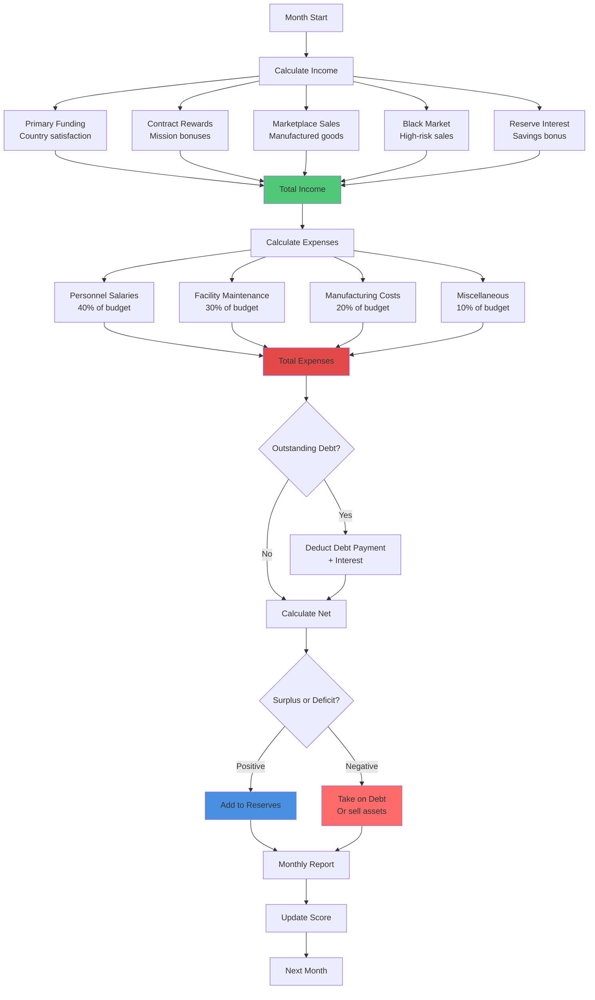
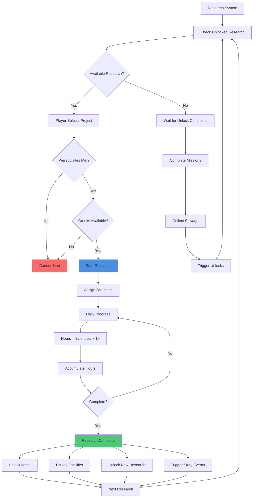
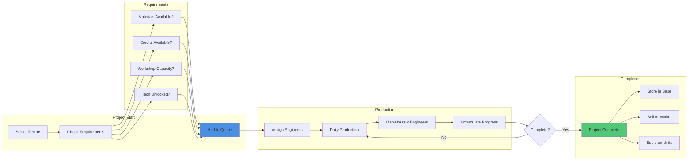
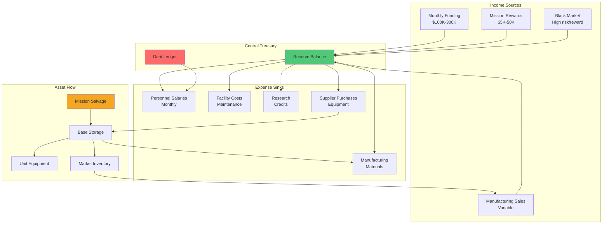
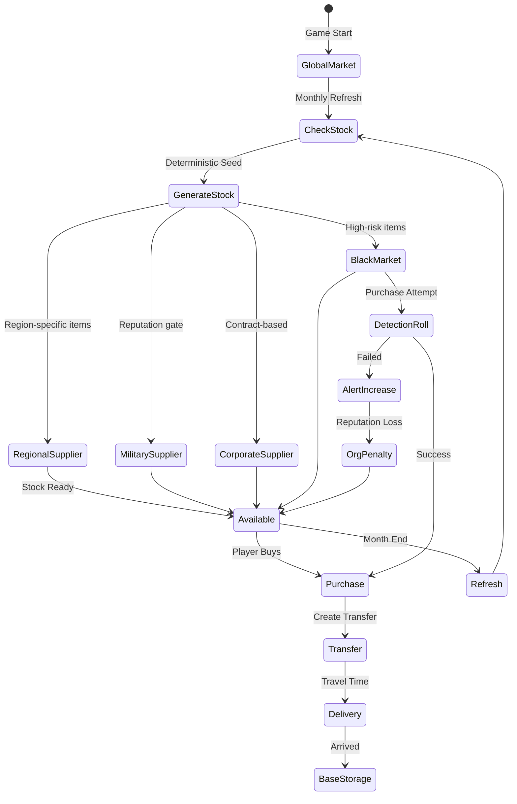

# Economy Overview

The economy powers every AlienFall system—from soldier wages to late-game plasma cannons. This README consolidates manufacturing, marketplace, research, and logistics into a single Love2D-facing reference.

## Role in AlienFall
- Provide deterministic resource flows that reward long-term planning.
- Gate technological progress and equipment upgrades through research and suppliers.
- Tie campaign performance directly to funding, debt, and strategic options.

## Player Experience Goals
- **Transparent budgets:** Players know how much projects cost now and later.
- **Meaningful choices:** Manufacturing, purchasing, and research compete for the same resources.
- **Fair progression:** Access to advanced gear is earned through visible milestones, not unpredictable drops.

## System Boundaries
- Covers funding, income sources, black market, manufacturing, research, supplier stocking, and inter-base transfers.
- Interfaces with basescape (workshops, labs), units (equipment), items (recipes, stats), finance (reports), and organization (reputation).

---

## Economy System Diagrams

### Monthly Economic Cycle

### Research Tree Flow

### Manufacturing Pipeline

### Resource Flow Diagram

### Supplier & Market System

---

## Core Mechanics
### Funding & Income
- Monthly funding calculated from country satisfaction, score, and outstanding debt.
- Income sources: primary funding, contracts, marketplace profits, black market, and interest on reserve funds.
- Debt system offers short-term relief at escalating interest rates; failure to pay triggers penalties and story events.

### Research & Technology Tree
- Research entries are atomic TOML rows with prerequisites, cost (in research-hours), and unlock payloads (items, facilities, story beats).
- Directed acyclic graph ensures deterministic unlock paths. Branching choices record tags (e.g., `laser_focus`, `armor_focus`) for downstream content.
- Research progress ticks daily, consuming lab capacity tracked by the basescape.

### Manufacturing & Supplies
- Manufacturing projects consume materials, credits, and man-hours. Queues support priority reordering and partial progress saves.
- Suppliers provide curated stock lists with regional availability and reputation gates. Stock refreshes monthly using deterministic seeds keyed to supplier id + month.
- Black market ignores reputation but adds detection risk; higher risk raises alert level, feeding into organization and finance systems.

### Logistics & Transfers
- Transfers move items, units, and crafts between bases using deterministic travel times (province hops × craft speed).
- Cargo reservations ensure storage capacity at origin and destination; overflow policies set by basescape.
- All logistics events emit telemetry for replay and debugging.

## Implementation Hooks
- **Data Tables:**
	- `data/economy/funding.toml` – formulas for monthly payouts and debt interest.
	- `data/economy/research.toml` – research entries, tags, unlock payloads.
	- `data/economy/manufacturing.toml` – recipes, costs, requirements.
	- `data/economy/suppliers.toml` – vendor inventories, refresh rules.
- **Event Bus:** `economy:funding_paid`, `economy:debt_accrued`, `economy:research_progressed`, `economy:manufacturing_completed`, `economy:transfer_arrived`.
- **Love2D Services:** Implement `EconomyService` to own credit balance, debt ledger, and queue timers. Update once per day in geoscape time.

## Grid & Visual Standards
- Economic UI screens (manufacturing, research, suppliers) snap to the 20×20 grid. Tables use row heights of 20px multiples.
- Iconography uses 10×10 sprites scaled ×2 for clarity.

## Data & Tags
- Budget tags: `income`, `expense`, `debt`, `funding`, `manufacturing`, `research`.
- Research tags: `tech_weapon`, `tech_defense`, `tech_craft`, `tech_story`.
- Supplier tags: `global`, `regional`, `black_market`, `military`, `corporate`.

## Related Reading
- [Finance README](../finance/README.md)
- [Basescape README](../basescape/README.md)
- [Items README](../items/README.md)
- [Crafts README](../crafts/README.md)
- [Organization README](../organization/README.md)

## Tags
`#economy` `#manufacturing` `#research` `#funding` `#love2d`
