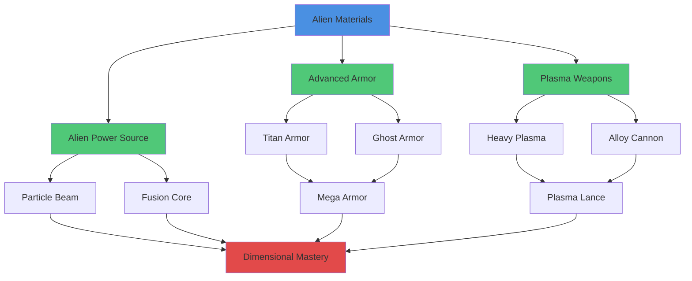
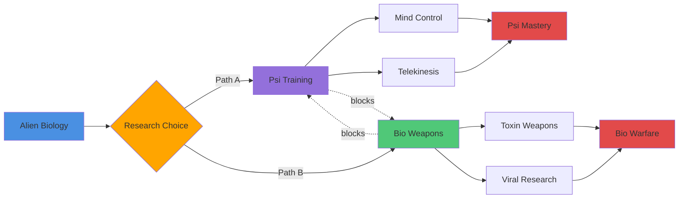
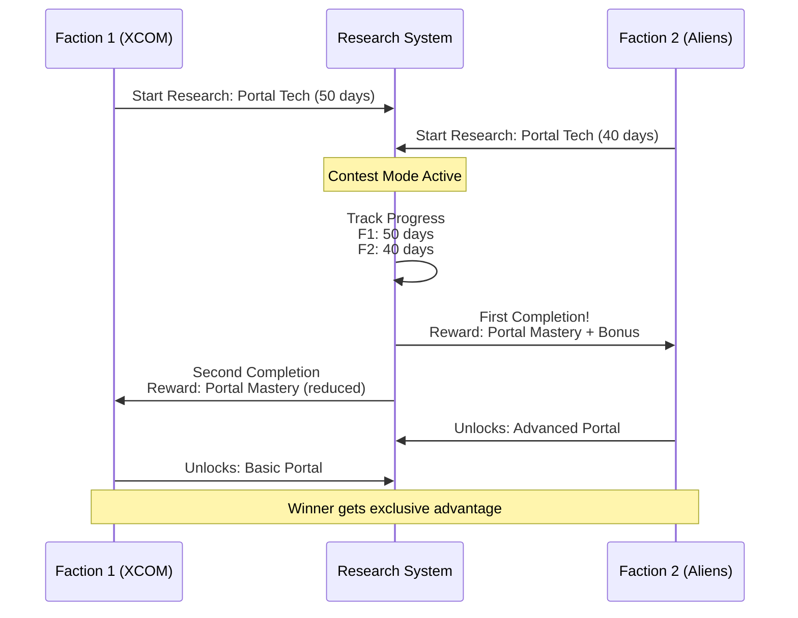
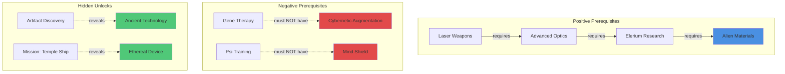
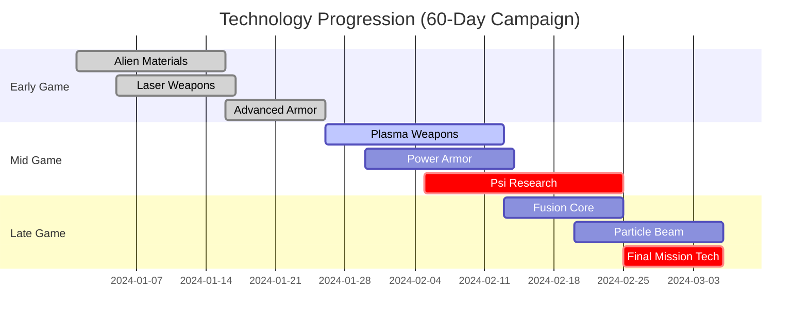

# Research Tree

## Table of Contents
- [Overview](#overview)
- [Mechanics](#mechanics)
  - [Graph Structure and Relationships](#graph-structure-and-relationships)
  - [Choice and Branching Systems](#choice-and-branching-systems)
  - [Discovery and Interaction Mechanics](#discovery-and-interaction-mechanics)
  - [Event Hooks and Integration](#event-hooks-and-integration)
  - [Planning and Management Tools](#planning-and-management-tools)
  - [Meta-Progression and Balancing](#meta-progression-and-balancing)
- [Examples](#examples)
  - [Branching Pathway Examples](#branching-pathway-examples)
    - [Alien Materials Technology Tree](#alien-materials-technology-tree)
    - [Weapons Technology Progression](#weapons-technology-progression)
    - [Biological Research Branches](#biological-research-branches)
  - [Contest and Cooperation Scenarios](#contest-and-cooperation-scenarios)
    - [Psi Breakthrough Race](#psi-breakthrough-race)
    - [Portal Stabilization Project](#portal-stabilization-project)
    - [Advanced Avionics Development](#advanced-avionics-development)
  - [Hidden Branch Reveals](#hidden-branch-reveals)
    - [First Contact Scenario](#first-contact-scenario)
    - [Ancient Artifact Discovery](#ancient-artifact-discovery)
    - [Dimensional Incursion Event](#dimensional-incursion-event)
  - [Capstone and Milestone Examples](#capstone-and-milestone-examples)
    - [Hybrid Propulsion Breakthrough](#hybrid-propulsion-breakthrough)
    - [Neural Interface Network](#neural-interface-network)
    - [Portal Mastery Achievement](#portal-mastery-achievement)
  - [Research Planning Scenarios](#research-planning-scenarios)
    - [Early Game Technology Focus](#early-game-technology-focus)
    - [Mid-Game Expansion Strategy](#mid-game-expansion-strategy)
    - [Late-Game Specialization Approach](#late-game-specialization-approach)
    - [Defensive Technology Priority](#defensive-technology-priority)
- [Related Wiki Pages](#related-wiki-pages)
- [References to Existing Games and Mechanics](#references-to-existing-games-and-mechanics)

## Overview

The research tree system establishes a comprehensive technological progression framework structured as a directed acyclic graph (DAG) of research entries. It creates meaningful advancement pathways, mutually exclusive choices, contest mechanics, and cooperative research opportunities while maintaining deterministic seeded randomization for extensive modding support and replayability.

The system separates research content from structural relationships, enabling flexible authoring, complex branching narratives, and strategic decision-making that shapes campaign variety and long-term strategic planning. Multiple trees can be authored for different playstyles or factions while keeping underlying entries deterministic and modular.

---

## Research Tree Visualization

### Technology DAG Structure

### Branching Pathway Example

### Research Contest Flow

### Prerequisite Relationships

### Research Progression Timeline

---

## Mechanics

### Graph Structure and Relationships

DAG-based architecture with prerequisite relationships:

- DAG Architecture: Directed acyclic graph with research entries as nodes and prerequisite relationships as edges
- Prerequisite Types: Positive requirements (must complete) and negative requirements (must not complete)
- Hidden Branches: Conditional visibility based on campaign events, discoveries, or quest triggers
- Modular Design: Separation of content (entries) from structure (relationships) for flexible authoring
- Acyclic Enforcement: Validation preventing circular dependencies and contradictory requirements
- Deterministic Processing: Seeded randomization ensuring reproducible outcomes and debugging capability

### Choice and Branching Systems

Strategic decision-making with mutually exclusive pathways:

- Mutually Exclusive Pathways: Completion effects blocking or pruning alternative technological routes
- Deterministic Selection: Seeded random choice from multiple child options for reproducible results
- Tiered Progression: Successive upgrade nodes with diminishing returns or escalating costs
- Branch Pruning: Strategic choices permanently removing alternative technological paths
- Pathway Visualization: Clear representation of available choices and long-term consequences
- Replayability Factors: Multiple valid technological progression strategies for varied campaigns

### Discovery and Interaction Mechanics

First-completion effects and competitive research dynamics:

- First Completion Effects: Global state modifications granting faction bonuses for pioneering discoveries
- Contest Systems: Racing mechanics where first completion provides exclusive benefits and advantages
- Cooperative Research: Shared progress modes with diplomatic costs and configurable reward splits
- Multiplayer Integration: Cross-faction interactions with deterministic outcome resolution
- Provenance Tracking: Complete audit trails for all random selections and competitive outcomes
- Reward Scaling: Differential benefits based on completion order and contribution levels

### Event Hooks and Integration

Lifecycle events driving narrative and cross-system effects:

- Lifecycle Events: Tree completion, branch pruning, first completion, and milestone triggers
- Cross-System Effects: Narrative progression, multiplayer resolution, and global state changes
- Modding Interface: Extensible hooks for custom rewards, unlocks, and world-state modifications
- Event Sequencing: Deterministic trigger ordering ensuring consistent campaign progression
- Telemetry Integration: Comprehensive logging for debugging and balance analysis
- Director Script Support: Procedural content generation based on research completion patterns

### Planning and Management Tools

Research management interface with strategic planning capabilities:

- Research Planner UI: Visualization of selectable goals, projected resource and time costs, and optimal paths
- Capacity Reservation: Lock/queue features for reserving science capacity across multiple bases
- Automated Transfers: Resource allocation and personnel movement to meet research requirements
- Branch Analysis: Comparative evaluation of different technological pathways and outcomes
- Simulation Tools: Designer testing of seeded variations, pacing adjustments, and balance modifications
- Progress Forecasting: Time and resource projections for reaching specific technological milestones

### Meta-Progression and Balancing

Advanced progression mechanics and difficulty controls:

- Repeatable Upgrades: Successive enhancement nodes with configurable improvement curves
- Experimental Trials: High-risk, high-reward research options affecting reputation and capabilities
- Pacing Controls: Campaign-level seed modifiers, global research rate multipliers, and per-branch weightings
- Capstone Triggers: Major story events, new systems, or victory condition unlocks
- Difficulty Scaling: Research complexity and cost adjustments based on campaign progression
- Balance Knobs: Parameterized controls for tuning discovery rates and technological advancement speed

## Examples

### Branching Pathway Examples

#### Alien Materials Technology Tree
- Base Research: Alien Materials analysis (100 science points, 5 days)
- Branching Options:
  - Alien Alloys Path: Armor technology (+25% soldier defense, unlocks advanced body armor)
  - Elerium-115 Path: Power systems (+30% weapon damage, unlocks plasma weapons)
- Strategic Choice: Defensive specialization vs. offensive capability enhancement

#### Weapons Technology Progression
- Sequential Research: Laser Weapons → Plasma Weapons → Fusion Weapons
- Progressive Benefits: +25% damage per tier with increasing research costs
- Mutually Exclusive: Cannot research both plasma and fusion simultaneously
- End Result: Either high-volume plasma weapons or devastating fusion artillery

#### Biological Research Branches
- Autopsy Research: Basic alien biology understanding
- Branch Points:
  - Cybernetics: Soldier enhancement (+20% health, neural interfaces)
  - Xenobiology: Alien exploitation (biological weapons, psi research)
- Hidden Branches: Advanced cybernetics revealed after psi breakthrough discovery

### Contest and Cooperation Scenarios

#### Psi Breakthrough Race
- Competitive Research: Three factions racing for neural interface technology
- First Completion: Unique military command module (+50% squad coordination)
- Second Place: Basic psi training program (+10% soldier willpower)
- Third Place: Psi research foundation (unlocks further psi technologies)
- Strategic Impact: Research priority affects faction power balance

#### Portal Stabilization Project
- Cooperative Research: Multiple organizations pooling resources
- Resource Contribution: 40% of total science cost from each participant
- Diplomatic Cost: -10 relations per participant, +5 relations for successful completion
- Reward Distribution: 40% completion bonus shared equally
- Risk Factor: Project failure if any participant withdraws mid-research

#### Advanced Avionics Development
- Shared Research: Aerospace companies collaborating on next-generation flight systems
- Time Reduction: 30% faster completion through combined science capacity
- Resource Requirements: Proportional contribution based on organization size
- Exclusive Access: All participants gain technology, but first contributor gets production rights

### Hidden Branch Reveals

#### First Contact Scenario
- Trigger Event: Initial UFO interception and crash recovery
- Revealed Branches: Xenobiology subtree with autopsy and culture study options
- Prerequisite Research: Basic alien materials analysis
- Campaign Impact: Opens entirely new research trees and strategic possibilities

#### Ancient Artifact Discovery
- Trigger Event: Archaeological mission recovers precursor technology
- Revealed Branches: Ancient technology tree with advanced propulsion and weapons
- Research Benefits: Shortcuts around traditional technological progression
- Narrative Integration: Ties into larger story about precursor alien civilizations

#### Dimensional Incursion Event
- Trigger Event: Portal anomaly creates stable dimensional rift
- Revealed Branches: Portal technology with stabilization and weaponization options
- Strategic Choice: Safe exploration vs. offensive dimensional capabilities
- Campaign Expansion: Unlocks new worlds and multi-dimensional strategic layer

### Capstone and Milestone Examples

#### Hybrid Propulsion Breakthrough
- Research Requirements: Advanced rocketry + experimental physics + alien materials
- Completion Effects: Unlocks inter-world travel capability and new campaign regions
- Strategic Impact: Dramatically expands operational theater and mission opportunities
- Victory Condition: Enables end-game scenarios involving multiple worlds

#### Neural Interface Network
- Research Requirements: Psi research + cybernetics + computer science
- Completion Effects: Global consciousness linking with strategic intelligence advantages
- Operational Benefits: Real-time battlefield coordination and predictive analytics
- Campaign Integration: Changes faction dynamics and player strategic options

#### Portal Mastery Achievement
- Research Requirements: Portal stabilization + advanced physics + xenotechnology
- Completion Effects: Controlled dimensional travel and multi-world operations
- Strategic Advantages: Rapid force projection and surprise attack capabilities
- Narrative Conclusion: Opens paths to alien homeworlds and final confrontations

### Research Planning Scenarios

#### Early Game Technology Focus
- Priority Research: Basic weapons, armor, and medical technologies
- Strategic Goals: Immediate combat effectiveness and soldier survivability
- Resource Allocation: Concentrated science investment in fundamental technologies
- Expected Outcomes: Improved mission success rates and reduced casualties

#### Mid-Game Expansion Strategy
- Priority Research: Craft technologies, base facilities, and advanced manufacturing
- Strategic Goals: Operational scaling and improved logistics capabilities
- Resource Allocation: Balanced investment across multiple research branches
- Expected Outcomes: Increased interception range and production efficiency

#### Late-Game Specialization Approach
- Priority Research: Advanced weapons systems and strategic technologies
- Strategic Goals: Campaign conclusion through overwhelming technological superiority
- Resource Allocation: Focused investment in high-impact, expensive research projects
- Expected Outcomes: Decisive military advantages and victory condition unlocks

#### Defensive Technology Priority
- Priority Research: Base defenses, interception technologies, and countermeasures
- Strategic Goals: Territory protection and invasion prevention
- Resource Allocation: Emphasis on passive defense and early warning systems
- Expected Outcomes: Reduced base vulnerability and improved strategic depth

## Related Wiki Pages

- [Research.md](../economy/Research.md) - Core research mechanics.
- [Base management.md](../basescape/Base%20management.md) - Base facilities for research.
- [Economy.md](../economy/Economy.md) - Economic costs of research.
- [Geoscape.md](../geoscape/Geoscape.md) - Strategic research decisions.
- [Units.md](../units/Units.md) - Unit upgrades from research.
- [Items.md](../items/Items.md) - Item research.
- [Craft.md](../crafts/Craft.md) - Craft research.
- [AI.md](../ai/AI.md) - AI research.
- [Lore.md](../lore/Lore.md) - Lore integration.
- [Modding.md](../technical/Modding.md) - Moddable research trees.

## References to Existing Games and Mechanics

- Civilization series: Technology trees.
- X-COM series: Research progression.
- Sid Meier's Alpha Centauri: Tech tree.
- Master of Orion: Research trees.
- Endless Space: Technology web.
- Stellaris: Research system.
- Age of Empires: Tech trees.
- Total War series: Technology progression.

