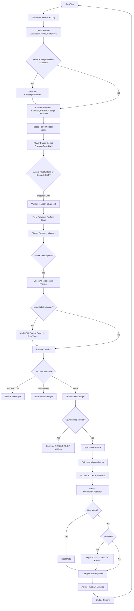
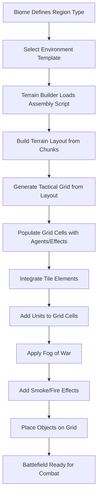

# Game Loop

## Table of Contents
- [Overview](#overview)
- [Turn Structure](#turn-structure)
  - [New Turn Phase](#new-turn-phase)
  - [Mission Execution](#mission-execution)
  - [Base Operations](#base-operations)
  - [Player Phase](#player-phase)
  - [Interception Resolution](#interception-resolution)
  - [End of Player Phase](#end-of-player-phase)
- [Combat Statistics](#combat-statistics)
  - [Weapon Attributes](#weapon-attributes)
  - [Unit Profiles](#unit-profiles)
  - [Equipment Upgrades](#equipment-upgrades)
- [Related Wiki Pages](#related-wiki-pages)
- [References to Existing Games and Mechanics](#references-to-existing-games-and-mechanics)

## Overview

The Game Loop defines the core turn-based progression of AlienFall, managing the flow between strategic geoscape decisions and tactical battlescape combat. The system ensures deterministic outcomes through seeded random number generation while providing meaningful player agency at key decision points. The loop integrates time advancement, mission spawning, base operations, player actions, and combat resolution into a cohesive campaign experience.

## Turn Structure

### New Turn Phase
- Advance the calendar by +1 day.
- Check for events triggered by day, week, month, quarter, or year.
- If applicable, generate new campaigns (monthly) or missions (weekly).

### Mission Execution
- **Site Missions**: Remain stationary and wait.
- **Base Missions**: Execute their associated scripts, potentially spawning new missions.
- **UFO Missions**: Execute their scripts and relocate.

### Base Operations
- All player-controlled bases perform radar sweeps to detect enemy missions.

### Player Phase
- Interact with provinces: Select a base to modify its settings.
- Interact with provinces: Select a craft to dispatch it to another province.
    - Validate flight range.
    - Verify fuel availability at the originating base.
    - Confirm remaining craft speed capacity.
    - Upon arrival, perform a radar scan and attempt to detect missions.
    - Display detected missions; conceal if none or if they are hidden.
- Initiate interception missions (e.g., engage with multiple crafts if available).

### Interception Resolution
- Evaluate all missions in the province, including undetected ones.
- If undetected missions exist, trigger an **AMBUSH**: Enemy gains 2-3 free turns.
- Resolve combat between crafts/bases and enemy missions:
    - **Victory with Loot**: Proceed to battlescape.
    - **Victory without Loot**: Return to geoscape.
    - **Defeat**: Return to geoscape.
    - **Defeat with Casualties**: Generate a new **RESCUE PILOT** mission.

### End of Player Phase
- All active missions calculate and award points based on turn outcomes.
- Update player score, karma, and fame.
- Bases execute production and research tasks.
- Weekly: Heal units.
- Daily: Repair crafts; transports return to bases.
- Process payments for all player bases.
- Adjust planetary lighting based on movement.
- Update result reports.

## Combat Statistics

### Weapon Attributes
Weapons define damage output, resource consumption, and tactical flexibility through standardized attributes:

- **Damage Range**: Base damage values with variance for tactical unpredictability
- **Action Point Cost**: Tactical cost determining turn economy and action sequencing
- **Energy Point Cost**: Resource consumption for sustained combat operations
- **Accuracy Modifiers**: Base accuracy with range bands and situational modifiers
- **Cooldown Systems**: Turn-based recovery preventing weapon spam
- **Special Effects**: Burst fire, suppression, and critical hit mechanics

### Unit Profiles

#### Standard Unit
- **Health**: 6 hit points for basic durability
- **Energy**: 6 energy points with 2 regeneration per turn
- **Role**: Balanced combat effectiveness for general operations

#### Elite Unit
- **Health**: 12 hit points for enhanced survivability
- **Energy**: 12 energy points with 4 regeneration per turn
- **Role**: High-value specialists with superior combat capabilities

### Equipment Upgrades

#### Ammo Clip
- **Energy Capacity**: +10 EP maximum capacity
- **Regeneration**: +1 EP per turn recovery rate
- **Effect**: Extended operational endurance for sustained engagements

#### Ammo Rack
- **Energy Capacity**: +20 EP maximum capacity
- **Regeneration**: +2 EP per turn recovery rate
- **Effect**: Major endurance enhancement for heavy weapons specialists

#### Medikit
- **Function**: Healing capability with high energy consumption
- **Requirements**: Medic specialization for effective use
- **Effect**: Tactical healing during combat operations

## Related Wiki Pages

- [World time.md](../geoscape/World%20time.md) - Time progression and scheduling mechanics
- [Craft Operations.md](../geoscape/Craft%20Operations.md) - Craft dispatch and movement systems
- [Province.md](../geoscape/Province.md) - Province interaction and base management
- [Interception](../interception/README.md) - Combat resolution systems
- [Units](../units/README.md) - Unit profiles and progression
- [Items](../items/README.md) - Equipment and weapon systems

## References to Existing Games and Mechanics

The Game Loop draws from established turn-based strategy patterns:

- **X-COM Series**: Turn-based geoscape management with time progression and mission spawning
- **Civilization Series**: Strategic turn structure with production and research cycles
- **Fire Emblem Series**: Unit-based combat with resource management and recovery mechanics
- **Advance Wars Series**: Tactical combat resolution with interception and base defense
- **Total War Series**: Large-scale campaign management with mission and event systems

## Geoscape Flow Diagram

## Battlefield Creation Diagram

