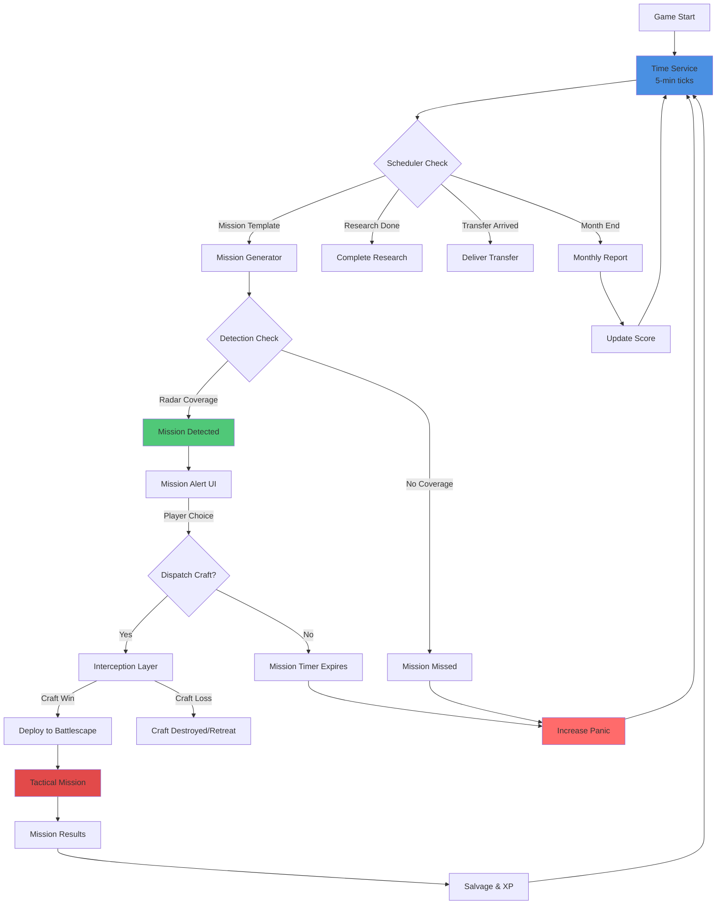
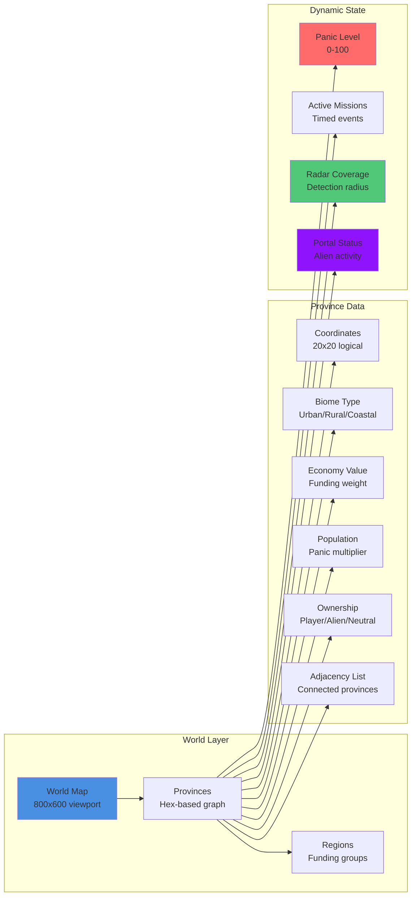
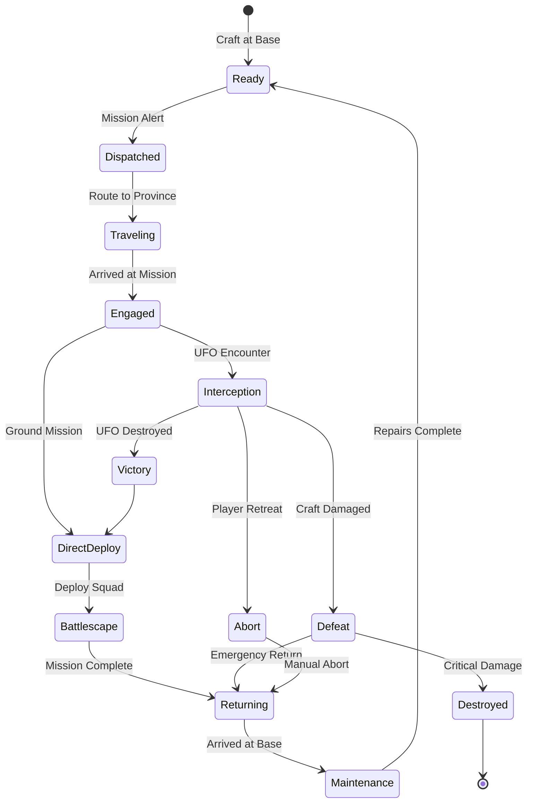

# Geoscape Overview

> **Purpose:** Describe AlienFall’s strategic campaign layer and give engineers the hooks needed to implement it in Love2D.

## Role in AlienFall
- Advance in-game time, spawn missions, and coordinate UFO/craft movements.
- Track province ownership, panic, and funding contributions.
- Serve as the hub for base building, interception launches, and strategic decisions.

## Player / Design Goals
- **Readable map:** Provinces, missions, and radar coverage are easy to parse on the 20×20 grid.
- **Deterministic time flow:** Pausing, fast-forwarding, and scheduled events always produce the same outcomes per seed.
- **Meaningful choices:** Mission prioritisation, base placement, and radar network design matter.

## System Boundaries
- Encompasses world generation, provinces, regions, biomes, time progression, mission scheduling, and craft routing.
- Interfaces with basescape (bases, services), economy (funding), interception (combat handoff), finance (score), and organization (reputation/politics).

---

## Geoscape System Diagrams

### Time Flow & Mission Lifecycle

### Province & Region System

### Craft Operations Flow

---

## Mechanics / Implementation
### World & Provinces
- World map uses a hex-derived province graph anchored to 20×20 logical coordinates (800×600 viewport).
- Each province stores: coordinates, biome, economy value, population, ownership, tags, adjacency list.
- Regions group provinces for funding, mission weighting, and diplomacy.

### Time & Scheduling
- Time advances in deterministic ticks (5-minute increments). Player can run at 1×, 5×, or 30× speed.
- Scheduler queues missions, research completions, transfers, and monthly finance events.
- Seeds: `campaign:<id>:time:<tick>` to replay mission creation exactly.

### Mission Lifecycle
- Mission templates pull from weighted decks keyed to province tags (`urban`, `coastal`, `portal`).
- Detection checks run against active radar coverage and surveillance services.
- Successful detection unlocks interception or direct deployment (for base raids).

### Craft Operations
- Craft dispatch checks province hop distance, fuel reserves, and daily sortie limits.
- Movement is instantaneous in UI but consumes deterministic time (recorded for AI scheduling).
- Returns initiate recovery timers for fuel and repairs.

### Portals & Multi-World Support
- Portals mark alien entry points; they escalate activity until neutralised.
- Future multi-world campaigns share the same scheduler and mission pipeline.

### Grid & Visual Standards
- Viewport: 800×600 pixels (40×30 logical tiles). UI overlays snap to grid.
- Province markers: 20×20 clickable areas with 10×10 icons scaled ×2 at centre.
- Mission timers and tooltips align to tile edges to avoid cursor offset bugs.

## Data & Events
- **Primary Catalogs:** `data/geoscape/worlds.toml`, `provinces.toml`, `regions.toml`, `missions.toml`, `portals.toml`, `craft_operations.toml`.
- **Services:** `geoscape/world_model.lua`, `geoscape/mission_scheduler.lua`, `geoscape/detection_system.lua`, `services/time.lua`, `services/event_bus.lua`.
- **Events:** `geoscape:tick`, `geoscape:mission_spawned`, `geoscape:mission_expired`, `geoscape:province_changed`, `geoscape:portal_escalated`.

## Integration Hooks
- **Love2D State:** Geoscape state owns the main update loop when strategic view is active. Time controls map to keybinds defined in the GUI spec.
- **Data Tables:** `data/geoscape/*.toml` entries map to deterministic mission scheduling and craft routing.
- **Event Bus:** Emits mission lifecycle and time progression events consumed by Interception, Basescape, Economy, and Finance systems.
- **Rendering:** Map drawn using 10×10 province sprites scaled ×2, snapped to 20×20 logical positions.

## Related Reading
- [Basescape README](../basescape/README.md)
- [Interception README](../interception/README.md)
- [Economy README](../economy/README.md)
- [Finance README](../finance/README.md)
- [Organization README](../organization/README.md)

## Tags
`#geoscape` `#missions` `#time` `#grid20x20` `#love2d`
