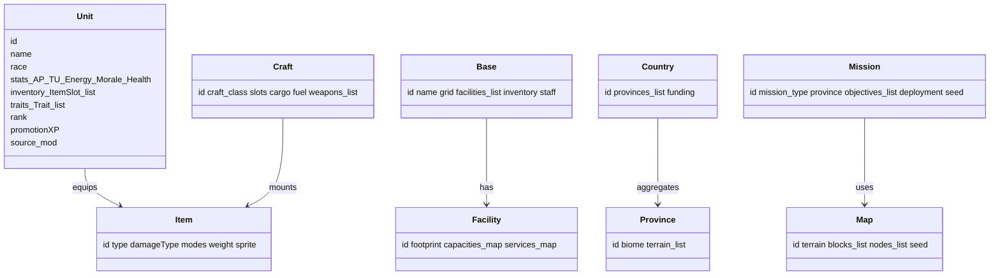

# AlienFall — Technical Architecture and Implementation Plan (v1)

> **Archived:** This document captures the legacy Python/PySide6 implementation plan. For the authoritative Love2D design, read [`Love2D_Implementation_Plan.md`](../Love2D_Implementation_Plan.md) and the upcoming `architecture/ArchitectureSpine.md` summary.

## Table of Contents
- [1) System overview](#1-system-overview)
  - [1.1 Containers and core flows](#11-containers-and-core-flows)
  - [1.2 Subsystem boundaries](#12-subsystem-boundaries)
  - [1.3 Engine system and state stack](#13-engine-system-and-state-stack)
  - [1.4 Initialization and core loop](#14-initialization-and-core-loop)
- [2) Determinism and RNG strategy](#2-determinism-and-rng-strategy)
- [3) Mod system (YAML‑first)](#3-mod-system-yaml-first)
  - [3.1 Mod load pipeline](#31-mod-load-pipeline)
  - [3.2 Manifest schema](#32-manifest-schema)
  - [3.3 Data files and merge semantics](#33-data-files-and-merge-semantics)
- [4) Event bus and hook DSL](#4-event-bus-and-hook-dsl)
  - [4.1 New game flow and campaign seed](#41-new-game-flow-and-campaign-seed)
  - [4.2 Load game flow](#42-load-game-flow)
- [5) Assets (images/sound/theme)](#5-assets-imagessoundtheme)
- [6) Core services (APIs)](#6-core-services-apis)
- [7) Domain model map (from wiki)](#7-domain-model-map-from-wiki)
- [8) Subsystem designs and contracts](#8-subsystem-designs-and-contracts)
  - [8.1 Geoscape (World/Time/Missions/Detection/Interception)](#81-geoscape-worldtimemissionsdetectioninterception)
  - [8.2 Basescape (Facilities/Capacities/Services/Report)](#82-basescape-facilitiescapacitiesservicesreport)
  - [8.3 Economy (Market/Suppliers/Research/Manufacturing/Finance)](#83-economy-marketsuppliersresearchmanufacturingfinance)
  - [8.4 Battlescape (Map/LOS/AP/Morale/Damage/Salvage)](#84-battlescape-maplosapmoraledamagesalvage)
  - [8.5 Interception (Air Battle AP+Energy)](#85-interception-air-battle-apenergy)
- [9) Data schemas (YAML) — canonical shapes](#9-data-schemas-yaml--canonical-shapes)
- [10) UI architecture (PySide6)](#10-ui-architecture-pyside6)
  - [10.1 Options and configuration (graphics, audio, keybinds)](#101-options-and-configuration-graphics-audio-keybinds)
  - [10.2 Ufopaedia (in-game encyclopedia)](#102-ufopaedia-in-game-encyclopedia)
- [11) Persistence / Save games](#11-persistence--save-games)
- [12) Telemetry and replay](#12-telemetry-and-replay)
- [13) Testing strategy](#13-testing-strategy)
- [14) Performance & UX targets](#14-performance--ux-targets)
- [15) Risks and mitigations](#15-risks-and-mitigations)
- [16) Implementation roadmap (milestones with acceptance criteria)](#16-implementation-roadmap-milestones-with-acceptance-criteria)
- [17) Directory layout (target)](#17-directory-layout-target)
- [18) Requirements coverage](#18-requirements-coverage)
- [Related Wiki Pages](#related-wiki-pages)
- [References to Existing Games and Mechanics](#references-to-existing-games-and-mechanics)

## 1) System overview

### 1.1 Containers and core flows


High-level layering:
- UI: Qt widgets + QSS theming, backed by Qt models (QAbstractItemModel) sourced from ViewModels.
- Engine: deterministic rules for Geoscape, Basescape, Battlescape, Interception; exposes services and command APIs.
- Domain: pure Python objects (Unit, Item, Craft, Map, Base, Facility, Province, Country…). No Qt dependencies.
- Services: asset/audio/mod/save/event/telemetry/time/rng shared infrastructure.

### 1.2 Subsystem boundaries


### 1.3 Engine system and state stack

We use a simple state stack to coordinate major game modes and menus. Each state owns its UI and talks to the Engine via services and commands. States can be pushed, popped, or replaced to transition between flows without coupling subsystems.

- States (initial set): Main_Menu_State, Options_State, New_Game_State, Load_Game_State, Geoscape_State, Basescape_State, Dogfight_State, Briefing_State, Battlescape_State, Debriefing_State, Ufopaedia_State.
- Coordinator: App_StateStack dispatches input, update, and render to the top state; states may request stack ops (push_pop_replace) via a narrow interface.


Update cycle (top state only):


Design notes
- UI in PySide6 uses a root window with a stacked content area; each State binds a view and one or more ViewModels.
- No domain logic in states; they call Engine services and listen on Event_Bus.
- Transitions are explicit and deterministic; states must report whether they mutate campaign state.

### 1.4 Initialization and core loop

Boot sequence
- Discover config folders; load Options; initialize logging.
- Resolve enabled mods; load manifests; validate; build Data_Registry and Asset_Manager search paths.
- Create Service_Registry (Event_Bus, RNG_Service, Time_Service, Telemetry, Save_Manager, Mod_Manager, Data_Registry, Asset_Manager, Audio_Player).
- Push Main_Menu_State on the state stack.

Core loop
- Poll UI events; drive the active state through handle_input, update_logic, render_view.
- Pump Event_Bus between states and services; do not block the UI thread with IO.

## 2) Determinism and RNG strategy

Determinism is a first-class requirement across all systems.

- Seed sources: campaignSeed (world), directorSeed (strategic AI), missionSeed (tactical), mapSeed (map layout), actorSeed (per unit)
- Derivation: derive child seeds via stable namespace hashing: seed(child) = H(parentSeed, namespace, ids…)
- RNG API: provide a thin wrapper that returns local generators (no global state) and logs provenance.


Implementation notes:
- Use Python’s `random.Random` or `numpy.random.Generator(PCG64)` through an interface `RNGHandle` for easy swap; do not use global randomness.
- Every deterministic subsystem includes a `context_id()` used for namespacing.
- Telemetry captures: subsystem, seed, N draws, and optional sampled values.

## 3) Mod system (YAML-first)

All game content ships in mods; the engine ships a required `core` mod. Mods are ordered (dependencies + priority). Higher priority overrides lower.

### 3.1 Mod load pipeline


### 3.2 Manifest schema

YAML (no Python execution by default). Versioned to allow migrations.

```yaml
id: better-weapons
name: Better Weapons
version: 0.1.0
author: Modder
priority: 100            # higher = later merge
dependencies:            # mod ids
  - core
data:
  - path: data/items.yaml
    mode: merge          # merge | replace | append
  - path: data/units.yaml
    mode: merge
assets:
  images: [assets/images/]
  sounds: [assets/sounds/]
hooks:
  - event: on_unit_created
    spec: hooks/on_unit_created.yaml
schemaVersion: 1
```

### 3.3 Data files and merge semantics

- Object identity: every object has `id` and gets `source_mod` stamped at load.
- Merge policies per file: merge (by `id`, last-wins for scalar; merge/concat for lists), replace (whole file), append (concat lists/maps with last-wins).
- Validation: per-type JSON-schema-like checks (we will author YAML-friendly schemas). Mods failing validation produce actionable diagnostics and are disabled unless `--force-mod`.

## 4) Event bus and hook DSL

Lightweight pub/sub used across engine, UI, and mods. Hooks are data-driven operations evaluated by the engine at event time.

Events (non-exhaustive):
- on_game_start, on_turn_start, on_turn_end
- on_mission_created, on_mission_detected, on_mission_resolved
- on_unit_created, on_unit_promoted, on_unit_damaged, on_unit_fled
- on_item_crafted, on_research_completed

Hook spec (conceptual):

```yaml
when: on_unit_created
filter:
  unit.race: ALIEN
  mission.type: TERROR
actions:
  - type: modify
    path: unit.stats.morale
    op: add
    value: -5
  - type: grant_item
    itemId: terror_device
provenance: my-mod/hooks/balance.yaml
```

The engine provides a constrained set of action primitives (modify numeric/string fields, add/remove list entries, emit event, schedule timer). No arbitrary code. Conflicting hooks are applied deterministically by mod priority.

### 4.1 New game flow and campaign seed


Notes
- Difficulty affects rule weights via Data_Registry lookups; no branching code.
- Campaign_Seed determines mission timelines and early market/research rolls.

### 4.2 Load game flow


## 5) Assets (images/sound/theme)

- Image formats: PNG/SVG; sound: WAV/OGG.
- Paths are resolved relative to the providing mod; an ordered search path supports overrides.
- Caching: QPixmap/QImage cached by logical key; eviction via LRU. Audio player uses QSoundEffect/QMediaPlayer pools.
- Fallbacks: if not found, show engine placeholder; log with `source_mod` and logical key.

## 6) Core services (APIs)

Service Registry supplies singletons. Each service exposes a narrow, testable interface. Example interfaces (names only; no code):
- EventBus: publish(event: str, payload: dict), subscribe(event: str, handler: Callable), once(event, handler)
- ModManager: load(enabled: list[str]) -> ModSet, diagnostics; list_mods(); get_manifest(id)
- DataRegistry: get(type: str, id: str) -> dict|obj; list(type: str, filters?); resolve_ref(ref)
- AssetManager: image(key: str) -> QPixmap; sound(key: str) -> SoundHandle; exists(path)
- AudioPlayer: play(soundId: str, volume=1.0, channel="sfx")
- SaveManager: save(slot, GameState), load(slot) -> GameState, validate_modset()
- RNGService: rng(scope: str, context: dict) -> RNGHandle
- TimeService: advance(hours|ticks), schedule(callback, at), cron("monthly", handler)
- Telemetry: record(event, data), start_session(seedLineage), export()


## 7) Domain model map (from wiki)

Representative core classes and relationships. Domain remains Qt-free.



DataRegistry will hold typed catalogs mirroring these domain entities.

## 8) Subsystem designs and contracts

Each subsystem section states its purpose, inputs/outputs, deterministic behavior, and key algorithms.

### 8.1 Geoscape (World/Time/Missions/Detection/Interception)

Contract
- Inputs: campaignSeed, world config, enabled mods, time ticks
- Outputs: mission spawns, detection events, interceptions, funding updates
- Determinism: all sampling under TimeService tick; daily/weekly/monthly hooks run in a fixed order; mission generation seeded by campaignSeed and province id.

Daily tick flow


Mission lifecycle


Detection model (from wiki): base radars and airborne scans reduce mission Cover when in range; when Cover<=0, mission becomes Detected.

Player interactions (Geoscape)
- Start_Pause_Time, change_speed, center_on_event, open_base, launch_craft, intercept, manage_market_research_manufacturing, view_reports.
- Notifications enqueue UI toasts; clicking opens a contextual dialog (e.g., Dogfight_State, Briefing_State).

Monthly report


### 8.2 Basescape (Facilities/Capacities/Services/Report)

Contract
- Inputs: base layout, facilities, staff, inventory; daily ticks; missions results
- Outputs: capacities status, build/repair queues, monthly report
- Determinism: placement/layout yields deterministic capacities; report runs monthly cron with fixed ordering.

Facilities and capacities


Monthly report summarizes: capacities shortages, service failures, project backlogs, inventory pressure, finances.

Player interactions (Basescape)
- Place_build_facilities, hire_fire_staff, purchase_sell_items, transfer_items_staff_craft, assign_research_manufacturing, manage_craft_loadouts.
- Exits back to Geoscape_State; long operations progress on Geoscape time ticks.

### 8.3 Economy (Market/Suppliers/Research/Manufacturing/Finance)

Contract
- Inputs: supplier lists, research state, facilities, funds, time ticks
- Outputs: listings, purchases, research completions, manufactured items, funding changes
- Determinism: stock rolls and research costs are seed-driven; finance updates occur on monthly cron.


### 8.4 Battlescape (Map/LOS/AP/Morale/Damage/Salvage)

Contract
- Inputs: mission seed, deployment, terrain/blocks, units+equipment
- Outputs: battle result, casualties, salvage manifest, XP
- Determinism: map generator, LOS/lighting, action legality, damage rolls, morale checks, and salvage are seeded under missionSeed with stable ordering.

Map generation pipeline


Turn loop (tactical)
```mermaid
sequenceDiagram
  participant Battle
  participant Initiative_Turn
  participant Actor
  participant LOS
  Battle->>Initiative_Turn: next_actor
  Initiative_Turn-->>Battle: current_actor
  Battle->>Actor: enumerate_actions
  Actor->>LOS: legality_and_visibility_checks
  LOS-->>Actor: return_results
  Actor->>Battle: score_and_pick_best_action
  Battle->>Actor: execute_action
  Actor-->>Battle: return_effects_damage_and_status
  Battle->>Battle: update_FOV_morale_suppression
```

Unit state machine (subset)


Damage model (from wiki): deterministic separation of POINT (seeded single-tile variability) and AREA (deterministic radial falloff with ray attenuation). Tiles/materials authored in data.

Salvage converts post-mission results into loot, prisoners, XP, Fame, Karma, seeded and reproducible.

Transitions
- Briefing_State -> Battlescape_State -> Debriefing_State -> Geoscape_State.
- Base_Defense spawns Battlescape_State using the base layout; Debriefing updates Basescape inventories and staff.

### 8.5 Interception (Air Battle AP+Energy)

Contract
- Inputs: craft stats, weapons, AP/Energy rules, engagement seed
- Outputs: battle outcome (destroyed/crashed/escaped), damage, ammo spent
- Determinism: AP/Energy sequencing and weapon cooldowns are purely deterministic; sampling for hit/damage uses engagementSeed.


## 9) Data schemas (YAML) — canonical shapes

These are target schemas for validation and modding. They’re examples, not code.

Unit (excerpt)
```yaml
id: sectoid_warrior
name: Sectoid Warrior
race: SECTOID
sprite: assets/units/sectoid.png
stats: { tu: 60, energy: 100, health: 35, morale: 70, strength: 25 }
inventory:
  slots:
    - id: right_hand; types: [WEAPON]; weight: 12
    - id: left_hand; types: [WEAPON, UTILITY]; weight: 12
traits: [PSIONIC_SENSITIVE]
ranks: { corporal: { bonus: {tu: +2}}, sergeant: {...}}
ai: { personality: aggressive, weights: { cover: 0.7, focus_fire: 1.2 } }
```

Item (excerpt)
```yaml
id: plasma_pistol
type: WEAPON
weight: 8
damage: { type: PLASMA, base: 30, armorIgnore: 0.1 }
modes:
  - id: single; tuCost: 12; accuracy: 75; sound: sfx/plasma_shot.wav
  - id: aimed;  tuCost: 24; accuracy: 95
```

Facility (excerpt)
```yaml
id: power_generator
footprint: { w:2, h:2 }
capacities: { power: +50 }
services: { maintenance: +2 }
build: { days: 12, cost: 200000 }
```

Mission/Deployment (excerpt)
```yaml
id: terror_city
type: TERROR
province: prov_123
cover: 40
deployment:
  budgetXP: 120
  factions:
    - race: SECTOID; count: 8; roles: [SCOUT, WARRIOR]; equipmentTable: sectoid_early
map:
  terrain: urban_tier1
  size: [60, 60, 4]
```

Research (excerpt)
```yaml
id: alien_alloys
cost: 150
requires: [alien_biology]
effects: [unlock:item:alloy_plating, market:list:alloy]
```

## 10) UI architecture (PySide6)

Design goals: keep UI responsive, deterministic, and decoupled from rules. Use Qt Models for lists and trees; never let widgets pull from domain directly.

Screens (initial set)
- Main Menu, Options
- Geoscape View (world time control, missions list)
- Base View (grid, facilities, inventories, staff)
- Research, Manufacturing, Market
- Interception View (minigame panel)
- Battlescape View (grid/tile view with side panel)

Menu and lobby flows


Save/Load UI interactions
```mermaid
sequenceDiagram
  participant UI
  participant Save
  participant Engine
  UI->>Save: enumerate_slots
  Save-->>UI: slot_list_with_metadata
  UI->>Save: load_selected_slot
  Save-->>UI: game_blob
  UI->>Engine: hydrate_and_enter
```

Qt Models
- UnitListModel, ItemListModel, FacilityListModel, MissionListModel, ResearchTreeModel, InventoryModel, CraftListModel

Interaction contracts
- ViewModels observe EventBus for changes and refresh Qt models.
- Commands flow UI -> ViewModel -> Engine services; results are emitted on Bus.
- Theme via QSS; allow mods to contribute non-breaking QSS fragments.

### 10.1 Options and configuration (graphics, audio, keybinds)

Config sources
- User_Options.yaml (per user), Defaults.yaml (engine), Mod_Options.yaml (per mod, optional UI fragments).
- Load order: Defaults -> Mod_Options (merge) -> User_Options (last wins). Expose safe keys only.

Options domains
- Graphics: resolution, vsync, scaling, fullscreen, ui_scale.
- Audio: master_volume, music_volume, sfx_volume, audio_device.
- Input: keybinds map (action_id -> key combo); mouse settings.

Options flow
```mermaid
sequenceDiagram
  participant UI
  participant Options
  participant Engine
  UI->>Options: read_current_values
  Options-->>UI: merged_viewmodel
  UI->>Options: save_changes
  Options->>Engine: apply_runtime_changes
  Options->>Options: persist_user_options
```

Keybinds
- Use action_ids; states register handlers for actions; UI lets users rebind by capturing next key sequence.

### 10.2 Ufopaedia (in-game encyclopedia)

Catalog
- Backed by Data_Registry categories (units, items, facilities, research, missions, factions).
- Entries include text, images, stats, unlock conditions; mods can add pages.

Flow
```mermaid
flowchart TD
  UI[Ufopaedia_View] --> Index[Category_Index]
  Index --> Entry[Entry_Detail]
  Entry --> Index
  Entry --> Linked[Linked_Entries]
```

API
- UfopaediaService: list_categories, list_entries_category, get_entry_id, is_unlocked_id.

## 11) Persistence / Save games

Save format: YAML or compressed JSON.
Contents
- Engine version, schema versions
- Enabled mods + versions + manifest checksums
- Seed lineage and RNG draw counters per subsystem
- Game state (domain serialized by `id` references; assets by logical ids)

Load behavior: validate mod set; if mismatched, show warning; attempt safe adaptation when possible (e.g., missing item replaced with placeholder) but require user confirmation.

## 12) Telemetry and replay

- Telemetry records key decisions and random draws per subsystem; exportable for QA.
- Minimal replay: re-run with same seeds and recorded inputs to reproduce outcomes.
- Privacy: no PII; logs are local unless user opts to share.

## 13) Testing strategy

- Unit tests: domain invariants, rules math (damage, LOS, AP), mod merge logic
- Property-based: map connectivity, salvage conservation, finance balance using Hypothesis
- Snapshot tests: YAML catalogs after merges; golden outputs for monthly reports
- Integration: deterministic mission generation given seed; interception outcomes
- UI smoke: pytest-qt to open MainWindow and assert model row counts

## 14) Performance & UX targets

- Startup < 2s with core mod; map gen < 500ms for 60x60x4 typical; UI remains responsive (no blocking IO on UI thread)
- Asset caching with LRU; background IO via QThreadPool; progress indicators for heavy loads

## 15) Risks and mitigations

- Mod conflicts: deterministic merge order + diagnostics view + per-file merge modes
- Determinism drift: centralized RNG service + snapshot tests of key subsystems
- YAML sprawl: schemas + validation CLI + editor tooling
- UI jank: offload IO and heavy compute; cache aggressively; batch model updates

## 16) Implementation roadmap (milestones with acceptance criteria)

Milestone 1 — Engine skeleton & mods (2 weeks)
- Services: EventBus, RNGService, ModManager, DataRegistry, AssetManager, AudioPlayer, SaveManager, TimeService, Telemetry (stub)
- Core mod with minimal units/items/terrain; example mod overriding a value
- Qt app boots, loads mods, opens MainWindow with UnitListModel
Acceptance: deterministic mod merge snapshot test; UI lists units from core+mod.

Milestone 2 — Geoscape core (2 weeks)
- World, Country, Province domain; daily tick; MissionFactory; Detection loop per wiki
- Interception placeholder (resolve immediately by rules)
Acceptance: given seed, daily tick produces identical mission sets; detection UI updates.

Milestone 3 — Basescape core (2 weeks)
- Facility placement on grid; capacities/services accounting; monthly report generation
Acceptance: monthly report snapshot stable given same inputs.

Milestone 4 — Economy (2–3 weeks)
- Suppliers/Market, Research DAG, Manufacturing queue
Acceptance: research unlocks market listings deterministically; manufacturing respects capacities.

Milestone 5 — Battlescape foundation (3–4 weeks)
- Map generator (seeded), LOS/lighting, AP/action legality, basic damage, morale
Acceptance: fixed seed produces identical map and first 10 turns of actions under AI demo.

Milestone 6 — Interception minigame (1–2 weeks)
- AP+Energy loop; weapon cooldowns; outcome mapping
Acceptance: given seed, same sequence yields same outcome; UI visualizer.

Milestone 7 — Telemetry/Replay + polish (ongoing)
- Export/import telemetry; deterministic replay runner for headless CI
Acceptance: CI job replays curated sessions exactly.

## 17) Directory layout (target)

```text
alienfall/
  __main__.py
  app.py
  config/
    default.yaml
  ui/
    main_window.py
    models/
  engine/
    game.py
    rules/
      geoscape.py
      bases.py
      battle.py
      intercept.py
    services/
      event_bus.py
      rng.py
      mod_manager.py
      data_registry.py
      asset_manager.py
      audio_player.py
      save_manager.py
      telemetry.py
      time_service.py
  domain/
    unit.py item.py craft.py facility.py base.py province.py country.py mission.py map.py
  mods/
    core/
      manifest.yaml
      data/
      assets/
  tools/
  tests/
```

## 18) Requirements coverage

- Python + PySide UI with QSS theming — specified (UI architecture)
- YAML-first mods and config — specified (Mod system, schemas)
- Deterministic rules and seeded randomness — specified (RNG strategy)
- Battlescape, Basescape, Geoscape, Interception, Economy — specified with contracts and diagrams
- Hook system (data-driven) — specified
- Multiple Mermaid diagrams — included

---

This is the authoritative, implementation-ready architecture for AlienFall. It is structured for direct execution by an implementation agent and for mod authors to understand how content is authored and merged.


## Related Wiki Pages

- [Geoscape.md](../geoscape/Geoscape.md) - World simulation and strategic layer architecture.
- [Basescape.md](../basescape/Basescape.md) - Base management and facility systems.
- [Battlescape.md](../battlescape/Battlescape.md) - Tactical combat and mission systems.
- [Overview.md](../interception/Overview.md) - Air combat and interception mechanics.
- [Economy.md](../economy/Economy.md) - Resource and commerce systems.
- [Research.md](../basescape/Research.md) - Technology and advancement systems.
- [Manufacturing.md](../economy/Manufacturing.md) - Production and crafting systems.
- [Finance.md](../finance/Finance.md) - Economic and budgetary systems.
- [Units.md](../units/Units.md) - Character and personnel systems.
- [Stats.md](../crafts/Stats.md) - Vehicle and spacecraft systems.

## References to Existing Games and Mechanics

- **XCOM Series**: Turn-based strategy architecture and base management systems
- **Civilization**: Complex simulation systems and strategic layer design
- **Master of Orion**: Space empire management and technology progression
- **Homeworld**: Real-time strategy architecture and fleet management
- **Factorio**: Factory automation and production chain systems
- **Dwarf Fortress**: Complex simulation and world generation systems
- **Stellaris**: Grand strategy architecture and empire management
- **Europa Universalis**: Historical simulation and diplomatic systems
- **Crusader Kings**: Character-driven simulation and relationship systems
- **Total War**: Combined tactical and strategic gameplay architecture
