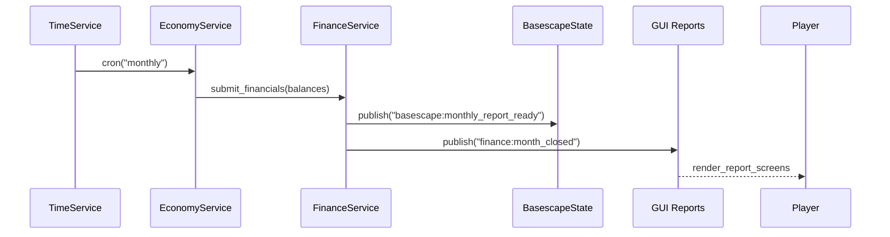
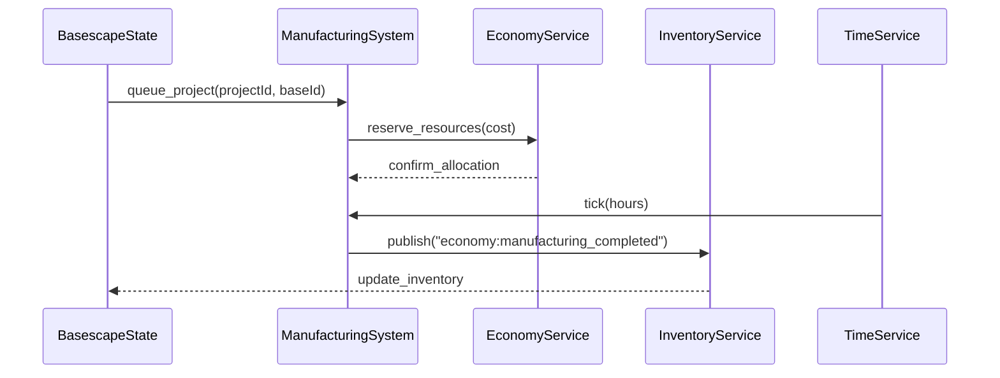

# Integration Handbook

> **Goal:** Show how AlienFall's Love2D systems share data, emit events, and consume services so designers and engineers can trace any feature end-to-end.

## How to Use This Guide
1. **Start with the system matrix** to see which TOML catalogs feed which services and states.
2. **Follow the event catalogue** to understand messaging between layers.
3. **Review the lifecycle diagrams** for the most common cross-team flows (mission, finance, manufacturing).
4. Keep [`Love2D_Implementation_Plan.md`](../Love2D_Implementation_Plan.md) and [`architecture/ArchitectureSpine.md`](../architecture/ArchitectureSpine.md) open for module-level details.

## System Matrix

| Pillar | Primary Catalogs | Services / Modules | Key Events Emitted | Downstream Consumers |
|--------|------------------|--------------------|--------------------|----------------------|
| Geoscape | `data/geoscape/worlds.toml`, `provinces.toml`, `missions.toml`, `portals.toml` | `geoscape/world_model.lua`, `geoscape/mission_scheduler.lua`, `services/time.lua` | `geoscape:tick`, `geoscape:mission_spawned`, `geoscape:mission_expired`, `geoscape:portal_escalated` | InterceptionState, BasescapeState, EconomyService, NotificationFeed |
| Basescape | `data/basescape/facilities.toml`, `services.toml`, `capacities.toml`, `monthly_reports.toml` | `basescape/facility_grid.lua`, `basescape/service_graph.lua`, `basescape/report_generator.lua` | `basescape:facility_started`, `basescape:facility_completed`, `basescape:service_changed`, `basescape:monthly_report_ready` | EconomyService, FinanceService, Battlescape (base defense), GUI dashboards |
| Interception | `data/interception/weapons.toml`, `addons.toml`, `scenarios.toml`, `base_defense.toml` | `interception/encounter_model.lua`, `interception/action_resolver.lua` | `interception:started`, `interception:round_resolved`, `interception:craft_destroyed`, `interception:ended` | BattlescapeState, GeoscapeState, Telemetry |
| Battlescape | `data/battlescape/maps.toml`, `blocks.toml`, `actions.toml`, `morale.toml`, `wounds.toml` | `battlescape/map_generator.lua`, `battlescape/action_system.lua`, `battlescape/morale_system.lua`, `battlescape/environment_system.lua` | `battlescape:turn_started`, `battlescape:unit_action`, `battlescape:environment_tick`, `battlescape:mission_end` | DebriefingState, EconomyService (salvage), UnitService (xp/wounds) |
| Economy & Finance | `data/economy/funding.toml`, `research.toml`, `manufacturing.toml`, `suppliers.toml`, `transfers.toml`, `data/finance/debt.toml`, `score.toml` | `economy/economy_service.lua`, `economy/research_manager.lua`, `economy/manufacturing_system.lua`, `finance/finance_service.lua` | `economy:funding_paid`, `economy:research_progressed`, `economy:manufacturing_completed`, `finance:month_closed`, `finance:loan_defaulted` | BasescapeState (queues), GeoscapeState (funding modifiers), Organization systems, GUI reports |
| Units & Items | `data/units/*.toml`, `data/items/*.toml`, `data/crafts/*.toml` | `units/stats_system.lua`, `units/equipment_system.lua`, `crafts/craft_manager.lua` | `units:promoted`, `units:wounded`, `items:refit_required`, `crafts:status_changed` | BattlescapeState, BasescapeState, AI Director |
| AI Director | `data/ai/personalities.toml`, `utility_weights.toml`, `director_weights.toml` | `ai/director.lua`, `ai/battlescape_controller.lua`, `ai/interception_controller.lua` | `ai:directive_issued`, `ai:strategy_shifted`, `ai:personality_loaded` | Geoscape missions, Battlescape tactics, Telemetry |
| GUI & Widgets | `assets/ui`, `widgets/theme.toml`, layout tokens | `gui/common/*.lua`, `gui/geoscape/*.lua`, `widgets/*` | `gui:notification`, `gui:modal_opened`, `gui:theme_changed` | Player feedback, Accessibility services |

## Event Catalogue (Excerpt)

| Event | Payload Fields | Publisher | Typical Subscribers |
|-------|----------------|-----------|---------------------|
| `geoscape:mission_spawned` | `missionId`, `provinceId`, `seed`, `tags` | MissionScheduler | NotificationFeed, InterceptionState loader, AI Director |
| `interception:ended` | `missionId`, `outcome`, `crashSiteId?`, `damageReport` | InterceptionState | GeoscapeState, BattlescapeState (when crash site), EconomyService |
| `battlescape:mission_end` | `missionId`, `outcome`, `casualties`, `salvage`, `telemetryHandle` | BattlescapeState | DebriefingState, EconomyService, UnitService, Telemetry |
| `basescape:monthly_report_ready` | `baseId`, `capacities`, `alerts`, `seed` | ReportGenerator | GUI report panels, FinanceService |
| `economy:research_progressed` | `projectId`, `progress`, `remaining`, `labId` | ResearchManager | GUI research screens, EconomyService (unlock triggers), Telemetry |
| `finance:month_closed` | `month`, `fundingDelta`, `scoreDelta`, `loans` | FinanceService | GeoscapeState (council briefings), GUI analytics, SaveService |
| `ai:strategy_shifted` | `directorSeed`, `pressureLevel`, `activatedDecks` | AIDirector | MissionScheduler, NotificationFeed |
| `gui:theme_changed` | `themeId` | ThemeManager | All widget roots |

> Maintain the authoritative list in this handbook; add rows when events are introduced or payloads change.

## Lifecycle Diagrams

### Campaign Month Close


### Mission Lifecycle with Crash Site
```mermaid
digraph MissionFlow {
  rankdir=LR;
  "MissionScheduler" -> "DetectionSystem" [label="geoscape:tick"];
  "DetectionSystem" -> "InterceptionState" [label="mission detected"];
  "InterceptionState" -> "GeoscapeState" [label="interception:ended"];
  "InterceptionState" -> "BattlescapeState" [label="outcome=crash_site"];
  "BattlescapeState" -> "DebriefingState" [label="battlescape:mission_end"];
  "DebriefingState" -> "EconomyService" [label="salvage+xp"];
  "DebriefingState" -> "SaveService" [label="autosave"];
}
```

### Manufacturing Loop


## Integration Checklist
- [ ] Whenever new TOML catalogs are added, register them in the matrix above and document consuming services.
- [ ] New events must be added to the event catalogue table with payload notes.
- [ ] Sequence diagrams should be updated if lifecycles change (mission, manufacturing, finance, research).
- [ ] Keep payload names consistent with telemetry fields and save data keys.

## Related References
- [`architecture/ArchitectureSpine.md`](../architecture/ArchitectureSpine.md)
- [`technical/README.md`](../technical/README.md)
- [`economy/README.md`](../economy/README.md)
- [`battlescape/README.md`](../battlescape/README.md)
- [`geoscape/README.md`](../geoscape/README.md)

Tags: `#integration` `#events` `#services` `#love2d`
