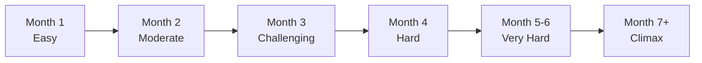

# Balance & Tuning Documentation

> **Purpose:** Comprehensive guide to game balance philosophy, difficulty curves, progression pacing, and tuning methodologies for Alien Fall.

---

## Overview

Game balance is the art and science of creating fair, challenging, and engaging gameplay. This documentation hub contains everything needed to understand, analyze, and tune Alien Fall's balance systems.

**Audience:**
- 🎮 Designers - Understanding balance philosophy
- 🔧 Developers - Implementing balanced systems
- 🎯 Modders - Creating balanced content
- 📊 Testers - Identifying balance issues

---

## Balance Philosophy

### Core Design Principles

#### 1. **Deterministic Fairness**
- Same inputs = same outcomes
- Seeded randomness for reproducibility
- No hidden mechanics or "cheating" AI
- Players can learn and predict systems

**Example:**
```
BAD:  AI gets random +20% accuracy bonus (hidden)
GOOD: AI has visible veteran trait (+15% accuracy)
```

---

#### 2. **Meaningful Choices**
- Multiple viable strategies
- No obviously dominant options
- Trade-offs between choices
- Rock-paper-scissors dynamics

**Example:**
```
Heavy Armor:  High defense, low mobility
Light Armor:  Low defense, high mobility
Medium Armor: Balanced (viable choice, not just "between")
```

---

#### 3. **Fair Challenge**
- Difficulty from complexity, not unfairness
- Players have tools to succeed
- Losses teach lessons
- Victories feel earned

---

#### 4. **Progressive Difficulty**
- Smooth difficulty curve
- No difficulty spikes
- Player power scales with challenge
- Late-game remains engaging

---

### Design Goals by Game Phase

#### Early Game (Month 1-2)
**Goal:** **Tutorial phase - Build confidence**

- Forgiving combat
- Simple encounters
- Clear feedback
- Obvious solutions

**Metrics:**
- Mission success rate: 80-95%
- Average casualties: 0-1 per mission
- Player retention: >90%

---

#### Mid Game (Month 3-4)
**Goal:** **Challenge phase - Test mastery**

- Complex encounters
- Multiple threats
- Strategic decisions matter
- Punish poor play

**Metrics:**
- Mission success rate: 60-80%
- Average casualties: 1-2 per mission
- Engagement peak

---

#### Late Game (Month 5+)
**Goal:** **Power fantasy - Reward mastery**

- High-stakes battles
- Player at peak power
- Epic encounters
- Campaign climax

**Metrics:**
- Mission success rate: 70-90% (higher due to gear)
- Casualties: 0-3 (high stakes but manageable)
- Completion rate: >70%

---

## Difficulty Curves

### Overall Campaign Difficulty



### Player Power vs Enemy Strength

```
Power Level
   ^
100|                    ****Player Power
 90|                ****
 80|            ****
 70|        ****    ----Enemy Strength
 60|    ****----
 50|****--------
 40|------------
 30|--------
 20|----
 10|
  0+------------------------------------>
    1  2  3  4  5  6  7  8  9  10 Months
```

**Key Points:**
- Player power grows faster (research/equipment)
- Enemy strength increases linearly
- Gap widens = power fantasy
- Special missions spike above curve

---

### Difficulty Settings

#### Rookie
- **Target Audience:** First-time strategy players
- **Hit Chance Modifier:** +15%
- **Damage Taken:** -25%
- **Enemy HP:** -20%
- **Resource Income:** +50%
- **Research Speed:** +30%

#### Veteran (Default)
- **Target Audience:** Strategy game veterans
- **Modifiers:** No changes (baseline)
- **Balanced Challenge:** 60-70% mission success

#### Commander
- **Target Audience:** XCOM veterans
- **Hit Chance Modifier:** -10%
- **Damage Taken:** +25%
- **Enemy HP:** +30%
- **Resource Income:** -20%
- **Research Speed:** -15%

#### Impossible
- **Target Audience:** Masochists
- **Hit Chance Modifier:** -20%
- **Damage Taken:** +50%
- **Enemy HP:** +50%
- **Resource Income:** -40%
- **Research Speed:** -25%
- **Permadeath:** Mandatory

---

## Progression Pacing

### Research Progression

**Tech Tree Balance:**

```toml
# Early Game (Months 1-2)
[research.tier1]
cost_hours = 24-48
cost_credits = 5000-10000
impact = "foundational"

# Mid Game (Months 3-4)
[research.tier2]
cost_hours = 72-96
cost_credits = 15000-25000
impact = "significant"

# Late Game (Months 5+)
[research.tier3]
cost_hours = 120-168
cost_credits = 30000-50000
impact = "game-changing"
```

**Research Rate:**
- 1 scientist = 10 research hours/day
- Early labs (2-4 scientists): 1 project every 2-5 days
- Mid labs (6-10 scientists): 1 project every 1-2 days
- Late labs (12+ scientists): 1+ projects per day

---

### Economic Progression

**Income vs Expenses:**

| Month | Income | Expenses | Net | Savings |
|-------|--------|----------|-----|---------|
| 1 | $150K | $50K | +$100K | $100K |
| 2 | $180K | $80K | +$100K | $200K |
| 3 | $220K | $120K | +$100K | $300K |
| 4 | $260K | $180K | +$80K | $380K |
| 5 | $300K | $250K | +$50K | $430K |
| 6+ | $350K+ | $300K+ | +$50K+ | Growing |

**Key Milestones:**
- Month 1: Establish base infrastructure
- Month 2: First expansion (new facilities)
- Month 3: Second base (optional)
- Month 4: Advanced manufacturing
- Month 5+: Endgame equipment

---

### Soldier Progression

**XP Curve:**

| Rank | XP Required | Missions | Stat Bonus | Abilities |
|------|-------------|----------|------------|-----------|
| Rookie | 0 | 0 | +0 | 0 |
| Squaddie | 100 | 2-3 | +5% | 1 |
| Corporal | 300 | 5-6 | +10% | 2 |
| Sergeant | 600 | 10-12 | +15% | 3 |
| Lieutenant | 1000 | 16-18 | +20% | 4 |
| Captain | 1500 | 24-26 | +25% | 5 |
| Major | 2200 | 35-38 | +30% | 6 |
| Colonel | 3000 | 48-52 | +35% | 7 |

**Average Progression:** Rookie → Colonel in ~50 missions (5-6 months)

---

## Combat Balance

### Weapon Damage Scaling

```toml
# Damage progression by tier
[weapons.tier1] # Month 1-2
damage_range = 20-40
accuracy = 70-80
ap_cost = 2-4

[weapons.tier2] # Month 3-4
damage_range = 40-65
accuracy = 75-85
ap_cost = 3-5

[weapons.tier3] # Month 5+
damage_range = 65-100
accuracy = 80-90
ap_cost = 4-6
```

### Hit Chance Formula

```
Base Hit Chance = 
    Weapon Accuracy 
    + Soldier Accuracy Stat
    - Target Defense
    - Range Penalty
    - Cover Bonus
    + Flanking Bonus
    ± Height Advantage
```

**Target Hit Chance Ranges:**
- <30%: Very unlikely (discourage shots)
- 30-50%: Risky
- 50-70%: Standard
- 70-90%: Good odds
- >90%: Near-certain (but never 100%)

---

### Enemy Scaling

**Enemy Power by Month:**

| Month | HP Mult | Damage Mult | Accuracy | New Types |
|-------|---------|-------------|----------|-----------|
| 1 | 1.0x | 1.0x | 60% | Basic |
| 2 | 1.1x | 1.1x | 65% | +Veterans |
| 3 | 1.3x | 1.2x | 70% | +Elites |
| 4 | 1.5x | 1.4x | 75% | +Commanders |
| 5 | 1.8x | 1.6x | 80% | +Psionics |
| 6+ | 2.0x+ | 1.8x+ | 85%+ | +Boss Units |

---

## Mission Balance

### Mission Difficulty Tiers

#### Tier 1: Easy (Month 1-2)
```toml
[mission.tier1]
enemy_count = 4-8
enemy_types = ["sectoid", "drone"]
turn_limit = 20
map_size = "small"
objectives = ["kill_all"]
```

#### Tier 2: Medium (Month 2-4)
```toml
[mission.tier2]
enemy_count = 8-12
enemy_types = ["sectoid", "floater", "thin_man", "drone"]
turn_limit = 15
map_size = "medium"
objectives = ["kill_all", "rescue", "destroy_object"]
```

#### Tier 3: Hard (Month 4-6)
```toml
[mission.tier3]
enemy_count = 12-16
enemy_types = ["muton", "cyberdisc", "sectoid_commander"]
turn_limit = 12
map_size = "large"
objectives = ["multiple", "timed", "extraction"]
```

#### Tier 4: Very Hard (Month 6+)
```toml
[mission.tier4]
enemy_count = 16-24
enemy_types = ["all", "elite_variants", "boss_units"]
turn_limit = 10
map_size = "xlarge"
objectives = ["complex", "multi_stage"]
```

---

## Economy Balance

### Resource Flow

**Income Sources:**
- Monthly funding: $100K-300K (70% of income)
- Mission rewards: $5K-50K per mission (20%)
- Manufacturing sales: Variable (10%)

**Expense Categories:**
- Personnel salaries: 40% of expenses
- Facility maintenance: 30%
- Manufacturing costs: 20%
- Misc/emergencies: 10%

---

### Manufacturing Costs

**Cost Formula:**
```
Total Cost = 
    Base Cost
    + (Material Cost × Material Count)
    + (Engineer Hours × Engineer Rate)
```

**Balance Rule:** Manufacturing profit margin = 20-30%

```toml
# Example: Plasma Rifle
[manufacture.plasma_rifle]
base_cost = 5000
materials = {elerium = 5, alloys = 10}
engineer_hours = 40
sell_price = 12000
profit = 7000 (58% margin - good for income)
```

---

## Balance Testing Methodology

### Playtesting Protocol

**Test Scenarios:**
1. **Rookie Difficulty** - New player experience
2. **Veteran Baseline** - Standard balance
3. **Commander Challenge** - Experienced players
4. **Impossible Proof** - Edge case testing

**Test Cadence:**
- Daily: Quick combat scenarios (30min)
- Weekly: Full mission tests (2hr)
- Monthly: Complete campaign playthrough (20hr)

---

### Metrics Collection

**Combat Metrics:**
```lua
-- Track during playtesting
{
    hit_rate = 0.65,           -- 65% shots hit
    kill_rate = 0.45,          -- 45% shots kill
    casualty_rate = 0.15,      -- 15% soldiers die
    mission_success = 0.75,    -- 75% missions won
    avg_turns = 8.5,           -- Average mission length
    medkit_usage = 1.2         -- Items per mission
}
```

**Economic Metrics:**
```lua
{
    monthly_surplus = 50000,   -- $50K surplus
    research_rate = 1.5,       -- 1.5 projects/week
    manufacturing_rate = 3.2,  -- 3.2 items/week
    soldier_loss_rate = 0.3    -- 30% casualties/month
}
```

---

### Balance Adjustment Process

**Identify Issue:**
1. Collect metrics
2. Compare to targets
3. Identify outliers
4. Reproduce problem

**Design Solution:**
1. Propose changes (small iterations)
2. Update data files
3. Document reasoning
4. Create test scenario

**Test & Iterate:**
1. Implement changes
2. Run test scenarios
3. Collect new metrics
4. Repeat until balanced

**Deploy:**
1. Update documentation
2. Add to changelog
3. Communicate to players
4. Monitor feedback

---

## Balance Tuning Guide

### Weapon Tuning

**Problem:** Weapon too weak

**Solutions:**
```toml
# Option 1: Increase damage
damage = 50  # was 40 (+25%)

# Option 2: Increase accuracy
accuracy = 85  # was 75 (+10%)

# Option 3: Reduce AP cost
ap_cost = 2  # was 3 (-33%)

# Option 4: Add special property
armor_piercing = 10  # new
```

**Test:** Does weapon now match tier expectations?

---

### Enemy Tuning

**Problem:** Enemy too difficult

**Solutions:**
```toml
# Option 1: Reduce HP
health = 80  # was 100 (-20%)

# Option 2: Reduce accuracy
accuracy = 70  # was 80 (-10%)

# Option 3: Reduce damage
damage = 30  # was 40 (-25%)

# Option 4: Remove ability
special_ability = null  # was "mind_control"
```

---

### Economy Tuning

**Problem:** Players have too much money

**Solutions:**
```toml
# Option 1: Reduce mission rewards
reward_credits = 8000  # was 12000 (-33%)

# Option 2: Increase costs
facility_cost = 60000  # was 50000 (+20%)

# Option 3: Reduce monthly funding
funding_multiplier = 0.9  # -10% global

# Option 4: Increase maintenance
maintenance_cost = 2000  # was 1500 (+33%)
```

---

## Common Balance Problems

### Problem: "Dominant Strategy"

**Symptom:** One strategy wins consistently

**Examples:**
- One weapon clearly best
- One soldier class overpowered
- One research path optimal

**Solutions:**
1. Nerf dominant option (small nerfs)
2. Buff alternatives (preferred)
3. Add counters/tradeoffs
4. Create situational advantages

---

### Problem: "Difficulty Spike"

**Symptom:** Sudden difficulty increase

**Causes:**
- New enemy type too strong
- Player tech not ready
- Stat scaling too aggressive

**Solutions:**
1. Smooth stat curves
2. Earlier tech access
3. Tutorial/warning for players
4. Difficulty scaling options

---

### Problem: "Useless Options"

**Symptom:** Features never used

**Examples:**
- Weapons never equipped
- Abilities never chosen
- Facilities never built

**Solutions:**
1. Buff underused options
2. Create niche uses
3. Reduce costs
4. Remove if truly unbalanceable

---

## Modding & Balance

### Creating Balanced Mods

**Guidelines:**
1. **Match Tier:** New content should fit existing tier structure
2. **Trade-offs:** Strengths should have weaknesses
3. **Test Extensively:** Try against vanilla content
4. **Document Changes:** Explain balance decisions

**Example: Balanced Custom Weapon**
```toml
[[weapon]]
id = "mymod_plasma_cannon"
tier = 3  # Late game weapon

[weapon.stats]
damage = 80     # High damage (tier 3 range)
accuracy = 70   # Lower accuracy (trade-off)
ap_cost = 5     # High AP cost (trade-off)
range = 15      # Shorter range (trade-off)

[weapon.special]
area_damage = true  # Strength: AOE
friendly_fire = true  # Weakness: Can hurt allies
```

---

## Balance Worksheets

### Weapon Balance Spreadsheet

| Weapon | Tier | Damage | Accuracy | AP | DPT* | Notes |
|--------|------|--------|----------|----|----|-------|
| Pistol | 1 | 25 | 80 | 2 | 12.5 | Backup |
| Rifle | 1 | 35 | 80 | 3 | 11.7 | Standard |
| Shotgun | 1 | 50 | 60 | 3 | 10.0 | Close range |

*DPT = Damage Per Turn (damage × accuracy)

### Enemy Power Level Calculator

```
Power = (HP × 0.5) + (Damage × 2) + (Accuracy × 0.3) + (Abilities × 10)

Example:
Sectoid: (60 × 0.5) + (25 × 2) + (65 × 0.3) + (1 × 10)
       = 30 + 50 + 19.5 + 10
       = 109.5 power
```

---

## Additional Resources

### Related Documentation
- **[Combat Systems](../battlescape/README.md)** - Tactical mechanics
- **[Economy Systems](../economy/README.md)** - Resource management
- **[Research Tree](../economy/Research tree.md)** - Tech progression
- **[Difficulty Settings](Difficulty_Settings.md)** - Player options

### External Resources
- **Gamasutra Articles** - Game balance theory
- **GDC Talks** - Balance in strategy games
- **XCOM Analysis** - Learning from the best

---

## Tags
`#balance` `#tuning` `#difficulty` `#progression` `#game-design` `#playtesting`
