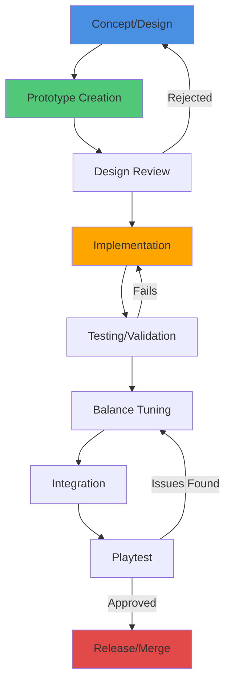

# Content Creation Pipeline

**Tags:** #meta #content-creation #pipeline #workflow  
**Last Updated:** September 30, 2025  
**Related:** [[Asset_Creation_Guide]], [[Map_Block_Authoring]], [[Mission_Design_Template]], [[Enemy_Design_Process]], [[Item_Design_Checklist]]

---

## Overview

The Alien Fall content creation pipeline defines standardized workflows for creating game content, from concept to implementation. This pipeline ensures consistency, quality, and efficient iteration across all content types while maintaining the game's pixel art aesthetic and strategic depth.

The pipeline separates content into distinct creation tracks with specialized workflows, validation checkpoints, and integration processes. Each content type follows a structured process from initial concept through playtesting and balancing, with clear hand-off points between creative, technical, and design roles.

---

## Pipeline Architecture

---

## Content Creation Tracks

### 1. Visual Assets
**Workflow:** [[Asset_Creation_Guide]]  
**Format:** PNG (10×10 pixel art scaled ×2)  
**Tools:** Aseprite, Photoshop, GIMP  
**Deliverables:** Sprite sheets, UI elements, tiles

**Key Checkpoints:**
- Concept sketch approval
- Pixel art draft review
- Animation frame validation
- Asset sheet compilation
- Integration testing

### 2. Map Blocks
**Workflow:** [[Map_Block_Authoring]]  
**Format:** TOML data files  
**Tools:** Custom map editor, Tiled (export to TOML)  
**Deliverables:** Map block definitions, spawn points, cover data

**Key Checkpoints:**
- Layout design approval
- Cover placement validation
- Spawn point balance
- Line-of-sight testing
- Integration with mission system

### 3. Mission Content
**Workflow:** [[Mission_Design_Template]]  
**Format:** TOML + Lua scripts  
**Tools:** Text editor, mission testing framework  
**Deliverables:** Mission definitions, objective scripts, event triggers

**Key Checkpoints:**
- Mission concept approval
- Script implementation review
- Objective testing
- Difficulty balancing
- Narrative integration

### 4. Enemy Units
**Workflow:** [[Enemy_Design_Process]]  
**Format:** TOML unit definitions  
**Tools:** Unit stat calculator, AI behavior editor  
**Deliverables:** Unit stats, AI behaviors, abilities

**Key Checkpoints:**
- Enemy role definition
- Stat distribution approval
- AI behavior validation
- Combat testing
- Balance tuning

### 5. Items & Equipment
**Workflow:** [[Item_Design_Checklist]]  
**Format:** TOML item definitions  
**Tools:** Item balance calculator  
**Deliverables:** Item stats, costs, unlock conditions

**Key Checkpoints:**
- Item concept approval
- Stat distribution review
- Cost balancing
- Tech tree placement
- Playtesting validation

---

## Content Pipeline Stages

### Stage 1: Concept & Design (1-2 days)
**Objective:** Define content purpose, mechanics, and initial specifications

**Activities:**
- Write design document (1-2 pages)
- Define mechanical role in game systems
- Establish success criteria
- Identify integration points
- Create initial mockups/sketches

**Deliverables:**
- Design document
- Reference materials
- Success metrics

**Sign-off:** Lead Designer

---

### Stage 2: Prototype Creation (2-5 days)
**Objective:** Create functional prototype for testing

**Activities:**
- Create visual assets (if applicable)
- Implement data definitions (TOML)
- Write scripting logic (Lua)
- Set initial balance values
- Create test cases

**Deliverables:**
- Functional prototype
- Test build
- Implementation notes

**Sign-off:** Content Creator + Technical Lead

---

### Stage 3: Design Review (1 day)
**Objective:** Validate concept execution and identify issues

**Activities:**
- Review against design document
- Check technical implementation
- Assess art style consistency
- Validate mechanical correctness
- Identify improvement areas

**Deliverables:**
- Review feedback document
- Revision task list
- Go/No-Go decision

**Sign-off:** Design Review Board

---

### Stage 4: Implementation (3-7 days)
**Objective:** Refine prototype into production-ready content

**Activities:**
- Address review feedback
- Polish visual assets
- Optimize performance
- Complete documentation
- Add localization support

**Deliverables:**
- Production-ready content
- Updated documentation
- Integration guide

**Sign-off:** Content Creator

---

### Stage 5: Testing & Validation (2-4 days)
**Objective:** Verify functionality and identify bugs

**Activities:**
- Unit testing (automated)
- Integration testing
- Edge case validation
- Performance profiling
- Cross-system compatibility check

**Deliverables:**
- Test report
- Bug list
- Performance metrics

**Sign-off:** QA Team

---

### Stage 6: Balance Tuning (3-5 days)
**Objective:** Adjust values for optimal gameplay experience

**Activities:**
- Internal playtest sessions
- Data collection and analysis
- Stat adjustments
- Difficulty curve alignment
- Cost/reward balancing

**Deliverables:**
- Balance report
- Adjusted values
- Playtest feedback summary

**Sign-off:** Balance Designer

---

### Stage 7: Integration (1-2 days)
**Objective:** Merge content into main game build

**Activities:**
- Merge content files
- Update mod manifests
- Add to tech tree/unlock system
- Update documentation
- Create changelog entry

**Deliverables:**
- Integrated build
- Updated documentation
- Changelog

**Sign-off:** Technical Lead

---

### Stage 8: Playtest (3-5 days)
**Objective:** Validate content in real gameplay scenarios

**Activities:**
- Extended playtest sessions
- Community feedback collection
- Analytics review
- Final adjustments
- Iteration if needed

**Deliverables:**
- Playtest report
- Final adjustments
- Community feedback summary

**Sign-off:** Lead Designer

---

### Stage 9: Release (1 day)
**Objective:** Publish content to players

**Activities:**
- Final build verification
- Update patch notes
- Publish to main branch
- Update wiki documentation
- Announce to community

**Deliverables:**
- Release build
- Patch notes
- Documentation updates

**Sign-off:** Project Lead

---

## Quality Standards

### Visual Assets
- **Resolution:** 10×10 pixel art (scaled ×2 for rendering)
- **Palette:** Limited to game color palette
- **Style:** Consistent with existing art direction
- **Format:** PNG with transparency
- **Animation:** 60 FPS target, minimal frame count

### Data Files
- **Format:** Valid TOML syntax
- **Validation:** Must pass schema validation
- **Naming:** snake_case for IDs
- **Documentation:** Inline comments for complex logic
- **Versioning:** Include mod version compatibility

### Scripts
- **Language:** Lua 5.1 (Love2D compatibility)
- **Style:** Follow project coding standards
- **Documentation:** Function headers with parameters
- **Error Handling:** Graceful degradation
- **Performance:** Optimize for 60 FPS gameplay

### Balance
- **Consistency:** Align with existing game systems
- **Progression:** Appropriate difficulty curve placement
- **Cost:** Balanced resource requirements
- **Reward:** Proportional to challenge/investment
- **Testing:** Minimum 10 playtest sessions

---

## Content Pipeline Tools

### Asset Creation
- **Aseprite** - Pixel art editor (recommended)
- **Photoshop** - Advanced editing
- **GIMP** - Free alternative
- **TexturePacker** - Sprite sheet generation

### Map Editing
- **Custom Map Editor** - In-engine tool (in development)
- **Tiled** - External map editor (export to TOML)
- **Map Validator** - Automated validation tool

### Data Editing
- **VS Code** - Text editor with TOML support
- **TOML Linter** - Syntax validation
- **Data Validator** - Schema validation tool

### Testing
- **Love2D Test Framework** - Unit testing
- **Mission Tester** - Mission validation tool
- **Balance Calculator** - Stat distribution tools
- **Performance Profiler** - FPS/memory monitoring

---

## Best Practices

### 1. Start Simple
Begin with minimal viable implementation. Add complexity only when validated through testing.

### 2. Iterate Early
Get content into playtest as quickly as possible. Early feedback prevents wasted effort.

### 3. Document Everything
Write clear implementation notes. Future you will thank past you.

### 4. Test Thoroughly
Don't skip validation stages. Bugs caught early are easier to fix.

### 5. Balance Incrementally
Make small adjustments based on data. Avoid large, untested changes.

### 6. Communicate Changes
Keep team informed of progress and blockers. Use shared documentation.

### 7. Respect the Grid
All UI elements must align to 20×20 pixel grid. All sprites to 10×10 grid (scaled ×2).

### 8. Maintain Style
Consistency is critical for pixel art. Reference existing assets.

### 9. Version Control
Commit frequently with clear messages. Tag major milestones.

### 10. Player-First
Design for player experience, not technical convenience.

---

## Common Pitfalls

### ❌ Skipping Design Phase
**Problem:** Jumping straight to implementation without clear design  
**Solution:** Always write design document first

### ❌ Over-Engineering
**Problem:** Adding unnecessary complexity too early  
**Solution:** Implement minimum viable version first

### ❌ Insufficient Testing
**Problem:** Shipping content without adequate playtesting  
**Solution:** Follow full pipeline including balance tuning

### ❌ Poor Documentation
**Problem:** Undocumented content is unmaintainable  
**Solution:** Document inline and update wiki

### ❌ Ignoring Performance
**Problem:** Content causes frame rate drops or memory issues  
**Solution:** Profile early and optimize before integration

### ❌ Breaking Existing Systems
**Problem:** New content breaks existing functionality  
**Solution:** Run full integration tests before merge

### ❌ Inconsistent Style
**Problem:** Content doesn't match game's visual/mechanical style  
**Solution:** Review existing content and maintain consistency

---

## Content Type Overview

| Content Type | Avg. Time | Complexity | Dependencies |
|-------------|-----------|------------|--------------|
| UI Widget | 2-4 hours | Low | GUI system |
| Enemy Unit | 1-2 days | Medium | Unit system, AI |
| Item/Weapon | 1-2 days | Medium | Item system, balance |
| Map Block | 2-3 days | Medium-High | Map system, missions |
| Mission | 3-5 days | High | All systems |
| Faction | 1-2 weeks | Very High | All systems |

---

## Integration Points

### Geoscape Integration
- World events and alerts
- Resource generation
- Facility effects
- Research unlocks

### Battlescape Integration
- Map blocks and terrain
- Unit definitions
- Item/equipment usage
- Mission objectives

### Economy Integration
- Item costs and production
- Research requirements
- Facility costs
- Mission rewards

### Progression Integration
- Tech tree placement
- Difficulty progression
- Story beats
- Achievement unlocks

---

## Related Documentation

- [[Asset_Creation_Guide]] - Detailed pixel art workflow
- [[Map_Block_Authoring]] - Map creation process
- [[Mission_Design_Template]] - Mission design framework
- [[Enemy_Design_Process]] - Enemy unit creation
- [[Item_Design_Checklist]] - Item validation checklist
- [[../balance/README]] - Balance design principles
- [[../../mods/Getting_Started]] - Modding guide

---

## Content Pipeline FAQ

**Q: How long does full pipeline take?**  
A: 2-4 weeks depending on content complexity and iteration cycles.

**Q: Can stages be skipped for simple content?**  
A: Design review and testing are mandatory. Other stages can be abbreviated for trivial content.

**Q: Who approves content for release?**  
A: Lead Designer has final approval authority.

**Q: What if content fails playtest?**  
A: Return to balance tuning stage or design review depending on severity.

**Q: How are community contributions handled?**  
A: External contributions enter at prototype stage and follow standard pipeline.

---

**Document Status:** Complete  
**Review Date:** October 7, 2025  
**Owner:** Lead Designer
