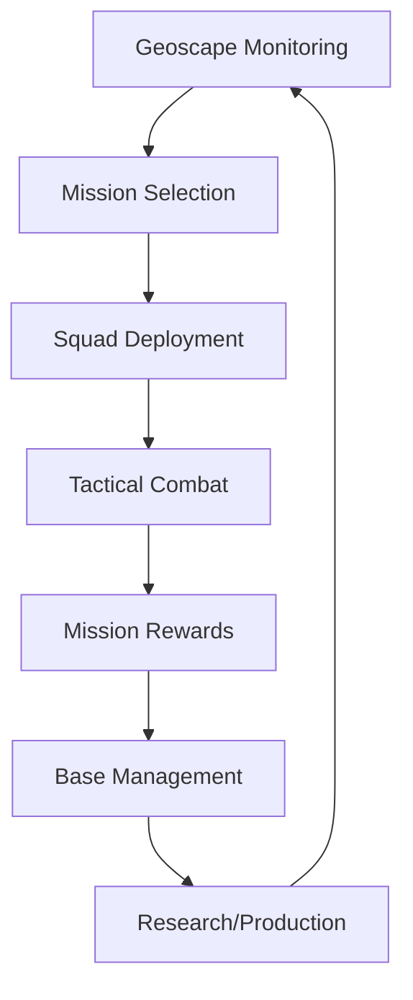

# Intermediate Strategies

**Tags:** `#tutorial` `#player-guide` `#strategy` `#intermediate` `#advanced-tactics`  
**Related:** [[Tactical_Combat_Basics]], [[Research_Strategy_Guide]], [[Base_Building_101]]  
**Audience:** Intermediate Players  
**Reading Time:** 12 minutes

---

## Overview

Ready to take your gameplay to the next level? This guide covers intermediate strategies that bridge the gap between basic mechanics and advanced mastery.

**What You'll Learn:**
- Campaign strategic layer management
- Advanced tactical formations
- Resource optimization strategies
- Mid-game crisis management
- Multi-mission planning

---

## Strategic Layer Management

### The Strategic Loop



### Mission Selection Priority

**Mission Priority Matrix:**

| Mission Type       | Priority | Why                          |
|--------------------|----------|------------------------------|
| Alien Base         | URGENT   | Reduces UFO activity         |
| Terror Mission     | HIGH     | Prevents panic, civilian loss |
| UFO Landing        | MEDIUM   | Resources, tech, corpses     |
| UFO Crash          | MEDIUM   | Easier combat, damaged aliens |
| Alien Abduction    | LOW      | Choose region strategically   |
| Council Mission    | VARIABLE | Story progress, unique rewards|

**Decision Framework:**

```
IF multiple missions available:
  1. Check time remaining
  2. Assess threat level vs squad readiness
  3. Evaluate rewards (funding, tech, civilians)
  4. Consider strategic position (panic levels)
  5. Choose highest value mission

ELSE take only mission available
```

### Panic Management

**Panic System:**
```
Panic Levels by Region:
─────────────────────────────────────
Level 1: 😊 Content (0-20 panic)
Level 2: 😐 Worried (21-40 panic)
Level 3: 😟 Alarmed (41-60 panic)
Level 4: 😨 Panicked (61-80 panic)
Level 5: 😱 WITHDRAW (81-100 panic)
─────────────────────────────────────
```

**Panic Reduction Strategies:**
1. **Complete missions in high-panic regions** (-10 panic)
2. **Build satellite coverage** (-5 panic/month)
3. **Success on terror missions** (-15 panic region-wide)
4. **Ignore low-priority missions** (acceptable +5 panic elsewhere)

**Panic Triage:**
```
SCENARIO: 3 regions at 75+ panic

BAD: Spread efforts across all 3
Result: All 3 regions withdraw

GOOD: Focus on 2 highest-funding regions
Result: Save 2 regions, lose 1 (acceptable loss)
```

---

## Advanced Tactical Formations

### The Diamond Formation

**Setup:**
```
       [S1] ← Point (Scout)
      /    \
   [S2]    [S3] ← Flanks
      \    /
       [S4] ← Rear (Support)
```

**Benefits:**
- 360° coverage (no blind spots)
- Natural flanking positions
- Point soldier triggers enemies first
- Support soldier provides backup

**When to Use:**
- Open terrain missions
- Unknown enemy positions
- High-mobility squads
- Assault/flanking tactics

### The Firing Line Formation

**Setup:**
```
[S1][S2][S3][S4] ← All soldiers in line
 ↓   ↓   ↓   ↓
Enemy approach vector
```

**Benefits:**
- Maximum overlapping fire lanes
- Strong overwatch coverage
- Concentrated firepower
- Defensive stance

**When to Use:**
- Defending positions
- Narrow approach vectors (corridors)
- Overwatch trap setups
- Heavy weapons squads

### The Leapfrog Advance

**Technique:**
```
TURN 1:
[S1][S2]     [S3][S4] ← Team A advances
         →
Team B overwatches

TURN 2:
    [S1][S2] [S3][S4] ← Team B advances
              →
Team A overwatches

Repeat: Constant pressure + overwatch coverage
```

**Benefits:**
- Maintains overwatch protection
- Steady pressure on enemies
- Minimizes exposure time
- Professional military tactic

**When to Use:**
- Long corridors/approach routes
- Against defensive enemies
- When squad has 6+ soldiers
- Coordinated advances

---

## Resource Optimization

### The 60/30/10 Budget Rule

**Monthly Income Allocation:**

```
Total Monthly Income: $1,000,000
─────────────────────────────────────
60% Infrastructure ($600,000)
  • Facility construction
  • Research projects
  • Manufacturing orders
  • Base expansion

30% Personnel ($300,000)
  • Soldier recruitment
  • Scientist hiring
  • Engineer hiring
  • Training programs

10% Emergency Reserve ($100,000)
  • Mission failures
  • Unexpected repairs
  • Opportunity buys (black market)
  • Buffer for shortfalls
─────────────────────────────────────
```

**Adjustment Rules:**
- **Early game (Month 1-3):** 70/20/10 (more infrastructure)
- **Mid game (Month 4-6):** 60/30/10 (balanced)
- **Late game (Month 7+):** 50/30/20 (larger reserves)

### Manufacturing for Profit

**High-Value Manufacturing:**

```
LASER RIFLE PRODUCTION
─────────────────────────────────────
Cost to Manufacture: $50,000
Build Time: 5 days (with 10 engineers)
Sale Price: $100,000
Profit: $50,000 per rifle

Monthly Output: 6 rifles = $300,000 profit!
─────────────────────────────────────
```

**Profitable Items (Sorted by ROI):**

| Item              | Cost    | Sale   | Profit | Days | ROI   |
|-------------------|---------|--------|--------|------|-------|
| Laser Pistol      | $20k    | $50k   | $30k   | 3    | 150%  |
| Laser Rifle       | $50k    | $100k  | $50k   | 5    | 100%  |
| Carapace Armor    | $80k    | $150k  | $70k   | 10   | 87%   |
| Plasma Pistol     | $100k   | $200k  | $100k  | 8    | 100%  |
| Alien Grenade     | $30k    | $80k   | $50k   | 3    | 167%  |

**Manufacturing Strategy:**
1. Research item
2. Manufacture 5-10 units
3. Equip squad (keep 4-6 units)
4. Sell excess for profit
5. Repeat with next item

### Research Efficiency Stacking

**Laboratory Stacking Bonus:**

```
SINGLE LAB:
[L] = 100% research speed

TWO ADJACENT LABS:
[L][L] = 110% speed each = 220% total!

THREE ADJACENT LABS:
[L][L]
[L]    = 120% + 120% + 100% = 340% total!
```

**ROI Calculation:**
```
Lab #1 Cost: $400,000
Lab #2 Cost: $400,000 (adjacent)
Lab #3 Cost: $400,000 (adjacent to 1)

Total Investment: $1,200,000

Benefit: 3.4× research speed
Value: Complete research 70% faster
Result: Unlock tech 2-3 months earlier

Strategic Advantage: IMMENSE
```

---

## Mid-Game Crisis Management

### The "Death Spiral" Prevention

**Death Spiral Definition:**
```
Soldiers die → Cannot complete missions →
Lose income → Cannot replace soldiers →
More missions fail → MORE soldiers die →
GAME OVER
```

**Warning Signs:**
- Squad < 8 soldiers
- 3+ mission failures in row
- Income < expenses
- Panic in 3+ regions
- No research progress (Month 3+)

**Recovery Strategy:**

```
PHASE 1: STOP THE BLEEDING (Days 1-7)
─────────────────────────────────────
1. Ignore risky missions (prevent more deaths)
2. Recruit 5+ soldiers immediately
3. Sell excess items for cash injection
4. Only take easy missions (1-star threat)

PHASE 2: STABILIZE (Days 8-14)
─────────────────────────────────────
1. Train new recruits in safe missions
2. Research defensive tech (armor focus)
3. Build 2nd Living Quarters (capacity)
4. Rebuild emergency reserves

PHASE 3: RECOVER (Days 15-30)
─────────────────────────────────────
1. Resume normal mission tempo
2. Complete delayed research
3. Replace lost equipment
4. Return to offensive strategy
```

### Handling Squad Wipes

**If entire squad dies:**

```
IMMEDIATE ACTIONS (Turn 1):
─────────────────────────────────────
1. Accept mission failure (withdraw)
2. Check base defenses (alien retaliation risk)
3. Assess financial situation
4. Evaluate strategic position

RECOVERY PLAN (Days 1-30):
─────────────────────────────────────
1. Hire 8-10 rookies ($200k)
2. Equip with backup gear
3. Run 3-5 easy missions (build XP)
4. Promote survivors to Squaddie+
5. Resume normal operations Month 2

WORST CASE:
If cannot afford recovery → Load previous save
Lesson: Always maintain strategic save points!
```

---

## Multi-Mission Planning

### The Campaign Calendar

**Monthly Mission Flow (Typical):**

```
MONTH 2 EXAMPLE
═══════════════════════════════════════
Day 1-5:   UFO Landing (North America)
           ✓ Complete, +$50k, 3 corpses

Day 6-10:  Abduction Mission (Europe)
           ✓ Complete, +$75k, panic -10

Day 11-15: [REST PERIOD] - Heal soldiers
           Research: Plasma Rifle
           Manufacturing: Laser Rifles ×5

Day 16-20: Terror Mission (Asia)
           ✓ Complete, +$100k, panic -15

Day 21-25: UFO Crash (South America)
           ✓ Complete, +$60k, tech loot

Day 26-30: Council Mission (Africa)
           ✓ Complete, +$125k, unique reward

═══════════════════════════════════════
Total Income: $410,000 + base funding
Missions: 5 (1.2 per week pace)
```

**Sustainable Mission Tempo:**
- **Week 1:** 1-2 missions (aggressive)
- **Week 2:** 1 mission (steady)
- **Week 3:** 2 missions (recovery phase complete)
- **Week 4:** 1 mission (avoid burnout)

**Average:** 5-6 missions per month

### Soldier Rotation System

**The A/B Team Strategy:**

```
A-TEAM (Primary Squad)
─────────────────────────────────────
Soldiers: 6 best soldiers
Equipment: Best gear
Missions: High-priority, tough missions
Rest: Every other mission

B-TEAM (Reserve Squad)
─────────────────────────────────────
Soldiers: 6 backup soldiers
Equipment: Adequate gear
Missions: Low-priority, easy missions
Role: Cover A-team rest periods
```

**Benefits:**
- Prevents injury accumulation
- Trains backup soldiers
- Maintains mission tempo
- Reduces permadeath risk

**Rotation Example:**
```
Day 1: A-Team → High-risk terror mission
Day 5: B-Team → Low-risk UFO crash
Day 8: A-Team → Medium-risk abduction
Day 12: B-Team → Council mission
Day 15: A-Team → Alien base assault
```

---

## Advanced Resource Strategies

### The Satellite Expansion Strategy

**Satellite Benefits:**
```
Per Satellite:
+ $100,000 monthly income
+ -5 panic per month
+ UFO detection in region
+ Strategic visibility

Cost per Satellite:
- $100,000 build cost
- $20,000 monthly upkeep
- Requires Uplink facility

Break-Even: 1 month
ROI: 500% per year
```

**Expansion Priority:**

```
TIER 1: High-Income Regions
─────────────────────────────────────
1. North America ($400k base income)
2. Europe ($350k base income)
3. Asia ($300k base income)

TIER 2: Strategic Regions
─────────────────────────────────────
4. South America (panic management)
5. Africa (resource access)

TIER 3: Completion
─────────────────────────────────────
6. Cover remaining regions
7. Global detection network
```

**Timeline:**
- Month 2: 2 satellites (start regions)
- Month 3: 4 satellites (add 2 more)
- Month 4: 6 satellites (full coverage key regions)
- Month 5+: 8+ satellites (complete network)

### Engineer vs Scientist Balance

**Optimal Personnel Ratios:**

```
EARLY GAME (Months 1-3)
─────────────────────────────────────
Scientists: 10 (1 lab × 10)
Engineers: 5 (workshop not critical yet)
Ratio: 2:1 (research focus)

MID GAME (Months 4-6)
─────────────────────────────────────
Scientists: 20 (2 labs × 10)
Engineers: 20 (2 workshops × 10)
Ratio: 1:1 (balanced)

LATE GAME (Months 7+)
─────────────────────────────────────
Scientists: 30 (3 labs)
Engineers: 30 (3 workshops)
Ratio: 1:1 (maximum capacity)
```

**Cost Analysis:**
```
10 Scientists = $500k hire + $150k/month
10 Engineers = $450k hire + $120k/month

Total Staff (60): ~$2M initial + $540k/month
Value: Maximum research + production speed
```

---

## Tactical Refinements

### The "Alpha Strike" Doctrine

**Concept:** Eliminate enemies before they act

```
ALPHA STRIKE EXECUTION
─────────────────────────────────────
Contact with 3 enemies:

Turn 1 (Your Turn):
1. Soldier 1: Shoots Enemy A (HIT - 6 dmg)
2. Soldier 2: Shoots Enemy A (HIT - 5 dmg) ✓ KILL
3. Soldier 3: Shoots Enemy B (HIT - 4 dmg)
4. Soldier 4: Shoots Enemy B (HIT - 5 dmg) ✓ KILL
5. Soldier 5: Shoots Enemy C (HIT - 7 dmg)
6. Soldier 6: Shoots Enemy C (HIT - 4 dmg) ✓ KILL

Enemy Turn:
0 enemies remain = 0 return fire!
─────────────────────────────────────
Result: Perfect alpha strike, no damage taken
```

**Requirements:**
- 6+ soldier squad
- High-damage weapons (plasma tier)
- Good hit chances (75%+)
- Focus fire discipline

**When to Use:**
- Outnumbered situations
- High-threat enemies
- Limited cover available
- First contact scenarios

### Suppression + Flank Combo

**Advanced Coordination:**

```
TURN SETUP:
─────────────────────────────────────
[H] Heavy with LMG
 ↓ Suppresses Enemy
[E] ← Enemy in cover
      ↙ 
[A] Assault flanks

EXECUTION:
1. Heavy suppresses Enemy (-30% aim, pinned)
2. Assault flanks Enemy from side (+30% hit)
3. Enemy cannot react effectively (suppressed)
4. Assault kills Enemy with flanking shot

Result: Safe elimination of dangerous enemy
```

**Best Against:**
- Mutons (high HP, dangerous)
- Sectopods (heavily armored)
- Cyberdiscs (aerial threats)
- Any high-priority target

---

## Strategic Timing Windows

### The "Power Spike" Moments

**Key Power Spikes:**

```
SPIKE 1: Plasma Weapons (Month 2-3)
─────────────────────────────────────
What: Research complete, mass-manufacture
Effect: +40% damage output
Advantage: Overpower enemy armor
Window: ~2 months before enemies catch up

SPIKE 2: Carapace Armor (Month 3-4)
─────────────────────────────────────
What: First major armor upgrade
Effect: +30 HP per soldier
Advantage: Tank enemy plasma weapons
Window: ~1.5 months advantage

SPIKE 3: Psionic Abilities (Month 6-7)
─────────────────────────────────────
What: Psi Lab complete, soldiers trained
Effect: Mind control, panic abilities
Advantage: Control battlefield
Window: Rest of campaign
```

**Exploiting Power Spikes:**
1. **Identify when spike occurs**
2. **Take risky missions during spike window**
3. **Push aggressive objectives** (alien bases, etc.)
4. **Bank resources before spike ends**
5. **Prepare for next spike**

### The Critical Research Delays

**DO NOT Delay These:**

```
MONTH 2 DEADLINE: Plasma Rifles
─────────────────────────────────────
Delay = Aliens get stronger faster
Risk: Soldier deaths increase 50%+

MONTH 4 DEADLINE: Carapace Armor
─────────────────────────────────────
Delay = Cannot survive alien plasma
Risk: Squad wipes increase 100%+

MONTH 6 DEADLINE: Advanced Flight
─────────────────────────────────────
Delay = Cannot intercept advanced UFOs
Risk: Miss critical missions, panic soars
```

**Timeline Pressure:**
```
Game expects you to reach tech milestones:
Month 2: Plasma weapons
Month 4: Carapace armor
Month 6: Advanced craft
Month 8: Titan armor
Month 10: Psi abilities
Month 12: Endgame preparation

Miss deadlines = Exponential difficulty increase
```

---

## Intermediate Checklist

### Strategic Layer:
- [ ] 2-3 active research projects
- [ ] 10+ soldiers recruited
- [ ] Monthly income > $800,000
- [ ] 2+ satellite coverage
- [ ] Emergency reserves ($200k+)

### Tactical Layer:
- [ ] Consistent mission success (80%+)
- [ ] Soldier promotions happening
- [ ] Advanced tactics in use (flanking, suppression)
- [ ] Low casualty rate (<1 per mission)
- [ ] Effective use of grenades/items

### Base Management:
- [ ] 2 laboratories (research bonus)
- [ ] 1-2 workshops (production online)
- [ ] Power surplus (3+ units)
- [ ] Storage adequate (not full)
- [ ] Expansion plan active

---

## Common Intermediate Pitfalls

### Pitfall 1: Overexpansion

```
Symptom: Building too many facilities too fast
Result: Cannot afford maintenance, deficit spiral

Solution: Build 1-2 facilities per month maximum
```

### Pitfall 2: Research Tunnel Vision

```
Symptom: Researching all optional tech
Result: Fall behind on critical path

Solution: Focus on combat upgrades first
```

### Pitfall 3: Neglecting Panic

```
Symptom: Ignoring panic in low-income regions
Result: Countries withdraw, funding collapses

Solution: Monitor panic, prioritize terror missions
```

### Pitfall 4: Static Tactics

```
Symptom: Using same formation every mission
Result: Predictable, exploitable by enemy AI

Solution: Adapt tactics to mission type/terrain
```

---

## Next Steps

### Advanced Topics to Explore:
1. **Psionic Combat** - Master mind control abilities
2. **Alien Base Assaults** - Tactical approach to bases
3. **Difficulty Management** - Higher difficulty strategies
4. **Speedrun Tactics** - Optimize campaign timing

### Mastery Goals:
- Complete campaign with <5 soldier deaths
- Achieve $5M+ monthly income
- Zero countries withdrawn
- All research completed
- Final mission success

---

## Frequently Asked Questions

**Q: How many soldiers should I have?**  
A: 15-20 for healthy rotation (2-3 full squads).

**Q: When should I build second base?**  
A: Month 6+ after first base maxed out.

**Q: What's optimal squad size?**  
A: 6 soldiers (balanced flexibility + action economy).

**Q: Should I specialize soldiers?**  
A: Yes, after promotion to Squaddie choose class.

**Q: How handle multiple simultaneous missions?**  
A: Prioritize by panic/income/threat, ignore lowest value.

**Q: When should I assault alien base?**  
A: Month 4-5 after plasma weapons + carapace armor.

---

## Conclusion

You now understand:
- ✓ Strategic layer management and decision-making
- ✓ Advanced tactical formations and coordination
- ✓ Resource optimization and manufacturing profits
- ✓ Crisis management and recovery strategies
- ✓ Multi-mission planning and soldier rotation

**You're ready for advanced gameplay!**

Continue refining these strategies, adapt to changing situations, and develop your own tactical doctrine. The intermediate phase is where you transition from survival to dominance. Master these concepts and you'll be ready for the endgame challenges ahead.

---

*Last Updated: September 30, 2025*  
*Version: 1.0 - Initial Release*
