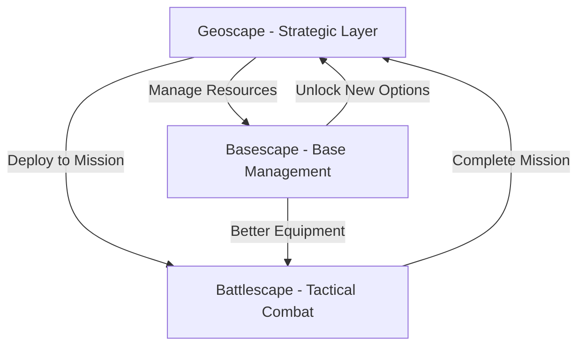

# QuickStart Guide

> **Purpose:** Get new players into Alien Fall within 30 minutes with a guided introduction to core gameplay.

---

## Welcome to Alien Fall!

Alien Fall is a turn-based strategy game inspired by XCOM where you defend Earth against an alien invasion. This guide will get you playing quickly while explaining the essentials.

**Time to Complete:** 30 minutes  
**What You'll Learn:**
- ✅ Basic game flow (Geoscape → Mission → Base)
- ✅ Your first tactical mission
- ✅ Base management fundamentals
- ✅ Research and manufacturing basics
- ✅ Essential strategies for success

---

## Game Overview: The Three Layers

Alien Fall operates on three interconnected gameplay layers:



### 🌍 Geoscape (Strategic Layer)
- **Time Flows:** Pause, normal speed, or fast-forward
- **Detect Missions:** UFOs and alien activity appear on the map
- **Deploy Crafts:** Send interceptors and squads
- **Manage Resources:** Money, research, manufacturing

### ⚔️ Battlescape (Tactical Combat)
- **Turn-Based:** You move, enemies move
- **Squad Control:** Command 4-8 soldiers
- **Objective-Based:** Complete mission goals
- **Permadeath:** Soldiers can die permanently

### 🏢 Basescape (Base Management)
- **Build Facilities:** Research labs, workshops, living quarters
- **Hire Personnel:** Scientists, engineers, soldiers
- **Research Tech:** Unlock new equipment and abilities
- **Manufacture Items:** Produce weapons, armor, equipment

---

## Starting Your Campaign

### Main Menu

1. **New Campaign** - Start fresh game
2. **Load Game** - Continue existing campaign
3. **Options** - Settings and controls
4. **Mods** - Enable community content

### Campaign Setup

**Difficulty Levels:**
- **Rookie** - Forgiving, good for learning (RECOMMENDED for first time)
- **Veteran** - Balanced challenge
- **Commander** - Tough battles, limited resources
- **Impossible** - For masochists only

**Ironman Mode:** Auto-saves only, no reloading mistakes (NOT recommended for first playthrough)

**Choose:** Rookie difficulty, Ironman OFF

---

## Tutorial Mission: First Contact

Your first mission is scripted to teach core mechanics.

### Pre-Mission: Squad Loadout

**You start with 4 soldiers:**
- Assault (primary damage dealer)
- Scout (high mobility, spotting)
- Support (healing, utility)
- Heavy (area damage, suppression)

**Equipment Check:**
Each soldier should have:
- Primary weapon (rifle or specialized weapon)
- Armor (basic kevlar)
- 1-2 utility items (medkit, grenade)

**Don't worry about optimization yet** - default loadouts work fine.

---

### Mission Objectives

**Primary:** Eliminate all hostile contacts  
**Secondary:** No soldier casualties  
**Time Limit:** 15 turns (plenty of time)

---

### Tactical Combat Basics

#### The UI

```
┌─────────────────────────────────────┐
│  Turn: 1    AP: 4/4    Health: 100  │ ← Unit Status
├─────────────────────────────────────┤
│                                     │
│     [Tactical Map View]             │ ← Battlefield
│     • Blue = Your Units             │
│     • Red = Enemies                 │
│     • Yellow = Objectives           │
│                                     │
├─────────────────────────────────────┤
│ [Move][Shoot][Overwatch][Items][End]│ ← Action Buttons
└─────────────────────────────────────┘
```

#### Action Points (AP)

Each soldier has **4 AP per turn**:
- **Move:** 1 AP per tile (varies by terrain)
- **Shoot:** 2-4 AP depending on weapon
- **Reload:** 2 AP
- **Use Item:** 1-2 AP
- **Overwatch:** 2 AP (reaction fire)

**Key Rule:** Spend AP wisely! Can't get them back until next turn.

---

#### Movement

**Controls:**
- **Mouse:** Click destination tile
- **Keyboard:** Arrow keys + Enter

**Movement Types:**
- **Blue Zone:** Can move and still shoot
- **Yellow Zone:** Can move but can't shoot after
- **Red Zone:** Can't reach this turn

**Cover System:**
- **No Cover:** 😰 100% damage taken
- **Low Cover** (🛡️): 50% damage reduction
- **High Cover** (🛡️🛡️): 75% damage reduction

**ALWAYS END TURN IN COVER!**

---

#### Combat

**Shooting:**
1. Select soldier
2. Click "Shoot" or press [F]
3. Click enemy target
4. Confirm shot

**Hit Chance Factors:**
- Base Accuracy (soldier stat)
- Range (closer = better)
- Target Cover (reduces chance)
- Flanking (attack from side/rear for bonus)

**Damage:**
- Each weapon has base damage
- Armor reduces damage
- Critical hits (15% chance) deal double damage

---

#### Key Tactics

**1. Use Cover**
```
BAD:  ● (soldier in open) ← Easy target!
GOOD: ●|‾| (soldier behind wall) ← Protected!
```

**2. Overwatch (Reaction Fire)**
- Sets up "ambush" that fires when enemies move
- Use when expecting enemy movement
- Costs 2 AP, triggers automatically

**3. Flanking**
```
Enemy has cover from front:
   ●|‾|  ← 75% damage reduction
    ↑
Your soldier

Flank from the side:
●|‾| ← No cover bonus!
  ↓
  ●  Your soldier (flanking)
```

**4. High Ground Advantage**
- +10% accuracy when shooting from elevation
- Easier to see enemies
- Harder for enemies to hit you

---

### Tutorial Mission Walkthrough

**Turn 1-2: Advance Cautiously**
1. Move each soldier forward 2-3 tiles
2. Stay in cover
3. Don't sprint into the unknown
4. End turns in overwatch if no targets

**Turn 3-5: First Contact**
1. Aliens appear
2. Take shots at visible enemies
3. Prioritize closest threats
4. Use grenades on groups (2+ enemies)

**Turn 6-10: Clear the Map**
1. Push forward methodically
2. Heal wounded soldiers with medkits
3. Reload empty weapons
4. Don't rush - aliens come to you

**Turn 11-15: Cleanup**
1. Hunt remaining aliens
2. Check all corners
3. Complete objectives
4. Extract to evac zone

---

### Post-Mission: Results

**You'll see:**
- Mission Success/Failure
- Soldier XP gained
- Loot recovered (weapons, resources)
- Casualties (hopefully none!)
- Credits earned

**Soldiers level up!**
- Gain stat increases
- May unlock new abilities
- Choose ability when prompted

---

## Your First Base

After the mission, you're at your home base.

### Base Overview

Your starting base has:
- **Hangar** - Stores interceptor craft
- **Barracks** - Houses soldiers
- **Research Lab** - Small lab for scientists
- **Workshop** - Small workshop for engineers
- **Command Center** - Mission control (can't remove)

### Essential First Steps

#### 1. Hire More Personnel (First Priority!)

**Navigation:** Basescape → Personnel → Recruit

**Hire:**
- **2 Scientists** ($2,000 each) - For research
- **2 Engineers** ($1,500 each) - For manufacturing
- **2-4 Soldiers** ($1,000 each) - Backup squad members

**Why:** You need personnel to do anything!

---

#### 2. Start Research (Immediately!)

**Navigation:** Basescape → Research

**First Research Projects:**
1. **Alien Biology** - Unlocks autopsies and medical tech
2. **Alien Weapons** - Unlocks plasma weapons
3. **Advanced Armor** - Better protection

**Choose:** Start with Alien Biology (fastest, useful immediately)

**Assign Scientists:** All available scientists to active project

---

#### 3. Build More Facilities

**Navigation:** Basescape → Build

**Priority Buildings:**
- **Living Quarters** - House more personnel
- **Research Lab** - Faster research
- **Workshop** - Manufacturing capacity
- **Power Generator** - Powers advanced facilities

**Start with:** Living Quarters (you'll need space soon)

**Building Takes Time:** 7-14 days depending on facility

---

#### 4. Check Finances

**Navigation:** Basescape → Finances

**Starting Budget:** ~$500,000

**Monthly Expenses:**
- Soldier salaries: $200/month each
- Scientist salaries: $400/month each
- Engineer salaries: $300/month each
- Facility maintenance: $500-2,000/month
- Craft fuel/repairs: Variable

**Monthly Income:**
- Council funding: $100,000-300,000 (based on performance)
- Mission rewards: $5,000-50,000 per mission

**Rule of Thumb:** Keep $100,000 emergency fund

---

## Geoscape: The Strategic Layer

Return to the Geoscape (World Map) to continue the campaign.

### Time Controls

**Keyboard Shortcuts:**
- **Space** - Pause/Resume
- **1** - Normal speed
- **2** - 5× speed
- **3** - 30× speed (max)

**Mouse:** Time controls at bottom of screen

---

### Detecting Missions

**Radar Coverage:**
- Your base has limited radar range (shown as circle)
- UFOs within range are detected
- Build more bases or radar facilities for coverage

**Mission Types:**
- **UFO Sighting** - Intercept and shoot down
- **Terror Mission** - Aliens attacking civilians
- **Abduction** - Aliens kidnapping people
- **Base Assault** - Aliens attack YOUR base!

**Response Window:**
- Most missions expire after 6-24 hours
- Act quickly or mission is lost
- Penalties for ignored missions

---

### Intercepting UFOs

**When UFO Detected:**
1. Click UFO icon
2. Click "Intercept"
3. Select craft (Interceptor)
4. Craft flies to engage

**Air Combat:**
- Automatic (you watch)
- Craft weapons fire at UFO
- UFO shoots back
- Win: UFO crashes (ground mission)
- Lose: Craft returns damaged

**After Shooting Down UFO:**
- Crash site appears
- Deploy ground squad
- Recover alien tech and resources

---

### Key Geoscape Strategies

**1. Balance Time**
- Don't fast-forward blindly
- Check radar every 30 minutes (game time)
- Pause when events occur

**2. Prioritize Missions**
- Terror missions = highest priority
- UFO hunting = good resources
- Ignore some missions if overwhelmed

**3. Build Multiple Bases (Mid-Game)**
- Global radar coverage
- Multiple squads
- Resource redundancy
- Costs a lot, worth it later

**4. Save Monthly**
- Funding arrives 1st of each month
- Critical milestone
- Can lose campaign if funding drops too low

---

## Research & Manufacturing

### Research Progression

**Early Game (Months 1-2):**
1. Alien Biology → Medical upgrades
2. Alien Weapons → Plasma tech
3. Improved Armor → Better protection
4. Alien Materials → Advanced manufacturing

**Mid Game (Months 3-5):**
1. UFO Power Sources → Better craft
2. Psionics → Mind powers
3. Advanced Weapons → Endgame gear
4. Alien Command → Story progression

**Late Game (Months 6+):**
1. Alien Command Structure → Final missions
2. Ultimate Weapons → Campaign-ending tech
3. Strategic Research → Victory conditions

**Research Tips:**
- Research prerequisites unlock new projects
- Some require alien corpses/artifacts
- Parallel research (multiple projects) is good
- Don't ignore utility research (med, armor)

---

### Manufacturing

**How It Works:**
1. Research unlocks manufacturing recipes
2. Gather required resources (alloys, elerium)
3. Start production in workshop
4. Wait for completion (hours to days)
5. Equipment added to inventory

**What to Manufacture:**

**Priority 1: Equipment**
- Weapons for all soldiers
- Armor suits
- Utility items (medkits, grenades)

**Priority 2: Craft Equipment**
- Interceptor weapons
- Craft armor plating
- Fuel cells

**Priority 3: Sell for Profit**
- Some items valuable on black market
- Manufacture for income if needed
- Don't sell unique alien artifacts!

---

## Essential Strategies

### Combat Strategy

**1. Action Economy**
```
GOOD: Use all 4 AP efficiently
- Move (1 AP)
- Shoot (3 AP)
Total: 4 AP used

BAD: Waste AP
- Move (1 AP)
- End turn (3 AP wasted)
```

**2. Squad Formation**
```
Recommended Diamond:
    Scout
Heavy    Assault
    Support

- Scout sees enemies first
- Heavy/Assault deal damage
- Support heals/provides utility
```

**3. Target Priority**
1. **Psionic enemies** (mind control)
2. **Heavy hitters** (high damage)
3. **Injured enemies** (easy kills)
4. **Flanked enemies** (high hit chance)

**4. Retreat Is Valid**
- Not every mission is winnable
- Losing entire squad worse than mission failure
- Evac zone usually available
- Live to fight another day

---

### Resource Management

**Credits (Money):**
- Monthly funding from council
- Mission rewards
- Manufacturing profits
- **DON'T:** Go broke (game over if can't pay salaries)

**Scientists:**
- Faster research
- **Sweet spot:** 10-15 scientists
- Diminishing returns after 20

**Engineers:**
- Faster manufacturing
- **Sweet spot:** 8-12 engineers
- Needed for advanced facilities

**Soldiers:**
- Active squad: 6-8
- Reserves: 4-6
- **Total:** 10-14 soldiers minimum

---

### Campaign Progression

**Month 1-2: Survival**
- Learn mechanics
- Build basic infrastructure
- Complete easy missions
- Research fundamentals

**Month 3-4: Expansion**
- Build second base
- Advanced weapons/armor
- Tackle harder missions
- Increase squad size

**Month 5-6: Dominance**
- Top-tier equipment
- Multiple squads
- Hunt UFOs aggressively
- Story missions unlock

**Month 7+: Endgame**
- Final research
- Climactic missions
- Victory conditions
- Campaign conclusion

---

## Common Mistakes to Avoid

### ❌ Don't Do This

**1. Ignoring Cover**
- Standing in the open = death
- Always end turn in cover
- Even low cover is better than none

**2. Overextending**
- Moving too far forward
- Getting surrounded
- Splitting up the squad
- **Stay together!**

**3. Not Researching**
- Falling behind technologically
- Aliens get stronger over time
- You need to keep pace
- Assign scientists ALWAYS

**4. Hoarding Resources**
- Sitting on $500,000 doing nothing
- Not manufacturing equipment
- Soldiers using starter gear at month 4
- **Use your resources!**

**5. Ignoring Soldier Health**
- Wounded soldiers need recovery
- Don't deploy injured units
- Rotate squads
- Build backup team

**6. Panic Spending**
- Going broke on luxury facilities
- Over-hiring personnel
- Manufacturing unnecessary items
- **Budget wisely!**

---

## Quick Reference Card

### Controls

| Action | Keyboard | Mouse |
|--------|----------|-------|
| Select Unit | 1-8 | Left Click |
| Move | Arrow Keys | Click Destination |
| Shoot | F | Click Target |
| Overwatch | O | Button → End Turn |
| Use Item | I | Click Item → Target |
| Next Unit | Tab | - |
| End Turn | Enter | Button |
| Pause | Space | Button |

### Core Stats

| Stat | Purpose |
|------|---------|
| Health | Hit points (0 = dead) |
| AP | Actions per turn |
| Accuracy | Hit chance |
| Damage | Weapon damage |
| Armor | Damage reduction |

### AP Costs

| Action | Cost |
|--------|------|
| Move 1 tile | 1 AP |
| Shoot (rifle) | 3 AP |
| Reload | 2 AP |
| Use Item | 1-2 AP |
| Overwatch | 2 AP |

---

## Next Steps

### Tutorials

After completing the QuickStart:

1. **[Tactical Combat Deep Dive](Tactical_Combat_Basics.md)** - Advanced battle tactics
2. **[Base Building Guide](Base_Building_101.md)** - Optimal facility layouts
3. **[Research Strategy Guide](Research_Strategy_Guide.md)** - Tech tree navigation
4. **[First Mission Walkthrough](First_Mission_Walkthrough.md)** - Detailed mission guide

### Advanced Topics

Once comfortable with basics:

- **[Intermediate Strategies](Intermediate_Strategies.md)** - Mid-game tactics
- **[Squad Composition](../units/Squad_Composition.md)** - Building effective teams
- **[Economy Guide](../economy/README.md)** - Resource optimization
- **[Mod Guide](../mods/README.md)** - Enhance your game

---

## Troubleshooting

### "My soldiers keep dying!"
- Use cover ALWAYS
- Don't rush forward
- Overwatch when unsure
- Heal proactively

### "I'm running out of money!"
- Complete more missions
- Don't over-hire
- Manufacture for profit
- Check monthly reports

### "Research is too slow!"
- Hire more scientists
- Build more labs
- Focus one project at a time
- Check prerequisites

### "Missions are too hard!"
- Lower difficulty setting
- Better equipment needed
- Squad composition wrong?
- Tactics need improvement

---

## Community & Support

### Getting Help
- **Discord** - Real-time chat
- **Forums** - In-depth discussions
- **Wiki** - Comprehensive documentation
- **Steam Community** - Guides and tips

### Share Your Experience
- Post screenshots
- Share epic moments
- Help other new players
- Create content

---

## Welcome to the Resistance!

You're now ready to defend Earth against the alien invasion. Remember:
- **Take it slow** - This game rewards patience
- **Learn from losses** - Every death teaches something
- **Experiment** - Try different strategies
- **Have fun** - It's a game, not a job!

Good luck, Commander. Earth is counting on you.

---

## Tags
`#tutorial` `#quickstart` `#beginner` `#guide` `#basics`
