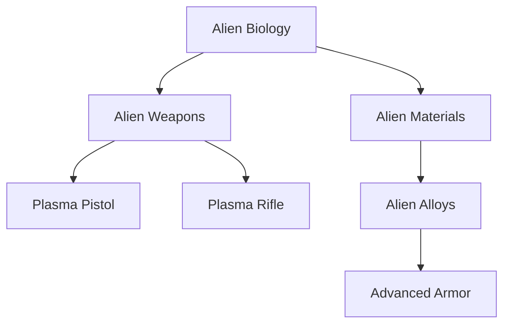

# Research Strategy Guide

**Tags:** `#tutorial` `#player-guide` `#research` `#tech-tree` `#strategy`  
**Related:** [[Base_Building_101]], [[QuickStart_Guide]], [[../balance/README]]  
**Audience:** New Players  
**Reading Time:** 15 minutes

---

## Overview

Research is the key to technological superiority in Alien Fall. This guide covers the research system, optimal tech paths, priority projects, and strategies to maximize your research efficiency.

**What You'll Learn:**
- Research mechanics and project management
- Critical path vs optional research
- Tech tree navigation and dependencies
- Scientist allocation and efficiency
- Research timing and prioritization

---

## Research System Mechanics

### How Research Works

```
RESEARCH PROJECT FLOW
════════════════════════════════════════

1. UNLOCK Prerequisites
   ↓
2. START Project (assign scientists)
   ↓
3. PROGRESS Over Time (days pass)
   ↓
4. COMPLETE Project (gain benefits)
   ↓
5. UNLOCK New Projects (dependencies)

════════════════════════════════════════
```

### Research Speed Formula

```
Research Speed = Base Speed × Scientist Efficiency × Facility Bonuses

Base Speed:
• 1 day per research unit

Scientist Efficiency:
• 1-10 scientists = 100% efficiency
• 11-20 scientists = 50% efficiency (diminishing returns)
• 21+ scientists = 25% efficiency

Facility Bonuses:
• +10% per adjacent laboratory
• +5% per advanced research facility
```

**Example:**
```
Project: Alien Weapons
Base Duration: 20 days
Scientists: 10 (100% efficiency)
Labs: 2 adjacent (+10% bonus)
─────────────────────────────────────
Actual Duration: 20 ÷ 1.1 = 18 days
─────────────────────────────────────
```

---

## The Tech Tree: Critical Path

### Foundation Tier (Month 1-2)

These are **MANDATORY** early research projects:



#### 1. Alien Biology (PRIORITY #1)
```
ALIEN BIOLOGY
─────────────────────────────────────
Duration: 10 days
Requires: 1 Alien Corpse (Sectoid)
Scientists: 5-10

Unlocks:
• Improved medkits (+25% healing)
• Alien Containment facility
• Xenobiology research branch
• Interrogation projects

Why Critical:
First research available, gates major tech
```

**Start this on Day 1!**

#### 2. Alien Weapons (PRIORITY #2)
```
ALIEN WEAPONS
─────────────────────────────────────
Duration: 15 days
Requires: 1 Plasma Pistol
Prerequisites: Alien Biology

Unlocks:
• Plasma weapon manufacturing
• Advanced weapon research
• Weapon mod research
• Damage boost (+20% over conventional)

Why Critical:
Mandatory for weapon progression
```

#### 3. Alien Materials (PRIORITY #3)
```
ALIEN MATERIALS
─────────────────────────────────────
Duration: 12 days
Requires: 5 Alien Alloys
Prerequisites: Alien Biology

Unlocks:
• Advanced armor manufacturing
• Facility upgrades
• Craft improvements
• Material efficiency research

Why Critical:
Gates all armor and craft upgrades
```

### Early Game Path (Month 1-3)

**Recommended Research Order:**

```
MONTH 1
─────────────────────────────────────
Day 1-10:   Alien Biology
Day 11-25:  Alien Weapons
Day 26-30:  [Queue: Alien Materials]

MONTH 2
─────────────────────────────────────
Day 31-42:  Alien Materials
Day 43-60:  Plasma Rifle (combat boost)
Day 61-70:  [Queue: Carapace Armor]

MONTH 3
─────────────────────────────────────
Day 71-85:  Carapace Armor
Day 86-100: UFO Power Systems
Day 101+:   Choose specialization branch
```

---

## Research Branches Explained

### Branch A: Weapons Technology

**Focus:** Maximize combat damage output

```
Alien Weapons (15 days)
  ├── Plasma Pistol (8 days)
  ├── Plasma Rifle (12 days)
  ├── Heavy Plasma (15 days)
  └── Plasma Sniper (18 days)
      └── Plasma Cannon (20 days)
```

**Benefits:**
- +20% damage per tier
- Longer range
- Better accuracy
- Armor penetration

**When to Focus:**
- Struggling with enemy armor
- Offensive playstyle
- High-aim soldiers

### Branch B: Armor Technology

**Focus:** Maximize soldier survivability

```
Alien Materials (12 days)
  ├── Carapace Armor (15 days)
  │   └── Skeleton Suit (20 days)
  └── Titan Armor (25 days)
      └── Archangel Armor (30 days)
```

**Benefits:**
- +30% HP per tier
- Damage reduction
- Special abilities (grappling, flight)
- Status resistance

**When to Focus:**
- Soldiers dying frequently
- Defensive playstyle
- Higher difficulties

### Branch C: Psionics

**Focus:** Unlock psychic abilities

```
Alien Psychology (20 days)
  └── Psionics (25 days)
      ├── Psi Amp (15 days)
      ├── Mind Shield (18 days)
      └── Psi Lab (requires facility)
          └── Advanced Psionics (30 days)
```

**Benefits:**
- Mind control abilities
- Panic immunity
- Psionic attacks
- Late-game power spike

**When to Focus:**
- Mid-late game (Month 6+)
- After core tech complete
- Facing psionic enemies

### Branch D: Engineering

**Focus:** Base facilities and craft

```
UFO Construction (18 days)
  ├── Improved Interceptors (15 days)
  ├── Advanced Radar (12 days)
  └── Firestorm Interceptor (25 days)
      └── Plasma Cannons (Craft) (20 days)
```

**Benefits:**
- Better interception capability
- Expanded detection range
- Faster research (advanced labs)
- Production efficiency

**When to Focus:**
- Losing air battles
- Want better detection
- Economic focus (workshops)

---

## Optimal Research Strategies

### Strategy 1: Balanced Approach (Recommended)

**Goal:** Steady progression across all areas

```
PHASE 1 (Months 1-3): Foundation
─────────────────────────────────────
✓ Alien Biology
✓ Alien Weapons  
✓ Alien Materials
✓ Plasma Rifle
✓ Carapace Armor

PHASE 2 (Months 4-6): Specialization
─────────────────────────────────────
→ Choose 1 combat branch (weapons OR armor)
→ Start engineering projects
→ Begin psi research (if applicable)

PHASE 3 (Months 7+): Endgame
─────────────────────────────────────
→ Complete chosen specializations
→ Unlock all advanced tech
→ Research victory conditions
```

**Pros:**
- Never fall behind in any area
- Flexible adaptation to threats
- Safe, reliable progression

**Cons:**
- No early power spikes
- Slower individual tech unlocks

### Strategy 2: Weapons Rush

**Goal:** Maximum firepower ASAP

```
RUSH PATH
─────────────────────────────────────
1. Alien Biology (10d)
2. Alien Weapons (15d)
3. Plasma Rifle (12d)
4. Heavy Plasma (15d)
5. Plasma Sniper (18d)
─────────────────────────────────────
Total: 70 days (2.5 months)
Result: Full plasma arsenal by Month 3!
```

**Pros:**
- Overwhelming firepower early
- Easier missions
- Kill aliens before they act

**Cons:**
- Fragile soldiers (no armor upgrades)
- Vulnerable to alien weapons
- High risk if ambushed

**Best For:** Offensive players, lower difficulties

### Strategy 3: Armor First

**Goal:** Survivability over damage

```
DEFENSE PATH
─────────────────────────────────────
1. Alien Biology (10d)
2. Alien Materials (12d)
3. Carapace Armor (15d)
4. Skeleton Suit (20d)
5. Titan Armor (25d)
─────────────────────────────────────
Total: 82 days (2.7 months)
Result: Heavy armor by Month 3!
```

**Pros:**
- Soldiers survive longer
- Reduced medical downtime
- Forgiving for mistakes

**Cons:**
- Slower mission completion
- Long firefights
- More ammunition consumption

**Best For:** Defensive players, higher difficulties

### Strategy 4: Economic Focus

**Goal:** Maximize income and production

```
ECON PATH
─────────────────────────────────────
1. Alien Biology (10d)
2. Alien Weapons (15d)
3. UFO Construction (18d)
4. Advanced Workshops (20d)
5. Alien Manufacturing (25d)
─────────────────────────────────────
Total: 88 days (3 months)
Result: Mass production capability!
```

**Pros:**
- Sell manufactured items for profit
- Build multiple advanced craft
- Fast facility construction
- Self-funding economy

**Cons:**
- Weaker combat power early
- Requires large investment
- Delayed military upgrades

**Best For:** Long campaign focus, economic playstyle

---

## Research Priority Decision Tree

Use this flowchart to decide what to research:

```
START: Choose Next Research
│
├─ Are soldiers dying frequently?
│  YES → Research Armor (Carapace → Titan)
│  NO ↓
│
├─ Are missions taking too long?
│  YES → Research Weapons (Plasma Rifle → Heavy)
│  NO ↓
│
├─ Losing UFO interceptions?
│  YES → Research Craft (Firestorm, Plasma Cannons)
│  NO ↓
│
├─ Running out of money?
│  YES → Research Manufacturing (Workshops, Production)
│  NO ↓
│
├─ Month 6+ and core tech complete?
│  YES → Research Psionics (Unlock psi abilities)
│  NO ↓
│
└─ Default: Continue balanced tech tree progression
```

---

## Scientist Management

### Hiring Scientists

```
SCIENTIST STATS
─────────────────────────────────────
Hire Cost: $50,000 each
Salary: $15,000/month each
Capacity: 10 per laboratory

Starting Staff: 0 scientists
Recommended: 10 scientists (Month 1)
Maximum Efficient: 20 scientists (Month 3+)
─────────────────────────────────────
```

**Hiring Schedule:**
- **Day 1**: Hire 5 scientists ($250k)
- **Month 2**: Hire 5 more ($250k) = 10 total
- **Month 3**: Hire 10 more ($500k) = 20 total (if 2nd lab)

### Allocation Strategy

**Single Laboratory (10 scientists):**
```
All 10 scientists → 1 project
Research Speed: 100%
Projects Queue: 1 active, unlimited queued
```

**Dual Laboratories (20 scientists):**
```
Lab #1: 10 scientists → High priority project
Lab #2: 10 scientists → Secondary project
Research Speed: 100% × 2 labs!
```

**Triple Laboratories (30 scientists):**
```
Lab #1: 10 scientists → Critical path (100%)
Lab #2: 10 scientists → Combat upgrades (100%)
Lab #3: 10 scientists → Optional research (100%)

Note: 30 scientists costs $450k/month!
```

### Research Queue Management

**Effective Queuing:**
```
RESEARCH QUEUE (Prioritized)
═══════════════════════════════════════
1. [ACTIVE] Plasma Rifle (5 days left)
2. [QUEUED] Carapace Armor (15 days)
3. [QUEUED] UFO Power Systems (18 days)
4. [QUEUED] Advanced Grenades (10 days)
═══════════════════════════════════════
```

**Queue Tips:**
- Keep 3-4 projects queued
- Prioritize critical path at top
- Adjust based on mission results
- Cancel low-priority projects if needed

---

## Research Unlocks and Benefits

### Immediate Impact Research

Projects with instant combat benefits:

| Research          | Duration | Benefit                        |
|-------------------|----------|--------------------------------|
| Plasma Rifle      | 12 days  | +20% damage, +2 range          |
| Carapace Armor    | 15 days  | +30 HP, +10 defense            |
| Advanced Medkits  | 8 days   | +25% healing, +1 use           |
| Scope             | 5 days   | +10% aim                       |
| AP Ammo           | 10 days  | +15% armor penetration         |
| Improved Grenades | 8 days   | +2 damage, +1 tile radius      |

**Use these for quick power spikes!**

### Facility-Unlocking Research

Required for new buildings:

| Research            | Unlocks Facility       |
|---------------------|------------------------|
| Alien Biology       | Alien Containment      |
| Psionics            | Psi Lab                |
| Advanced Engineering| Advanced Workshop      |
| Hyperwave Beacon    | Hyperwave Relay        |
| Elerium Research    | Elerium Generator      |

### Strategic Research

Long-term investments:

| Research         | Strategic Benefit            |
|------------------|------------------------------|
| UFO Analysis     | Better mission intel         |
| Alien Tactics    | Predict enemy behavior       |
| Interrogations   | Reveal alien bases           |
| Hyperwave Beacon | Detect all UFO activity      |
| The Volunteer    | Unlock final mission         |

---

## Common Research Mistakes

### Mistake 1: Ignoring Prerequisites ❌

```
WRONG:
Day 1: Start "Plasma Rifle" research
Result: ERROR - Requires "Alien Weapons" first!
```

**Solution:** Check tech tree dependencies before starting

### Mistake 2: Spreading Scientists Thin ❌

```
WRONG:
Lab #1: 3 scientists on Project A
Lab #2: 3 scientists on Project B  
Lab #3: 4 scientists on Project C
Result: All projects at 30-40% efficiency!
```

**Solution:** Concentrate 10 scientists per project

### Mistake 3: Researching Too Much ❌

```
WRONG:
Month 6: Researching all optional weapon mods
Meanwhile: No armor upgrades, soldiers dying
```

**Solution:** Focus on critical path, skip optional research

### Mistake 4: No Research Queue ❌

```
WRONG:
Project completes → 3 days deciding next research
Result: Wasted scientist time!
```

**Solution:** Always have 2-3 projects queued

### Mistake 5: Ignoring Autopsy/Interrogations ❌

```
WRONG:
Capture 5 aliens → Never interrogate
Kill 20 Floaters → Never autopsy
```

**Solution:** Research 1 of each enemy type (benefits!)

---

## Advanced Research Tactics

### Parallel Research Paths

With 2+ laboratories, research in parallel:

```
MONTH 3 PARALLEL RESEARCH
═══════════════════════════════════════
Lab #1 (Combat Focus):
  → Heavy Plasma (15 days)
  → Titan Armor (25 days)

Lab #2 (Strategic Focus):
  → UFO Power Systems (18 days)
  → Advanced Radar (12 days)
═══════════════════════════════════════
Result: Complete 4 projects in 40 days
       vs 70 days if sequential!
```

### Research Sniping

Rush specific high-value techs:

**Plasma Rifle Rush:**
```
Day 1-10:   Alien Biology
Day 11-25:  Alien Weapons
Day 26-37:  Plasma Rifle
─────────────────────────────────────
Day 38: Entire squad has plasma rifles!
Enemy armor: Still weak to plasma
Result: Massive power spike!
```

**Armor Rush:**
```
Day 1-10:   Alien Biology
Day 11-22:  Alien Materials
Day 23-37:  Carapace Armor
─────────────────────────────────────
Day 38: Entire squad in carapace!
Enemy damage: Still low-tier
Result: Near-invincible soldiers!
```

### Autopsy Efficiency

**Autopsy Benefits:**
- +10% damage vs that alien type
- +5% aim vs that alien type
- Unlocks special projects

**Autopsy Priority:**
1. Sectoid (common early enemy)
2. Floater (aerial threat)
3. Muton (heavy unit)
4. Chrysalid (melee threat)
5. Others as encountered

**Time Investment:** 5-8 days each

### Interrogation Strategy

**Interrogation Benefits:**
- Reveal alien base locations
- Unlock advanced research
- Strategic intel (mission types, schedules)

**Interrogation Priority:**
1. Sectoid (easiest to capture)
2. Outsider (reveals alien bases)
3. Muton (tactics intel)
4. Ethereal (late-game critical)

**Requirements:**
- Alien Containment facility
- Arc Thrower weapon
- Successful capture mission

---

## Research Timing Optimization

### Critical Timing Windows

**Month 1-2: Foundation**
- Must complete Alien Biology + Weapons
- Goal: Plasma weapons by Month 2
- Aliens still weak, easy missions

**Month 3-4: Mid-Game Transition**
- Complete Carapace Armor minimum
- Start specialization branches
- Aliens get tougher, need upgrades

**Month 5-6: Power Spike**
- Heavy weapons or Titan armor
- UFO interception tech
- Prepare for late-game threats

**Month 7+: Endgame**
- Psionics unlocked
- All advanced tech researched
- Push toward final mission

### Avoiding Research Traps

**Trap 1: Too Many Optional Projects**
```
Researching: Alien Entertainment, Alien Food, Alien Culture
Time Wasted: 60+ days on lore
Result: Aliens outpace your tech!
```

**Trap 2: Sequential Dependencies**
```
Must complete: A → B → C → D → E
Time Required: 100+ days
Result: Falls behind meta, hard to catch up
```

**Trap 3: Over-Investing in Psionics Early**
```
Month 2: Start Psionics research
Problem: Takes 50+ days, requires facility
Result: No combat upgrades, soldiers weak
```

---

## Research Efficiency Checklist

### Weekly Research Review:
- [ ] Current project on-track for completion?
- [ ] Scientists at 100% allocation (10 per project)?
- [ ] Research queue has 2-3 projects ready?
- [ ] Adjacent laboratories for +10% bonus?
- [ ] Autopsy/interrogation projects completed?

### Monthly Research Goals:
- [ ] At least 2 major research projects completed
- [ ] All prerequisite materials collected
- [ ] Combat power increased (weapons OR armor)
- [ ] Strategic tech advancing (facilities, craft)
- [ ] On-track for endgame timing

### Research Milestone Targets:

**Month 2:**
- [x] Alien Biology complete
- [x] Alien Weapons complete
- [x] First plasma weapon researched

**Month 4:**
- [ ] First armor upgrade complete (Carapace)
- [ ] Heavy weapon researched
- [ ] UFO tech branch started

**Month 6:**
- [ ] Advanced armor researched (Titan/Skeleton)
- [ ] Psionics unlocked
- [ ] Advanced facilities available

---

## Quick Reference Tables

### High-Priority Research (Must-Have)

| Research          | Duration | Priority | Why                      |
|-------------------|----------|----------|--------------------------|
| Alien Biology     | 10 days  | ★★★★★    | Gates everything         |
| Alien Weapons     | 15 days  | ★★★★★    | Weapon progression       |
| Alien Materials   | 12 days  | ★★★★★    | Armor progression        |
| Plasma Rifle      | 12 days  | ★★★★☆    | Major damage boost       |
| Carapace Armor    | 15 days  | ★★★★☆    | Major survivability      |
| UFO Power Systems | 18 days  | ★★★☆☆    | Facility/craft upgrades  |

### Optional Research (Nice-to-Have)

| Research          | Duration | Priority | Why                      |
|-------------------|----------|----------|--------------------------|
| Weapon Mods       | 5-8 days | ★★☆☆☆    | Marginal improvements    |
| Alien Lore        | 10 days  | ★☆☆☆☆    | Story only, no benefit   |
| Advanced Grenades | 8 days   | ★★★☆☆    | Situational utility      |
| Elerium Research  | 20 days  | ★★☆☆☆    | Late-game only           |

---

## Next Steps

### Recommended Tutorials:
1. **[[Base_Building_101]]** - Build laboratories for research
2. **[[First_Mission_Walkthrough]]** - Collect research materials
3. **[[Intermediate_Strategies]]** - Advanced tech timing

### Advanced Topics:
- **[[/wiki/economy/Research_tree]]** - Complete tech tree reference
- **[[../balance/README]]** - Research balance and difficulty curves
- **[[/wiki/economy/README]]** - Economic systems and funding

---

## Frequently Asked Questions

**Q: Can I research multiple projects simultaneously?**  
A: Yes, with multiple laboratories! Each lab can run 1 project.

**Q: What happens if I cancel research?**  
A: Lose all progress, no refund. Only cancel low-priority projects.

**Q: Should I research every autopsy?**  
A: Research 1 of each enemy type. Additional autopsies give no benefit.

**Q: How do I get research materials?**  
A: Complete missions, recover alien corpses/weapons/materials.

**Q: Can I skip Alien Biology?**  
A: NO! It's mandatory for all progression. Start Day 1.

**Q: What if I can't afford scientists?**  
A: Hire 5 minimum. Sell items to raise funds if needed.

**Q: Should I research psionics early?**  
A: No, wait until Month 6+. Core tech takes priority.

---

## Conclusion

You now understand:
- ✓ Research mechanics and efficiency
- ✓ Critical tech paths and priorities
- ✓ Optimal research strategies
- ✓ Scientist allocation and management
- ✓ Research timing and progression

**Research is the foundation of victory!**

Choose your path wisely, balance combat and strategic needs, and stay ahead of the alien technological curve. Every research project brings you one step closer to understanding—and defeating—the extraterrestrial threat.

---

*Last Updated: September 30, 2025*  
*Version: 1.0 - Initial Release*
