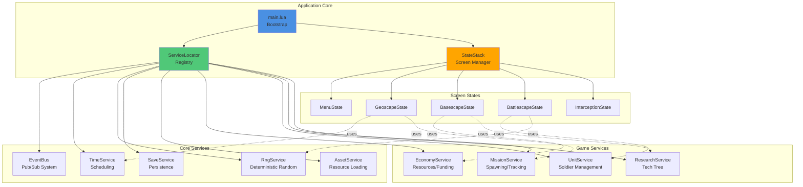
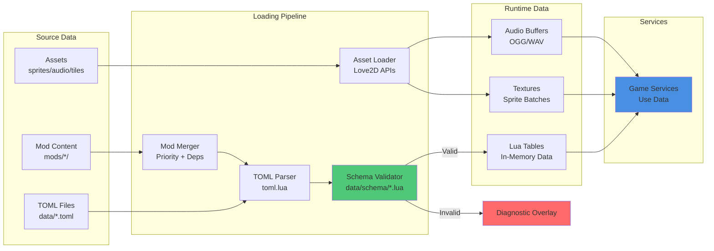
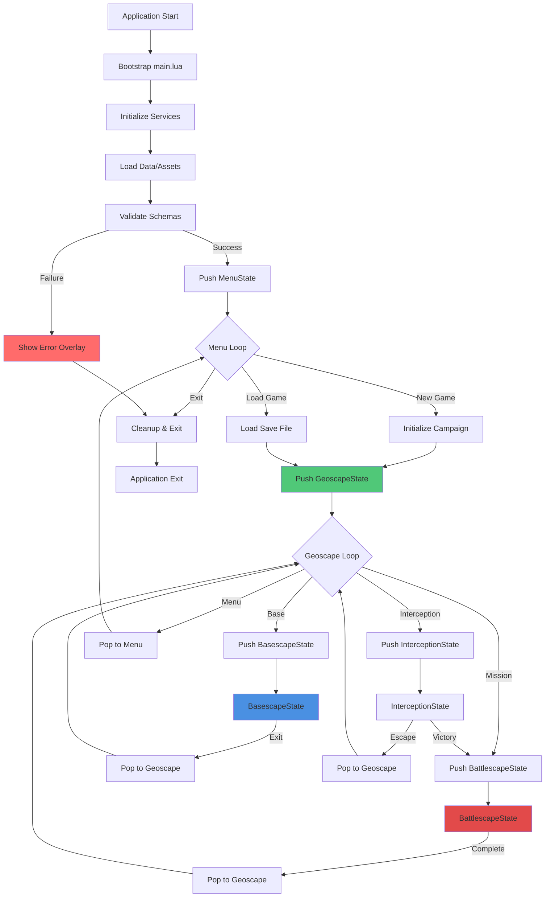

# Technic## Architectural Principles
- **Love2D Core:** `LOVE/main.lua` bootstraps the application, instantiates services, and manages the state stack.
- **Service Locator:** Lightweight registry exposes shared services (e.g., `EventBus`, `TimeService`, `EconomyService`). Each service is a Lua table with lifecycle functions (`init`, `update`, `shutdown`).
- **State Stack:** Screens (menu, geoscape, basescape, interception, battlescape, pedia) push/pop states. Input, update, and draw route to the top-most state.
- **Deterministic RNG:** `RngService:get(scope)` returns generators seeded by campaign + subsystem identifiers. Never use Lua's global `math.random` directly.

---

## Architecture Diagrams

### Service Architecture

### Data Flow Pipeline

### State Management Flow

---erview

This README defines the engineering backbone for AlienFall’s Love2D implementation: architecture conventions, data pipelines, save/load, and tooling. It supersedes Python/PySide6 references and standardises our approach.

## Role in AlienFall
- Provide services, state management, and deterministic scheduling for all gameplay systems.
- Ensure assets, data, and mods load consistently across platforms.
- Offer profiling, telemetry, and testing hooks for continuous validation.

## Architectural Principles
- **Love2D Core:** `LOVE/main.lua` bootstraps the application, instantiates services, and manages the state stack.
- **Service Locator:** Lightweight registry exposes shared services (e.g., `EventBus`, `TimeService`, `EconomyService`). Each service is a Lua table with lifecycle functions (`init`, `update`, `shutdown`).
- **State Stack:** Screens (menu, geoscape, basescape, interception, battlescape, pedia) push/pop states. Input, update, and draw route to the top-most state.
- **Deterministic RNG:** `RngService:get(scope)` returns generators seeded by campaign + subsystem identifiers. Never use Lua’s global `math.random` directly.

## Data Pipeline
- **Source Formats:** Author data in TOML, convert to Lua tables at load time using `toml.lua` (bundled under `LOVE/widgets/lib`).
- **Schema Validation:** Each dataset has a schema definition in `data/schema/*.lua`. Validation runs on startup; failures display diagnostics overlay.
- **Hot Reload (Dev Only):** Optional file watcher reloads data tables when running in dev mode (enabled via `LOVE/run_dev.lua`).

## Asset Management
- **Sprites:** 10×10 pixel source art stored under `assets/sprites/`, scaled ×2 by rendering helpers.
- **Audio:** OGG/WAV under `assets/audio/`, loaded lazily.
- **Tilesets:** Battlescape and GUI tilesets live under `assets/tilesets/`. The loader packs them into sprite batches for performance.

## Input Abstraction Layer
- **Purpose**: Normalizes keyboard, mouse, and controller input into high-level UI actions
- **Implementation**: Input mapping layer translates device inputs to semantic actions (`ui_accept`, `ui_cancel`, `ui_next_tab`)
- **Configuration**: Settings stored in `config/input.toml`; remapping updates at runtime without restart
- **Accessibility**: Supports custom key bindings and input device preferences
- **Testing**: Input sequences can be scripted for automated UI testing

## Modding
- Mods reside in `mods/<id>/` with `mod.toml` manifest, `data/`, `assets/`, and optional `scripts/` for sandboxed Lua logic.
- Load order resolved by priority + dependency graph. Conflicts resolved deterministically: higher priority overwrites specific keys; merges handle lists/maps.
- Sandbox restricts available globals; use whitelisted API (documented in `mods/README.md`) to interact with the game.
- **Widget Registration**: Mods may register new widgets via `mods/<id>/gui/widgets.lua`; must declare theme tokens.
- **Theme Overrides**: Theme modifications loaded in priority order; conflicts resolved by load priority with warnings.
- **Localization**: Mod strings stored in `assets/locale/*.toml`; fallback to EN-US if missing.

## Save & Replay
- **Save Format:** Serialized Lua tables compressed with zlib, stored in Love2D save directory under `saves/<campaignId>.sav`.
- **Autosave:** After each player turn (battlescape) and at key geoscape milestones.
- **Replay Metadata:** Stores RNG scopes, mission seeds, and significant choices for deterministic playback.
- **Versioning:** `save_version` increments with breaking changes. Load pipeline applies migrations defined in `data/migrations/*.lua`.

## Telemetry & Profiling
- **Telemetry:** Optional; collects event log entries (`event`, `timestamp`, `seed`, `payload`). Can export to JSON for analysis.
- **Profiling:** Integrate with `ProFi` (lightweight Lua profiler). Start/stop via debug console or dev hotkeys.
- **Logging:** `LogService` handles structured logs with severity levels.

## Testing Infrastructure
- **Unit Tests:** Located under `LOVE/tests/`, run with `busted`. Cover data validation, RNG determinism, and core services.
- **Smoke Tests:** `_GODOT_PROJECT_ALIEN_FALL/` harness retained for comparison snapshots but not authoritative.
- **CI Hooks:** Scripts in `tools/love-test-runner/` allow headless runs.
- **UI Tests:** Automated UI tests defined in `tests/gui/` using scripted input sequences.
- **Screenshot Testing:** Deterministic screenshot harness captures key screens for regression review.
- **Logging Guidelines:** Include screen name, widget id, and seed in debug logs.

## Performance Guidance
- **Rendering Optimization:** Batch draw calls per widget layer using Love2D sprite batches.
- **Memory Management:** Reuse canvases for static elements (e.g., panel chrome) updated only when theme changes.
- **Layout Performance:** Defer heavy layout recalculation until `love.update` loops to avoid input jitter.
- **Asset Loading:** Load assets lazily and cache aggressively for performance.
- **Profiling:** Use `ProFi` lightweight Lua profiler for performance analysis.

## Event Bus Reference
- `EventBus:publish(eventName, payload)`
- `EventBus:subscribe(eventName, handler, opts?)`
- `EventBus:unsubscribe(token)`
- Events are namespaced (e.g., `geoscape:mission_spawned`). Payloads must be table literals to support serialization.

## Development Workflow
1. Update TOML data ➜ run validation (`make validate` or VS Code task).
2. Implement Lua services/states adhering to Love2D style (locals only, no globals).
3. Run Love2D with dev flags for hot reload and debugging overlays.
4. Execute tests (`love . -- test`) before committing.

## Grid & Visual Standards
- Reinforce 20×20 logical grid for screens; helper module `ui/grid.lua` computes snap positions.
- Scaling handled centrally: 10×10 art scaled ×2 when drawn.

## Related Reading
- [Modding README](../technical/Modding.md)
- [GUI Specification](../GUI.md)
- [Economy README](../economy/README.md)
- [Battlescape README](../battlescape/README.md)
- [Geoscape README](../geoscape/README.md)

## Tags
`#technical` `#love2d` `#architecture` `#modding` `#determinism`
