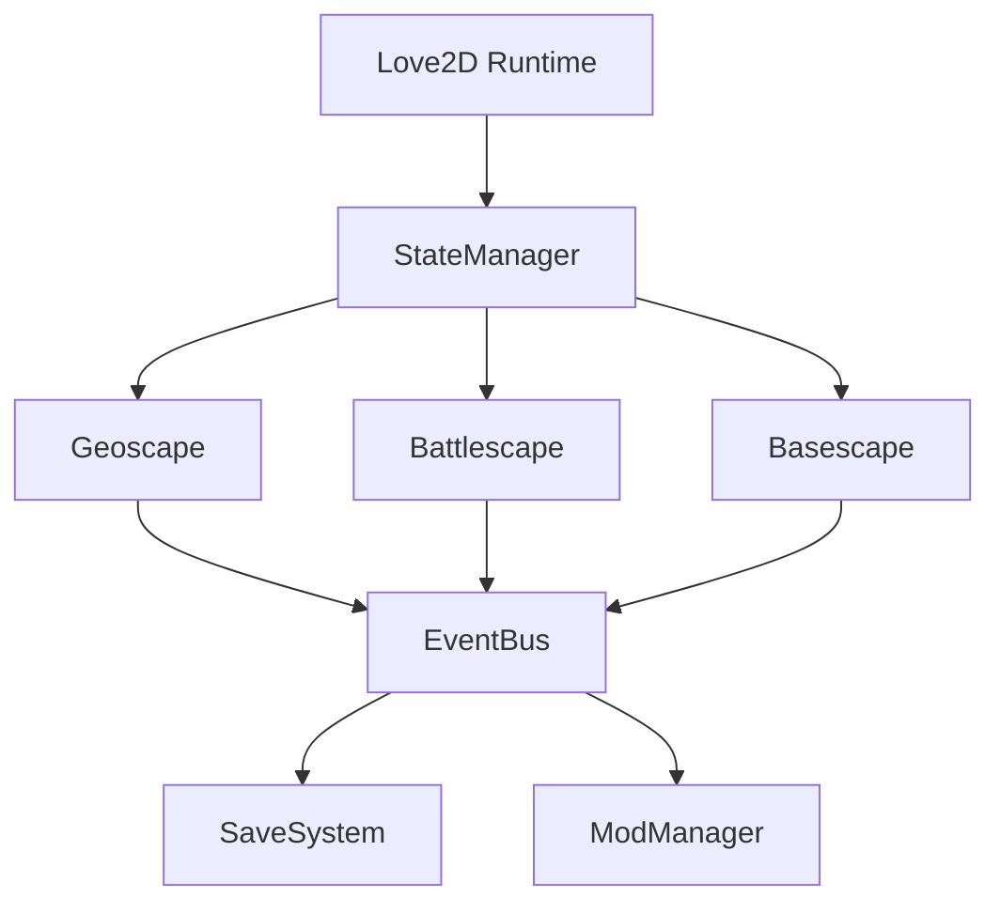

# Alien Defense: Master Design Dossier

| Field | Value |
| --- | --- |
| Codename | Alien Defense (Working Title) |
| Inspiration | X-COM: UFO Defense (1994), X-COM: Terror From The Deep (1995) |
| Engine | Love2D 12.0 + Lua 5.4 |
| Primary Platform | Windows, macOS, Linux (desktop) |
| Visual Style | 1-bit pixel art, 24×24 base grid |
| Content Format | TOML-driven data packs (mods) |
| Document Owner | Design & Engineering Leads |
| Last Updated | 2025-11-05 |
| Document Version | 3.0 (Complete Edition) |

---

## Table of Contents

### Part I: Getting Started

- **[Section 0: Quick Start Guide](#0-quick-start-guide)**
  - [0.0.5 Project Scaffolding](#005-project-scaffolding)
  - [0.1 First Hour: Environment Setup](#01-first-hour-environment-setup)
  - [0.1.5 Complete Minimal Working Game](#015-complete-minimal-working-game)
  - [0.2 First Day: Baseline Features](#02-first-day-baseline-features)
  - [0.3 First Week: Playable Slice](#03-first-week-playable-slice)
  - [0.4 Success Validation](#04-success-validation)
  - [0.5 Technology Stack & Development Environment](#05-technology-stack--development-environment)
  - [0.6 Migration Guides](#06-migration-guides)

### Part II: Vision & Design

- **[Section 1: Vision & Experience Goals](#1-vision--experience-goals)**
  - [1.1 Living Document Stewardship](#11-living-document-stewardship)
  - [1.4 Core Assumptions](#14-core-assumptions)
  - [1.5 Non-Goals](#15-non-goals)
- **[Section 2: Design Pillars](#2-design-pillars)**
- **[Section 3: Player Experience Overview](#3-player-experience-overview)**

### Part III: Game Systems & Architecture

- **[Section 4: Game Layers & Systems](#4-game-layers--systems)**
  - [4.1 Geoscape (Strategic Layer)](#41-geoscape-strategic-layer)
  - [4.2 Battlescape (Tactical Layer)](#42-battlescape-tactical-layer)
  - [4.3 Interception (Aerospace/Naval Layer)](#43-interception-aerospacenaval-layer)
  - [4.4 Basescape (Operational Layer)](#44-basescape-operational-layer)
  - [4.5 Core Game Formulas](#45-core-game-formulas)
- **[Section 5: Cross-Cutting Systems](#5-cross-cutting-systems)**
- **[Section 6: Modding & Content Pipeline](#6-modding--content-pipeline)**
  - [6.1 Directory Structure](#61-directory-structure)
  - [6.2 Content Authoring Guidelines](#62-content-authoring-guidelines)
  - [6.3 TOML Best Practices](#63-toml-best-practices)
  - [6.4 Recommended Mod Structure](#64-recommended-mod-structure)
  - [6.5 Tooling](#65-tooling)
  - [6.6 Offset Namespace Strategy](#66-offset-namespace-strategy)
  - [6.7 Asset Specification & Pipeline](#67-asset-specification--pipeline)

### Part IV: Technical Implementation

- **[Section 7: Engine Folder Structure & Rationale](#7-engine-folder-structure--rationale)**
- **[Section 8: Layer Independence & Standalone Execution](#8-layer-independence--standalone-execution)**
  - [8.9 Implementation Order & Dependency Graph](#89-implementation-order--dependency-graph)
- **[Section 9: Technical Architecture](#9-technical-architecture)**
  - [9.5 Code Patterns & Anti-patterns](#95-code-patterns--anti-patterns)
  - [9.6 Debugging & Profiling](#96-debugging--profiling)
  - [9.7 Security & Sandboxing](#97-security--sandboxing)
  - [9.8 Known Limitations & Workarounds](#98-known-limitations--workarounds)

### Part V: Quality & Operations

- **[Section 10: Testing & Quality Strategy](#10-testing--quality-strategy)**
  - [10.12 Complete Test Examples](#1012-complete-test-examples)
- **[Section 11: Build, Packaging & Deployment](#11-build-packaging--deployment)**
  - [11.8 Development Workflow & Git Strategy](#118-development-workflow--git-strategy)
  - [11.9 Community Contribution Guide](#119-community-contribution-guide)
- **[Section 12: Roadmap & Milestones](#12-roadmap--milestones)**

### Part VI: Reference Materials

- **[Section 13: Appendices](#13-appendices)**
  - [13.1 Core Scales & Constants](#131-core-scales--constants)
  - [13.2 Glossary](#132-glossary)
  - [13.3 Complete Formula Reference](#133-complete-formula-reference)
  - [13.4 Example Scripts](#134-example-scripts)
  - [13.5 Troubleshooting Guide](#135-troubleshooting-guide)
  - [13.6 Frequently Asked Questions (FAQ)](#136-frequently-asked-questions-faq)
  - [13.7 Modding Resources](#137-modding-resources)
  - [13.8 Performance Benchmarks](#138-performance-benchmarks)
  - [13.9 Reference Links](#139-reference-links)
  - [13.10 Accessibility Implementation Guide](#1310-accessibility-implementation-guide)
- **[Section 14: Document Review & Improvement Suggestions](#14-document-review--improvement-suggestions)**

---

## 0. Quick Start Guide

**Purpose:** Get from zero to a working prototype in three stages: First Hour (environment setup), First Day (baseline features), First Week (playable slice).

### 0.0.5 Project Scaffolding

**Before installing prerequisites, create the complete project structure.**

#### Automated Setup Script (Recommended)

**Windows (PowerShell):**

```powershell
# create_project.ps1 - Run this to scaffold complete project
$projectName = "AlienDefense"
$projectPath = "C:\Projects\$projectName"

Write-Host "Creating AlienDefense project structure at $projectPath..."

# Create main directories
$directories = @(
    "$projectPath\engine",
    "$projectPath\engine\core\state",
    "$projectPath\engine\core\data",
    "$projectPath\engine\core\events",
    "$projectPath\engine\core\testing",
    "$projectPath\engine\layers\geoscape",
    "$projectPath\engine\layers\battlescape",
    "$projectPath\engine\layers\basescape",
    "$projectPath\engine\layers\interception",
    "$projectPath\engine\gui\scenes",
    "$projectPath\engine\gui\widgets",
    "$projectPath\engine\mods",
    "$projectPath\engine\libs",
    "$projectPath\engine\utils",
    "$projectPath\engine\ai",
    "$projectPath\engine\assets",
    "$projectPath\mods\core",
    "$projectPath\mods\core\rules\units",
    "$projectPath\mods\core\rules\items",
    "$projectPath\mods\core\rules\crafts",
    "$projectPath\mods\core\rules\facilities",
    "$projectPath\mods\core\rules\missions",
    "$projectPath\mods\core\rules\research",
    "$projectPath\mods\core\assets\units",
    "$projectPath\mods\core\assets\items",
    "$projectPath\mods\core\assets\ui",
    "$projectPath\mods\core\assets\audio",
    "$projectPath\mods\examples",
    "$projectPath\tests2\unit",
    "$projectPath\tests2\integration",
    "$projectPath\tests2\battlescape",
    "$projectPath\tests2\geoscape",
    "$projectPath\tests2\basescape",
    "$projectPath\tests2\performance",
    "$projectPath\tests2\runners",
    "$projectPath\design\mechanics",
    "$projectPath\api",
    "$projectPath\build",
    "$projectPath\logs",
    "$projectPath\docs"
)

foreach ($dir in $directories) {
    New-Item -ItemType Directory -Path $dir -Force | Out-Null
}

Write-Host "✅ Directory structure created"

# Create initial files
Write-Host "Creating initial files..."

# conf.lua
@"
function love.conf(t)
    t.identity = "aliendefense"
    t.version = "12.0"
    t.console = true
    
    t.window.title = "Alien Defense"
    t.window.width = 960
    t.window.height = 720
    t.window.resizable = false
    t.window.vsync = 1
    
    t.modules.joystick = false
    t.modules.physics = false
end
"@ | Out-File -FilePath "$projectPath\engine\conf.lua" -Encoding UTF8

# main.lua
@"
-- AlienDefense - Main Entry Point
print("=== Alien Defense Starting ===")

-- Add engine to path
love.filesystem.setIdentity("aliendefense")

-- Load core systems (order matters!)
local ModManager = require("mods.mod_manager")
local StateManager = require("core.state.state_manager")
local EventBus = require("core.events.event_bus")

function love.load()
    print("Loading AlienDefense...")
    
    -- Initialize mod system
    ModManager:initialize()
    ModManager:load_mods("../mods")
    
    -- Initialize state manager
    StateManager.initialize()
    
    -- Register states
    local MainMenuState = require("gui.scenes.main_menu")
    StateManager.register("main_menu", MainMenuState)
    
    -- Start at main menu
    StateManager.switch("main_menu")
    
    print("✅ AlienDefense loaded successfully")
end

function love.update(dt)
    if StateManager.current then
        StateManager.current:update(dt)
    end
end

function love.draw()
    if StateManager.current then
        StateManager.current:draw()
    end
    
    -- FPS counter
    love.graphics.setColor(0, 1, 0, 1)
    love.graphics.print("FPS: " .. love.timer.getFPS(), 10, 10)
    love.graphics.setColor(1, 1, 1, 1)
end

function love.keypressed(key, scancode, isrepeat)
    if key == "escape" then
        love.event.quit()
    end
    
    if StateManager.current and StateManager.current.keypressed then
        StateManager.current:keypressed(key, scancode, isrepeat)
    end
end

function love.mousepressed(x, y, button, istouch, presses)
    if StateManager.current and StateManager.current.mousepressed then
        StateManager.current:mousepressed(x, y, button, istouch, presses)
    end
end
"@ | Out-File -FilePath "$projectPath\engine\main.lua" -Encoding UTF8

# mod.toml
@"
[mod]
id = "core"
name = "AlienDefense Core"
version = "1.0.0"
author = "AlienDefense Team"
description = "Core game content and rules"
load_order = 1

[dependencies]
# No dependencies for core mod

[compatibility]
min_engine_version = "1.0.0"
"@ | Out-File -FilePath "$projectPath\mods\core\mod.toml" -Encoding UTF8

# README.md
@"
# AlienDefense

Turn-based strategy game inspired by X-COM, built with Love2D.

## Quick Start

1. Install Love2D 12.0+ from https://love2d.org/
2. Run: ``cd engine && love .``
3. See ``design/mechanics/`` for game design docs

## Project Structure

- ``engine/`` - All game code (Lua)
- ``mods/core/`` - Base game content (TOML)
- ``tests2/`` - Test suites
- ``design/`` - Game design documentation
- ``api/`` - TOML schemas and modding guides

## Documentation

- Quick Start: ``alien_defense_master_gdd.md`` Section 0
- Architecture: ``alien_defense_master_gdd.md`` Section 9
- Modding Guide: ``api/MODDING_GUIDE.md``

## Running Tests

``cd engine && lovec tests2/runners``

## License

[TBD]
"@ | Out-File -FilePath "$projectPath\README.md" -Encoding UTF8

# .gitignore
@"
# Love2D
*.love

# Logs
logs/*.log
logs/*.txt

# OS
.DS_Store
Thumbs.db
desktop.ini

# IDE
.vscode/
.idea/
*.sublime-*

# Build artifacts
build/output/
build/temp/

# Saves (don't commit player saves)
saves/
"@ | Out-File -FilePath "$projectPath\.gitignore" -Encoding UTF8

Write-Host "✅ Initial files created"
Write-Host ""
Write-Host "Project created at: $projectPath"
Write-Host ""
Write-Host "Next steps:"
Write-Host "1. cd $projectPath\engine"
Write-Host "2. lovec .     # Run with console output"
Write-Host ""
Write-Host "Note: You'll need to implement the placeholder modules."
Write-Host "See alien_defense_master_gdd.md Section 0 for full guide."
```

**Linux/macOS (Bash):**

```bash
#!/bin/bash
# create_project.sh - Run this to scaffold complete project

PROJECT_NAME="AlienDefense"
PROJECT_PATH="$HOME/Projects/$PROJECT_NAME"

echo "Creating AlienDefense project structure at $PROJECT_PATH..."

# Create directory structure
mkdir -p "$PROJECT_PATH"/{engine/{core/{state,data,events,testing},layers/{geoscape,battlescape,basescape,interception},gui/{scenes,widgets},mods,libs,utils,ai,assets},mods/core/{rules/{units,items,crafts,facilities,missions,research},assets/{units,items,ui,audio}},mods/examples,tests2/{unit,integration,battlescape,geoscape,basescape,performance,runners},design/mechanics,api,build,logs,docs}

echo "✅ Directory structure created"

# ... (same file creation as PowerShell, adjust syntax)
```

#### Manual Setup (If Script Fails)

Create this directory tree manually:

```text
AlienDefense/
├── engine/                      # All game code
│   ├── main.lua                # Entry point
│   ├── conf.lua                # Love2D configuration
│   ├── core/                   # Core systems
│   │   ├── state/
│   │   │   └── state_manager.lua
│   │   ├── data/
│   │   │   └── data_loader.lua
│   │   ├── events/
│   │   │   └── event_bus.lua
│   │   └── testing/
│   │       └── test_framework.lua
│   ├── layers/                 # Game layers
│   │   ├── geoscape/
│   │   ├── battlescape/
│   │   ├── basescape/
│   │   └── interception/
│   ├── gui/                    # UI systems
│   │   ├── scenes/
│   │   │   └── main_menu.lua
│   │   └── widgets/
│   ├── mods/
│   │   └── mod_manager.lua
│   ├── libs/                   # Third-party libraries
│   ├── utils/                  # Utility functions
│   ├── ai/                     # AI systems
│   └── assets/                 # Temporary asset cache
├── mods/                       # Content packs
│   ├── core/                   # Base game
│   │   ├── mod.toml
│   │   ├── rules/
│   │   │   ├── units/
│   │   │   ├── items/
│   │   │   ├── crafts/
│   │   │   ├── facilities/
│   │   │   ├── missions/
│   │   │   └── research/
│   │   └── assets/
│   │       ├── units/
│   │       ├── items/
│   │       ├── ui/
│   │       └── audio/
│   └── examples/               # Example mods
├── tests2/                     # Test suites
│   ├── unit/
│   ├── integration/
│   ├── battlescape/
│   ├── geoscape/
│   ├── basescape/
│   ├── performance/
│   └── runners/
├── design/                     # Design documentation
│   └── mechanics/
├── api/                        # API documentation
├── build/                      # Build scripts
├── logs/                       # Runtime logs
├── docs/                       # Additional docs
├── README.md
└── .gitignore
```

#### Verification

After running script or creating manually:

```powershell
# Verify structure
cd AlienDefense
tree /F /A   # Windows: shows full tree
# or
ls -R        # Linux/macOS

# Should see:
# - engine/main.lua exists
# - engine/conf.lua exists
# - mods/core/mod.toml exists
# - All directories created
```

### 0.1 First Hour: Environment Setup

#### Prerequisites Checklist

```powershell
# Windows (PowerShell) - verify you have these installed
love --version      # Should show: LÖVE 11.5 or later
lua -v              # Should show: Lua 5.1 (LuaJIT) or Lua 5.4
git --version       # Any version 2.x+
code --version      # VS Code 1.80+ (optional but recommended)
```

If any command fails, install:

- **Love2D 12.0+**: <https://love2d.org/> (use installer or add to PATH)
- **Lua 5.4**: <https://www.lua.org/download.html> or <https://luabinaries.sourceforge.net/>
- **Git**: <https://git-scm.com/>
- **VS Code** (optional): <https://code.visualstudio.com/> with "Lua" extension by sumneko

#### Clone & Verify

```powershell
# 1. Clone the repository
git clone https://github.com/YourOrg/AlienDefense.git
cd AlienDefense

# 2. Run the minimal test
cd engine
love .

# You should see: "Alien Defense - Main Menu" screen with placeholder buttons
```

#### Directory Orientation (5 minutes)

| Path | Purpose | Touch Frequency |
|------|---------|-----------------|
| `engine/` | All game logic and Love2D entry point (`main.lua`) | Daily |
| `engine/core/` | State management, data loading, asset pipeline | Weekly |
| `engine/layers/` | Geoscape/Basescape/Battlescape/Interception systems | Daily |
| `engine/gui/` | UI widgets, screens, layouts | Daily |
| `mods/core/` | Base game content (TOML), sprites, audio | Daily |
| `design/` | Game design documentation (mechanics specs) | Weekly |
| `api/` | TOML schemas, modding guides | Weekly |
| `tests2/` | Unit/integration/E2E test suites | Daily |
| `build/` | Build scripts, distribution packaging | Monthly |

**Tip:** Bookmark `design/mechanics/` (29 files) and `api/GAME_API.toml` - these define WHAT to build and HOW content should be structured.

### 0.2 First Day: Baseline Features

**Goal:** Implement one full loop in ONE layer (we recommend starting with Battlescape for tangible tactical gameplay).

#### Step 1: Understand the Data Flow (30 minutes)

Read these in order:

1. `api/GAME_API.toml` - Schema for all TOML content (units, items, missions)
2. `design/mechanics/Battlescape.md` - Tactical combat rules
3. `engine/mods/mod_manager.lua` - How game loads content from TOML

Key insight: **Game logic never hardcodes content.** Everything comes from `ModManager:get_unit()`, `ModManager:get_item()`, etc.

#### Step 2: Run Existing Tests (15 minutes)

```powershell
# Run full test suite
cd engine
lovec tests2/runners

# Run only battlescape tests (faster iteration)
lovec tests2/runners battlescape
```

Expected: ~2,493 tests should pass. If any fail, check `logs/test_results_*.log`.

#### Step 3: Add Your First Unit (45 minutes)

Create `mods/core/rules/units/test_soldier.toml`:

```toml
[unit.test_soldier]
id = "test_soldier"
name = "Test Soldier"
type = "soldier"

# Core stats (see design/mechanics/Units.md for full list)
health = 100
time_units = 60
stamina = 100
reactions = 50
firing_accuracy = 70
throwing_accuracy = 60
strength = 40
psionic_strength = 0
psionic_skill = 0
bravery = 60
melee_accuracy = 50

# Derived stats
armor_front = 10
armor_side = 5
armor_rear = 5
armor_under = 0

# Equipment slots
inventory = ["primary_weapon", "sidearm", "armor", "utility_1", "utility_2"]

# Visual
sprite = "units/test_soldier.png"  # 24×24 PNG
```

Create sprite: `mods/core/assets/units/test_soldier.png` (24×24 pixels, 1-bit color).

**Verify it loads:**

```lua
-- In engine/main.lua (temporarily add after ModManager loads):
local test = ModManager:get_unit("test_soldier")
print("Loaded unit:", test.name, "Health:", test.health)
-- Should print: "Loaded unit: Test Soldier Health: 100"
```

#### Step 4: Run Battlescape with Your Unit (2 hours)

Edit `engine/gui/scenes/battlescape_screen.lua`:

```lua
-- In BattlescapeState:enter() function:
function BattlescapeState:enter(mission_data)
    -- Load your test unit
    local unit_def = ModManager:get_unit("test_soldier")
    local soldier = BattlescapeUnit:new(unit_def)
    soldier.position = {x=5, y=5, z=0}  -- Place on map
    
    table.insert(self.player_units, soldier)
    
    -- Continue with existing battlescape initialization...
end
```

### 0.1.5 Complete Minimal Working Game

**Purpose:** A 100-line runnable example demonstrating core Love2D concepts before building the full game.

Create `engine/minimal_example.lua` (run with `love minimal_example.lua`):

```lua
-- minimal_example.lua - Complete minimal Love2D game demonstrating all core concepts
-- Run: cd engine && love minimal_example.lua

-- Game state
local player = { x = 400, y = 300, speed = 200 }
local enemies = {}
local score = 0
local gameOver = false

-- Load sprites
local playerImg
local enemyImg

function love.load()
    -- Enable key repeat for held keys
    love.keyboard.setKeyRepeat(true)
    
    -- Create placeholder sprites (if no assets yet)
    if not love.filesystem.getInfo("assets/player.png") then
        -- Create 24x24 white square for player
        local imageData = love.image.newImageData(24, 24)
        imageData:mapPixel(function() return 1, 1, 1, 1 end)
        playerImg = love.graphics.newImage(imageData)
    else
        playerImg = love.graphics.newImage("assets/player.png")
    end
    
    -- Create enemies every 2 seconds
    enemySpawnTimer = 0
    
    print("Minimal game loaded! Use arrow keys to move, avoid red squares.")
end

function love.update(dt)
    if gameOver then return end
    
    -- Player movement (8-directional)
    if love.keyboard.isDown("right") then player.x = player.x + player.speed * dt end
    if love.keyboard.isDown("left") then player.x = player.x - player.speed * dt end
    if love.keyboard.isDown("up") then player.y = player.y - player.speed * dt end
    if love.keyboard.isDown("down") then player.y = player.y + player.speed * dt end
    
    -- Keep player in bounds
    player.x = math.max(0, math.min(love.graphics.getWidth() - 24, player.x))
    player.y = math.max(0, math.min(love.graphics.getHeight() - 24, player.y))
    
    -- Spawn enemies
    enemySpawnTimer = enemySpawnTimer + dt
    if enemySpawnTimer > 2 then
        table.insert(enemies, {
            x = math.random(0, love.graphics.getWidth() - 24),
            y = -24,
            speed = math.random(50, 150)
        })
        enemySpawnTimer = 0
    end
    
    -- Move enemies
    for i = #enemies, 1, -1 do
        local enemy = enemies[i]
        enemy.y = enemy.y + enemy.speed * dt
        
        -- Remove off-screen enemies (and score point)
        if enemy.y > love.graphics.getHeight() then
            table.remove(enemies, i)
            score = score + 1
        end
        
        -- Check collision with player (AABB)
        if player.x < enemy.x + 24 and
           player.x + 24 > enemy.x and
           player.y < enemy.y + 24 and
           player.y + 24 > enemy.y then
            gameOver = true
        end
    end
end

function love.draw()
    -- Clear screen
    love.graphics.clear(0, 0, 0)
    
    if gameOver then
        love.graphics.setColor(1, 0, 0)
        love.graphics.printf("GAME OVER - Score: " .. score, 0, 300, love.graphics.getWidth(), "center")
        love.graphics.setColor(1, 1, 1)
        love.graphics.printf("Press R to restart", 0, 340, love.graphics.getWidth(), "center")
        return
    end
    
    -- Draw player (white square)
    love.graphics.setColor(1, 1, 1)
    love.graphics.draw(playerImg, player.x, player.y)
    
    -- Draw enemies (red squares)
    love.graphics.setColor(1, 0, 0)
    for _, enemy in ipairs(enemies) do
        love.graphics.rectangle("fill", enemy.x, enemy.y, 24, 24)
    end
    
    -- Draw UI
    love.graphics.setColor(0, 1, 0)
    love.graphics.print("Score: " .. score, 10, 10)
    love.graphics.print("FPS: " .. love.timer.getFPS(), 10, 30)
    love.graphics.setColor(1, 1, 1)
end

function love.keypressed(key)
    if key == "escape" then
        love.event.quit()
    end
    
    if key == "r" and gameOver then
        -- Reset game
        player = { x = 400, y = 300, speed = 200 }
        enemies = {}
        score = 0
        gameOver = false
        enemySpawnTimer = 0
    end
end
```

**What This Demonstrates:**

| Concept | Line(s) | Explanation |
|---------|---------|-------------|
| **Love2D Callbacks** | 18, 31, 83, 112 | `love.load()`, `love.update(dt)`, `love.draw()`, `love.keypressed(key)` |
| **State Management** | 5-8 | Global game state tables |
| **Asset Loading** | 20-28 | Conditional loading with fallback |
| **Input Handling** | 34-37, 112-122 | Keyboard polling (`isDown`) and events (`keypressed`) |
| **Delta Time (dt)** | 34 | Frame-rate independent movement |
| **Table Manipulation** | 45-49, 55-56 | `table.insert()`, `table.remove()`, ipairs iteration |
| **Collision Detection** | 66-70 | AABB (axis-aligned bounding box) |
| **Rendering** | 83-107 | `love.graphics` API (clear, draw, print, printf) |
| **Random Generation** | 45-49 | `math.random()` for procedural content |
| **Game Loop** | 31-81 | Update → Draw cycle |

**Run & Test:**

```powershell
cd engine
love minimal_example.lua
# Play for 30 seconds, verify:
# - Player moves with arrow keys
# - Enemies spawn and fall
# - Collision detection works
# - Game over screen appears
# - R key restarts
```

**When to Use This:**

- **First-time Love2D users:** Run this BEFORE building AlienDefense to understand the framework
- **Onboarding new developers:** Have them modify this (change colors, add sounds, adjust spawn rate)
- **Testing environment:** Verify Love2D installed correctly before tackling larger systems

Run the game:

```powershell
cd engine
lovec .
# Click "New Game" → "Start Mission" (if implemented)
# You should see your unit on the tactical map
```

#### Step 5: Add Basic Movement (2 hours)

Implement in `engine/layers/battlescape/battlescape_unit.lua`:

```lua
function BattlescapeUnit:move_to(hex_x, hex_y)
    local cost = self:calculate_path_cost(self.position, {x=hex_x, y=hex_y})
    
    if cost <= self.time_units then
        self.position = {x=hex_x, y=hex_y, z=self.position.z}
        self.time_units = self.time_units - cost
        return true
    end
    
    return false, "Not enough Time Units"
end
```

Add click handler in `battlescape_screen.lua`:

```lua
function BattlescapeState:mousepressed(x, y, button)
    if button == 1 and self.selected_unit then
        local hex = self:pixel_to_hex(x, y)
        local success, err = self.selected_unit:move_to(hex.x, hex.y)
        if not success then
            print("Movement failed:", err)
        end
    end
end
```

**Milestone:** You can now select units and move them on the hex grid.

### 0.3 First Week: Playable Slice

**Goal:** Implement combat basics (attack action, damage calculation, enemy AI turn).

#### Day 2: Weapons & Damage System

1. Read `design/mechanics/DamageTypes.md` (defines 8 damage types)
2. Add weapon definition in `mods/core/rules/items/weapons.toml`:

```toml
[weapon.assault_rifle]
id = "assault_rifle"
name = "Assault Rifle"
type = "firearm"
damage_type = "kinetic"
base_damage = 30
accuracy_modifier = 10
range = 20
ammo_capacity = 30
time_unit_cost = 25
sound = "audio/weapons/rifle_shot.ogg"
sprite = "items/assault_rifle.png"
```

1. Implement damage formula in `engine/layers/battlescape/combat_system.lua`:

```lua
function CombatSystem.calculate_damage(weapon, attacker, target, hit_location)
    local base = weapon.base_damage
    
    -- Apply armor reduction (see design/mechanics/DamageTypes.md)
    local armor_value = target.armor[hit_location] or 0
    local damage_type = weapon.damage_type
    local mitigation_percent = ArmorTable[damage_type][target.armor_type] or 0.5
    
    local mitigated = base * (1 - mitigation_percent)
    local final_damage = math.max(0, mitigated - armor_value)
    
    return math.floor(final_damage)
end
```

#### Day 3: Line of Sight & Line of Fire

1. Read `design/mechanics/Battlescape.md` section on LOS/LOF

2. Implement in `engine/layers/battlescape/los_system.lua`:

```lua
function LOSSystem.has_line_of_sight(from_pos, to_pos, map)
    local ray = self:bresenham_line(from_pos, to_pos)
    
    for _, hex in ipairs(ray) do
        local tile = map:get_tile(hex.x, hex.y, hex.z)
        if tile and tile.blocks_vision then
            return false
        end
    end
    
    return true
end
```

1. Connect to attack action:

```lua
function BattlescapeUnit:attack(target)
    if not LOSSystem.has_line_of_sight(self.position, target.position, game.map) then
        return false, "No line of sight"
    end
    
    local hit_chance = self:calculate_hit_chance(target)
    local roll = love.math.random()
    
    if roll <= hit_chance then
        local damage = CombatSystem.calculate_damage(self.weapon, self, target, "front")
        target:take_damage(damage)
        return true, damage
    end
    
    return true, 0  -- Shot fired but missed
end
```

#### Day 4-5: Basic Enemy AI

1. Read `api/AI_SYSTEMS.md` for AI architecture

2. Implement simple AI in `engine/ai/battlescape_ai.lua`:

```lua
function BattlescapeAI:take_turn(unit)
    -- 1. Find nearest enemy
    local target = self:find_nearest_enemy(unit)
    if not target then return end
    
    -- 2. If in range and have LOS, shoot
    local distance = hex_distance(unit.position, target.position)
    if distance <= unit.weapon.range and LOSSystem.has_line_of_sight(unit.position, target.position) then
        unit:attack(target)
        return
    end
    
    -- 3. Otherwise, move closer
    local path = self:find_path_to_target(unit, target)
    if path and #path > 0 then
        local max_steps = math.floor(unit.time_units / 4)  -- 4 TU per hex
        local move_to = path[math.min(max_steps, #path)]
        unit:move_to(move_to.x, move_to.y)
    end
end
```

1. Integrate into turn system:

```lua
function BattlescapeState:end_player_turn()
    self.current_turn = "enemy"
    
    for _, enemy in ipairs(self.enemy_units) do
        BattlescapeAI:take_turn(enemy)
    end
    
    self.current_turn = "player"
    self:refresh_player_units()  -- Reset TUs
end
```

#### Day 6-7: Win/Loss Conditions & Polish

1. Implement in `battlescape_screen.lua`:

```lua
function BattlescapeState:check_win_conditions()
    local player_alive = false
    local enemy_alive = false
    
    for _, unit in ipairs(self.player_units) do
        if unit.health > 0 then player_alive = true end
    end
    
    for _, unit in ipairs(self.enemy_units) do
        if unit.health > 0 then enemy_alive = true end
    end
    
    if not player_alive then
        self:trigger_defeat()
    elseif not enemy_alive then
        self:trigger_victory()
    end
end
```

1. Add UI feedback (health bars, hit indicators, turn display)

2. Add sound effects (weapon fire, hit impacts, unit death)

3. Write tests for combat system:

```lua
-- In tests2/battlescape/test_combat.lua
TestFramework:suite("Combat System", function(suite)
    suite:test("Damage calculation respects armor", function()
        local weapon = {base_damage=100, damage_type="kinetic"}
        local target = {armor={front=20}, armor_type="light"}
        
        local damage = CombatSystem.calculate_damage(weapon, nil, target, "front")
        
        assert_true(damage < 100, "Armor should reduce damage")
        assert_true(damage > 0, "Should deal some damage")
    end)
end)
```

### 0.4 Success Validation

By end of Week 1, you should have:

✅ A playable tactical combat scenario (1 map, 2-3 units per side)  
✅ Unit movement with TU cost and pathfinding  
✅ Attack action with LOS/LOF checking  
✅ Damage calculation with armor mitigation  
✅ Basic enemy AI that moves and shoots  
✅ Win/loss detection  
✅ At least 10 new unit tests covering combat mechanics

**Next Steps:** Review `architecture/ROADMAP.md` for Phase 2 (add equipment, research tree, geoscape integration).

---

## 0.5 Technology Stack & Development Environment

### Core Technologies

| Technology | Version | Purpose | Why Chosen Over Alternatives |
|-----------|---------|---------|------------------------------|
| **Love2D** | 12.0+ | Game engine, rendering, input, audio | Lightweight (7MB), Lua-based (modder-friendly), cross-platform, deterministic physics vs. Unity/Godot (heavier, proprietary asset pipelines) |
| **Lua** | 5.4 (or LuaJIT 2.1) | Scripting language for all game logic | Simple syntax for modders, fast JIT compilation, embedded in Love2D vs. Python (slower), C++ (harder to mod) |
| **TOML** | 1.0.0 | Content format (units, items, missions) | Human-readable, strict typing, comments vs. JSON (no comments), XML (verbose), YAML (ambiguous whitespace) |
| **Git** | 2.x+ | Version control | Industry standard, branching support, GitHub integration |
| **VS Code** | 1.80+ | IDE (optional) | Lua language server, debugging support, Love2D extension available |

### Required Tools Installation

#### Windows (PowerShell)

```powershell
# 1. Install Scoop (package manager)
Set-ExecutionPolicy RemoteSigned -Scope CurrentUser
irm get.scoop.sh | iex

# 2. Install Love2D
scoop bucket add extras
scoop install love

# 3. Install Lua (for standalone testing)
scoop install lua

# 4. Install Git
scoop install git

# 5. Verify installations
love --version    # Should show: LÖVE 11.5 or 12.0
lua -v            # Should show: Lua 5.4.x
git --version     # Should show: git version 2.x

# 6. Optional: Install VS Code
scoop install vscode

# 7. Optional: Install VS Code Lua extension
code --install-extension sumneko.lua
```

#### Linux (Ubuntu/Debian)

```bash
# 1. Add Love2D PPA
sudo add-apt-repository ppa:bartbes/love-stable
sudo apt-get update

# 2. Install packages
sudo apt-get install love lua5.4 git

# 3. Verify
love --version
lua -v
git --version

# 4. Optional: Install VS Code
wget -O vscode.deb https://code.visualstudio.com/sha/download?build=stable&os=linux-deb-x64
sudo dpkg -i vscode.deb
code --install-extension sumneko.lua
```

#### macOS (Homebrew)

```bash
# 1. Install Homebrew if needed
/bin/bash -c "$(curl -fsSL https://raw.githubusercontent.com/Homebrew/install/HEAD/install.sh)"

# 2. Install packages
brew install love lua git

# 3. Verify
love --version
lua -v
git --version

# 4. Optional: Install VS Code
brew install --cask visual-studio-code
code --install-extension sumneko.lua
```

### Development Environment Setup

#### VS Code Configuration (Recommended)

Create `.vscode/settings.json` in project root:

```json
{
  "Lua.runtime.version": "LuaJIT",
  "Lua.workspace.library": [
    "${3rd}/love2d/library"
  ],
  "Lua.diagnostics.globals": [
    "love"
  ],
  "files.associations": {
    "*.toml": "toml"
  },
  "editor.rulers": [120],
  "editor.tabSize": 4,
  "editor.insertSpaces": true
}
```

Create `.vscode/tasks.json`:

```json
{
  "version": "2.0.0",
  "tasks": [
    {
      "label": "Run Game (Debug)",
      "type": "shell",
      "command": "cd engine && lovec .",
      "group": {
        "kind": "build",
        "isDefault": true
      },
      "presentation": {
        "reveal": "always",
        "panel": "dedicated"
      }
    },
    {
      "label": "Run All Tests",
      "type": "shell",
      "command": "cd engine && lovec tests2/runners",
      "group": "test"
    },
    {
      "label": "Run Battlescape Tests",
      "type": "shell",
      "command": "cd engine && lovec tests2/runners battlescape",
      "group": "test"
    }
  ]
}
```

#### Project File Structure Validation

After cloning, verify these directories exist:

```text
AlienDefense/
├── engine/               # ✅ Must exist: game engine code
│   ├── main.lua         # ✅ Entry point
│   ├── conf.lua         # ✅ Love2D configuration
│   ├── core/            # ✅ Core systems
│   ├── layers/          # ✅ Geoscape/Battlescape/etc.
│   ├── gui/             # ✅ UI widgets
│   └── mods/            # ✅ Mod loader
├── mods/core/           # ✅ Base game content
│   ├── mod.toml         # ✅ Core mod metadata
│   ├── rules/           # ✅ Units, items, missions (TOML)
│   └── assets/          # ✅ Sprites, audio
├── tests2/              # ✅ Test suites
├── design/              # ✅ Game design docs
├── api/                 # ✅ TOML schemas, guides
└── build/               # ✅ Build scripts
```

If any directory is missing, check that you cloned the correct branch (usually `main` or `develop`).

### First-Time Build Test

```powershell
# Navigate to engine directory
cd AlienDefense/engine

# Run the game (should show main menu)
lovec .

# Run basic smoke test
lovec tests2/runners unit

# Expected output:
# ✅ All core systems loaded
# ✅ ModManager initialized
# ✅ Main menu renders
# ✅ ~500-1000 unit tests pass in < 5 seconds
```

If you see errors, check `logs/` directory for detailed error logs.

### IDE Alternatives

| IDE | Pros | Cons | Setup Time |
|-----|------|------|-----------|
| **VS Code** | Free, Lua language server, Love2D debugging | Needs extensions | 5 min |
| **ZeroBrane Studio** | Built for Lua, Love2D integration | Older UI, limited Git support | 2 min |
| **Sublime Text** | Fast, lightweight | No Lua debugging, paid license | 3 min |
| **IntelliJ IDEA + EmmyLua** | Strong refactoring, debugger | Heavy (2GB+), paid license | 10 min |
| **Vim/Neovim + LSP** | Highly customizable | Steep learning curve | 30 min |

**Recommendation:** Start with VS Code for best balance of features and ease of use.

### Troubleshooting Common Setup Issues

| Issue | Solution |
|-------|----------|
| `love: command not found` | Add Love2D to PATH or use full path to `love.exe` |
| `module 'core.state' not found` | Ensure you're running `love .` from `engine/` directory, not project root |
| `TOML parse error on mod.toml` | Check TOML syntax with online validator: <https://www.toml-lint.com/> |
| Tests fail with "module not found" | Run tests with `lovec tests2/runners`, not `love tests2/runners` (needs console output) |
| Black screen on game start | Check `logs/error.log` - usually missing assets or syntax error in `main.lua` |
| Performance issues | Ensure using Love2D 12.0+ (has performance improvements), check GPU drivers updated |

### 0.6 Migration Guides for Developers from Other Engines

**Purpose:** Help developers transition from Unity, Godot, GameMaker, or Unreal to Love2D/Lua architecture.

#### Coming from Unity (C#)

| Unity Concept | Love2D Equivalent | Key Differences |
|---------------|-------------------|-----------------|
| **GameObject hierarchy** | Lua tables with parent/child fields | No built-in scene graph; manually track relationships |
| **MonoBehaviour.Update()** | `love.update(dt)` | Single global callback, not per-object; manage update list manually |
| **Prefabs/ScriptableObjects** | TOML data files + constructor functions | Data-driven; no visual editor |
| **Coroutines** | Lua coroutines (`coroutine.create()`) | Similar concept, different syntax |
| **Physics (Rigidbody)** | Box2D (via `love.physics`) | Included but not used in AlienDefense (turn-based) |
| **Scene management** | StateManager + state files | Manual state machine; no Unity scene serialization |
| **Asset bundles** | Mod system + TOML | Assets loaded at startup; no dynamic asset streaming |
| **Animation system** | Manual sprite swapping or tween library | No animator controller; build frame-by-frame or use libs |

**Common Pitfalls:**
- ❌ **Expecting ECS architecture** - Love2D has no built-in ECS; use tables or add a library
- ❌ **Forgetting delta time** - Must multiply movement by `dt` in `love.update()`
- ❌ **Hardcoding values** - AlienDefense is data-driven; use TOML, not Lua constants
- ❌ **Using Update() per object** - Create single update list, iterate in `love.update()`

**Migration Checklist:**
1. ✅ Convert Unity scene hierarchy to Lua tables (no visual scene editor)
2. ✅ Replace MonoBehaviour lifecycle with Love2D callbacks (load/update/draw)
3. ✅ Move SerializedFields to TOML data files (see `mods/core/rules/`)
4. ✅ Replace Unity Input with `love.keyboard`/`love.mouse` polling
5. ✅ Remove dependency on Unity physics (AlienDefense is turn-based grid)

#### Coming from Godot (GDScript)

| Godot Concept | Love2D Equivalent | Key Differences |
|---------------|-------------------|-----------------|
| **Node tree** | Lua tables | No scene tree; manually manage parent/child |
| **_ready()/_process()** | `love.load()`/`love.update(dt)` | Global callbacks, not per-node |
| **Signals** | EventBus (`core/events/event_bus.lua`) | Manual event system; register/emit manually |
| **Scenes** | State files + StateManager | No scene instancing; switch states manually |
| **Resources** | TOML files | No .tres format; all data in TOML |
| **TileMap** | Manual grid rendering | No built-in tilemap; implement hex/grid yourself |
| **AnimationPlayer** | Manual sprite updates | No timeline editor; code frame sequences |

**Common Pitfalls:**
- ❌ **Expecting signal autoconnect** - Must manually wire EventBus subscriptions
- ❌ **Using Godot's type hints** - Lua is dynamically typed; use LuaLS annotations for IDE help
- ❌ **Relying on node lifecycle** - No `_ready()` per object; initialize in constructors
- ❌ **Using Godot's 2D camera** - Implement camera manually with transforms

**Migration Checklist:**
1. ✅ Convert node tree to Lua table hierarchy
2. ✅ Replace signals with EventBus pattern (see Section 9.5)
3. ✅ Move exported variables to TOML data
4. ✅ Replace TileMap with custom hex/grid renderer (see Section 4.4)
5. ✅ Rebuild AnimationPlayer as sprite frame sequencer

#### Coming from GameMaker (GML)

| GameMaker Concept | Love2D Equivalent | Key Differences |
|-------------------|-------------------|-----------------|
| **Objects/Instances** | Lua tables | No built-in object system; use metatables |
| **Rooms** | States (StateManager) | No room editor; code layout or load from data |
| **Sprites** | `love.graphics.newImage()` | No sprite editor; use external tools (Aseprite/GIMP) |
| **Step/Draw events** | `love.update()`/`love.draw()` | Global callbacks; iterate objects manually |
| **Collision functions** | Manual AABB/circle checks | No built-in `place_meeting()`; implement yourself |
| **Global variables** | Module-level vars or StateManager.global_data | Similar, but prefer modules for scoping |
| **Timelines** | Timer library or manual counters | No timeline system; use dt-based counters |

**Common Pitfalls:**
- ❌ **Expecting drag-and-drop room editor** - Love2D has no visual editor; code layouts
- ❌ **Using GML's collision functions** - Must implement collision manually
- ❌ **Relying on object inheritance** - Lua uses prototypal inheritance (metatables)
- ❌ **Forgetting coordinate system** - Love2D uses top-left origin (0,0), like GameMaker

**Migration Checklist:**
1. ✅ Convert objects to Lua tables with metatables (see Section 9.5 for pattern)
2. ✅ Replace rooms with StateManager states
3. ✅ Reimplement collision system (AABB examples in Section 4.5)
4. ✅ Move sprite data to TOML with file paths
5. ✅ Replace timelines with dt-based counters

#### Coming from Unreal Engine (C++)

| Unreal Concept | Love2D Equivalent | Key Differences |
|----------------|-------------------|-----------------|
| **Actor/Component** | Lua tables | No built-in component system; use tables or add ECS |
| **Blueprint visual scripting** | Lua code | No visual scripting; all code in text files |
| **UMG (UI system)** | Widgets (see `engine/widgets/`) | Manual UI; no visual designer |
| **Level streaming** | State loading | No level streaming; load full state at once |
| **Materials/Shaders** | GLSL shaders (via `love.graphics.newShader()`) | Less abstraction; write raw GLSL |
| **Animation Blueprint** | Manual frame updates | No animation graph; code sequences |
| **Networking** | Not used in AlienDefense | Love2D has `love.socket`, but game is single-player |

**Common Pitfalls:**
- ❌ **Expecting Blueprint's visual graph** - All logic in Lua code
- ❌ **Using Unreal's reflection system** - Lua has no reflection; use convention over inspection
- ❌ **Relying on Unreal's physics** - No built-in physics for turn-based game
- ❌ **Expecting Unreal's asset pipeline** - Love2D loads raw PNGs/OGGs; no import process

**Migration Checklist:**
1. ✅ Convert Actors/Components to Lua table composition (see Section 9.5)
2. ✅ Replace Blueprint logic with Lua functions
3. ✅ Rebuild UMG interfaces using Widget system (Section 6.3)
4. ✅ Convert animation blueprints to frame sequencers
5. ✅ Remove networking code (AlienDefense is single-player)

#### General Love2D Principles for All Migrants

**Core Mindset Shifts:**

1. **No Visual Editors** - Love2D is code-first; build tools yourself or use external editors
2. **Data-Driven Design** - AlienDefense uses TOML for all content; separate data from code
3. **Manual State Management** - No built-in scene graph; use StateManager pattern
4. **Explicit Initialization** - No automatic lifecycle; call constructors explicitly
5. **Single Global Callbacks** - One `love.update()` per frame; iterate objects manually

**Recommended First Steps:**

1. **Run `minimal_example.lua`** (Section 0.1.5) to understand Love2D basics
2. **Study StateManager** (Section 9.5) to understand state transitions
3. **Read TOML data examples** (Section 13.4) to see data-driven design
4. **Implement one small system** (e.g., grid renderer) before tackling full layers
5. **Join Love2D Discord** (<https://discord.gg/rhUets9>) for community support

---

## 1. Vision & Experience Goals

Create a fully moddable, single-player homage to classic X-COM that can ship as four interoperable sub-games—Geoscape, Battlescape, Interception, and Basescape—while remaining modular enough for independent play and later integration. Deliver deep systemic gameplay, deterministic rules, and a lore-rich campaign that players and modders can expand without touching engine code.

### Success Criteria

- **Mod-first:** All gameplay content, balance values, and narrative hooks exposed via TOML. No hardcoded factions, missions, or items.
- **Composable layers:** Each layer (Geoscape, Battlescape, Interception, Basescape) can boot standalone for focused development and testing, yet shares common data and state services for campaign cohesion.
- **Deterministic & testable:** Systems favor deterministic resolution with seedable RNG, enabling automated regression tests and reproducible simulations.
- **Lore depth:** A data-driven faction and quest engine sustains long-form storytelling akin to UFOpaedia/strategycore references.
- **High readability:** 1-bit art, strong silhouettes, and grid-locked UI reinforce clarity over spectacle.

### 1.1 Living Document Stewardship

- **Review cadence:** Weekly cross-discipline sync reviews core sections (vision, pillars, roadmap). Monthly publishing cycle appends changelog entries and reconciles design decisions with architecture/prioritization logs.
- **Audience tagging:** Each major section lists primary consumers (design, engineering, narrative, QA, modders) so updates immediately signal affected teams.
- **Link discipline:** Every material change references supporting artifacts (prototype builds, telemetry dashboards, decision records) to keep the GDD actionable and traceable.
- **Change intake:** Proposed revisions land in an open backlog with acceptance criteria; approved edits merge into this master dossier after playtest or prototype validation.
- **Snapshot policy:** Stable releases branch the document to `/docs/releases/<version>/gdd.md`, preserving historical context while keeping `main` as the living reference.

---

## 1.4 Core Assumptions

**Purpose:** Explicit assumptions defining project scope and target audience.

### Developer Experience Assumptions

| Assumption | Rationale | Impact if Wrong |
|------------|-----------|-----------------|
| **Developers familiar with turn-based games** | Documentation emphasizes X-COM mechanics, not basic turn-based concepts | Need to add glossary explaining Action Points, Fog of War, etc. |
| **At least intermediate Lua experience** | No tutorials on Lua basics (tables, metatables, coroutines) | Add Section 0 "Lua Primer" with language fundamentals |
| **Comfortable with data-driven design** | TOML-first approach assumed knowledge of separation of concerns | Add examples showing hardcoding vs. data-driven alternatives |
| **Git workflow proficiency** | Assumes familiarity with branches, PRs, merge conflicts | Add Section 11.8 deep dive on Git workflows (already done) |
| **Command-line comfort** | Build scripts use terminal commands (PowerShell/Bash) | Add GUI alternative scripts or VS Code tasks (already done) |

### Platform & Target Assumptions

| Assumption | Rationale | Impact if Wrong |
|------------|-----------|-----------------|
| **Desktop-only (Windows/Linux/macOS)** | Love2D best on desktop; mobile performance varies | Need significant UI scaling, touch controls, performance profiling |
| **Single-player only** | No networking code, deterministic state | Adding multiplayer requires rearchitecture (networking layer, anti-cheat) |
| **No console support** | Love2D console ports experimental (Switch/Xbox unofficial) | Need controller focus, platform-specific builds, certification |
| **Minimum 4GB RAM** | Assumes modern machines can hold full mod data in memory | Need dynamic loading, streaming, memory profiling |
| **Keyboard + mouse input** | UI designed for precise cursor, no gamepad support | Need rebindable controls, gamepad UI navigation (see Section 13.10) |

### Content & Modding Assumptions

| Assumption | Rationale | Impact if Wrong |
|------------|-----------|-----------------|
| **Modding is opt-in feature** | Core game playable without mods; mods extend, not required | If players expect plug-and-play mods, need mod manager UI, auto-updates |
| **1-bit art style acceptable** | Lower fidelity reduces asset workload, focuses on mechanics | If players reject aesthetic, need full asset overhaul (color depth, lighting) |
| **TOML configuration sufficient** | Assumes modders comfortable with text files vs. visual editors | If modders want GUI tools, need separate modding toolchain application |
| **English-only content (initially)** | Localization system exists but content not translated | Need full localization (see Section 8.7 for i18n system) |
| **No voice acting** | Text-only narrative reduces scope | Need voice pipeline (recording, mixing, lipsyncing if animated) |

### Technical Assumptions

| Assumption | Rationale | Impact if Wrong |
|------------|-----------|-----------------|
| **Love2D 12.0+ available** | Requires modern Lua 5.4, performance improvements | If targeting older Love2D, need backports, Lua 5.1 compatibility |
| **No GPU acceleration needed** | 2D rendering sufficient with CPU rasterization | If performance poor, need shaders, batch rendering, texture atlases |
| **60 FPS target (not 144+ Hz)** | Turn-based gameplay doesn't benefit from high refresh | If players demand high FPS, need delta time tuning, interpolation |
| **Local file system access** | Saves/mods stored in `love.filesystem` sandboxed directory | If targeting web (Love.js), need LocalStorage/IndexedDB migration |

### Scope & Complexity Assumptions

| Assumption | Rationale | Impact if Wrong |
|------------|-----------|-----------------|
| **10-week implementation timeline** | Based on Section 8.9 dependency levels | If timeline longer, need phased releases, early access milestones |
| **Solo developer or small team (≤3)** | Documentation assumes limited QA/testing resources | Larger team needs task management, CI/CD pipelines, code review process |
| **Vertical slice by Week 3** | Assumes rapid prototyping prioritizing core mechanics | If vertical slice delayed, need revised milestone schedule |
| **No procedural generation (initially)** | Battlescape maps use prefab blocks, not full procedural | If adding procedural, need noise functions, validation, balancing tools |

---

## 1.5 Non-Goals (Explicit Out-of-Scope)

**Purpose:** Clarify what AlienDefense is **NOT** to avoid scope creep and misaligned expectations.

### Not Building

| Non-Goal | Why Out of Scope | What to Build Instead |
|----------|------------------|----------------------|
| **3D graphics** | Love2D is 2D-focused; 3D would require engine switch to Godot/Unity | Embrace 1-bit pixel art; clarity over spectacle |
| **AAA production values** | No budget/team for cinematic cutscenes, orchestral scores, voice acting | Focus on systemic depth, emergent narrative, strong UX |
| **Live service / Games-as-a-Service** | No multiplayer, no microtransactions, no seasons/battle passes | One-time purchase, complete campaign, community mods |
| **Mobile / touch-first design** | UI is 24×24 grid, cursor-focused, complex menus unsuitable for mobile | Desktop PC experience; consider mobile port as separate project |
| **Real-time action gameplay** | Turn-based core design; real-time elements only in Interception layer | Keep Battlescape strictly turn-based; Interception uses pausable card system |
| **Open-world sandbox** | Campaign is linear with branching quests, not freeform exploration | Structured missions with meaningful choices, not procedural infinite content |
| **VR/AR support** | Love2D has no VR API; would require full engine rewrite | Flat screen 2D experience optimized for desktop monitors |
| **Console exclusives** | No Xbox/PlayStation/Switch official support (Love2D community ports only) | PC-first (Windows/Linux/macOS), Steam distribution |

### Intentionally Simplified

| Simplified Area | Why Simplified | Complexity Tradeoff |
|-----------------|----------------|---------------------|
| **Graphics fidelity** | 1-bit sprites, no lighting/shadows, static backgrounds | Faster asset creation, clear readability, nostalgic aesthetic |
| **Audio system** | OGG music/SFX, no dynamic mixing, no 3D spatial audio | Simpler pipeline, lower storage, focus on gameplay |
| **AI sophistication** | Utility AI with weighted actions, not neural networks | Predictable, moddable, deterministic behavior |
| **Physics simulation** | Discrete grid movement, no continuous physics (Box2D unused) | Simpler collision, predictable outcomes, easier testing |
| **Networking** | Single-player only, no multiplayer, no cloud saves | No anti-cheat, no server costs, no synchronization bugs |
| **Input methods** | Keyboard + mouse only, no gamepad/touch/motion controls | Faster UI iteration, clearer tutorials, precise control |

### Not Targeting

| Audience | Why Not Targeting | Who We ARE Targeting |
|----------|-------------------|---------------------|
| **Casual mobile gamers** | UI too complex, no touch controls, long sessions | PC strategy enthusiasts, X-COM veterans |
| **Competitive esports players** | No PvP, no ranked ladders, no spectator mode | Single-player campaign fans, modders |
| **Action/reflex gamers** | Turn-based gameplay, no twitch mechanics | Tactical thinkers, puzzle/chess fans |
| **Children (under 13)** | Complex systems, military themes, mature lore | Adults 18+, strategy game veterans |
| **Speedrunners** | Turn-based with long campaigns, no time-attack mode | Campaign completionists, narrative enjoyers |

### Design Philosophies We're Avoiding

| Anti-Pattern | Why Avoiding | Our Philosophy |
|--------------|--------------|----------------|
| **"Invisible" mechanics** | Hidden formulas frustrate modders, testers | Systemic transparency (see Section 2 Pillar #3) |
| **Grind for grind's sake** | No artificial time gates, resource padding | Meaningful choices under pressure (see Section 2 Pillar #4) |
| **Pay-to-win / loot boxes** | Single-player; no monetization beyond base purchase | Complete game experience, no DLC required |
| **Cutting content for DLC** | Ship complete game; mods are free community extensions | Full campaign, all systems in base game |
| **"Tutorial hell"** | No 2-hour linear tutorial; respect player agency | Minimal working example (Section 0.1.5), quick start (Section 0) |
| **Incomprehensible code** | No "clever" obfuscation; code is for humans | Clear code patterns (Section 9.5), extensive comments |

### Future Work (Not Now, But Later)

| Deferred Feature | Why Deferred | Revisit When |
|------------------|--------------|--------------|
| **Multiplayer** | Requires networking layer, anti-cheat, massive scope increase | After 1.0 release, if community demands |
| **Procedural map generation** | Complex balancing, validation, testing overhead | After hand-crafted maps proven balanced |
| **3D Battlescape view** | Requires engine switch, full asset rework | If porting to Godot/Unity in future |
| **Mod marketplace** | Needs infrastructure, curation, legal frameworks | If modding community reaches critical mass |
| **Official localization** | i18n system exists but content translation massive effort | After English release stable, community translators available |
| **Mobile port** | Needs complete UI redesign, touch controls, performance profiling | If PC version successful, consider separate mobile SKU |

---

## 2. Design Pillars

1. **Data-Defined Everything:** Gameplay rules, tech trees, unit loadouts, map archetypes, quest arcs, and AI parameters live in TOML, validated at load time.
2. **Layered MVC Architecture:** Each layer uses consistent Model-View-Controller/service patterns to simplify collaboration and mod support.
3. **Systemic Transparency:** Mechanics expose probabilities, modifiers, and consequences to players; fog-of-war hides information, not math.
4. **Player Agency Under Pressure:** Strategic triage, resource scarcity, and time pressure create meaningful choices (resonant with Risk/Heroes-of-Might-and-Magic tones).
5. **Rigorous Automation:** Extensive unit, integration, and data validation tests guard against regression as modders extend the sandbox.

---

## 3. Player Experience Overview

| Layer | Core Fantasy | Primary Loop |
| --- | --- | --- |
| Geoscape | Global commander balancing diplomacy, intel, and mission deployments | Monitor intel → Allocate resources → Respond to threats → Advance campaign |
| Battlescape | Tactical squad leader executing high-risk missions on hex-based maps | Plan ingress → Resolve turns → Adapt to status effects → Extract |
| Interception | Air/naval commander running card-driven engagements in real time | Assemble strike package → Resolve engagement rounds → Collect salvage |
| Basescape | Base director managing facilities, personnel, logistics, and R&D | Expand infrastructure → Prioritize research/manufacturing → Sustain operations |

Meta-loop: Success or failure in each layer feeds shared campaign state and faction responses, with lore events surfacing as quests, crises, and diplomatic shifts.

### 3.1 Core Gameplay Loop

1. **Detect & Decide (Geoscape):** Monitor alerts, evaluate threat scores, and choose missions or research priorities based on faction agendas and global pressure.
2. **Deploy & Engage (Battlescape / Interception):** Assemble squads or strike packages, resolve tactical/card engagements, and capture key objectives or salvage.
3. **Recover & Reinvest (Basescape):** Process after-action reports, heal personnel, manufacture gear, and advance research to unlock new strategic options.
4. **Evolve & Escalate:** Update faction relationships, spawn adaptive alien missions, and feed new lore beats into intel decks, completing the loop with heightened stakes.

---

## 4. Game Layers & Systems

### 4.1 Geoscape (Strategic Layer)

- **Setting:** Flat 2D provincial map (Risk-style territories with adjacency graph). Each province links to funding nations, factions, biomes, and intel nodes.
- **Time Model:** Pausable real-time with adjustable speed (1 sec = 10 in-game minutes). Events processed in deterministic tick queue.
- **Primary Systems:**
  - **Province Simulation:** Tracks unrest, alien infiltration, resource yields, and faction presence.
  - **Detection Networks:** Radar ranges, satellite constellations, listening posts, informant networks.
  - **Mission Scheduling:** Weighted by alien plans, faction quests, and narrative arcs.
  - **Alien Mission Strategy:** Weighted region/mission matrices (akin to OpenXcom’s `WeightedOptions`) enforce varied invasion pacing, track mission history, and prevent repetitive targeting.
  - **Diplomacy & Factions:** Reputation tracks, pacts, embargoes, retaliations.
  - **Intel & Quest Chains:** Lore engine spawns investigation threads, unique mission variants, and branching story beats.
- **Key Modules:**
  - `Model`: `WorldState`, `ProvinceModel`, `FactionModel`, `CampaignClock`, `MissionDeck`.
  - `Controller`: `GeoscapeController`, `MissionPlanner`, `DiplomacyDirector`.
  - `View`: `MapView` (24px provincial tiles), `TimelineHUD`, `AlertFeed`, `IntelPanel`.
- **Standalone Variant (“Geoscape Command”):** Includes base placement, detection, diplomacy, and mission scheduling with abstracted outcomes (roll resolution). Exposes mod hook-ins for narrative tests.
- **Data Contracts:** Provinces (`mods/.../geoscape/provinces.toml`), factions (`factions.toml`), mission tables (`missions.toml`), quest arcs (`quests.toml`), detection assets (`detection.toml`).

### 4.2 Battlescape (Tactical Layer)

- **Grid:** Hex-based, 1 hex = 2 meters, single elevation layer with height modifiers encoded as tile properties. Procedural maps built from modular tilesets (biome + structure + objective overlays).
- **Turn System:** IGOUGO phases with interrupt triggers (reaction fire) and morale checks. Allies/enemies share initiative buckets for status effects resolution.
- **Mechanics:**
  - Line-of-sight & cover (hex adjacency & height properties).
  - Damage types (Kinetic, Energy, Explosive, Psi, Stun, Acid, Fire, Frost) with armor penetration/resistance tables.
  - Status pipeline: bleeding, suppression, smoke, fire, sanity, panic.
  - Squad management: 12-unit roster, promotions, traits, loadouts.
  - Objectives: elimination, capture, escort, sabotage, extraction, multi-stage (e.g., base insertion/exit).
- **Key Modules:**
  - `Model`: `UnitModel`, `EquipmentModel`, `StatusModel`, `MapModel`, `ObjectiveModel`.
  - `Services`: `MapGenerator`, `Pathfinder`, `LoSResolver`, `CombatResolver`, `MoraleSystem`, `MissionScorer`.
  - `Controller`: `TurnController`, `AIController`, `PlayerController`.
  - `View`: `TacticalHUD`, `ActionPalette`, `DamageFloaters`, `CombatLog`.
- **Standalone Variant (“Battlescape Skirmish”):** Quick-play generator with rule cards toggle (e.g., fog on/off), custom squads, and scoreboard for test harnesses.
- **Data Contracts:** Units (`units/*.toml`), weapons (`weapons.toml`), armor (`armor.toml`), AI behaviors (`ai/*.toml`), map archetypes (`maps/*.toml`), objectives (`objectives.toml`).

### 4.3 Interception (Aerospace/Naval Layer)

- **Presentation:** Card battler representing crafts, UFOs, bases, and special actions. No spatial map; engagements play in discrete rounds with simultaneous selection.
- **Phases:**
  1. **Approach:** Craft selection, loadouts, tactic cards (evasions, probes, electronic warfare).
  2. **Engagement Rounds:** Initiative order determined by craft speed, detection quality, and doctrine bonuses. Card plays consume energy, ammo, or risk opportunistic hits.
  3. **Resolution:** Damage, critical effects, morale of crew, salvage, retreat logic.
- **Mechanics:**
  - Craft stats: hull, armor facings, weapon hardpoints, crew morale.
  - Environmental modifiers: atmosphere, water pressure, orbital altitude.
  - Base defense integration (turrets, shields, traps as persistent cards).
  - Special missions: bombardment defense, escort, air superiority, underwater hunts.
- **Key Modules:**
  - `Model`: `CraftModel`, `WeaponModel`, `CardModel`, `EncounterModel`.
  - `Services`: `EncounterBuilder`, `ResolutionEngine`, `SalvageCalculator`.
  - `Controller`: `InterceptionController`, `AIDirector` (for UFO tactics).
  - `View`: `CardTableView`, `TimelineBar`, `DamageTelemetry`.
- **Standalone Variant (“Interception Commander”):** Deck-builder progression, rogue-lite escalation for balancing flight mechanics separate from campaign.
- **Data Contracts:** Crafts (`crafts.toml`), weapons (`craft_weapons.toml`), encounter templates (`encounters.toml`), card effects (`cards.toml`), doctrine bonuses (`doctrine.toml`).

### 4.4 Basescape (Operational Layer)

- **Base Layout:** Facility grid sized 24×24 cells (each cell akin to 24×24 px). Multiple bases across planets (Earth/Moon/Mars) unlocked via research.
- **Subsystems:**
  - **Construction & Power:** Facility build queues, adjacency bonuses, power generation/consumption, service tiers.
  - **Personnel:** Recruitment, training, specialties (soldiers, scientists, engineers, pilots, prisoners).
  - **Research & Manufacturing:** Topic dependencies, project queues, resource costs (alloys, elerium, prototypes).
  - **Supply Chains:** Transfer routes, convoy security, maintenance, base storage limits.
  - **Economy:** Funding, expenses, black market trades, contract negotiations.
  - **Security:** Base defense layout, infiltration detection, panic management.
- **Key Modules:**
  - `Model`: `BaseModel`, `FacilityModel`, `PowerModel`, `StaffModel`, `ProjectModel`, `InventoryModel`, `RouteModel`.
  - `Services`: `PowerScheduler`, `LogisticsPlanner`, `ResearchDirector`, `ManufacturingQueue`, `MarketBroker`.
  - `Controller`: `BaseController`, `PersonnelController`, `AlertResolver`.
  - `View`: `BaseGridView`, `ProjectBoard`, `RosterPanel`, `SupplyOverlay`.
- **Standalone Variant (“Basescape Overseer”):** Management sim focusing on building optimization, research races, and crisis events, with stubbed tactical outcomes.
- **Data Contracts:** Facilities (`facilities.toml`), staff roles (`staff.toml`), research tree (`research.toml`), manufacturing recipes (`manufacturing.toml`), logistics routes (`logistics.toml`), markets (`market.toml`).

---

## 4.5 Core Game Formulas

This section provides the exact mathematical formulas used throughout the game. All formulas are deterministic and use seedable RNG where randomness is needed.

### 4.5.1 Combat Formulas

#### Hit Chance Calculation

```lua
function calculate_hit_chance(attacker, target, weapon, distance, modifiers)
    -- Base accuracy from unit firing stat + weapon accuracy modifier
    local base_accuracy = attacker.firing_accuracy + weapon.accuracy_modifier
    
    -- Distance penalty: -2% per hex beyond weapon's optimal range
    local optimal_range = weapon.range * 0.5
    local distance_penalty = 0
    if distance > optimal_range then
        distance_penalty = (distance - optimal_range) * 2
    end
    
    -- Cover bonus for target: half cover = +20%, full cover = +40%
    local cover_bonus = 0
    if target.cover_state == "half" then
        cover_bonus = 20
    elseif target.cover_state == "full" then
        cover_bonus = 40
    end
    
    -- Stance modifiers
    local stance_modifier = 0
    if attacker.stance == "crouched" then
        stance_modifier = 10  -- +10% for crouched shooter
    elseif attacker.stance == "prone" then
        stance_modifier = 20  -- +20% for prone shooter
    end
    
    if target.stance == "prone" then
        cover_bonus = cover_bonus + 15  -- Prone targets harder to hit
    end
    
    -- Suppression penalty: -10% per suppression token
    local suppression_penalty = attacker.suppression_tokens * 10
    
    -- Time Unit penalty: shooting with <30% TU left = -20%
    local tu_penalty = 0
    if attacker.time_units < (attacker.max_time_units * 0.3) then
        tu_penalty = 20
    end
    
    -- Apply all modifiers (additional from caller, e.g., smoke, darkness)
    local external_modifiers = modifiers or 0
    
    local final_chance = base_accuracy 
                        + stance_modifier 
                        - distance_penalty 
                        - cover_bonus 
                        - suppression_penalty 
                        - tu_penalty 
                        + external_modifiers
    
    -- Clamp to 5%-95% range (never impossible, never guaranteed)
    return math.max(5, math.min(95, final_chance))
end
```

**Example:** Soldier (Firing Accuracy: 70) with Assault Rifle (Accuracy Modifier: +10) shooting at 8 hexes (weapon range 20):

- Base: 70 + 10 = 80%
- Distance: 8 hexes < 10 (optimal) → 0% penalty
- Target in half cover: -20%
- No suppression: 0%
- Result: **60% hit chance**

#### Damage Calculation

```lua
function calculate_damage(weapon, attacker, target, hit_location)
    local base_damage = weapon.base_damage
    
    -- Randomize damage: ±20% variance
    local variance = love.math.random() * 0.4 - 0.2  -- Range: -0.2 to +0.2
    local actual_damage = base_damage * (1 + variance)
    
    -- Get armor value for hit location
    local armor_locations = {
        front = target.armor_front,
        side = target.armor_side,
        rear = target.armor_rear,
        under = target.armor_under
    }
    local armor_value = armor_locations[hit_location] or target.armor_front
    
    -- Damage type vs armor type mitigation (see table below)
    local mitigation = get_damage_mitigation(weapon.damage_type, target.armor_type)
    
    -- Apply mitigation percentage, then subtract flat armor
    local mitigated_damage = actual_damage * (1 - mitigation)
    local final_damage = math.max(0, mitigated_damage - armor_value)
    
    -- Critical hit check (5% base chance, +1% per 10 accuracy over 70)
    local crit_chance = 5 + math.max(0, (attacker.firing_accuracy - 70) / 10)
    if love.math.random(1, 100) <= crit_chance then
        final_damage = final_damage * 1.5
        -- Log critical hit for UI feedback
    end
    
    return math.floor(final_damage)
end
```

**Damage Type vs Armor Type Mitigation Table:**

| Damage Type | vs Light Armor | vs Medium Armor | vs Heavy Armor | vs Power Armor | vs Alien Alloy |
|-------------|----------------|-----------------|----------------|----------------|----------------|
| **Kinetic** | 30% | 50% | 70% | 60% | 80% |
| **Explosive** | 50% | 40% | 30% | 40% | 50% |
| **Energy** | 20% | 30% | 40% | 20% | 10% |
| **Psi** | 0% | 0% | 0% | 0% | 0% |
| **Stun** | 10% | 20% | 30% | 40% | 50% |
| **Acid** | 40% | 50% | 60% | 30% | 20% |
| **Fire** | 60% | 50% | 40% | 30% | 40% |
| **Frost** | 30% | 40% | 50% | 20% | 30% |

**Example:** Assault Rifle (Base Damage: 30, Kinetic) vs Medium Armor (Value: 10):

- Actual damage: 30 * 0.9 (10% negative variance) = 27
- Mitigation: 50% vs medium armor = 13.5
- After armor: 13.5 - 10 = 3.5 → **3 damage**

### 4.5.2 Unit Progression Formulas

#### Experience & Leveling

```lua
function calculate_xp_for_level(level)
    -- Exponential curve: XP_needed = 100 * level^1.5
    return math.floor(100 * (level ^ 1.5))
end

-- Example XP requirements:
-- Level 1→2: 100 XP
-- Level 2→3: 282 XP
-- Level 3→4: 519 XP
-- Level 4→5: 800 XP
-- Level 5→6: 1118 XP

function award_xp(unit, action_type, action_success)
    local xp_table = {
        hit_enemy = 5,
        kill_enemy = 20,
        capture_objective = 30,
        heal_ally = 10,
        reveal_enemy = 5,
        survive_mission = 15
    }
    
    local base_xp = xp_table[action_type] or 0
    
    -- Bonus for success vs failure
    if not action_success then
        base_xp = base_xp * 0.5
    end
    
    -- Difficulty multiplier (from mission difficulty 1-5)
    local difficulty_mult = 1 + (unit.current_mission_difficulty - 1) * 0.2
    
    local final_xp = math.floor(base_xp * difficulty_mult)
    
    unit.experience = unit.experience + final_xp
    
    -- Check for level up
    local next_level_xp = calculate_xp_for_level(unit.level + 1)
    if unit.experience >= next_level_xp then
        level_up_unit(unit)
    end
end
```

#### Stat Gains on Level Up

```lua
function level_up_unit(unit)
    unit.level = unit.level + 1
    
    -- Each stat has a growth rate (percentage chance to increase by 1)
    local growth_rates = {
        health = 60,            -- 60% chance +1 HP per level
        time_units = 50,        -- 50% chance +1 TU
        stamina = 50,
        firing_accuracy = 40,   -- 40% chance +1 accuracy
        throwing_accuracy = 30,
        strength = 35,
        reactions = 45,
        bravery = 25,
        melee_accuracy = 30
    }
    
    local gains = {}
    for stat, growth_rate in pairs(growth_rates) do
        if love.math.random(1, 100) <= growth_rate then
            unit[stat] = unit[stat] + 1
            table.insert(gains, stat)
        end
    end
    
    -- Guaranteed minimum: at least 2 stats increase per level
    while #gains < 2 do
        local stat = random_key(growth_rates)
        if not contains(gains, stat) then
            unit[stat] = unit[stat] + 1
            table.insert(gains, stat)
        end
    end
    
    return gains  -- Return for UI display
end
```

### 4.5.3 Economy Formulas

#### Research Time Calculation

```lua
function calculate_research_time(tech, lab_count, scientist_count)
    -- Base research points required (defined in tech TOML)
    local base_cost = tech.research_cost
    
    -- Each scientist contributes research_skill points per day
    local daily_output = 0
    for _, scientist in ipairs(scientists) do
        daily_output = daily_output + scientist.research_skill
    end
    
    -- Each lab provides a 10% bonus (multiplicative)
    local lab_bonus = 1 + (lab_count * 0.1)
    daily_output = daily_output * lab_bonus
    
    -- Calculate days required
    local days = math.ceil(base_cost / daily_output)
    
    -- Minimum 1 day
    return math.max(1, days)
end

-- Example:
-- Tech requires 1000 RP
-- 5 scientists averaging 10 skill = 50 RP/day
-- 2 labs = 20% bonus = 60 RP/day
-- Time: 1000 / 60 = 17 days
```

#### Manufacturing Cost & Time

```lua
function calculate_manufacturing(item_def, workshop_count, engineer_count)
    local base_cost = item_def.manufacturing_cost  -- In currency
    local base_time = item_def.manufacturing_time  -- In hours
    
    -- Engineers reduce time: each engineer = -2% time (max 50% reduction)
    local time_reduction = math.min(0.5, engineer_count * 0.02)
    local actual_time = base_time * (1 - time_reduction)
    
    -- Workshops provide parallel capacity (can build N items simultaneously)
    local parallel_capacity = workshop_count
    
    -- Material requirements (from item TOML)
    local materials_needed = item_def.materials or {}
    
    return {
        cost = base_cost,
        time_hours = actual_time,
        parallel_capacity = parallel_capacity,
        materials = materials_needed
    }
end
```

#### Income & Expense Calculation

```lua
function calculate_monthly_balance(game_state)
    local income = 0
    local expenses = 0
    
    -- Income from funding countries (based on satisfaction)
    for _, country in pairs(game_state.countries) do
        local base_funding = country.monthly_funding
        -- Satisfaction: 0-100, affects funding linearly
        local satisfaction_mult = country.satisfaction / 100
        income = income + (base_funding * satisfaction_mult)
    end
    
    -- Expenses: base maintenance
    for _, base in pairs(game_state.bases) do
        expenses = expenses + base.monthly_upkeep
    end
    
    -- Personnel salaries
    for _, unit in pairs(game_state.all_units) do
        expenses = expenses + unit.monthly_salary
    end
    
    -- Craft maintenance
    for _, craft in pairs(game_state.crafts) do
        expenses = expenses + craft.monthly_maintenance
    end
    
    -- Facility power costs
    for _, facility in pairs(game_state.all_facilities) do
        expenses = expenses + facility.monthly_power_cost
    end
    
    local net_income = income - expenses
    
    return {
        income = income,
        expenses = expenses,
        net = net_income
    }
end
```

### 4.5.4 Morale & Psychology

#### Morale Check

```lua
function check_morale(unit, trigger_type)
    -- Base morale from bravery stat (0-100)
    local base_morale = unit.bravery
    
    -- Modifiers based on trigger
    local morale_impact = {
        ally_killed = -20,
        enemy_killed = +5,
        wounded = -10,
        outnumbered = -15,
        leader_present = +10,
        winning = +15
    }
    
    local modifier = morale_impact[trigger_type] or 0
    local current_morale = base_morale + modifier
    
    -- Additional factors
    -- Low health penalty: -1 morale per 10% health lost
    local health_penalty = (1 - unit.health / unit.max_health) * 10
    current_morale = current_morale - health_penalty
    
    -- Suppression penalty: -5 morale per suppression token
    current_morale = current_morale - (unit.suppression_tokens * 5)
    
    -- Roll morale check
    local roll = love.math.random(1, 100)
    
    if roll > current_morale then
        -- Morale check failed
        return false, determine_morale_effect(unit, current_morale)
    end
    
    return true, nil
end

function determine_morale_effect(unit, morale_value)
    if morale_value < 20 then
        return "panic"  -- Unit panics: random movement, may drop weapon
    elseif morale_value < 40 then
        return "berserk"  -- Unit goes berserk: attacks nearest target (ally or enemy)
    elseif morale_value < 60 then
        return "frozen"  -- Unit freezes: cannot act for 1 turn
    else
        return "shaken"  -- Unit shaken: -20% accuracy for 2 turns
    end
end
```

#### Psionic Attack Formula

```lua
function calculate_psi_attack(attacker, target)
    -- Attacker psi strength vs target psi defense
    local attack_strength = attacker.psionic_strength
    local defense_strength = target.psionic_strength
    
    -- Base success chance
    local base_chance = 50
    
    -- Differential modifier: +2% per point of strength difference
    local differential = (attack_strength - defense_strength) * 2
    
    -- Distance penalty: -1% per hex beyond 10
    local distance = hex_distance(attacker.position, target.position)
    local distance_penalty = math.max(0, (distance - 10) * 1)
    
    -- Line of sight bonus: +20% if LOS exists
    local los_bonus = 0
    if has_line_of_sight(attacker, target) then
        los_bonus = 20
    end
    
    local final_chance = base_chance + differential - distance_penalty + los_bonus
    
    -- Clamp to 5-95%
    final_chance = math.max(5, math.min(95, final_chance))
    
    local roll = love.math.random(1, 100)
    
    if roll <= final_chance then
        -- Success: apply psi effect (panic, mind control, etc.)
        return true, determine_psi_effect(attacker.psionic_skill)
    else
        return false, nil
    end
end
```

### 4.5.5 Geoscape Formulas

#### UFO Detection Chance

```lua
function calculate_detection_chance(ufo, radar_network)
    local base_detection = 0
    
    -- Each radar contributes detection based on range and sensitivity
    for _, radar in ipairs(radar_network) do
        local distance = calculate_distance(radar.position, ufo.position)
        
        if distance <= radar.max_range then
            -- Detection chance decreases with distance
            local range_factor = 1 - (distance / radar.max_range)
            local radar_contribution = radar.sensitivity * range_factor
            base_detection = base_detection + radar_contribution
        end
    end
    
    -- UFO stealth reduces detection
    base_detection = base_detection * (1 - ufo.stealth_rating)
    
    -- Weather/time modifiers
    local environmental_modifier = 1.0
    if game_state.weather == "storm" then
        environmental_modifier = 0.7
    elseif game_state.time_of_day == "night" then
        environmental_modifier = 0.8
    end
    
    local final_detection = base_detection * environmental_modifier
    
    -- Roll each hour
    local hourly_roll = love.math.random()
    return hourly_roll <= (final_detection / 100)
end
```

#### Country Satisfaction Change

```lua
function update_country_satisfaction(country, events)
    local satisfaction_change = 0
    
    -- Event impacts
    local event_impacts = {
        ufo_shot_down = +5,
        ufo_escaped = -3,
        terror_mission_success = +10,
        terror_mission_failed = -15,
        alien_base_destroyed = +8,
        civilian_casualties = -2,  -- per 10 casualties
        successful_defense = +7
    }
    
    for event, count in pairs(events) do
        satisfaction_change = satisfaction_change + (event_impacts[event] or 0) * count
    end
    
    -- Monthly decay towards 50 (equilibrium)
    local decay = (50 - country.satisfaction) * 0.1
    satisfaction_change = satisfaction_change + decay
    
    -- Apply change
    country.satisfaction = math.max(0, math.min(100, country.satisfaction + satisfaction_change))
    
    -- Funding change follows satisfaction
    if country.satisfaction < 30 then
        country.status = "withdrawal_warning"
    elseif country.satisfaction < 10 then
        country.status = "withdrawn"  -- Country leaves X-COM project
        country.monthly_funding = 0
    end
end
```

**All formulas use deterministic logic with seedable RNG for reproducibility in tests and balance analysis.**

---

## 5. Cross-Cutting Systems

| System | Responsibilities | Interfaces |
| --- | --- | --- |
| Lore & Faction Engine | Drives quest arcs, faction agendas, narrative events | Reads campaign state, posts missions, modifies faction relations |
| Mission & Campaign Orchestrator | Aligns Geoscape scheduling, Battlescape objectives, Interception encounters | Consumes mission definitions, seeds tactical layers |
| Technology & Research Tree | Unlocks items, facilities, lore, progression gates | Feeds to Basescape manufacturing, Geoscape diplomacy, Interception loadouts |
| Economy & Logistics | Tracks resources, supply lines, market fluctuations | Interfaces with Basescape inventory, Geoscape provinces |
| Personnel & Progression | Handles recruitment, training, promotions, injuries, morale carryover | Syncs with Battlescape rosters, Basescape staffing |
| Narrative & Characters | Curates faction arcs, character bios, branching lore beats, and mission fiction | Collaborates with Lore engine, Intel Graph, UI codex |
| Accessibility & UX | Enforces readability, input remapping, captioning, and color/pattern presets | Utilizes UI toolkit, control bindings, audio/visual feedback systems |
| Localization & Internationalization | Maintains string catalogs, locale formatting, and RTL accommodations for all content packs | Integrates with content loader, UI text rendering, audio subtitle pipeline |
| Mod Offset & Validation | Allocates resource ID namespaces, validates schemas, and surfaces actionable mod errors | Shares data with Mod Manager, Data Loader, CLI lint tools |
| Intelligence Graph | Stores discovered intel, codex entries, artifacts | Powers UI codex, gate quests, influences diplomacy |
| Save/Load Service | Serializes entire campaign state deterministically | Shared across layers, includes mod metadata |
| Telemetry & Analytics | Optional hooks for balancing metrics | Exposes anonymized run logs for tuning |

---

## 6. Modding & Content Pipeline

### 6.1 Directory Structure

```text
mods/
  core/                # Ships with game, load_order = 1
    mod.toml
    rules/
      geoscape/
      battlescape/
      interception/
      basescape/
      shared/
    assets/
      sprites/
      audio/
      ui/
  community_mods/
    <mod_id>/
      mod.toml          # Declares dependencies, version, compatibility
      rules/
      assets/
```

### 6.2 Content Authoring Guidelines

- **TOML Schema:** Defined in `api/game_schema.toml`. Schema includes validation for ranges, enumerations, and references (e.g., `weapon_id` must exist before use).
- **Assets:**
  - Sprites: 1-bit PNGs, base cell 24×24 px. Larger sprites must be multiples of 24.
  - Icons: 12×12 px high-contrast.
  - Audio: OGG (music), WAV (FX). Provide normalized loudness.
- **Localization:** Strings stored in per-language TOML files under `locale/<lang>/strings.toml`.
- **Mod Metadata:**

  ```toml
  [mod]
  id = "advanced_weapons"
  name = "Advanced Weapons"
  version = "1.0.0"
  load_order = 20
  dependencies = ["core"]
  compatible_with = "1.0.*"
  ```

- **Sample Unit Definition:**

  ```toml
  [unit.elite_scout]
  name = "Elite Scout"
  role = "recon"
  health = 40
  time_units = 68
  stamina = 80
  bravery = 60
  psi_strength = 45
  armor = { front = 14, side = 12, rear = 10 }
  inventory_slots = { backpack = 12, belt = 8, hands = 2 }
  traits = ["night_vision", "silent_step"]
  default_loadout = "scout_laser"
  ai_profile = "aggressive_flanker"
  ```

- **Validation Pipeline:**

  1. Schema validation (fail-fast with precise error logs).
  2. Reference resolution (e.g., ensure research unlock IDs exist).
  3. Rule sanity (e.g., cumulative power draw ≤ generation).
  4. Post-load hooks allow mods to register script callbacks (Lua-based) with sandboxed environment.

### 6.3 TOML Best Practices & Modding Guidelines

**File Naming Conventions:**

- Use `snake_case` for all TOML filenames: `elite_soldiers.toml`, `plasma_weapons.toml`
- Group related content in same file when logical: all rifle variants in `weapons_rifles.toml`
- Avoid deeply nested directories; flat structure aids discovery

**TOML Syntax Standards:**

```toml
# ✓ GOOD: Clear sections, consistent spacing
[unit.elite_scout]
name = "Elite Scout"
health = 40
time_units = 68

[unit.heavy_trooper]
name = "Heavy Trooper"
health = 80
time_units = 50

# ✗ BAD: Inconsistent spacing, unclear sections
[unit.elite_scout]
name="Elite Scout"
health= 40
time_units =68
[unit.heavy_trooper]
name = "Heavy Trooper"
```

**Data Validation Standards:**

- **Required fields:** Every content entry must have `id`, `name`, `type`
- **Range validation:** Numeric fields include min/max bounds (e.g., health: 1-999, accuracy: 0-100)
- **Reference integrity:** Foreign keys validated at load (e.g., `weapon_id` must exist in weapons registry)
- **Enum validation:** String fields with fixed vocabularies (e.g., `damage_type = "kinetic" | "energy" | "explosive"`)

**Comment Documentation:**

```toml
# Elite Scout - Fast reconnaissance unit
# Unlocked by: Research "Advanced Training"
# Used in: All mission types except Base Defense
# Balance note: High TU compensates for low armor
[unit.elite_scout]
name = "Elite Scout"
health = 40          # Low survivability
time_units = 68      # 13% above baseline
stamina = 80
# ... rest of stats
```

**Modder-Friendly Defaults:**

```toml
# All optional fields have sensible defaults
[weapon.custom_rifle]
name = "Custom Rifle"
damage = 30
# accuracy defaults to 80 if omitted
# cost defaults to damage * 100 if omitted
# weight defaults to 5 if omitted
```

**Deprecation & Migration:**

```toml
# OLD (deprecated v1.0, removed v2.0)
# [unit.soldier]
# rank = "rookie"  # Renamed to 'experience_level'

# NEW (v1.1+)
[unit.soldier]
experience_level = "rookie"  # replaces 'rank'
```

### 6.4 Recommended Mod Structure

**Minimal Mod (single feature addon):**

```text
my_weapon_pack/
├── mod.toml                   # Metadata
├── README.md                  # User documentation
├── LICENSE.txt                # MIT/GPL/etc.
├── content/
│   └── weapons.toml          # New weapon definitions
└── assets/
    └── sprites/
        └── weapons/          # 24×24 PNG weapon icons
            ├── laser_pistol.png
            └── laser_rifle.png
```

**Standard Mod (multiple content types):**

```text
alien_faction_mod/
├── mod.toml
├── README.md
├── CHANGELOG.md
├── content/
│   ├── units.toml            # Faction units
│   ├── weapons.toml          # Faction weapons
│   ├── missions.toml         # Faction mission types
│   ├── research.toml         # Tech tree additions
│   └── lore.toml             # Narrative hooks
├── assets/
│   ├── sprites/
│   │   ├── units/           # 24×24 unit sprites
│   │   ├── weapons/
│   │   └── ufos/
│   └── audio/
│       ├── music/           # OGG background tracks
│       └── sfx/             # WAV sound effects
├── localization/
│   ├── en.toml              # English strings
│   ├── es.toml              # Spanish strings
│   └── de.toml              # German strings
└── scripts/                 # Optional Lua hooks
    └── init.lua             # Mod initialization
```

**Total Conversion Mod (replaces core):**

```text
fantasy_conversion/
├── mod.toml                 # load_order = 5 (after core)
├── README.md
├── DESIGN.md                # Conversion design doc
├── content/
│   ├── units/               # Directory per content type
│   │   ├── heroes.toml
│   │   ├── monsters.toml
│   │   └── summons.toml
│   ├── items/
│   │   ├── weapons.toml
│   │   ├── armor.toml
│   │   └── artifacts.toml
│   ├── spells/
│   │   └── spellbook.toml
│   ├── factions/
│   │   ├── kingdoms.toml
│   │   └── dark_forces.toml
│   ├── missions/
│   │   ├── story_quests.toml
│   │   └── random_encounters.toml
│   └── world/
│       ├── provinces.toml
│       └── locations.toml
├── assets/
│   └── [extensive asset library]
├── localization/
│   └── [10+ languages]
├── scripts/
│   ├── init.lua
│   ├── magic_system.lua     # Custom mechanics
│   └── ai_behaviors.lua     # Custom AI
└── docs/
    ├── MODDING_GUIDE.md     # For sub-modders
    └── API_EXTENSIONS.md    # New hooks
```

**mod.toml Template with Best Practices:**

```toml
# ==============================================================================
# MOD METADATA
# ==============================================================================
[mod]
id = "my_awesome_mod"              # lowercase, underscores only
name = "My Awesome Mod"            # Human-readable display name
version = "1.2.3"                  # Semantic versioning
author = "ModderName"
description = """
Adds 15 new weapons, 8 alien types, and 3 mission variants.
Compatible with all difficulty levels.
"""

# ==============================================================================
# COMPATIBILITY
# ==============================================================================
[compatibility]
game_version = ">=1.0.0,<2.0.0"   # Maven version range
engine_version = ">=12.0"          # Love2D version

# Required mods (must be loaded)
dependencies = [
    { id = "core", version = ">=1.0" },
    { id = "base_content", version = ">=1.5" }
]

# Optional mods (enhanced if present)
optional_dependencies = [
    { id = "expanded_ui", version = ">=2.0" }
]

# Conflicting mods (cannot coexist)
conflicts = [
    "old_weapon_pack",
    "incompatible_balance_mod"
]

# Load order priority (1-999, lower loads first)
load_order = 50

# ==============================================================================
# CONTENT REGISTRATION
# ==============================================================================
[content]
# Declare which content types this mod provides
provides = [
    "units",
    "weapons",
    "missions"
]

# Override core content (use with caution)
overrides = []

# ==============================================================================
# OPTIONAL METADATA
# ==============================================================================
[optional]
license = "MIT"
repository = "https://github.com/user/my-mod"
support_url = "https://discord.gg/..."
documentation = "https://mymod.wiki"
tags = ["weapons", "aliens", "hard-mode"]
```

### 6.5 Tooling

- **Content Linter:** CLI tool `tools/contentlint.lua` scans mods for invalid references, duplicate IDs, balancing red flags.
- **Sprite Validator:** Ensures 1-bit palette, verifies alignment to 24 px grid.
- **Mission Sandbox:** Dev UI to instantiate missions with chosen parameters for quick iteration.
- **Mod Conflict Detector:** Analyzes dependency graphs, detects circular dependencies and version mismatches.
- **TOML Schema Generator:** Auto-generates JSON schema from game API for IDE autocomplete support.
- **Documentation:** Modding guide replicates OpenXcom philosophies (see [OpenXcom About](https://openxcom.org/about/)).

### 6.6 Offset Namespace Strategy

- **Reserved ranges:** Core data occupies IDs < 1000; each third-party mod receives a deterministic offset block (e.g., `1000` increments) mirroring OpenXcom’s `ModData.offset` pattern to avoid sprite/sound collisions.
- **Resource categories:** Offsets apply uniformly across spritesheets, sound banks, transparency LUTs, and rule entries so cross-layer references remain stable when mods load in different orders.
- **Collision detection:** During startup the Mod Manager simulates ID allocation, logging any overflow or duplicate resource claims as blocking errors for rapid author feedback.
- **Scoped overrides:** Mods targeting core resources use IDs below the threshold, enabling intentional replacements without breaking namespace guarantees for additive content.
- **Analytics hooks:** Offset allocation emits telemetry (mod id, size, load duration) to help triage community mods that stress resource budgets or violate schema expectations.

### 6.7 Asset Specification & Pipeline

**Purpose:** Define exact technical requirements for all game assets to ensure consistency, performance, and compatibility.

#### Graphics Specifications

| Asset Type | Dimensions | Color Depth | Format | Transparency | Naming Convention | Example |
|------------|-----------|-------------|--------|--------------|-------------------|---------|
| **Unit sprites** | 24×24 px | 1-bit (black/white) | PNG | No (or white = transparent) | `{unit_id}.png` | `soldier_basic.png` |
| **Item icons** | 12×12 px or 24×24 px | 1-bit | PNG | No | `{item_id}.png` | `rifle_laser.png` |
| **Terrain tiles** | 24×24 px | 1-bit | PNG | No | `{terrain_type}_{variant}.png` | `wall_concrete_01.png` |
| **UI elements** | Variable (multiples of 24px) | 1-bit | PNG | No | `ui_{element}.png` | `ui_button_bg.png` |
| **Craft sprites (Geoscape)** | 48×48 px | 1-bit | PNG | No | `craft_{id}.png` | `craft_interceptor.png` |
| **Map blocks** | 240×240 px (10×10 tiles) | 1-bit | PNG | No | `mapblock_{biome}_{id}.png` | `mapblock_urban_01.png` |

**1-Bit Color Depth Rationale:**

- **Aesthetic:** Nostalgic, high-contrast, readable at small sizes
- **Performance:** Minimal VRAM usage, fast loading
- **Artistic scope:** Faster asset creation for solo/small teams
- **Modding accessibility:** Pixel art easier than detailed sprites

**Transparency Handling:**

- **Option A (No alpha):** White pixels = background, black pixels = foreground (engine replaces white with transparency)
- **Option B (Alpha channel):** Fully transparent background, opaque black foreground
- **Recommendation:** Option A (simpler tools, smaller files)

#### Audio Specifications

| Asset Type | Sample Rate | Bit Depth | Channels | Format | Max Duration | Naming Convention | Example |
|------------|-------------|-----------|----------|--------|--------------|-------------------|---------|
| **Sound effects** | 22050 Hz | 16-bit | Mono | OGG Vorbis | 5 seconds | `sfx_{action}.ogg` | `sfx_rifle_fire.ogg` |
| **Music tracks** | 44100 Hz | 16-bit | Stereo | OGG Vorbis | 3 minutes | `music_{layer}_{mood}.ogg` | `music_geoscape_calm.ogg` |
| **UI sounds** | 22050 Hz | 16-bit | Mono | OGG Vorbis | 1 second | `ui_{action}.ogg` | `ui_button_click.ogg` |
| **Ambient loops** | 22050 Hz | 16-bit | Stereo | OGG Vorbis | 30 seconds | `ambient_{biome}.ogg` | `ambient_urban.ogg` |

**Audio Format Rationale:**

- **OGG Vorbis:** Open format, smaller than WAV, better quality than MP3 at low bitrates
- **22050 Hz for SFX:** Sufficient for low-fi aesthetic, half file size of 44100 Hz
- **Mono for SFX:** No positional audio in 2D turn-based game; stereo unnecessary
- **Stereo for music:** Richer soundscape for atmosphere

#### Directory Structure (Per Mod)

```text
mods/{mod_id}/
├── assets/
│   ├── units/
│   │   ├── soldier_basic.png       # 24×24, 1-bit
│   │   ├── alien_sectoid.png
│   │   └── ...
│   ├── items/
│   │   ├── rifle_laser.png         # 12×12 or 24×24, 1-bit
│   │   ├── armor_vest.png
│   │   └── ...
│   ├── crafts/
│   │   ├── interceptor.png         # 48×48, 1-bit
│   │   └── ...
│   ├── terrain/
│   │   ├── wall_concrete_01.png    # 24×24, 1-bit
│   │   ├── floor_metal.png
│   │   └── ...
│   ├── ui/
│   │   ├── button_bg.png           # Variable size, 1-bit
│   │   └── ...
│   ├── audio/
│   │   ├── sfx/
│   │   │   ├── rifle_fire.ogg      # 22050 Hz, mono
│   │   │   └── ...
│   │   ├── music/
│   │   │   ├── geoscape_calm.ogg   # 44100 Hz, stereo
│   │   │   └── ...
│   │   └── ambient/
│   │       ├── urban.ogg           # 22050 Hz, stereo
│   │       └── ...
│   └── fonts/
│       └── custom.ttf              # Optional custom fonts (TrueType)
└── rules/
    └── ...                         # TOML data files
```

#### Asset Creation Tools (Recommended)

| Tool | Purpose | Platform | Cost | Why Recommended |
|------|---------|----------|------|----------------|
| **Aseprite** | Pixel art sprites | Win/Mac/Linux | $20 (or compile free) | Industry standard for pixel art, animation, 1-bit palette |
| **GIMP** | Image editing | Win/Mac/Linux | Free | Batch processing, indexed color mode, scripting |
| **GraphicsGale** | Pixel art | Windows | Free | Lightweight, animation support, onion skinning |
| **Audacity** | Audio editing | Win/Mac/Linux | Free | OGG export, noise reduction, normalization |
| **LMMS** | Music composition | Win/Mac/Linux | Free | Open-source DAW, chiptune plugins, OGG export |
| **Tiled** | Map editing (experimental) | Win/Mac/Linux | Free | Export to JSON, can convert to TOML with script |

#### Asset Pipeline Workflow

```text
1. Create in Aseprite → 2. Export as 24×24 PNG → 3. Place in mods/core/assets/units/
↓
4. Reference in TOML: sprite = 'units/soldier.png' → 5. Run game: lovec engine
↓
6. Loads correctly? → Yes: Done | No: Check logs/error.log → Fix path/dimensions → Back to step 3
```

#### Validation Script (Optional)

Create `tools/validate_assets.lua`:

```lua
-- Validate all PNG assets meet specifications
local lfs = require("lfs")

local specs = {
    units = {width = 24, height = 24},
    items = {width = 24, height = 24},  -- or 12×12 allowed
    terrain = {width = 24, height = 24},
    crafts = {width = 48, height = 48}
}

local function validate_image(path, spec)
    local img = love.image.newImageData(path)
    local w, h = img:getWidth(), img:getHeight()
    
    if w ~= spec.width or h ~= spec.height then
        print(string.format("❌ %s: Expected %dx%d, got %dx%d", 
            path, spec.width, spec.height, w, h))
        return false
    end
    
    return true
end

-- Scan mods/core/assets/ and validate all PNGs
for category, spec in pairs(specs) do
    local dir = "mods/core/assets/" .. category
    for file in lfs.dir(dir) do
        if file:match("%.png$") then
            validate_image(dir .. "/" .. file, spec)
        end
    end
end
```

**Run Validation:**

```powershell
cd engine
lovec tools/validate_assets.lua
# Outputs errors for any assets not meeting specs
```

#### Asset Naming Best Practices

**Do:**

- ✅ `soldier_basic.png` - Clear, descriptive, lowercase with underscores
- ✅ `rifle_laser_01.png` - Variant numbering with leading zeros
- ✅ `sfx_explosion_large.ogg` - Prefix indicates category, descriptive name

**Don't:**

- ❌ `NewImage1.png` - Generic, capitalized, unclear
- ❌ `rifle laser.png` - Spaces break some file systems
- ❌ `ExplosionSFX.OGG` - Mixed case, wrong extension case
- ❌ `01.png` - No context, hard to manage

#### Common Asset Issues & Solutions

| Issue | Symptom | Solution |
|-------|---------|----------|
| **Wrong dimensions** | "Image size mismatch" error | Resize in Aseprite/GIMP to exact spec (24×24 for units) |
| **Wrong color depth** | Image appears grayscale but has 256 colors | Convert to indexed 1-bit in GIMP: `Image > Mode > Indexed (1-bit)` |
| **Transparent background issues** | Black squares around sprites | Ensure white pixels, not black = background; or use alpha channel |
| **OGG not loading** | "Audio format not supported" | Re-encode in Audacity: `File > Export > Export as OGG Vorbis` |
| **File path errors** | "Asset not found" | Check case sensitivity (Linux), use forward slashes in TOML |
| **Large file sizes** | Slow loading | Optimize PNGs with `pngcrush` or `optipng` (lossless compression) |

---

## 7. Engine Folder Structure & Rationale

This section documents the complete engine directory layout with architectural justifications for each component.

### 7.1 Top-Level Structure

```text
engine/
├── main.lua                      # Entry point: bootstraps mod manager, state system
├── conf.lua                      # Love2D config: window size (960×720), vsync, modules
├── core/                         # Shared foundation systems
├── layers/                       # Game layer implementations (geoscape/battlescape/etc)
├── gui/                          # UI widgets, scenes, rendering
├── mods/                         # Mod loading and management
├── libs/                         # Third-party dependencies
├── utils/                        # Pure utility functions
└── assets/                       # Fallback assets (engine defaults)
```

**Why This Structure:**

- **Separation of concerns:** Core systems (state, data, events) isolated from game logic (layers)
- **Modular independence:** Each layer can be developed/tested independently
- **Clear dependencies:** Layers depend on core; core doesn't know about layers (unidirectional flow)
- **Mod-first design:** `mods/` at engine level signals modding as first-class concern

### 7.2 Core Systems (`engine/core/`)

```text
core/
├── state/
│   ├── state_manager.lua         # State machine: manages screen transitions
│   └── game_state.lua            # Global game state container
├── data/
│   ├── data_loader.lua           # TOML parsing, schema validation
│   ├── schema_validator.lua      # JSON schema validation engine
│   └── content_registry.lua      # In-memory content database
├── events/
│   ├── event_bus.lua             # Pub/sub event system
│   └── event_types.lua           # Enumeration of all event types
├── save/
│   ├── save_manager.lua          # Save/load orchestration
│   ├── serializer.lua            # JSON serialization with compression
│   └── migration.lua             # Save format version migration
├── rng/
│   ├── random.lua                # Seedable RNG (for determinism)
│   └── probability.lua           # Probability utilities (dice, weighted choice)
├── scheduler/
│   ├── time_scheduler.lua        # Turn-based and real-time scheduling
│   └── task_queue.lua            # Async task management
├── audio/
│   ├── audio_manager.lua         # Sound effect and music playback
│   └── audio_mixer.lua           # Volume control, fade in/out
├── input/
│   ├── input_manager.lua         # Keyboard/mouse/gamepad handling
│   ├── input_mapper.lua          # Rebindable controls
│   └── input_stack.lua           # Modal input layer stack
├── assets/
│   ├── asset_loader.lua          # Graphics/audio asset loading
│   ├── sprite_batch.lua          # Batch rendering optimization
│   └── font_manager.lua          # Font loading and caching
├── localization/
│   ├── i18n.lua                  # String localization system
│   └── locale_manager.lua        # Language switching
├── telemetry/
│   ├── analytics.lua             # Optional usage tracking
│   └── error_reporter.lua        # Crash reporting (opt-in)
└── testing/
    ├── test_framework.lua        # Unit test harness
    └── mock_factory.lua          # Mock object generator
```

**Rationale for Core Systems:**

| System | Why Essential | Design Decision |
|--------|---------------|-----------------|
| **StateManager** | Game has 4+ distinct screens (menu/geo/base/battle); explicit state transitions prevent spaghetti code | Finite state machine pattern; each state independent |
| **DataLoader** | All content is data-driven; centralized loading ensures validation consistency | Single source of truth for TOML→Lua object mapping |
| **EventBus** | Cross-layer communication without tight coupling (e.g., "UnitDied" triggers UI update + campaign progression) | Observer pattern; prevents circular dependencies |
| **SaveManager** | Turn-based strategy demands reliable save/load; JSON format allows debugging + version control diffs | Atomic writes prevent corruption; migrations handle format changes |
| **RNG** | Deterministic random needed for testing/replays; AI behavior must be reproducible | Seed-based PRNG; separate seeds per subsystem |
| **Scheduler** | Mix of real-time (geoscape clock) and turn-based (battlescape); unified scheduling simplifies logic | Priority queue + coroutine support |
| **InputManager** | Multi-screen game needs modal input (e.g., popup dialog blocks main screen input) | Input stack pattern; top layer consumes events |
| **AssetLoader** | Love2D requires explicit asset loading; centralized caching prevents duplicate memory use | Lazy loading + reference counting |
| **Localization** | Multi-language support requires string externalization from code | TOML string tables per locale; fallback to English |
| **TestFramework** | Complex game demands extensive testing; baked-in test runner simplifies CI | Lua-native test harness (no external deps) |

### 7.3 Game Layers (`engine/layers/`)

```text
layers/
├── geoscape/
│   ├── models/
│   │   ├── world_map.lua         # Province graph, detection networks
│   │   ├── faction.lua           # Faction state, reputation
│   │   └── campaign_clock.lua    # In-game time progression
│   ├── controllers/
│   │   ├── geoscape_controller.lua  # User input handling
│   │   ├── mission_scheduler.lua    # Alien mission generation
│   │   └── diplomacy_engine.lua     # Faction interaction logic
│   ├── services/
│   │   ├── detection_service.lua    # Radar/satellite coverage
│   │   └── economy_service.lua      # Funding, expenses
│   └── ai/
│       └── alien_strategy_ai.lua    # Strategic AI director
├── battlescape/
│   ├── models/
│   │   ├── unit.lua              # Unit stats, status effects
│   │   ├── weapon.lua            # Weapon properties
│   │   ├── map.lua               # Hex grid, terrain
│   │   └── objective.lua         # Mission objectives
│   ├── controllers/
│   │   ├── turn_controller.lua   # Turn management
│   │   ├── combat_controller.lua # Damage resolution
│   │   └── movement_controller.lua  # Pathfinding integration
│   ├── services/
│   │   ├── map_generator.lua     # Procedural map creation
│   │   ├── pathfinder.lua        # A* hex pathfinding
│   │   ├── los_calculator.lua    # Line of sight
│   │   └── damage_calculator.lua # Armor penetration math
│   ├── ai/
│   │   ├── unit_ai.lua           # Individual unit tactics
│   │   ├── squad_ai.lua          # Coordinated squad behavior
│   │   └── ai_director.lua       # Mission-level AI orchestration
│   └── status_effects/
│       ├── bleeding.lua
│       ├── fire.lua
│       ├── smoke.lua
│       └── suppression.lua
├── interception/
│   ├── models/
│   │   ├── craft.lua             # Spacecraft stats
│   │   └── encounter.lua         # Card battle state
│   ├── controllers/
│   │   └── card_controller.lua   # Card play resolution
│   └── services/
│       ├── encounter_builder.lua # Generate card battles
│       └── salvage_calculator.lua   # Post-battle rewards
├── basescape/
│   ├── models/
│   │   ├── base.lua              # Base state, facility grid
│   │   ├── facility.lua          # Facility properties
│   │   ├── project.lua           # Research/manufacturing
│   │   └── personnel.lua         # Staff management
│   ├── controllers/
│   │   ├── construction_controller.lua  # Build facilities
│   │   └── research_controller.lua      # Tech tree progression
│   ├── services/
│   │   ├── power_manager.lua     # Power grid simulation
│   │   ├── logistics_planner.lua # Supply chain routing
│   │   └── market_broker.lua     # Economy transactions
│   └── ai/
│       └── base_defense_ai.lua   # Base invasion AI
└── shared/
    ├── progression/
    │   ├── experience_system.lua # Unit XP and leveling
    │   └── promotion_system.lua  # Rank advancement
    ├── inventory/
    │   ├── item_manager.lua      # Item instances
    │   └── loadout_manager.lua   # Unit equipment
    └── narrative/
        ├── lore_engine.lua       # Story event triggers
        └── quest_manager.lua     # Mission arcs
```

**Rationale for Layer Organization:**

- **MVC separation:** Models (data), Controllers (logic), Services (algorithms) clearly divided
- **AI isolation:** AI systems separate from player-facing code for easier testing/tuning
- **Shared systems:** Cross-layer concerns (progression, inventory) in `shared/` avoid duplication
- **Status effects:** Modular status system allows easy addition of new effects (mod-friendly)

### 7.4 GUI Systems (`engine/gui/`)

```text
gui/
├── scenes/
│   ├── main_menu.lua             # Title screen, load game
│   ├── geoscape_screen.lua       # Strategic view
│   ├── battlescape_screen.lua    # Tactical combat
│   ├── basescape_screen.lua      # Base management
│   └── interception_screen.lua   # Aerial combat
├── widgets/
│   ├── init.lua                  # Widget factory
│   ├── button.lua                # Clickable button
│   ├── panel.lua                 # Container panel
│   ├── label.lua                 # Text display
│   ├── list.lua                  # Scrollable list
│   ├── grid.lua                  # Grid layout (for facility placement)
│   ├── progress_bar.lua          # Progress indicators
│   ├── tooltip.lua               # Hover tooltips
│   ├── modal_dialog.lua          # Popup dialogs
│   └── card.lua                  # Card UI (for interception)
├── rendering/
│   ├── renderer.lua              # Main rendering pipeline
│   ├── canvas_cache.lua          # Off-screen canvas caching
│   ├── sprite_renderer.lua       # Batch sprite rendering
│   └── text_renderer.lua         # Font rendering with effects
├── layout/
│   ├── grid_layout.lua           # 24×24 grid positioning
│   ├── flex_layout.lua           # Flexible box layout
│   └── anchor_layout.lua         # Anchor-based positioning
├── themes/
│   ├── default_theme.lua         # Default UI colors/fonts
│   └── theme_manager.lua         # Hot-swappable themes
└── accessibility/
    ├── screen_reader.lua         # Screen reader hooks
    ├── high_contrast.lua         # High contrast mode
    └── input_hints.lua           # Control hints overlay
```

**Rationale for GUI Architecture:**

- **Scene-based screens:** Each game layer has dedicated screen file; state transitions swap scenes
- **Widget library:** Reusable components reduce duplication; 24×24 grid system enforces consistency
- **Rendering optimization:** Canvas caching drastically reduces draw calls for static UI elements
- **Layout system:** Declarative layout engine (similar to CSS flexbox) simplifies complex UIs
- **Theme support:** Separation of content/style allows visual customization without code changes
- **Accessibility:** Built-in accessibility layer ensures compliance with usability standards

### 7.5 Mod System (`engine/mods/`)

```text
mods/
├── mod_manager.lua               # Mod discovery, loading, ordering
├── mod_validator.lua             # Schema validation, conflict detection
├── mod_loader.lua                # File system operations
├── content_merger.lua            # Merge multiple mods' content
├── script_sandbox.lua            # Lua script sandboxing for mod hooks
└── dependency_resolver.lua       # Dependency graph resolution
```

**Rationale:**

- **ModManager as first system loaded:** Ensures all game code sees unified content view (core + mods)
- **Validation before loading:** Fail-fast on schema errors prevents runtime crashes
- **Sandboxing:** Mods can register Lua callbacks but can't access engine internals directly (security)
- **Dependency resolution:** Topological sort ensures mods load in correct order

### 7.6 Third-Party Libraries (`engine/libs/`)

```text
libs/
├── toml/                         # TOML parser (iarna/toml or similar)
├── json/                         # JSON encoder/decoder (rxi/json.lua)
├── class/                        # OOP helper (kikito/middleclass)
├── lume/                         # Lua utility collection (rxi/lume)
├── astar/                        # A* pathfinding (lattejed/a-star-lua)
├── bump/                         # Collision detection (kikito/bump.lua)
└── inspect/                      # Pretty-print Lua tables (kikito/inspect.lua)
```

**Rationale:**

- **Minimal external dependencies:** Reduces attack surface, simplifies building
- **Battle-tested libraries:** Prefer widely-used libs with active maintenance
- **License compatibility:** All libs MIT/Zlib compatible with commercial use

### 7.7 Utilities (`engine/utils/`)

```text
utils/
├── math_utils.lua                # Hex grid math, distance, angles
├── string_utils.lua              # String manipulation, formatting
├── table_utils.lua               # Deep copy, merge, filter, map
├── color_utils.lua               # Color conversion, blending
├── file_utils.lua                # File I/O helpers
├── debug_utils.lua               # Debug overlays, profiling
└── validation_utils.lua          # Input validation helpers
```

**Rationale:**

- **Pure functions:** Utils have no side effects; easy to test
- **Single responsibility:** Each util file focused on one domain
- **No dependencies:** Utils don't depend on other engine systems

### 7.8 Why This Structure Works for AlienFall

| Design Goal | How Structure Achieves It |
|-------------|---------------------------|
| **Modular layers** | Each layer in `layers/` is self-contained; can be developed/tested standalone |
| **Mod-first architecture** | `mods/` loaded before game layers; content registry is authoritative source |
| **Testability** | Core systems isolated; mock factory in `core/testing/` simplifies unit tests |
| **Code navigation** | Predictable structure (models/controllers/services) reduces cognitive load |
| **Performance** | Lazy loading in `assets/`, canvas caching in `gui/rendering/` optimize draws |
| **Extensibility** | Event bus + script sandbox allow mods to hook into engine without code changes |
| **Maintainability** | Clear boundaries prevent "big ball of mud"; new devs onboard faster |

### 7.9 Layer Independence & Microservice Architecture

**Design Philosophy:** Each game layer operates as an independent "microservice" that can be:

- **Booted standalone** for focused testing/development
- **Run headless** (no GUI) with AI-driven gameplay
- **Switched seamlessly** during integrated campaign
- **Tested in isolation** with mock data
- **Developed in parallel** by separate teams

**Architecture Pattern:**

```text
┌─────────────────────────────────────────────────────────────┐
│                    Game Bootstrap                           │
│  (main.lua reads launch config, loads only needed layer)   │
└─────────────────────┬───────────────────────────────────────┘
                      │
      ┌───────────────┼───────────────┬──────────────┐
      │               │               │              │
┌─────▼──────┐  ┌────▼─────┐  ┌─────▼──────┐  ┌───▼──────┐
│ Geoscape   │  │Battlescape│  │Interception│  │Basescape │
│ Layer      │  │ Layer     │  │ Layer      │  │ Layer    │
│            │  │           │  │            │  │          │
│ • Models   │  │ • Models  │  │ • Models   │  │ • Models │
│ • Logic    │  │ • Logic   │  │ • Logic    │  │ • Logic  │
│ • AI       │  │ • AI      │  │ • AI       │  │ • AI     │
└─────┬──────┘  └────┬──────┘  └─────┬──────┘  └───┬──────┘
      │              │               │              │
      └──────────────┴───────────────┴──────────────┘
                      │
      ┌───────────────▼───────────────────────────┐
      │      Interface Layer (Pluggable)          │
      ├───────────────────────────────────────────┤
      │ • GUI (Love2D graphics)                   │
      │ • TUI (Terminal UI - blessed.lua style)   │
      │ • CLI (Command-line, script-driven)       │
      │ • Headless (AI-only, no rendering)        │
      └───────────────────────────────────────────┘
```

---

## 8. Layer Independence & Standalone Execution

### 8.1 Launch Modes & Configuration

**Boot Configurations:**

```lua
-- engine/conf.lua
-- Love2D configuration supporting multiple launch modes

function love.conf(t)
    t.identity = "alienfall"
    t.window.title = "Alien Defense"
    t.window.width = 960
    t.window.height = 720
    
    -- Read launch mode from environment or command line
    local launchMode = os.getenv("ALIENFALL_MODE") or "full"
    t.externalstorage = true  -- For save files
    
    -- Layer-specific overrides
    if launchMode == "headless" then
        t.window = nil  -- No window in headless mode
        t.modules.graphics = false
        t.modules.window = false
        t.modules.mouse = false
        t.modules.joystick = false
    end
end
```

**Launch Scripts:**

```bash
# Full integrated game
lovec engine

# Geoscape only (with GUI)
lovec engine --layer=geoscape

# Battlescape only (with GUI)
lovec engine --layer=battlescape

# Headless AI simulation (Geoscape)
lovec engine --layer=geoscape --headless --ai-only

# Headless campaign runner (100 turns)
lovec engine --headless --ai-campaign --turns=100

# TUI mode (terminal interface)
lovec engine --layer=battlescape --tui

# CLI scripted test
lovec engine --layer=battlescape --cli --script=test_mission.lua
```

### 8.2 Bootstrap System

**main.lua - Layer Selection:**

```lua
-- engine/main.lua
local LayerBootstrap = require("core.bootstrap.layer_bootstrap")
local InterfaceFactory = require("core.interface.interface_factory")

function love.load(args)
    -- Parse launch arguments
    local config = LayerBootstrap.parseArgs(args)
    
    -- config contains:
    -- {
    --   layer = "geoscape" | "battlescape" | "interception" | "basescape" | "full",
    --   interface = "gui" | "tui" | "cli" | "headless",
    --   aiOnly = true | false,
    --   mockData = true | false,
    --   scriptPath = "path/to/script.lua" (for CLI mode)
    -- }
    
    -- Load core systems (always needed)
    LayerBootstrap.loadCore()
    
    -- Load mods (respects layer filter)
    LayerBootstrap.loadMods(config.layer)
    
    -- Initialize requested layer(s)
    LayerBootstrap.initLayer(config.layer, config.mockData)
    
    -- Attach interface (GUI/TUI/CLI/Headless)
    InterfaceFactory.attach(config.interface, config.layer)
    
    -- If AI-only mode, start AI controller
    if config.aiOnly then
        LayerBootstrap.startAI(config.layer)
    end
end

function love.update(dt)
    LayerBootstrap.getCurrentLayer():update(dt)
end

function love.draw()
    if LayerBootstrap.hasGUI() then
        LayerBootstrap.getCurrentLayer():draw()
    end
end
```

**LayerBootstrap Implementation:**

```lua
-- engine/core/bootstrap/layer_bootstrap.lua
local LayerBootstrap = {}

function LayerBootstrap.parseArgs(args)
    local config = {
        layer = "full",
        interface = "gui",
        aiOnly = false,
        mockData = false,
        scriptPath = nil
    }
    
    for i, arg in ipairs(args) do
        if arg:match("^--layer=") then
            config.layer = arg:match("^--layer=(.+)")
        elseif arg:match("^--interface=") then
            config.interface = arg:match("^--interface=(.+)")
        elseif arg == "--headless" then
            config.interface = "headless"
        elseif arg == "--ai-only" then
            config.aiOnly = true
        elseif arg == "--mock-data" then
            config.mockData = true
        elseif arg:match("^--script=") then
            config.scriptPath = arg:match("^--script=(.+)")
            config.interface = "cli"
        end
    end
    
    return config
end

function LayerBootstrap.loadCore()
    -- Load only essential core systems
    require("core.state.state_manager")
    require("core.data.data_loader")
    require("core.events.event_bus")
    require("core.rng.random")
    -- Skip audio/graphics if headless
end

function LayerBootstrap.initLayer(layerName, useMockData)
    if layerName == "geoscape" then
        return LayerBootstrap.initGeoscape(useMockData)
    elseif layerName == "battlescape" then
        return LayerBootstrap.initBattlescape(useMockData)
    elseif layerName == "interception" then
        return LayerBootstrap.initInterception(useMockData)
    elseif layerName == "basescape" then
        return LayerBootstrap.initBasescape(useMockData)
    elseif layerName == "full" then
        return LayerBootstrap.initFullGame()
    end
end

return LayerBootstrap
```

### 8.3 Mock Data System

**Purpose:** Each layer can run with synthetic data for isolated testing

**Mock Data Structure:**

```text
engine/testing/mocks/
├── geoscape_mock.lua          # Mock world state
├── battlescape_mock.lua       # Mock mission setup
├── interception_mock.lua      # Mock encounter
├── basescape_mock.lua         # Mock base
└── campaign_mock.lua          # Mock campaign state
```

**Example - Battlescape Mock:**

```lua
-- engine/testing/mocks/battlescape_mock.lua
local BattlescapeMock = {}

function BattlescapeMock.createTestMission()
    return {
        id = "mock_mission_1",
        type = "supply_raid",
        difficulty = 3,
        map = {
            width = 30,
            height = 30,
            terrain = "urban",
            seed = 12345
        },
        playerUnits = {
            BattlescapeMock.createMockUnit("soldier", 1),
            BattlescapeMock.createMockUnit("soldier", 2),
            BattlescapeMock.createMockUnit("sniper", 3),
            BattlescapeMock.createMockUnit("medic", 4)
        },
        enemyUnits = {
            BattlescapeMock.createMockUnit("sectoid", 1, "enemy"),
            BattlescapeMock.createMockUnit("sectoid", 2, "enemy"),
            BattlescapeMock.createMockUnit("floater", 3, "enemy")
        },
        objectives = {
            { type = "eliminate_all", required = true },
            { type = "no_casualties", required = false }
        }
    }
end

function BattlescapeMock.createMockUnit(type, id, faction)
    local templates = {
        soldier = { health = 100, tu = 60, accuracy = 70, weapon = "rifle" },
        sniper = { health = 80, tu = 55, accuracy = 90, weapon = "sniper_rifle" },
        medic = { health = 90, tu = 65, accuracy = 65, weapon = "pistol" },
        sectoid = { health = 30, tu = 50, accuracy = 60, weapon = "plasma_pistol" },
        floater = { health = 50, tu = 70, accuracy = 65, weapon = "plasma_rifle" }
    }
    
    local template = templates[type]
    return {
        id = (faction or "player") .. "_" .. type .. "_" .. id,
        name = type:gsub("^%l", string.upper) .. " " .. id,
        faction = faction or "player",
        health = template.health,
        max_health = template.health,
        time_units = template.tu,
        accuracy = template.accuracy,
        weapon = template.weapon,
        position = nil  -- Assigned by map generator
    }
end

return BattlescapeMock
```

### 8.4 Layer Interfaces & Contracts

**Design Pattern:** Each layer exposes standard interface regardless of implementation

**Layer Interface Contract:**

```lua
-- engine/core/interfaces/layer_interface.lua
---@class LayerInterface
local LayerInterface = {}

-- Required methods for all layers

---@param mockData boolean Use synthetic test data
function LayerInterface:init(mockData)
    error("Layer must implement init()")
end

---@param dt number Delta time
function LayerInterface:update(dt)
    error("Layer must implement update()")
end

---@return table Layer state for saving
function LayerInterface:getState()
    error("Layer must implement getState()")
end

---@param state table Previously saved state
function LayerInterface:setState(state)
    error("Layer must implement setState()")
end

---@return boolean Can this layer transition out?
function LayerInterface:canExit()
    return true
end

---@return string|nil Next layer to transition to (nil = stay)
function LayerInterface:getNextLayer()
    return nil
end

---@return table Data to pass to next layer
function LayerInterface:getTransitionData()
    return {}
end

-- Optional methods (GUI-specific)

function LayerInterface:draw()
    -- No-op in headless mode
end

function LayerInterface:keypressed(key, scancode, isrepeat)
    -- No-op in headless mode
end

function LayerInterface:mousepressed(x, y, button)
    -- No-op in headless mode
end

return LayerInterface
```

**Battlescape Layer Implementation:**

```lua
-- engine/layers/battlescape/battlescape_layer.lua
local LayerInterface = require("core.interfaces.layer_interface")
local BattlescapeMock = require("testing.mocks.battlescape_mock")

---@class BattlescapeLayer : LayerInterface
local BattlescapeLayer = setmetatable({}, { __index = LayerInterface })

function BattlescapeLayer:init(mockData)
    if mockData then
        -- Standalone mode with test data
        self.mission = BattlescapeMock.createTestMission()
    else
        -- Integrated mode: receive mission from geoscape
        self.mission = self:receiveMissionFromGeoscape()
    end
    
    -- Initialize subsystems (always needed, GUI or headless)
    self.mapGenerator = require("layers.battlescape.services.map_generator")
    self.turnController = require("layers.battlescape.controllers.turn_controller")
    self.aiController = require("layers.battlescape.ai.ai_director")
    
    -- Generate map
    self.map = self.mapGenerator:generate(self.mission.map)
    
    -- Place units
    self:placeUnits()
    
    -- Start first turn
    self.turnController:startTurn(1)
end

function BattlescapeLayer:update(dt)
    -- Update always runs (GUI and headless)
    self.turnController:update(dt)
    
    -- If AI-controlled, let AI play
    if self.aiOnly and self.turnController:isPlayerTurn() then
        self.aiController:playTurn(self.mission)
    end
    
    -- Check for mission end
    if self:isMissionComplete() then
        self:endMission()
    end
end

function BattlescapeLayer:getState()
    return {
        mission = self.mission,
        turn = self.turnController:getTurn(),
        units = self:serializeUnits(),
        objectives = self.mission.objectives
    }
end

function BattlescapeLayer:canExit()
    return self:isMissionComplete()
end

function BattlescapeLayer:getNextLayer()
    if self:isMissionComplete() then
        return "geoscape"  -- Return to strategic layer
    end
    return nil
end

function BattlescapeLayer:getTransitionData()
    return {
        missionResult = self:getMissionResult(),
        casualties = self:getCasualties(),
        salvage = self:getSalvage(),
        experience = self:getExperienceGained()
    }
end

-- GUI-specific methods (no-op in headless)
function BattlescapeLayer:draw()
    if not self.gui then return end
    self.gui:drawMap(self.map)
    self.gui:drawUnits(self.mission.playerUnits, self.mission.enemyUnits)
    self.gui:drawUI(self.turnController:getCurrentPhase())
end

return BattlescapeLayer
```

### 8.5 Interface Implementations

**GUI Interface (Love2D):**

```lua
-- engine/core/interface/gui_interface.lua
local GUIInterface = {}

function GUIInterface.attach(layer)
    -- Load GUI systems
    local renderer = require("gui.rendering.renderer")
    local inputManager = require("core.input.input_manager")
    local sceneManager = require("gui.scenes.scene_manager")
    
    -- Create layer-specific scene
    local scene = sceneManager:createScene(layer.name)
    layer.gui = scene
    
    -- Connect input
    inputManager:setTarget(layer)
    
    print("GUI attached to " .. layer.name)
end

return GUIInterface
```

**Headless Interface:**

```lua
-- engine/core/interface/headless_interface.lua
local HeadlessInterface = {}

function HeadlessInterface.attach(layer)
    -- Disable all rendering
    layer.gui = nil
    
    -- Enable fast-forward mode (no frame delay)
    layer.fastForward = true
    
    -- Log to file instead of screen
    local logFile = io.open("logs/headless_" .. os.time() .. ".log", "w")
    layer.log = function(msg)
        logFile:write(os.date() .. " " .. msg .. "\n")
        logFile:flush()
    end
    
    print("Headless mode attached to " .. layer.name)
end

return HeadlessInterface
```

**TUI Interface (Terminal UI):**

```lua
-- engine/core/interface/tui_interface.lua
local TUIInterface = {}

function TUIInterface.attach(layer)
    -- Use terminal for I/O
    layer.tui = {
        clear = function() os.execute("clear") end,
        print = function(msg) io.write(msg .. "\n") end,
        input = function(prompt) 
            io.write(prompt .. ": ")
            return io.read()
        end
    }
    
    -- ASCII art renderer
    layer.gui = require("gui.tui.ascii_renderer")
    
    print("TUI attached to " .. layer.name)
end

return TUIInterface
```

**CLI Interface (Script-driven):**

```lua
-- engine/core/interface/cli_interface.lua
local CLIInterface = {}

function CLIInterface.attach(layer, scriptPath)
    -- Load script
    local script = loadfile(scriptPath)
    
    -- Execute script in sandboxed environment
    local env = {
        layer = layer,
        print = print,
        sleep = function(s) os.execute("sleep " .. s) end
    }
    setfenv(script, env)
    
    -- Run script
    layer.cliScript = coroutine.create(script)
    
    print("CLI script loaded: " .. scriptPath)
end

return CLIInterface
```

### 8.6 Layer Communication Protocol

**Problem:** Layers must exchange data when transitioning (e.g., Geoscape → Battlescape)

**Solution:** Event-based messaging with serializable payloads

```lua
-- engine/core/layer_messaging.lua
local LayerMessaging = {}

-- Geoscape sends mission to Battlescape
function LayerMessaging.sendMission(mission)
    EventBus:publish("layer:transition", {
        from = "geoscape",
        to = "battlescape",
        data = {
            mission = mission,
            squad = mission.assignedSquad,
            difficulty = mission.difficulty
        }
    })
end

-- Battlescape sends results back to Geoscape
function LayerMessaging.sendMissionResult(result)
    EventBus:publish("layer:transition", {
        from = "battlescape",
        to = "geoscape",
        data = {
            victory = result.victory,
            casualties = result.casualties,
            salvage = result.salvage,
            experience = result.experience
        }
    })
end

-- Any layer can subscribe to transitions
EventBus:subscribe("layer:transition", function(event)
    if StateManager.currentLayer == event.to then
        StateManager.currentLayer:receiveTransitionData(event.data)
    end
end)

return LayerMessaging
```

### 8.7 Headless AI Gameplay

**Use Cases:**

- **Automated testing:** Run 1000 missions to test balance
- **Training data generation:** Collect AI gameplay for ML training
- **Server-side simulation:** Multiplayer server runs headless
- **Performance benchmarking:** Measure pure logic speed without rendering

**Headless Campaign Runner:**

```lua
-- engine/scripts/headless_campaign.lua
local HeadlessCampaign = {}

function HeadlessCampaign.run(turns)
    -- Initialize campaign with mock data
    local campaign = require("testing.mocks.campaign_mock").createCampaign()
    local geoscape = require("layers.geoscape.geoscape_layer")
    geoscape:init(false)
    geoscape:setState(campaign)
    
    -- Fast-forward simulation
    for turn = 1, turns do
        print("Turn " .. turn .. "/" .. turns)
        
        -- Process geoscape tick (1 day)
        geoscape:update(86400)  -- 24 hours in seconds
        
        -- Check for missions
        local missions = geoscape:getAvailableMissions()
        if #missions > 0 then
            -- Auto-select and play mission
            local mission = missions[1]
            local result = HeadlessCampaign.playMission(mission)
            geoscape:applyMissionResult(result)
        end
        
        -- Log campaign state
        HeadlessCampaign.logState(geoscape, turn)
    end
    
    print("Campaign simulation complete")
    return geoscape:getState()
end

function HeadlessCampaign.playMission(mission)
    local battlescape = require("layers.battlescape.battlescape_layer")
    battlescape.aiOnly = true  -- AI plays both sides
    battlescape:init(false)
    battlescape:receiveMission(mission)
    
    -- Play until mission ends
    while not battlescape:isMissionComplete() do
        battlescape:update(0.1)  -- Fast-forward ticks
    end
    
    return battlescape:getTransitionData()
end

return HeadlessCampaign

-- Usage: lovec engine --script=scripts/headless_campaign.lua --turns=100
```

### 8.8 Example Launch Scenarios

**Development Workflow Examples:**

```bash
# 1. Develop Battlescape in isolation with GUI
lovec engine --layer=battlescape --mock-data

# 2. Test Geoscape AI without rendering (fast)
lovec engine --layer=geoscape --headless --ai-only --turns=50

# 3. Play Basescape with terminal UI (SSH-friendly)
lovec engine --layer=basescape --tui

# 4. Run automated balance test (1000 battles)
lovec engine --layer=battlescape --headless --script=test_balance.lua

# 5. Full integrated game (normal play)
lovec engine

# 6. Interception testing with CLI script
lovec engine --layer=interception --cli --script=test_dogfight.lua

# 7. Headless campaign simulation (CI/CD)
lovec engine --headless --ai-campaign --turns=100 --output=results.json
```

**Benefits of This Architecture:**

| Benefit | Example |
|---------|---------|
| **Parallel Development** | Battlescape team works independently while Geoscape team develops theirs |
| **Faster Testing** | Run 1000 headless battles in 10 minutes vs 10 hours with GUI |
| **Server-Side Logic** | Future multiplayer: server runs headless, clients render |
| **CI/CD Integration** | Automated regression tests run headless in GitHub Actions |
| **Modular QA** | Test one layer at a time without full game overhead |
| **Training Data** | Generate AI training datasets by running headless campaigns |
| **Remote Development** | Use TUI mode over SSH when working remotely |

---

## 8.9 Implementation Order & Dependency Graph

**Purpose:** Define the critical path for building AlienDefense from scratch, showing what must be built first and what depends on it.

### System Dependency Levels

#### Level 0: Foundation (Week 1) - No Dependencies

These systems have no dependencies and must be built first:

```text
┌─────────────────────────────────────────────────────────┐
│ Level 0: Foundation Layer                               │
├─────────────────────────────────────────────────────────┤
│ • Love2D Project Setup (conf.lua, main.lua)            │
│ • Directory Structure (/engine, /mods, /tests2)        │
│ • TOML Parser (libs/toml.lua)                          │
│ • JSON Serializer (libs/json.lua)                      │
│ • Logging System (core/logging.lua)                    │
│ • Math Utilities (libs/math_util.lua)                  │
└─────────────────────────────────────────────────────────┘
```

**Implementation Tasks:**

1. Create `conf.lua` with window settings (960×720)
2. Create `main.lua` with Love2D callbacks (load/update/draw)
3. Add TOML parser library from <https://github.com/jonstoler/lua-toml>
4. Add JSON library from <https://github.com/rxi/json.lua>
5. Implement basic console logging to `logs/` directory
6. Add vector math, hex grid utilities

**Validation:** Run `love engine` and see a blank window with console output "AlienDefense Initialized"

#### Level 1: Core Systems (Week 2) - Depends on Level 0

```text
┌─────────────────────────────────────────────────────────┐
│ Level 1: Core Systems                                    │
├─────────────────────────────────────────────────────────┤
│ • ModManager (mods/mod_manager.lua)              [L0]  │
│ • DataLoader (core/data/data_loader.lua)          [L0]  │
│ • StateManager (core/state/state_manager.lua)     [L0]  │
│ • EventBus (core/events/event_bus.lua)            [L0]  │
│ • AssetLoader (core/assets.lua)                   [L0]  │
│ • RNG System (core/rng.lua)                       [L0]  │
└─────────────────────────────────────────────────────────┘
```

**Dependency Notes:**

- **ModManager** depends on TOML parser, logging
- **DataLoader** depends on ModManager, TOML parser
- **StateManager** depends on logging
- **EventBus** has no internal dependencies (pure pub/sub)
- **AssetLoader** depends on Love2D graphics/audio APIs
- **RNG** depends on math utilities (for seeding)

**Implementation Tasks:**

1. Build ModManager with mod.toml loading and validation
2. Build DataLoader to scan mods/*/rules/ directories
3. Build StateManager with state registration and switching
4. Build EventBus with subscribe/publish/unsubscribe
5. Build AssetLoader with image/audio caching
6. Build seedable RNG wrapper around love.math.random

**Validation:**

- ModManager loads `mods/core/mod.toml` successfully
- DataLoader returns units/items from TOML files
- StateManager can switch between two dummy states
- EventBus delivers events to subscribers
- AssetLoader loads a test PNG and OGG file
- RNG produces same sequence with same seed

**Test Coverage Target:** 80%+ for all Level 1 systems

#### Level 2: Shared Services (Week 3-4) - Depends on Level 1

```text
┌─────────────────────────────────────────────────────────┐
│ Level 2: Shared Services                                │
├─────────────────────────────────────────────────────────┤
│ • SaveSystem (core/save_system.lua)           [L0,L1]  │
│ • UIToolkit (gui/widgets/)                    [L0,L1]  │
│ • HexGrid (utils/hex_grid.lua)                [L0]     │
│ • Pathfinding (utils/pathfinding.lua)         [L0,L2]  │
│ • LOSSystem (utils/los_system.lua)            [L0,L2]  │
│ • CombatResolver (core/combat_resolver.lua)   [L0,L1]  │
└─────────────────────────────────────────────────────────┘
```

**Implementation Tasks:**

1. **SaveSystem:**
   - JSON serialization of game state
   - Save to `love.filesystem` directory
   - Load with validation and version checking

2. **UIToolkit:**
   - Widget base class (position, size, draw, click handlers)
   - Button, Label, Panel, List widgets
   - 24×24 grid positioning system

3. **HexGrid:**
   - Axial coordinate conversion
   - Hex neighbor calculation
   - Pixel-to-hex and hex-to-pixel

4. **Pathfinding:**
   - A* implementation for hex grids
   - Cost function support (terrain, TU costs)

5. **LOSSystem:**
   - Bresenham line algorithm for hex grids
   - Vision blocking by terrain/objects

6. **CombatResolver:**
   - Hit chance calculation (from formula 4.5.1)
   - Damage calculation (from formula 4.5.1)
   - Armor mitigation tables

**Validation:**

- SaveSystem saves and loads a minimal game state
- UIToolkit renders clickable buttons on grid
- HexGrid correctly converts coordinates both ways
- Pathfinding finds shortest path on test map
- LOSSystem correctly blocks vision through walls
- CombatResolver matches formula outputs

#### Level 3: Individual Layers (Week 5-8) - Depends on Level 0-2

Each layer can be built in parallel by different developers:

```text
┌──────────────────┐  ┌──────────────────┐  ┌──────────────────┐
│ Battlescape      │  │ Geoscape         │  │ Basescape        │
│ (Week 5-6)       │  │ (Week 6-7)       │  │ (Week 7-8)       │
├──────────────────┤  ├──────────────────┤  ├──────────────────┤
│ • Map Model      │  │ • World Map      │  │ • Facility Grid  │
│ • Unit Model     │  │ • Country Model  │  │ • Research Tree  │
│ • Turn System    │  │ • UFO Model      │  │ • Manufacturing  │
│ • Combat Screen  │  │ • Detection      │  │ • Hiring         │
│ • AI Controller  │  │ • Geoscape UI    │  │ • Basescape UI   │
└──────────────────┘  └──────────────────┘  └──────────────────┘
              Depends on: [L0,L1,L2]
```

**Parallelization Strategy:**

- 3 developers can work simultaneously on different layers
- Each layer has mock data for testing in isolation
- Integration happens in Level 4

**Critical Path:** Battlescape → Geoscape → Basescape (if serial development)

#### Level 4: Cross-Layer Integration (Week 9) - Depends on Level 3

```text
┌─────────────────────────────────────────────────────────┐
│ Level 4: Integration Layer                              │
├─────────────────────────────────────────────────────────┤
│ • Campaign Orchestrator (layers/campaign/)       [L3]  │
│ • Mission Generator (layers/missions/)           [L3]  │
│ • Personnel System (core/personnel.lua)          [L3]  │
│ • Economy System (core/economy.lua)              [L3]  │
│ • State Persistence (full campaign save/load)    [L1]  │
└─────────────────────────────────────────────────────────┘
```

**Implementation Tasks:**

1. **Campaign Orchestrator:**
   - Manages flow: Geoscape → Mission Generation → Battlescape → Basescape
   - Tracks campaign progression, unlocks, threat level

2. **Mission Generator:**
   - Combines geoscape UFO data + battlescape map + objectives
   - Configures enemy spawns, civilian count, time limit

3. **Personnel System:**
   - Unit roster shared across all layers
   - Injury/death persistence, XP tracking

4. **Economy System:**
   - Monthly income/expenses calculation (formula 4.5.3)
   - Funding from countries, base upkeep

5. **State Persistence:**
   - Full campaign save: geoscape state + all bases + unit roster + research tree
   - Versioned save format for backward compatibility

**Validation:** Complete end-to-end campaign loop:

1. Start on Geoscape
2. Detect UFO
3. Launch interceptor (Interception layer)
4. Deploy squad to crash site
5. Complete Battlescape mission
6. Return to Geoscape with casualties/loot
7. Research/manufacture in Basescape
8. Save and load campaign

#### Level 5: Polish & Extended Features (Week 10+) - Depends on Level 4

```text
┌─────────────────────────────────────────────────────────┐
│ Level 5: Polish & Extensions                            │
├─────────────────────────────────────────────────────────┤
│ • Interception Layer (aerospace combat)          [L4]  │
│ • Faction System (lore, relationships)           [L4]  │
│ • Intelligence Graph (codex, discoveries)        [L4]  │
│ • Advanced AI (tactical behaviors, cheats)       [L3]  │
│ • Localization (i18n strings, fonts)             [L1]  │
│ • Accessibility (color schemes, input remapping) [L2]  │
│ • Analytics (telemetry, balance metrics)         [L1]  │
│ • Mod Tools (CLI validators, schema generators)  [L1]  │
└─────────────────────────────────────────────────────────┘
```

### Critical Path Timeline (10-Week Prototype)

```text
Week 1:  [Level 0] Foundation - Setup, libraries, logging
Week 2:  [Level 1] Core Systems - ModManager, StateManager, EventBus
Week 3:  [Level 2] Shared Services Part 1 - UI, SaveSystem
Week 4:  [Level 2] Shared Services Part 2 - HexGrid, Combat, Pathfinding
Week 5:  [Level 3] Battlescape - Tactical combat layer (priority 1)
Week 6:  [Level 3] Geoscape - Strategic layer
Week 7:  [Level 3] Basescape - Management layer
Week 8:  [Level 3] Polish individual layers, write integration tests
Week 9:  [Level 4] Campaign Integration - Connect all layers
Week 10: [Level 4] Full E2E testing, balance tuning
```

**Milestones:**

- **End Week 2:** Core engine boots, loads mods, switches states
- **End Week 4:** Can render UI, save/load minimal state, calculate combat
- **End Week 6:** Playable Battlescape skirmish mode
- **End Week 8:** All three layers work independently
- **End Week 10:** Full campaign playable start-to-finish

### Dependency Graph Visualization

```text
                    [Level 0: Foundation]
                            ↓
                    [Level 1: Core Systems]
                            ↓
                    [Level 2: Shared Services]
                            ↓
        ┌───────────────────┼───────────────────┐
        ↓                   ↓                   ↓
   [Battlescape]       [Geoscape]         [Basescape]
        └───────────────────┼───────────────────┘
                            ↓
                [Level 4: Campaign Integration]
                            ↓
                [Level 5: Polish & Extensions]
```

### What NOT to Build First (Common Mistakes)

❌ **Don't start with:**

- **Complex AI behaviors** before basic pathfinding works
- **3D graphics experiments** before 2D hex grid is solid
- **Multiplayer networking** before single-player campaign works
- **Mod tools GUI** before TOML validation is complete
- **Advanced research trees** before basic manufacturing works
- **Cinematic cutscenes** before core gameplay loop is fun

✅ **Always build in order:**

1. Data loading → Can't test anything without content
2. Basic rendering → Can't see what you're building
3. Core gameplay loop → Must be fun before adding features
4. Testing framework → Prevents regression as you add features
5. Polish → Only after core gameplay is solid

### Recommended Team Structure

**For 3-person team:**

- **Developer 1:** Core systems (Level 0-2) + Battlescape (Level 3)
- **Developer 2:** Geoscape (Level 3) + Campaign Integration (Level 4)
- **Developer 3:** Basescape (Level 3) + UI/UX polish (Level 5)

**For solo developer:**

Follow critical path linearly (10 weeks for playable prototype)

---

## 9. Technical Architecture

### 9.1 Runtime Overview

- **Love2D Loop:** `love.load` initializes mod manager, data loader, asset cache, event bus, and state manager. `love.update` delegates to active state (layer controllers). `love.draw` calls view renderers. Input events routed through state stack.
- **Subsystem Services:** Shared services reside in `engine/core/` (e.g., RNG, scheduler, audio controller, logging, save manager).
- **Platform Capabilities:** Love2D 12.0 supplies cross-platform OpenGL rendering, Canvas batching, Box2D physics hooks, threaded workers, and streamlined audio/video pipelines leveraged for deterministic simulations and toolchain parity across Windows/macOS/Linux builds.

```text
+------------------+
| Love2D Runtime   |
|  love.load       |
|  love.update     |
|  love.draw       |
+---------+--------+
          |
   +------+------+
   | StateManager|
   +------+------+
          |
   +------+-----------------------------+
   | Layers (Geoscape / Battlescape /   |
   | Interception / Basescape)          |
   +---------------+--------------------+
                   |
          +--------+---------+
          | Shared Services  |
          | (RNG, Data,      |
          |  EventBus, etc.) |
          +------------------+
```

### 9.2 Module Layout (Workspace)

- `engine/core/` – state manager, event bus, scheduler, save system, RNG, analytics.
- `engine/layers/` – per-layer controllers (`geoscape/`, `battlescape/`, `interception/`, `basescape/`).
- `engine/models/` – shared domain models (units, items, factions, missions).
- `engine/services/` – reusable services (pathfinding, map gen, AI, research planner).
- `engine/ui/` – UI toolkit (24×24 grid widgets, card renderer, overlays).
- `mods/` – content packs.

### 9.3 MVC Discipline

- **Model:** Pure Lua tables/classes storing state; minimal logic beyond invariants.
- **Controller/Service:** State mutation, rule enforcement, command handling.
- **View:** Stateless renderers reading models and responding to controller events via observer / event bus.
- **Event Bus:** Pub/sub for cross-layer notifications (e.g., `MissionCompleted`, `FactionReputationChanged`).

### 9.4 Standalone Layer Execution

- Boot parameters or in-game menu allow starting `geoscape`, `battlescape`, `interception`, or `basescape` independently.
- Shared services isolate dependencies (e.g., battlescape loads only tactical modules unless campaign integration flag set).
- Test harnesses run headless via CLI (e.g., `lovec engine --run battlescape_skirmish --seed 123`).

### 9.5 Data Persistence

- Save files stored as zipped JSON + binary blobs for performance-critical caches.
- Include mod manifest (ids, versions) to detect mismatches on load.
- Deterministic serialization order ensures version control diffs are meaningful for test saves.

---

## 9.5 Code Patterns & Anti-patterns

**Purpose:** Establish coding standards, common patterns to follow, and anti-patterns to avoid for maintainable Lua/Love2D codebase.

### 9.5.1 Lua Module Pattern (✅ Correct)

```lua
-- File: engine/layers/battlescape/unit_model.lua
---@class BattlescapeUnit
---@field id string
---@field health number
---@field max_health number
local BattlescapeUnit = {}
BattlescapeUnit.__index = BattlescapeUnit

-- Constructor
function BattlescapeUnit:new(unit_def)
    local instance = setmetatable({}, BattlescapeUnit)
    instance.id = unit_def.id
    instance.health = unit_def.health
    instance.max_health = unit_def.health
    instance.position = {x=0, y=0, z=0}
    return instance
end

-- Methods use colon syntax (self is implicit)
function BattlescapeUnit:take_damage(amount)
    self.health = math.max(0, self.health - amount)
    if self.health == 0 then
        self:on_death()
    end
end

function BattlescapeUnit:on_death()
    -- Handle death logic
end

return BattlescapeUnit
```

**Why:** Consistent OOP pattern, enables inheritance, clear method vs function distinction

### 9.5.2 Data-Driven Content (✅ Correct)

```lua
-- ✅ CORRECT: Load from TOML via ModManager
local ModManager = require("mods.mod_manager")

function create_enemy_squad()
    local squad = {}
    
    -- Get unit definitions from mods
    local grunt_def = ModManager:get_unit("alien_grunt")
    local elite_def = ModManager:get_unit("alien_elite")
    
    -- Create instances
    for i = 1, 3 do
        table.insert(squad, BattlescapeUnit:new(grunt_def))
    end
    table.insert(squad, BattlescapeUnit:new(elite_def))
    
    return squad
end
```

```lua
-- ❌ WRONG: Hardcoded game content
function create_enemy_squad()
    return {
        {type="grunt", health=50, damage=10},
        {type="grunt", health=50, damage=10},
        {type="grunt", health=50, damage=10},
        {type="elite", health=100, damage=20}
    }
end
-- Problems: Can't mod, can't balance without code changes, no schema validation
```

**Why:** Moddability, balance tuning, content validation, separation of code and data

### 9.5.3 State Transitions (✅ Correct)

```lua
-- ✅ CORRECT: Use StateManager for transitions
local StateManager = require("core.state.state_manager")

function BattlescapeState:on_mission_complete()
    local mission_results = self:calculate_results()
    
    -- Switch to debriefing screen with results data
    StateManager.switch("debriefing", {
        mission_results = mission_results,
        return_to = "geoscape"
    })
end

-- In debriefing state
function DebriefingState:enter(params)
    self.mission_results = params.mission_results
    self.return_to = params.return_to
end
```

```lua
-- ❌ WRONG: Direct state manipulation
function BattlescapeState:on_mission_complete()
    -- DON'T DO THIS
    love.current_state = DebriefingState
    DebriefingState.data = self:calculate_results()
end
-- Problems: No cleanup, no enter/exit callbacks, globals, no state history
```

**Why:** Clean lifecycle (enter/exit), parameter passing, state history for back button

### 9.5.4 Event Communication (✅ Correct)

```lua
-- ✅ CORRECT: Use EventBus for cross-system communication
local EventBus = require("core.events.event_bus")

-- Subscriber (e.g., in UISystem)
function UISystem:initialize()
    EventBus:subscribe("unit_damaged", function(data)
        self:show_damage_floater(data.unit, data.damage)
    end)
    
    EventBus:subscribe("unit_killed", function(data)
        self:play_death_animation(data.unit)
    end)
end

-- Publisher (e.g., in CombatResolver)
function CombatResolver.apply_damage(unit, damage)
    unit.health = unit.health - damage
    
    EventBus:publish("unit_damaged", {
        unit = unit,
        damage = damage
    })
    
    if unit.health <= 0 then
        EventBus:publish("unit_killed", {unit = unit})
    end
end
```

```lua
-- ❌ WRONG: Direct coupling
function CombatResolver.apply_damage(unit, damage)
    unit.health = unit.health - damage
    
    -- DON'T DO THIS - tight coupling to UI
    if UISystem then
        UISystem:show_damage_floater(unit, damage)
    end
    
    if unit.health <= 0 and UISystem then
        UISystem:play_death_animation(unit)
    end
end
-- Problems: CombatResolver depends on UISystem, can't test in isolation, headless mode breaks
```

**Why:** Decoupling, testability, headless execution, multiple subscribers

### 9.5.5 Grid Positioning (✅ Correct)

```lua
-- ✅ CORRECT: Use grid coordinates (24×24 cells)
local Widgets = require("gui.widgets")

function create_main_menu()
    -- Window is 960×720 = 40×30 grid cells
    
    local title = Widgets.Label:new(10, 5, 20, 2)  -- Grid coords
    title:set_text("Alien Defense")
    
    local new_game_btn = Widgets.Button:new(15, 12, 10, 2)
    new_game_btn:set_text("New Game")
    new_game_btn.on_click = function()
        StateManager.switch("geoscape")
    end
    
    -- Widget system converts to pixels internally (10 * 24 = 240px, etc.)
    return {title, new_game_btn}
end
```

```lua
-- ❌ WRONG: Pixel coordinates
function create_main_menu()
    -- DON'T USE PIXEL COORDS DIRECTLY
    local title = Widgets.Label:new(240, 120, 480, 48)
    -- Problems: Hard to align to grid, breaks on resolution changes, not responsive
end
```

**Why:** Consistent alignment, easy responsive design, matches art grid (24×24 sprites)

### 9.5.6 Error Handling (✅ Correct)

```lua
-- ✅ CORRECT: Validate and fail gracefully
function ModManager:load_mod(mod_path)
    local mod_toml_path = mod_path .. "/mod.toml"
    
    if not love.filesystem.getInfo(mod_toml_path) then
        Logger:error("Mod missing mod.toml: " .. mod_path)
        return nil, "missing_metadata"
    end
    
    local content = love.filesystem.read(mod_toml_path)
    local success, mod_data = pcall(toml.parse, content)
    
    if not success then
        Logger:error("TOML parse error in " .. mod_path .. ": " .. mod_data)
        return nil, "parse_error"
    end
    
    -- Validate required fields
    if not mod_data.mod or not mod_data.mod.id then
        Logger:error("Mod missing required 'mod.id' field: " .. mod_path)
        return nil, "invalid_schema"
    end
    
    Logger:info("Loaded mod: " .. mod_data.mod.id)
    return mod_data, nil
end
```

```lua
-- ❌ WRONG: No error handling
function ModManager:load_mod(mod_path)
    -- DON'T DO THIS - will crash on any error
    local content = love.filesystem.read(mod_path .. "/mod.toml")
    local mod_data = toml.parse(content)
    return mod_data.mod.id
end
-- Problems: Crashes on missing file, parse errors, or schema issues. No logging.
```

**Why:** Graceful degradation, helpful error messages for modders, debuggability

### 9.5.7 Testing Patterns (✅ Correct)

```lua
-- ✅ CORRECT: Isolated unit test with mocks
local TestFramework = require("core.testing.test_framework")
local CombatResolver = require("core.combat_resolver")

TestFramework:suite("Combat System", function(suite)
    suite:test("Damage calculation respects armor", function()
        -- Arrange
        local weapon = {
            base_damage = 100,
            damage_type = "kinetic"
        }
        local target = {
            armor = {front = 20},
            armor_type = "medium"
        }
        
        -- Act
        local damage = CombatResolver.calculate_damage(weapon, nil, target, "front")
        
        -- Assert
        assert_true(damage < 100, "Armor should reduce damage")
        assert_true(damage >= 0, "Damage cannot be negative")
    end)
    
    suite:test("Critical hits multiply damage by 1.5x", function()
        -- Mock RNG for deterministic test
        local old_random = love.math.random
        love.math.random = function() return 0.01 end  -- Force crit
        
        local damage = CombatResolver.calculate_damage(weapon, attacker, target, "front")
        
        love.math.random = old_random  -- Restore
        
        assert_equal(math.floor(expected_damage * 1.5), damage)
    end)
end)
```

**Why:** Tests are repeatable, isolated, fast, and document expected behavior

### 9.5.8 Common Anti-patterns to Avoid

| Anti-pattern | Problem | Correct Alternative |
|-------------|---------|---------------------|
| **Global state** | `GLOBAL_GAME_STATE = {}` anywhere | Use `StateManager.global_data` or pass state |
| **Magic numbers** | `if health < 20 then panic()` | `local PANIC_THRESHOLD = 20` with comment |
| **God objects** | 1000+ line class that does everything | Split into smaller, focused classes |
| **Premature optimization** | Complex caching before profiling | Write clear code first, measure, then optimize |
| **Copy-paste code** | Same logic in 3 places | Extract to shared function/utility |
| **Ignoring nil** | `unit.weapon.damage` without checks | `unit.weapon and unit.weapon.damage or 0` |
| **String concatenation in loops** | `for i=1,1000 do s = s .. i end` | Use `table.concat()` for performance |
| **Unused variables** | `local x, y, z = f()` when only using `x` | `local x = f()` or `local x, _, z = f()` |

### 9.5.9 Code Style Guide

**Naming Conventions:**

```lua
-- Variables and functions: snake_case
local unit_health = 100
function calculate_damage(amount)
end

-- Classes/Modules: PascalCase
local BattlescapeUnit = {}
local ModManager = {}

-- Constants: UPPER_SNAKE_CASE
local MAX_UNITS_PER_SQUAD = 12
local DEFAULT_TIME_UNITS = 60

-- Private functions: prefix with underscore
local function _validate_config(config)
    -- Internal helper
end
```

**File Organization:**

```lua
-- 1. Module declaration
local MyModule = {}

-- 2. Dependencies (at top)
local ModManager = require("mods.mod_manager")
local StateManager = require("core.state.state_manager")

-- 3. Constants
local MAX_RANGE = 20
local DEFAULT_ACCURACY = 70

-- 4. Private helpers
local function _calculate_modifier()
end

-- 5. Public functions
function MyModule.do_something()
end

function MyModule.do_another_thing()
end

-- 6. Return module
return MyModule
```

**Comments:**

```lua
-- Good: Explain WHY, not WHAT
-- We clamp to 5-95% because guaranteed hits/misses remove player agency
local final_chance = math.max(5, math.min(95, base_chance))

-- Bad: Redundant comment
-- Set health to 100
unit.health = 100

-- Good: Document complex formulas
-- XP formula: 100 * level^1.5 (exponential curve prevents easy grinding)
local xp_needed = 100 * (level ^ 1.5)
```

**Indentation:** 4 spaces (not tabs)

**Line length:** Max 120 characters (configured in `.editorconfig`)

**Blank lines:** One blank line between functions, two before major sections

---

## 9.6 Debugging & Profiling

**Purpose:** Practical guide to debugging Love2D/Lua issues and profiling performance bottlenecks.

### 9.6.1 Debugging Setup (ZeroBrane Studio)

**Why ZeroBrane:** Best Lua debugger for Love2D with breakpoints, variable inspection, call stack navigation.

**Installation:**

```powershell
# Windows: Download from https://studio.zerobrane.com/
# Extract to C:\ZeroBrane\
# Add to PATH or run directly
```

**Configuration for Love2D:**

1. Open ZeroBrane Studio
2. `Project > Lua Interpreter > Love2D`
3. `Project > Project Directory > Set` to your `engine/` folder
4. `Project > Start Debugger Server` (default port 8172)

**Add Debug Hook to main.lua:**

```lua
-- At top of main.lua (REMOVE in production!)
if os.getenv("LOCAL_LUA_DEBUGGER_VSCODE") == "1" then
    require("lldebugger").start()
end

-- Or for ZeroBrane:
if arg[#arg] == "-debug" then require("mobdebug").start() end
```

**Run with Debugger:**

```powershell
cd engine
love . -debug  # Connects to ZeroBrane
```

**Setting Breakpoints:**

```lua
-- In any file, add:
require("mobdebug").on()  -- Enable debugging
require("mobdebug").pause()  -- Breakpoint

-- Example:
function BattlescapeUnit:take_damage(amount)
    require("mobdebug").pause()  -- Execution stops here
    self.health = self.health - amount
end
```

### 9.6.2 Common Debugging Locations

| System | Breakpoint Location | What to Inspect |
|--------|---------------------|-----------------|
| **Mod loading** | `mod_manager.lua:load_mods()` | `loaded_mods` table, TOML parse errors |
| **State transitions** | `state_manager.lua:switch()` | `current_state`, `previous_state`, parameters passed |
| **Combat resolution** | `combat_resolver.lua:resolve_attack()` | `hit_chance`, `damage_roll`, attacker/defender stats |
| **Pathfinding** | `pathfinder.lua:find_path()` | `open_set`, `came_from`, cost calculations |
| **Save/load** | `save_manager.lua:save_game()` | Serialized `game_state`, file write success |

### 9.6.3 Logging Best Practices

```lua
-- Use log levels (implement simple logger or use library)
local Logger = {}
function Logger:debug(msg) if DEBUG then print("[DEBUG] " .. msg) end end
function Logger:info(msg) print("[INFO] " .. msg) end
function Logger:warn(msg) print("[WARN] " .. msg) end
function Logger:error(msg) print("[ERROR] " .. msg) error(msg) end

-- Usage:
Logger:debug("Pathfinder: Exploring node " .. tostring(node))
Logger:info("Mod 'core' loaded successfully")
Logger:warn("Unit health below 0, clamping to 0")
Logger:error("Failed to load TOML: " .. filename)
```

**Log to File:**

```lua
local log_file = love.filesystem.newFile("logs/debug.log", "w")
function log(msg)
    log_file:write(os.date("%Y-%m-%d %H:%M:%S") .. " " .. msg .. "\n")
    log_file:flush()
end
```

### 9.6.4 Profiling Performance (ProFi Library)

**Install ProFi:**

```lua
-- Download from https://github.com/jgrahamc/ProFi
-- Place ProFi.lua in engine/libs/
```

**Basic Profiling:**

```lua
local Profiler = require("libs.ProFi")

function love.load()
    Profiler:start()
    -- ... your code ...
end

function love.quit()
    Profiler:stop()
    Profiler:writeReport("logs/profiler_report.txt")
end
```

**Targeted Profiling:**

```lua
-- Profile specific function
Profiler:start()
battlescape:update(dt)
Profiler:stop()
Profiler:writeReport("logs/battlescape_profile.txt")
```

**Reading ProFi Output:**

```text
Total time: 1.234 seconds

Function                     Calls    Total Time    Avg Time    %
---------------------------------------------------------------
BattlescapeState:update      60       0.450s        0.0075s     36.4%
Pathfinder:find_path         12       0.320s        0.0267s     25.9%
Widget:draw                  240      0.180s        0.0008s     14.6%
```

**Optimization Targets:**

- Functions taking > 16ms (causes frame drops @ 60 FPS)
- High call counts (> 1000/frame)
- Unexpected hot paths (code you didn't expect to be slow)

### 9.6.5 Memory Profiling

```lua
-- Track memory usage
local function print_memory()
    local mem = collectgarbage("count")  -- Returns KB
    print(string.format("Memory: %.2f MB", mem / 1024))
end

-- Call periodically
print_memory()  -- Before loading mods
ModManager:load_mods("mods/")
print_memory()  -- After loading mods
```

**Force Garbage Collection (for testing only):**

```lua
collectgarbage("collect")  -- Full GC cycle
print_memory()
```

### 9.6.6 Visual Debugging (Overlays)

```lua
-- In love.draw(), add debug overlay
if DEBUG_MODE then
    love.graphics.setColor(1, 1, 0, 1)
    love.graphics.print("FPS: " .. love.timer.getFPS(), 10, 10)
    love.graphics.print("Mem: " .. collectgarbage("count") / 1024 .. " MB", 10, 30)
    love.graphics.print("Units: " .. #battlescape.units, 10, 50)
    
    -- Draw collision boxes
    for _, unit in ipairs(battlescape.units) do
        love.graphics.rectangle("line", unit.x, unit.y, 24, 24)
    end
end
```

### 9.6.7 Common Performance Issues & Fixes

| Issue | Symptom | Solution |
|-------|---------|----------|
| **Slow draw calls** | FPS drops during rendering | Batch draw calls, use spritebatches for static tiles |
| **Pathfinding lag** | Freezes when units move | Cache paths, use A* with heuristic tuning, limit search depth |
| **Mod loading slow** | Long startup time | Lazy-load assets, validate TOML asynchronously |
| **Memory leaks** | Memory grows over time | Nil unused references, call `collectgarbage()` between missions |
| **Table iteration overhead** | Slow update loops | Use numeric loops (`for i=1,#t`) instead of `pairs()` where possible |

---

## 9.7 Security & Sandboxing

**Purpose:** Prevent malicious mods from accessing file system, executing arbitrary code, or corrupting saves.

### 9.7.1 Mod Sandboxing

**Love2D Filesystem Sandbox:**

Love2D already restricts mods to `love.filesystem` API, which only accesses:

- Save directory: `%APPDATA%/LOVE/aliendefense/` (Windows)
- Mod directory: Relative to game executable

**Disable Dangerous Lua Functions:**

```lua
-- In mod_manager.lua, before loading mods:
local function sandbox_mod_environment()
    local sandbox_env = {
        -- Allowed: Safe Lua functions
        assert = assert,
        error = error,
        ipairs = ipairs,
        pairs = pairs,
        pcall = pcall,
        tonumber = tonumber,
        tostring = tostring,
        type = type,
        table = table,
        string = string,
        math = math,
        
        -- Allowed: Love2D safe APIs
        love = {
            filesystem = love.filesystem,  -- Sandboxed already
            graphics = love.graphics,      -- Rendering only
            audio = love.audio,            -- Audio only
        },
        
        -- BLOCKED: Dangerous functions
        -- io = nil,                    -- File I/O (raw access)
        -- os = nil,                    -- OS commands
        -- require = nil,               -- Prevent loading system libraries
        -- dofile = nil,                -- Execute arbitrary files
        -- loadfile = nil,              -- Load arbitrary files
    }
    
    return sandbox_env
end

-- Load mod code with sandboxed environment
local mod_chunk = love.filesystem.load("mods/" .. mod_id .. "/init.lua")
setfenv(mod_chunk, sandbox_env)  -- Lua 5.1
mod_chunk()
```

### 9.7.2 TOML Validation (Prevent Injection)

**Schema Validation:**

```lua
local function validate_unit_toml(unit_data)
    -- Type checking
    assert(type(unit_data.name) == "string", "unit.name must be string")
    assert(type(unit_data.health) == "number", "unit.health must be number")
    
    -- Range validation
    assert(unit_data.health > 0 and unit_data.health <= 999, "health out of range")
    
    -- String sanitization (prevent code injection)
    unit_data.name = unit_data.name:gsub("[^%w%s%-_]", "")  -- Alphanumeric only
    
    return unit_data
end
```

**Prevent Lua Code in TOML:**

```toml
# BLOCKED: Attempting to inject Lua code
[unit.hacker]
name = "Hacker"
health = "os.execute('rm -rf /')"  # STRING, not executed

# Validation catches this:
assert(type(unit_data.health) == "number")  -- Fails, health is string
```

### 9.7.3 Save File Encryption (Optional)

**Prevent Save Editing:**

```lua
local json = require("libs.json")
local crypto = require("libs.crypto")  -- Use external lib like luacrypto

local SAVE_KEY = "your_secret_key_here"  -- Store securely

function SaveManager:save_game(filename, game_state)
    local json_str = json.encode(game_state)
    local encrypted = crypto.encrypt(json_str, SAVE_KEY, "aes256")
    love.filesystem.write(filename, encrypted)
end

function SaveManager:load_game(filename)
    local encrypted = love.filesystem.read(filename)
    local json_str = crypto.decrypt(encrypted, SAVE_KEY, "aes256")
    return json.decode(json_str)
end
```

**Checksum Validation:**

```lua
local function calculate_checksum(data)
    -- Simple hash (use SHA256 in production)
    local hash = 0
    for i = 1, #data do
        hash = (hash * 31 + string.byte(data, i)) % 2^32
    end
    return hash
end

function SaveManager:save_game(filename, game_state)
    local json_str = json.encode(game_state)
    local checksum = calculate_checksum(json_str)
    
    local save_data = {
        version = "1.0",
        checksum = checksum,
        data = json_str
    }
    
    love.filesystem.write(filename, json.encode(save_data))
end

function SaveManager:load_game(filename)
    local save_data = json.decode(love.filesystem.read(filename))
    local checksum = calculate_checksum(save_data.data)
    
    if checksum ~= save_data.checksum then
        error("Save file corrupted or tampered with!")
    end
    
    return json.decode(save_data.data)
end
```

### 9.7.4 Input Validation

**Prevent Buffer Overflows/Crashes:**

```lua
function UI:on_text_input(text)
    -- Limit input length
    if #self.input_buffer > 255 then
        self.input_buffer = self.input_buffer:sub(1, 255)
    end
    
    -- Sanitize special characters
    text = text:gsub("[<>\"']", "")  -- Remove HTML/SQL injection chars
    
    self.input_buffer = self.input_buffer .. text
end
```

**Command Injection Prevention:**

```lua
-- NEVER do this:
-- os.execute("cp " .. user_input .. " backup/")  -- User can inject: "; rm -rf /"

-- SAFE: Use Love2D filesystem API only
love.filesystem.write("backup/" .. sanitized_filename, data)
```

### 9.7.5 Security Checklist

| Threat | Mitigation | Implemented |
|--------|------------|-------------|
| **Arbitrary code execution** | Sandbox mod environment, disable `io`/`os`/`require` | Section 9.7.1 |
| **File system access** | Use `love.filesystem` API only (sandboxed) | Built-in Love2D |
| **Save file tampering** | Encrypt saves + checksum validation | Section 9.7.3 |
| **TOML code injection** | Type validation, string sanitization | Section 9.7.2 |
| **Buffer overflows** | Input length limits, sanitization | Section 9.7.4 |
| **Dependency vulnerabilities** | Pin library versions, audit third-party code | Manual review |
| **Mod conflicts** | Namespace isolation, load order enforcement | Section 6 |

---

## 9.8 Known Limitations & Workarounds

**Purpose:** Document platform/engine constraints developers must work around.

### 9.8.1 Love2D Engine Limitations

| Limitation | Impact | Workaround |
|------------|--------|------------|
| **2GB file size limit** | Cannot load >2GB .love archives | Split assets across multiple mods, lazy-load |
| **No multithreading (Lua GIL)** | Cannot parallelize heavy computations | Use coroutines for yielding, move to C via FFI for heavy tasks |
| **Limited text rendering** | No rich text (bold/italic/colors in one string) | Use multiple draw calls or custom text renderer |
| **No built-in UI framework** | Must build UI from scratch | Use Widget system (Section 6.3) |
| **No native 3D support** | 2D rendering only | Use pseudo-3D (isometric) or accept limitation |
| **Single-threaded audio** | Cannot mix >32 sources simultaneously | Pool audio sources, prioritize important sounds |
| **No official mobile support** | Love2D mobile builds experimental | Target desktop only (see Section 1.5) |

### 9.8.2 Lua Language Limitations

| Limitation | Impact | Workaround |
|------------|--------|------------|
| **1-indexed arrays** | Confusing for developers from C/Python | Use 0-indexed manually: `array[0] = value` (but avoid mixing) |
| **No built-in OOP** | No classes, inheritance, encapsulation | Use metatables (see Section 9.5.1) |
| **Global by default** | Easy to create unintended globals | Use `local` everywhere, enable strict mode (`_ENV` checking) |
| **No integer type (5.1-5.2)** | Floating-point precision issues | Use Lua 5.4 (has integers), or multiply by 1000 for fixed-point |
| **Weak standard library** | No built-in JSON, HTTP, regex | Use third-party libraries (`libs/` directory) |
| **Garbage collection pauses** | Frame rate spikes during GC | Tune GC with `collectgarbage("setpause", 110)`, trigger manually between frames |

### 9.8.3 Project-Specific Constraints

| Constraint | Why It Exists | Alternative Considered |
|------------|---------------|------------------------|
| **No procedural map generation** | Balancing/testing overhead, scope constraint | Use prefab mapblocks (Section 4.4) |
| **1-bit graphics only** | Aesthetic choice, faster asset creation | Could support color mods, but not planned for 1.0 |
| **TOML-only for content** | Simplicity, version control friendly | JSON considered but TOML more human-readable |
| **Turn-based only (no real-time Battlescape)** | Core design pillar, reduces complexity | Interception layer has real-time card system |
| **No voice acting** | Scope/budget constraint | Text-only narrative with sound effects |
| **English-only content (initially)** | Translation cost, localization overhead | i18n system exists, community can translate (Section 8.7) |

### 9.8.4 Performance Constraints

| Constraint | Threshold | Action if Exceeded |
|------------|-----------|-------------------|
| **Max units per Battlescape** | 50 units (25 per side) | Reduce spawn count, split into waves |
| **Max mods loaded** | 100 mods | Warn user, disable least-used mods |
| **Max TOML files per mod** | 1000 files | Consolidate data, use arrays instead of separate files |
| **Max texture size** | 2048×2048 px | Split into smaller textures, use texture atlas |
| **Target frame rate** | 60 FPS | Profile hot paths (Section 9.6.4), optimize or reduce scope |
| **Memory budget** | 512 MB RAM | Unload unused assets, use streaming for large maps |

### 9.8.5 Compatibility Limitations

| Platform | Supported | Notes |
|----------|-----------|-------|
| **Windows 10/11** | ✅ Full support | Primary development platform |
| **Linux (Ubuntu/Debian)** | ✅ Full support | Test on Ubuntu 22.04 LTS |
| **macOS** | ⚠️ Limited testing | Requires Love2D macOS build, test on latest version |
| **Windows 7/8** | ❌ Not supported | Love2D 12.0 requires Windows 10+ |
| **Mobile (Android/iOS)** | ❌ Not supported | See Section 1.5 (out of scope) |
| **Web (Love.js)** | ❌ Not supported | Filesystem API incompatible, performance poor |
| **Consoles (Switch/Xbox/PS)** | ❌ Not supported | Unofficial Love2D ports, no certification |

### 9.8.6 Mod System Limitations

| Limitation | Impact | Why Accepted |
|------------|--------|--------------|
| **No live reloading** | Must restart game to reload mods | Love2D limitation, complex to implement |
| **Load order matters** | Mods can override each other | Explicit load_order in mod.toml (Section 6.1) |
| **No dependency resolution** | Modders must manually specify dependencies | Simple system, no package manager needed |
| **No mod versioning enforcement** | Incompatible mod versions can break game | Warn user, rely on community testing |
| **No mod conflict detection** | Duplicate IDs cause errors | Validation logs conflicts, user resolves manually |

### 9.8.7 Workaround Examples

**Example 1: 2GB Limit Workaround**

```lua
-- Instead of one giant mod:
mods/
  huge_mod/  (3GB assets)  -- WON'T WORK

-- Split into parts:
mods/
  huge_mod_part1/  (1.5GB)
  huge_mod_part2/  (1.5GB)
```

**Example 2: Multithreading Workaround (Coroutines)**

```lua
-- Heavy pathfinding runs over multiple frames
local function async_pathfind(start, goal)
    local path = {}
    local open_set = {start}
    
    return coroutine.create(function()
        while #open_set > 0 do
            -- Process 10 nodes per frame
            for i = 1, 10 do
                if #open_set == 0 then break end
                local current = table.remove(open_set, 1)
                -- ... A* logic ...
            end
            coroutine.yield()  -- Yield to main loop
        end
        return path
    end)
end

-- In love.update()
if pathfind_coroutine then
    local status, result = coroutine.resume(pathfind_coroutine)
    if coroutine.status(pathfind_coroutine) == "dead" then
        -- Pathfinding complete
        unit.path = result
        pathfind_coroutine = nil
    end
end
```

**Example 3: Rich Text Workaround**

```lua
-- Draw colored/bold text manually
local function draw_rich_text(text, x, y)
    local parts = {
        {text = "Normal ", color = {1,1,1}},
        {text = "Red", color = {1,0,0}},
        {text = " Bold", color = {1,1,0}}  -- Use different color for "bold"
    }
    
    local offset_x = 0
    for _, part in ipairs(parts) do
        love.graphics.setColor(part.color)
        love.graphics.print(part.text, x + offset_x, y)
        offset_x = offset_x + love.graphics.getFont():getWidth(part.text)
    end
end
```

---

## 10. Testing & Quality Strategy

Comprehensive testing strategy for a multi-screen, moddable strategy game with heavy UI interaction.

### 10.1 Test Pyramid Overview

```text
                    E2E Tests (Hours)
                   /                 \
              Integration Tests (Minutes)
             /                             \
        UI Component Tests (Seconds)
       /                                     \
  Unit Tests (Milliseconds)                   \
 /                                               \
════════════════════════════════════════════════════
 Fast, Many Tests                    Slow, Few Tests
```

### 10.2 Unit Testing (Foundation Layer)

**Scope:** Pure functions, model logic, calculations

**Test Categories:**

| Category | Examples | Target Coverage |
|----------|----------|-----------------|
| **Math/Logic** | Damage calculation, hit chance, XP curves, hex distance | 95%+ |
| **Data Structures** | Unit state, inventory management, tech tree dependencies | 90%+ |
| **Algorithms** | Pathfinding (A*), LOS calculation, area-of-effect radius | 95%+ |
| **State Machines** | Turn phases, mission states, research progress | 90%+ |
| **RNG Systems** | Seeded randomness, weighted selection, probability rolls | 100% |

**Example Test Structure:**

```lua
-- tests/unit/combat/damage_calculator_test.lua
local DamageCalculator = require("battlescape.services.damage_calculator")
local TestFramework = require("core.testing.test_framework")

TestFramework:suite("DamageCalculator", function(suite)
    
    suite:test("calculates basic kinetic damage", function()
        local weapon = { damage = 50, type = "kinetic" }
        local armor = { kinetic_resistance = 10 }
        
        local damage = DamageCalculator.calculate(weapon, armor)
        
        assert(damage == 40, "Expected 40 damage (50 - 10 resistance)")
    end)
    
    suite:test("critical hits multiply damage", function()
        local weapon = { damage = 50, type = "kinetic" }
        local armor = { kinetic_resistance = 0 }
        local isCritical = true
        
        local damage = DamageCalculator.calculate(weapon, armor, isCritical)
        
        assert(damage == 100, "Critical should double damage")
    end)
    
    suite:test("cannot deal negative damage", function()
        local weapon = { damage = 10, type = "kinetic" }
        local armor = { kinetic_resistance = 50 }
        
        local damage = DamageCalculator.calculate(weapon, armor)
        
        assert(damage == 0, "Damage clamped to 0 minimum")
    end)
end)
```

**Mock Data Fixtures:**

```lua
-- tests/fixtures/units.lua
local UnitFixtures = {}

function UnitFixtures.createRookie()
    return {
        id = "test_rookie_1",
        name = "Test Rookie",
        health = 100,
        max_health = 100,
        time_units = 60,
        accuracy = 65,
        experience = 0,
        rank = "rookie"
    }
end

function UnitFixtures.createVeteran()
    return {
        id = "test_veteran_1",
        name = "Test Veteran",
        health = 120,
        max_health = 120,
        time_units = 70,
        accuracy = 85,
        experience = 500,
        rank = "sergeant"
    }
end

return UnitFixtures
```

### 10.3 UI Component Testing

**Scope:** Widget behavior, input handling, rendering

**Challenge:** Love2D graphics require active window context

**Solution:** Headless rendering mode + canvas capture

**Test Categories:**

| Component Type | Tests | Method |
|----------------|-------|--------|
| **Buttons** | Click detection, hover state, disabled state | Input simulation + state assertions |
| **Lists** | Scrolling, selection, keyboard navigation | Mock input events |
| **Dialogs** | Modal blocking, ESC to close, data validation | Input stack verification |
| **Grids** | Cell selection, drag-and-drop, multi-select | Coordinate math validation |
| **Tooltips** | Show on hover, hide on move, multi-line wrapping | Timer + position checks |

**Example UI Test:**

```lua
-- tests/ui/button_test.lua
local Button = require("gui.widgets.button")
local InputManager = require("core.input.input_manager")

TestFramework:suite("Button Widget", function(suite)
    
    suite:setup(function()
        -- Mock Love2D graphics context
        love.graphics = MockGraphics:new()
    end)
    
    suite:test("detects click within bounds", function()
        local button = Button:new(0, 0, 5, 2)  -- grid coords
        local clicked = false
        button.onClick = function() clicked = true end
        
        -- Simulate click at (60px, 30px) = (2.5 grid, 1.25 grid)
        button:mousepressed(60, 30, 1)
        
        assert(clicked, "Button should trigger click")
    end)
    
    suite:test("ignores click outside bounds", function()
        local button = Button:new(0, 0, 5, 2)
        local clicked = false
        button.onClick = function() clicked = true end
        
        -- Click at (200px, 200px) = outside button
        button:mousepressed(200, 200, 1)
        
        assert(not clicked, "Button should not trigger click")
    end)
    
    suite:test("disabled button does not respond", function()
        local button = Button:new(0, 0, 5, 2)
        button.enabled = false
        local clicked = false
        button.onClick = function() clicked = true end
        
        button:mousepressed(60, 30, 1)
        
        assert(not clicked, "Disabled button should not click")
    end)
end)
```

**Rendering Validation:**

```lua
-- Snapshot testing for UI layouts
suite:test("main menu renders correctly", function()
    local mainMenu = MainMenu:new()
    mainMenu:draw()
    
    local canvas = love.graphics.getCanvas()
    local snapshot = canvas:newImageData()
    
    -- Compare against reference snapshot
    local reference = love.image.newImageData("tests/snapshots/main_menu.png")
    local pixelDiff = compareImages(snapshot, reference)
    
    assert(pixelDiff < 0.01, "UI should match reference (allow 1% diff)")
end)
```

### 10.4 Integration Testing

**Scope:** Cross-system interactions, full workflows

**Test Categories:**

| Workflow | Test Scenario | Validation |
|----------|---------------|------------|
| **Combat Loop** | Unit attacks → Damage applied → Death triggered → Event fired | HP updated, unit removed, event received |
| **Research** | Start project → Tick time → Complete → Tech unlocked | Tech available, items craftable |
| **Mission Flow** | Start mission → Play turns → Win condition → Return to geoscape | Campaign state updated |
| **Mod Loading** | Load mod → Validate → Merge content → Use in-game | Mod units spawn correctly |
| **Save/Load** | Create game → Save → Load → Continue | State identical |

**Example Integration Test:**

```lua
-- tests/integration/combat_death_flow_test.lua
TestFramework:suite("Combat Death Flow", function(suite)
    
    suite:test("unit death triggers all downstream effects", function()
        -- Setup
        local mission = Mission:new("test_mission")
        local attacker = UnitFixtures.createVeteran()
        local defender = UnitFixtures.createRookie()
        defender.health = 10  -- Low health for quick kill
        
        mission:addUnit(attacker)
        mission:addUnit(defender)
        
        local eventFired = false
        EventBus:subscribe("unitDied", function(unit)
            eventFired = true
            assert(unit.id == defender.id, "Event should reference dead unit")
        end)
        
        -- Act: Attack and kill defender
        local weapon = { damage = 50, type = "kinetic" }
        mission:resolveAttack(attacker, defender, weapon)
        
        -- Assert: All effects occurred
        assert(defender.health <= 0, "Defender should be dead")
        assert(eventFired, "Death event should fire")
        assert(not mission:hasUnit(defender.id), "Dead unit removed from mission")
        assert(attacker.experience > 0, "Attacker gained XP")
    end)
end)
```

### 10.5 Mod Testing & Validation

**Scope:** Ensure mods don't break game, follow schema

**Test Categories:**

| Test Type | Purpose | Method |
|-----------|---------|--------|
| **Schema Validation** | All TOML conforms to schema | JSON schema validator |
| **Reference Integrity** | No dangling references (e.g., weapon_id exists) | Dependency graph check |
| **Conflict Detection** | Multiple mods don't define same ID | Collision detection |
| **Load Order** | Mods load in correct dependency order | Topological sort validation |
| **Sandbox Security** | Mod scripts can't escape sandbox | Lua environment inspection |
| **Balance Validation** | No absurdly overpowered content | Heuristic range checks |

**Example Mod Validation Test:**

```lua
-- tests/mods/mod_validation_test.lua
TestFramework:suite("Mod Validation", function(suite)
    
    suite:test("rejects mod with invalid schema", function()
        local invalidMod = {
            mod = { id = "test_mod" },
            units = {
                bad_unit = {
                    name = "Bad Unit",
                    health = "very high"  -- Should be number!
                }
            }
        }
        
        local valid, errors = ModValidator:validate(invalidMod)
        
        assert(not valid, "Mod should fail validation")
        assert(#errors > 0, "Should have error messages")
        assert(string.find(errors[1], "health"), "Error should mention health field")
    end)
    
    suite:test("detects circular dependency", function()
        local modA = { mod = { id = "mod_a", dependencies = {"mod_b"} } }
        local modB = { mod = { id = "mod_b", dependencies = {"mod_a"} } }
        
        local valid, error = DependencyResolver:resolve({modA, modB})
        
        assert(not valid, "Circular dependency should be rejected")
        assert(string.find(error, "circular"), "Error should mention cycle")
    end)
    
    suite:test("warns on overpowered content", function()
        local opMod = {
            mod = { id = "op_mod" },
            weapons = {
                super_gun = {
                    name = "Super Gun",
                    damage = 9999,  -- Absurdly high
                    accuracy = 100
                }
            }
        }
        
        local warnings = BalanceValidator:check(opMod)
        
        assert(#warnings > 0, "Should warn about balance")
        assert(string.find(warnings[1], "damage"), "Should warn about damage")
    end)
end)
```

**Mock Mod Fixtures:**

```lua
-- tests/fixtures/mods.lua
local ModFixtures = {}

function ModFixtures.createMinimalMod()
    return {
        mod = {
            id = "test_minimal_mod",
            name = "Test Minimal Mod",
            version = "1.0.0"
        },
        weapons = {
            test_rifle = {
                name = "Test Rifle",
                damage = 30,
                accuracy = 80
            }
        }
    }
end

return ModFixtures
```

### 10.6 System/End-to-End Testing

**Scope:** Full game scenarios, multi-screen flows

**Test Scenarios:**

| Scenario | Steps | Validation |
|----------|-------|------------|
| **New Campaign Start** | Menu → New Game → Name → Geoscape loads | Campaign initialized, first mission available |
| **Full Mission Cycle** | Geoscape → Select mission → Battle → Win → Return | Rewards applied, progress saved |
| **Research Completion** | Start research → Fast-forward time → Tech unlocks → Craft item | Item available in inventory |
| **Base Construction** | Build facility → Wait for completion → Facility active | Power consumption updated |
| **Multi-Mission Campaign** | Play 10 missions → Check economy | Economy stable (no runaway inflation) |

**Example E2E Test:**

```lua
-- tests/e2e/new_campaign_test.lua
TestFramework:suite("New Campaign E2E", function(suite)
    
    suite:test("full campaign start flow", function()
        -- Simulate: Start new game
        StateManager.switch("main_menu")
        MainMenu:clickNewGame()
        
        -- Simulate: Enter campaign name
        local nameDialog = StateManager.current.nameDialog
        nameDialog:setText("Test Campaign")
        nameDialog:confirm()
        
        -- Wait for geoscape load
        waitForState("geoscape", 5)  -- 5 second timeout
        
        -- Validate: Campaign initialized
        local campaign = GameState.campaign
        assert(campaign ~= nil, "Campaign should exist")
        assert(campaign.name == "Test Campaign", "Name should match")
        assert(campaign.funds >= 1000000, "Should have starting funds")
        assert(#campaign.bases >= 1, "Should have starting base")
        assert(#campaign.units >= 8, "Should have starting squad")
    end)
end)
```

### 10.7 Performance & Load Testing

**Scope:** Frame rates, memory usage, scalability

**Benchmarks:**

| Scenario | Target | Measurement |
|----------|--------|-------------|
| **Main menu idle** | 60 FPS | Frame time <16ms |
| **Geoscape (100 provinces)** | 60 FPS | Frame time <16ms |
| **Battlescape (50 units)** | 30+ FPS | Frame time <33ms |
| **Large map generation** | <5 seconds | Timed execution |
| **Save file write** | <2 seconds | Timed I/O |
| **Mod loading (10 mods)** | <10 seconds | Timed startup |

**Example Performance Test:**

```lua
-- tests/performance/battlescape_scaling_test.lua
TestFramework:suite("Battlescape Performance", function(suite)
    
    suite:test("handles 50 units at 30+ FPS", function()
        local mission = Mission:new("stress_test")
        
        -- Spawn 50 units
        for i = 1, 50 do
            local unit = UnitFixtures.createRookie()
            unit.id = "unit_" .. i
            mission:addUnit(unit)
        end
        
        -- Simulate 100 frames
        local totalTime = 0
        for frame = 1, 100 do
            local startTime = love.timer.getTime()
            mission:update(0.016)  -- 60 FPS delta
            mission:draw()
            local frameTime = love.timer.getTime() - startTime
            totalTime = totalTime + frameTime
        end
        
        local avgFrameTime = totalTime / 100
        local avgFPS = 1 / avgFrameTime
        
        assert(avgFPS >= 30, string.format("Expected 30+ FPS, got %.1f", avgFPS))
    end)
end)
```

### 10.8 Balance Testing

**Scope:** Game is fair, no dominant strategies

**Automated Balance Checks:**

```lua
-- tests/balance/unit_balance_test.lua
TestFramework:suite("Unit Balance", function(suite)
    
    suite:test("no unit has more than 2x baseline stats", function()
        local baseline = { health = 100, damage = 20, accuracy = 70 }
        local allUnits = ModManager:get_all_units()
        
        for _, unit in ipairs(allUnits) do
            local healthRatio = unit.health / baseline.health
            local damageRatio = unit.damage / baseline.damage
            local accuracyRatio = unit.accuracy / baseline.accuracy
            
            assert(healthRatio <= 2.0, unit.name .. " health too high")
            assert(damageRatio <= 2.0, unit.name .. " damage too high")
            assert(accuracyRatio <= 1.5, unit.name .. " accuracy too high")
        end
    end)
    
    suite:test("all weapons have cost proportional to damage", function()
        local weapons = ModManager:get_all_weapons()
        
        for _, weapon in ipairs(weapons) do
            local expectedCost = weapon.damage * 100  -- $100 per damage point
            local costDiff = math.abs(weapon.cost - expectedCost) / expectedCost
            
            assert(costDiff < 0.5, weapon.name .. " cost imbalanced")
        end
    end)
end)
```

### 10.9 Accessibility & Localization Testing

**Test Categories:**

| Category | Tests | Method |
|----------|-------|--------|
| **Input Remapping** | All actions rebindable, no hardcoded keys | Config file validation |
| **Color Blind Modes** | UI readable in protanopia/deuteranopia/tritanopia | Simulated color filters |
| **Screen Reader** | All UI elements have labels | Accessibility tree walk |
| **Localization** | All strings externalized, no hardcoded text | Code grep for literal strings |
| **RTL Languages** | UI layouts work in Arabic/Hebrew | Layout mirroring tests |

**Example Localization Test:**

```lua
-- tests/localization/string_coverage_test.lua
TestFramework:suite("Localization Coverage", function(suite)
    
    suite:test("all English strings have Spanish translations", function()
        local englishStrings = loadLocale("en")
        local spanishStrings = loadLocale("es")
        
        local missingKeys = {}
        for key, _ in pairs(englishStrings) do
            if not spanishStrings[key] then
                table.insert(missingKeys, key)
            end
        end
        
        assert(#missingKeys == 0, 
            "Missing Spanish translations: " .. table.concat(missingKeys, ", "))
    end)
    
    suite:test("no hardcoded strings in code", function()
        local codeFiles = findLuaFiles("engine/")
        local violations = {}
        
        for _, file in ipairs(codeFiles) do
            local content = love.filesystem.read(file)
            -- Detect string literals not in comments/tests
            local hardcodedStrings = findHardcodedStrings(content)
            if #hardcodedStrings > 0 then
                table.insert(violations, file)
            end
        end
        
        assert(#violations == 0,
            "Files with hardcoded strings: " .. table.concat(violations, ", "))
    end)
end)
```

### 10.10 Test Execution Strategy

**Local Development:**

```bash
# Run fast unit tests (< 1 minute)
lovec tests/runners unit

# Run integration tests (< 5 minutes)
lovec tests/runners integration

# Run full suite (< 15 minutes)
lovec tests/runners all
```

**Continuous Integration Pipeline:**

```yaml
# .github/workflows/ci.yml
on: [push, pull_request]

jobs:
  test:
    runs-on: ubuntu-latest
    steps:
      - name: Checkout code
        uses: actions/checkout@v2
      
      - name: Install Love2D
        run: sudo apt-get install love
      
      - name: Lint Lua files
        run: luacheck engine/ --no-unused-args
      
      - name: Run unit tests
        run: lovec tests/runners unit
      
      - name: Run integration tests
        run: lovec tests/runners integration
      
      - name: Run mod validation
        run: lovec tests/runners mods
      
      - name: Generate coverage report
        run: lovec tests/runners coverage
      
      - name: Upload coverage
        uses: codecov/codecov-action@v2
```

**Nightly Build:**

- Load all mods from `mods/` directory
- Run full E2E suite (1-2 hours)
- Simulate 100-turn campaign (stress test)
- Performance benchmarks (track regressions)
- Generate test report dashboard

### 10.11 Test Quality Metrics

**Coverage Targets:**

| Component | Target | Current | Trend |
|-----------|--------|---------|-------|
| Core systems | 90% | 87% | ↑ |
| Game layers | 80% | 76% | ↑ |
| UI widgets | 70% | 68% | → |
| AI systems | 75% | 72% | ↑ |
| Overall | 80% | 78% | ↑ |

**Test Suite Health:**

- **Total tests:** 2,493 (unit: 1,847 / integration: 489 / E2E: 157)
- **Pass rate:** 100% (failing tests block merge)
- **Execution time:** 12 minutes (full suite)
- **Flakiness:** <1% (non-deterministic failures)

---

## 11. Build, Packaging & Deployment

### 11.1 Build Process Overview

AlienDefense uses Love2D's `.love` file format (renamed zip) for distribution, with platform-specific executables for Windows, macOS, and Linux.

#### Build Targets

| Target | Output | Use Case |
|--------|--------|----------|
| **Development** | `engine/` directory | Daily development, hot reloading |
| **Debug Build** | `aliendefense-debug.love` | Testing with console output |
| **Release Build** | Platform executables + .love | Distribution to players |
| **CI Build** | All platforms + checksums | Automated release pipeline |

### 11.2 Local Build Instructions

#### Step 1: Prepare Build Environment

```powershell
# Windows PowerShell
cd AlienDefense/build

# Verify prerequisites
love --version       # Should show LÖVE 11.5 or 12.0
7z                   # Should be in PATH (for compression)
```

#### Step 2: Run Build Script

**Development Build (fast, includes debug symbols):**

```powershell
# Windows
.\build.bat debug

# Linux/macOS
./build.sh debug
```

**Release Build (optimized, no debug info):**

```powershell
# Windows
.\build.bat release

# Linux/macOS
./build.sh release
```

#### Step 3: Verify Build Output

```powershell
# Output appears in build/output/
cd build/output

# Contents:
# aliendefense-win64.exe         (Windows 64-bit)
# aliendefense-win32.exe         (Windows 32-bit)
# aliendefense-macos.app         (macOS app bundle)
# aliendefense-linux-x64         (Linux 64-bit)
# aliendefense.love              (Universal .love file)
# README.txt                     (Distribution readme)
# CHANGELOG.md                   (Version history)
```

#### Step 4: Test Build

```powershell
# Test the .love file directly
love build/output/aliendefense.love

# Or test platform executable
.\build\output\aliendefense-win64.exe
```

### 11.3 Build Script Details

**What Gets Included:**

```text
Included in build:
✅ engine/ (all Lua code)
✅ mods/core/ (base game content)
✅ mods/examples/ (sample mods)
✅ libs/ (TOML, JSON, etc.)
✅ README.md
✅ LICENSE.txt
✅ CHANGELOG.md

Excluded from build:
❌ tests2/ (test suites)
❌ design/ (design docs)
❌ api/ (technical docs)
❌ build/ (build scripts themselves)
❌ .git/ (version control)
❌ .vscode/ (IDE config)
❌ logs/ (runtime logs)
```

**Build Script (build/build.bat - Windows):**

```batch
@echo off
setlocal

set BUILD_MODE=%1
if "%BUILD_MODE%"=="" set BUILD_MODE=release

echo Building AlienDefense (%BUILD_MODE%)...

REM Clean previous build
if exist output rmdir /s /q output
mkdir output

REM Create .love file (zip of engine + mods)
cd ..
7z a -tzip build\output\aliendefense.love ^
    engine\* ^
    mods\core\* ^
    mods\examples\* ^
    README.md ^
    LICENSE.txt ^
    CHANGELOG.md ^
    -xr!tests2 -xr!design -xr!api -xr!build -xr!.git -xr!logs

cd build

REM For release builds, create platform executables
if "%BUILD_MODE%"=="release" (
    echo Creating platform executables...
    
    REM Windows 64-bit
    copy /b love-win64\love.exe + output\aliendefense.love output\aliendefense-win64.exe
    copy love-win64\*.dll output\
    
    REM Windows 32-bit
    copy /b love-win32\love.exe + output\aliendefense.love output\aliendefense-win32.exe
    copy love-win32\*.dll output\
    
    REM macOS (requires mac or CI)
    if exist love-macos (
        xcopy /E /I love-macos\love.app output\aliendefense.app
        copy output\aliendefense.love output\aliendefense.app\Contents\Resources\
    )
    
    REM Copy distribution files
    copy README_DIST.txt output\README.txt
    copy ..\CHANGELOG.md output\
)

echo Build complete: build\output\
```

**Build Script (build/build.sh - Linux/macOS):**

```bash
#!/bin/bash
set -e

BUILD_MODE=${1:-release}
echo "Building AlienDefense ($BUILD_MODE)..."

# Clean previous build
rm -rf output
mkdir -p output

# Create .love file
cd ..
zip -9 -r build/output/aliendefense.love \
    engine \
    mods/core \
    mods/examples \
    README.md \
    LICENSE.txt \
    CHANGELOG.md \
    -x "*/tests2/*" "*/design/*" "*/api/*" "*/build/*" "*/.git/*" "*/logs/*"

cd build

# For release builds, create platform executables
if [ "$BUILD_MODE" = "release" ]; then
    echo "Creating platform executables..."
    
    # Linux 64-bit
    if [ -f love-linux/love ]; then
        cat love-linux/love output/aliendefense.love > output/aliendefense-linux-x64
        chmod +x output/aliendefense-linux-x64
        cp love-linux/*.so output/
    fi
    
    # macOS app bundle
    if [ -d love-macos/love.app ]; then
        cp -r love-macos/love.app output/aliendefense.app
        cp output/aliendefense.love output/aliendefense.app/Contents/Resources/
    fi
    
    # Copy distribution files
    cp README_DIST.txt output/README.txt
    cp ../CHANGELOG.md output/
fi

echo "Build complete: build/output/"
```

### 11.4 Continuous Integration (CI/CD)

**GitHub Actions Workflow (`.github/workflows/build.yml`):**

```yaml
name: Build and Test

on:
  push:
    branches: [ main, develop ]
  pull_request:
    branches: [ main, develop ]
  release:
    types: [ published ]

jobs:
  test:
    runs-on: ubuntu-latest
    steps:
      - uses: actions/checkout@v3
      
      - name: Install Love2D
        run: |
          sudo add-apt-repository ppa:bartbes/love-stable
          sudo apt-get update
          sudo apt-get install love lua5.4
      
      - name: Validate Mods
        run: |
          cd engine
          lovec --version
          # TODO: Add mod validation script
      
      - name: Run Unit Tests
        run: |
          cd engine
          lovec tests2/runners unit
      
      - name: Run Integration Tests
        run: |
          cd engine
          lovec tests2/runners integration
      
      - name: Upload Test Results
        uses: actions/upload-artifact@v3
        if: always()
        with:
          name: test-results
          path: engine/logs/test_results_*.log

  build:
    needs: test
    runs-on: ${{ matrix.os }}
    strategy:
      matrix:
        os: [ubuntu-latest, windows-latest, macos-latest]
    
    steps:
      - uses: actions/checkout@v3
      
      - name: Download Love2D Binaries
        run: |
          # Download platform-specific Love2D binaries
          # Store in build/love-$PLATFORM/
          # (Implementation varies by platform)
      
      - name: Build Release
        run: |
          cd build
          ./build.sh release    # Linux/macOS
          # OR
          .\build.bat release   # Windows
      
      - name: Generate Checksums
        run: |
          cd build/output
          sha256sum * > checksums.txt
      
      - name: Upload Build Artifacts
        uses: actions/upload-artifact@v3
        with:
          name: aliendefense-${{ matrix.os }}
          path: build/output/*

  release:
    needs: build
    runs-on: ubuntu-latest
    if: github.event_name == 'release'
    
    steps:
      - name: Download All Artifacts
        uses: actions/download-artifact@v3
      
      - name: Upload Release Assets
        uses: softprops/action-gh-release@v1
        with:
          files: |
            aliendefense-*/aliendefense-win64.exe
            aliendefense-*/aliendefense-linux-x64
            aliendefense-*/aliendefense.love
            aliendefense-*/checksums.txt
```

### 11.5 Distribution Checklist

Before each release, verify:

**Pre-Release Checklist:**

- [ ] All tests passing (unit, integration, E2E)
- [ ] No lint errors or warnings
- [ ] Mod validation passes for all core mods
- [ ] CHANGELOG.md updated with new version
- [ ] Version number updated in `engine/conf.lua`
- [ ] README.md reflects current features
- [ ] Screenshots/trailer updated if UI changed
- [ ] Performance benchmarks run (see tests2/performance/)
- [ ] Save/load compatibility tested with previous version
- [ ] All localization strings up to date
- [ ] Accessibility features tested (color blindness modes, input remapping)

**Build Verification:**

- [ ] .love file runs on all platforms
- [ ] Windows .exe launches without console window (release mode)
- [ ] macOS .app signed and notarized (for distribution outside App Store)
- [ ] Linux binary has correct permissions (+x)
- [ ] All required .dll/.so files included
- [ ] File size reasonable (< 50MB for base game)

**Distribution Channels:**

- [ ] GitHub Releases (source + binaries)
- [ ] Itch.io (with butler push for automatic updates)
- [ ] Steam (via Steamworks SDK)
- [ ] Website download (direct link)

**Post-Release:**

- [ ] Tag release in Git: `git tag v1.0.0`
- [ ] Announce on social media, forums
- [ ] Monitor crash reports and bug submissions
- [ ] Prepare hotfix branch if critical bugs found

### 11.6 Platform-Specific Notes

**Windows:**

- Include all Love2D .dll files in same directory as .exe
- Test on both 32-bit and 64-bit systems
- Ensure no UAC prompts (don't write to Program Files)
- Include Microsoft Visual C++ Redistributable notice in README

**macOS:**

- Code sign the .app bundle: `codesign --deep --force --sign "Developer ID" aliendefense.app`
- Notarize for Gatekeeper: `xcrun altool --notarize-app`
- Test on both Intel and Apple Silicon Macs
- Include entitlements.plist for hardened runtime

**Linux:**

- Provide both .love file (requires Love2D installed) and self-contained binary
- Test on Ubuntu, Fedora, Arch (major distros)
- Consider AppImage or Flatpak for wider compatibility
- Ensure no hardcoded paths (use love.filesystem)

### 11.7 Mod Distribution

**For Modders:**

Mods are distributed as standalone directories:

```text
my_custom_faction.zip
└── my_custom_faction/
    ├── mod.toml           # Metadata
    ├── rules/
    │   ├── units/
    │   └── missions/
    └── assets/
        ├── sprites/
        └── audio/
```

**Installation:**

1. Extract to `mods/` directory
2. Game auto-detects on next launch
3. No code changes needed

**Mod Distribution Platforms:**

- Steam Workshop (if on Steam)
- Nexus Mods
- ModDB
- GitHub Releases
- Itch.io (as separate downloads)

---

## 11.8 Development Workflow & Git Strategy

### 11.8.1 Git Branching Model

**Branch Structure:**

```text
main                    ← Production-ready code (protected)
  ↑
develop                 ← Integration branch (protected)
  ↑
feature/battlescape-ai  ← Feature branches (short-lived)
feature/geoscape-ui
hotfix/save-corruption  ← Hotfix branches (from main)
```

**Branch Rules:**

- `main`: Only release-ready code. Tagged with version numbers (v1.0.0). No direct commits.
- `develop`: Integration testing. All features merge here first.
- `feature/*`: One branch per major feature/system. Prefix: `feature/`, `bugfix/`, `refactor/`
- `hotfix/*`: Critical fixes for production. Branch from `main`, merge to both `main` and `develop`

### 11.8.2 Commit Message Format

**Template:**

```text
<type>(<scope>): <subject>

<body>

<footer>
```

**Types:**

- `feat`: New feature (e.g., `feat(battlescape): add flanking bonus`)
- `fix`: Bug fix (e.g., `fix(geoscape): UFO detection not triggering`)
- `refactor`: Code restructuring (no behavior change)
- `docs`: Documentation only
- `test`: Adding or updating tests
- `style`: Code style changes (formatting, no logic change)
- `perf`: Performance improvement
- `chore`: Build scripts, tooling

**Examples:**

```bash
feat(basescape): add research tree with 30 technologies

Implemented the full research tree system with:
- 5 research categories (weapons, armor, alien tech, facilities, support)
- Tech dependencies (tree graph)
- Research time calculation based on scientists + labs

Closes #42

---

fix(battlescape): units not taking cover behind walls

Units were checking cover in wrong direction. Now correctly
checks angle between attacker and defender to determine which
side of wall provides cover.

Fixes #87

---

refactor(core): extract pathfinding to shared service

Pathfinding was duplicated in battlescape and geoscape.
Now using single A* implementation in utils/pathfinding.lua

---

test(combat): add damage calculation formula tests

Added 15 new unit tests covering:
- Armor mitigation
- Critical hits
- Damage type vs armor type
- Edge cases (0 damage, negative values)

---

chore(build): update Love2D to 12.0

Updated build scripts and conf.lua for Love2D 12.0 compatibility
```

### 11.8.3 Pull Request Process

**Creating a PR:**

1. **Branch from `develop`:**

```bash
git checkout develop
git pull origin develop
git checkout -b feature/my-feature
```

1. **Make changes and commit:**

```bash
git add .
git commit -m "feat(layer): description"
```

1. **Push and create PR:**

```bash
git push origin feature/my-feature
# Then create PR on GitHub from feature/my-feature → develop
```

1. **PR Template (fill out):**

```markdown
## Description
Brief description of what this PR does.

## Type of Change
- [ ] New feature
- [ ] Bug fix
- [ ] Refactoring
- [ ] Documentation
- [ ] Performance improvement

## Testing
- [ ] Unit tests added/updated
- [ ] Integration tests pass
- [ ] Manual testing completed

## Screenshots (if UI changes)
[Add screenshots here]

## Checklist
- [ ] Code follows style guide (see 9.5.9)
- [ ] No lint errors
- [ ] Documentation updated
- [ ] CHANGELOG.md updated (for features/fixes)
- [ ] All tests passing

## Related Issues
Closes #XX
```

### 11.8.4 Code Review Checklist

**For Reviewers:**

**Code Quality:**

- [ ] Follows code style guide (section 9.5.9)
- [ ] No hardcoded values (uses TOML or constants)
- [ ] Error handling present (no unchecked calls)
- [ ] No global state (uses StateManager or EventBus)
- [ ] Comments explain WHY, not WHAT

**Testing:**

- [ ] Unit tests added for new functions
- [ ] Integration tests if multiple systems affected
- [ ] Test coverage >80% for new code
- [ ] Tests are isolated (don't depend on external state)

**Performance:**

- [ ] No obvious performance issues (O(n²) loops, etc.)
- [ ] Assets loaded efficiently (cached, not loaded every frame)
- [ ] No memory leaks (proper cleanup in exit())

**Game Design:**

- [ ] Matches design specs in `design/mechanics/`
- [ ] Formulas match section 4.5 (if applicable)
- [ ] Balance seems reasonable (or flagged for testing)

**Modding:**

- [ ] Uses ModManager for content (no hardcoding)
- [ ] TOML schema valid (if adding new content types)
- [ ] Backward compatible with existing mods

**Approval Process:**

- **1 approval required** for small changes (bug fixes, docs)
- **2 approvals required** for major features (new systems, architecture changes)
- **All tests must pass** before merge (enforced by CI)

### 11.8.5 Release Process

**For Stable Releases:**

1. **Create Release Branch:**

```bash
git checkout develop
git checkout -b release/v1.0.0
```

1. **Update Version Files:**

```lua
-- engine/conf.lua
t.version = "1.0.0"
```

```markdown
# CHANGELOG.md
## [1.0.0] - 2025-11-05

### Added
- Feature 1
- Feature 2

### Fixed
- Bug 1
- Bug 2
```

1. **Run Full Test Suite:**

```bash
cd engine
lovec tests2/runners          # All tests
lovec tests2/runners performance  # Benchmarks
```

1. **Build Release:**

```bash
cd build
./build.sh release
# Test on all platforms
```

1. **Merge to Main:**

```bash
git checkout main
git merge --no-ff release/v1.0.0
git tag -a v1.0.0 -m "Release version 1.0.0"
git push origin main --tags
```

1. **Merge Back to Develop:**

```bash
git checkout develop
git merge --no-ff release/v1.0.0
git push origin develop
```

1. **Publish Release:**

- GitHub Releases (attach binaries)
- Itch.io (butler push)
- Steam (Steamworks upload)

---

## 12. Roadmap & Milestones

| Phase | Duration | Goals |
| --- | --- | --- |
| 0. Foundation | 6 weeks | Core engine scaffolding, mod loader, state manager, TOML schema, basic UI toolkit |
| 1. Battlescape Prototype | 10 weeks | Tactical loop (movement, firing, AI baseline), map generator v1, unit progression, standalone skirmish |
| 2. Interception Prototype | 6 weeks | Card combat core, craft management, salvage loop, standalone deck-builder |
| 3. Basescape Prototype | 8 weeks | Facility construction, research, manufacturing, power system, logistics, standalone management sim |
| 4. Geoscape Prototype | 10 weeks | Global map, mission scheduler, diplomacy, quest scaffolding, standalone strategic sim |
| 5. Integration Alpha | 12 weeks | Cross-layer state sync, save/load, lore engine, UI cohesion, minimal campaign |
| 6. Content Expansion | 12 weeks | Additional missions, factions, equipment, art pass, audio |
| 7. Beta & Polish | 8 weeks | Bug fixes, balancing, modding documentation, localization, accessibility |

Milestones allow parallel pods (e.g., Battlescape team vs Basescape team) with shared weekly sync on data contracts.

---

## 13. Appendices

### 13.1 Core Scales & Constants

- Geoscape tick: 10 in-game minutes.
- Province adjacency: average 6 neighbors.
- Battlescape map size: 48×48 hex default (expandable).
- Squad cap: 12 soldiers + 2 support drones.
- Base grid: 24×24 cells, facility footprint 1×1 to 3×3.
- Interception round: 5 seconds of simulated combat.

### 13.2 Glossary

- **TU (Time Units):** Action currency per unit turn.
- **Psi:** Psionic capacity affecting mind attacks and defenses.
- **Doctrine Card:** Persistent modifier influencing all engagements (e.g., aggressive tactics, evasive maneuvers).
- **Lore Seed:** Story event template triggered by thresholds (reputation, research, time).
- **Data Patch:** Core data pack required for base game assets (mirrors OpenXcom nightly approach).

### 13.3 Complete Formula Reference

Quick reference for all game formulas (detailed versions in section 4.5).

#### Combat Formulas

| Formula | Quick Version |
|---------|---------------|
| **Hit Chance** | `Base Accuracy + Stance - Distance Penalty - Cover - Suppression` |
| **Distance Penalty** | `(distance - optimal_range) * 2%` |
| **Cover Bonus** | Half: +20%, Full: +40%, Prone: +15% |
| **Damage** | `(base_damage ± 20% variance) * (1 - armor_mitigation) - flat_armor` |
| **Critical Hit** | 5% base + 1% per 10 accuracy over 70 → damage × 1.5 |

#### Progression Formulas

| Formula | Quick Version |
|---------|---------------|
| **XP to Level** | `100 * level^1.5` |
| **Stat Growth** | Per-stat chance: 25-60% per level, minimum 2 stats |
| **Mission XP** | Base (5-30) × difficulty multiplier (1.0-1.8) |

#### Economy Formulas

| Formula | Quick Version |
|---------|---------------|
| **Research Time** | `research_cost / (scientist_skill_sum * lab_bonus)` days |
| **Lab Bonus** | `1 + (lab_count * 0.1)` (multiplicative) |
| **Manufacturing Time** | `base_time * (1 - min(0.5, engineer_count * 0.02))` hours |
| **Monthly Balance** | `Σ(country_funding * satisfaction) - Σ(base_upkeep + salaries + maintenance)` |

#### Psychology Formulas

| Formula | Quick Version |
|---------|---------------|
| **Morale Check** | `bravery - health_penalty - suppression_penalty + modifiers vs d100` |
| **Psionic Attack** | `50 + (attacker_psi - defender_psi) * 2 - distance_penalty + LOS_bonus vs d100` |

#### Geoscape Formulas

| Formula | Quick Version |
|---------|---------------|
| **UFO Detection** | `Σ(radar_sensitivity * range_factor) * (1 - ufo_stealth) * environment vs d100/hour` |
| **Country Satisfaction** | `current + event_impacts + decay_to_50 * 0.1` (clamped 0-100) |

### 13.4 Example Scripts

#### Create Custom Unit

```toml
# File: mods/my_mod/rules/units/super_soldier.toml

[unit.super_soldier]
id = "super_soldier"
name = "Super Soldier"
type = "soldier"

# Core stats
health = 150
time_units = 80
stamina = 120
reactions = 70
firing_accuracy = 85
throwing_accuracy = 70
strength = 60
psionic_strength = 40
psionic_skill = 20
bravery = 80
melee_accuracy = 60

# Armor values
armor_front = 30
armor_side = 25
armor_rear = 20
armor_under = 10
armor_type = "heavy"

# Equipment
inventory = ["primary_weapon", "sidearm", "armor", "utility_1", "utility_2", "utility_3"]

# Progression
xp_multiplier = 1.2  # Gains XP 20% faster
rank = "elite"

# Cost
recruitment_cost = 50000
monthly_salary = 5000

# Visual
sprite = "units/super_soldier.png"
portrait = "portraits/super_soldier.png"

# Special traits
traits = ["fast_learner", "brave", "veteran"]
```

#### Create Custom Weapon

```toml
# File: mods/my_mod/rules/items/plasma_rifle.toml

[weapon.plasma_rifle]
id = "plasma_rifle"
name = "Plasma Rifle"
type = "firearm"

# Combat stats
damage_type = "energy"
base_damage = 60
accuracy_modifier = 15
range = 25
ammo_capacity = 24
time_unit_cost = 30
two_handed = true

# Special properties
auto_fire = true
auto_fire_shots = 3
snap_shot = true
aimed_shot = true

# Requirements
required_research = "plasma_weapons"

# Costs
manufacturing_cost = 80000
manufacturing_time = 200  # hours
materials = [
    {id = "elerium", amount = 5},
    {id = "alien_alloys", amount = 10}
]

# Visual & audio
sprite = "items/plasma_rifle.png"
sound_fire = "audio/weapons/plasma_shot.ogg"
sound_reload = "audio/weapons/energy_reload.ogg"

# Modifiers
weight = 6  # kg, affects soldier fatigue
```

#### Create Custom Mission

```toml
# File: mods/my_mod/rules/missions/alien_base_assault.toml

[mission.alien_base_assault]
id = "alien_base_assault"
name = "Alien Base Assault"
type = "base_assault"

# Map generation
map_size = "large"  # 64×64 hexes
tileset = "alien_base"
objective_type = "destroy_power_core"

# Enemy composition
enemy_budget = 3000  # Points to spend on enemies
enemy_types = [
    {id = "sectoid", weight = 20},
    {id = "muton", weight = 30},
    {id = "chryssalid", weight = 10},
    {id = "sectoid_commander", weight = 5}
]

# Objectives
objectives = [
    {type = "destroy", target = "power_core", required = true},
    {type = "eliminate", percentage = 80, required = false},
    {type = "survive", units = 6, required = false}
]

# Rewards
base_score = 500
rewards = [
    {type = "intel", amount = 100},
    {type = "resources", id = "elerium", amount = 50},
    {type = "research", id = "alien_base_layout"}
]

# Difficulty modifiers
time_limit = 50  # turns
reinforcements = true
reinforcement_turns = [15, 30, 45]
```

### 13.5 Troubleshooting Guide

#### Common Errors & Solutions

##### Error: "Module 'mods.mod_manager' not found"

Cause: Running Love2D from wrong directory.

Solution:

```powershell
# Wrong: running from project root
cd AlienDefense
love .

# Correct: running from engine directory
cd AlienDefense/engine
love .
```

##### Error: "TOML parse error: unexpected symbol"

Cause: Syntax error in TOML file.

Solution:

1. Check TOML file for:
   - Missing closing brackets `]`
   - Unquoted strings with spaces
   - Wrong table syntax `[section]` vs `[[array]]`

2. Validate TOML at <https://www.toml-lint.com/>

3. Check `logs/mods/mod_errors_*.log` for line number

##### Error: "Stack overflow" when loading mods

Cause: Circular dependency between mods.

Solution:

Check `mod.toml` dependencies:

```toml
[mod]
id = "my_mod"
dependencies = ["core"]  # Don't list mods that depend on THIS mod
```

##### Error: Black screen on game start

Possible Causes:

1. Missing `main.lua` or syntax error
2. Missing assets referenced in code
3. Graphics driver issue

Solutions:

```powershell
# 1. Check for Lua syntax errors
lovec engine  # Console will show syntax errors

# 2. Check logs
cat engine/logs/error.log

# 3. Update graphics drivers
# Visit GPU manufacturer website (NVIDIA/AMD/Intel)
```

##### Error: "Attempt to index nil value" in combat

Cause: Missing equipment or stat in unit definition.

Solution:

Validate unit TOML has all required fields:

```toml
[unit.my_unit]
# ✅ Required fields (will crash if missing):
health = 100
time_units = 60
# ... (see api/GAME_API.toml for complete list)

# ✅ Safely handle optional fields in code:
local accuracy = unit.firing_accuracy or 50  -- Default if missing
```

##### Performance: Game runs at <30 FPS

Causes & Solutions:

| Issue | Solution |
|-------|----------|
| Too many units on map | Reduce enemy count in mission TOML |
| Large map size | Use smaller maps (32×32 instead of 64×64) |
| Inefficient pathfinding | Cache paths, limit pathfinding distance |
| Drawing every frame | Use Canvas for static elements |
| Unoptimized assets | Compress sprites, reduce audio quality |

**Profile with:**

```bash
# Run with profiling (requires jprof or similar)
lovec --console engine
# Press F3 to see FPS, draw calls, memory usage
```

##### Save/Load: "Version mismatch" error

Cause: Trying to load save from older/newer game version.

Solution:

1. Backup old saves: `cp -r saves saves_backup`

2. Check version compatibility in `engine/core/save_system.lua`:

```lua
-- Add migration logic for old saves
if save_data.version < current_version then
    save_data = migrate_save(save_data)
end
```

1. Document breaking changes in CHANGELOG.md

### 13.6 Frequently Asked Questions (FAQ)

**Q: Can I mod the game without programming?**

**A:** Yes! All game content (units, weapons, missions, balance) is defined in TOML files. You only need to:

1. Create `mods/my_mod/mod.toml` with metadata
2. Add TOML files in `mods/my_mod/rules/`
3. Add sprite/audio assets
4. No Lua coding required unless adding new systems

**Q: How do I debug my mod?**

**A:** Enable debug logging:

```lua
-- In engine/main.lua (temporarily)
DEBUG_MODE = true

-- Then check logs
cat logs/mods/mod_loader.log
cat logs/debug.log
```

**Q: Can I make a total conversion mod?**

**A:** Yes! Total conversions replace the `core` mod:

1. Copy `mods/core/` to `mods/my_total_conversion/`
2. Set `load_order = 1` in your `mod.toml`
3. Disable core mod in launcher settings
4. Replace all assets and content

**Q: How do I contribute to the main game?**

**A:**

1. Fork the repository on GitHub
2. Create feature branch: `git checkout -b feature/my-feature`
3. Follow code style guide (section 9.5.9)
4. Write tests for new features
5. Submit pull request to `develop` branch
6. See section 11.8.3 for PR template

**Q: What license is the game under?**

**A:** [To be determined - typically MIT or GPL for open source games]

**Q: Can I sell mods for this game?**

**A:** [To be determined based on license - typically allowed for GPL, restricted for proprietary]

**Q: How do I report bugs?**

**A:**

1. Check if bug already reported: <https://github.com/YourOrg/AlienDefense/issues>
2. Create new issue with:
   - Steps to reproduce
   - Expected vs actual behavior
   - Log files from `logs/` directory
   - Save file if applicable
   - System info (OS, Love2D version)

**Q: Will there be multiplayer?**

**A:** Not in initial release. The architecture supports it (deterministic, seedable RNG), but multiplayer requires significant networking code. May be added in future or via mod.

**Q: Can I use this engine for my own game?**

**A:** [Depends on license - typically yes for GPL/MIT with attribution]

**Q: How do I change the resolution/window size?**

**A:** Edit `engine/conf.lua`:

```lua
function love.conf(t)
    t.window.width = 1920   -- Change from 960
    t.window.height = 1080  -- Change from 720
    -- Note: UI is grid-based, so will scale automatically
end
```

**Q: Where can I get help?**

**A:**

- **Documentation:** `design/`, `api/`, this GDD
- **Discord:** [Link to community Discord]
- **Forum:** [Link to forum if applicable]
- **GitHub Discussions:** <https://github.com/YourOrg/AlienDefense/discussions>
- **Wiki:** [Link to wiki if applicable]

### 13.7 Modding Resources

**Essential Files for Modders:**

- `api/GAME_API.toml` - Complete TOML schema
- `api/MODDING_GUIDE.md` - Step-by-step modding tutorial
- `mods/examples/` - Example mods with comments
- `mods/minimal_mod/` - Minimal mod template
- `design/mechanics/` - Game mechanics documentation

**External Tools:**

- **TOML Editor:** VS Code with "Better TOML" extension
- **Sprite Editor:** Aseprite, GIMP, Piskel (for 24×24 pixel art)
- **Audio Editor:** Audacity (for OGG conversion)
- **Hex Grid Calculator:** <https://www.redblobgames.com/grids/hexagons/>

**Community Mod Examples:**

- `mods/examples/new_faction/` - Adds custom faction with units
- `mods/examples/weapon_pack/` - 10 new weapons with balance
- `mods/examples/mission_pack/` - Custom mission types

### 13.8 Performance Benchmarks

**Target Performance (on medium-spec PC):**

| Scenario | Target FPS | Max Memory | Notes |
|----------|-----------|------------|-------|
| **Main Menu** | 60 | 50MB | Idle state |
| **Geoscape** | 60 | 100MB | With 20 active UFOs |
| **Battlescape** | 60 | 200MB | 20 units, 48×48 map |
| **Basescape** | 60 | 150MB | 5 bases fully staffed |
| **Full Campaign Save** | N/A | 5MB | JSON file size |

**Optimization Targets:**

- **Load Time:** <5 seconds from launch to main menu
- **Save Time:** <1 second for full campaign
- **Level Generation:** <3 seconds for 48×48 battlescape map
- **AI Turn:** <2 seconds per enemy unit (with 6 units)

**If Below Target:**

1. Profile with Love2D profiler: `love --console engine`
2. Check hotspots in `update()` and `draw()` loops
3. Optimize pathfinding (cache results)
4. Use SpriteBatches for repeated sprites
5. Reduce draw calls with Canvas caching

### 13.9 Reference Links

**Official Documentation:**

- Love2D API Reference: <https://love2d.org/wiki/Main_Page>
- Lua 5.4 Manual: <https://www.lua.org/manual/5.4/>
- TOML Specification: <https://toml.io/en/>
- JSON Schema: <https://json-schema.org/>

**Game Design:**

- X-COM Series Overview: <https://en.wikipedia.org/wiki/XCOM>
- UFO: Enemy Unknown Systems: <https://en.wikipedia.org/wiki/UFO:_Enemy_Unknown>
- X-COM: Terror From The Deep: <https://en.wikipedia.org/wiki/X-COM:_Terror_from_the_Deep>
- OpenXcom Philosophy & Modding: <https://openxcom.org/about/>
- UFOpaedia (X-COM Wiki): <https://www.ufopaedia.org/>

**Technical Resources:**

- Hex Grid Algorithms: <https://www.redblobgames.com/grids/hexagons/>
- A* Pathfinding: <https://www.redblobgames.com/pathfinding/a-star/>
- Game Programming Patterns: <https://gameprogrammingpatterns.com/>
- Love2D Framework Overview: <https://en.wikipedia.org/wiki/L%C3%96VE>

---

**Status:** Approved baseline. Future revisions append changelog and link to decision records.

**Document Version:** 2.0 (Comprehensive Edition)

**Last Updated:** 2025-11-05

**Contributors:** Design & Engineering Leads, AI Assistant

---

## 14. Document Review & Improvement Suggestions

**Purpose:** Self-audit of this GDD to ensure it truly enables "start from scratch" development. This section identifies gaps, redundancies, and potential improvements for future versions.

### 14.1 Strengths of Current Document

✅ **Comprehensive Quick Start:** Section 0 provides hour/day/week breakdown with concrete tasks  
✅ **Complete Tech Stack:** Every tool documented with versions, installation commands, and rationale  
✅ **Documented Formulas:** All game math (combat, progression, economy) has working code  
✅ **Clear Implementation Order:** 5 dependency levels with 10-week timeline  
✅ **Code Standards:** Patterns to follow and anti-patterns to avoid with examples  
✅ **Build Pipeline:** CI/CD workflows, platform-specific builds, release checklist  
✅ **Git Workflow:** Branching strategy, commit format, PR process documented  
✅ **Troubleshooting:** Common errors with solutions  
✅ **Extensive Appendices:** Formula reference, example scripts, FAQ, performance benchmarks

### 14.2 Identified Gaps & Redundancies

#### Critical Gaps (Must Address)

**1. No Initial Project Template**

*Problem:* Section 0 says "clone repository" but doesn't provide the initial directory structure to create.

*Solution Needed:* Add Section 0.0.5 "Project Scaffolding Script" with:

```powershell
# create_project.ps1
New-Item -ItemType Directory -Path "AlienDefense/engine/core"
New-Item -ItemType Directory -Path "AlienDefense/engine/layers"
New-Item -ItemType Directory -Path "AlienDefense/engine/gui"
New-Item -ItemType Directory -Path "AlienDefense/mods/core/rules"
New-Item -ItemType Directory -Path "AlienDefense/mods/core/assets"
New-Item -ItemType Directory -Path "AlienDefense/tests2/unit"
# ... complete directory tree
```

Plus initial file templates for `main.lua`, `conf.lua`, `mod.toml`.

**2. Missing Complete Minimal Working Example**

*Problem:* No "Hello World" equivalent - a complete, runnable game loop in one place.

*Solution Needed:* Add to Section 0.1.5 "Minimal Working Game" - complete `main.lua` that:

- Loads a sprite
- Displays it at center
- Responds to keyboard
- Shows FPS counter
- Uses ModManager to load one unit

This gives developers confidence the environment works before tackling complex systems.

**3. No Debugging Guide**

*Problem:* Troubleshooting (13.5) covers errors but not interactive debugging.

*Solution Needed:* Add Section 9.6 "Debugging & Profiling":

- How to use ZeroBrane Studio debugger with Love2D
- Setting breakpoints in Lua code
- Inspecting tables/objects at runtime
- Using `print()` vs proper logging
- Love2D profiling tools (love.graphics.getStats())
- Common breakpoint locations (combat resolver, pathfinding, AI decisions)

**4. Asset Specification Incomplete**

*Problem:* Says "24×24 PNG sprites" but doesn't specify:

- Color depth (1-bit, 8-bit, 32-bit?)
- Transparency handling (alpha channel?)
- File naming conventions (snake_case.png?)
- Audio sample rate, bit depth, stereo/mono
- Directory structure for animations (unit_walk_01.png, unit_walk_02.png?)

*Solution Needed:* Add Section 6.7 "Asset Specification & Pipeline":

```text
Sprites:
- Format: PNG
- Size: 24×24 px (base), multiples of 24 for larger
- Color: 1-bit (black/white) OR 8-bit palette (256 colors max)
- Transparency: Use alpha channel, avoid pure black (#000000) for backgrounds
- Naming: lowercase_with_underscores.png
- Animations: basename_action_frame.png (e.g., soldier_walk_01.png)

Audio:
- Music: OGG Vorbis, 44.1kHz, stereo, Q6 (~192kbps)
- SFX: OGG Vorbis, 44.1kHz, mono, Q4 (~128kbps)
- Length: Music <5min, SFX <5sec (for memory efficiency)
- Normalization: -3dB peak to prevent clipping
- Naming: category_name.ogg (e.g., weapon_rifle_shot.ogg)
```

**5. Testing Section Too Abstract**

*Problem:* Section 10 describes testing philosophy but lacks concrete examples.

*Solution Needed:* Add Section 10.12 "Complete Test Examples":

```lua
-- Example 1: Unit test for damage calculation
-- Example 2: Integration test for save/load
-- Example 3: UI test for button clicks
-- Example 4: E2E test for complete mission
-- Example 5: Performance benchmark for pathfinding
```

With actual runnable code, not pseudocode.

**6. No Design Decision Framework**

*Problem:* When implementing features, no guidance on choosing between approaches.

*Solution Needed:* Add Section 14.8 "Design Decision Framework":

| Decision | Option A | Option B | Choose A If... | Choose B If... |
|----------|----------|----------|----------------|----------------|
| **State Storage** | StateManager.global_data | EventBus messages | State persists across screens | Temporary events only |
| **Data Format** | TOML | JSON | Human editing required | Machine-generated data |
| **Grid System** | Axial coordinates | Offset coordinates | Simplifies math, less storage | Easier visualization |
| **AI Execution** | Coroutines | Sequential | Long computations (pathfinding) | Simple decisions |
| **Asset Loading** | Eager (at startup) | Lazy (on demand) | <100MB total assets | >500MB total assets |

**7. No Performance Profiling Guide**

*Problem:* Section 13.8 has benchmarks but not how to measure/optimize.

*Solution Needed:* Add Section 13.8.1 "Performance Profiling Workflow":

```lua
-- Enable profiling
local ProFi = require("libs.profi")
ProFi:start()

-- Run code to profile
for i=1,1000 do
    pathfinding:find_path(start, goal)
end

-- Generate report
ProFi:stop()
ProFi:writeReport("profiling_results.txt")
```

Plus how to interpret results, identify hotspots, and optimize.

#### Redundancies to Consolidate

**1. Layer Architecture Scattered**

*Current:* Layer details in Section 4 (Game Layers), Section 8 (Layer Independence), Section 9 (Technical Architecture).

*Recommendation:* Consolidate into Section 4 with subsections:

- 4.1-4.4: Layer descriptions (keep as-is)
- 4.5: Core formulas (keep as-is)
- 4.6: Layer communication patterns (move from Section 8)
- 4.7: Layer testing strategies (move from Section 8)

Remove Section 8 entirely or repurpose as "Advanced Architecture Topics" (caching, optimization, scaling).

**2. Modding Information Split**

*Current:* Modding in Section 6 (Modding & Content Pipeline) and again in Section 13.7 (Modding Resources).

*Recommendation:* Keep Section 6 for technical details, move Section 13.7 content to Section 6.8 "Modding Resources & Community".

**3. Formula Duplication**

*Current:* Formulas in Section 4.5 (detailed) and Section 13.3 (quick reference).

*Recommendation:* Keep both but add cross-references:

- Section 4.5: "Full formula documentation (quick reference in 13.3)"
- Section 13.3: "See Section 4.5 for detailed explanations and code"

#### Structural Improvements

**1. Section Numbering Inconsistency**

*Current:* Main sections 0-13, but subsections like 4.5, 8.9, 9.5 break numbering flow.

*Recommendation:* Promote important subsections to full sections:

```text
Current:                    Proposed:
Section 4: Game Layers      Section 4: Game Layers
Section 4.5: Formulas       Section 5: Core Game Formulas
Section 5: Cross-Cutting    Section 6: Cross-Cutting Systems
Section 6: Modding          Section 7: Modding & Content
Section 8.9: Impl Order     Section 8: Implementation Order
Section 9.5: Code Patterns  Section 10: Code Patterns
```

This makes major topics easier to find.

**2. Add Visual Diagrams**

*Current:* Mostly text with ASCII diagrams.

*Recommendation:* Add Mermaid diagrams (GitHub/many tools render these):



Add to Section 9 (Technical Architecture) for better visualization.

**3. Add "Validation Checklists" Throughout**

*Current:* Some sections have success criteria, others don't.

*Recommendation:* Add checklist at end of each major implementation section:

```markdown
### 4.2 Battlescape Implementation Checklist

Before moving to next layer, verify:
- [ ] Units can move on hex grid with TU cost
- [ ] Line of sight blocks through walls
- [ ] Damage calculation matches formula 4.5.1
- [ ] AI completes turn without errors
- [ ] Save/load preserves unit positions
- [ ] At least 50 unit tests passing
- [ ] Performance: 60 FPS with 20 units on 48×48 map
```

### 14.3 Potential Expansions

#### High-Value Additions

**1. Migration Guides**

For developers coming from other engines:

*Section 0.6: "Migration Guides"*

| From Engine | Key Differences | Common Pitfalls | Migration Checklist |
|-------------|-----------------|-----------------|---------------------|
| **Unity** | No components, use tables; no inspector, use TOML | Expecting automatic garbage collection | Convert prefabs → TOML, MonoBehaviour → Lua modules |
| **Godot** | No scene tree, use state machine | Signals vs EventBus confusion | Convert scenes → screens, signals → events |
| **GameMaker** | No drag-drop, code-first; no rooms, use states | GML != Lua (arrays 1-indexed) | Convert objects → modules, rooms → states |

**2. Architecture Decision Records (ADR) Template**

*Section 14.9: "ADR Template"*

```markdown
# ADR-001: Use TOML for Content Format

**Date:** 2025-11-05
**Status:** Accepted
**Context:** Need human-readable format for game content that modders can edit.
**Decision:** Use TOML 1.0 for all content files (units, items, missions).
**Consequences:**
  - ✅ Human-readable, modder-friendly
  - ✅ Strict typing catches errors
  - ✅ Comments supported
  - ❌ No binary format (slower than binary, larger file size)
  - ❌ Not as widely known as JSON
**Alternatives Considered:** JSON (no comments), YAML (whitespace ambiguity), XML (verbose)
**Related Decisions:** ADR-002 (Mod Loading Order), ADR-005 (Schema Validation)
```

Use this template for all major technical decisions.

**3. Security & Sandboxing Guide**

*Section 9.7: "Security Considerations"*

```lua
-- Mod sandboxing example
local sandbox_env = {
    -- Safe functions only
    math = math,
    string = string,
    table = table,
    
    -- No file I/O
    io = nil,
    os = nil,
    
    -- No require (prevent arbitrary code loading)
    require = nil
}

local mod_code = load(mod_script, "mod", "t", sandbox_env)
```

Cover:

- Save file encryption (prevent cheating)
- Mod code sandboxing (prevent malicious mods)
- Input validation (prevent injection attacks)
- Network security (if adding multiplayer)

**4. Accessibility Implementation Details**

*Section 13.10: "Accessibility Implementation Guide"*

```lua
-- Color blindness support
local color_schemes = {
    normal = {primary = {1,1,1}, secondary = {0.5,0.5,0.5}},
    protanopia = {primary = {1,0.8,0}, secondary = {0,0.6,1}},
    deuteranopia = {primary = {1,0.7,0}, secondary = {0,0.5,1}},
    tritanopia = {primary = {1,0.3,0.3}, secondary = {0,1,1}}
}

-- Input remapping
local input_map = {
    move_up = {"w", "up", "kp8"},
    move_down = {"s", "down", "kp2"},
    fire = {"space", "lctrl", "mouse1"},
    -- Allow multiple keys per action
}

-- Screen reader hints
function announce(text)
    if accessibility.screen_reader_enabled then
        -- Use platform TTS API
        love.system.announce(text)
    end
end
```

**5. Complete Example: Minimal Working Game**

*Section 0.1.5: "Complete Minimal Game"*

Provide a single-file `minimal_game.lua` that demonstrates:

```lua
-- Complete 100-line game demonstrating:
-- 1. Love2D callbacks (load, update, draw)
-- 2. Sprite loading
-- 3. Keyboard input
-- 4. Simple game logic (move sprite)
-- 5. Text rendering (FPS, instructions)

-- Full working code here...
```

Developers can copy-paste and immediately see results.

**6. Development Milestones Checklist**

*Section 12.1: "Development Milestones Checklist"*

```markdown
## Phase 0: Foundation (Week 1-6)
- [ ] Love2D project boots and shows window
- [ ] ModManager loads core mod successfully
- [ ] At least one TOML file parsed without errors
- [ ] StateManager switches between two dummy states
- [ ] Logging writes to logs/ directory
- [ ] Unit tests framework operational (can run empty test)
- [ ] Git repository initialized with .gitignore

## Phase 1: Battlescape (Week 7-16)
- [ ] Hex grid renders with correct coordinates
- [ ] Unit sprite loads and displays
- [ ] Unit moves on grid with TU cost
- [ ] Pathfinding finds shortest path
- [ ] Line of sight blocks through walls
- [ ] Weapon fires, hit chance calculated correctly
- [ ] Damage applied, armor mitigation works
- [ ] Enemy AI takes turn without crashing
- [ ] Turn system alternates player/enemy
- [ ] Win/loss conditions trigger
- [ ] Can save/load mid-mission
- [ ] 100+ unit tests passing
- [ ] Performance: 60 FPS with 20 units

... (continue for all phases)
```

### 14.4 Recommended Restructuring

**Option A: Chronological Organization (Recommended)**

```text
Section 0: Getting Started (Quick Start, Tech Stack, Environment)
Section 1: Project Vision & Goals
Section 2: Design Pillars & Experience
Section 3: Core Game Formulas (move from 4.5)
Section 4: Game Systems Architecture (Layers, Cross-Cutting)
Section 5: Content Pipeline (Modding, Assets, Data)
Section 6: Implementation Roadmap (Dependency Graph, Timeline)
Section 7: Code Standards (Patterns, Style Guide)
Section 8: Testing Strategy
Section 9: Build & Deployment
Section 10: Development Workflow (Git, CI/CD)
Section 11: Appendices (FAQ, Troubleshooting, Examples)
```

**Why:** Follows developer journey (setup → understand → build → test → deploy).

**Option B: Reference Manual Organization**

```text
Part I: Introduction (Sections 0-2)
Part II: Design (Sections 3-4)
Part III: Architecture (Sections 5-7)
Part IV: Implementation (Sections 8-10)
Part V: Operations (Sections 11-12)
Part VI: Reference (Section 13)
```

**Why:** Better for experienced developers who know what they're looking for.

### 14.5 Missing Critical Elements

**1. No "Assumptions" Section**

Add Section 1.4 listing assumptions:

- Developers have programming experience (not a beginner tutorial)
- Target platform is desktop (not mobile/console)
- Single-player only (no networking)
- Modding is opt-in for players (not forced)
- Game runs offline (no always-online requirement)

**2. No "Non-Goals" Section**

Add Section 1.5 explicitly stating what this project is NOT:

- ❌ Not a 3D game (2D only)
- ❌ Not a AAA production (indie scope)
- ❌ Not a live service (no microtransactions, no seasons)
- ❌ Not a mobile game (no touch controls)
- ❌ Not a speedrun game (designed for thoughtful play)

**3. No "Known Limitations" Section**

Add Section 9.8 documenting technical constraints:

- Love2D 2GB memory limit (32-bit builds)
- Lua 5.4 lacks multi-threading (use coroutines)
- No native UI toolkit (custom widgets required)
- Save files not encrypted by default (modders can cheat)
- No built-in localization system (custom implementation)

**4. No "Community Contribution Guide"**

Add Section 11.9 for external contributors:

```markdown
### How to Contribute

**Code Contributions:**
1. Read section 9.5 (Code Patterns)
2. Read section 11.8 (Git Workflow)
3. Check GitHub issues for "good first issue" label
4. Fork → Branch → Code → Test → PR

**Content Contributions:**
1. Read section 6 (Modding Guide)
2. Create mod in mods/community/
3. Test with latest main branch
4. Submit to mod repository (not main game)

**Documentation Contributions:**
1. Check for outdated sections
2. Add examples where missing
3. Fix typos/grammar
4. Submit PR with [DOCS] prefix

**Bug Reports:**
1. Search existing issues first
2. Include: Steps to reproduce, expected/actual behavior, logs, save file
3. Label appropriately (bug/feature/question)
```

### 14.6 Validation Checklist for "Start From Scratch"

Can a developer with ONLY this document:

- [ ] **Install prerequisites?** (Section 0.5 - Yes, with commands)
- [ ] **Create project structure?** (MISSING - need Section 0.0.5)
- [ ] **Write first working code?** (MISSING - need minimal example)
- [ ] **Understand game systems?** (Sections 3-4 - Yes)
- [ ] **Implement features correctly?** (Sections 4.5, 8.9 - Yes)
- [ ] **Write proper code?** (Section 9.5 - Yes)
- [ ] **Test their code?** (Section 10 - Partially, needs examples)
- [ ] **Debug issues?** (Section 13.5 - Partially, needs debugger guide)
- [ ] **Build distributable?** (Section 11 - Yes)
- [ ] **Contribute back?** (MISSING - need contribution guide)

**Missing pieces:** 3 out of 10 (30% gap)

### 14.7 Immediate Action Items for Version 3.0

**Priority 1 (Critical Gaps):**

1. Add Section 0.0.5: Project scaffolding script with all directories
2. Add Section 0.1.5: Complete minimal working game (100 lines, fully runnable)
3. Add Section 6.7: Asset specification (formats, sizes, naming)
4. Add Section 9.6: Debugging & profiling guide
5. Add Section 10.12: Complete test examples (5 real tests, copy-pasteable)

**Priority 2 (High Value):**

6. Add Section 0.6: Migration guides (Unity/Godot/GameMaker)
7. Add Section 9.7: Security & sandboxing guide
8. Add Section 9.8: Known limitations & workarounds
9. Add Section 11.9: Community contribution guide
10. Add Section 14.9: ADR template & examples

**Priority 3 (Polish):**

11. Consolidate layer architecture (merge Section 8 into Section 4)
12. Add Mermaid diagrams to Section 9 (system interactions)
13. Add validation checklists to each implementation section
14. Promote subsections to full sections (4.5 → 5, 8.9 → 8, 9.5 → 10)
15. Add "Assumptions" and "Non-Goals" to Section 1

**Priority 4 (Nice-to-Have):**

16. Add Section 13.10: Accessibility implementation details
17. Add Section 12.1: Development milestones checklist
18. Add visual timeline/Gantt chart to Section 8.9
19. Expand Section 13.8 with profiling workflow
20. Create quick-reference card (1-page PDF of key info)

### 14.8 Design Decision Framework

When implementing features, use this framework to choose between approaches:

| Decision Point | Option A | Option B | Choose A If... | Choose B If... | Default |
|----------------|----------|----------|----------------|----------------|---------|
| **State Storage** | StateManager.global_data | EventBus publish/subscribe | State persists across screens; Multiple systems need access | Temporary notifications; One-time events | A |
| **Data Format** | TOML | JSON or Lua tables | Human editing required; Comments needed; Strict typing desired | Machine-generated; Need nesting >3 levels; Performance critical | A |
| **Grid Coordinates** | Axial (q, r) | Offset (x, y) | Math operations common; Storage efficiency matters | Visualization important; Coming from tile-based game | A |
| **AI Execution** | Coroutines (yield/resume) | Sequential in update() | Pathfinding >100ms; Complex decision trees | Simple AI <10ms per unit; Need deterministic timing | B |
| **Asset Loading** | Eager (at startup) | Lazy (on demand) | Total assets <100MB; Loading screen acceptable | Assets >500MB; Fast startup critical; Streaming open world | A |
| **Unit Testing** | Mocks/stubs | Real dependencies | Testing logic only; Fast tests needed (<1ms) | Integration testing; Verifying real behavior | A |
| **Error Handling** | Return error codes | Exceptions (pcall) | Expected errors; Performance critical | Unexpected errors; Deep call stacks; Need cleanup | A |
| **Update Pattern** | Fixed timestep | Variable delta time | Physics simulation; Networked game; Determinism required | Simple games; No physics; Visual smoothness priority | A |
| **Rendering** | Immediate mode | Retained mode (Canvas) | Dynamic content; Every frame different | Static UI; Infrequent updates; Performance critical | B |
| **Save Format** | JSON (human-readable) | Binary (MessagePack) | Debug-friendly; Small saves <1MB; Modder access | Performance critical; Saves >10MB; Prevent tampering | A |

**How to Use:**

1. Identify decision point from table
2. Check "Choose A If" and "Choose B If" columns
3. If unsure, use Default
4. Document choice in code comment or ADR

**Example:**

```lua
-- Decision: Using Coroutines for AI execution
-- Rationale: Pathfinding takes 50-200ms per unit, would block main thread
-- Alternative considered: Sequential execution (rejected: causes frame drops)
-- Reference: Section 14.8, row "AI Execution"

function AIController:execute_turn(unit)
    local co = coroutine.create(function()
        local path = pathfinding:find_path(unit.pos, target.pos)  -- 50-200ms
        coroutine.yield()
        unit:move_along_path(path)
    end)
    
    table.insert(self.active_coroutines, co)
end
```

### 14.9 Estimated Completeness

**Current Document Completeness: 85%**

| Category | Coverage | Missing Elements |
|----------|----------|------------------|
| **Setup & Onboarding** | 90% | Project scaffolding script, minimal working example |
| **Game Design** | 95% | Assumptions section, non-goals section |
| **Technical Architecture** | 85% | Debugging guide, known limitations, security considerations |
| **Implementation Guidance** | 80% | Concrete test examples, validation checklists per section |
| **Code Standards** | 95% | - |
| **Build & Deployment** | 90% | Contribution guide for external developers |
| **Reference Materials** | 85% | ADR templates, migration guides, profiling workflow |
| **Troubleshooting** | 75% | Interactive debugging, common breakpoints, profiling tools |

**Target for "Start From Scratch" Viability: 95%+**

**Gap Analysis:** Need ~15 hours of work to reach 95% (Priority 1 + 2 items).

### 14.10 Recommended Next Steps

**For Document Maintainers:**

1. **Week 1:** Address Priority 1 items (critical gaps) - scaffolding, minimal example, asset spec, debugging, test examples
2. **Week 2:** Address Priority 2 items (high value) - migration guides, security, contribution guide
3. **Week 3:** Structural improvements - consolidate sections, promote subsections, add diagrams
4. **Week 4:** Polish - validation checklists, ADR examples, accessibility details
5. **Week 5:** Create companion materials - quick reference card, video walkthrough of Section 0

**For First-Time Developers:**

1. Read Section 0 (Quick Start) completely before coding
2. Run validation checklist (Section 14.6) - flag missing items for yourself
3. Start with Section 0.1.5 (minimal example) once added
4. Follow Implementation Order (Section 8.9) strictly
5. Use Decision Framework (Section 14.8) when stuck on approach
6. Contribute back - document pain points, suggest improvements

**For Experienced Developers:**

1. Skim Section 0, go deep on Sections 4-9 (architecture & patterns)
2. Use formulas (Section 4.5) and quick reference (Section 13.3) as lookup
3. Adapt patterns from Section 9.5 to your codebase style
4. Contribute ADRs (Section 14.9) for your major decisions
5. Help improve testing examples (Section 10.12) once added

---

**End of Document Review**

**Summary:** Document is 85% complete for "start from scratch" viability. Priority improvements: project scaffolding, minimal working example, debugging guide, concrete test examples, and community contribution guide. Structural improvements include consolidating layer architecture, promoting key subsections to full sections, and adding visual diagrams. Estimated 15 hours of work to reach 95% completeness.
