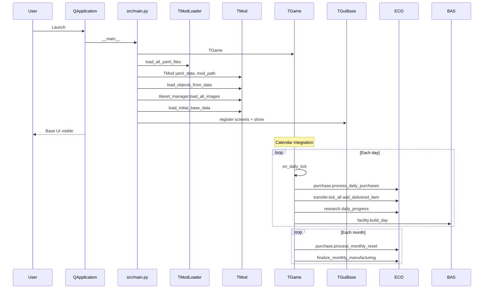
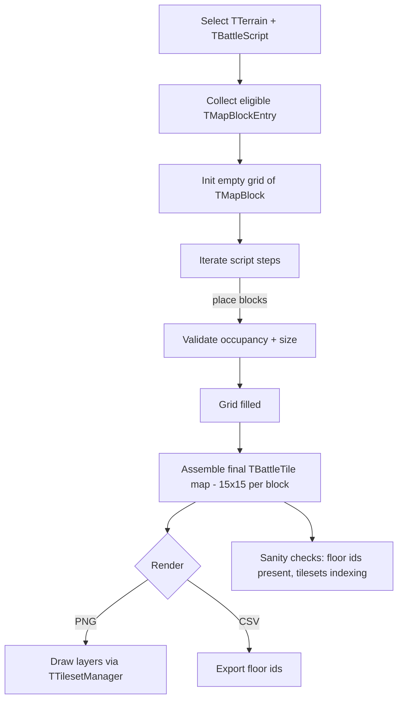

## Scanned code findings (concrete)

I did a targeted scan of key files under `src/` to validate the high-level descriptions above and capture concrete, actionable details you can use when redesigning and reimplementing the game.

- TModLoader (src/engine/modloader.py)
  - Implements `TModLoader.load_all_yaml_files()` which walks the mod `rules/` folder and merges all `.yaml` files.
  - Uses `yaml.safe_load()` and merges at the top-level key. For dict values it uses a shallow update (existing top_key dict is updated with new dict entries).
  - Emits logs and raises FileNotFoundError if `rules/` is missing. Counts loaded files for diagnostics.

> DEPRECATED: Legacy architecture overview

This document is no longer authoritative. The project now uses a single, canonical architecture spec and an implementation plan:
- New architecture: `wiki/architecture.md`
- Migration/implementation plan (self-contained): `wiki/plan.md`

For any references to the legacy implementation, use the SRC anchors embedded in `wiki/plan.md` under “Legacy anchors (SRC pointers)”, which point directly to concrete files, for example:
- `src/engine/game.py` — singleton game, daily/monthly hooks, base summary
- `src/engine/modloader.py` — YAML merge and mod loading
- `src/engine/mod.py` — registries and engine-local enums
- `src/enums.py` — global enums (for adapter mappings)
- `src/economy/purchase.py`, `src/economy/purchase_manager.py` — purchases/transfers
- `src/engine/savegame.py` — save/load
- `src/main.py` — UI entry (Qt hook)

You may remove this file once downstream links are updated. Until then, treat this page as a placeholder to avoid broken links.


## Core engine
- TModLoader (engine/modloader.py)
  - Loads all YAML under `mods/<mod>/rules/` and merges them by top-level key into a single dict (`yaml_data`).
  - Provides a deterministic, mod-friendly input for object construction.
- TMod (engine/mod.py)
  - Holds references to all game “types” and data collections; constructs objects from YAML for:
    - Base: facilities, starting_base setup.
    - Economy: research entries, purchases, manufacturing entries.
    - Craft: craft types, UFO types, UFO scripts.
    - Globe: worlds, biomes, countries, regions, cities.
    - Battle: terrains, map scripts, deployments, effects, damage models, map blocks, objectives.
    - Item: items, weapon modes, armours/equipment/weapons/craft items (category tagging).
    - Lore: factions, campaigns, events, sites, missions.
    - Pedia: entries.
  - Helpers for UI: equipment slot layout, unit/item category lists.
  - Terrain blocks loading and PNG previews are supported via helper methods.
  - Starting base loader: builds initial bases with facilities, inventory, crafts, and units (equips armour/weapons if available).
- TGame (engine/game.py)
  - Singleton orchestration of world, campaigns, calendar, research tree, purchasing, transfers, bases, and monthly manufacturing invoices.
  - Base management: add/remove/activate bases, current base summary (counts by category, capacity).
  - Day/month hooks: integrate transfer deliveries, purchase limits reset, research daily progress, facility build progress, monthly invoice finalization.
  - Purchase + Transfer integration: processes daily purchases and deliveries (items today; units/crafts placeholders noted).
  - Manufacturing time tracking: per-base/project hour accumulation and monthly invoicing with rates.
  - Calendar glue: wraps calendar callbacks to invoke game ticks.
- Other engine components (present in engine/; not fully expanded here):
  - animation.py (TAnimation), sounds.py (TSoundManager), savegame.py (TSaveGame), stats.py (TStatistics), difficulty.py (TDifficulty).

Technical notes
- Data format: YAML via `yaml.safe_load`.
- Imaging/tiles: PIL and PyTMX referenced by battle/terrain tileset manager code paths.
- UI: PySide6 (`QApplication`), custom theming.
- Global enums are split between `src/enums.py` (EItemCategory/EUnitItemCategory/ECraftItemCategory/EUnitType/ThemeType) and engine-local enums in `engine/mod.py` (TItemCategory/TUnitCategory) used by UI helpers — duplication to be reconciled.


## Tactical battle systems (battle/)
- Scope (from readme and flow doc)
  - TBattle: main battle state.
  - TBattleActions: unit actions.
  - Effects/FOW/Floor/Wall/Roof/Object tiles and behaviors.
  - Generator + Script + MapBlock + MapBlockEntry -> final `TBattleTile` grid assembly.
  - LOS (Bresenham), A* pathfinding, reaction fire, damage model, objectives.
  - Terrain/Tileset manager, deployment groups.
- Map generation (battle_generator_flow.md)
  - Pick entries from `TTerrain` according to `TBattleScript` steps; fill a grid of `TMapBlock`s (some blocks span multiple cells).
  - Assemble final map from 15x15 blocks → PNG/CSV rendering supported.
  - Validations: occupancy, presence of floor ids, multi-tileset handling.

Gameplay status
- The full class surface is outlined; TBattleGenerator and tileset manager are in active use (main integrates tilesets; generation snippets commented as examples). LOS/pathfinding/objectives/effects are specified and expected in code, with terrain/block import/render flows.


## Base management (base/)
- Entities
  - TBaseXCom/TBaseAlien, TFacility & TFacilityType, TBaseInventory.
- Responsibilities
  - Place facilities on a grid with requirements; track progress via `build_day()`.
  - Maintain inventory: items/units/crafts/prisoners with capacity rules.
  - Base-defense battle generation from layout (generator class in module).
- Integration
  - Created by TMod startup or by `TGame.initialize_starting_bases()`.
  - Facilities are marked completed for starting bases; construction otherwise progresses daily.

Gameplay status
- Facility placement constraints (position occupied checks, forced placement for starting base). Capacity and unit space queries used by `TGame.get_base_summary()`.


## Craft (craft/)
- TCraft and TCraftType define vehicle instances and templates.
- TCraftInventoryManager implements hardpoints (3 weapon + 2 equipment baseline) with compatibility and cargo accounting.
- Interception combat (TInterception) exists for air/sea/space engagements (readme documented; code present in folder).
- Main equips craft mounts during starting base setup (placeholder for weapon slot assignment noted).


## Economy (economy/)
- Purchasing
  - `TPurchaseEntry` templates; `TPurchase` main interface; `PurchaseManager` + `PurchaseOrder` implement order lifecycle and monthly limits.
  - Integrated with transfer delivery via `TransferManager` (TGame daily runs deliveries).
- Manufacturing
  - `TManufactureEntry` templates and manager/project classes.
  - `TGame` tracks man-hours by base/project and generates monthly invoices.
- Research
  - `TResearchEntry` templates; `TResearchTree` progression and daily progress with notifications on completion.
- Black Market
  - Suppliers with special availability and reputation mechanics (readme-described). Hooks in purchase system.


## Globe/world (globe/)
- World composition: `TWorld`, `TRegion`, `TCountry`, `TBiome`, tiles (`world_tile.py`) and spatial utilities (`world_point.py`).
- Funding & Diplomacy: monthly reports and standings based on countries and scores (`funding.py`, `diplomacy.py`).
- Locations and detection: `location` types + `globe.location` entity; `radar.py` for detection sweeps; ownership by side.
- TMX world loading is referenced (commented in `src/main.py`) and `TWorld.from_tmx` exists in globe module.

Planned/ongoing (from plan.md)
- Tile slicing pipeline and single-asset registry for tilesets.
- World map UX: zoom/drag, day/night band simulation by sinusoidal line; event cadence by day/week/month/quarter/year; detection model (cover, power, recovery).


## Items and inventory (item/ and unit/)
- Item classes: `TItem` (base), `TItemArmour`, `TItemWeapon`, `TCraftItem`, `TWeaponMode`. Categories tagged by mod loader.
- Managers and widgets
  - `TUnitInventoryManager`, `TCraftInventoryManager`, `TBaseInventory` manage slots/hardpoints/capacities and persistence of templates (standardized per inventory report).
  - GUI slots (`TUnitInventorySlot`, `TCraftInventorySlot`, `TUnitSlot`, `TBaseFacilitySlot`) and lists (`TUnitItemListWidget`, `TUnitListWidget`, `TCraftItemListWidget`) support drag & drop, filtering, category combos.
- Unit module
  - `TUnitType` / `TRace` / `TTrait` define template and trait systems.
  - `TUnit` holds stats, side (`TSide`), inventory manager, and equips during starting base creation.

Implementation status (from inventory_system_report.md)
- Full set of components present with template save/load unification across managers and UI integration.


## Lore, Location, Pedia, AI
- Lore: Campaign and calendar, events, quests/organizations; `TCalendar` integrates with `TGame` for daily/monthly hooks.
- Location: Site/city/UFO types and scripts; UFO runtime entity and visibility handled through globe radar/detection.
- Pedia: `TPediaEntry`, `TPedia`, and `TPediaEntryType` to organize entries.
- AI: Tactical `TBattleAI` and high-level `TAlienStrategy` scaffolding described in readme (files exist). Designed for future extension.


## GUI architecture and interaction model (gui/)
- Container screens
  - `TGuiBase` (base view) and `TGuiGlobe` (globe view) with top panels for navigation.
  - `TGuiCoreScreen` base class offers activation/deactivation hooks and style scaffolding.
- Theme and style
  - `theme_manager.py` defines XCOM-themed palettes, scaling util `px`, layout constants.
- Inventory interactions
  - Drag & drop between list widgets and slot widgets. RMB auto-equip actions supported.
  - Category filters for units and items; search in lists.
- Example integration (src/main.py)
  - Registers base screens: Barracks, Hangar, Lab, Workshop, Storage, Base Info; shows the Base UI with a minimum size and window title.


## Data and persistence
- Input: YAML mod rules, loaded and merged by `TModLoader` (strongly typed object construction in `TMod`).
- Save/load: `TSaveGame` present (detailed API not covered in this pass) and inventory/craft/unit templates standardization for quick setups.
- Assets: tilesets and images via `TTilesetManager`; world maps via TMX; PIL/PyTMX pipelines.


## Systems integration and ticks
- Daily tick (via calendar → TGame.on_daily_tick):
  - Transfers deliveries, purchases processing; research daily progress; facility construction.
- Monthly tick (via calendar → TGame.on_monthly_tick):
  - Purchase reset, manufacturing invoice finalization, printing of cycle summary.


## Enumerations in use
- Global: `EItemCategory`, `EUnitItemCategory`, `ECraftItemCategory`, `EUnitType`, `ThemeType` (`src/enums.py`).
- Engine-local (UI helpers and item slots): `TItemCategory`, `TUnitCategory` in `engine/mod.py`.
Note: There is duplication between global and local enums; harmonization is a future cleanup opportunity.


## Notable technical choices
- Singleton `TGame` with guarded __init__ and `_initialized` flag for idempotent construction.
- Data-driven mod architecture with late binding: `TMod` holds references to most type registries.
- PySide6 GUI with modular screens and strongly reusable inventory components.
- Tactical generator logic favors testable, data-defined block assembly via scripts.


## Migration-oriented deep dives (module-by-module)

This section reframes the current implementation to support a clean-room reimplementation aligned with a new design. For each module:
- What it owns and its responsibilities today.
- Inputs/outputs and core flows (contracts implied by usage).
- Key classes you can likely reuse as-is or with thin adapters vs. classes to refactor/replace.
- Integration touchpoints with `TGame`, data sources (YAML), and GUI.

The goal is to understand “current vs. desired” at a level that enables selective reuse without duplicating every property or method.

### Engine
- Responsibilities
  - Boot and data: `TModLoader` merges YAML; `TMod` constructs registries for items, units, terrains, research, purchases, etc.
  - Orchestration: `TGame` singleton coordinates day/month ticks, bases, purchases/transfers, research progress, and monthly manufacturing invoices.
  - Services: save/load (`TSaveGame`), audio (`TSoundManager`), animation (`TAnimation`), statistics (`TStatistics`), difficulty (`TDifficulty`).
- Inputs/Outputs
  - In: YAML rules under a mod’s `rules/`; runtime UI events; calendar ticks.
  - Out: In-memory registries of templates and instances; per-tick side effects (deliveries, invoices, research completion notifications).
- Flows and contracts
  - Startup: Mod loading → `TMod.load_objects_from_data()` → optional terrain/tile block loading.
  - Campaign lifecycle: `TGame.setup_calendar_integration()` -> `on_daily_tick()`/`on_monthly_tick()` call into economy, research, bases.
  - Base accessors: getters for units/items/crafts/summary used by GUI.
- Reuse guidance
  - Keep: `TModLoader` (YAML merge), `TMod` (type registries), `TGame` lifecycle and tick plumbing (with minor cleanups).
  - Adapt: Enum unification (`src/enums.py` vs `engine/mod.py`), manufacturing time/invoice accounting API shape, purchase/transfer glue callbacks.
  - Replace: If moving away from singleton, wrap `TGame` behind a service locator or DI façade while keeping its internal logic initially.

### Base
- Responsibilities
  - Entities: `TBaseXCom`/`TBaseAlien` as world locations; `TFacilityType` blueprints and `TFacility` instances; `TBaseInventory` for items/units/crafts/prisoners with capacity.
  - Operations: Facility placement/constraints; daily `build_day()`; inventory add/remove with categories and sizes; base-defense battle layout generator.
- Inputs/Outputs
  - In: Starting base data from `TMod`; facility blueprints; item/unit/craft templates.
  - Out: Storage/space summaries; snapshots for GUI lists; battle grid seed for defense.
- Reuse guidance
  - Keep: `TBaseInventory` API contracts (counts by category, capacity math, template save/load), `TFacilityType`/`TFacility` basics.
  - Adapt: `TBaseXCom` interface to expose clearer read-only snapshots for UI; unify add/remove semantics across items/units/crafts.
  - Replace: Any direct UI coupling inside base classes (prefer presenters/viewmodels).

### Battle
- Responsibilities
  - Map generation: `TTerrain` + `TBattleScript/Step` + `TMapBlock/Entry` → `TBattleGenerator` builds a grid of `TBattleTile` (floor/wall/roof/object layers).
  - Mechanics scaffolding: Line-of-sight (`BattleLOS`), pathfinding (`BattlePathfinder`), effects (`TBattleEffect`), reaction fire, objectives (`TBattleObjective`), damage (`TDamageModel`).
  - Assets: `TTilesetManager` loads/slices tiles and exports previews.
- Inputs/Outputs
  - In: Terrain definitions and map scripts (YAML/TMX); deployment info.
  - Out: Tile grid for rendering and gameplay; optional PNG/CSV exports.
- Reuse guidance
  - Keep: `TBattleGenerator` pipeline, `TBattleTile` data model, tileset loader utilities.
  - Adapt: Objective/damage/effect APIs to align with new combat rules; separate pure logic from rendering assumptions.
  - Replace: Monolithic `TBattle` turn loop if new design requires ECS or event-driven combat.

### Craft
- Responsibilities
  - Entities: `TCraft` instances with crew/cargo; `TCraftType` blueprints.
  - Inventory: `TCraftInventoryManager` and `CraftInventoryTemplate` for hardpoints and cargo with compatibility and performance modifiers.
  - Combat: `TInterception` for air/sea/space engagements, AP spending, rearming costs and logs.
- Inputs/Outputs
  - In: Items (`TCraftItem`), unit assignments, mission orders.
  - Out: Craft status, performance modifiers, purchase/manufacture rearm costs.
- Reuse guidance
  - Keep: Craft inventory manager and templates; compatibility rules are well-encapsulated.
  - Adapt: `TInterception` interface to a more declarative action model if required; connect rearm flows to economy consistently.
  - Replace: Any craft UI assumptions embedded in manager (move to GUI layer).

### Economy
- Responsibilities
  - Purchasing: `TPurchase` + `PurchaseManager`/`PurchaseOrder` handle availability, validation, order lifecycle, and monthly limits; optional black market via `BlackMarket`/`BlackMarketSupplier`.
  - Manufacturing: `TManufactureEntry`, `ManufacturingManager`, `ManufacturingProject` with capacity tracking and daily progress.
  - Research: `TResearchEntry`, `TResearchManager`/`TResearchTree` with daily progression and completion unlocks.
  - Logistics: `TransferManager`/`TTransfer` for deliveries; integrated in `TGame.on_daily_tick()`.
- Inputs/Outputs
  - In: Available tech/services/items/money; base capacities; monthly resets.
  - Out: Orders/Projects with statuses; deliveries; monthly reports/invoices.
- Reuse guidance
  - Keep: Separation of interface (entry templates) vs. runtime managers/projects; transfer abstraction.
  - Adapt: Validation error surfaces to structured results; unify “save_data/to_dict” shapes across submodules.
  - Replace: Duplicate purchase systems (`economy/purchase.py` and `economy/purchase_system.py`) by consolidating into one coherent API.

### Globe
- Responsibilities
  - World model: `TWorld`, `TRegion`, `TCountry`, `TBiome`, `TWorldTile`, `TWorldPoint` with spatial utilities.
  - Detection & scoring: `TGlobalRadar` scans; `TFunding` computes monthly funding by score; `TDiplomacy` maintains states.
  - Locations as anchors: Links to `location` module entities (cities, sites, UFOs, bases).
- Inputs/Outputs
  - In: TMX maps, faction presence, mission/activity.
  - Out: Ownership/visibility maps, funding deltas, diplomacy state.
- Reuse guidance
  - Keep: `TWorldPoint` utilities and tile/country/region structures; funding model entry points.
  - Adapt: Radar/detection math to new cover/power models; add query APIs for UI friendliness.
  - Replace: Any rendering concerns from logic classes (delegate to GUI).

### GUI
- Responsibilities
  - Containers: `TGuiBase`, `TGuiGlobe` with top panels to switch screens/worlds and end turn.
  - Screens: Base (Barracks, Hangar, Lab, Market, Purchase, Storage, Transfer, Workshop), Globe (Budget, Factions, Funding, Intercept, Map, Menu, Pedia, Policies, Production, Reports, Research), Battle (brief/inventory/end).
  - Widgets: Reusable list/slot widgets with drag & drop; theme/style via `theme_manager` and `ThemeManager`.
- Inputs/Outputs
  - In: Data snapshots from `TGame` and module managers; user interactions.
  - Out: Calls into managers for equip/mount/purchase/transfer; signals to switch screens/bases/worlds.
- Reuse guidance
  - Keep: Reusable widgets (slots/lists) and theme system; `TGuiCoreScreen` lifecycle.
  - Adapt: Screen presenters to consume read-only DTOs instead of direct model mutation.
  - Replace: Any logic hidden in UI code paths (move to services/managers).

### Item
- Responsibilities
  - Templates: `TItemType` with rich attribute sets and mode parameters (`TWeaponMode`).
  - Instances: `TItem`, `TItemArmour`, `TItemWeapon`, `TCraftItem` with common serialization and display helpers.
  - Interactions: `TItemTransferManager` mediates drag/drop across widgets with validation hooks.
- Inputs/Outputs
  - In: YAML item templates; slot/hardpoint compatibility rules.
  - Out: DTOs for UI; stat modifiers consumed by unit/craft managers.
- Reuse guidance
  - Keep: Type/instance split and transfer manager; weapon mode parameterization.
  - Adapt: Normalize category/enums; extract stat/damage types for combat engine alignment.
  - Replace: Any implicit coupling to PySide types in core classes (keep UI-free domain).

### Unit
- Responsibilities
  - Templates: `TUnitType`, `TRace`, `TTrait`.
  - Instances: `TUnit` with stats (`TUnitStats`), side (`TSide`), inventory manager (`TUnitInventoryManager`), and equipment templates (`InventoryTemplate`).
- Inputs/Outputs
  - In: Type/trait/race definitions; items to equip; battle/craft/base contexts.
  - Out: Effective stats; equipment state; experience/level progression hooks.
- Reuse guidance
  - Keep: `TUnitStats` operations and `TUnitInventoryManager` auto-equip/template flows.
  - Adapt: Experience/level rules to new progression; property names to canonical enums.
  - Replace: Any direct game lookups inside unit methods (inject services).

### Location
- Responsibilities
  - Entities: `TCity`, `TSite`/`TSiteType`, `TUfoType`/`TUfoScript`/`TUfo` as world locations.
  - Behavior: UFO scripted movement, taking damage/crash; site terrain selection.
- Inputs/Outputs
  - In: Campaign/campaign-step mission generation from `lore`.
  - Out: Active world locations for radar/detection; battle seeds.
- Reuse guidance
  - Keep: Site/UFO type models and script runner shape.
  - Adapt: Movement and mission hooks to the new world activity model.
  - Replace: Direct coupling to `TGame` if present; prefer events.

### Lore
- Responsibilities
  - Timeline: `TCalendar` with day/week/month/quarter/year hooks; `TCampaign`/`TCampaignStep` define mission cadence per faction/region; `TEvent`/`TEventEngine` for random events; quests/orgs via `TQuest`/`TOrganization` and `QuestManager`/`TQuestEngine`.
- Inputs/Outputs
  - In: Research status, factions, world map; completed quests/techs.
  - Out: Missions spawned, events queued, unlocks/unlocks checks.
- Reuse guidance
  - Keep: Calendar/event interfaces; quest/org progression state machine.
  - Adapt: Campaign-to-mission pipeline so outputs are explicit DTOs consumed by world/mission services.
  - Replace: Hard-coded month logic with data-driven rules if needed.

### Pedia
- Responsibilities
  - `TPediaEntry`, `TPediaEntryType`, `TPedia` registry and lookups; unlock checks by tech.
- Reuse guidance
  - Keep: Data structures and unlock predicate; integrate display rendering with new UI.

### AI
- Responsibilities
  - Tactical AI scaffold (`TBattleAI`) for target selection, movement, and turn execution.
  - Strategic AI scaffold (`TAlienStrategy`) at campaign/mission level.
- Reuse guidance
  - Keep: Interfaces; implement strategies against the new combat/world services.


## Quick reuse map (recommendations)

Legend: Keep (as-is), Adapt (wrap/refactor), Replace (rewrite or drop)

- Keep
  - YAML loader/merger (`TModLoader`), type registries (`TMod`).
  - Inventory managers (`TBaseInventory`, `TUnitInventoryManager`, `TCraftInventoryManager`) and template systems.
  - Battle generator pipeline (`TBattleGenerator`, `TBattleTile`, `TTilesetManager`).
  - World geometry/utilities (`TWorldPoint`, region/country/biome structures).
  - Transfer abstraction and research/manufacturing project models.

- Adapt
  - `TGame` singleton into service façade; unify enums; standardize DTOs for GUI.
  - Economy validation/reporting surfaces to structured results.
  - Combat subsystems (damage/objectives/effects) to new rules while retaining shapes.
  - Radar/detection math and globe queries for UI/state.

- Replace
  - Duplicate/legacy purchase API (`economy/purchase_system.py`).
  - UI-coupled logic in GUI classes; move to services.
  - Any direct cross-module lookups; prefer event/observer or injected services.


## Gaps, risks, and TODOs (from the code and plan)
- Tileset pipeline: Needs the single-tile slicing and global registry; currently `TTilesetManager` loads images but the slicing workflow is pending per plan.md.
- World map UX: Zoom, drag, day/night cycle math, and detection loop are planned; base classes exist (globe/radar/world) but interactive globe screen specifics are pending.
- Delivery of units/crafts: Transfer callback in `TGame` prints placeholders for unit/craft deliveries.
- Enum duplication: `src/enums.py` vs `engine/mod.py` may cause confusion; consistent usage and migration plan recommended.
- Main UI coverage: Base screens are shown in `src/main.py`; globe screens exist but are not exercised in the sample main.


## Try it
- Run sample main (Qt app) that loads a mod, constructs data, and opens base UI. Ensure dependencies from root `requirements.txt` are installed and Qt environment is available.
- Battle generator usage and world TMX load examples are in `src/main.py` as commented snippets.


## Comparing to the new design (how to annotate deltas)

For each module, capture a short delta note beside the deep dive above (inline or as comments in `architecture_inventory.md`) using this lightweight template:
- Desired outcome (from new design): …
- Current capability: …
- Gap(s): …
- Decision: Keep | Adapt | Replace (brief why)
- Reuse notes: Classes/flows to keep and any adapters needed

You can paste delta notes under the relevant module headings in “Migration-oriented deep dives” or keep a parallel log per module in a new file `wiki/architecture_deltas.md`.


## Appendix A: Key APIs (selected)
- Engine
  - TModLoader.load_all_yaml_files() → dict by top-level key
  - TMod.load_objects_from_data() → populates registries; load_initial_base_data()
  - TGame.initialize_starting_bases(); on_daily_tick(); on_monthly_tick()
- Base
  - TBaseXCom.add_facility(type, pos, force_add=False); get_unit_space(); inventory APIs
- Economy
  - TPurchase.process_daily_purchases(transfer_manager)
  - TGame.track_manufacturing_hours(); finalize_monthly_manufacturing(); get_monthly_manufacturing_invoice()
- Battle
  - TBattleGenerator(terrain, script, blocks_x, blocks_y).generate(); render_to_png()
- GUI
  - TGuiBase.register_screen(key, widget); set_initial_screen(key); show()


## Appendix B: Module maps (from readmes)
- Battle: TBattle, TBattleActions, TBattleEffect, TBattleFloor/FOW/Tile/Wall/Roof/Object, BattleLoot, BattleLOS, BattlePathfinder, TBattleScript/Step, TMapBlock/Entry, TDeployment/Group, TDamageModel, TBattleObjective, TReactionFire, TTerrain, TTilesetManager.
- Base: TBaseAlien, TBaseXCom, TBaseInventory, TFacility/Type, TBaseXComBattleGenerator.
- Craft: TCraft, TCraftInventoryManager, CraftInventoryTemplate, TCraftType, TInterception.
- Economy: TManufacture/Entry/Manager/Project, TPurchase/Entry/Manager/Order/BlackMarket, ResearchManager/Entry/Project/TResearchTree, TTransfer/TransferManager.
- Globe: TBiome, TCountry, TDiplomacy, TFunding, TLocation, TGlobalRadar, World/Tile/Point/Region.
- Item: TItem, TItemArmour, TCraftItem, TWeaponMode, TItemTransferManager.
- Unit: TRace, TSide, TTrait, TUnit, TUnitInventoryManager, TUnitStats, InventoryTemplate.
- Lore: QuestManager, TQuestEngine, TQuest, TOrganization, TMission, TFaction, TEventEngine, TEvent, TCampaignStep, TCampaign, TCalendar.
- Pedia: TPediaEntry, TPedia, TPediaEntryType.
- GUI: theme_manager, gui_base/gui_world/gui_core, slots (inventory/craft/unit/facility), widgets (unit list, unit item list, craft item list).


## Requirements coverage
- Analyze Python files in src: Done (tree scan, readmes, core engine/battle docs, main.py, enums).
- Create architecture documentation in Markdown with functional, technical, gameplay, UI/interaction, mechanics: Done.
- Save as wiki/architecture_old.md: Done.


## Notes
This is a descriptive “what exists” snapshot focusing on modules and integration already present. It intentionally mirrors the code and local readmes; as systems evolve (especially world map and tileset pipeline), revisit this doc to keep it in sync.

## Per-module API tables (selected)

The following tables list selected classes and methods with observed signatures from the current codebase and module readmes. Method names and parameters reflect implemented sources reviewed above; where details aren’t visible here, consult the referenced files.

### Engine

| Class | Method signature | Description |
|-------|-------------------|-------------|
| TModLoader | load_all_yaml_files() -> None | Scans mods/<mod>/rules for .yaml, merges to self.yaml_data |
| TMod | load_objects_from_data() -> None | Instantiates registries from yaml_data |
| TMod | load_initial_base_data() -> None | Builds starting bases: facilities, items, crafts, units |
| TMod | load_all_terrain_map_blocks() -> None | Loads terrain maps and blocks for each TTerrain |
| TMod | render_all_map_blocks() -> None | Renders map blocks for preview/caching |
| TMod | get_equipment_slots() -> list[dict] | Static slot layout for unit equipment UI |
| TMod | get_unit_categories() -> list[dict] | Static list for UI filtering |
| TMod | get_item_categories() -> list[dict] | Static list for UI filtering |
| TGame | get_active_base() -> Optional[TBaseXCom] | Returns current base, sets first if unset |
| TGame | set_active_base(base_name: str) -> bool | Activates named base if exists |
| TGame | set_active_base_by_index(index: int) -> bool | Activates base by order index |
| TGame | add_base(name: str, base: TBaseXCom) -> bool | Adds base, sets active if first |
| TGame | remove_base(name: str) -> bool | Removes base, reassigns active if needed |
| TGame | base_exists(name: str) -> bool | Existence check |
| TGame | get_base_status(name: str) -> str | 'nonexistent' | 'available' | 'active' |
| TGame | get_base_status_by_index(index: int) -> str | Status by index |
| TGame | get_current_base_units() -> list[TUnit] | Units of active base |
| TGame | get_current_base_items() -> list[tuple[str, float, Optional[EUnitItemCategory]]] | Items of active base |
| TGame | get_current_base_crafts() -> list[TCraft] | Crafts of active base |
| TGame | get_base_summary() -> dict[str,int] | Counts by category + capacity |
| TGame | initialize_starting_bases() -> bool | Creates bases using TMod.starting_base |
| TGame | track_manufacturing_hours(base_id: str, entry_id: str, hours: float) -> None | Accumulate man-hours |
| TGame | finalize_monthly_manufacturing(month_year: str) -> dict | Archive and reset month tracking |
| TGame | get_monthly_manufacturing_invoice(month_year: str, hourly_rate: float=50) -> dict | Compute costs |
| TGame | process_daily_transfers_and_purchases() -> None | Daily deliveries + purchase processing |
| TGame | _add_delivered_items_to_base(base_id: str, object_type: str, object_id: str, quantity: int) -> None | Transfer callback |
| TGame | initialize_purchase_system(purchase_data: dict) -> None | Initialize TPurchase |
| TGame | get_purchase_system() -> Optional[TPurchase] | Accessor |
| TGame | setup_calendar_integration() -> None | Wrap calendar hooks to call daily/monthly |
| TGame | on_daily_tick() -> None | Daily processing (transfers, research, construction) |
| TGame | on_monthly_tick() -> None | Monthly processing (purchase reset, invoices) |
| TGame | get_unit_by_name(unit_name: str) -> Optional[TUnit] | Lookup in active base |

### Base

| Class | Method signature | Description |
|-------|-------------------|-------------|
| TFacility | build_day() -> None | Progresses construction; sets completed when done |
| TBaseXCom | add_facility(type: TFacilityType, position: tuple[int,int], force_add: bool=False) -> TFacility | Place facility |
| TBaseXCom | can_place_facility_at(position: tuple[int,int]) -> bool | Occupancy/constraints check |
| TBaseXCom | add_item(item_id: str, quantity: int) -> bool | Adds to base inventory (capacity rules) |
| TBaseXCom | add_unit(unit: TUnit) -> None | Adds personnel |
| TBaseXCom | add_craft(craft: TCraft) -> None | Adds craft |
| TBaseXCom | get_unit_space() -> int | Personnel capacity (used by TGame summary) |
| TBaseInventory | get_all_items() -> list[tuple[str, float, Optional[EUnitItemCategory]]] | Items snapshot |

### Battle

| Class | Method signature | Description |
|-------|-------------------|-------------|
| TBattleGenerator | __init__(terrain: TTerrain, script: TBattleScript, blocks_x: int, blocks_y: int) | Prepare generator |
| TBattleGenerator | generate() -> None | Assemble map from TMapBlock grid via script steps |
| TBattleGenerator | render_to_png(path: str|Path) -> None | PNG render of assembled map |
| TTerrain | load_maps_and_blocks(path: Path) -> None | Load TMX map blocks |
| TTerrain | render_map_blocks() -> None | Preview tiles |
| TTilesetManager | load_all_images(tiles_path: Path, gfx_path: Path) -> None | Load tiles and masks |

### Economy

| Class | Method signature | Description |
|-------|-------------------|-------------|
| TPurchase | process_daily_purchases(transfer_manager: TransferManager) -> None | Queue orders for delivery |
| TransferManager | tick_all(callback) -> None | Advance deliveries; call callback on arrival |
| TResearchTree | daily_progress() -> list[str] | Advance projects; return completed ids |
| TManufactureEntry | __init__(pid: str, data: dict) | Template for manufacturing project |

### Globe

| Class | Method signature | Description |
|-------|-------------------|-------------|
| TWorld | from_tmx(path: Path) -> TWorld | Build world from TMX (referenced) |
| TFunding | ... | Monthly scoring/funding (see file) |
| TDiplomacy | ... | State transitions/history |
| TRadar (GlobalRadar) | ... | Detection sweeps over locations |

### GUI

| Class | Method signature | Description |
|-------|-------------------|-------------|
| TGuiBase | register_screen(key: str, widget: QWidget) -> None | Add screen |
| TGuiBase | set_initial_screen(key: str) -> None | Select visible screen |
| TGuiBase | show() -> None | Show main window |
| TGuiCoreScreen | activate()/deactivate()/refresh() -> None | Lifecycle hooks |
| Inventory/List Slots | dragEnterEvent/dropEvent/contextMenuEvent | DnD + RMB auto-equip behavior |
| theme_manager | px(value:int)->int; XcomTheme; XcomStyle | Scaling and theme constants |

### Item

| Class | Method signature | Description |
|-------|-------------------|-------------|
| TItemType | __init__(pid: str, data: dict) | Static item template |
| TItem | serialize()/deserialize() | Persistence for inventory |
| TItemArmour | __init__(item_id: str) | Unit armour instance |
| TItemWeapon | __init__(item_id: str) | Unit weapon instance |
| TCraftItem | __init__(item_id: str) | Craft equipment instance |
| TWeaponMode | __init__(pid: str, data: dict) | Weapon firing mode template |

### Unit

| Class | Method signature | Description |
|-------|-------------------|-------------|
| TUnitType | __init__(pid: str, data: dict) | Unit template |
| TRace | __init__(pid: str, data: dict) | Race template |
| TTrait | __init__(pid: str, data: dict) | Trait template (with categories) |
| TUnit | __init__(unit_type: TUnitType, side: TSide) | Runtime unit with stats/inventory |
| TUnitInventoryManager | equip_item(slot_name: str, item) -> bool | Slot rules and stat deltas |
| TUnitInventoryManager | save_template()/load_template() | Persist/restore equipment |

### Lore, Location, Pedia, AI

| Class | Method signature | Description |
|-------|-------------------|-------------|
| TCalendar | on_day()/on_month() -> None | Calendar hooks (wrapped by TGame) |
| TCampaign | __init__(pid: str, data: dict) | Campaign template |
| TEvent | __init__(pid: str, data: dict) | Event template |
| TUfoType/TUfoScript/TUfo | ... | UFO definitions and behavior |
| TPediaEntry/TPedia | ... | UFOpedia entries and registry |
| TBattleAI/TAlienStrategy | ... | Tactical and strategic AI scaffolding |

Note: Ellipses indicate methods exist but were not explicitly read in this pass; see files listed in the module maps for details.

## Architecture diagrams (Mermaid)

### System context and data flow

```mermaid
graph TD
  subgraph Mod Loading
    L[TModLoader\nmerge YAML rules] -->|yaml_data| M[TMod\nconstruct registries]
  end

  M -->|registries| G[TGame\nsingleton state]

  subgraph Domains
    BTL[Battle]
    BAS[Base]
    CRF[Craft]
    ECO[Economy]
    GLB[Globe]
    ITM[Item]
    UNT[Unit]
    LOR[Lore]
    PEA[Pedia]
  end

  G --> BAS
  G --> CRF
  G --> ECO
  G --> GLB
  G --> BTL
  G --> UNT

  subgraph UI
    UI[TGuiBase/TGuiGlobe]
  end

  G --> UI
  UI -->|interact| G
```

### Runtime sequence (startup and ticks)



### Battle map generation flow


