# Architecture Documentation Guide

**Guide:** Building & Managing Architecture Diagrams  
**Date:** 2025-10-27  
**Version:** 1.0  
**Audience:** Developers, Technical Writers, AI Agents

---

## 📋 Table of Contents

1. [Overview](#overview)
2. [Documentation Philosophy](#documentation-philosophy)
3. [Folder Structure](#folder-structure)
4. [Diagram Types & When to Use](#diagram-types--when-to-use)
5. [Creating New Documentation](#creating-new-documentation)
6. [Mermaid Syntax Guide](#mermaid-syntax-guide)
7. [Styling & Conventions](#styling--conventions)
8. [Maintenance Workflow](#maintenance-workflow)
9. [Quality Checklist](#quality-checklist)
10. [Tools & Resources](#tools--resources)

---

## Overview

The AlienFall architecture documentation uses **visual-first** approach with Mermaid diagrams to explain system architecture, data flow, and technical decisions.

### Key Principles

- **Visual First**: Diagrams over text walls
- **Organized**: Clear folder structure by purpose
- **Focused**: Small, specific files over large comprehensive ones
- **Maintainable**: Easy to update and extend
- **Cross-Referenced**: Links between related systems

---

## Documentation Philosophy

### Why Visual Documentation?

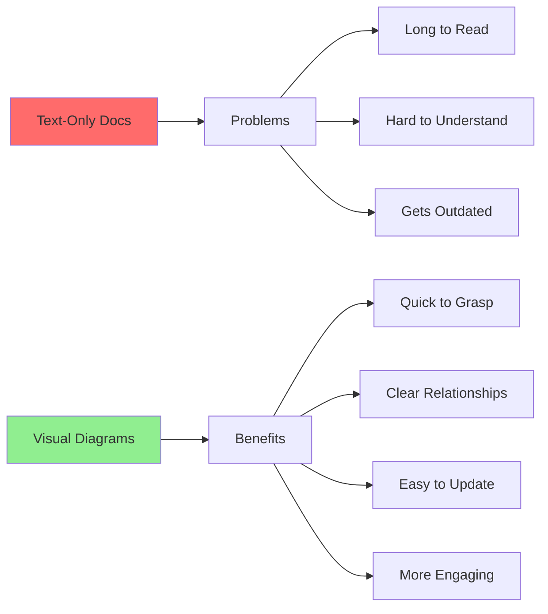

### Visual-First Approach

| Aspect | Text-Heavy | Visual-First |
|--------|------------|--------------|
| **Understanding** | 10-15 minutes | 2-3 minutes |
| **Maintenance** | Find & edit paragraphs | Update diagram nodes |
| **Accuracy** | Can drift from code | Easier to keep synced |
| **Engagement** | Low | High |
| **Onboarding** | Slow | Fast |

---

## Folder Structure

```
architecture/
├── README.md                    # Main navigation hub
├── ROADMAP.md                   # Project roadmap
├── ROADMAP_ARCHITECTURE.md      # Documentation status
├── ARCHITECTURE_GUIDE.md        # This file
│
├── core/                        # Core Engine Systems
│   ├── STATE_MANAGEMENT.md      # State machines, transitions
│   └── MOD_SYSTEM.md            # Content loading, validation
│
├── layers/                      # Game Layers (Strategic/Tactical/Operational)
│   ├── GEOSCAPE.md              # Strategic layer
│   ├── BATTLESCAPE.md           # Tactical layer
│   ├── BASESCAPE.md             # Management layer
│   └── INTERCEPTION.md          # Air combat layer
│
├── systems/                     # Specialized Systems
│   ├── AI_SYSTEMS.md            # AI behavior
│   ├── ECONOMY.md               # Finance system
│   ├── RESEARCH.md              # Tech tree
│   ├── ANALYTICS.md             # Metrics tracking
│   ├── GUI_WIDGETS.md           # UI framework
│   ├── PROCEDURAL_GENERATION.md # Map generation
│   ├── SAVE_LOAD.md             # Persistence
│   ├── DATA_MODELS.md           # Entity relationships
│   └── MODDING_GUIDE.md         # Mod API
│
└── legacy/                      # Archived Reference Files
    └── (old comprehensive files preserved for reference)
```

### When to Create New Files

| Create In | When | Example |
|-----------|------|---------|
| **core/** | Core engine functionality | Event system, asset manager |
| **layers/** | New game layer/screen | Diplomacy screen, tutorial layer |
| **systems/** | Specialized subsystem | Crafting system, quest system |
| **legacy/** | Never (archive only) | - |

---

## Diagram Types & When to Use

### 1. Flowcharts (graph TD/LR)

**Use For:** Process flows, pipelines, decision trees

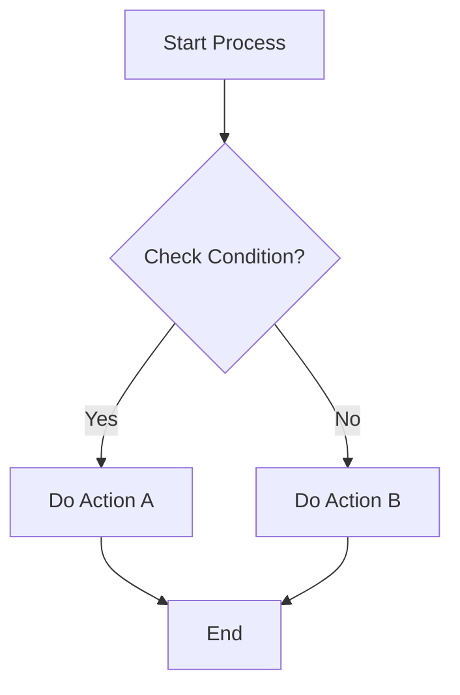

**Example Code:**
```markdown
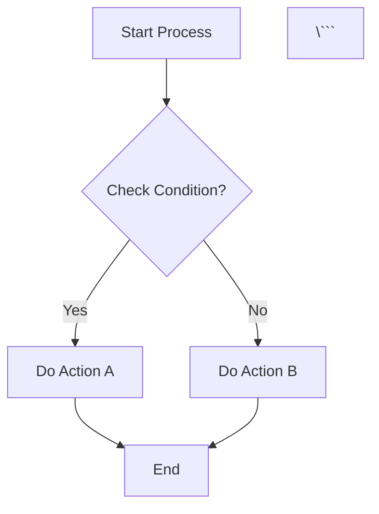

**Best For:**
- Process flows (map generation, save/load)
- Decision trees (AI behavior)
- System pipelines (mod loading)

---

### 2. State Diagrams (stateDiagram-v2)

**Use For:** State machines, transitions, lifecycles

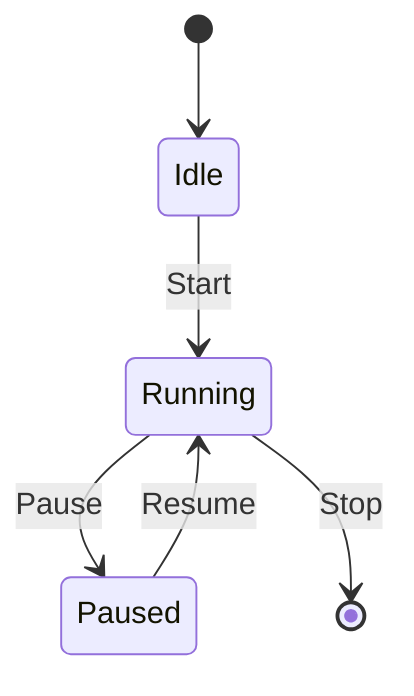

**Example Code:**
```markdown
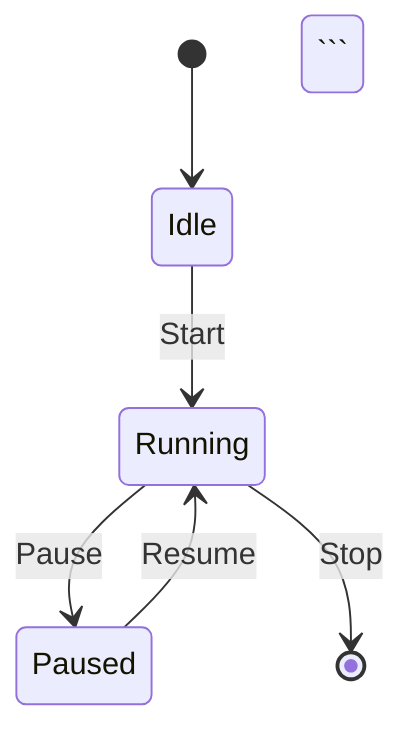

**Best For:**
- Game states (menu, geoscape, battle)
- Unit states (idle, moving, attacking)
- Animation states
- AI behavior states

---

### 3. Sequence Diagrams (sequenceDiagram)

**Use For:** System interactions, timing, communication flow

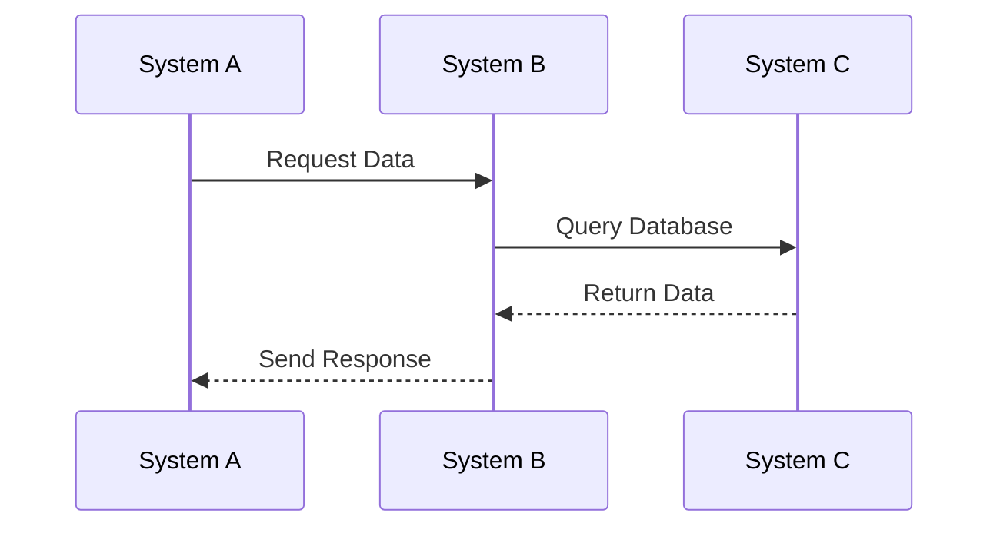

**Example Code:**
```markdown
```mermaid
sequenceDiagram
    participant A as System A
    participant B as System B
    
    A->>B: Request
    B-->>A: Response
\```
```

**Best For:**
- Save/Load flow
- Network communication
- Event propagation
- System initialization

---

### 4. Entity Relationship Diagrams (erDiagram)

**Use For:** Data models, database schemas, relationships

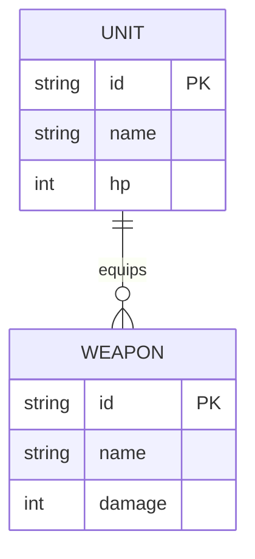

**Example Code:**
```markdown
```mermaid
erDiagram
    UNIT {
        string id PK
        string name
        int hp
    }
    
    WEAPON {
        string id PK
        int damage
    }
    
    UNIT ||--o{ WEAPON : "equips"
\```
```

**Best For:**
- Data models (units, facilities, missions)
- Database schemas
- Content structure
- Save file format

---

### 5. Class Diagrams (classDiagram)

**Use For:** Object hierarchies, inheritance, interfaces

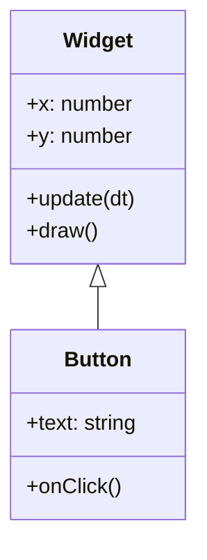

**Example Code:**
```markdown
```mermaid
classDiagram
    class Widget {
        +x: number
        +update(dt)
    }
    
    class Button {
        +text: string
    }
    
    Widget <|-- Button
\```
```

**Best For:**
- Widget hierarchy
- Class inheritance
- Component systems
- OOP structures

---

### 6. Tables

**Use For:** Detailed specifications, configurations, comparisons

```markdown
| Feature | Value | Notes |
|---------|-------|-------|
| **Speed** | 100 | Units per second |
| **Damage** | 20-30 | Random range |
```

**Best For:**
- Specifications (stats, costs, values)
- Configuration options
- Comparison tables
- Feature matrices

---

## Creating New Documentation

### Step-by-Step Process

#### 1. **Determine Location**

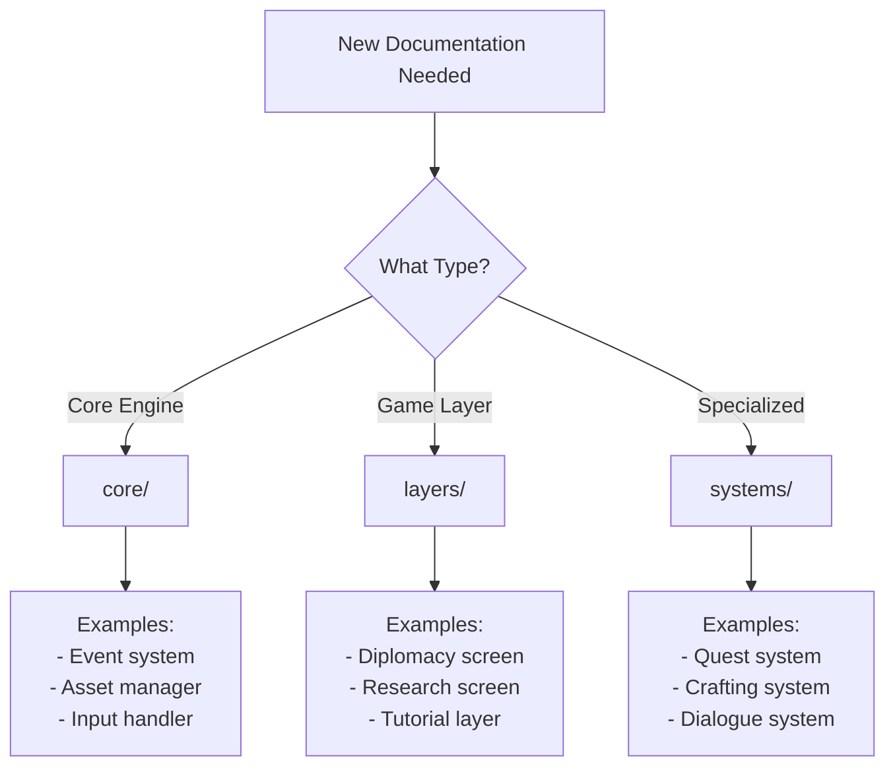

#### 2. **Create File Structure**

```markdown
# System Name Architecture

**System:** Brief Description  
**Date:** YYYY-MM-DD  
**Status:** Complete/In Progress

---

## Overview

Brief description of what this system does and why it exists.

---

## [Section 1 with Diagram]

```mermaid
graph TD
    ...
\```

---

## [Section 2 with Table]

| Column | Column |
|--------|--------|
| Data   | Data   |

---

**End of System Name Architecture**
```

#### 3. **Add Diagrams**

Follow the pattern:
1. **Section Title**
2. **Diagram** (if complex)
3. **Table** (for detailed specs)
4. **Short Explanation** (1-2 sentences max)

#### 4. **Link From README**

Update `architecture/README.md`:

```markdown
### By System Type

#### Specialized Systems
- **[New System](systems/NEW_SYSTEM.md)** - Brief description
```

#### 5. **Update Statistics**

Update the statistics table in README.md

---

## Mermaid Syntax Guide

### Basic Flowchart

```markdown
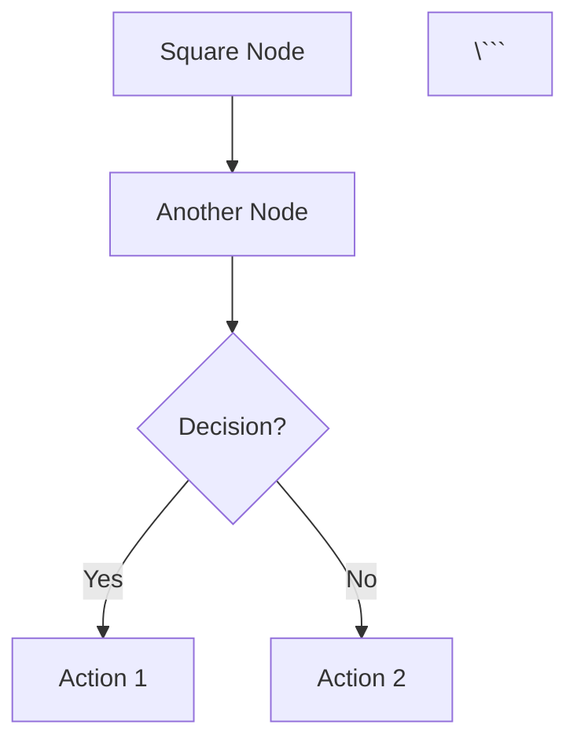

### Node Shapes

| Shape | Syntax | Use For |
|-------|--------|---------|
| **Rectangle** | `[Text]` | Process, action |
| **Round** | `(Text)` | Start/end |
| **Diamond** | `{Text}` | Decision |
| **Circle** | `((Text))` | Connector |
| **Hexagon** | `{{Text}}` | Preparation |
| **Parallelogram** | `[/Text/]` | Input/output |

### Arrow Types

| Type | Syntax | Meaning |
|------|--------|---------|
| **Solid** | `-->` | Direct flow |
| **Dotted** | `-.->` | Indirect/optional |
| **Thick** | `==>` | Important path |
| **With Text** | `-->|Label|` | Labeled transition |

### Subgraphs

```markdown
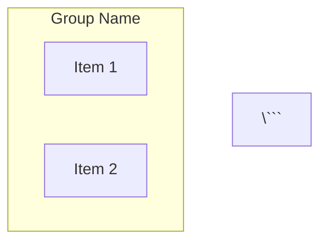

---

## Styling & Conventions

### Color Scheme

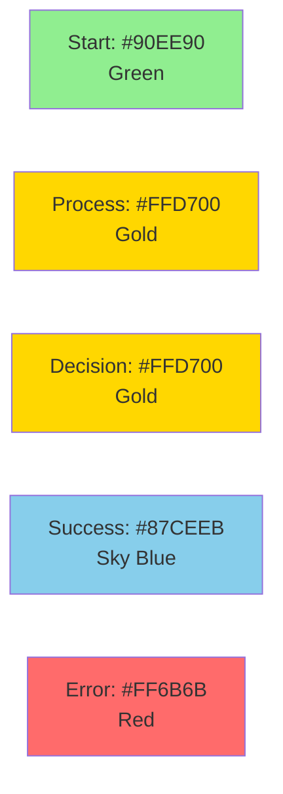

### Standard Colors

| Purpose | Color | Hex Code | Usage |
|---------|-------|----------|-------|
| **Start/Input** | Green | #90EE90 | Entry points |
| **Process/Important** | Gold | #FFD700 | Key processes |
| **Decision** | Gold | #FFD700 | Decision points |
| **Success/Output** | Sky Blue | #87CEEB | Successful outcomes |
| **Error/Warning** | Red | #FF6B6B | Errors, failures |
| **Alternative** | Purple | #E0BBE4 | Alternative paths |
| **Info** | Orange | #FFA500 | Information nodes |

### Applying Styles

```markdown
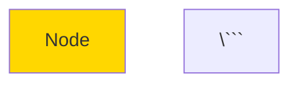

### Naming Conventions

| Element | Convention | Example |
|---------|-----------|---------|
| **Files** | UPPERCASE_SNAKE.md | `AI_SYSTEMS.md` |
| **Sections** | Title Case | `## Combat Resolution` |
| **Diagram Nodes** | Short & Clear | `SaveMgr`, `Check{Valid?}` |
| **Variables** | snake_case | `unit_id`, `max_hp` |

---

## Maintenance Workflow

### Regular Maintenance

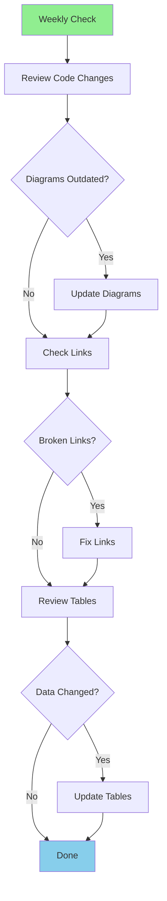

### When Code Changes

1. **Identify Affected Docs**
   - Which systems changed?
   - Which diagrams show this?

2. **Update Diagrams**
   - Modify affected nodes
   - Add new flows if needed
   - Remove obsolete paths

3. **Update Tables**
   - Specifications
   - Configuration values
   - Performance metrics

4. **Test Rendering**
   - Preview in VS Code (Mermaid extension)
   - Check GitHub rendering
   - Verify on documentation site

5. **Update Cross-References**
   - Links to other docs
   - References in README
   - Related API docs

---

## Quality Checklist

### Before Committing

- [ ] **Diagrams render correctly**
- [ ] **No syntax errors**
- [ ] **Colors follow standard scheme**
- [ ] **Tables are well-formatted**
- [ ] **Cross-references work**
- [ ] **README updated**
- [ ] **Statistics updated**
- [ ] **No typos**

### Diagram Quality

- [ ] **Clear labels** (not too long)
- [ ] **Logical flow** (top-to-bottom or left-to-right)
- [ ] **Consistent style** (same shapes for same purposes)
- [ ] **Appropriate level of detail** (not too complex)
- [ ] **Readable** (not cluttered)

### Documentation Quality

- [ ] **Each diagram has a purpose**
- [ ] **Tables complement diagrams** (not duplicate)
- [ ] **Minimal explanatory text** (visual first)
- [ ] **Code examples are correct**
- [ ] **Links are valid**

---

## Tools & Resources

### Recommended Tools

#### 1. VS Code Extensions

```markdown
**Essential:**
- Markdown All in One
- Mermaid Preview (or similar)
- Markdown Preview Enhanced

**Optional:**
- markdownlint
- Code Spell Checker
```

#### 2. Online Mermaid Editors

| Tool | URL | Features |
|------|-----|----------|
| **Mermaid Live** | mermaid.live | Real-time preview, export |
| **Mermaid Chart** | mermaid-chart.com | Advanced editor |
| **GitHub Preview** | github.com | Test rendering |

#### 3. Diagram Planning

```markdown
**Before Creating Diagrams:**
1. Sketch on paper/whiteboard
2. Identify key components
3. Determine diagram type
4. Plan node hierarchy
5. Decide on colors
```

### Mermaid Resources

- **Official Docs**: https://mermaid.js.org/
- **Syntax Reference**: https://mermaid.js.org/intro/syntax-reference.html
- **Examples**: https://mermaid.js.org/syntax/examples.html
- **Live Editor**: https://mermaid.live/

---

## Common Patterns

### Pattern: System Overview

```markdown
## System Overview

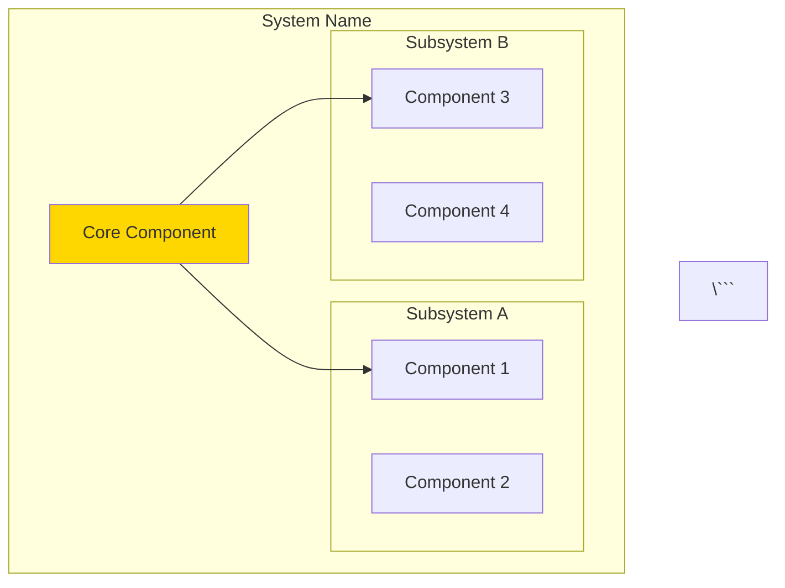

### Pattern: Data Flow

```markdown
## Data Flow

```mermaid
sequenceDiagram
    participant A
    participant B
    participant C
    
    A->>B: Request
    B->>C: Query
    C-->>B: Result
    B-->>A: Response
\```
```

### Pattern: State Machine

```markdown
## State Machine

```mermaid
stateDiagram-v2
    [*] --> StateA
    StateA --> StateB: Event
    StateB --> StateC: Event
    StateC --> [*]
\```
```

### Pattern: Specifications Table

```markdown
## Specifications

| Property | Value | Range | Notes |
|----------|-------|-------|-------|
| **Speed** | 100 | 50-200 | Units/sec |
| **Damage** | 25 | 10-50 | Per hit |
```

---

## Examples by System Type

### Core System Example

```markdown
# Event System Architecture

**System:** Event Bus & Messaging  
**Date:** 2025-10-27  
**Status:** Complete

---

## Overview

Central event bus for decoupled system communication.

---

## Event Flow

```mermaid
graph LR
    Publisher --> EventBus
    EventBus --> Subscriber1
    EventBus --> Subscriber2
    EventBus --> Subscriber3
\```

---

**End of Event System Architecture**
```

### Layer Example

```markdown
# Research Screen Architecture

**Layer:** Research & Technology  
**Date:** 2025-10-27  
**Status:** Complete

---

## Overview

Research management interface and tech tree visualization.

---

## Screen Layout

```mermaid
graph TD
    Screen --> TechTree
    Screen --> ProjectList
    Screen --> Details
\```

---

**End of Research Screen Architecture**
```

### System Example

```markdown
# Quest System Architecture

**System:** Quest & Mission Management  
**Date:** 2025-10-27  
**Status:** Complete

---

## Overview

Quest tracking, objectives, and rewards.

---

## Quest Flow

```mermaid
stateDiagram-v2
    [*] --> Available
    Available --> Active: Accept
    Active --> Complete: Finish
    Complete --> [*]
\```

---

**End of Quest System Architecture**
```

---

## Tips & Best Practices

### DO ✅

- **Keep diagrams simple** - One concept per diagram
- **Use colors consistently** - Same color = same meaning
- **Write short labels** - "Save Data" not "Save All Data To Disk"
- **Group related items** - Use subgraphs
- **Update regularly** - Don't let docs drift
- **Test rendering** - Always preview before commit
- **Link related docs** - Cross-reference liberally

### DON'T ❌

- **Don't make huge diagrams** - Split into multiple
- **Don't use random colors** - Follow the standard scheme
- **Don't write essays** - Diagrams + tables + short text
- **Don't duplicate** - Link to existing docs
- **Don't leave broken links** - Test all links
- **Don't forget tables** - Use them for detailed specs
- **Don't skip README update** - Always update navigation

---

## Quick Reference Card

```markdown
### Flowchart
graph TD
    A --> B

### State Diagram
stateDiagram-v2
    [*] --> State
    State --> [*]

### Sequence
sequenceDiagram
    A->>B: Message
    B-->>A: Reply

### ERD
erDiagram
    ENTITY {
        string id PK
    }

### Class
classDiagram
    class Name {
        +property
        +method()
    }

### Colors
style Node fill:#90EE90  (Green - Start)
style Node fill:#FFD700  (Gold - Process)
style Node fill:#87CEEB  (Blue - Success)
style Node fill:#FF6B6B  (Red - Error)
```

---

## Conclusion

The architecture documentation system is designed to be:

- **Visual-first** - Diagrams explain systems
- **Organized** - Clear folder structure
- **Maintainable** - Easy to update
- **Comprehensive** - Covers all systems
- **Professional** - Production-ready quality

Follow this guide to maintain consistency and quality across all architecture documentation.

---

**End of Architecture Documentation Guide**

