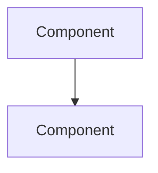
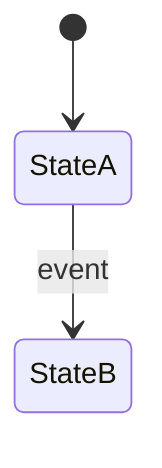
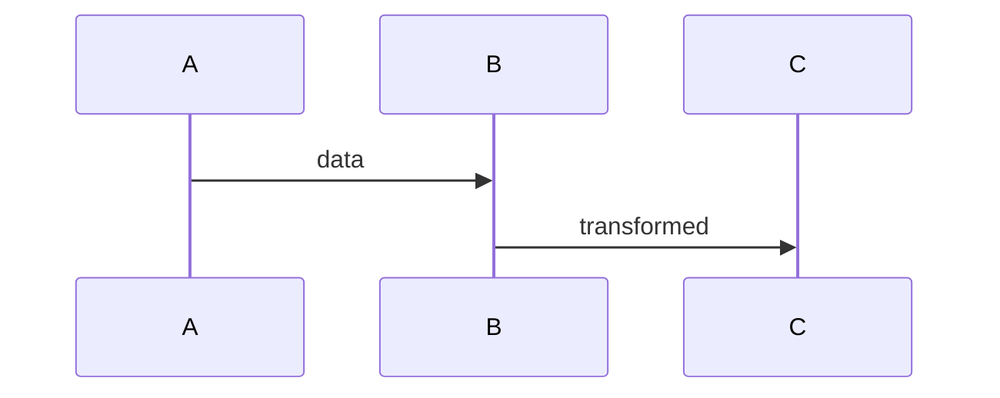
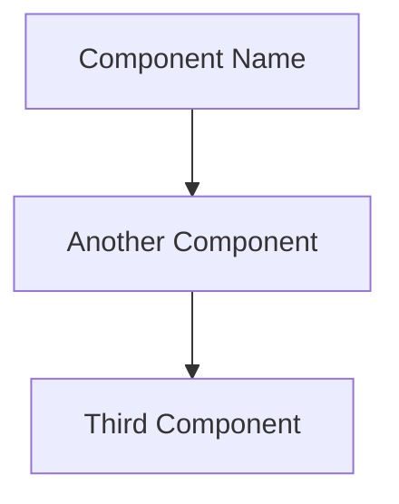
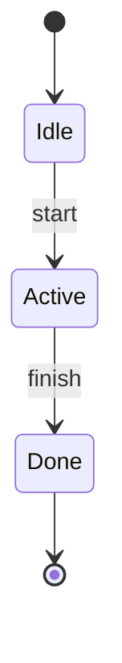
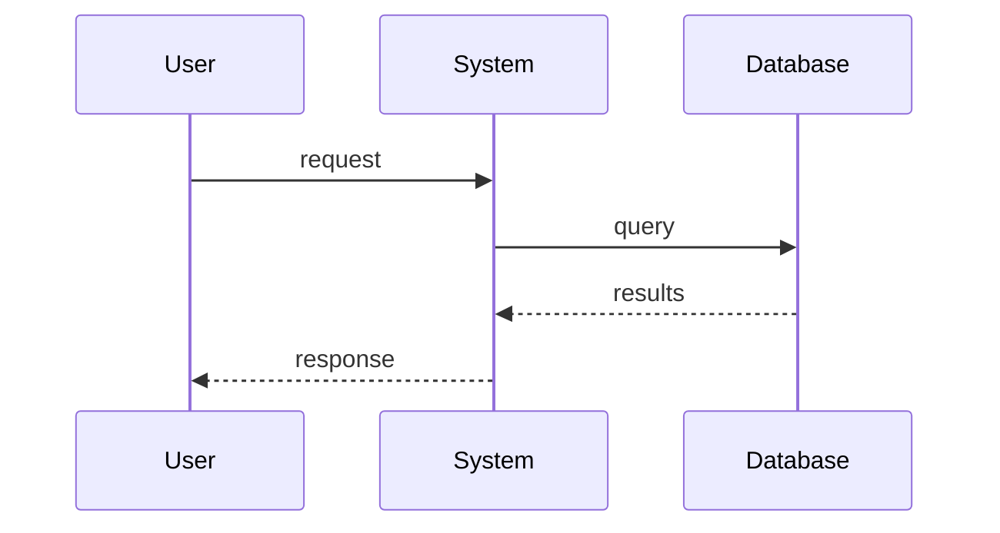

# Architecture Documentation

**Purpose:** Visual system documentation using Mermaid diagrams, state machines, and data flow charts  
**Audience:** Developers, system architects, AI agents, technical designers  
**Status:** Active development  
**Last Updated:** 2025-10-28  
**Coordinate System:** Universal Vertical Axial Hex (Flat-Top Hexagons)

---

## 📋 Table of Contents

- [Overview](#overview)
- [Folder Structure](#folder-structure)
- [Key Features](#key-features)
- [Content](#content)
- [Input/Output](#inputoutput)
- [Relations to Other Modules](#relations-to-other-modules)
- [Format Standards](#format-standards)
- [How to Use](#how-to-use)
- [How to Contribute](#how-to-contribute)
- [AI Agent Instructions](#ai-agent-instructions)
- [Good Practices](#good-practices)
- [Bad Practices](#bad-practices)
- [Universal Hex System](#universal-hex-coordinate-system)
- [Quick Reference](#quick-reference)

---

## Overview

The `architecture/` folder contains **visual system documentation** showing how components interact, data flows between systems, and state machines govern behavior. Uses Mermaid diagrams for maintainable, version-controlled visual documentation.

**Core Purpose:**
- Visualize system integration and data flow
- Document state machines and lifecycle
- Show component relationships
- Define architectural patterns
- Provide implementation roadmap

**🎯 CRITICAL:** All spatial systems (Battlescape, Geoscape, Basescape) use **vertical axial hex coordinates**. See [Universal Hex System](#universal-hex-coordinate-system) below.

---

## Folder Structure

```
architecture/
├── README.md                          ← This file
├── ARCHITECTURE_GUIDE.md             ← How to create/maintain diagrams
├── ROADMAP.md                         ← Development roadmap
├── ROADMAP_ARCHITECTURE.md           ← Architecture evolution plan
│
├── core/                              ← Core Engine Systems (2 files)
│   ├── STATE_MANAGEMENT.md           ← State machine, transitions, lifecycle
│   └── MOD_SYSTEM.md                 ← Mod loading, validation, overrides
│
├── layers/                            ← Game Layers (4 files) - ALL USE HEX GRID
│   ├── GEOSCAPE.md                   ← World map, missions, UFO tracking
│   ├── BASESCAPE.md                  ← Base management, facilities layout
│   ├── BATTLESCAPE.md                ← Tactical combat (2D hex-based)
│   └── INTERCEPTION.md               ← Air combat system
│
└── systems/                           ← Cross-Cutting Systems (9 files)
    ├── AI_SYSTEMS.md                 ← AI behavior, decision trees
    ├── ECONOMY.md                    ← Resources, trading, costs
    ├── RESEARCH.md                   ← Tech tree, research flow
    ├── GUI_WIDGETS.md                ← UI components, widget system
    ├── PROCEDURAL_GENERATION.md      ← Map/mission generation
    ├── SAVE_LOAD.md                  ← Save state, serialization
    ├── ANALYTICS.md                  ← Metrics, telemetry
    ├── DATA_MODELS.md                ← Core data structures
    └── MODDING_GUIDE.md              ← Mod architecture patterns
```

**Total:** 17 architecture documents (2 core + 4 layers + 9 systems + 2 guides)

---

## Key Features

- **Mermaid Diagrams:** All visuals in Mermaid markdown (version-controlled, diff-friendly)
- **State Machines:** Behavior defined as state transitions
- **Data Flow:** Shows how data moves between systems
- **Component Diagrams:** System structure and relationships
- **Integration Points:** Clear system boundaries and interfaces
- **Hex Coordinate System:** Universal {q, r} axial coordinates for all spatial systems
- **Sequence Diagrams:** Step-by-step interaction flows
- **Architecture Guide:** Complete guide for creating/maintaining diagrams

---

## Content

### Architecture Document Categories

| Category | Count | Purpose | Examples |
|----------|-------|---------|----------|
| **Core Systems** | 2 | Foundation systems | State Management, Mod System |
| **Game Layers** | 4 | Main game modes | Geoscape, Basescape, Battlescape, Interception |
| **Cross-Systems** | 9 | Shared functionality | AI, Economy, Research, GUI, Proc Gen |
| **Guides** | 2 | Documentation standards | Architecture Guide, Roadmaps |

### Each Architecture File Contains

1. **System Overview** - Purpose, scope, responsibilities
2. **Component Diagram** - Structure and relationships (Mermaid)
3. **State Machine** - Behavior and transitions (Mermaid)
4. **Data Flow** - How data moves through system (Mermaid)
5. **Integration Points** - Dependencies and interfaces
6. **Key Algorithms** - Critical implementation details
7. **Tables** - Detailed breakdowns (states, events, data structures)
8. **Cross-References** - Links to design, API, implementation

### Diagram Types Used

| Diagram Type | Purpose | Mermaid Syntax |
|--------------|---------|----------------|
| **Flowchart** | Process flows, algorithms | `graph TD` |
| **State Diagram** | State machines, lifecycle | `stateDiagram-v2` |
| **Sequence** | Interactions, call flow | `sequenceDiagram` |
| **Class** | Component structure | `classDiagram` |
| **ER Diagram** | Data relationships | `erDiagram` |

---

## Input/Output

### Inputs (What Architecture Consumes)

| Input | Source | Purpose |
|-------|--------|---------|
| Design specs | `design/mechanics/*.md` | System requirements |
| API contracts | `api/*.md` | Interface definitions |
| Engine structure | `engine/**/*.lua` | Implementation reality |
| Integration needs | Developer feedback | Cross-system connections |

### Outputs (What Architecture Produces)

| Output | Target | Purpose |
|--------|--------|---------|
| Visual diagrams | Developers | Implementation guide |
| State machines | `engine/**/*.lua` | Behavior patterns |
| Data flow | All systems | Integration understanding |
| Component structure | `engine/**/*.lua` | Code organization |
| Integration specs | Multiple systems | Connection contracts |

---

## Relations to Other Modules

### Upstream Dependencies (Architecture Reads From)

```
design/mechanics/*.md → architecture/**/*.md
    ↓
Design defines WHAT, architecture defines HOW

api/*.md → architecture/**/*.md
    ↓
API contracts define interfaces, architecture shows integration
```

### Downstream Dependencies (Architecture Writes To)

```
architecture/**/*.md → engine/**/*.lua
    ↓
Architecture guides implementation structure

architecture/**/*.md → tests2/**/*_test.lua
    ↓
Architecture reveals integration test needs
```

### Integration Map

| Module | Relationship | Details |
|--------|--------------|---------|
| **design/** | Input | Mechanics define system requirements |
| **api/** | Peer | APIs define contracts, architecture shows integration |
| **engine/** | Output | Architecture guides code structure |
| **tests2/** | Output | Architecture reveals test scenarios |
| **docs/** | Reference | Links to instruction guides |

---

## Format Standards

### Architecture Document Structure

```markdown
# [SYSTEM_NAME] Architecture

**Version:** X.Y.Z
**Status:** Draft/Stable
**Last Updated:** YYYY-MM-DD

## Overview
System purpose, scope, responsibilities

## Component Diagram


## State Machine


## Data Flow


## Integration Points
- System A: Interface description
- System B: Data exchange

## Key Algorithms
### Algorithm Name
Pseudocode or description

## Tables
### States
| State | Description | Transitions |
|-------|-------------|-------------|

## See Also
- [Design](../../design/mechanics/system.md)
- [API](../../api/SYSTEM.md)
- [Implementation](../../engine/layer/system.lua)
```

### Mermaid Standards

- Use consistent node naming: PascalCase for components
- Add descriptive labels to edges/transitions
- Use colors sparingly (semantic meaning only)
- Keep diagrams focused (split complex diagrams)
- Test diagrams render correctly in GitHub/IDEs
- Follow [ARCHITECTURE_GUIDE.md](ARCHITECTURE_GUIDE.md) for details

---

## How to Use

### For Developers (Engine Implementation)

1. **Understand system architecture:**
   ```bash
   # Find system architecture
   cat architecture/systems/AI_SYSTEMS.md
   ```

2. **Study component diagram:** See system structure
3. **Review state machine:** Understand behavior
4. **Follow data flow:** Know what data goes where
5. **Check integration points:** Identify dependencies
6. **Implement in engine:** Use architecture as blueprint
7. **Verify with tests:** Match architecture flows

**Example: Implementing AI System**
```bash
# 1. Read architecture
cat architecture/systems/AI_SYSTEMS.md

# 2. Study state machine - AI has Decision, Action, Evaluation states
# 3. Check integration - AI needs Unit, Map, Mission systems
# 4. Review data flow - Input: game state, Output: actions

# 5. Implement following architecture
# engine/ai/decision_manager.lua (matches component diagram)
# engine/ai/action_executor.lua
# engine/ai/evaluator.lua

# 6. Test state transitions
lovec "tests2/runners" run_subsystem ai
```

### For System Architects (Design Work)

1. **Start with design requirements:**
   ```bash
   cat design/mechanics/[system].md
   ```

2. **Create/update architecture:**
   - Add component diagram (system structure)
   - Define state machine (behavior)
   - Show data flow (integration)
   - Document integration points

3. **Review with team:** Get feedback on design
4. **Update based on implementation:** Keep docs in sync

### For AI Agents (Automated Tasks)

See [AI Agent Instructions](#ai-agent-instructions) section below.

---

## How to Contribute

### Creating New Architecture Document

1. **Check if needed:**
   - New game layer? → Add to `layers/`
   - New core system? → Add to `core/`
   - Cross-cutting system? → Add to `systems/`

2. **Follow template structure** (see Format Standards)

3. **Create diagrams:**
   ```markdown
   ## Component Diagram
   ```mermaid
   graph TD
       A[Component] --> B[Component]
   ```
   ```

4. **Add to README:** Update folder structure and content tables

5. **Cross-reference:**
   - Link from `design/mechanics/[system].md`
   - Link from `api/[SYSTEM].md`
   - Update `architecture/ROADMAP.md`

### Updating Existing Architecture

1. **Version properly:**
   - Breaking structure change: Increment major
   - New component: Increment minor
   - Diagram clarification: Increment patch

2. **Update diagrams:** Keep Mermaid diagrams current

3. **Sync with code:**
   - If engine changes, update architecture
   - If architecture changes, plan engine refactor

4. **Test diagrams:** Verify Mermaid renders correctly

### Creating Mermaid Diagrams

See **[ARCHITECTURE_GUIDE.md](ARCHITECTURE_GUIDE.md)** for complete guide including:
- Diagram types and when to use them
- Mermaid syntax reference
- Best practices
- Common patterns
- Testing/validation

---

## AI Agent Instructions

### When to Read Architecture

| Scenario | Action |
|----------|--------|
| Implementing new system | Read architecture + design + API |
| Understanding integration | Read both systems' architecture docs |
| Refactoring code | Check if architecture needs update |
| Fixing complex bug | Use data flow diagrams to trace issue |
| Optimizing system | Understand architecture before changing |

### How to Navigate

```
1. Start with this README for overview
2. Identify system category:
   - Core system? → core/
   - Game layer? → layers/
   - Cross-cutting? → systems/
3. Read specific architecture file
4. Study diagrams in order:
   - Component diagram (structure)
   - State machine (behavior)
   - Data flow (integration)
5. Cross-reference:
   - design/mechanics/[system].md (requirements)
   - api/[SYSTEM].md (contracts)
   - engine/[layer]/[system].lua (implementation)
```

### Architecture-First Workflow

```
User asks to implement complex feature
    ↓
1. Check design: cat design/mechanics/[system].md
    ↓
2. Check architecture: cat architecture/**/*[system]*.md
    ↓
3a. If architecture exists:
    - Follow component structure
    - Implement state machine
    - Match data flow
3b. If architecture missing:
    - Create architecture first
    - Review with design/API
    - Then implement
    ↓
4. Verify implementation matches architecture
    ↓
5. Update architecture if implementation reveals better design
```

### Reading Mermaid Diagrams

```markdown
# Component Diagram (graph TD = Top Down)

**Read as:** A sends/calls/depends on B, B sends to C

# State Diagram

**Read as:** Start in Idle, transition to Active on "start" event,
              transition to Done on "finish", then end

# Sequence Diagram

**Read as:** Flow of calls/data over time, top to bottom
```

### Common AI Tasks

| Task | Steps |
|------|-------|
| **Implement new system** | 1. Read architecture doc<br>2. Create components matching diagram<br>3. Implement state machine<br>4. Follow data flow<br>5. Test integration points |
| **Fix integration bug** | 1. Read both systems' architecture<br>2. Check data flow diagrams<br>3. Identify mismatch<br>4. Fix code<br>5. Update architecture if contract was unclear |
| **Refactor system** | 1. Document current architecture<br>2. Design new architecture<br>3. Create migration plan<br>4. Refactor incrementally<br>5. Update architecture docs |
| **Add new component** | 1. Update component diagram<br>2. Add to state machine if stateful<br>3. Update data flow<br>4. Document integration points<br>5. Implement code |

---

## Good Practices

### ✅ Diagrams

- Keep diagrams focused (one concept per diagram)
- Use consistent naming across documents
- Add descriptive labels to edges/transitions
- Test Mermaid renders in GitHub/IDEs
- Update diagrams when code changes
- Use colors meaningfully (not decoratively)

### ✅ Documentation

- Start with architecture before implementing
- Keep component diagrams at appropriate abstraction level
- Show integration points clearly
- Cross-reference design, API, and code
- Version architecture documents
- Update when implementation reveals better design

### ✅ State Machines

- Define all states explicitly
- Document all transitions and events
- Show initial and final states
- Handle error states
- Keep state machines simple (split if >10 states)

### ✅ Data Flow

- Show direction of data movement
- Label data types/formats
- Document transformations
- Identify validation points
- Show error paths

---

## Bad Practices

### ❌ Diagrams

- Don't create diagrams that are too complex (split them)
- Don't use colors without semantic meaning
- Don't skip labels on edges/transitions
- Don't create diagrams that can't render
- Don't let diagrams diverge from code

### ❌ Documentation

- Don't skip architecture for "simple" systems
- Don't document implementation details (focus on structure)
- Don't create architecture after code is written
- Don't forget to version architecture changes
- Don't skip cross-references

### ❌ State Machines

- Don't create unreachable states
- Don't forget error handling states
- Don't make state machines too complex
- Don't skip transition documentation
- Don't hardcode state in multiple places

### ❌ Data Flow

- Don't show implementation details
- Don't skip error flows
- Don't forget validation steps
- Don't omit data transformations
- Don't create circular dependencies

---

## Universal Hex Coordinate System

**🎯 CRITICAL:** All spatial systems use **vertical axial hex coordinates**

### System Specification

- **Format:** `{q, r}` (axial coordinates)
- **Hex Type:** Flat-top hexagons
- **Directions:** E, SE, SW, W, NW, NE (6 cardinal directions)
- **Core Implementation:** `engine/battlescape/battle_ecs/hex_math.lua`

### Usage Across Layers

| Layer | Usage | Details |
|-------|-------|---------|
| **Battlescape** | Tactical maps | Unit positions, movement, line of sight |
| **Geoscape** | World map | Province locations, UFO tracking, mission sites |
| **Basescape** | Facility layout | Building placement on hex grid |

### Key Functions

```lua
-- Distance calculation
HexMath.distance(q1, r1, q2, r2) --> integer

-- Get 6 adjacent hexes
HexMath.getNeighbors(q, r) --> table of {q, r}

-- Line of hexes between points
HexMath.hexLine(q1, r1, q2, r2) --> table of {q, r}

-- All hexes within radius
HexMath.hexesInRange(q, r, radius) --> table of {q, r}

-- Hex to pixel conversion (for rendering)
HexMath.hexToPixel(q, r, size) --> {x, y}

-- Pixel to hex conversion (for input)
HexMath.pixelToHex(x, y, size) --> {q, r}
```

### References

- **Design:** `design/mechanics/hex_vertical_axial_system.md` - Complete specification
- **API:** `api/BATTLESCAPE.md`, `api/GEOSCAPE.md` - Hex coordinate APIs
- **Architecture:** `architecture/layers/BATTLESCAPE.md` - Hex system architecture
- **Implementation:** `engine/battlescape/battle_ecs/hex_math.lua` - Core functions

---

## Quick Reference

### Essential Files

| File | Purpose | When to Use |
|------|---------|-------------|
| `ARCHITECTURE_GUIDE.md` | Diagram creation guide | Creating/updating architecture |
| `ROADMAP.md` | Development roadmap | Planning features |
| `ROADMAP_ARCHITECTURE.md` | Architecture evolution | Planning refactors |

### Most Common Architecture Docs

| System | File | Use Case |
|--------|------|----------|
| State Management | `core/STATE_MANAGEMENT.md` | Game state, transitions |
| Battlescape | `layers/BATTLESCAPE.md` | Tactical combat |
| Geoscape | `layers/GEOSCAPE.md` | World map, missions |
| Basescape | `layers/BASESCAPE.md` | Base management |
| AI Systems | `systems/AI_SYSTEMS.md` | AI behavior |
| Economy | `systems/ECONOMY.md` | Resources, trading |
| Research | `systems/RESEARCH.md` | Tech tree |

### Quick Commands

```bash
# Find architecture for system
ls architecture/**/*.md | grep -i [system_name]

# View Mermaid diagram
cat architecture/[category]/[SYSTEM].md

# Check architecture coverage
ls architecture/**/*.md | wc -l

# Find hex coordinate usage
grep -r "HexMath" architecture/
```

### Related Documentation

- **Design:** [design/README.md](../design/README.md) - Requirements for architecture
- **API:** [api/README.md](../api/README.md) - Interfaces between systems
- **Engine:** Implementation of architecture
- **Tests:** [tests2/README.md](../tests2/README.md) - Verification of architecture
- **Docs:** [docs/instructions/🏗️ System Architecture.instructions.md](../docs/instructions/🏗️%20System%20Architecture.instructions.md) - Architecture best practices

---

**Last Updated:** 2025-10-28  
**Maintainers:** Development Team  
**Questions:** See [ARCHITECTURE_GUIDE.md](ARCHITECTURE_GUIDE.md) or ask in project Discord
│   ├── GEOSCAPE.md                   # Strategic world (90×45 hex map)
│   ├── BATTLESCAPE.md                # Tactical combat (hex-based)
│   ├── BASESCAPE.md                  # Base management (hex layout)
│   └── INTERCEPTION.md               # Air combat
│
├── systems/                           # Specialized Systems
│   ├── AI_SYSTEMS.md                 # AI behavior, pathfinding (hex-based)
│   ├── ECONOMY.md                    # Finance, marketplace, resources
│   └── RESEARCH.md                   # Tech tree, research progression
│
└── legacy/                            # Legacy Files (Reference Only)
```

---

## 🎯 Quick Navigation

### By System Type

#### Core Engine
- **[State Management](core/STATE_MANAGEMENT.md)** - State machine, scene transitions, global data
- **[Mod System](core/MOD_SYSTEM.md)** - Content loading, TOML parsing, mod validation

#### Game Layers (Hex-Based)
- **[Geoscape](layers/GEOSCAPE.md)** - World map (90×45 hex grid), missions, nations
- **[Battlescape](layers/BATTLESCAPE.md)** - Turn-based combat (hex grid), AI, map generation
- **[Basescape](layers/BASESCAPE.md)** - Facility management (hex placement), research, manufacturing
- **[Interception](layers/INTERCEPTION.md)** - Air combat, UFO interception, craft systems

#### Specialized Systems
- **[AI Systems](systems/AI_SYSTEMS.md)** - Behavior trees, targeting (hex-based), difficulty scaling
- **[Economy](systems/ECONOMY.md)** - Finance, marketplace, salvage, budgets
- **[Research](systems/RESEARCH.md)** - Tech tree, unlocks, progression
- **[Analytics](systems/ANALYTICS.md)** - Metrics, performance tracking, balance analysis
- **[GUI & Widgets](systems/GUI_WIDGETS.md)** - UI framework, widget system, layouts
- **[Procedural Generation](systems/PROCEDURAL_GENERATION.md)** - Map generation (hex blocks), mapscripts
- **[Save & Load](systems/SAVE_LOAD.md)** - Game persistence, auto-save, validation
- **[Data Models](systems/DATA_MODELS.md)** - Entity relationships, data structures
- **[Modding Guide](systems/MODDING_GUIDE.md)** - Mod creation, API, workshop integration

---

## 📊 Documentation Features

### Visual Diagrams
- ✅ **Mermaid Flowcharts** - Process flows and pipelines (updated for hex system)
- ✅ **State Diagrams** - State machines and transitions
- ✅ **Sequence Diagrams** - System interactions and timing
- ✅ **Entity Relationships** - Data models and structures
- ✅ **Class Diagrams** - Object hierarchies

### Detailed Tables
- ✅ **Configuration Tables** - Settings, costs, modifiers
- ✅ **Performance Metrics** - Optimization targets
- ✅ **Feature Matrices** - System capabilities
- ✅ **Comparison Tables** - Difficulty levels, phases

---

## 🔗 Related Documentation

### API Documentation
See `/api/` folder for system contracts:
- `api/GAME_API.toml` - Master schema
- `api/GEOSCAPE.md` - Geoscape API
- `api/BATTLESCAPE.md` - Battlescape API
- `api/BASESCAPE.md` - Basescape API

### Engine Implementation
See `/engine/` folder for code:
- `engine/core/` - Core systems
- `engine/geoscape/` - Geoscape layer
- `engine/battlescape/` - Battlescape layer
- `engine/basescape/` - Basescape layer

### Design Documentation
See `/design/` folder for mechanics:
- `design/mechanics/` - Game mechanics
- `design/gaps/` - Missing features

---

## 📈 Architecture Statistics

| Category | Files | Diagrams | Tables | Status |
|----------|-------|----------|--------|--------|
| **Core Systems** | 2 | 15+ | 10+ | ✅ Complete |
| **Game Layers** | 4 | 60+ | 30+ | ✅ Complete |
| **Specialized Systems** | 9 | 120+ | 80+ | ✅ Complete |
| **Legacy Reference** | 8 | 100+ | 50+ | 📚 Archived |
| **Total** | **23** | **295+** | **170+** | **✅ Complete** |

---

**Last Updated:** 2025-10-27  
**Version:** 2.0 (Restructured)  
**Status:** ✅ Complete


- **System Architecture**: How major systems (Geoscape, Battlescape, Basescape) are structured
- **Integration Patterns**: How systems communicate and share data
- **Data Flow Diagrams**: Visual representation of information flow between systems
- **State Management**: Game state transitions and lifecycle
- **Performance Considerations**: Design decisions for optimization
- **Scalability**: Support for large maps, many units, complex AI
- **Extensibility**: Architecture supports modding and custom content

## Integrations with Other Systems

### Engine Implementation
- `engine/` structure mirrors architecture organization
- Core systems (state_manager, assets, data_loader) implement architectural patterns
- Each module in `engine/` follows layered architecture

### Design Specifications
- Design documents in `design/mechanics/` detail individual systems
- Architecture provides overall structure for those systems
- Gaps documented in `design/gaps/`

### API Documentation
- API files in `api/` define contracts for architectural layers
- Configuration formats support architectural patterns
- Integration points listed in `api/INTEGRATION.md`

### Testing & Validation
- Integration tests in `tests/integration/` validate architecture
- System tests verify component interactions
- Performance tests ensure architectural efficiency

### Roadmap Planning
- Technical roadmap guides development priorities
- Identifies areas needing architectural changes
- Tracks long-term technical debt and refactoring

## Key Architectural Patterns

### Layered Architecture
- **Presentation Layer**: GUI, rendering, input
- **Game Logic Layer**: State management, game rules
- **System Layer**: Core systems (AI, pathfinding, economy)
- **Data Layer**: Assets, configurations, persistence

### State Machine
- Game manages state transitions (menu → geoscape → battlescape, etc.)
- Each state has update/draw lifecycle
- Smooth transitions between game modes

### ECS (Entity Component System)
- Battlescape uses ECS for efficient combat simulation
- Entities have components for behavior, rendering, collision
- Systems process components for game logic

### Event-Driven
- Systems communicate via events where appropriate
- Decouples systems and enables mod integration
- Enables async operations and animations

## See Also

- [Roadmap](./ROADMAP.md) - Current development roadmap
- [Integration Flows](./INTEGRATION_FLOW_DIAGRAMS.md) - System interaction diagrams
- [API Documentation](../api/README.md) - System contracts and interfaces
- [Design Mechanics](../design/mechanics/) - Detailed system design
- [Engine Implementation](../engine/README.md) - Code implementation
