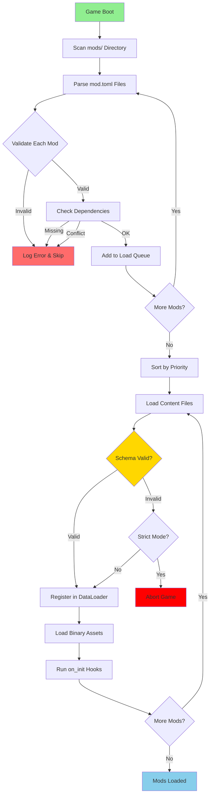
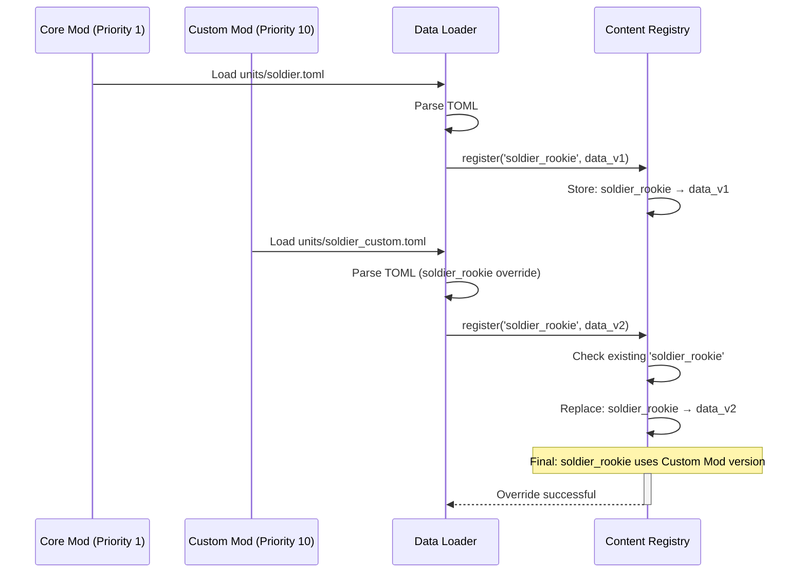
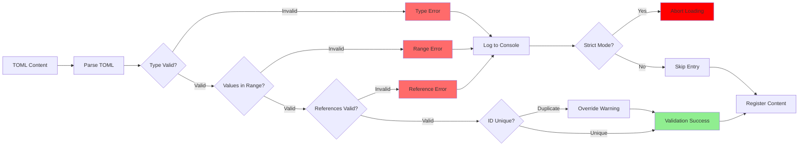
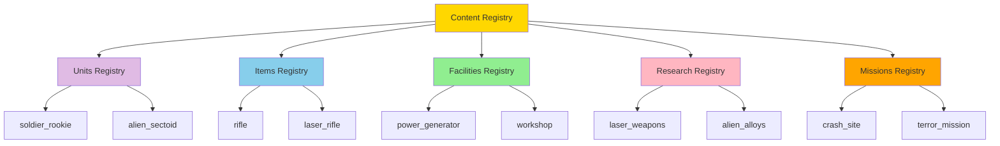
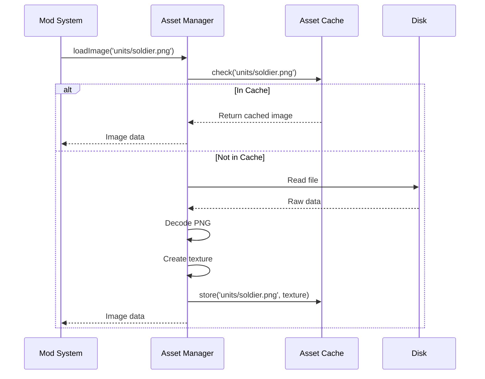

# Mod System Architecture

**System:** Mod Loading and Content Management  
**Date:** 2025-10-27  
**Status:** Complete

---

## Overview

The mod system provides content loading, validation, and override mechanisms for all game data.

---

## Mod Loading Pipeline



---

## Mod Manifest Structure

```mermaid
graph TD
    ModToml[mod.toml] --> Metadata[Metadata Section]
    ModToml --> Dependencies[Dependencies]
    ModToml --> Content[Content Paths]
    ModToml --> Assets[Asset Paths]
    ModToml --> Hooks[Hook Scripts]
    
    Metadata --> ID[id = 'my_mod']
    Metadata --> Version[version = '1.0.0']
    Metadata --> Name[name = 'My Mod']
    Metadata --> Author[author = 'Developer']
    Metadata --> Priority[load_order = 10]
    
    Dependencies --> Required[required = ['core']]
    Dependencies --> Optional[optional = ['dlc_1']]
    Dependencies --> Conflicts[conflicts = ['old_mod']]
    
    Content --> Units[units = 'rules/units/']
    Content --> Items[items = 'rules/items/']
    Content --> Missions[missions = 'rules/missions/']
    
    Assets --> Images[images = 'assets/images/']
    Assets --> Audio[sounds = 'assets/sounds/']
    
    Hooks --> OnInit[on_init = 'scripts/init.lua']
    Hooks --> OnLoad[on_load = 'scripts/load.lua']
    
    style ModToml fill:#FFD700
```

---

## Content Override System



---

## Mod Directory Structure (v2)

```
mods/
├── core/                           # Core game content (Priority 1)
│   ├── mod.toml                   # Manifest
│   ├── rules/                     # TOML content
│   │   ├── units/
│   │   │   ├── soldiers.toml
│   │   │   ├── aliens.toml
│   │   │   └── civilians.toml
│   │   ├── items/
│   │   │   ├── weapons.toml
│   │   │   ├── armor.toml
│   │   │   └── equipment.toml
│   │   ├── facilities/
│   │   │   └── base_facilities.toml
│   │   ├── research/
│   │   │   └── tech_tree.toml
│   │   ├── missions/
│   │   │   └── mission_types.toml
│   │   └── geoscape/
│   │       ├── regions.toml
│   │       └── countries.toml
│   ├── assets/                    # Binary assets
│   │   ├── images/
│   │   └── sounds/
│   ├── mapblocks/                 # Map pieces
│   └── tilesets/                  # Terrain graphics
│
└── custom_mod/                    # User mod (Priority 10+)
    ├── mod.toml
    ├── rules/
    │   └── units/
    │       └── custom_soldiers.toml
    └── assets/
        └── images/
```

---

## Content Validation Flow



---

## Mod Load Order

| Priority | Mod Type | Purpose | Example |
|----------|----------|---------|---------|
| **1** | Core | Base game content | `mods/core/` |
| **10** | Balance | Stat adjustments | `mods/balance_patch/` |
| **20** | Content | New units/items | `mods/new_weapons/` |
| **30** | Overhaul | Major changes | `mods/total_conversion/` |
| **50** | Cosmetic | Graphics/sounds | `mods/hd_textures/` |
| **100** | Debug | Dev tools | `mods/debug_mode/` |

---

## Content Registry



---

## Asset Loading



---

## Mod Configuration Example

```toml
# mod.toml
[metadata]
id = "custom_soldiers"
name = "Custom Soldier Pack"
version = "1.0.0"
author = "ModAuthor"
description = "Adds new soldier classes"
format_version = 2
engine_version = "1.0.0"

[load_order]
priority = 20

[dependencies]
required = ["core"]
optional = ["balance_mod"]
conflicts = ["old_soldiers"]

[content]
units = "rules/units/"
items = "rules/items/"

[assets]
images = "assets/images/"
sounds = "assets/sounds/"

[hooks]
on_init = "scripts/init.lua"
```

---

## Error Handling

| Error Type | Severity | Action | Example |
|------------|----------|--------|---------|
| **Parse Error** | Critical | Skip mod | Invalid TOML syntax |
| **Type Error** | Critical | Skip entry | String where int expected |
| **Range Error** | Warning | Use default | HP = -10 |
| **Reference Error** | Warning | Skip entry | Unknown weapon_id |
| **Duplicate ID** | Info | Override | soldier_rookie redefined |
| **Missing Dependency** | Critical | Skip mod | Required mod not found |

---

**End of Mod System Architecture**

