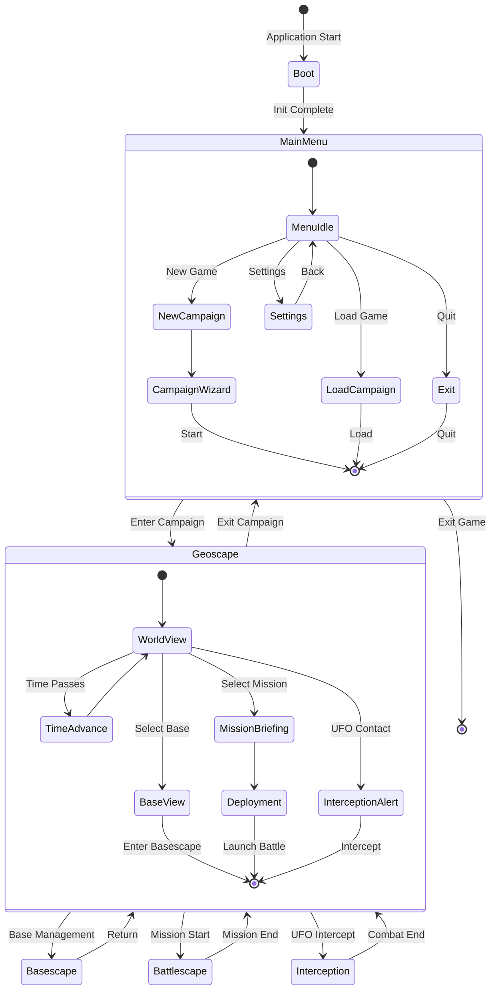
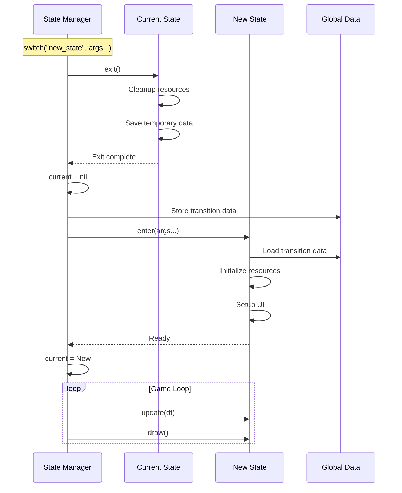
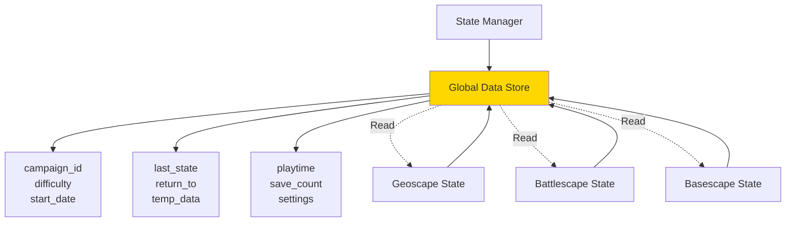
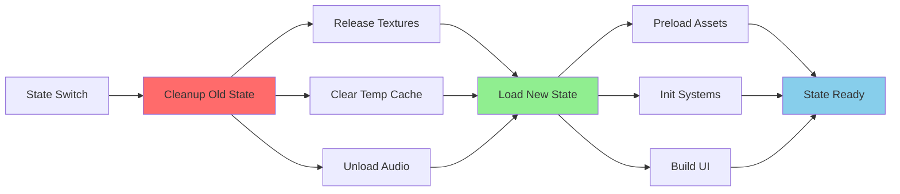

# State Management Architecture

**System:** Core State Management  
**Date:** 2025-10-27  
**Status:** Complete

---

## Overview

The state management system controls scene transitions, lifecycle management, and global data sharing across all game screens.

---

## State Machine Architecture



---

## State Lifecycle



---

## State Registry

| State Name | File | Purpose | Typical Duration |
|------------|------|---------|------------------|
| `menu` | `main_menu.lua` | Main menu navigation | Until game start |
| `geoscape` | `geoscape_screen.lua` | Strategic world view | Campaign duration |
| `battlescape` | `battlescape_screen.lua` | Tactical combat | 10-30 minutes |
| `basescape` | `basescape_screen.lua` | Base management | 2-5 minutes |
| `interception` | `interception_screen.lua` | Air combat | 1-3 minutes |
| `deployment` | `deployment_screen.lua` | Unit deployment | 30-60 seconds |
| `mission_briefing` | `mission_briefing_screen.lua` | Mission info | 10-20 seconds |
| `load_game` | `load_game_screen.lua` | Save slot selection | Until load |
| `campaign_stats` | `campaign_stats_screen.lua` | Statistics view | Until close |
| `settings` | `settings_screen.lua` | Game settings | Until close |

---

## Global Data Store



---

## State Interface Contract

```lua
-- Required callbacks for any game state
State = {
    -- Called when entering state
    enter = function(self, ...) end,
    
    -- Called when leaving state
    exit = function(self) end,
    
    -- Called every frame
    update = function(self, dt) end,
    
    -- Called every frame for rendering
    draw = function(self) end,
    
    -- Input callbacks (optional)
    keypressed = function(self, key, scancode, isrepeat) end,
    mousepressed = function(self, x, y, button) end,
    mousereleased = function(self, x, y, button) end,
    mousemoved = function(self, x, y, dx, dy) end,
    wheelmoved = function(self, x, y) end,
    
    -- Window callbacks (optional)
    resize = function(self, w, h) end
}
```

---

## State Transitions Table

| From | To | Trigger | Data Passed |
|------|----|---------| ------------|
| Menu | Geoscape | New/Load Game | campaign_data |
| Geoscape | Battlescape | Mission Start | mission_data, squad |
| Battlescape | Geoscape | Mission End | results, loot, casualties |
| Geoscape | Basescape | Select Base | base_id |
| Basescape | Geoscape | Return | base_updates |
| Geoscape | Interception | UFO Contact | ufo_data, craft_data |
| Interception | Geoscape | Combat End | result, damages |
| Any | Menu | Exit Campaign | save_prompt |

---

## Performance Considerations



### Memory Management

| State | Typical Memory | Peak Memory | Assets Loaded |
|-------|---------------|-------------|---------------|
| Menu | 50 MB | 80 MB | UI, logo, music |
| Geoscape | 120 MB | 200 MB | World map, UI, nations |
| Battlescape | 250 MB | 400 MB | Map, units, effects |
| Basescape | 100 MB | 150 MB | Base grid, facilities, UI |
| Interception | 80 MB | 120 MB | Sky, crafts, UI |

---

**End of State Management Architecture**

