# Basescape Architecture - Vertical Axial Hex Grid

**Layer:** Base Management Layer  
**Date:** 2025-10-28  
**Status:** Complete  
**Coordinate System:** Vertical Axial (Flat-Top Hexagons)

---

## Overview

The Basescape layer provides facility management, research, manufacturing, and personnel systems for base operations. **Base layout uses vertical axial hex grid for facility placement.**

### Base Grid Coordinate System

**Base facilities are placed on hex grid:**
- **Grid Size:** Configurable (typical: 20×20 hexes)
- **Position Format:** `{q, r}` (axial coordinates)
- **Facility Size:** 1-7 hexes (single hex or hex ring pattern)
- **Adjacent Check:** `HexMath.getNeighbors(q, r)` for connections
- **Distance:** `HexMath.distance(q1, r1, q2, r2)` for facility range

**Design Reference:** `design/mechanics/hex_vertical_axial_system.md`  
**Core Module:** `engine/battlescape/battle_ecs/hex_math.lua` (shared across all layers)

**Facility Patterns:**
- **1-hex:** Single building (generator, storage)
- **7-hex:** Ring pattern (large facility, hangar)
- **Custom:** Multi-hex irregular shapes

---

## Base Management Overview

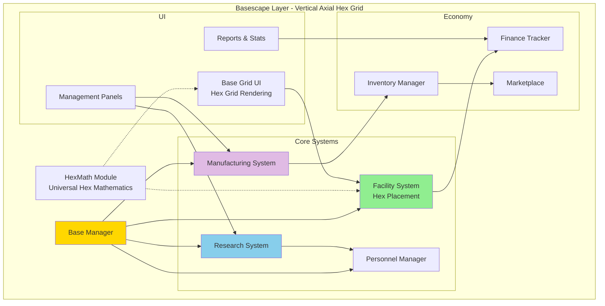

---

## Facility Construction

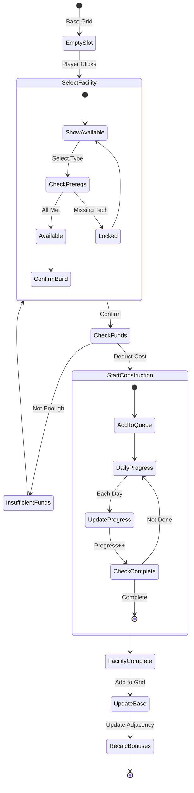

---

## Base Grid System

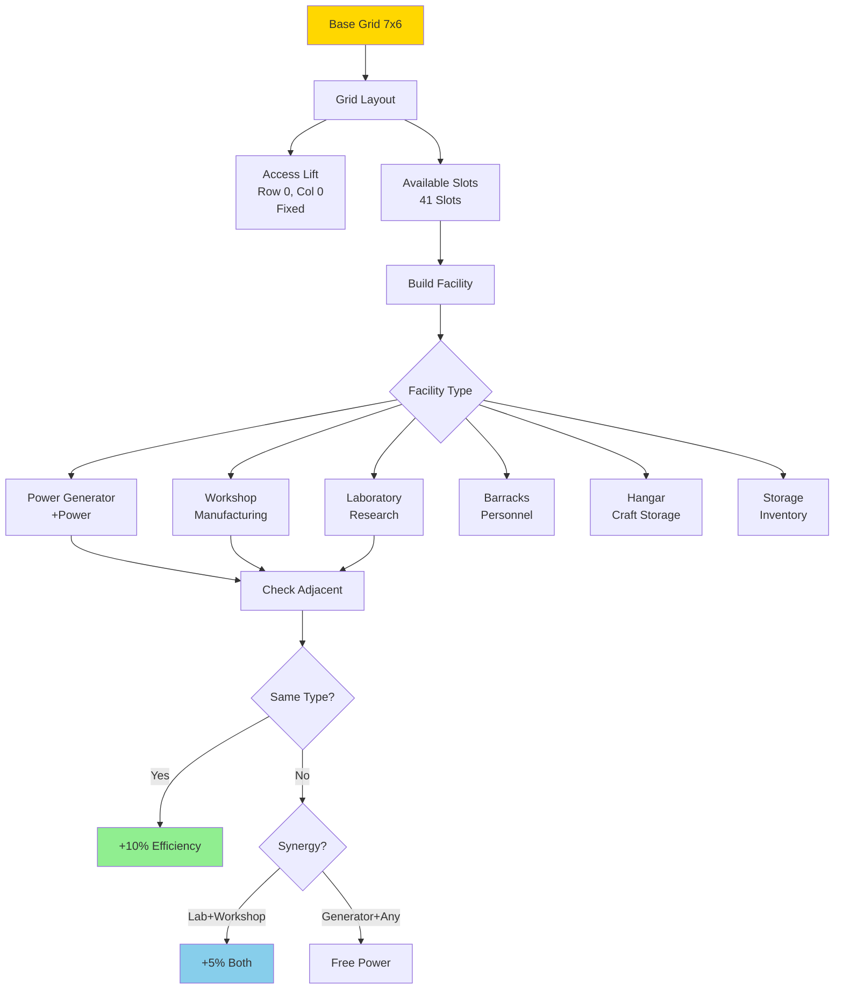

### Facility Types Table

| Facility | Cost | Build Time | Power | Effect |
|----------|------|------------|-------|--------|
| **Power Generator** | $400k | 15 days | +20 | Provides power |
| **Workshop** | $800k | 20 days | -5 | Manufacturing capacity |
| **Laboratory** | $750k | 20 days | -5 | Research capacity |
| **Barracks** | $200k | 10 days | -2 | Houses 25 personnel |
| **Hangar** | $300k | 15 days | -3 | Stores 1 craft |
| **Storage** | $150k | 10 days | -1 | +50 storage capacity |
| **Hospital** | $500k | 18 days | -4 | Heals wounded soldiers |
| **Alien Containment** | $400k | 18 days | -3 | Stores live aliens |

---

## Research System

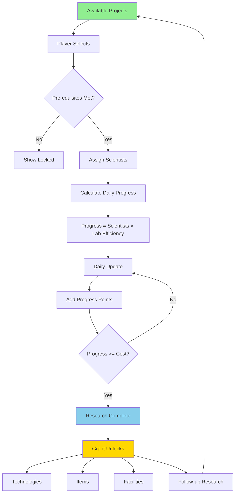

### Tech Tree Example

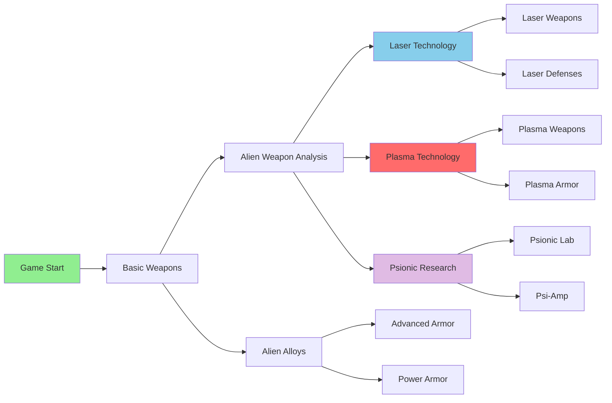

---

## Manufacturing System

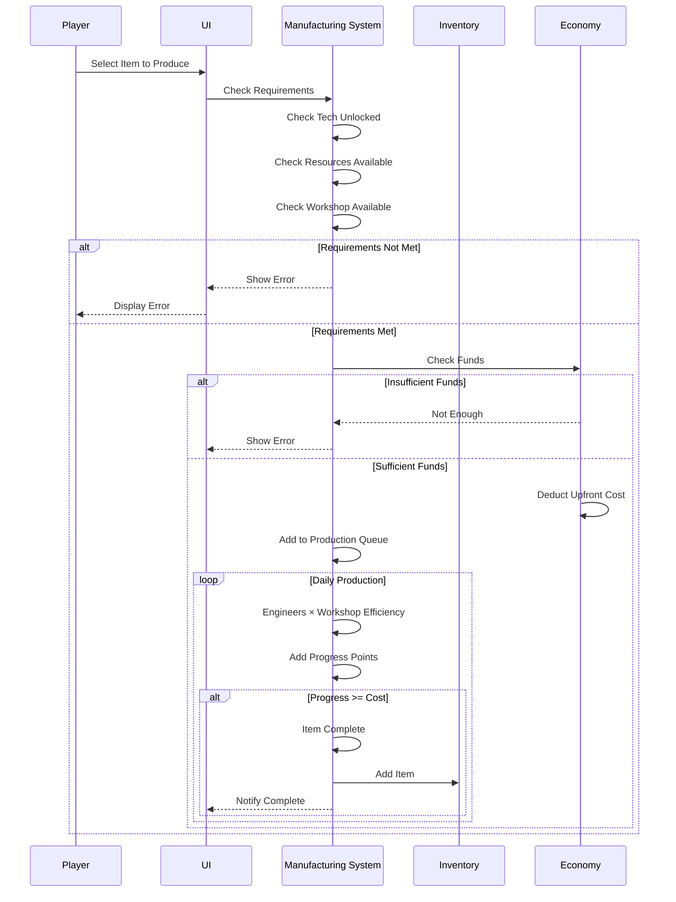

---

## Personnel Management

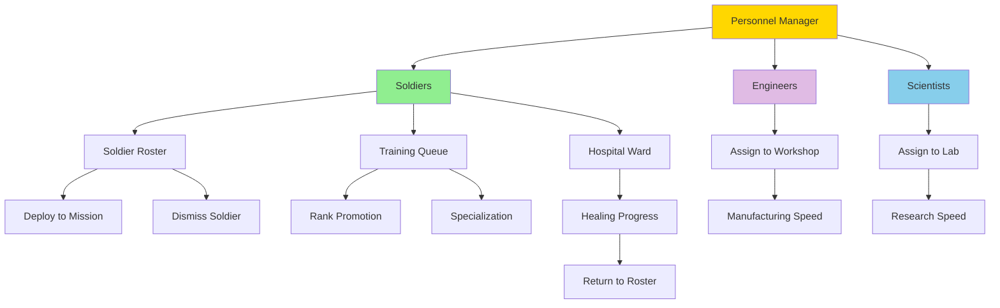

### Personnel Costs

| Type | Monthly Salary | Capacity | Hiring Cost |
|------|---------------|----------|-------------|
| **Soldier (Rookie)** | $40k | Barracks | $20k |
| **Soldier (Veteran)** | $60k | Barracks | $50k |
| **Engineer** | $50k | Workshop | $30k |
| **Scientist** | $60k | Laboratory | $40k |
| **Pilot** | $50k | Hangar | $35k |

---

## Inventory System

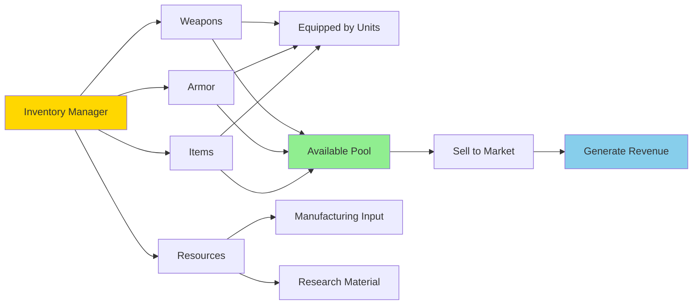

---

## Marketplace

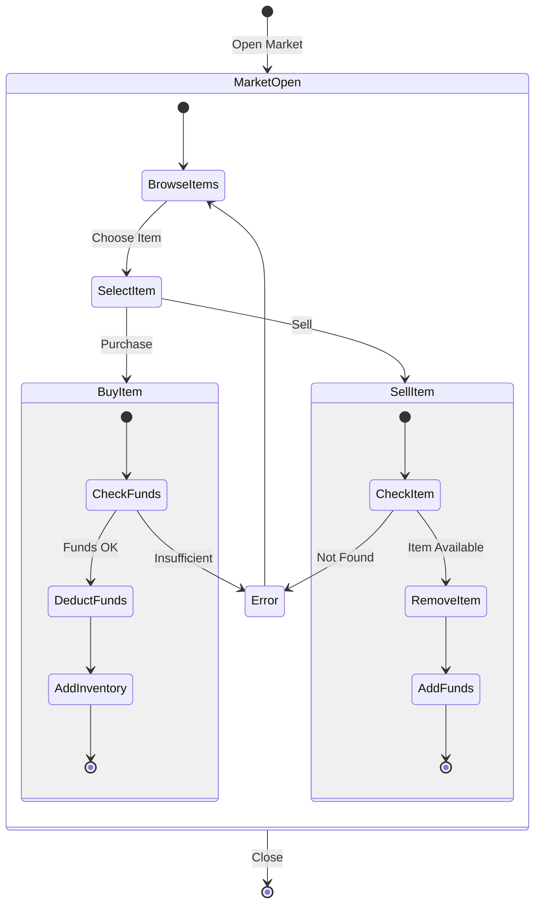

---

## Monthly Base Report

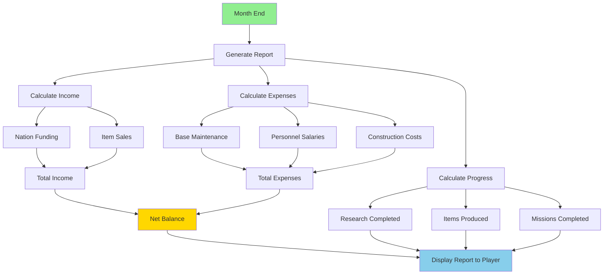

---

## Base Defense

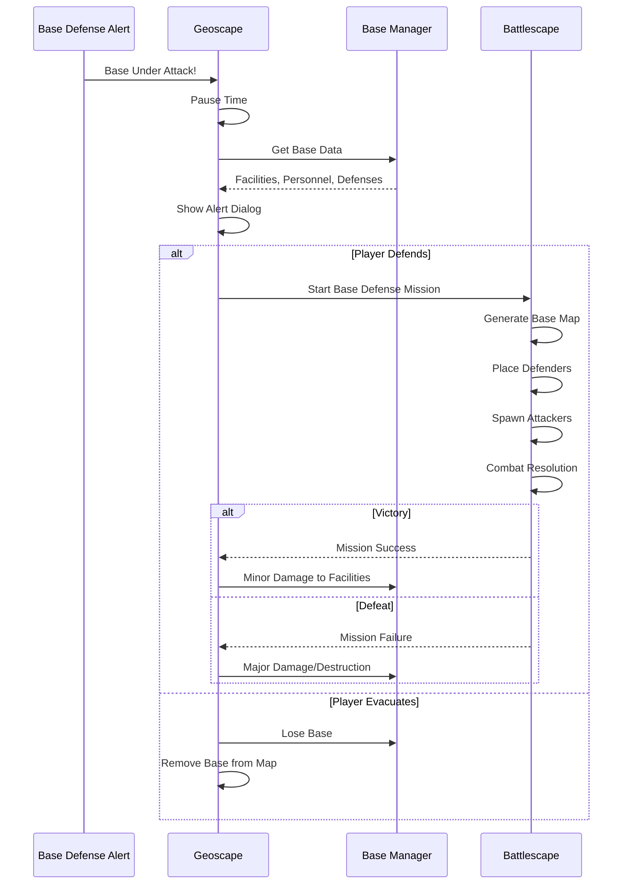

---

## Performance Considerations

| System | Optimization | Impact |
|--------|-------------|--------|
| **Grid Rendering** | Dirty flag updates | Only redraw on change |
| **Research/Mfg** | Daily batch updates | Efficient time advancement |
| **Inventory** | Hash map lookups | O(1) item access |
| **Facility Adjacency** | Cache bonus values | Fast recalculation |
| **UI Panels** | Lazy loading | Faster screen transitions |

---

**End of Basescape Architecture**

