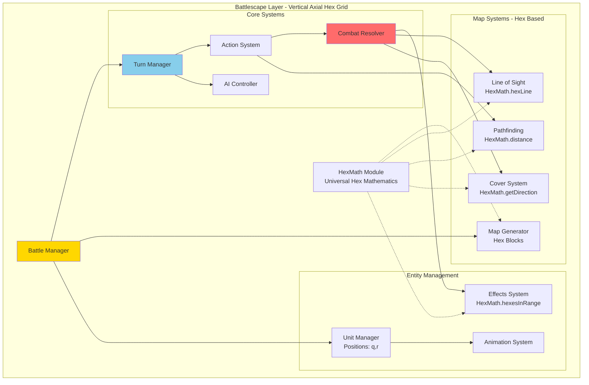
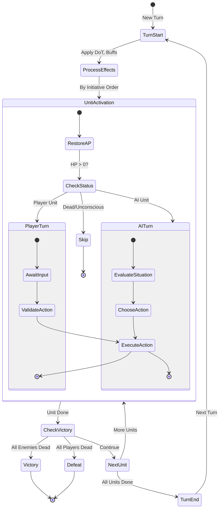
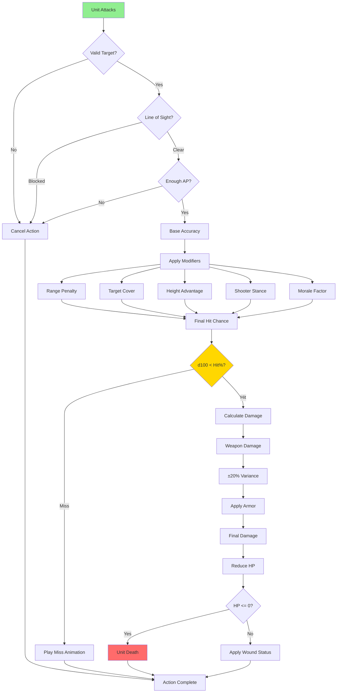
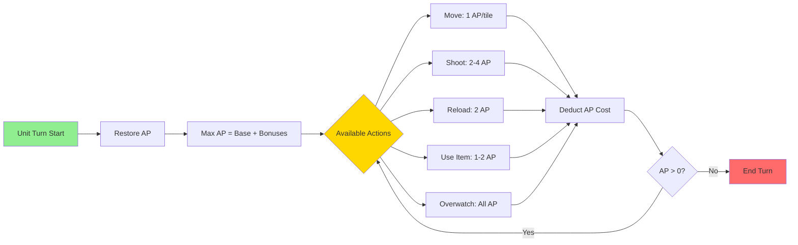
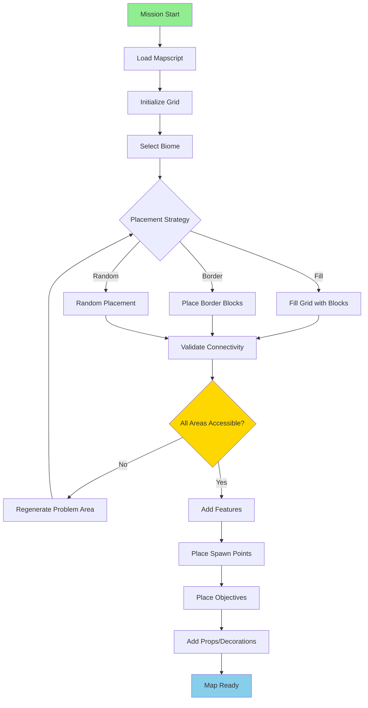
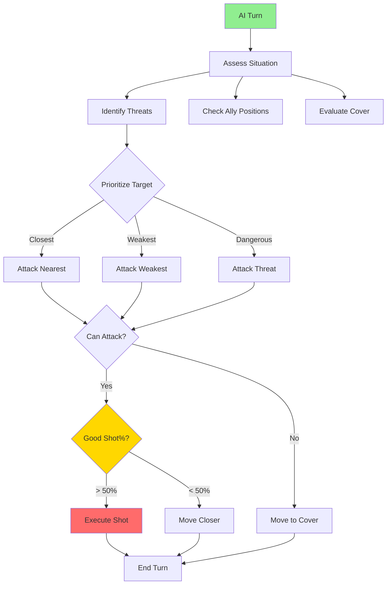
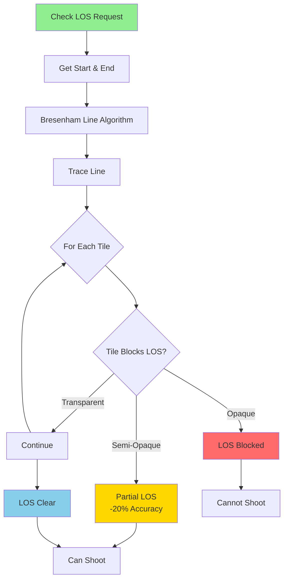
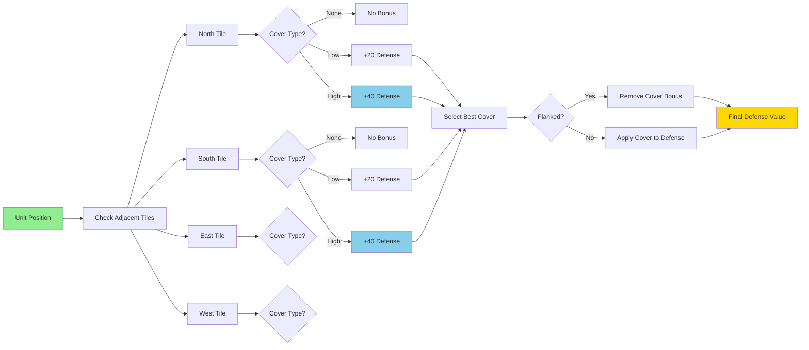
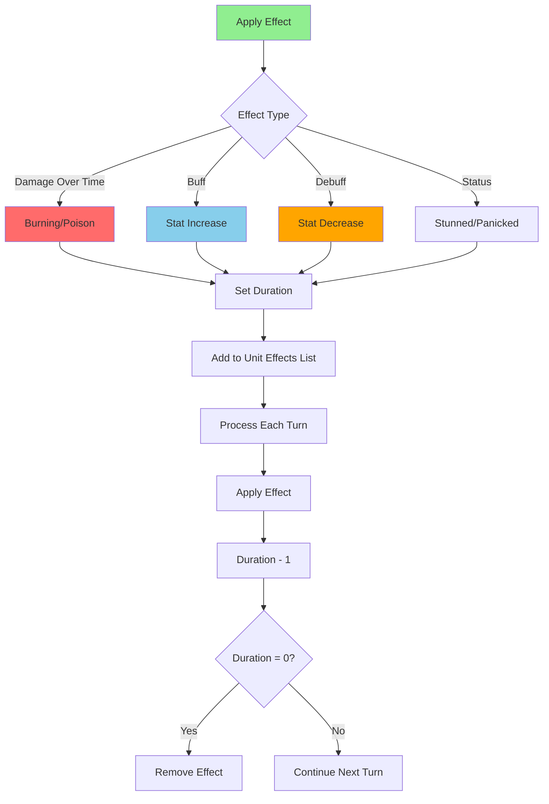

# Battlescape Architecture - Vertical Axial Hex Grid

**Layer:** Tactical Combat Layer  
**Date:** 2025-10-28  
**Status:** Complete  
**Coordinate System:** Vertical Axial (Flat-Top Hexagons)

---

## Overview

The Battlescape provides turn-based tactical combat where squads engage enemies on procedurally generated hex-based maps using a **universal vertical axial coordinate system**.

### Coordinate System

**All Battlescape systems use vertical axial hex coordinates:**
- **Position Format:** `{q, r}` (axial coordinates)
- **Direction System:** E, SE, SW, W, NW, NE (6 directions)
- **Distance:** Hex distance via `HexMath.distance(q1, r1, q2, r2)`
- **Neighbors:** Always 6 adjacent hexes via `HexMath.getNeighbors(q, r)`

**Design Reference:** `design/mechanics/hex_vertical_axial_system.md`  
**Core Module:** `engine/battlescape/battle_ecs/hex_math.lua`

---

## Combat System Overview

---

## Turn Structure

---

## Combat Resolution

---

## Action Point System

### AP Cost Table

| Action | Base Cost | Modifiers | Example |
|--------|-----------|-----------|---------|
| **Move** | 1 AP/tile | Terrain cost ×1-3 | Walking: 1 AP, Water: 2 AP |
| **Shoot** | 2-4 AP | Weapon type | Pistol: 2 AP, Sniper: 4 AP |
| **Reload** | 2 AP | Quick hands: -1 AP | Normal: 2 AP, Perk: 1 AP |
| **Grenade** | 2 AP | None | Always 2 AP |
| **Medikit** | 2 AP | None | Always 2 AP |
| **Overwatch** | All AP | None | Reaction fire mode |
| **Hunker Down** | 1 AP | None | +20 Defense |

---

## Map Generation

---

## AI Behavior

### AI Difficulty Modifiers

| Difficulty | Aim Bonus | HP Bonus | AP Bonus | Behavior |
|------------|-----------|----------|----------|----------|
| **Rookie** | -20% | +0% | +0 | Defensive, poor tactics |
| **Veteran** | +0% | +0% | +0 | Balanced, uses cover |
| **Commander** | +10% | +20% | +1 | Aggressive, flanking |
| **Legend** | +20% | +50% | +2 | Optimal, coordinated |

---

## Line of Sight

---

## Cover System

---

## Effect System

---

## Performance Optimization

| System | Optimization | Impact |
|--------|-------------|--------|
| **Pathfinding** | A* with caching | Fast unit movement |
| **LOS Calculation** | Shadow casting, caching | Real-time visibility |
| **Animation** | Sprite batching | Smooth 60 FPS |
| **AI Processing** | Incremental decisions | No frame drops |
| **Map Rendering** | Tile culling | Only visible tiles |

---

**End of Battlescape Architecture**

