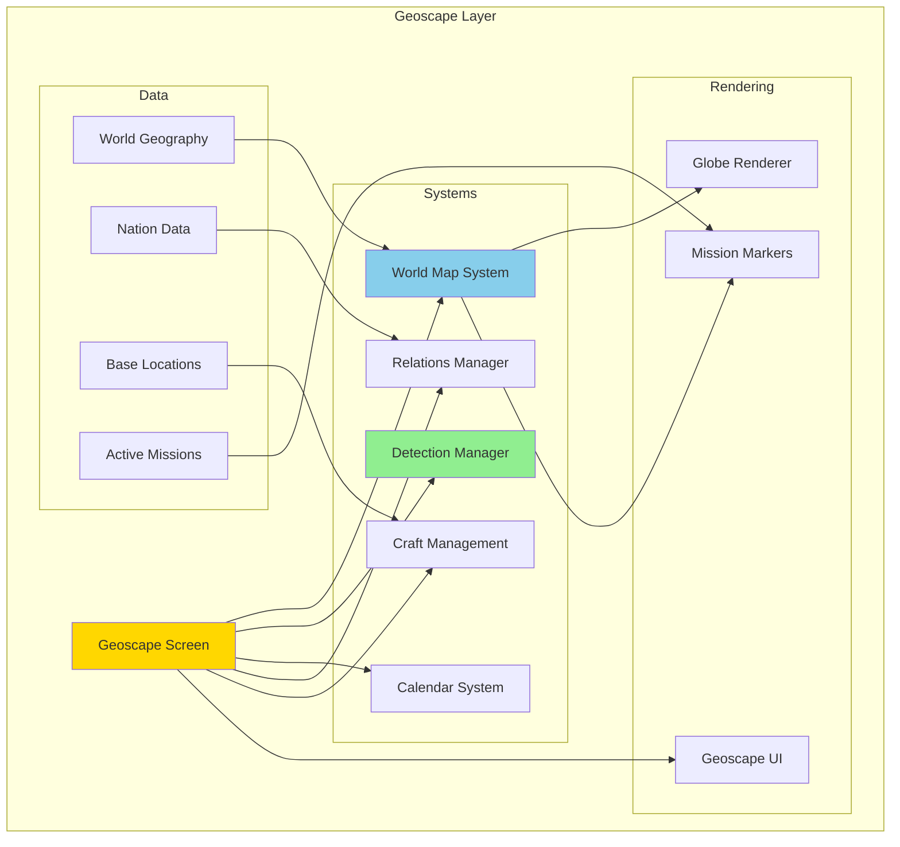
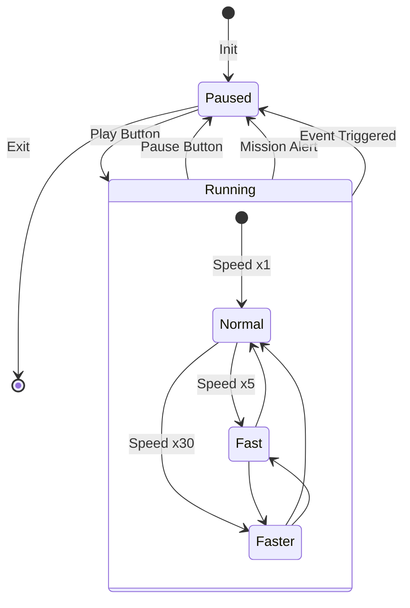
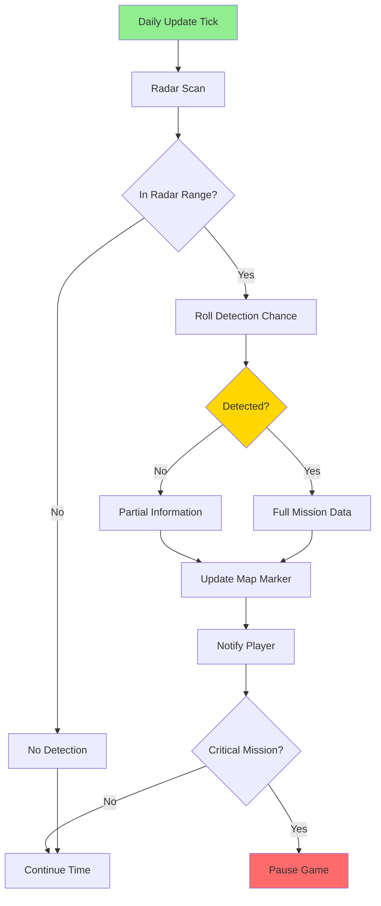
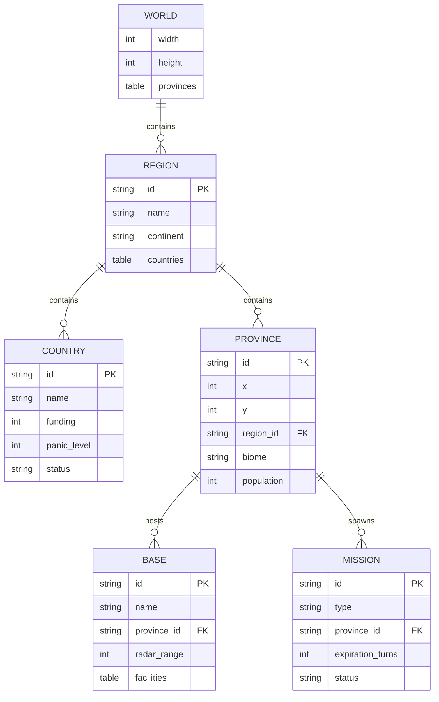
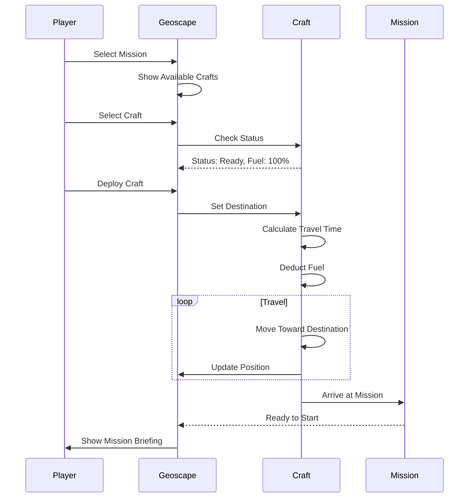
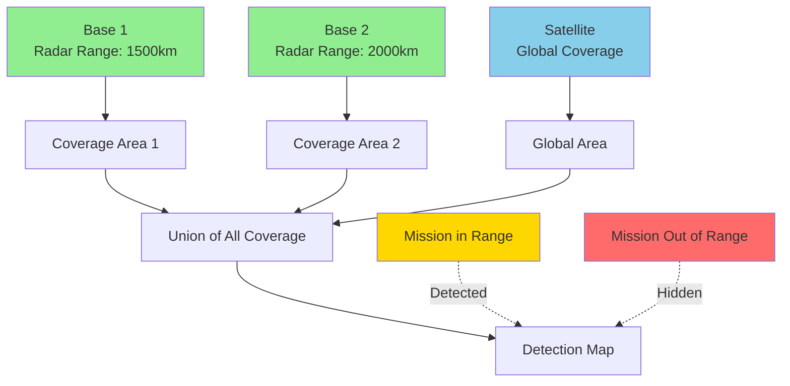
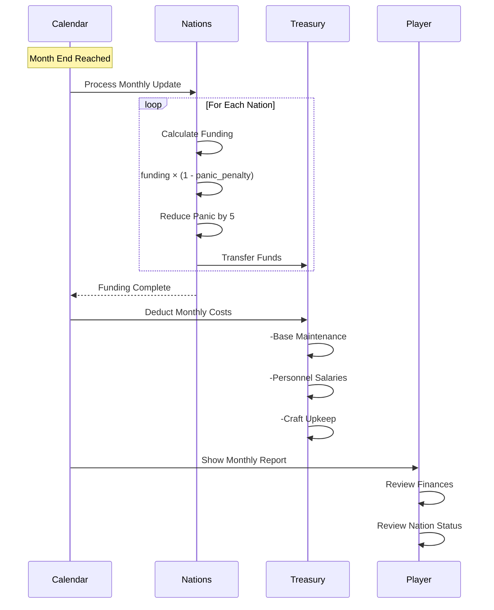
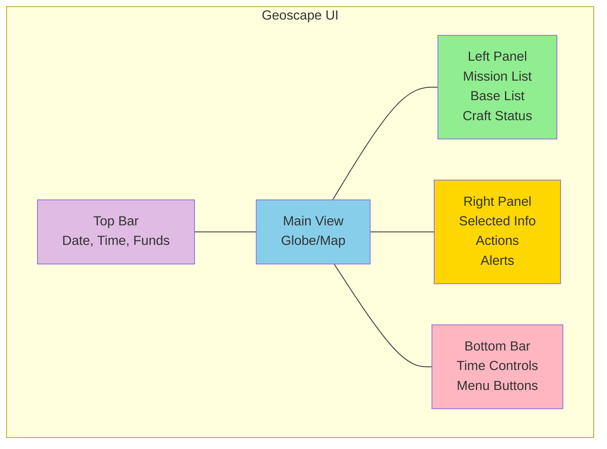

# Geoscape Architecture

**Layer:** Strategic Layer  
**Date:** 2025-10-27  
**Status:** Complete

---

## Overview

The Geoscape is the strategic world management layer where commanders track global operations, manage missions, and oversee organizational resources.

---

## Layer Architecture

---

## Time Management

### Time Scale Table

| Speed | Real Time | Game Time | Use Case |
|-------|-----------|-----------|----------|
| **Paused** | 0s | 0 | Mission planning, base management |
| **Normal (x1)** | 1s | 5 seconds | Careful observation |
| **Fast (x5)** | 1s | 25 seconds | Normal play |
| **Faster (x30)** | 1s | 2.5 minutes | Waiting for events |

---

## Mission Detection Flow

---

## World Geography

---

## Craft Management

---

## Radar Coverage System

---

## Nation Relations

```mermaid
graph LR
    Events[Game Events] --> Positive[Positive Events]
    Events --> Negative[Negative Events]
    
    Positive --> Success[Mission Success<br/>+15 Approval]
    Positive --> Defend[Defend Territory<br/>+10 Approval]
    
    Negative --> UFO[UFO Activity<br/>-5 Approval]
    Negative --> Terror[Terror Mission<br/>-20 Approval]
    Negative --> Fail[Mission Failure<br/>-10 Approval]
    
    Success --> UpdateRelations[Update Nation Relations]
    Defend --> UpdateRelations
    UFO --> UpdateRelations
    Terror --> UpdateRelations
    Fail --> UpdateRelations
    
    UpdateRelations --> CheckLevel{Panic Level}
    
    CheckLevel -->|0-20| Green[Green: Satisfied<br/>Funding: 100%]
    CheckLevel -->|21-50| Yellow[Yellow: Concerned<br/>Funding: 80%]
    CheckLevel -->|51-80| Orange[Orange: Alarmed<br/>Funding: 60%]
    CheckLevel -->|81-99| Red[Red: Critical<br/>Funding: 40%]
    CheckLevel -->|100| Defect[Nation Defects<br/>Funding: 0%]
    
    style Success fill:#90EE90
    style Terror fill:#FF6B6B
    style Green fill:#90EE90
    style Yellow fill:#FFD700
    style Orange fill:#FFA500
    style Red fill:#FF6B6B
    style Defect fill:#000000
```

---

## Monthly Funding Cycle

---

## UI Layout

---

## Performance Optimization

| Component | Optimization | Impact |
|-----------|-------------|--------|
| **Globe Rendering** | Level-of-detail (LOD) mesh | High FPS improvement |
| **Mission Markers** | Batch rendering | Medium FPS improvement |
| **Daily Updates** | Incremental processing | Smooth time passage |
| **Radar Scanning** | Spatial partitioning | Fast detection |
| **UI Updates** | Dirty flag pattern | Reduced CPU usage |

---

**End of Geoscape Architecture**

