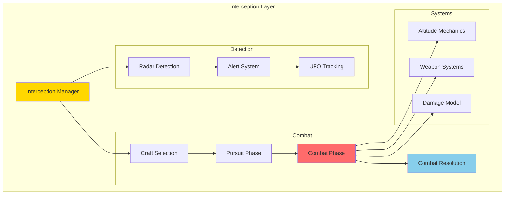
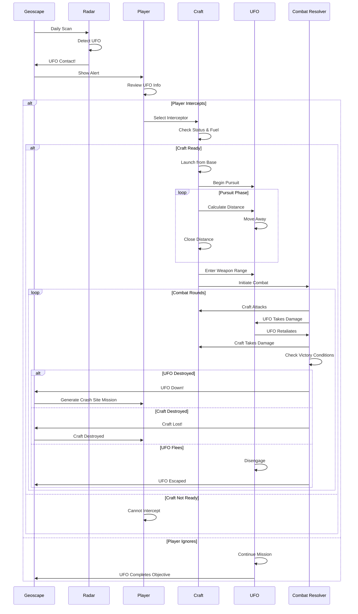
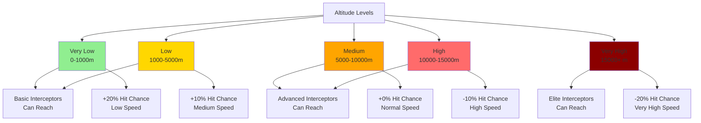
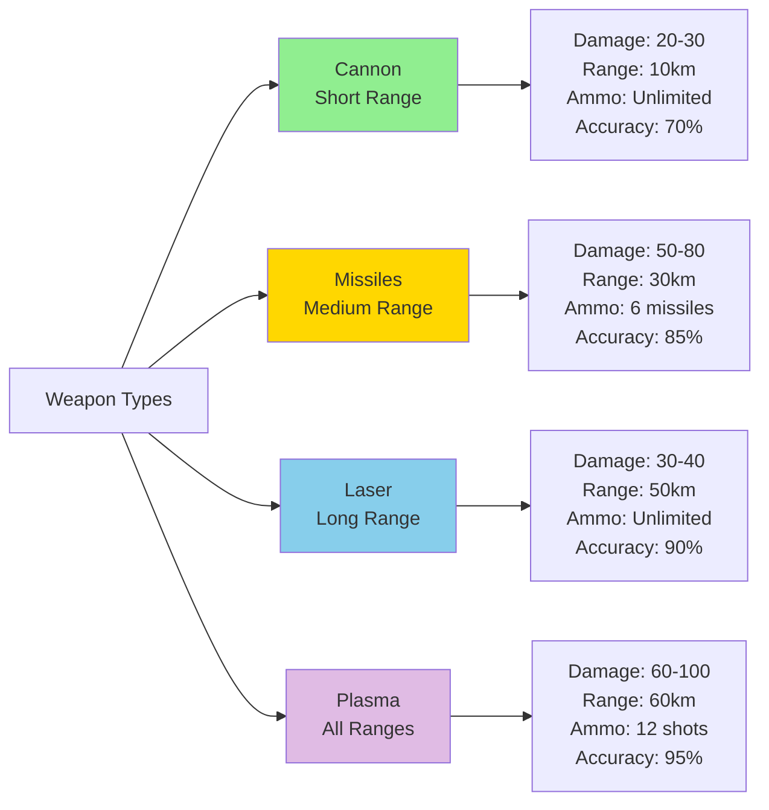
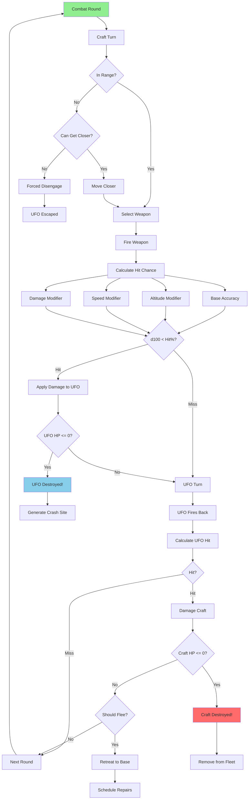
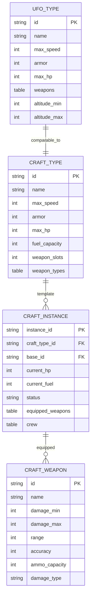
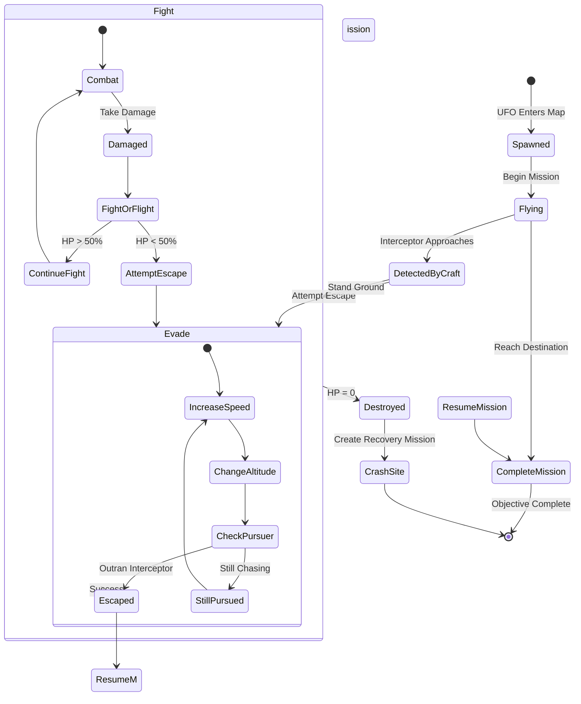
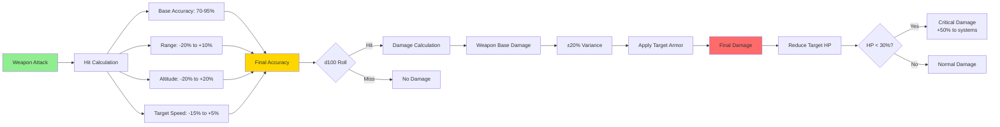

# Interception Layer Architecture

**Layer:** Air Combat & UFO Interception  
**Date:** 2025-10-27  
**Status:** Complete

---

## Overview

The Interception layer manages air-to-air combat between XCOM craft and UFOs, providing real-time or turn-based aerial engagement mechanics.

---

## Interception System Overview

---

## Interception Flow

```mermaid
stateDiagram-v2
    [*] --> UFODetected: Radar Contact
    
    UFODetected --> AlertPlayer: Show Alert
    
    AlertPlayer --> PlayerDecision: Player Response
    
    state PlayerDecision {
        [*] --> SelectCraft
        SelectCraft --> CheckReady: Choose Interceptor
        
        CheckReady --> NotReady: Craft Busy
        CheckReady --> Ready: Craft Available
        
        NotReady --> SelectCraft
        Ready --> [*]
    }
    
    PlayerDecision --> Scramble: Launch Craft
    PlayerDecision --> Ignore: Ignore UFO
    
    Ignore --> [*]: UFO Escapes
    
    Scramble --> Pursuit: Chase UFO
    
    state Pursuit {
        [*] --> CalculateIntercept
        CalculateIntercept --> CheckSpeed: Can Catch?
        
        CheckSpeed --> TooFast: UFO Faster
        CheckSpeed --> Catching: Interceptor Faster
        
        TooFast --> [*]: Pursuit Failed
        Catching --> InRange: Enter Weapon Range
        InRange --> [*]
    }
    
    Pursuit --> Combat: Engage
    Pursuit --> [*]: Failed to Catch
    
    state Combat {
        [*] --> RangeCheck
        RangeCheck --> Fire: In Range
        RangeCheck --> Disengage: Out of Range
        
        Fire --> HitRoll: Roll to Hit
        HitRoll --> Hit: Success
        HitRoll --> Miss: Failure
        
        Hit --> DamageCalc: Calculate Damage
        DamageCalc --> ApplyDamage: Reduce HP
        
        ApplyDamage --> CheckDestroyed: UFO HP?
        CheckDestroyed --> UFODown: HP = 0
        CheckDestroyed --> Continue: HP > 0
        
        Continue --> CheckCraftHP: Craft HP?
        CheckCraftHP --> CraftDown: HP = 0
        CheckCraftHP --> Fire: HP > 0
        
        UFODown --> [*]: Victory
        CraftDown --> [*]: Defeat
        Disengage --> [*]: Escaped
    }
    
    Combat --> CrashSite: UFO Destroyed
    Combat --> Retreat: Craft Damaged
    Combat --> Escaped: UFO Fled
    
    CrashSite --> GenerateMission: Create Recovery Mission
    Retreat --> BaseReturn: Return for Repairs
    Escaped --> [*]: Try Again Later
    
    GenerateMission --> [*]
    BaseReturn --> [*]
```

---

## Craft vs UFO Engagement

---

## Altitude System

### Altitude Mechanics Table

| Altitude | Range | Speed Modifier | Hit Chance | Accessible To |
|----------|-------|---------------|------------|---------------|
| **Very Low** | 0-1km | ×0.5 | +20% | All interceptors |
| **Low** | 1-5km | ×0.75 | +10% | All interceptors |
| **Medium** | 5-10km | ×1.0 | +0% | Advanced+ |
| **High** | 10-15km | ×1.25 | -10% | Advanced+ |
| **Very High** | 15km+ | ×1.5 | -20% | Elite only |

---

## Weapon Systems

---

## Combat Resolution

---

## Craft Types

---

## UFO Behavior

---

## Damage Model

---

## Performance Considerations

| Component | Optimization | Impact |
|-----------|-------------|--------|
| **UFO Tracking** | Position updates only when in pursuit | Minimal CPU |
| **Combat Resolution** | Turn-based or real-time-with-pause | Configurable |
| **Weapon Effects** | Particle pooling | Smooth animations |
| **Path Calculation** | Cached interception vectors | Fast pursuit |

---

**End of Interception Layer Architecture**

