# AI Systems Architecture - Hex-Based Tactical AI

**System:** Artificial Intelligence  
**Date:** 2025-10-28  
**Status:** Complete  
**Coordinate System:** Vertical Axial (for tactical calculations)

---

## Overview

The AI system controls enemy behavior, tactical decisions, strategic planning, and difficulty scaling across all game modes. **Tactical AI uses vertical axial hex system for pathfinding, targeting, and movement.**

### Hex-Based AI Calculations

**AI tactical decisions use HexMath:**
- **Pathfinding:** A* with `HexMath.distance()` heuristic
- **Target Selection:** Range via `HexMath.distance()`
- **Cover Analysis:** Direction via `HexMath.getDirection()`
- **Area Control:** Range queries via `HexMath.hexesInRange()`
- **Line of Sight:** Vision via `HexMath.hexLine()`

**Design Reference:** `design/mechanics/hex_vertical_axial_system.md`  
**Core Module:** `engine/battlescape/battle_ecs/hex_math.lua`

---

## AI Architecture Overview

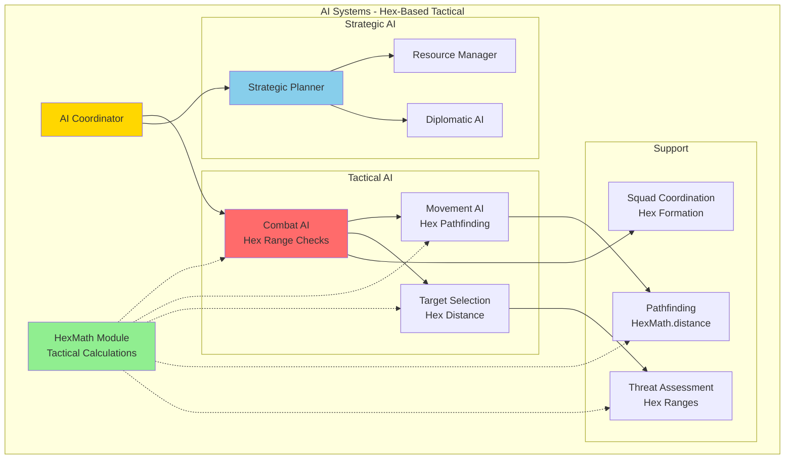

---

## Behavior Tree Structure

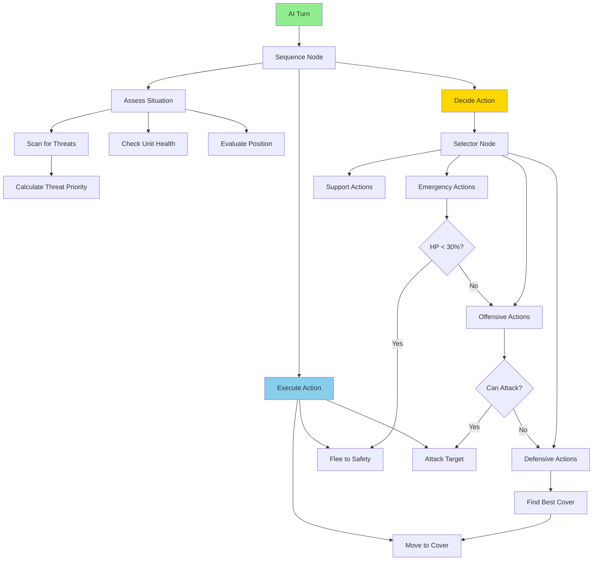

---

## Target Selection

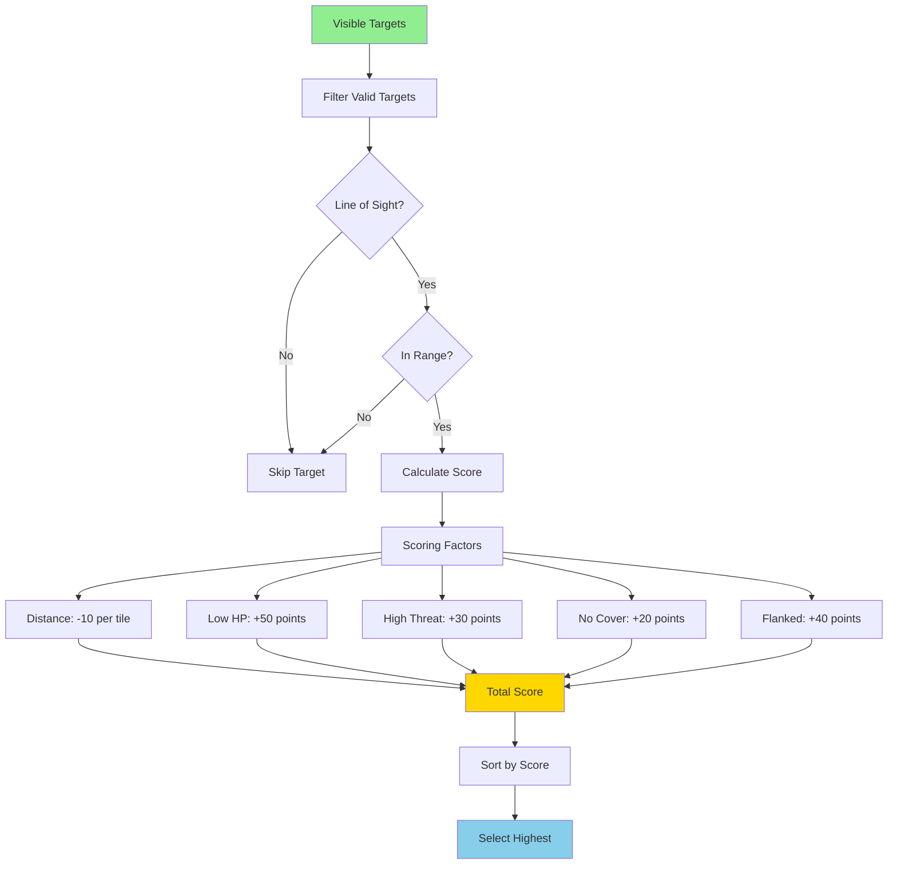

### Target Priority Table

| Factor | Weight | Calculation | Example |
|--------|--------|-------------|---------|
| **Distance** | -10/tile | Closer is better | 5 tiles = -50 |
| **Health** | +50 if < 50% | Easy kill bonus | Low HP = +50 |
| **Threat Level** | +30 if high | Dangerous units | Heavy weapon = +30 |
| **Cover Status** | +20 if none | Exposed units | No cover = +20 |
| **Flanked** | +40 if yes | Vulnerable position | Flanked = +40 |
| **Class Bonus** | +0 to +30 | Target priority | Medic = +30 |

---

## Movement AI

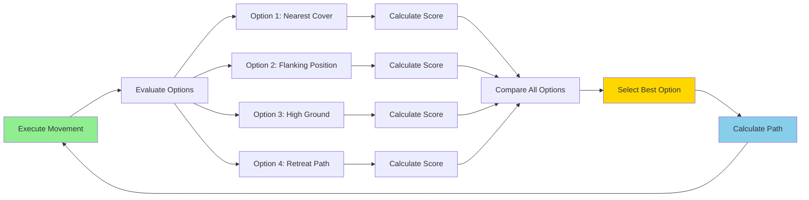

---

## Difficulty Scaling

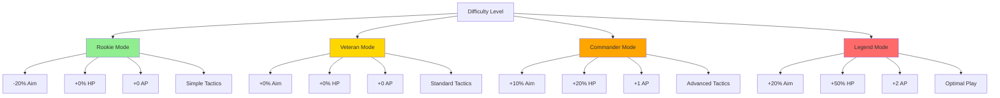

### Difficulty Modifiers

| Difficulty | Hit Chance | Damage | HP | AP | AI Quality |
|------------|-----------|--------|----|----|------------|
| **Rookie** | -20% | -10% | +0% | +0 | Poor positioning |
| **Veteran** | +0% | +0% | +0% | +0 | Uses cover |
| **Commander** | +10% | +10% | +20% | +1 | Flanking, focus fire |
| **Legend** | +20% | +20% | +50% | +2 | Perfect play, coordination |

---

## Squad Coordination

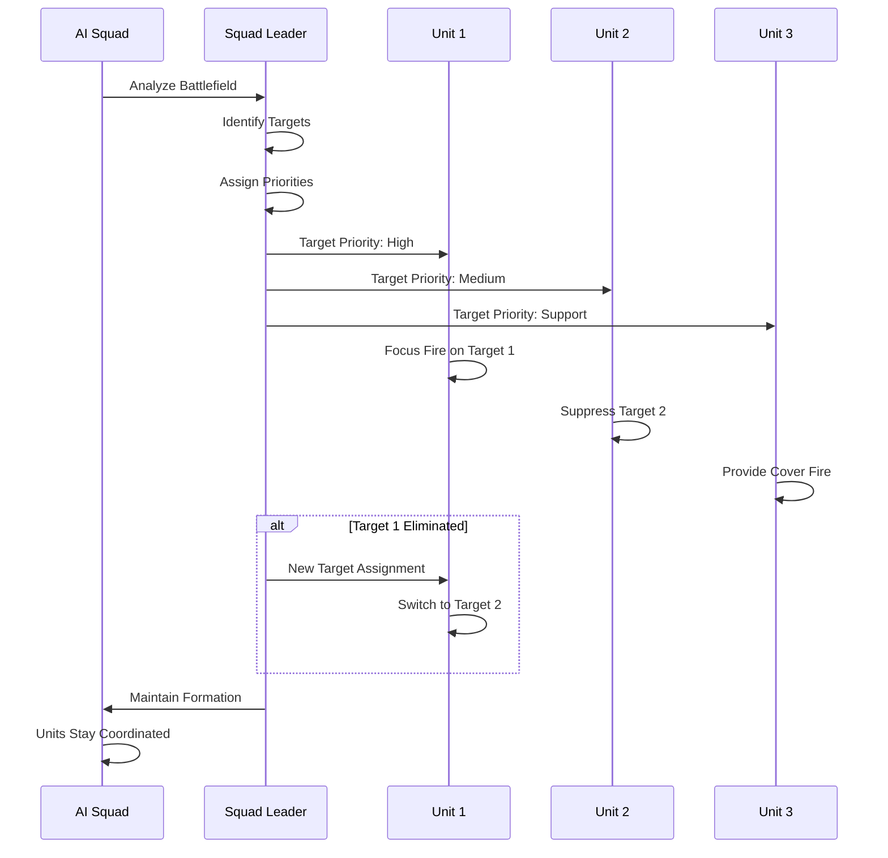

---

## Threat Assessment

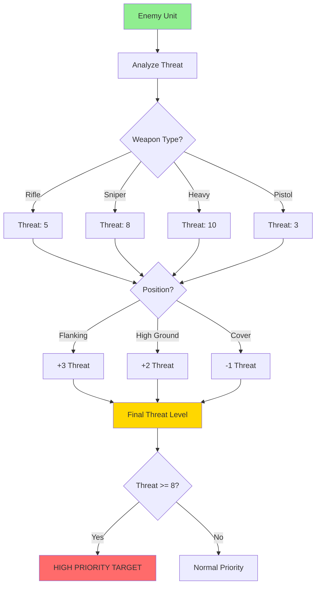

---

## Tactical Behaviors

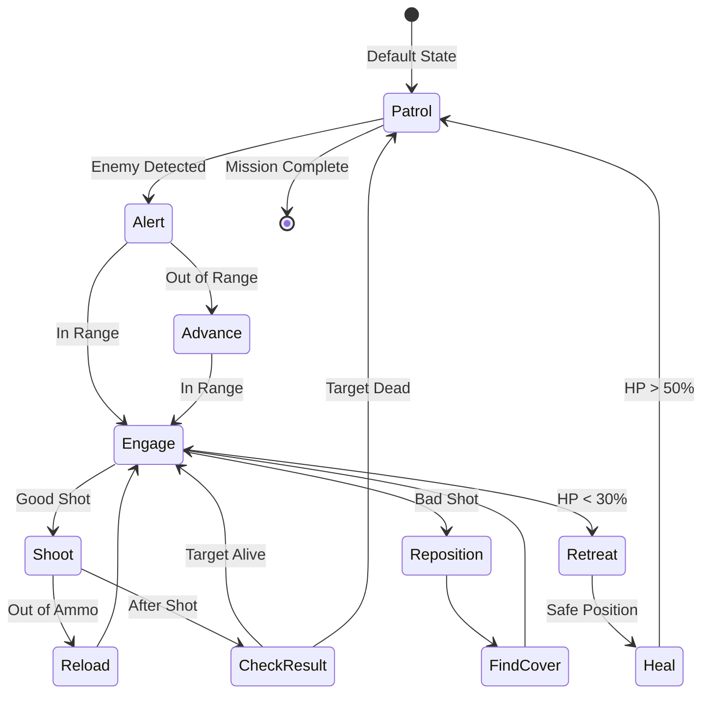

---

## Pathfinding Integration

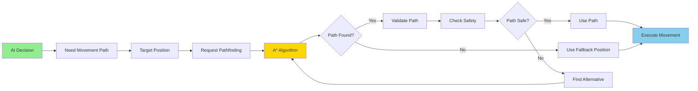

---

## Strategic AI (Geoscape)

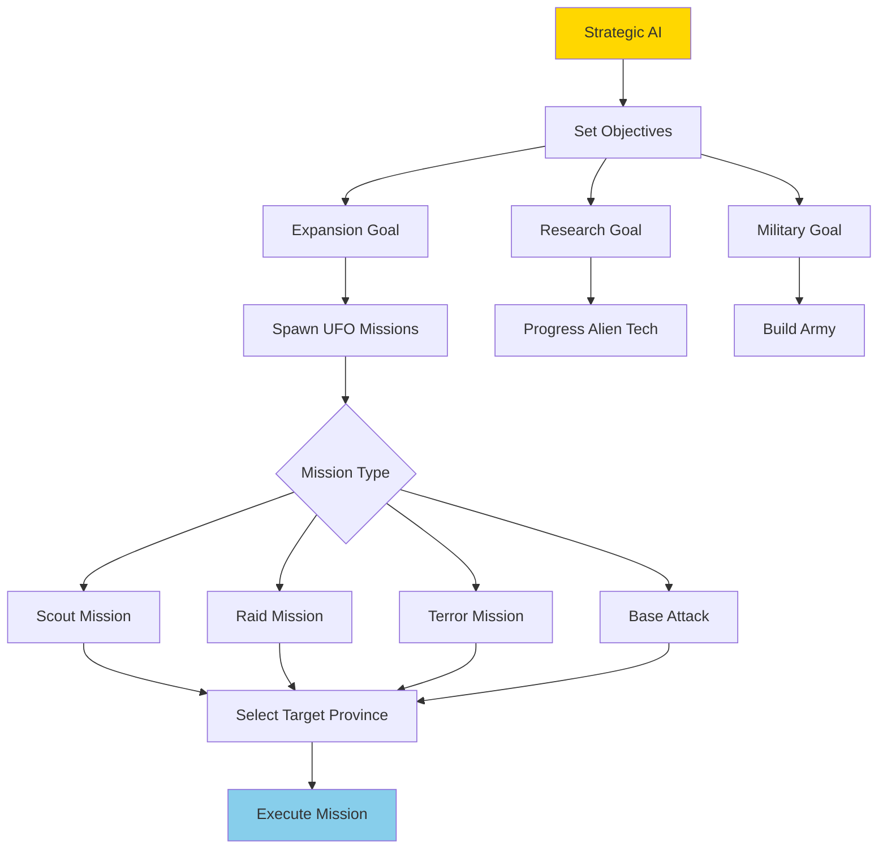

---

## AI Debug Visualization

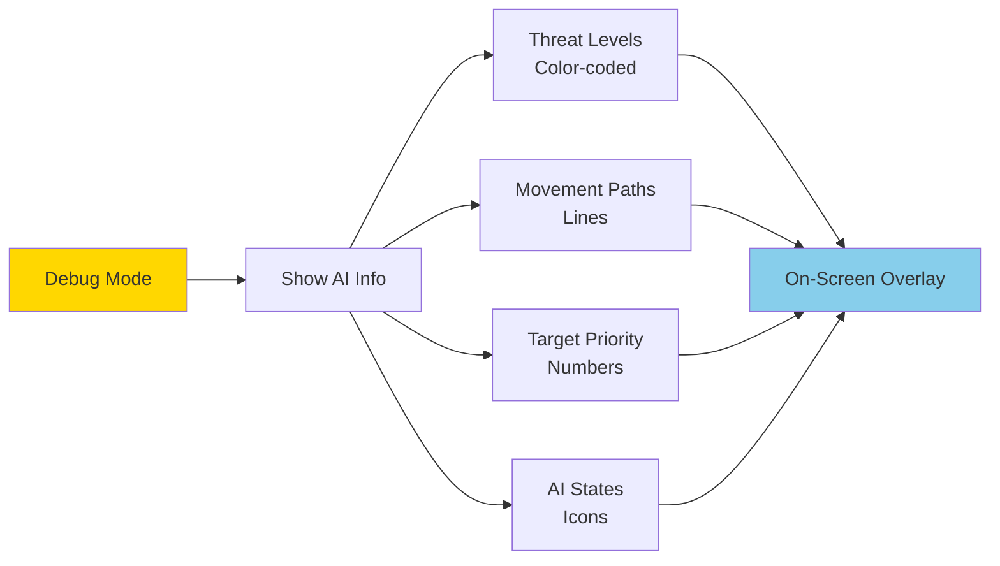

---

## Performance Optimization

| Component | Optimization | Impact |
|-----------|-------------|--------|
| **Pathfinding** | Cached paths | Reuse valid paths |
| **Threat Calc** | Update on change | Skip recalculation |
| **Target Selection** | Spatial partitioning | Fast nearest checks |
| **Behavior Tree** | Early exit | Stop at first success |
| **Squad Coordination** | Leader-based | Single decision point |

---

**End of AI Systems Architecture**

