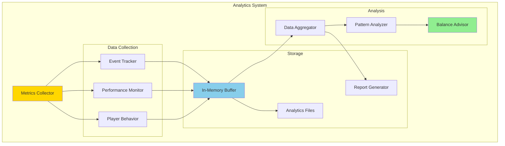
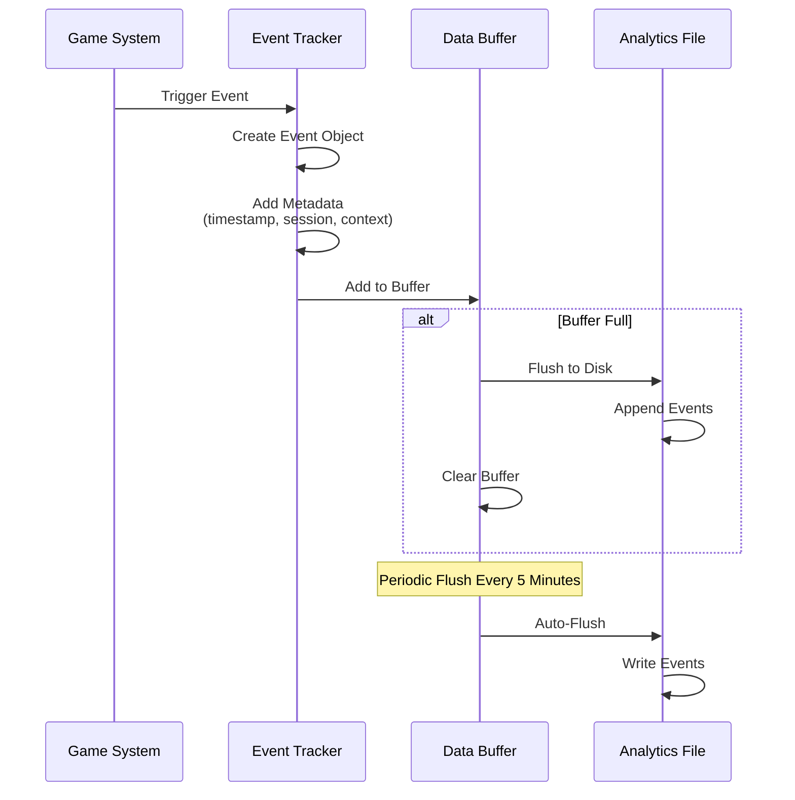
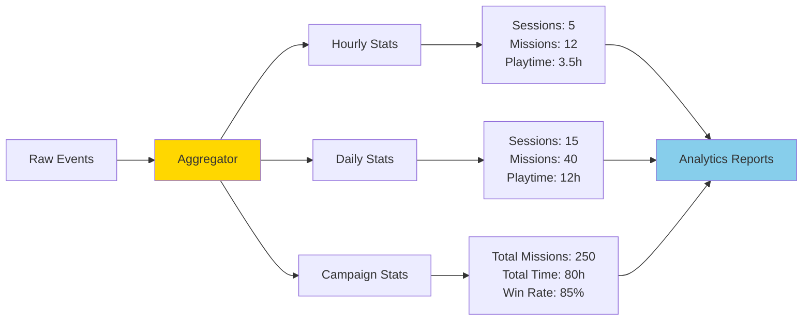
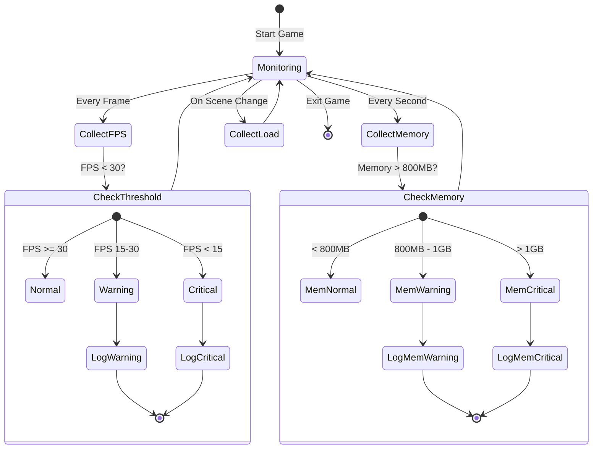
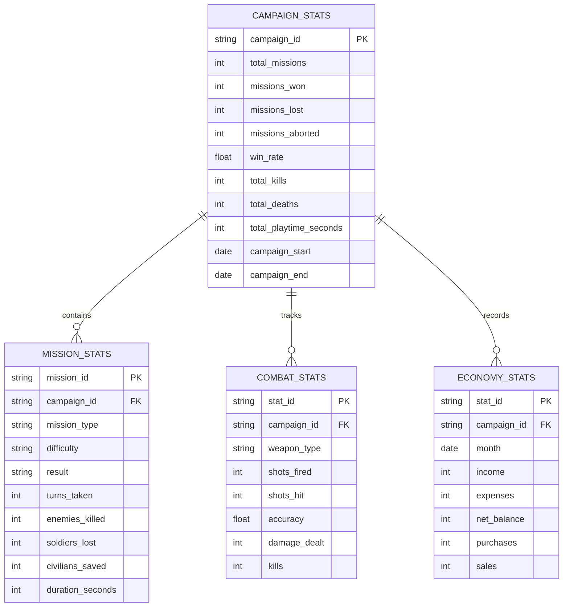
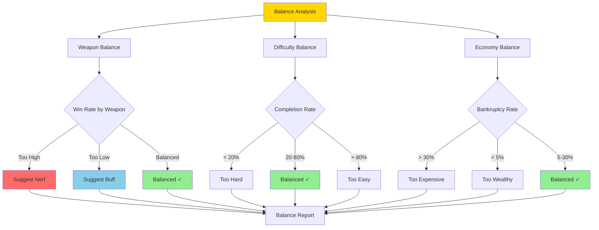
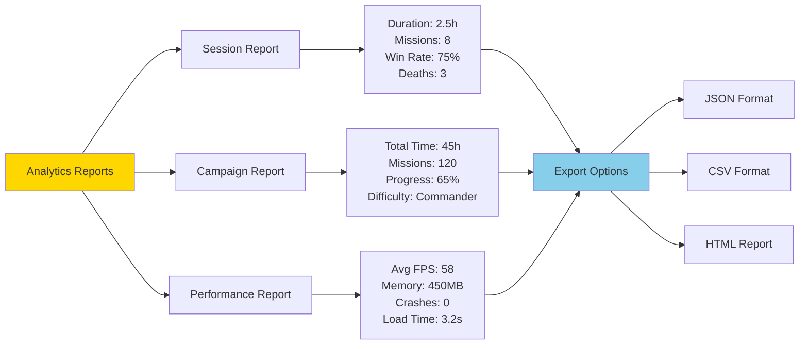
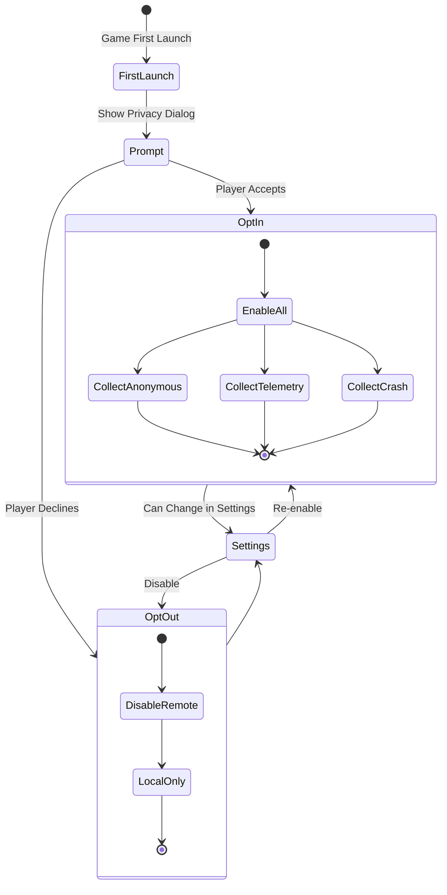

# Analytics System Architecture

**System:** Analytics & Metrics  
**Date:** 2025-10-27  
**Status:** Complete

---

## Overview

The Analytics system tracks player behavior, game metrics, performance data, and campaign statistics for balancing and improvement.

---

## Analytics Architecture



---

## Event Tracking Flow



---

## Tracked Metrics

```mermaid
graph TD
    Metrics[Analytics Metrics] --> Combat[Combat Metrics]
    Metrics --> Campaign[Campaign Metrics]
    Metrics --> Performance[Performance Metrics]
    Metrics --> Economy[Economy Metrics]
    
    Combat --> Accuracy[Hit Accuracy<br/>per Weapon Type]
    Combat --> Kills[Kill Count<br/>per Unit Class]
    Combat --> Damage[Damage Dealt/Taken]
    Combat --> Tactics[Tactical Choices]
    
    Campaign --> Progress[Campaign Progress<br/>Mission Count]
    Campaign --> Research[Research Speed<br/>Tech Unlocks]
    Campaign --> Nations[Nation Relations<br/>Panic Levels]
    Campaign --> Time[Playtime<br/>Session Length]
    
    Performance --> FPS[Frame Rate<br/>FPS over Time]
    Performance --> Memory[Memory Usage<br/>Peak/Average]
    Performance --> LoadTime[Load Times<br/>Scene Transitions]
    Performance --> Errors[Error Count<br/>Crash Reports]
    
    Economy --> Income[Income Sources<br/>Funding/Sales]
    Economy --> Expenses[Expense Categories<br/>Salaries/Construction]
    Economy --> Balance[Financial Balance<br/>Over Time]
    Economy --> Items[Item Purchases<br/>Marketplace Activity]
    
    style Metrics fill:#FFD700
    style Combat fill:#FF6B6B
    style Campaign fill:#87CEEB
    style Performance fill:#90EE90
    style Economy fill:#E0BBE4
```



---

## Data Aggregation



---

## Performance Monitoring



---

## Campaign Statistics



---

## Balance Analysis



---

## Analytics Reports



---

## Privacy & Data Collection



---

## Event Categories

| Category | Events | Purpose | Examples |
|----------|--------|---------|----------|
| **Combat** | Shots, hits, kills, deaths | Balance weapons | Rifle accuracy: 68% |
| **Mission** | Start, end, objectives | Mission difficulty | Terror missions: 45% win rate |
| **Research** | Start, complete, unlocks | Tech pacing | Laser weapons: Day 45 avg |
| **Economy** | Purchases, sales, bankruptcy | Financial balance | Avg bankruptcy: Month 8 |
| **Performance** | FPS, memory, load times | Optimization | Load time: 4.2s avg |
| **Player** | Sessions, playtime, preferences | Engagement | Avg session: 2.3h |

---

## Analytics API

```lua
-- Example Analytics Usage

local Analytics = require("analytics.analytics_system")

-- Track an event
Analytics:trackEvent("mission.complete", {
    mission_type = "crash_site",
    difficulty = "veteran",
    result = "victory",
    turns = 18,
    kills = 12,
    deaths = 2
})

-- Track performance
Analytics:trackPerformance("scene.load", {
    scene = "battlescape",
    load_time_ms = 3200,
    memory_mb = 450
})

-- Get statistics
local stats = Analytics:getCampaignStats()
-- stats.win_rate, stats.total_missions, etc.

-- Generate report
Analytics:generateReport("campaign", "json", "temp/report.json")
```

---

## Performance Impact

| Component | CPU Impact | Memory Impact | Disk Impact |
|-----------|-----------|---------------|-------------|
| **Event Tracking** | < 1% | ~2MB buffer | Minimal |
| **Performance Monitor** | < 1% | ~1MB | Minimal |
| **Aggregation** | < 5% (periodic) | ~5MB | 10-50MB per campaign |
| **Report Generation** | < 2% (on-demand) | ~10MB | 1-5MB per report |

---

**End of Analytics System Architecture**

