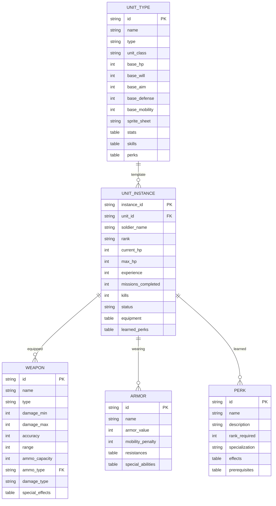
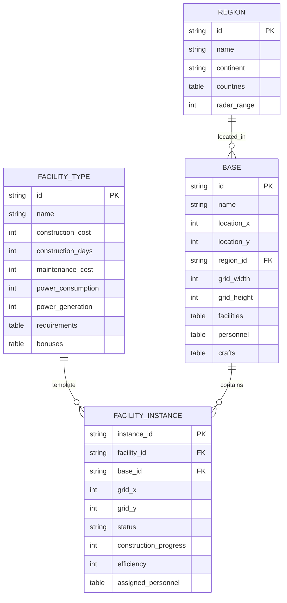
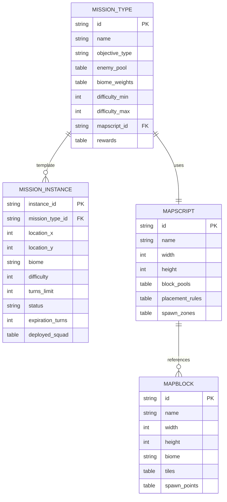
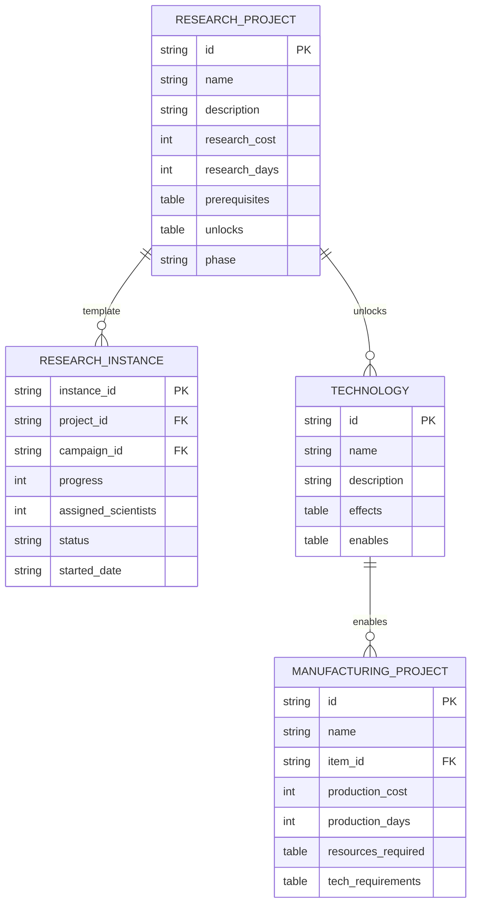
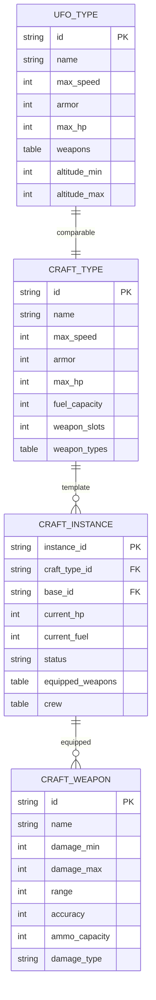
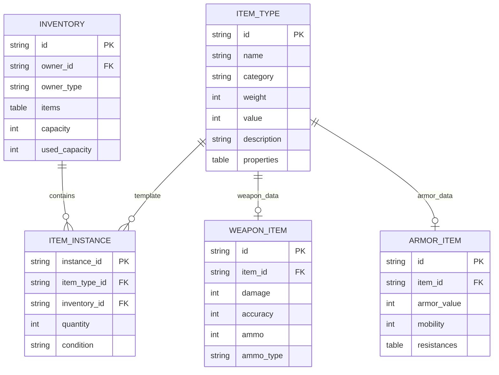
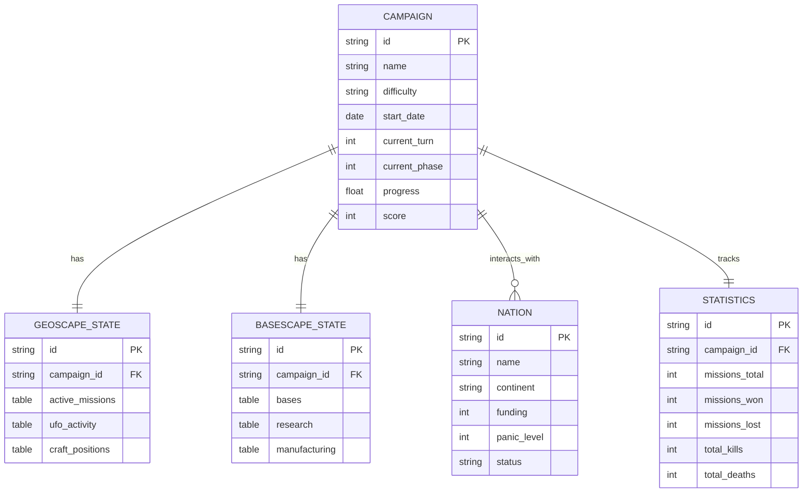
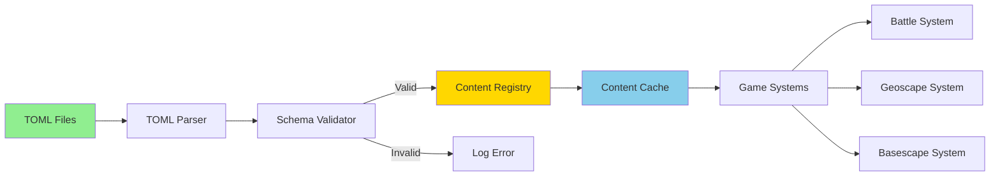
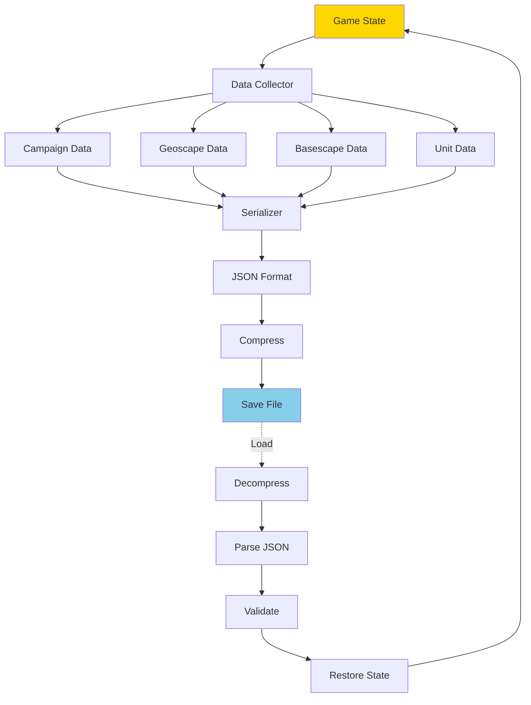
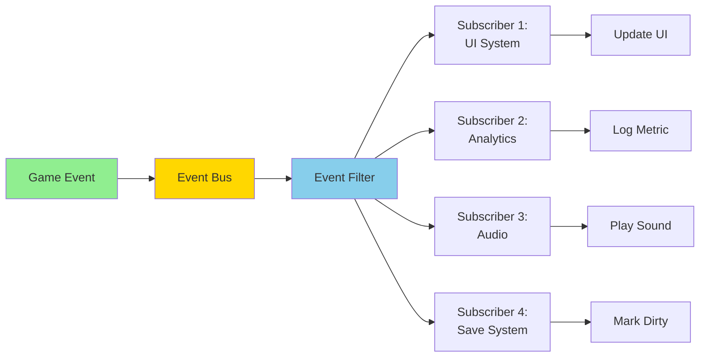

# Data Models & Entity Relationships

**System:** Data Structures & Models  
**Date:** 2025-10-27  
**Status:** Complete

---

## Overview

Core data models defining entities, relationships, and data structures used throughout the game.

---

## Content Data Models

### Unit Data Model

---

## Facility Data Model

---

## Mission Data Model

---

## Research Data Model

---

## Craft Data Model

---

## Item Data Model

---

## Campaign Data Model

---

## Data Flow Patterns

### Content Loading Pattern

---

### Save/Load Data Flow

---

### Event Data Flow

---

## Data Relationships Table

| Entity | Related To | Relationship | Cardinality |
|--------|-----------|--------------|-------------|
| **Unit Type** | Unit Instance | Template | 1:N |
| **Unit Instance** | Weapon | Equips | 1:N |
| **Unit Instance** | Armor | Wears | 1:1 |
| **Base** | Facility | Contains | 1:N |
| **Base** | Craft | Houses | 1:N |
| **Mission Type** | Mission Instance | Generates | 1:N |
| **Research Project** | Technology | Unlocks | 1:N |
| **Technology** | Items | Enables | 1:N |
| **Campaign** | Nations | Interacts | 1:N |
| **Mapscript** | Mapblocks | Uses | 1:N |

---

## Data Validation Rules

| Entity | Required Fields | Validation Rules | Example |
|--------|----------------|------------------|---------|
| **Unit** | id, name, hp | hp > 0, unique id | id="soldier_rookie" |
| **Weapon** | id, damage, range | damage > 0, range > 0 | damage=20-30 |
| **Facility** | id, cost, days | cost >= 0, days > 0 | cost=50000 |
| **Mission** | id, type, difficulty | difficulty 1-5 | difficulty=3 |
| **Research** | id, cost | cost > 0 | cost=150 |

---

## Performance Considerations

| Data Type | Storage | Access Pattern | Optimization |
|-----------|---------|---------------|--------------|
| **Units** | Hash map | By ID | O(1) lookup |
| **Facilities** | Grid array | By position | O(1) access |
| **Missions** | List | Sequential | Linear scan |
| **Items** | Hash map | By ID | O(1) lookup |
| **Save Data** | Compressed file | Full load | Lazy deserialize |

---

**End of Data Models & Entity Relationships**

