# Economy System Architecture

**System:** Economy & Finance  
**Date:** 2025-10-27  
**Status:** Complete

---

## Overview

The economy system manages finances, resources, marketplace transactions, and economic balance across all game systems.

---

## Economy Flow

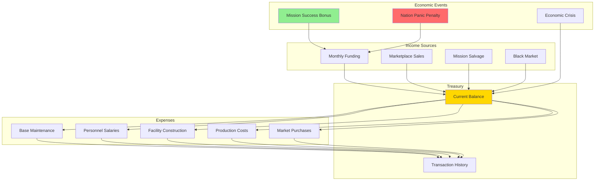

---

## Monthly Financial Cycle

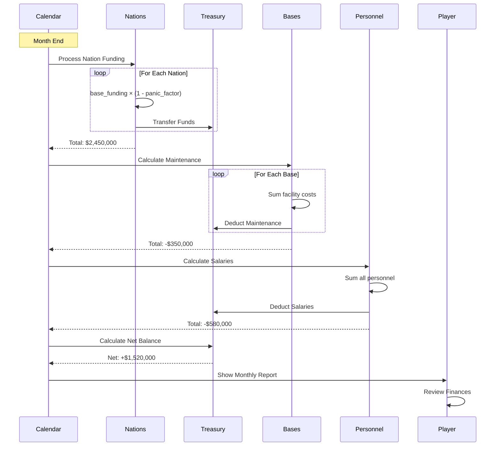

---

## Resource Management

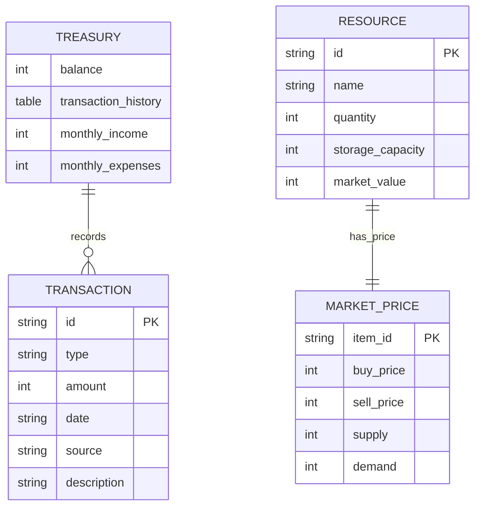

---

## Marketplace System

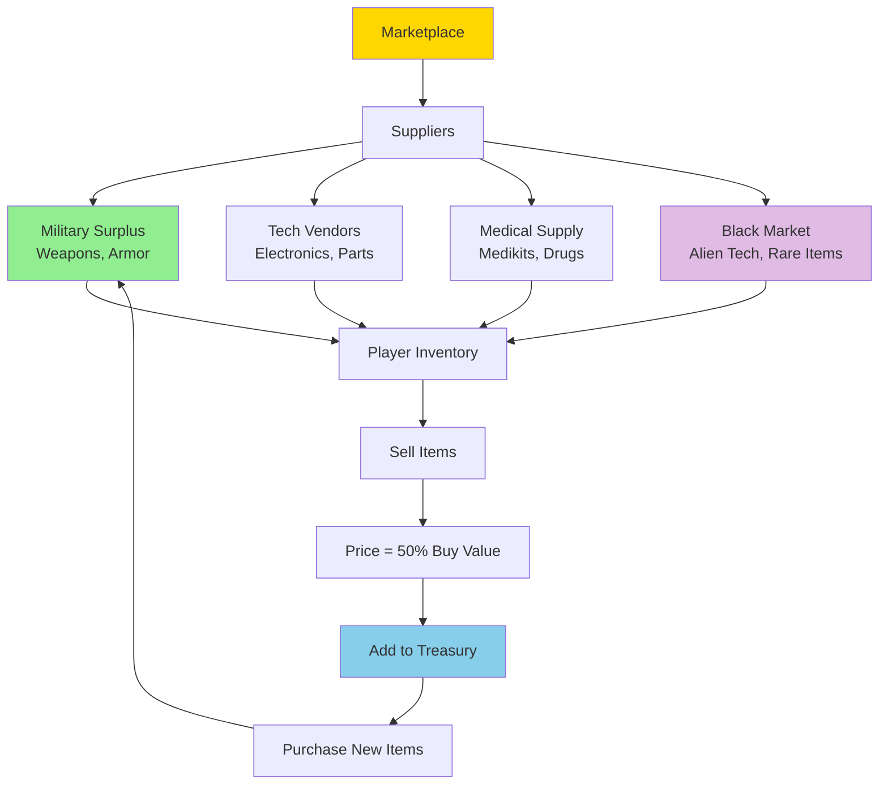

### Market Pricing Table

| Item Category | Buy Price | Sell Price | Availability |
|--------------|-----------|------------|--------------|
| **Basic Weapons** | $1,000 - $5,000 | 50% | Always |
| **Advanced Weapons** | $10,000 - $50,000 | 50% | Tech required |
| **Basic Armor** | $2,000 - $8,000 | 50% | Always |
| **Advanced Armor** | $15,000 - $80,000 | 50% | Tech required |
| **Equipment** | $500 - $5,000 | 50% | Always |
| **Alien Artifacts** | N/A | $10,000 - $100,000 | Mission loot |
| **Alien Corpses** | N/A | $2,000 - $20,000 | Mission loot |
| **Live Aliens** | N/A | $50,000 - $200,000 | Mission capture |

---

## Salvage System

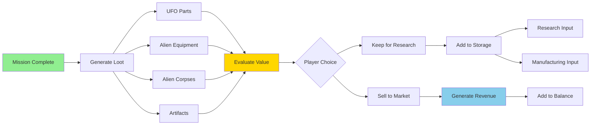

---

## Budget Allocation

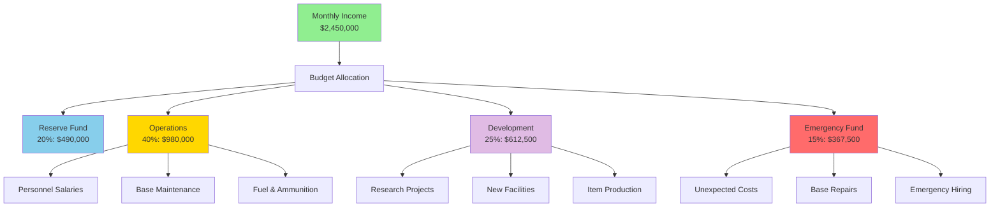

---

## Economic Crisis Events

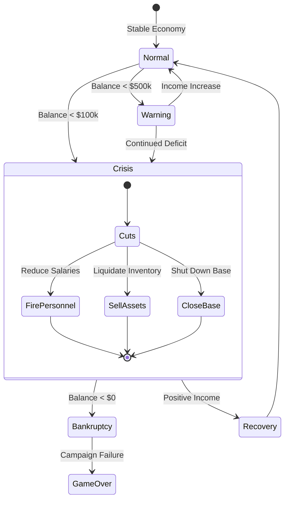

---

## Financial Reports

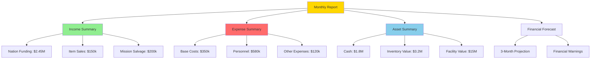

---

## Pricing Algorithm

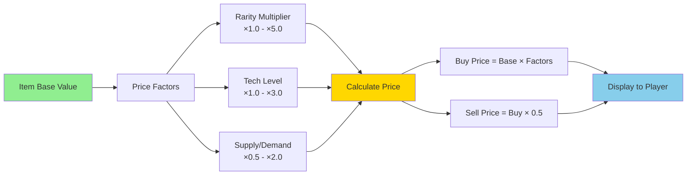

---

## Economic Balance Tuning

| Phase | Average Income | Average Expenses | Target Balance | Difficulty |
|-------|---------------|------------------|----------------|------------|
| **Early (Months 1-3)** | $800k/month | $400k/month | $1-2M | Easy |
| **Mid (Months 4-8)** | $2.5M/month | $1.5M/month | $5-8M | Medium |
| **Late (Months 9-12)** | $4M/month | $3M/month | $10-15M | Hard |
| **End Game (13+)** | $5M/month | $4M/month | $20M+ | Hardest |

---

## Transaction System

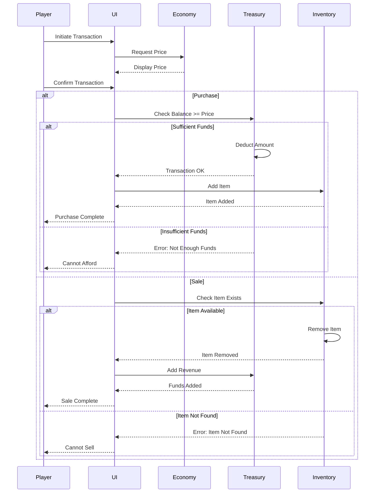

---

## Black Market System

**Module**: `engine/economy/marketplace/black_market_system.lua`  
**Status**: Expanded with 5 service categories  
**Related**: `design/mechanics/BlackMarket.md`

### Black Market Architecture

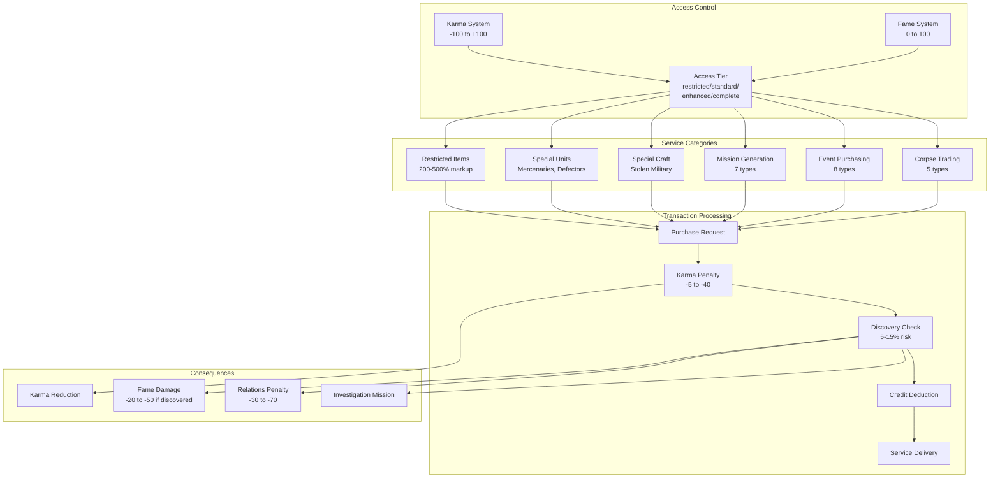

### Transaction Flow

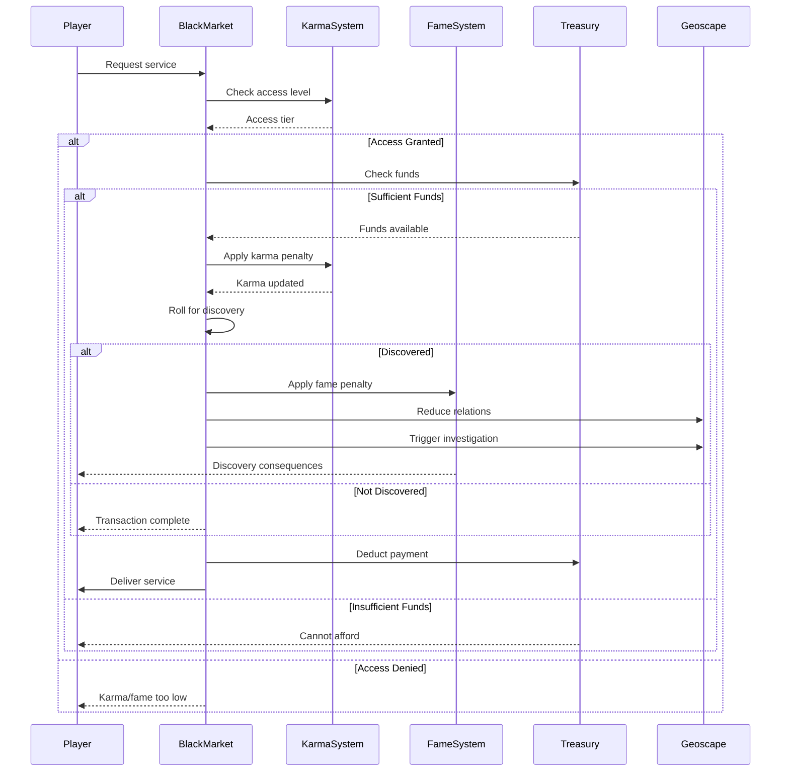

### Service Categories Detail

#### 1. Mission Generation

**Module**: `engine/economy/mission_generation.lua`

**Mission Types**:
- Assassination (50K, -30 karma)
- Sabotage (40K, -20 karma)
- Heist (30K, -15 karma)
- Kidnapping (35K, -25 karma)
- False Flag (60K, -40 karma)
- Data Theft (25K, -10 karma)
- Smuggling (20K, -5 karma)

**Process**:
1. Player pays cost
2. Karma penalty applied immediately
3. Mission spawns on Geoscape in 3-7 days
4. Mission appears in target region
5. Completion: 150-300% profit potential
6. Failure: Traced back to player (-50 relations)

#### 2. Event Purchasing

**Module**: `engine/economy/event_purchasing.lua`

**Event Types**:
- Improve Relations (30K, -10 karma, +20 relations)
- Sabotage Economy (50K, -25 karma, drops economy tier)
- Incite Rebellion (80K, -35 karma, province contested 3 months)
- Spread Propaganda (20K, -5 karma, +10 fame +10 relations)
- Frame Rival (60K, -30 karma, rival -30 relations)
- Bribe Officials (40K, -15 karma, ignore activity 6 months)
- Crash Market (70K, -20 karma, 30% cheaper items 3 months)
- False Intelligence (35K, -15 karma, fake UFO sighting)

**Process**:
1. Player selects event and target
2. Payment and karma penalty
3. Event triggers in 1-3 days
4. Effects apply per event type
5. Duration: 3-6 months or permanent
6. Discovery risk: 12%

#### 3. Corpse Trading

**Module**: `engine/economy/corpse_trading.lua`

**Corpse Types & Values**:
- Human Soldier: 5K, -10 karma
- Alien Common: 15K, -15 karma
- Alien Rare: 50K, -25 karma
- VIP/Hero: 100K, -30 karma
- Mechanical: 8K, -5 karma

**Modifiers**:
- Fresh (+50% value, < 7 days)
- Preserved (+100% value, cryogenic)
- Damaged (-50% value, explosion)

**Process**:
1. Corpse collected from battlefield
2. Stored as item (2 slots)
3. Sold through Black Market
4. Karma penalty applied
5. Discovery risk: 5%

**Alternatives** (0 karma):
- Research (unlock biology tech)
- Burial (+5 morale to squad)
- Ransom (+relations with faction)

#### 4. Special Units

**Unit Types**:
- Elite Mercenary (50K, -10 karma)
- Alien Defector (80K, -15 karma)
- Augmented Soldier (120K, -25 karma)
- Master Assassin (150K, -30 karma)
- Clone Trooper (100K, -20 karma)

**Restrictions**:
- Maximum 3 per base
- Cannot use in diplomatic missions
- Discovery: -20 relations if found

#### 5. Special Craft

**Craft Types**:
- Black Interceptor (200K, -15 karma, +20% speed)
- Modified Bomber (300K, -20 karma, +50% payload)
- Captured UFO (500K, -30 karma, alien tech)
- Stealth Transport (250K, -15 karma, undetectable)

**Discovery Risk**: 10% per month if deployed

### Access Tier System

| Karma Range | Fame Range | Access Level | Available Services |
|-------------|-----------|--------------|-------------------|
| +40 to +10 | 25-59 | **Restricted** | Items only |
| +9 to -39 | 25-100 | **Standard** | Items, Units, some Services |
| -40 to -74 | 60-100 | **Enhanced** | All except extreme |
| -75 to -100 | 75-100 | **Complete** | Everything |

### Discovery System

**Base Discovery Chances**:
- Item purchase: 5%
- Unit recruitment: 10%
- Craft purchase: 15%
- Mission generation: 8%
- Event purchasing: 12%
- Corpse trading: 5%

**Modifiers**:
- +2% per 10 fame above 50
- +5% per black market unit owned
- +10% if black market craft deployed
- +5% per active event
- +3% per human corpse sold

**Cumulative Risk**:
- 1-5 transactions: Normal risk
- 6-15 transactions: +5% discovery
- 16-30 transactions: +10% discovery
- 31+ transactions: +15% discovery

**Consequences**:
- Fame: -20 to -50
- Relations: -30 to -70 with discovering country
- Karma: -10 additional
- Investigation mission: 30% chance

### Integration Points

**With Karma System**:
- Check karma before allowing access
- Apply karma penalties per transaction
- Update access tier dynamically

**With Fame System**:
- Check fame for discovery visibility
- Apply fame penalties on discovery
- Update reputation status

**With Geoscape**:
- Spawn generated missions on map
- Apply event effects to provinces/countries
- Trigger investigation missions

**With Relations System**:
- Apply relation penalties on discovery
- Update diplomatic status
- Trigger sanctions/embargos

---

## Performance Metrics

| Metric | Target | Warning | Critical |
|--------|--------|---------|----------|
| **Monthly Net Income** | > $500k | < $200k | < $0 |
| **Cash Reserve** | > $2M | < $500k | < $100k |
| **Asset Value** | > $10M | < $5M | < $2M |
| **Expense Ratio** | < 60% | > 80% | > 100% |
| **Nation Satisfaction** | > 70% | < 50% | < 30% |
| **Black Market Risk** | < 20% | > 40% | > 60% |
| **Karma Level** | > -40 | < -75 | -100 |

---

**End of Economy System Architecture**

