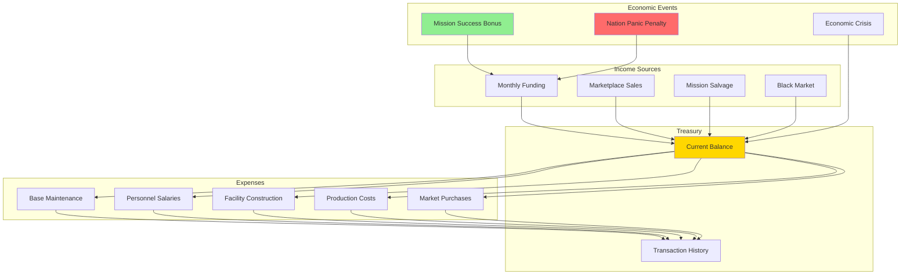
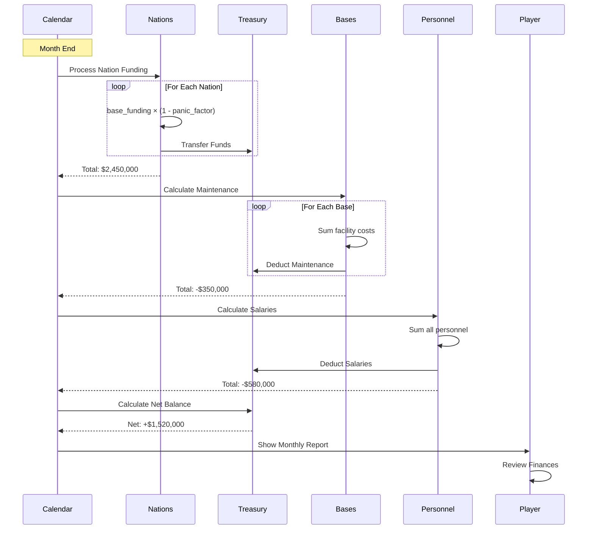
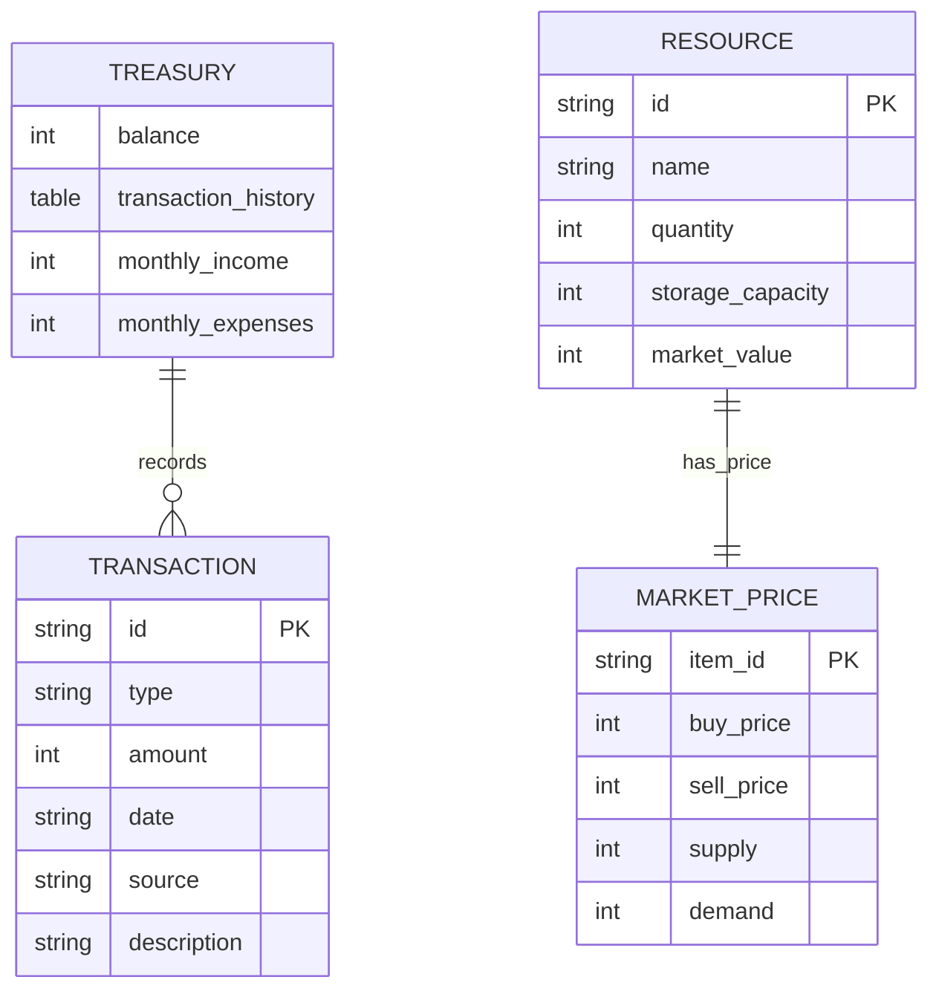
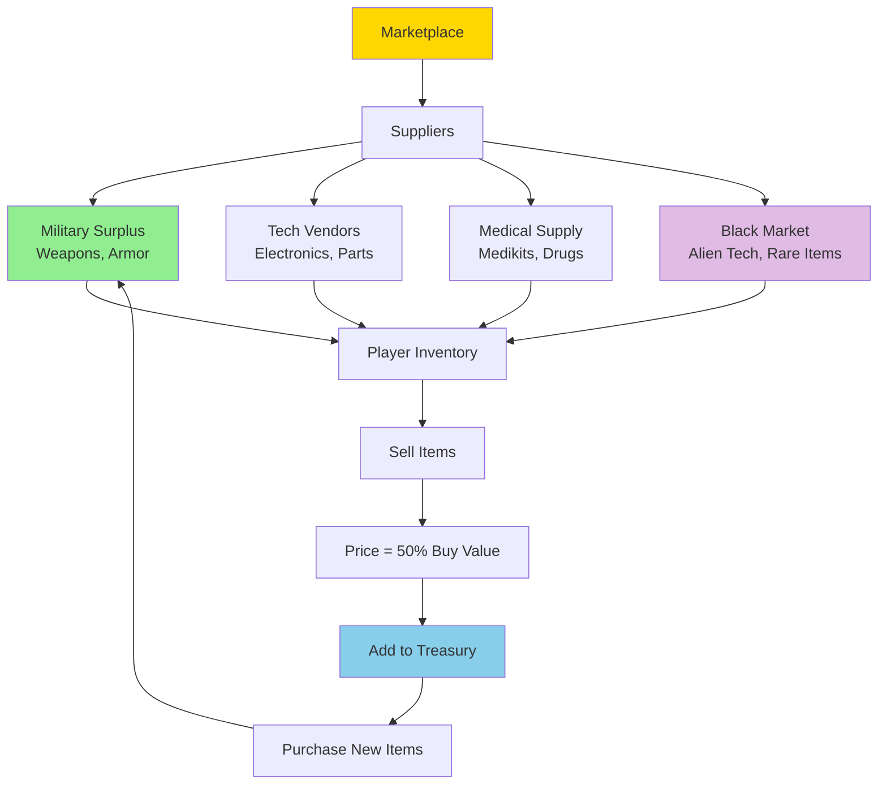
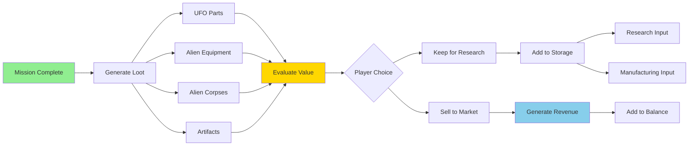
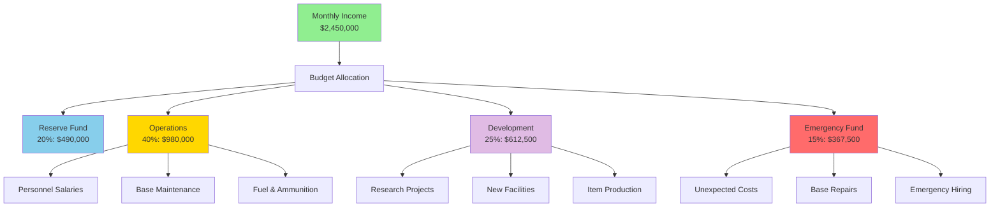
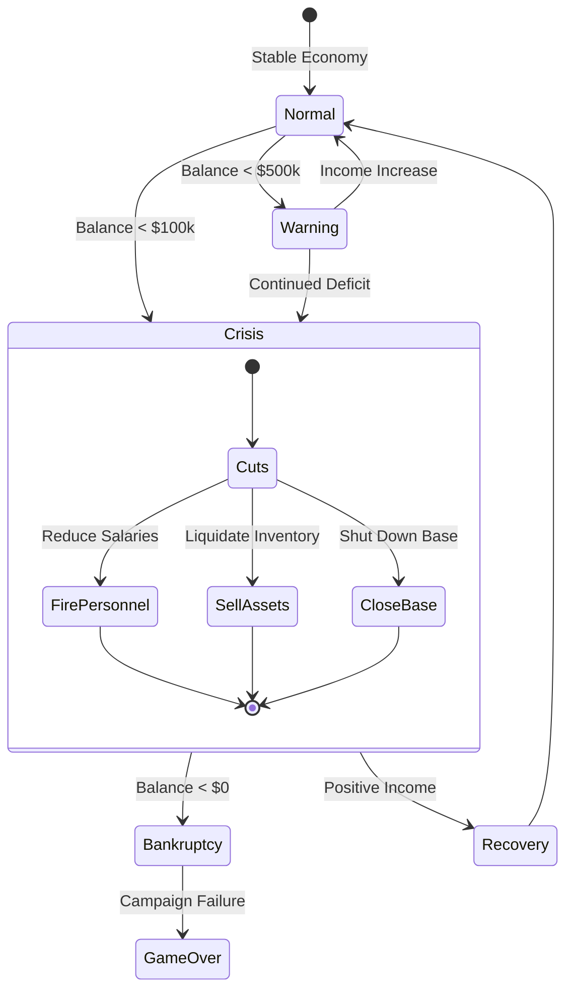
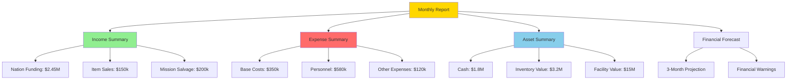
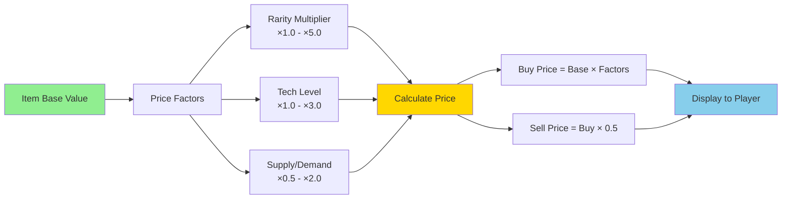
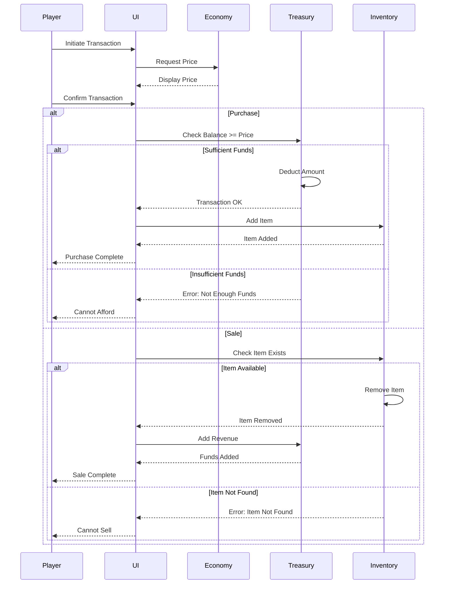

# Economy System Architecture

**System:** Economy & Finance  
**Date:** 2025-10-27  
**Status:** Complete

---

## Overview

The economy system manages finances, resources, marketplace transactions, and economic balance across all game systems.

---

## Economy Flow

---

## Monthly Financial Cycle

---

## Resource Management

---

## Marketplace System

### Market Pricing Table

| Item Category | Buy Price | Sell Price | Availability |
|--------------|-----------|------------|--------------|
| **Basic Weapons** | $1,000 - $5,000 | 50% | Always |
| **Advanced Weapons** | $10,000 - $50,000 | 50% | Tech required |
| **Basic Armor** | $2,000 - $8,000 | 50% | Always |
| **Advanced Armor** | $15,000 - $80,000 | 50% | Tech required |
| **Equipment** | $500 - $5,000 | 50% | Always |
| **Alien Artifacts** | N/A | $10,000 - $100,000 | Mission loot |
| **Alien Corpses** | N/A | $2,000 - $20,000 | Mission loot |
| **Live Aliens** | N/A | $50,000 - $200,000 | Mission capture |

---

## Salvage System

---

## Budget Allocation

---

## Economic Crisis Events

---

## Financial Reports

---

## Pricing Algorithm

---

## Economic Balance Tuning

| Phase | Average Income | Average Expenses | Target Balance | Difficulty |
|-------|---------------|------------------|----------------|------------|
| **Early (Months 1-3)** | $800k/month | $400k/month | $1-2M | Easy |
| **Mid (Months 4-8)** | $2.5M/month | $1.5M/month | $5-8M | Medium |
| **Late (Months 9-12)** | $4M/month | $3M/month | $10-15M | Hard |
| **End Game (13+)** | $5M/month | $4M/month | $20M+ | Hardest |

---

## Transaction System

---

## Performance Metrics

| Metric | Target | Warning | Critical |
|--------|--------|---------|----------|
| **Monthly Net Income** | > $500k | < $200k | < $0 |
| **Cash Reserve** | > $2M | < $500k | < $100k |
| **Asset Value** | > $10M | < $5M | < $2M |
| **Expense Ratio** | < 60% | > 80% | > 100% |
| **Nation Satisfaction** | > 70% | < 50% | < 30% |

---

**End of Economy System Architecture**

