# GUI & Widget System Architecture

**System:** User Interface & Widgets  
**Date:** 2025-10-27  
**Status:** Complete

---

## Overview

The GUI system provides a comprehensive widget framework for building game interfaces with a 24×24 pixel grid system.

---

## Widget System Architecture

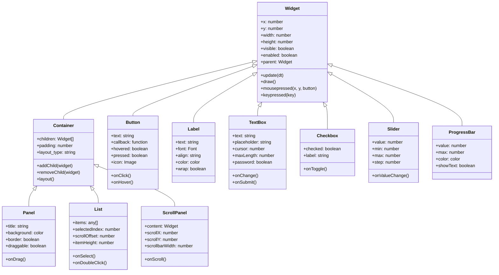

---

## Event Flow

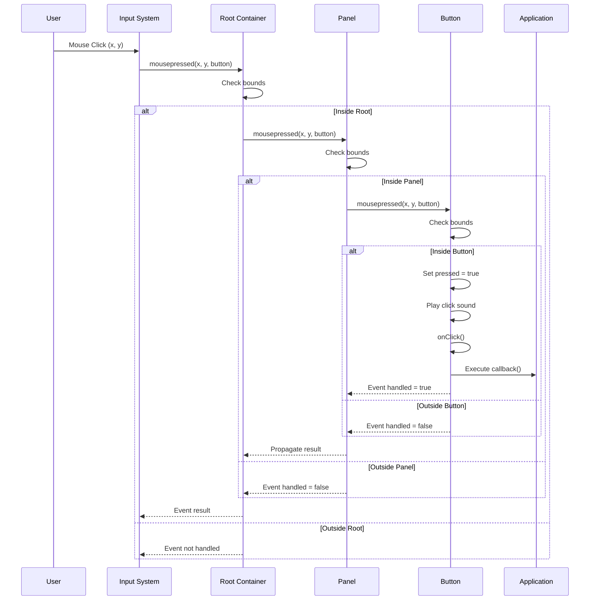

---

## Layout System

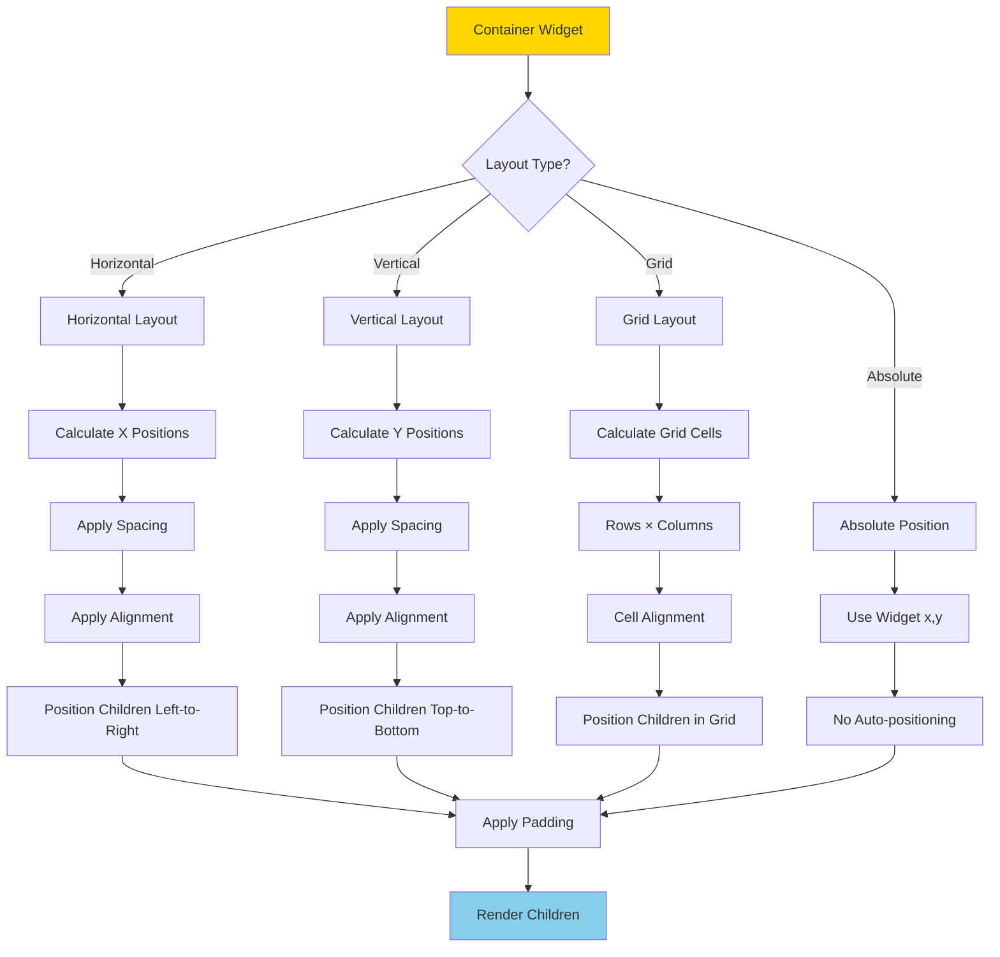

---

## Grid System (24×24 pixels)

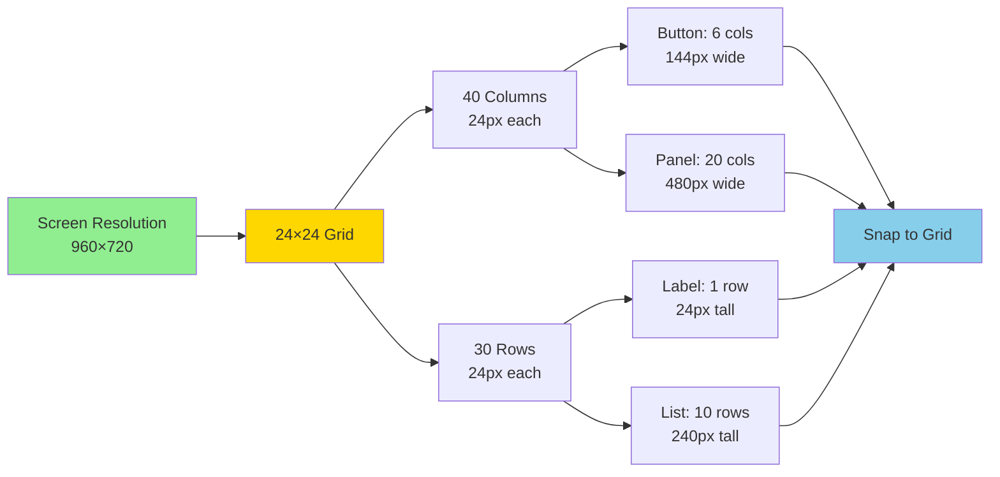

### Grid Layout Table

| Element | Grid Size | Pixel Size | Use Case |
|---------|-----------|------------|----------|
| **Icon** | 1×1 | 24×24 | Small icons, buttons |
| **Button** | 6×2 | 144×48 | Standard button |
| **Panel Header** | 20×1 | 480×24 | Panel title bar |
| **Input Field** | 10×2 | 240×48 | Text input |
| **List Item** | 15×1 | 360×24 | List row |
| **Dialog** | 20×15 | 480×360 | Modal dialog |
| **Full Screen** | 40×30 | 960×720 | Full UI |

---

## Widget States

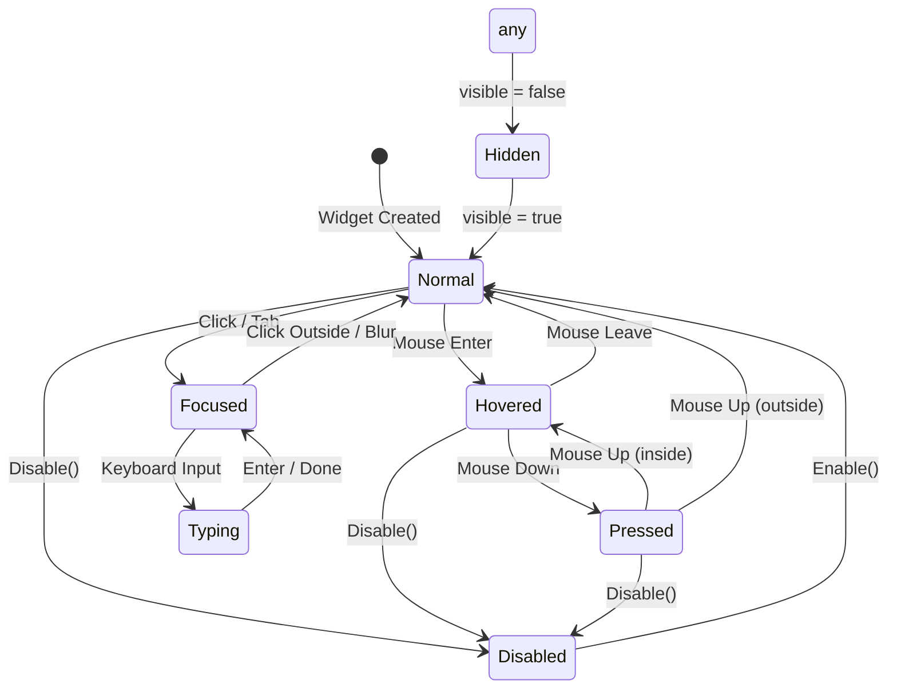

---

## Theme System

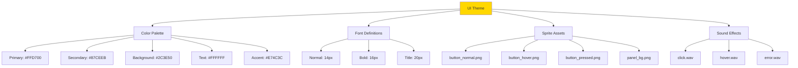

---

## Common UI Patterns

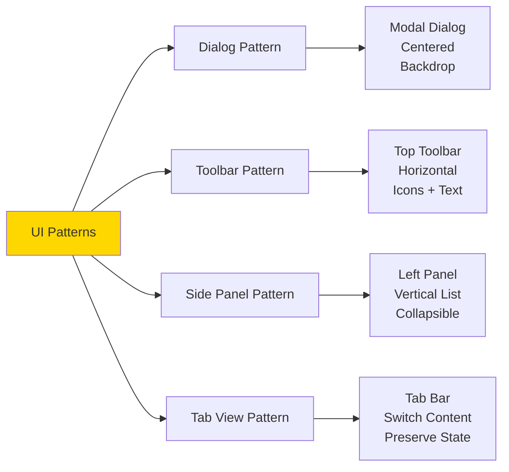

---

## Responsive Scaling

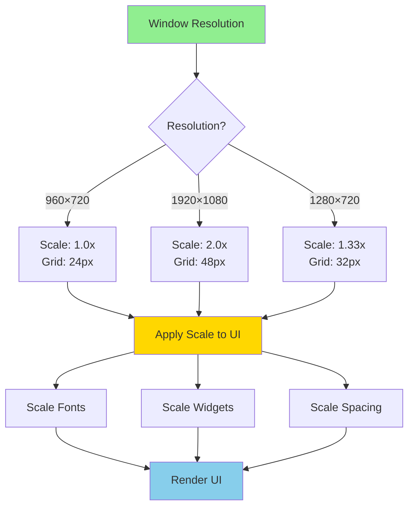

---

## Animation System

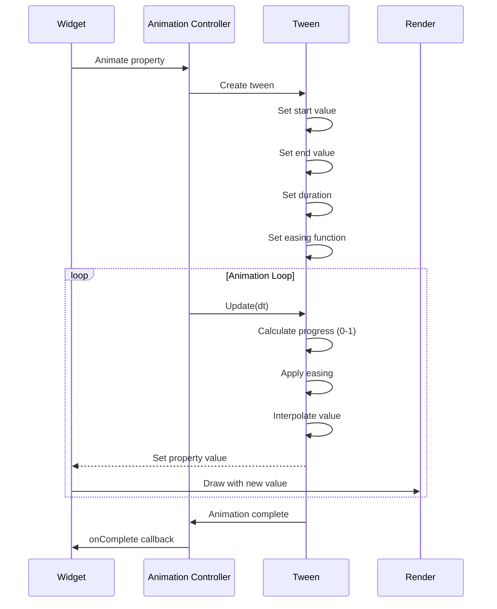

---

## Widget Lifecycle

```mermaid
graph TD
    Create[Create Widget] --> Initialize[Initialize Properties]
    
    Initialize --> AddToParent[Add to Parent Container]
    
    AddToParent --> Layout[Layout Calculation]
    Layout --> Visible[Set Visible = true]
    
    Visible --> UpdateLoop[Update Loop]
    
    UpdateLoop --> Update[update(dt)]
    Update --> HandleInput[Handle Input Events]
    HandleInput --> Draw[draw()]
    Draw --> UpdateLoop
    
    UpdateLoop --> Remove[Remove Widget]
    
    Remove --> Cleanup[Cleanup Resources]
    Cleanup --> RemoveFromParent[Remove from Parent]
    RemoveFromParent --> Destroy[Destroy Widget]
    
    style Create fill:#90EE90
    style UpdateLoop fill:#FFD700
    style Destroy fill:#FF6B6B
```

---

## Performance Optimization

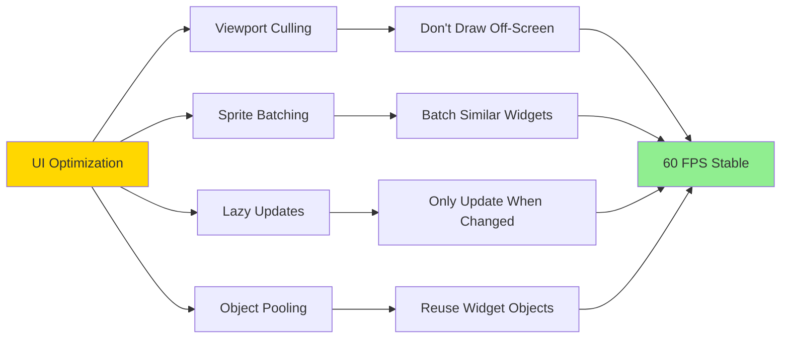

---

## Widget Library

| Widget | Purpose | Common Props | Example |
|--------|---------|--------------|---------|
| **Button** | Clickable action | text, onClick | "Start Mission" |
| **Label** | Display text | text, color | "Health: 25/30" |
| **TextBox** | Text input | text, maxLength | Enter name |
| **Panel** | Container with frame | title, draggable | Settings panel |
| **List** | Scrollable items | items, onSelect | Soldier roster |
| **Checkbox** | Boolean toggle | checked, onToggle | Enable autosave |
| **Slider** | Number range | value, min, max | Volume: 0-100 |
| **ProgressBar** | Show progress | value, max | Loading: 75% |
| **ScrollPanel** | Scrollable content | content | Long text |
| **TabView** | Multiple pages | tabs, content | Options tabs |

---

## Accessibility Features

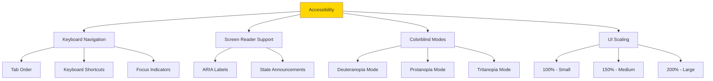

---

**End of GUI & Widget System Architecture**

