# Modding System Architecture

**System:** Modding Framework & Tools  
**Date:** 2025-10-27  
**Status:** Complete

---

## Overview

Comprehensive modding system allowing custom content, overrides, and extensions through TOML files and Lua scripts.

---

## Modding Architecture


---

## Mod Structure (v2)


---

## Mod Manifest (mod.toml)

```toml
# Mod Manifest Example

[metadata]
id = "awesome_weapons_mod"
name = "Awesome Weapons Pack"
version = "1.2.0"
author = "ModAuthor"
description = "Adds 20 new futuristic weapons"
format_version = 2
engine_version = "1.0.0"
homepage = "https://example.com/mod"
tags = ["weapons", "balance", "content"]

[load_order]
priority = 25
load_after = ["core"]
load_before = ["balance_mod"]

[dependencies]
required = ["core@1.0.0"]
optional = ["advanced_armors@2.0.0"]
conflicts = ["old_weapons_mod"]

[content]
units = "content/units/"
items = "content/items/"
weapons = "content/weapons/"

[assets]
images = "assets/images/"
sounds = "assets/sounds/"

[hooks]
on_init = "scripts/init.lua"
on_load = "scripts/load.lua"
on_save = "scripts/save.lua"

[compatibility]
min_game_version = "1.0.0"
max_game_version = "1.9.9"
```

---

## Mod Loading Pipeline


---

## Content Override System


---

## Mod Categories


---

## Script Hooks


### Hook Example

```lua
-- scripts/init.lua

local mod = {
    name = "Awesome Weapons Mod",
    version = "1.2.0"
}

function mod.on_init()
    print("[" .. mod.name .. "] Initializing...")
    
    -- Register custom event listeners
    EventBus:registerListener("unit.created", mod.on_unit_created)
    
    -- Add custom data
    GameData.custom_weapons = mod.load_weapons()
    
    print("[" .. mod.name .. "] Loaded " .. #GameData.custom_weapons .. " weapons")
end

function mod.on_unit_created(event)
    local unit = event.unit
    -- Custom logic when unit is created
    if unit.type == "soldier" then
        unit:addPerk("weapon_specialist")
    end
end

function mod.load_weapons()
    -- Load custom weapon data
    return {
        {id = "plasma_rifle_mk2", damage = 60, ...},
        {id = "graviton_beam", damage = 80, ...}
    }
end

return mod
```

---

## Mod Validation

```mermaid
graph TD
    Validate[Validate Mod] --> CheckManifest{mod.toml Valid?}
    
    CheckManifest -->|No| Error1[Invalid Manifest]
    CheckManifest -->|Yes| CheckVersion{Engine Version?}
    
    CheckVersion -->|Incompatible| Error2[Version Mismatch]
    CheckVersion -->|Compatible| CheckDeps{Dependencies?}
    
    CheckDeps -->|Missing| Error3[Missing Dependencies]
    CheckDeps -->|Conflicts| Error4[Mod Conflicts]
    CheckDeps -->|OK| CheckContent{Content Valid?}
    
    CheckContent -->|No| Error5[Invalid Content]
    CheckContent -->|Yes| CheckAssets{Assets Valid?}
    
    CheckAssets -->|No| Warning1[Missing Assets]
    CheckAssets -->|Yes| Success[Mod Valid]
    
    Error1 --> Report[Error Report]
    Error2 --> Report
    Error3 --> Report
    Error4 --> Report
    Error5 --> Report
    Warning1 --> Success
    
    Report --> Log[Log to Console]
    Success --> LoadMod[Load Mod]
    
    style Validate fill:#90EE90
    style Success fill:#87CEEB
    style Error1 fill:#FF6B6B
```



---

## Mod Manager UI


---

## Workshop Integration


---

## Mod Creation Workflow


---

## Mod Compatibility

| Aspect | Strategy | Example |
|--------|----------|---------|
| **Version** | Semantic versioning | 1.2.3 |
| **Dependencies** | Explicit declaration | required = ["core@1.0.0"] |
| **Conflicts** | Conflict detection | conflicts = ["old_mod"] |
| **Overrides** | Priority-based | priority = 25 |
| **API** | Stable mod API | ModAPI v1.0 |

---

## Best Practices


---

## Mod API Reference

### Content Registration

```lua
-- Register custom unit
ModAPI.registerUnit({
    id = "custom_soldier",
    name = "Elite Soldier",
    hp = 35,
    -- ...more properties
})

-- Register custom weapon
ModAPI.registerWeapon({
    id = "plasma_cannon",
    name = "Plasma Cannon",
    damage = 60,
    -- ...more properties
})

-- Register custom mission
ModAPI.registerMission({
    id = "custom_terror",
    name = "Urban Terror",
    type = "terror",
    -- ...more properties
})
```

### Event Listeners

```lua
-- Listen to game events
ModAPI.on("unit.killed", function(event)
    print("Unit killed: " .. event.unit_id)
end)

ModAPI.on("mission.complete", function(event)
    print("Mission result: " .. event.result)
end)
```

---

**End of Modding System Architecture**

