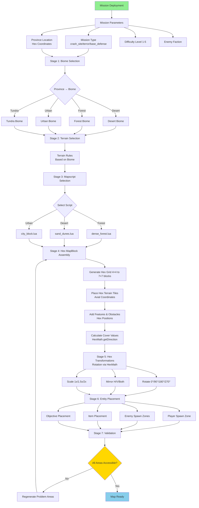
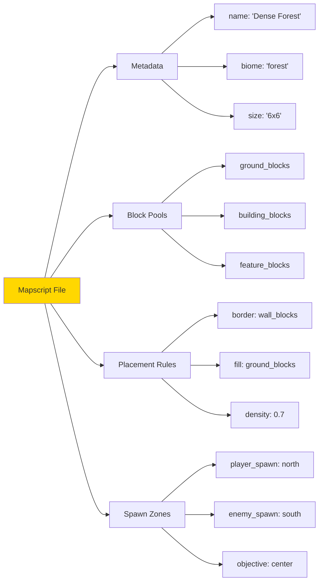
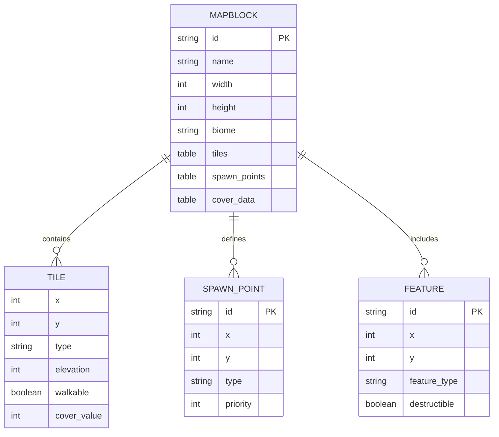
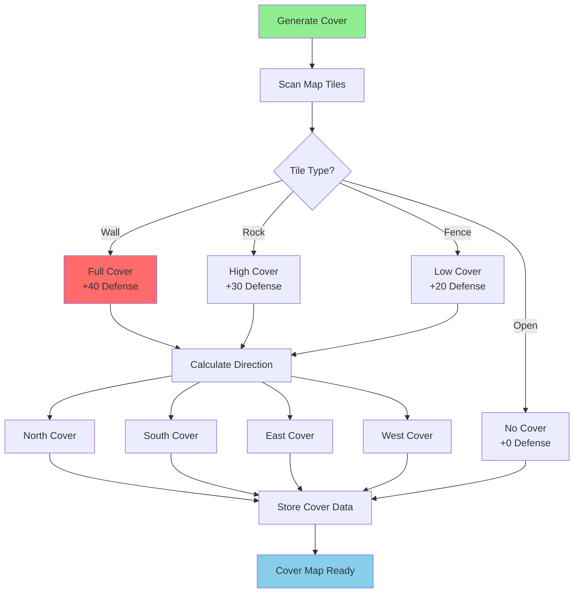
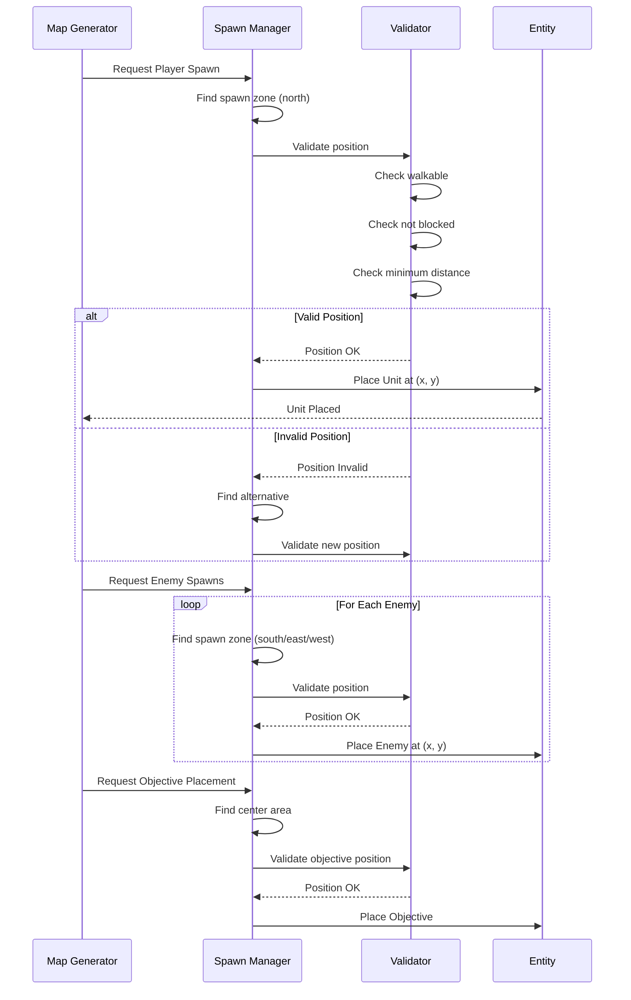
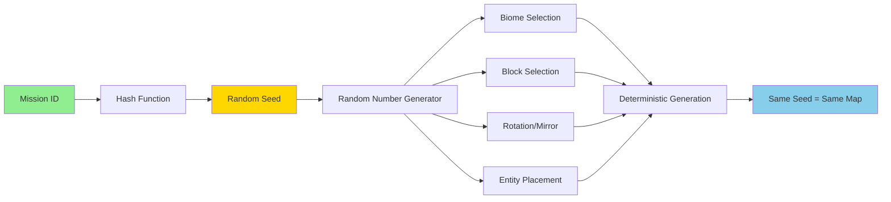
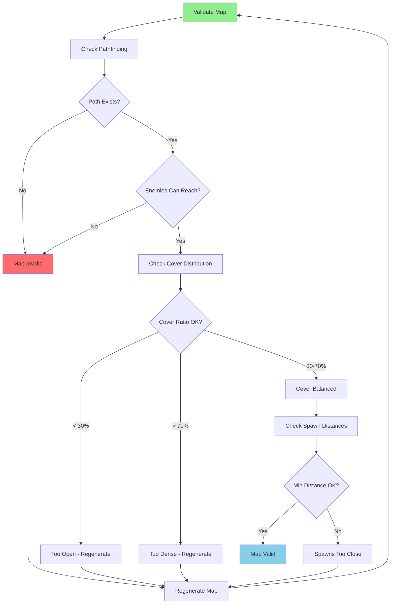

# Procedural Map Generation Architecture - Hex-Based

**System:** Map & Content Generation  
**Date:** 2025-10-28  
**Status:** Complete  
**Coordinate System:** Vertical Axial (Flat-Top Hexagons)

---

## Overview

The procedural generation system creates unique tactical maps, missions, and content using mapscripts, mapblocks, and biome-based rules. **All maps are generated using vertical axial hex grid system.**

### Hex-Based Map Generation

**Map structure:**
- **Grid:** 4×4 to 7×7 map blocks
- **Block Size:** 15 hexes per block (ring pattern)
- **Total Size:** 60×60 to 105×105 hexes
- **Coordinates:** All positions use axial `{q, r}`
- **Placement:** HexMath for block positioning and transformations

**Design Reference:** `design/mechanics/hex_vertical_axial_system.md`  
**Core Module:** `engine/battlescape/battle_ecs/hex_math.lua`

---

## Map Generation Pipeline



---

## Mapscript System



---

## MapBlock Structure



---

## Biome System

```mermaid
graph TD
    Biomes[Biome Types] --> Forest[Forest Biome]
    Biomes --> Desert[Desert Biome]
    Biomes --> Urban[Urban Biome]
    Biomes --> Tundra[Tundra Biome]
    Biomes --> Mountain[Mountain Biome]
    
    Forest --> FTerrain[Terrain: Grass, Dirt, Mud]
    Forest --> FFeatures[Features: Trees, Rocks, Streams]
    Forest --> FCover[Cover: Dense vegetation]
    
    Desert --> DTerrain[Terrain: Sand, Rock, Dunes]
    Desert --> DFeatures[Features: Cacti, Rocks, Ruins]
    Desert --> DCover[Cover: Sparse rocks]
    
    Urban --> UTerrain[Terrain: Concrete, Asphalt]
    Urban --> UFeatures[Features: Buildings, Cars, Fences]
    Urban --> UCover[Cover: Walls, vehicles]
    
    Tundra --> TTerrain[Terrain: Snow, Ice, Rock]
    Tundra --> TFeatures[Features: Trees, Ice formations]
    Tundra --> TCover[Cover: Snow drifts, rocks]
    
    Mountain --> MTerrain[Terrain: Rock, Cliff, Gravel]
    Mountain --> MFeatures[Features: Boulders, Caves]
    Mountain --> MCover[Cover: Rock formations]
    
    style Biomes fill:#FFD700
    style Forest fill:#90EE90
    style Desert fill:#FFE5B4
    style Urban fill:#87CEEB
    style Tundra fill:#E0E0FF
    style Mountain fill:#A9A9A9
```



---

## Terrain Types

| Terrain | Movement Cost | Cover Bonus | Visual | Biome |
|---------|--------------|-------------|--------|-------|
| **Grass** | 1.0 | +0 | Green tiles | Forest, Tundra |
| **Dirt** | 1.1 | +0 | Brown tiles | Forest, Desert |
| **Sand** | 1.3 | +0 | Yellow tiles | Desert |
| **Rock** | 1.5 | +10 | Gray tiles | Mountain, Desert |
| **Snow** | 1.4 | +5 | White tiles | Tundra |
| **Concrete** | 0.9 | +0 | Gray tiles | Urban |
| **Water** | 2.0 | -10 | Blue tiles | Forest, Tundra |
| **Mud** | 1.8 | +0 | Dark brown | Forest |

---

## Cover Generation



---

## Entity Placement



---

## Random Seed System



---

## Mapscript Example

```lua
-- Example Mapscript: Dense Forest

return {
    metadata = {
        id = "dense_forest",
        name = "Dense Forest",
        biome = "forest",
        size = {width = 6, height = 6},
        difficulty_range = {1, 3}
    },
    
    block_pools = {
        ground = {
            "forest_ground_01",
            "forest_ground_02",
            "forest_clearing"
        },
        trees = {
            "tree_cluster_dense",
            "tree_cluster_sparse",
            "single_tree"
        },
        features = {
            "rock_formation",
            "stream",
            "fallen_log"
        }
    },
    
    placement_rules = {
        border = "tree_wall",
        fill = {
            ground = 0.4,
            trees = 0.4,
            features = 0.2
        },
        min_clear_path = true
    },
    
    spawn_zones = {
        player = {area = "north", count = 4},
        enemy = {area = "south", count = {6, 10}},
        objective = {area = "center", type = "ufo_crash"}
    }
}
```

---

## Validation System



---

## Performance Considerations

| Component | Optimization | Impact |
|-----------|-------------|--------|
| **Map Generation** | Cached mapblocks | Fast generation (< 1s) |
| **Pathfinding** | Pre-calculated grid | Fast validation |
| **Cover Calculation** | Cached per tile | Instant lookups |
| **Seed-based RNG** | Reproducible maps | Consistent results |
| **Tile Culling** | Only render visible | 60 FPS stable |

---

**End of Procedural Map Generation Architecture**

