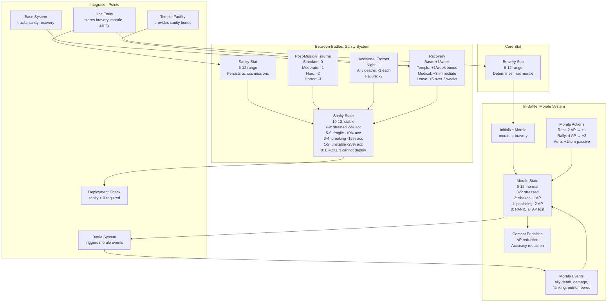
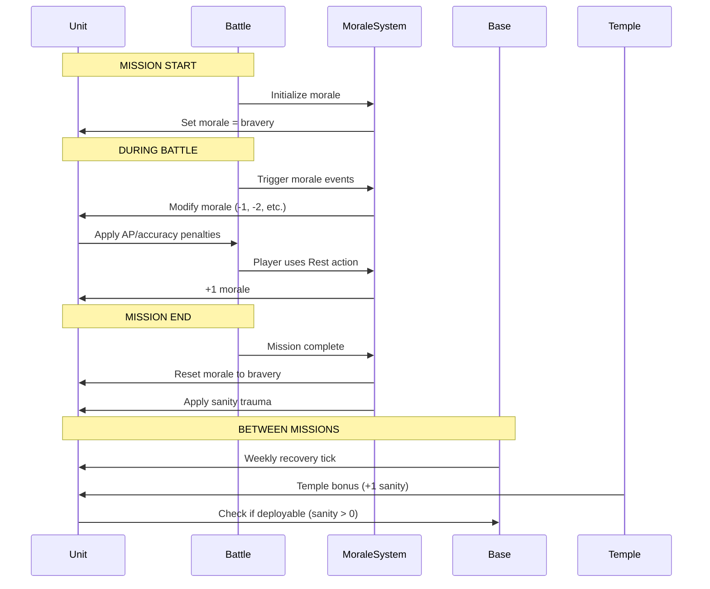

# Psychological Systems Architecture

> **System**: Morale, Bravery, and Sanity  
> **Layer**: Battlescape (Morale) + Geoscape (Sanity Recovery)  
> **Status**: Complete Design, Implementation In Progress  
> **Last Updated**: 2025-10-28

---

## Overview

The Psychological Systems manage unit mental state across two timeframes:
- **In-Battle** (Morale): Immediate psychological state during combat
- **Between-Battles** (Sanity): Long-term mental health and trauma recovery

**Key Innovation**: Dual-layer psychological warfare system where short-term morale affects tactical performance and long-term sanity affects strategic roster management.

---

## System Architecture



---

## Component Breakdown

### 1. Bravery (Core Stat)

**Module**: `engine/battlescape/combat/unit.lua`

**Properties**:
- Range: 6-12 (standard stat range)
- Base value determined by unit class
- Modified by traits (Brave +2, Fearless +3, Timid -2)
- Modified by equipment (Officer gear +1, Medals +1 per 3)
- Increases with experience (+1 per 3 ranks)

**Purpose**: Foundation for morale capacity in battle

**Integration**:
- Unit entity stores bravery stat
- Used to initialize morale at battle start
- Acts as morale ceiling (cannot exceed bravery)

---

### 2. Morale System (In-Battle)

**Module**: `engine/battlescape/systems/morale_system.lua`

#### 2.1 Initialization

```lua
-- At battle start
unit.morale = unit.bravery
unit.maxMorale = unit.bravery
```

#### 2.2 Morale Events

**Triggers** (automatic from battle events):
- `onAllyKilled(unitId, distance)` → -1 if within 5 hexes
- `onTakeDamage(unitId)` → -1 per hit
- `onCriticalHit(unitId)` → -2 per critical
- `onFlanked(unitId)` → -1 when surrounded
- `onOutnumbered(unitId)` → -1 when 3:1 disadvantage
- `onCommanderKilled(unitId)` → -2 when leader dies
- `onNewAlien(unitId, alienType)` → -1 first encounter
- `onNightMission(unitId)` → -1 at mission start

**Implementation Pattern**:
```lua
function MoraleSystem.onAllyKilled(unitId, distance)
    if distance <= 5 then
        MoraleSystem.modifyMorale(unitId, -1, "ally_death")
    end
end
```

#### 2.3 Morale Thresholds

| Morale | Status | AP Modifier | Accuracy Modifier | State |
|--------|--------|-------------|-------------------|-------|
| 6-12 | Confident | 0 | 0% | Normal |
| 4-5 | Steady | 0 | -5% | Minor |
| 3 | Stressed | 0 | -10% | Noticeable |
| 2 | Shaken | -1 AP | -15% | Impaired |
| 1 | Panicking | -2 AP | -25% | Severe |
| 0 | PANIC | All AP lost | -50% | Cannot act |

#### 2.4 Morale Actions

**Module**: `engine/battlescape/morale_actions.lua`

**Actions Available**:
1. **Rest Action**
   - Cost: 2 AP
   - Effect: +1 morale
   - Limit: Once per turn
   - Usage: Unit composes themselves

2. **Leader Rally**
   - Cost: 4 AP (leader only)
   - Effect: +2 morale to target within 5 hexes
   - Requirement: "Leadership" trait
   - Limit: Once per turn per leader

3. **Leader Aura** (Passive)
   - Cost: 0 AP (automatic)
   - Effect: +1 morale per turn to units within 8 hexes
   - Active: Always if leader alive
   - Stacks: Multiple leaders do NOT stack

#### 2.5 Morale Reset

**At Mission End**:
```lua
-- Automatically reset
unit.morale = unit.bravery
```

---

### 3. Sanity System (Between-Battles)

**Module**: `engine/battlescape/systems/morale_system.lua` (sanity functions)  
**Recovery Module**: `engine/geoscape/processing/unit_recovery_progression.lua`

#### 3.1 Sanity Stat

**Properties**:
- Range: 6-12 (independent from morale)
- Persists across missions (does NOT reset)
- Affects future deployment readiness
- Recovers slowly over weeks

**Integration**:
- Unit entity stores sanity value
- Checked before deployment (must be > 0)
- Affects starting morale and accuracy

#### 3.2 Post-Mission Sanity Loss

**Module**: `engine/battlescape/systems/morale_system.lua`

**Function**: `applyMissionTrauma(unitId, missionType, isNight, alliesKilled, failed)`

**Base Loss by Difficulty**:
- Standard: 0 sanity loss
- Moderate: -1 sanity
- Hard: -2 sanity
- Horror: -3 sanity

**Additional Factors**:
- Night mission: -1 additional
- Ally killed: -1 per death
- Mission failure: -2 additional

**Example**:
```lua
function MoraleSystem.applyMissionTrauma(unitId, missionType, isNight, alliesKilled, failed)
    local loss = 0
    
    -- Base loss
    if missionType == "horror" then loss = loss + 3
    elseif missionType == "hard" then loss = loss + 2
    elseif missionType == "moderate" then loss = loss + 1
    end
    
    -- Additional factors
    if isNight then loss = loss + 1 end
    loss = loss + alliesKilled
    if failed then loss = loss + 2 end
    
    MoraleSystem.modifySanity(unitId, -loss, "mission_trauma")
end
```

#### 3.3 Sanity Thresholds

| Sanity | Status | Accuracy | Morale Start | Deployment |
|--------|--------|----------|--------------|------------|
| 10-12 | Stable | 0% | Normal | Normal |
| 7-9 | Strained | -5% | Normal | Normal |
| 5-6 | Fragile | -10% | -1 morale | Risky |
| 3-4 | Breaking | -15% | -2 morale | Avoid |
| 1-2 | Unstable | -25% | -3 morale | Emergency only |
| 0 | BROKEN | N/A | N/A | **Cannot deploy** |

#### 3.4 Sanity Recovery

**Module**: `engine/geoscape/processing/unit_recovery_progression.lua`

**Passive Recovery**:
```lua
-- Weekly update
function weeklyBaseRecovery(unitId)
    MoraleSystem.modifySanity(unitId, 1, "base_recovery")
end

-- If Temple exists at base
function weeklyTempleRecovery(unitId, hasTemple)
    if hasTemple then
        MoraleSystem.modifySanity(unitId, 1, "temple_bonus")
    end
end
```

**Active Recovery Options**:
1. **Medical Treatment**
   - Cost: 10,000 credits
   - Effect: +3 sanity immediately
   - Availability: Always (if funds available)

2. **Leave/Vacation**
   - Cost: 5,000 credits
   - Effect: +5 sanity over 2 weeks
   - Duration: Unit unavailable for 2 weeks

#### 3.5 Broken State (Sanity = 0)

**Effects**:
- Unit marked as "Broken"
- Cannot be deployed on ANY mission
- Occupies roster slot but unavailable
- Requires treatment to restore

**Treatment**:
- Temple/Base recovery: +1/week (slow)
- Medical treatment: +3 immediate (10K credits)
- Minimum 3 weeks to redeploy (need sanity ≥ 3)

---

## Data Flow

### Battle Start → Battle End → Recovery



---

## Integration Points

### With Battle System

**File**: `engine/battlescape/combat/battle.lua`

**Integration**:
- Call `MoraleSystem.initUnit()` at battle start
- Trigger morale events on combat actions
- Check morale state before unit actions
- Apply AP/accuracy penalties from morale
- Reset morale at mission end

### With Unit System

**File**: `engine/battlescape/combat/unit.lua`

**Integration**:
- Store bravery, morale, sanity in unit entity
- Provide getter functions for psychological state
- Calculate total penalties (morale + sanity)
- Check deployment eligibility (sanity > 0)

### With Base System

**File**: `engine/basescape/base_system.lua`

**Integration**:
- Weekly recovery tick for all units at base
- Check for Temple facility existence
- Apply Temple bonus if present
- Track unit availability for deployment

### With Temple Facility

**File**: `engine/basescape/facilities/temple_facility.lua`

**Integration**:
- Provide sanity recovery bonus service
- Check facility operational status
- Apply bonus to all units at base
- Cost: 12K, Power: 8, Size: 2x2

---

## Performance Considerations

**Optimization Strategies**:
1. **Event Batching**: Process morale events once per turn, not per action
2. **State Caching**: Cache calculated penalties, recalculate only on morale change
3. **Lazy Evaluation**: Only calculate penalties when needed for action
4. **Weekly Updates**: Sanity recovery processed in batch during time tick

**Memory Impact**:
- Per unit: +3 numbers (morale, sanity, maxMorale)
- Per battle: 1 morale system instance
- Total: Minimal (<1KB per 100 units)

---

## Testing Strategy

### Unit Tests

**File**: `tests2/battlescape/morale_system_test.lua`

**Coverage**:
- Bravery initialization (6-12 range)
- Each morale event function (8 tests)
- Each action function (3 tests)
- Threshold penalties (5 tests)
- Panic state (3 tests)
- Morale reset (1 test)

**File**: `tests2/battlescape/sanity_system_test.lua`

**Coverage**:
- Post-mission trauma (4 difficulty levels)
- Additional trauma factors (4 tests)
- Recovery mechanics (4 tests)
- Broken state (3 tests)
- Accuracy penalties (5 tests)

### Integration Tests

**File**: `tests2/integration/morale_sanity_integration_test.lua`

**Coverage**:
- Complete mission flow (morale during + sanity after)
- Penalty stacking (morale + sanity)
- Recovery cycles (weekly + Temple)
- Roster rotation scenarios

---

## Configuration

### TOML Files

**File**: `mods/core/rules/unit/psychological_traits.toml`

```toml
[traits.brave]
name = "Brave"
description = "Increased bravery and morale resistance"
bravery_bonus = 2
category = "psychological"

[traits.fearless]
name = "Fearless"
description = "Exceptional courage under fire"
bravery_bonus = 3
category = "psychological"
rarity = "rare"

[traits.timid]
name = "Timid"
description = "Easily shaken in combat"
bravery_penalty = 2
category = "psychological"
is_negative = true
```

**File**: `mods/core/rules/facility/temple.toml`

```toml
[facilities.temple]
id = "temple"
name = "Temple"
description = "Provides sanity recovery and mental health support"
size = "2x2"
cost = 12000
build_time = 14
power_consumption = 8
services = ["sanity_recovery", "psi_education"]
sanity_bonus = 1  # +1 per week to all units
```

---

## Future Enhancements

**Potential Additions**:
1. **Morale Contagion**: Panic spreads to nearby units
2. **Veteran Immunity**: High-rank units partially immune to morale loss
3. **Phobia System**: Units develop specific fears (aliens, fire, etc.)
4. **PTSD Traits**: Permanent sanity modifiers from extreme trauma
5. **Meditation Actions**: Alternative sanity recovery options

---

## Dependencies

**Required Systems**:
- ✅ Unit system (stores psychological stats)
- ✅ Battle system (triggers morale events)
- ✅ Base system (manages recovery)
- ✅ Time system (weekly recovery ticks)
- ✅ Facility system (Temple integration)

**External References**:
- `design/mechanics/MoraleBraverySanity.md` (design spec)
- `api/UNITS.md` (API functions)

---

**Last Updated**: 2025-10-28  
**Status**: Architecture Complete, Implementation In Progress  
**Version**: 1.0

