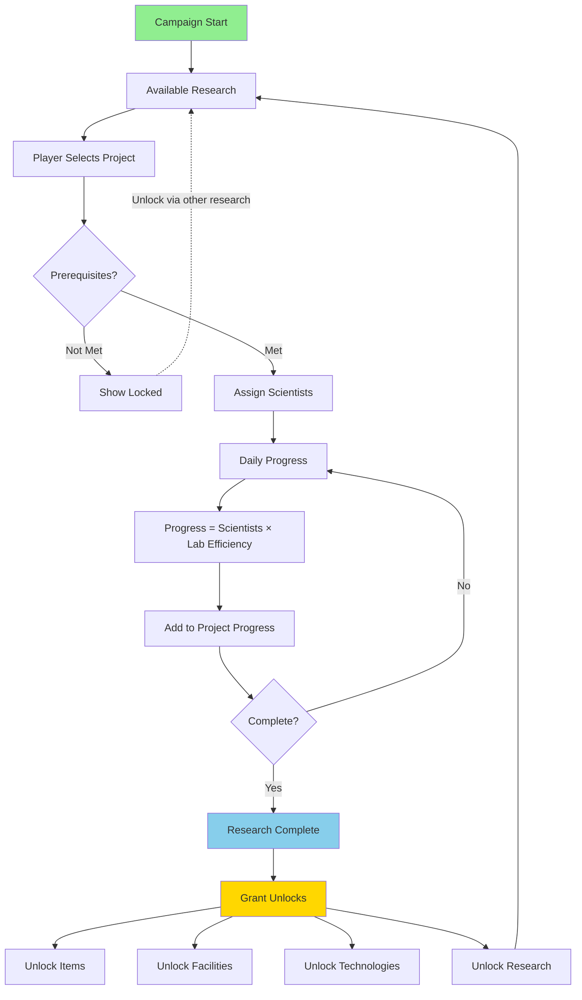
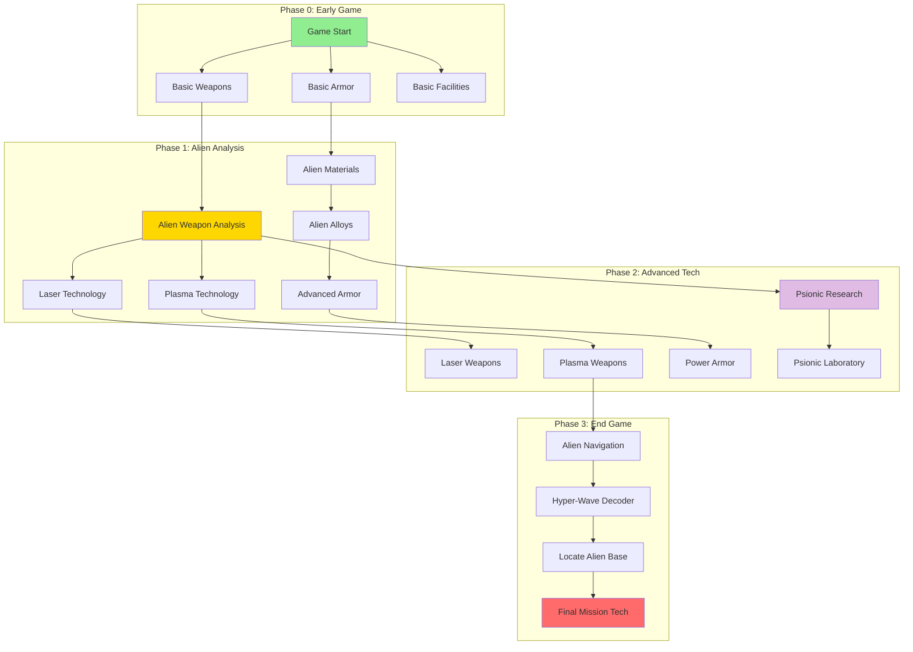
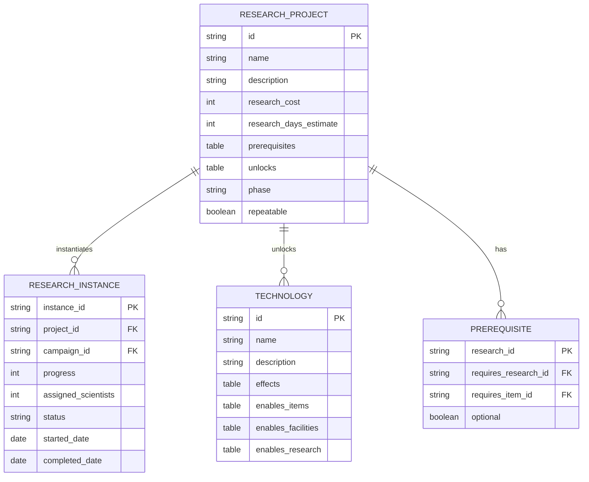
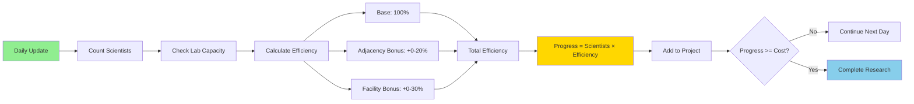
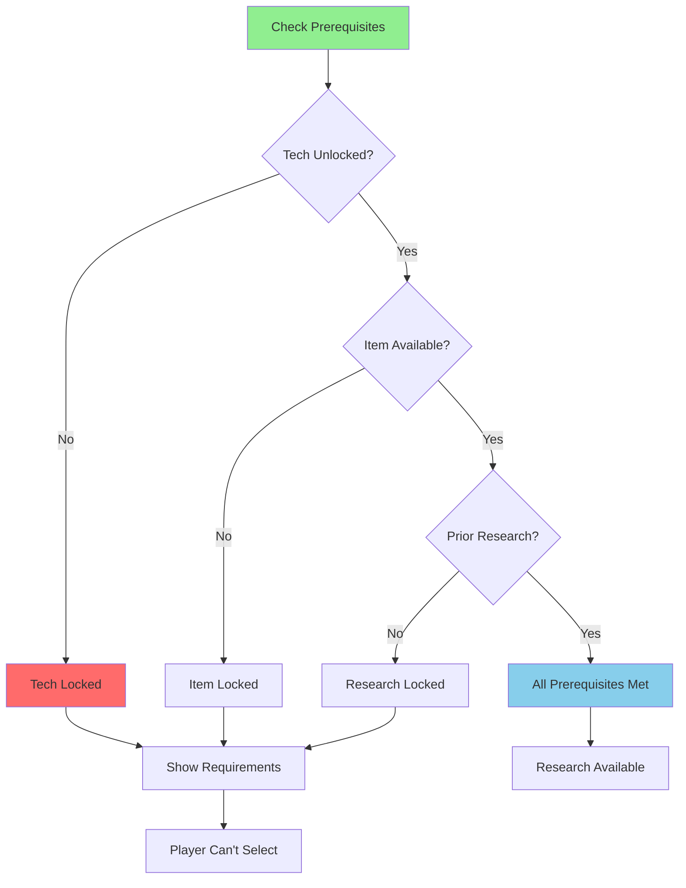
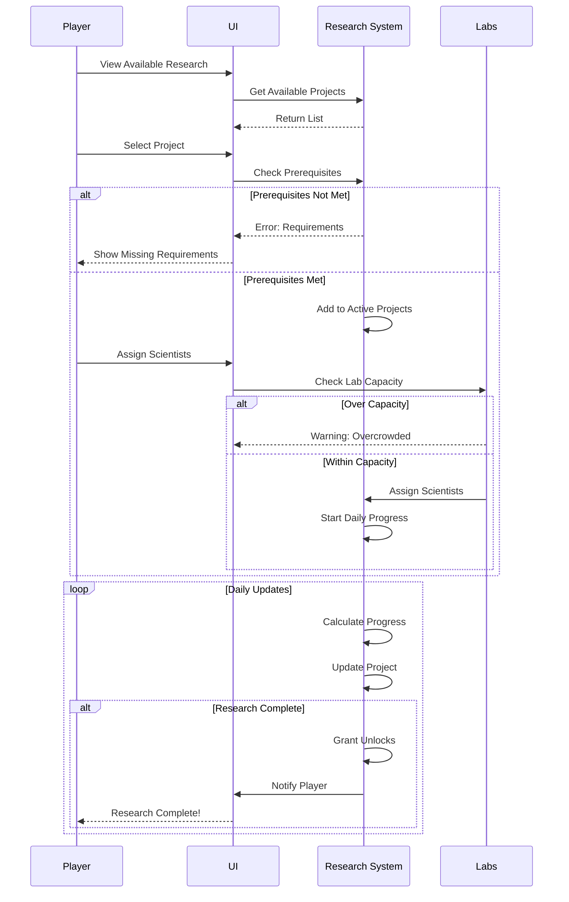
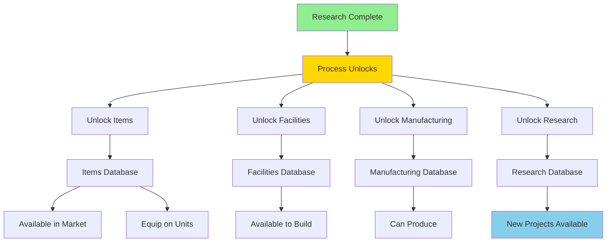
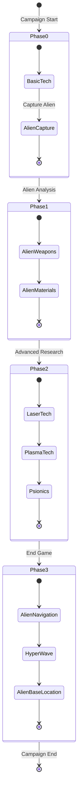
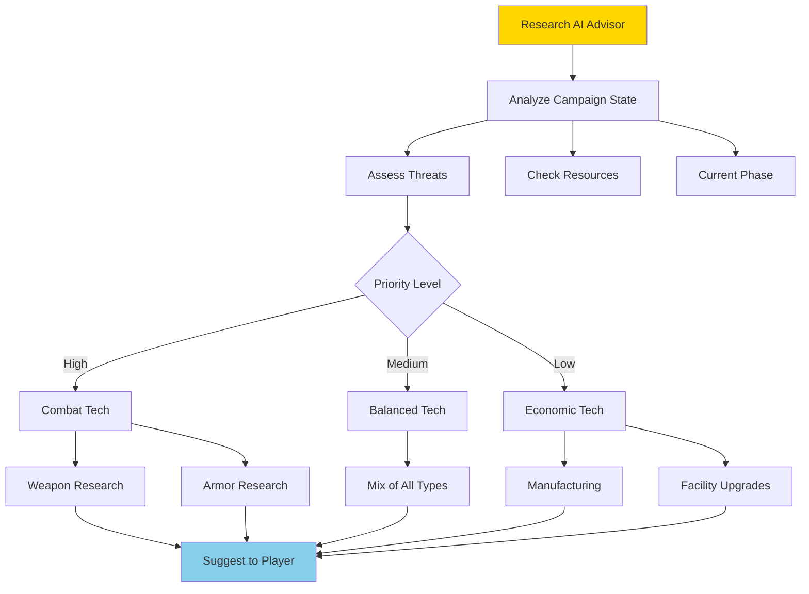

# Research System Architecture

**System:** Research & Technology  
**Date:** 2025-10-27  
**Status:** Complete

---

## Overview

The research system manages technology progression, tech trees, and unlockable content throughout the campaign.

---

## Research Flow



---

## Tech Tree Structure



---

## Research Project Data



---

## Research Progress Calculation



### Research Speed Formula

| Factor | Base Value | Modifiers | Impact |
|--------|-----------|-----------|---------|
| **Scientists** | 1-20 per project | Skill level: +0-20% | Direct multiplier |
| **Lab Efficiency** | 100% | Adjacent labs: +10% each | Efficiency boost |
| **Facility Type** | Standard lab: 100% | Advanced lab: +25% | Speed increase |
| **Campaign Phase** | Phase 0: Normal | Late game: -20% cost | Balance tuning |

---

## Prerequisite System



---

## Research Queue Management



---

## Tech Unlock Effects



---

## Research Phases



---

## Research Project Template

```lua
-- Example Research Project
{
    id = "laser_weapons",
    name = "Laser Weapons",
    description = "Develop laser-based weaponry from alien technology",
    
    -- Requirements
    prerequisites = {
        research = {"alien_weapon_analysis"},
        items = {"alien_power_source"},
        tech = {"laser_technology"}
    },
    
    -- Cost
    research_cost = 150,  -- Research points needed
    estimated_days = 20,   -- With 1 scientist
    
    -- Phase
    phase = 1,
    repeatable = false,
    
    -- Unlocks
    unlocks = {
        items = {"laser_rifle", "laser_pistol", "laser_cannon"},
        manufacturing = {"laser_rifle", "laser_pistol"},
        research = {"heavy_laser", "laser_defense_system"},
        technologies = {"laser_weapons_tech"}
    },
    
    -- Rewards
    rewards = {
        experience = 500,
        credits = 10000
    }
}
```

---

## Research Priority AI



---

## Performance Optimization

| Component | Optimization | Impact |
|-----------|-------------|--------|
| **Daily Updates** | Batch processing | All research updated once |
| **Prerequisite Check** | Cached dependencies | Fast validation |
| **Tech Tree** | Graph traversal cache | Quick unlocks |
| **UI Updates** | Event-driven | Only update on change |

---

**End of Research System Architecture**

