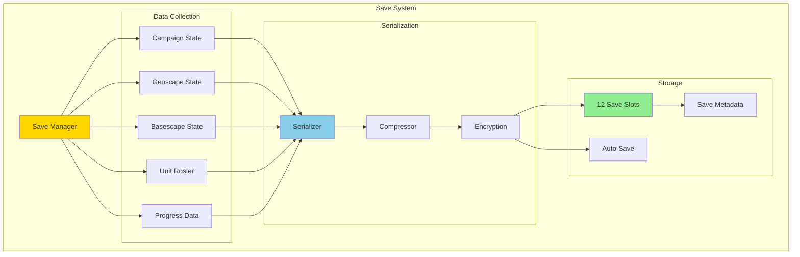
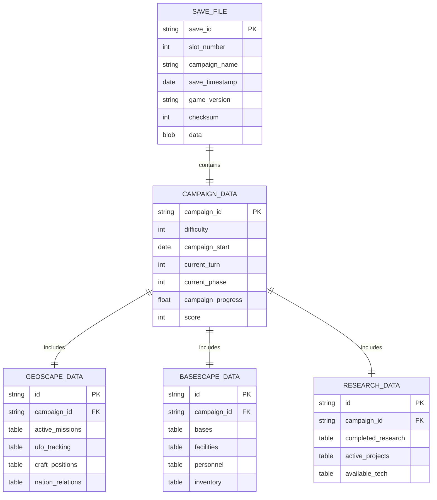
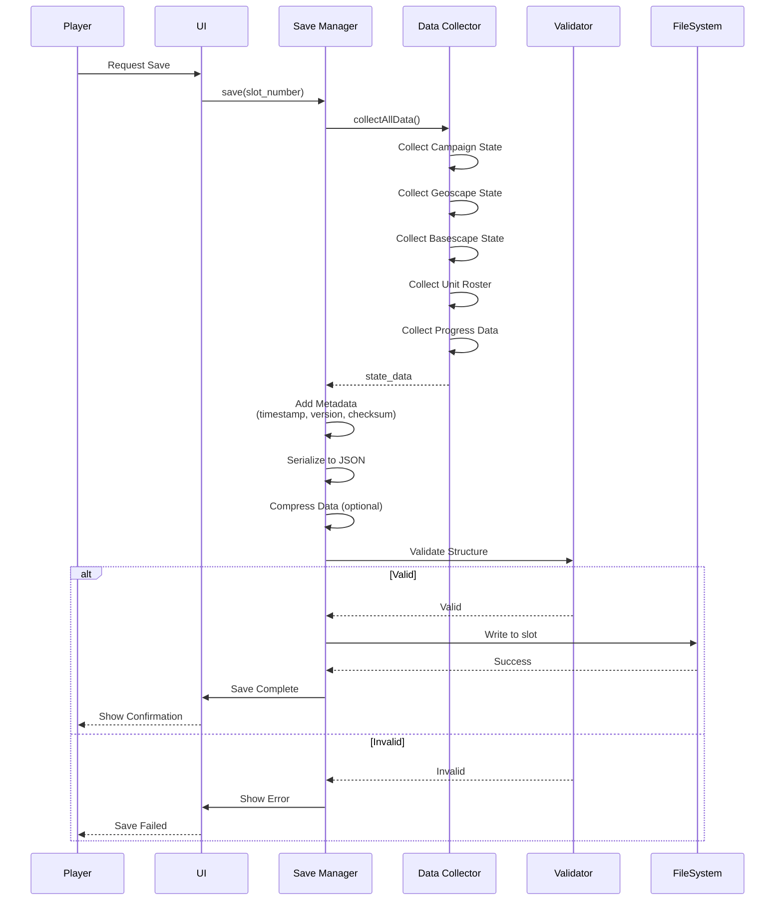
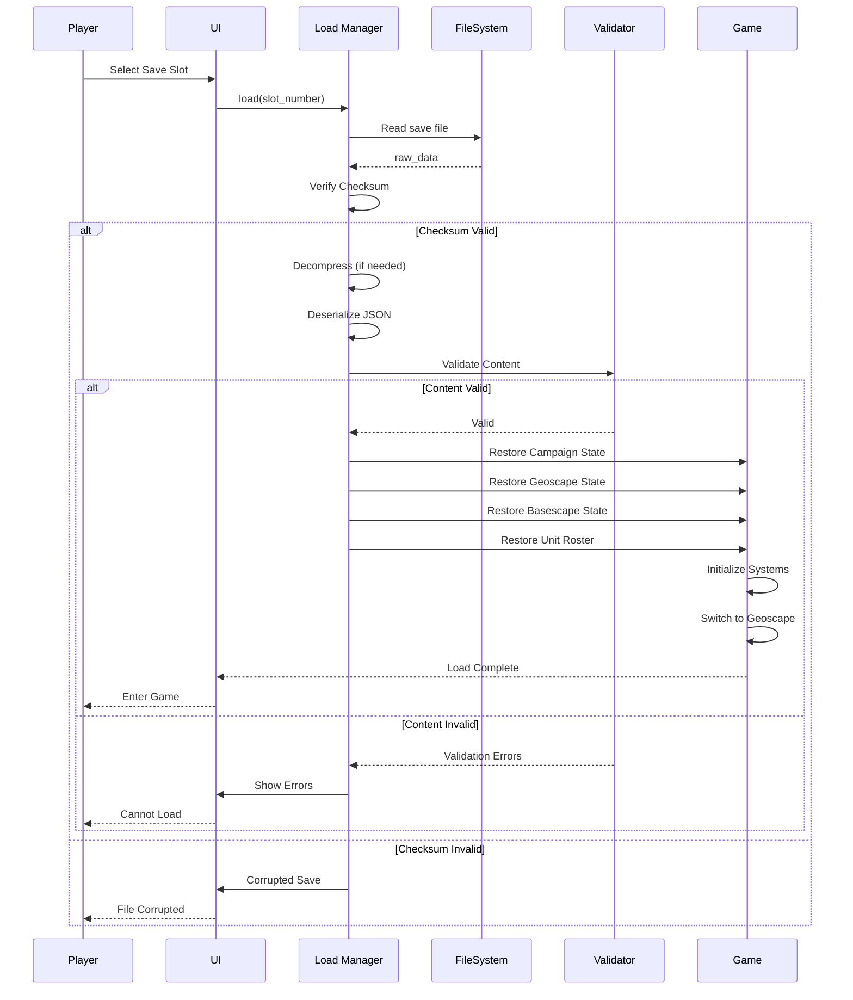
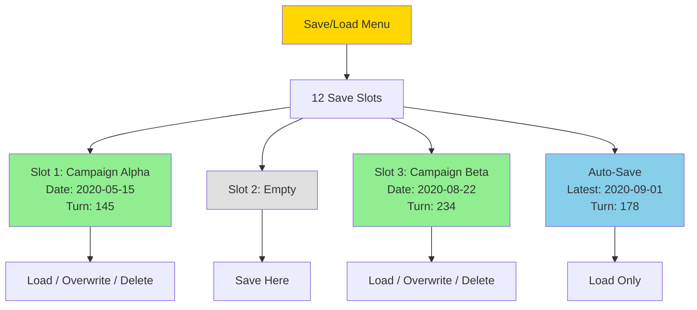
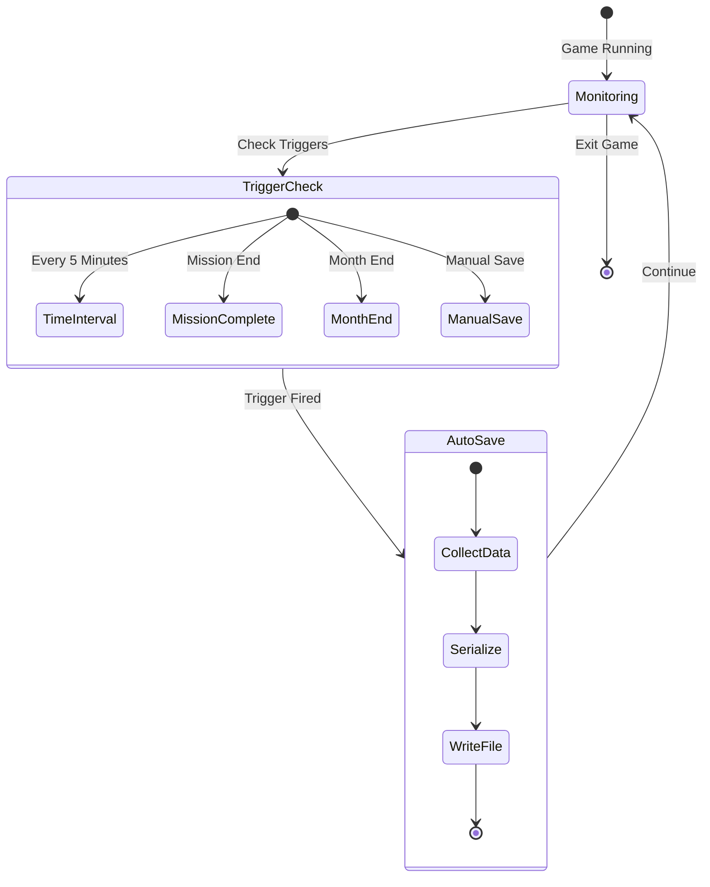
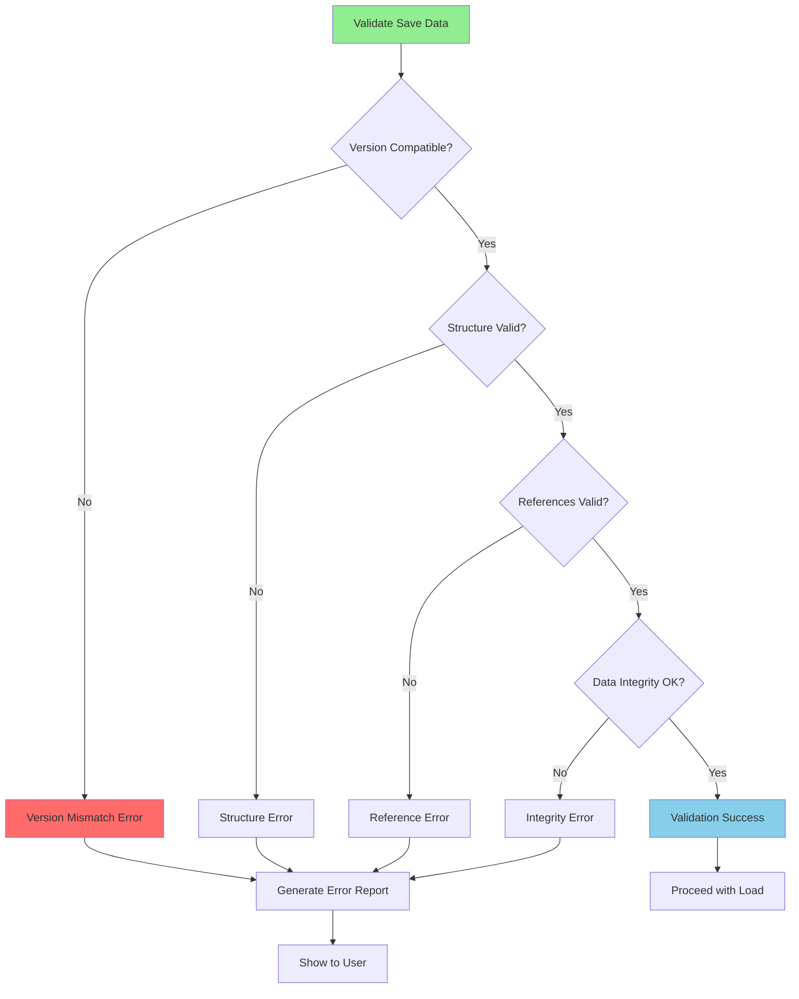
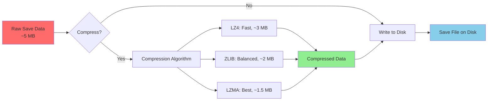
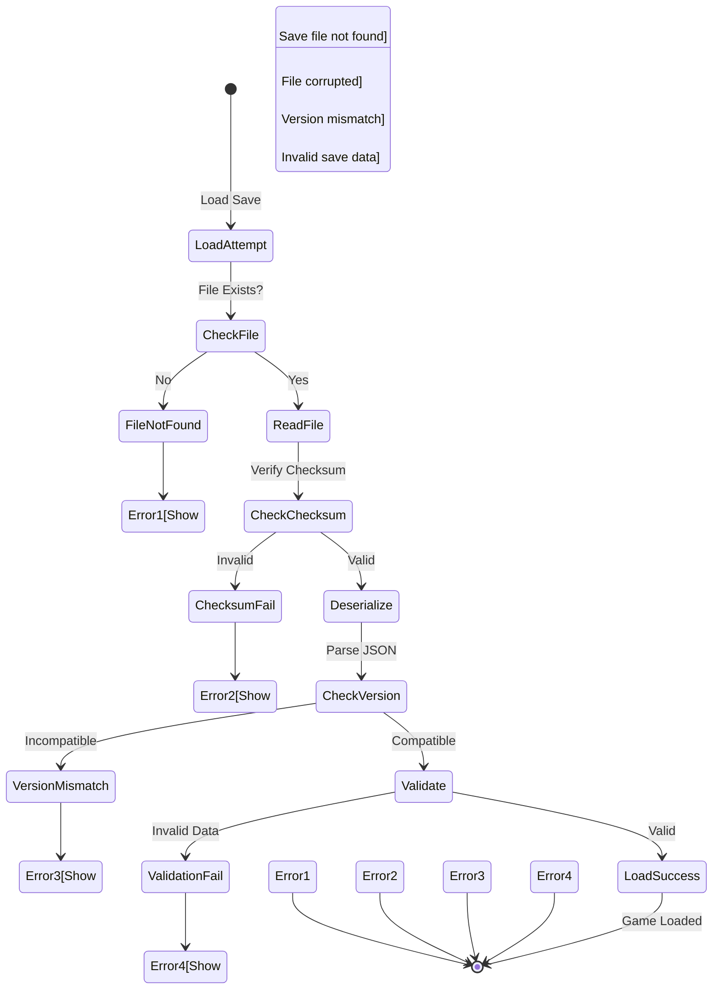

# Save & Load System Architecture

**System:** Game Persistence  
**Date:** 2025-10-27  
**Status:** Complete

---

## Overview

The save/load system provides campaign persistence across 12 save slots with auto-save, data validation, and version compatibility.

---

## Save System Architecture



---

## Save Game Data Structure



---

## Save Flow



---

## Load Flow



---

## Save Slots UI



---

## Auto-Save System



---

## Data Validation



---

## Save File Format

```lua
-- Example Save File Structure (JSON)
{
    header = {
        save_id = "save_001",
        slot_number = 1,
        game_version = "1.0.0",
        save_date = "2025-10-27T15:30:00Z",
        campaign_name = "Operation Vigilant Storm",
        checksum = "a1b2c3d4e5f6"
    },
    
    campaign = {
        campaign_id = "campaign_001",
        difficulty = "commander",
        start_date = "2020-01-01",
        current_turn = 145,
        current_phase = 2,
        score = 8500
    },
    
    geoscape = {
        active_missions = {
            {mission_id = "mission_045", type = "crash_site", ...},
            {mission_id = "mission_046", type = "terror", ...}
        },
        craft_positions = {
            {craft_id = "interceptor_1", x = 120, y = 45},
            {craft_id = "transport_1", x = 200, y = 100}
        },
        nation_relations = {
            {nation_id = "usa", panic = 15, funding = 800000},
            {nation_id = "china", panic = 25, funding = 600000}
        }
    },
    
    basescape = {
        bases = {
            {
                base_id = "base_1",
                name = "HQ",
                location = {x = 100, y = 50},
                facilities = {...},
                personnel = {...}
            }
        },
        inventory = {
            {item_id = "rifle", quantity = 15},
            {item_id = "laser_rifle", quantity = 5}
        }
    },
    
    research = {
        completed = {"basic_weapons", "alien_alloys"},
        active = {
            {project_id = "laser_weapons", progress = 87}
        }
    },
    
    statistics = {
        missions_completed = 42,
        missions_won = 35,
        missions_lost = 3,
        total_kills = 234,
        total_deaths = 12
    }
}
```

---

## Compression & Optimization



---

## Version Compatibility

| Save Version | Game Version | Compatible? | Migration |
|--------------|-------------|-------------|-----------|
| **1.0.x** | 1.0.x | ✅ Full | None needed |
| **1.0.x** | 1.1.x | ✅ Forward | Auto-migrate |
| **1.1.x** | 1.0.x | ⚠️ Partial | Some features lost |
| **1.x.x** | 2.x.x | ❌ No | Manual conversion required |

---

## Error Handling



---

## Performance Metrics

| Operation | Target Time | Typical Time | Notes |
|-----------|------------|--------------|-------|
| **Save Game** | < 2s | ~1.5s | Including compression |
| **Load Game** | < 5s | ~3s | Including decompression |
| **Auto-Save** | < 1s | ~0.8s | Background operation |
| **Validate** | < 1s | ~0.5s | Quick checks |

---

**End of Save & Load System Architecture**

