# Purpose and Value

> **BIS Handbook 2.0** — Core Business Foundations and Strategic Direction  
> **Last Updated:** September 13, 2025  
> **Navigation:** [🏠 Main Handbook](../README.md) | [Next: Customer Experience](02-Customer-Experience.md)

---

## Section Overview

**Overview:** Establishes the foundational business objectives, value proposition, and success metrics for BIS. Explains what BIS is, why it exists, and how it delivers value.

**Target Audience:** All stakeholders, especially executives, business leaders, and new team members seeking to understand the big picture.

**How to Use:** Start here for any BIS engagement. Use this section to align stakeholders, define objectives, and communicate value.

**Key Content:** Mission and objectives, key value propositions, constraints and non-goals, solution elements, Service•Solution•Squad model, XLA vs SLA framework, experience management.

**Use Cases:** Strategic planning, stakeholder alignment, ROI justification, project initiation, customer presentations.

---

## Executive Summary

**Business Integration Service (BIS)** is a configuration-first analytics and reporting engine that transforms raw data into actionable business insights. BIS bridges IT operations and business outcomes by automating data processing, reporting, and action delivery through an AI-first, config-driven architecture.

---

## Key Value Propositions

| **Benefit** | **Description** | **Impact** |
|-------------|-----------------|------------|
| **🎪 Eliminate Watermelon Effect** | Focus on true business outcomes (XLAs) vs. surface metrics (SLAs) | 30% reduction in metric-outcome discrepancy |
| **📊 Measurement-Driven Management** | "You cannot manage what you cannot measure" | 90% of decisions backed by data |
| **🌉 Bridge IT to Business Value** | Connect technical operations to customer satisfaction | 15% increase in customer satisfaction |
| **🎯 Lean Data over Big Data** | Curated, high-impact information that drives action | 40% less data, 25% more actionable insights |
| **⚙️ Config-First Architecture** | YAML-driven, adaptable to specific organizational needs | 95% fit-for-purpose rating |
| **⚡ Automated Action Delivery** | Reduce communication lead time from days to hours | 48h → 4h insight-to-action time |

## BIS Value Proposition Framework

```mermaid
graph TD
    A[BIS Engine] --> B[Data Processing]
    A --> C[Analytics Engine]
    A --> D[Action Delivery]
    
    B --> E[Lean Data Processing]
    C --> F[Business Intelligence]
    D --> G[Automated Actions]
    
    E --> H[40% Less Data<br/>25% More Insights]
    F --> I[90% Data-Driven<br/>Decisions]
    G --> J[48h → 4h<br/>Response Time]
    
    H --> K[Business Outcomes]
    I --> K
    J --> K
    
    K --> L[15% Higher<br/>Customer Satisfaction]
    K --> M[30% Better<br/>Risk Management]
    K --> N[Lower Total Cost<br/>of Service]
    
    style A fill:#e1f5fe
    style K fill:#c8e6c9
    style L fill:#fff3e0
    style M fill:#fff3e0
    style N fill:#fff3e0
```



## Complete Navigation Guide

### 🎯 **By Role & Responsibility**

| **👤 Role** | **🎯 Primary Focus** | **📖 Start Here** | **🔧 Key Resources** |
|-------------|---------------------|-------------------|---------------------|
| **🏢 Executives** | Business value & ROI | [Purpose & Value](01-Purpose-and-Value.md) | [Business Architecture](03-Business-Architecture.md), [Product Development](11-Product-Development.md) |
| **👩‍💻 Developers** | Implementation & code | [Technical Architecture](04-Technical-Architecture.md) | [Engineering Processes](06-Engineering-Processes.md), [Configuration](05-Configuration.md) |
| **⚙️ Operations** | Deployment & delivery | [Operating Model](10-Operating-Model.md) | [Team & Roles](07-Team-and-Roles.md), [Configuration](05-Configuration.md) |
| **📊 Data Analysts** | Analytics & reporting | [Technical Architecture](04-Technical-Architecture.md) | [Configuration](05-Configuration.md), [Augmented Workload](09-Augmented-Workload.md) |
| **🎯 Product Teams** | Features & customer experience | [Customer Experience](02-Customer-Experience.md) | [Business Architecture](03-Business-Architecture.md), [Product Development](11-Product-Development.md) |

### 🚀 **By Implementation Phase**

| **📅 Phase** | **🎯 Objective** | **📖 Essential Reading** | **⚡ Quick Actions** |
|-------------|------------------|------------------------|-------------------|
| **Phase 1: Planning** | Understand BIS value & scope | [Purpose & Value](01-Purpose-and-Value.md) → [Business Architecture](03-Business-Architecture.md) | Define stakeholders, Set objectives |
| **Phase 2: Architecture** | Design technical foundation | [Technical Architecture](04-Technical-Architecture.md) → [Configuration](05-Configuration.md) | Review system design, Plan integrations |
| **Phase 3: Setup** | Configure development environment | [Configuration](05-Configuration.md) → [Engineering Processes](06-Engineering-Processes.md) | Setup YAML configs, Configure workspaces |
| **Phase 4: Development** | Build & test implementation | [Team & Roles](07-Team-and-Roles.md) → [Augmented Workload](09-Augmented-Workload.md) | Onboard team, Implement features |
| **Phase 5: Delivery** | Deploy & operate solution | [Operating Model](10-Operating-Model.md) → [Customer Experience](02-Customer-Experience.md) | Deploy to production, Onboard customers |
| **Phase 6: Optimization** | Enhance & scale solution | [Best Practices](12-Best-Practices.md) → [Product Development](11-Product-Development.md) | Performance tuning, Feature roadmap |

### 🎓 **By Learning Path**

| **🎓 Learning Track** | **🎯 Skill Level** | **📖 Recommended Sequence** | **⏱️ Time Investment** |
|---------------------|-------------------|---------------------------|----------------------|
| **Business Fundamentals** | Beginner | [Purpose](01-Purpose-and-Value.md) → [Business Architecture](03-Business-Architecture.md) → [Customer Experience](02-Customer-Experience.md) | 4-6 hours |
| **Technical Mastery** | Intermediate | [Technical Architecture](04-Technical-Architecture.md) → [Configuration](05-Configuration.md) → [Engineering Processes](06-Engineering-Processes.md) | 8-12 hours |
| **Operations Excellence** | Advanced | [Team & Roles](07-Team-and-Roles.md) → [Augmented Workload](09-Augmented-Workload.md) → [Operating Model](10-Operating-Model.md) | 6-10 hours |
| **AI-First Development** | Expert | [Augmented Workload](09-Augmented-Workload.md) → [Best Practices](12-Best-Practices.md) | 4-6 hours |
| **Product Management** | Expert | [Business Architecture](03-Business-Architecture.md) → [Product Development](11-Product-Development.md) | 3-5 hours |

---

## Handbook Navigation Guide

### 👥 For New Team Members
**Start Here:** Follow this sequence for comprehensive onboarding
1. [01. Purpose and Value](01-Purpose-and-Value.md) — Understand what we do and why
2. [02. Customer Experience](02-Customer-Experience.md) — Learn about our customers and stakeholders
3. [07. Team and Roles](07-Team-and-Roles.md) — Find your place in the organization
4. [06. Engineering Processes](06-Engineering-Processes.md) — Master our development workflow
5. [12. Best Practices](12-Best-Practices.md) — Learn standards and methodologies

### 👨‍💼 For Business Stakeholders
**Focus Areas:** Business strategy and outcomes
1. [01. Purpose and Value](01-Purpose-and-Value.md) — Business objectives and value delivery
2. [02. Customer Experience](02-Customer-Experience.md) — Customer success and satisfaction
3. [03. Business Architecture](03-Business-Architecture.md) — Strategic planning and KPIs
4. [10. Operating Model](10-Operating-Model.md) — Service delivery and operations
5. [11. Product Development](11-Product-Development.md) — Roadmap and feature planning

### 👨‍💻 For Technical Team Members
**Core Resources:** Technical implementation and development
1. [04. Technical Architecture](04-Technical-Architecture.md) — System design and data models
2. [05. Configuration](05-Configuration.md) — API specs and workspace setup
3. [06. Engineering Processes](06-Engineering-Processes.md) — Development and deployment
4. [09. Augmented Workload](09-Augmented-Workload.md) — AI integration and automation
5. [13. References](13-References.md) — API documentation and tooling

### 🤖 For AI Agents and Automation
**Reference Materials:** Structured data for automated processing
1. [05. Configuration](05-Configuration.md) — YAML schemas and validation rules
2. [13. References](13-References.md) — API reference and glossary
3. [12. Best Practices](12-Best-Practices.md) — Standards for automated workflows
4. [04. Technical Architecture](04-Technical-Architecture.md) — System interfaces and contracts

### Navigation Tips

> 🎯 **For Humans:** Start with [01. Purpose and Value](01-Purpose-and-Value.md), then follow role-based navigation above  
> 🤖 **For AI Agents:** Use [05. Configuration](05-Configuration.md) and [13. References](13-References.md) as primary references  
> 📚 **For Complete Context:** All 13 handbook sections provide comprehensive coverage of BIS system  
> 🔄 **Stay Updated:** Check [08. Knowledge Management](08-Knowledge-Management.md) for content lifecycle and updates

---

## Core Business Foundations

**BIS Mission:** Drive organizational improvement through holistic, data-driven management.

BIS = Business Integration Service • Solution • Squad • Synergy • Skills. This framing is used consistently across documentation, proposals, and code comments.

**Core Problem Addressed**: The "watermelon effect" where Service Level Agreements (SLAs) appear green but customer experience (Experience Level Agreements - XLAs) suffers. BIS shifts focus from merely fulfilling SLAs to delivering real value and satisfaction, bridging the gap between IT outputs and business outcomes.

**Solution Elements**: BIS delivers better analytics, faster client delivery, and business relevance through:
- **DevOps Practices**: Continuous integration/deployment for rapid delivery and automation
- **Scrum Framework**: Governance, product backlogs, and sprints for agility and velocity
- **Lean Methodologies**: PDCA (Plan-Do-Check-Act), value stream mapping, ROI tracking, Kaizen
- **Business Observability**: Insights for better decision-making and service improvement
- **Experience Management**: Client-focused services meeting expectations and business outcomes
- **Culture Change**: Fostering co-creation and collaboration habits
- **Generative Elements**: AI-driven co-creation of tailored solutions

**Design Tenets**:
- Relevance over volume: the right few signals beat a thousand KPIs
- Determinism over magic: what you run today, you can run tomorrow and get the same results
- Simplicity over ceremony: fewer moving parts, more value delivered

---

## Problem Statement

**Core Challenges BIS Addresses:**
- **Watermelon Effect**: IT outputs (SLAs) don't translate to business outcomes (XLAs) - green outside, red inside
- **Data Fragmentation**: Siloed data and processes prevent actionable insights despite automated data flows
- **Value Disconnect**: Lack of clear connection between IT activities and business goals
- **Compliance ≠ Value**: Fulfilling contractual obligations doesn't guarantee improved customer experience
- **Non-Actionable Dashboards**: Require significant manual effort to prioritize and execute actions
- **Report Gaps**: Either lack of reports or existing reports are not actionable

---

## Solution Design

BIS provides a holistic, data-driven solution connecting IT operations to business value by:
- **Translating** business requirements into concrete, measurable actions
- **Delivering** tailored analytics and smart actions to right stakeholders
- **Fostering** collaboration across vendors, teams, and business units
- **Supporting** culture of continuous improvement and data-driven decision-making

This ensures organizations not only meet SLAs but achieve meaningful business results, enhance customer satisfaction, and drive ongoing value.

---

## Business Context

### Autoranking System
- Customer provides **weights and priorities** for different business aspects
- **Automatic scoring** calculates priorities for actions and data
- **Context-aware sorting** ensures business relevance in processing and delivery
- **CSV-based configuration** allows easy updates by business users
- Supports both **qualitative and quantitative** analysis

### CSI Integration
- **Continuous Service Improvement** process integrated into BIS
- CSI manager and **Service Improvement Plan (SIP)** drive BIS requirements
- BIS can track and manage CSI process itself

### Stakeholder Management
- **Business Owners**: Responsible for specific business context and processes
- **SMEs**: Provide domain-specific expertise and requirements
- **BIS Squad**: Expert in data processing, analytics, and automation
- **Clear Boundaries**: BIS team handles technical implementation, not domain expertise

### Data Exclusions & Customization
- **Custom exclusions** stored in CSV files in CUSTOM folder
- **Modification rules** for standard processing
- **Iterative implementation**: Vertical (many practices, reporting only) and horizontal (single practice, all layers)

---

## Objectives

BIS addresses consistent problems and responds with BIS design solutions:

| Problem | BIS Design Response |
|---|---|
| Watermelon effect where SLAs look green but experience is red | Focus on XLAs and autoranked actions tied to outcomes |
| Data fragmentation and value disconnect | Config-first ELT to a structured lake with consistent contracts |
| Non-actionable dashboards | Personalized Excel with symptoms and actions delivered to owners |

**Success Criteria**:
- Clear mapping from indicators to actions and owners
- Deterministic, tenant-isolated outputs per run
- Measurable XLA improvements over baseline

### Key Objectives

- **Eliminate the watermelon effect** by focusing on true business outcomes: Addresses the common issue where surface-level metrics appear positive while underlying customer experience suffers. BIS shifts focus to XLAs, ensuring actions are driven by real impact rather than vanity metrics.
  - **SMART Goal Example**: Reduce the discrepancy between green SLAs and red XLAs by 30% within 6 months by implementing 5 new cross-functional indicators that correlate with customer satisfaction scores.

- **Enable measurement-driven management**: "You cannot manage what you cannot measure": Provides tools and frameworks to quantify performance, enabling leaders to make informed decisions based on data, reducing guesswork and improving accountability.
  - **SMART Goal Example**: Ensure that 90% of all operational management decisions in supported business units are backed by data from BIS reports by the end of the fiscal year.

- **Bridge IT value to business value**, enhancing end-to-end customer satisfaction: Connects technical operations to business outcomes, aligning teams and fostering collaboration.
  - **SMART Goal Example**: Increase customer satisfaction score for IT services by 15% over the next 12 months by aligning IT deliverables with top 3 business-defined value drivers.

- **Prioritize relevant, actionable data** (Lean Data over Big Data): Focuses on curated, high-impact information that drives immediate actions, making data management efficient and user-friendly.
  - **SMART Goal Example**: Reduce data volume processed by 40% while increasing report actionability by 25% (as rated by business owners) within two quarters.

- **Tailor solutions to fit specific organization needs**, not generic models: Configurable and adaptable, ensuring relevance and effectiveness without one-size-fits-all limitations.
  - **SMART Goal Example**: Achieve 95% "fit-for-purpose" rating from stakeholders on all new reports and indicators delivered in the next 6 months.

- **Reduce communication lead time** with automated, code-based action delivery: Automation speeds up information flow, enabling faster responses and reducing manual overhead.
  - **SMART Goal Example**: Decrease average time from insight-generation to action-delivery from 48 hours to 4 hours for all P1 indicators within the next quarter.

- **Integrate business dimensions** via automation: Creates unified view across stakeholders, breaking down silos and enabling holistic management.
  - **SMART Goal Example**: Automate integration of data from 3 new external vendor systems by end of Q3, providing unified view of supply chain performance.

- **Foster digital partnerships** and continuous service improvement (CSI) through agile indicator development: Promotes ongoing improvement and strong partnerships with customers.
  - **SMART Goal Example**: Reduce average time to develop and deploy new indicator from 4 weeks to 1 week by end of year, enabling faster response to changing business needs.

- **Support data-driven culture**: People act according to how they are measured: Embeds data into daily workflows, encouraging evidence-based decision-making and continuous learning.
  - **SMART Goal Example**: Launch "Data-Driven Decisions" initiative and track that 80% of team members reference BIS data in monthly performance reviews within 9 months.

---

## Value Proposition

BIS bridges the gap between IT outputs (SLAs) and business outcomes (XLAs) by:
- Translating business requirements into measurable, actionable analytics and smart actions.
- Delivering tailored reports and prioritized actions to the right stakeholders, improving daily operations and long-term outcomes.
- Fostering collaboration across vendors, teams, and business units, ensuring all efforts contribute to shared business goals.
- Supporting a culture of continuous improvement and data-driven decision-making.

### Inputs
- **Business requirements or problem statements**: Detailed descriptions of challenges, goals, and success criteria provided by stakeholders
- **Data sources and connections**: Integration points for various data systems, including databases, APIs, and files
- **Business context (contracts, priorities)**: Information on agreements, SLAs, and strategic priorities to align BIS outputs with organizational goals
- **Stakeholders and owners**: Identification of key individuals and teams responsible for outcomes
- **Domain knowledge (SME expertise)**: Insights from subject matter experts to ensure accurate interpretation and application of data
- **Internal control points and audit requirements**: Compliance frameworks and audit trails to maintain governance and traceability

### Outputs
- **Reports**: Generic reports configured as code, allowing flexible, repeatable generation
- **SLA Reports**: Monthly (closed period) and daily (month-to-date) summaries of service level achievements
- **Business Observability Dashboard**: All SLAs in unified view, offering real-time visibility into key metrics
- **Augmented Actions**: Personalized, prioritized actions for owners, including recommendations, deadlines, and impact assessments
- **Automated documentation and specifications** for AI agents, reducing manual documentation overhead

### Key Enablers
- **Strong partnership and cooperation with customers**: Collaborative relationships that drive co-creation and ensure solutions meet real needs
- **Focus on XLAs over SLAs**: Emphasis on customer experience metrics to deliver meaningful outcomes
- **Shorter lead times through automation**: Streamlined processes that accelerate delivery from insight to action
- **Dedicated DataOps squad methodology**: Specialized team structure for efficient data operations and continuous improvement
- **Modern data stack tools and automation**: Cutting-edge technologies like DuckDB, Parquet, and AI to enhance capabilities

---

## Constraints and Non-Goals

Understanding boundaries is crucial for effective implementation and expectation management.

### Constraints
- **Single-Host Deployment**: Engine and DuckDB run in-process on single host (desktop or server), not distributed cluster
- **Windows-Specific Features**: Certain features like automated email delivery via Outlook COM are Windows-only
- **Local Filesystem Lake**: Default data lake stored on local filesystem, though cloud storage accessible via extensions

### Non-Goals
- **Not an Enterprise Scheduler**: Includes basic scheduler but not intended to replace enterprise-grade workflow orchestration
- **No Cross-Tenant Data Mixing**: Tenant data strictly isolated to ensure security and governance
- **Not a Centralized Log Store**: Produces logs for runs but does not provide centralized, persistent log aggregation
- **Not a Dashboard Platform**: Backend engine producing data and reports, not self-service BI or dashboarding tool

---

## SMART Outcomes

Three example SMART outcomes:
- **Improve first-contact resolution by 10 percent quarter over quarter**
- **Reduce monthly backlog growth to zero for top critical services**
- **Publish consolidated SLA report by day three of each month**

### SMART Reinterpreted for BIS
- **Synergy** — integrated across data, roles, and practices
- **Modern** — open source, as code, AI-enabled
- **Assistant** — personalized actions, no dashboard by default
- **Relevant** — business context and co-creation
- **Transform** — cultural and digital shift to data-driven

### Why Customers Choose BIS
- Fast time-to-value with low ceremony and minimal infrastructure
- Clear ownership and delivery to inboxes—no "go fetch" analytics
- Scales with ambition: start small, grow methodically, stay in control

---

## 4S Systems

| Aspect | Service | Solution | Squad |
|---|---|---|---|
| Scope | Business observability and action delivery across practices | Python engine with DuckDB and Parquet, Excel outputs, Outlook delivery | Cross-functional DataOps team operating YAML-first pipelines |
| In-scope | SLA/XLA reporting, actions, Excel delivery | Layered engine (model/low/high/excl/gui/tool) | BA, DA, DE, Architect, Engine Dev, Planner |
| Out-of-scope | Generic dashboards as first-class deliverables | Centralized log store, multi-tenant cross-mixing | Vendor-side ops and domain expertise |
| Ownership | Customer outcomes and XLAs | Engine code and declarative API | Roles per Chatmodes personas |
| KPIs | XLA uplift, action closure rate, time to value | Build time, data quality gates, publish success | Lead time, change failure rate, review throughput |

### How It Comes Together
- **Service**: Run business observability service aligning incentives and spotlighting what truly matters
- **Solution**: Layered Python engine tuned for speed, reliability, and extensibility
- **Squad**: Nimble, AI-augmented team shipping value quickly and safely

---

## Navigation Tips

> 🎯 **For Humans:** Start with [Purpose & Value](01-Purpose-and-Value.md), then follow role-based navigation  
> 🤖 **For AI Agents:** Use [AI System Architecture](14-AI-System-Architecture.md) and [API Specification](BIS%20API.yml) as primary references  
> 📚 **For Complete Context:** All 19 handbook sections provide comprehensive coverage of BIS system  
> 🔄 **Stay Updated:** Check [Handbook Maintenance](13-Handbook-Maintenance.md) for content lifecycle and updates

---

## Navigation

**[🏠 Main Handbook](../README.md)** | **[Next: Customer Experience](02-Customer-Experience.md)**

### Quick Links
- [📋 Complete Table of Contents](../README.md#table-of-contents)
- [🎯 Executive Summary](../README.md#executive-summary)
- [🔗 Key Resources](../README.md#key-resources)
- [📚 All Handbook Sections](../README.md#handbook-sections)

---

## Business Context and Market Position

### Industry Challenges Addressed
BIS addresses fundamental challenges in modern business intelligence and service management:

**Data Fragmentation**: Organizations struggle with siloed data across multiple systems, leading to inconsistent reporting and decision-making paralysis.

**SLA vs. XLA Disconnect**: Traditional Service Level Agreements focus on IT metrics while Experience Level Agreements measure actual business impact and customer satisfaction.

| Aspect | SLA | XLA |
|--------|-----|-----|
| **Focus** | Outputs | Outcomes |
| **Measurement** | Processes | Value Added |
| **Consequences** | Sanctions | Rewards |
| **Targets** | Fixed | Flexible |
| **Success Criteria** | Time, Budget, Scope | Business Value |
| **Deliverables** | Technical | User Experience |
| **Assessment** | Objective | Subjective |
| **Perspective** | Vendor | Customer |
| **Evaluation** | Binary (met/not met) | Quantitative |
| **Scope** | Atomic | Holistic |

**Analytics Complexity**: Many BI tools require specialized skills and infrastructure, creating barriers to adoption and limiting organizational reach.

**Action-to-Insight Gap**: Reports are generated but insights often fail to translate into timely, targeted actions for responsible parties.

### Competitive Advantages
BIS differentiates through its unique combination of capabilities:

**YAML-First Configuration**: Declarative, code-based approach enables version control, auditability, and rapid iteration without complex UIs.

**DuckDB Integration**: High-performance analytical database provides SQL processing on Parquet files with minimal infrastructure requirements.

**Personalized Action Delivery**: Automated routing of insights to specific owners via email, eliminating the "go fetch" model of traditional dashboards.

**Tenant Isolation**: Multi-tenant architecture ensures data security and governance while maintaining operational simplicity.

**AI-Augmented Development**: Integrated AI personas and workflows accelerate development while maintaining human oversight and quality control.

### Target Market and Use Cases

#### Enterprise IT Operations
- Service desk performance monitoring
- Infrastructure capacity planning
- Incident response optimization
- Change management tracking

#### Business Process Management
- Customer experience analytics
- Supply chain optimization
- Financial performance monitoring
- Quality assurance metrics

#### Data-Driven Organizations
- KPI consolidation and reporting
- Trend analysis and forecasting
- Automated alerting and remediation
- Executive dashboard creation

## Strategic Value Framework

### Business Value Dimensions

| Dimension | Description | BIS Implementation |
|-----------|-------------|-------------------|
| **Operational Efficiency** | Streamlining processes and reducing manual effort | Automated report generation, scheduled pipelines |
| **Decision Quality** | Improving accuracy and speed of business decisions | Real-time insights, trend analysis, predictive indicators |
| **Customer Experience** | Enhancing satisfaction and loyalty | XLA-focused metrics, personalized actions |
| **Risk Management** | Identifying and mitigating business risks | Automated monitoring, threshold-based alerts |
| **Innovation Enablement** | Supporting new initiatives and growth | Flexible configuration, rapid prototyping |

### ROI Measurement Framework
BIS provides structured approaches to quantify return on investment:

**Cost Reduction Metrics**:
- Manual reporting hours saved
- Incident response time improvements
- Process automation efficiency gains

**Revenue Impact Metrics**:
- Customer satisfaction score improvements
- Service quality enhancements
- Business process optimization benefits

**Risk Mitigation Metrics**:
- Compliance monitoring effectiveness
- Issue detection and resolution speed
- Predictive maintenance value

### Adoption and Change Management

#### Implementation Phases
1. **Discovery**: Stakeholder interviews, current state assessment, requirements gathering
2. **Design**: Indicator development, data source integration, workflow design
3. **Build**: Configuration development, testing, validation
4. **Deploy**: Pilot implementation, training, go-live support
5. **Optimize**: Performance monitoring, continuous improvement, feature expansion

#### Success Factors
- **Executive Sponsorship**: Leadership commitment and active participation
- **Cross-Functional Teams**: Collaboration between business, IT, and operations
- **Data Quality Focus**: Investment in source system data quality and governance
- **Change Management**: User training, communication, and adoption support
- **Iterative Approach**: Start small, demonstrate value, expand scope

## Technical Foundation and Architecture Overview

### Core Technology Stack
BIS leverages modern, open-source technologies for reliability and extensibility:

**Data Processing Engine**:
- Python-based core with modular architecture
- DuckDB for high-performance analytical queries
- Parquet format for efficient data storage and compression

**Configuration Management**:
- YAML-based declarative configuration
- Schema validation and type safety
- Version-controlled infrastructure as code

**Output and Delivery**:
- Excel integration via xlsxwriter/openpyxl
- Email delivery through Outlook COM
- API-based extensibility for custom integrations

### BIS API Schema Overview
The BIS API provides comprehensive YAML schemas for data processing workflows:

```yaml
meta:
  schema_version: "1.0"
  updated: "2025-09-13"
  owner: "BIS Team"
  id: "BIS-API-v2"
```

**Key Schema Components**:
- **Column Formatting**: Report-specific Excel formatting with workspace templates
- **Workspace Formats**: Global styling definitions and conditional rules
- **Table Definitions**: SQL data extraction with DuckDB processing
- **Snapshots**: Time-series KPI tracking for SLA processing
- **Trends**: Persistent historical data accumulation
- **Charts**: Excel chart generation with comprehensive styling options

### Security and Compliance
BIS incorporates enterprise-grade security practices:

**Data Protection**:
- Tenant-based data isolation
- Encryption at rest and in transit
- Access control and audit logging

**Compliance Support**:
- GDPR and privacy regulation compliance
- SOX and financial reporting controls
- Industry-specific regulatory requirements

**Operational Security**:
- Secure credential management
- Network segmentation and access controls
- Regular security updates and patching

## Future Vision and Roadmap

### Technology Evolution
- **Cloud-Native Expansion**: Enhanced support for cloud storage and serverless processing
- **Advanced Analytics**: Machine learning integration and predictive capabilities
- **Real-Time Processing**: Streaming data integration and event-driven workflows
- **Multi-Platform Support**: Extended operating system compatibility

### Business Expansion
- **Industry Solutions**: Pre-configured templates for specific vertical markets
- **Partner Ecosystem**: Third-party integrations and solution extensions
- **Global Scalability**: Multi-region deployment and localization support

### Innovation Focus
- **AI Integration**: Enhanced AI personas and automated workflow optimization
- **Self-Service Capabilities**: No-code configuration interfaces for business users
- **Predictive Intelligence**: Advanced forecasting and anomaly detection
- **Experience Personalization**: Adaptive interfaces and customized insights

This comprehensive foundation positions BIS as a strategic platform for data-driven transformation, combining technical excellence with business value delivery.
