# Technical Architecture

> **BIS Handbook 2.0** — System Design, Data Models, and Implementation Details  
> **Last Updated:** September 13, 2025  
> **Navigation:** [🏠 Main Handbook](../README.md) | [Previous: Business Architecture](03-Business-Architecture.md) | [Next: Configuration](05-Configuration.md)

---

## Section Overview

**Overview:** Detailed system design, data models, and implementation architecture. Covers both current and future state technical implementations.

**Target Audience:** Technical architects, developers, system engineers, and technical leaders.

**How to Use:** Reference for system design decisions, implementation planning, and technical architecture reviews. Use diagrams and models for understanding system components.

**Key Content:** Design principles, layered architecture, infrastructure and deployment models, external data integrations, data architecture and storage, components and layering, system overviews, data flow and ELT processes.

**Use Cases:** System design, implementation planning, architecture reviews, technical decision making, integration planning.

---

## Architecture Overview

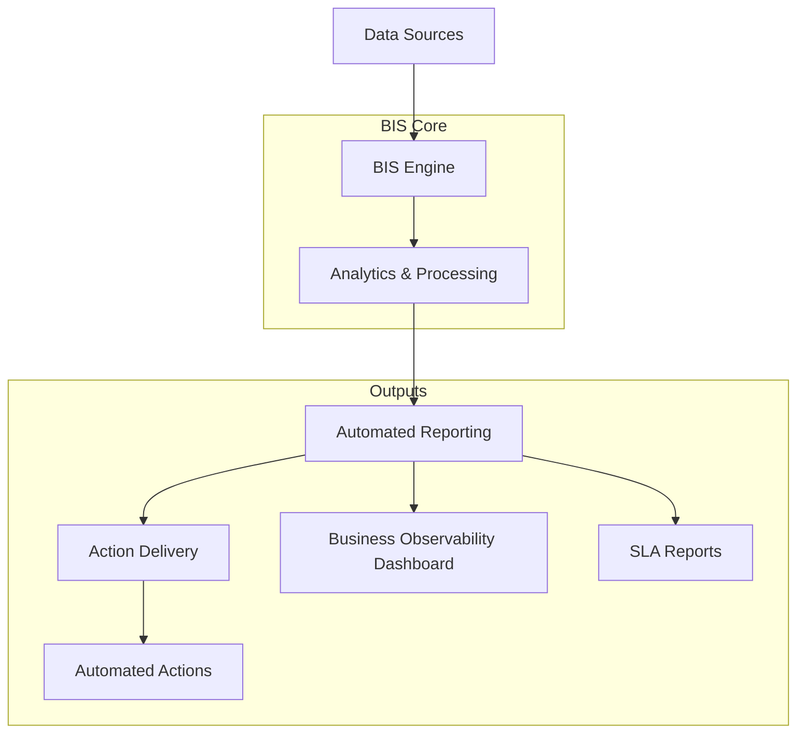

---

## Design Principles and Core Concepts

BIS follows key design principles centered around infrastructure-as-code distribution.

### Distribution as Python Package
BIS is distributed as a Python package with YAML configuration files, similar to infrastructure as code. No Ansible required for core operations - playbooks manage all package operations without traditional infrastructure management.

### ITSM Focus
Core focus is on ITSM within business and management domains, solving business problems and enhancing service relevance and reliability.

### Standardization in Analytics
High degree of standardization in analytics, resembling construction from templates or modular components with uniform APIs.

### Microservice-like Architecture
Standardized APIs echo microservice architecture where elements are independent and interact via APIs. APIs are embedded within playbooks without requiring centralized deployment hubs.

### Edge Computing Approach
Enables use of client and computing resources similar to edge computing, eliminating traditional client-server architecture needs.

### No Infrastructure Management
Focus is on business problems rather than infrastructure management - BIS operates like infrastructure but manages ITSM processes.

### Core Design Principles and ROI Areas

**Backend-Only Architecture**: BIS is backend-only, designed as augmentation of existing platforms (SNOW, Kyndryl IntAIOPS). No frontend for end users, though simple UI exists for administration and development.

**Business Value Focus**: Main benefit is business value creation by combining different features into single pipeline. Not a generic data processing engine - takes 10% of each market solution (reports, dashboards, notifications) and integrates into end-to-end solution.

#### Key ROI Areas
- **Experience Management (XLA)**: Maps IT value to business value, measures what's being managed, fixes watermelon effect (green SLAs, red XLAs)
- **Cross-Practice Integration**: Improves horizontal (cross-practices) and vertical (business-to-technology) integration through holistic indicator design
- **Relevant Actions**: Actions more relevant to current business needs due to customer business context (autoranking, contracts, organization)
- **RCA Integration**: Postmortems used as input for future development, enhances contractual SLA calculation with preventive actions
- **CSI Integration**: Strong integration with existing Continuous Service Improvement processes
- **Digital Communication**: Faster, more accurate communication between stakeholders via multiple methods
- **Rapid Development**: Close customer partnership and higher velocity of indicator updates, including self-service (DataOps)
- **Simplified Outputs**: Benchmark dashboard for exec management, actions on single wall of work (ranked, filtered by owner)
- **Maintainable Technology**: Modern data stack + in-process DB + data lake + playbooks, cloud-ready, Python-dependent
- **Everything-as-Code**: Simplifies scale-up and AI use for indicator creation, analytics designed for ML mass use
- **Data-Agnostic Design**: Modular design connects to multiple data sources, sends results to multiple visualization tools via API
- **Culture Transformation**: Strong integration with culture change - people behave according to how they are measured

#### Business Outcomes
- Lower total cost of service management
- Better risk management
- Improved customer satisfaction
- Better service quality (more relevant)
- Higher organizational change velocity
- Standardization

---

## Core Design Principles (AI-Ready)

BIS follows comprehensive design principles that enable rapid deployment, automation, and AI integration:

- **Everything as Code**: Python, SQL, YAML for rapid deployment and automation
- **Agile & Scrum**: Cross-skilled squads, end-to-end delivery, reduced lead time
- **Lean**: PDCA (Plan-Do-Check-Act), continuous measurement and improvement
- **Distributed as a Python package**: Lightweight, deployable anywhere Python runs
- **Infrastructure as Code**: Heavy use of YAML playbooks for configuration and orchestration
- **ITSM as Code**: Enhances governance, management, and business processes, not just IT infrastructure
- **Standardized, Modular, and Configurable**: Microservices-like architecture, easily tailored per use case
- **Edge Computing**: Brings tools to the data, not the other way around
- **AI-Ready**: Designed for generative AI, agentic workflows, and Mixture-of-Experts models

## DataOps Model

BIS implements a comprehensive DataOps operational cycle:

- **Operational Cycle**: Gather data → Interpret requirements → Translate to actions → Deliver → Measure → Analyze → Improve
- **Rapid indicator development**: Days, not months, for new analytics and actions
- **Everything is version-controlled**: All code, playbooks, and documentation are tracked in GitHub

## Data Architecture (Expanded)

BIS uses a structured data lake architecture with clear processing stages:

- **DATA/RAW/**: Extracted raw data (csv, excel, json)
- **DATA/STAGE/**: Parquet conversion and initial normalization
- **DATA/PROD/**: Deduplicated, analytics-ready data
- **DATA/MASTER/**: Processed outputs (SYMPTOM, TREND, ACTION, SNAPSHOT)
- **SPECS/**: Workspace and practice definitions
- **OLAP Focus**: Columnar storage (parquet), schema-on-read, embedded DuckDB, no client-server DB
- **Incremental loading, schema evolution, deep analytics**

## API & Logical Components (Expanded)

BIS provides a comprehensive set of logical components for end-to-end data processing:

- **World**: Singleton managing BIS session and global state
- **Workspace**: Container for all data, playbooks, indicators, reports
- **Scheduler**: Time/event-based pipeline execution engine
- **Pipeline**: Ordered, configurable actions and transformations
- **Practice**: Grouped indicators for business areas and domains
- **ELT as Code**: Extract, Load, Transform managed by Python engine and YAML playbooks
- **Data Lake as Code**: Dynamic transformation with auto-documentation for AI
- **Indicator as Code**: End-to-end data processing from raw data to analytics/actions
- **Visualization as Code**: Formatting for Excel, dashboards, email delivery
- **Delivery as Code**: Manages how, when, and to whom data is delivered
- **Analytics as Code**: Overviews, benchmarks, and automated documentation
- **Code as Code**: All configuration and logic managed as code
- **AI Agent as Code**: Designed for AI agent integration and co-creation

---

## Layered Architecture

BIS uses a layered monolith architecture for simplicity and performance:

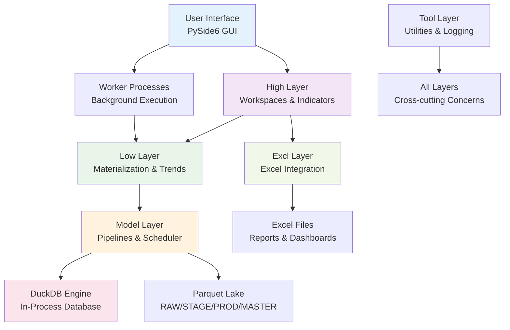

### Detailed Component Architecture

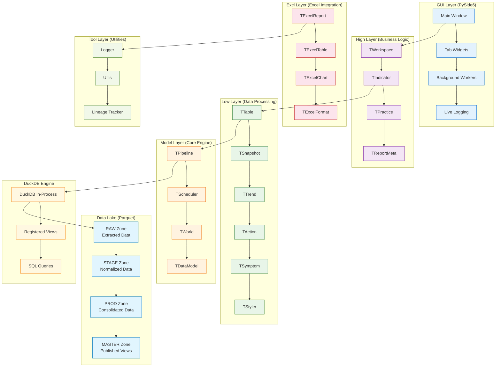

### Data Flow Architecture

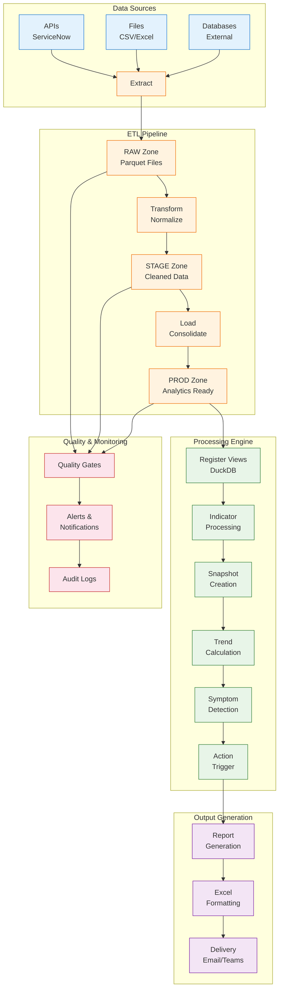

### Security Architecture

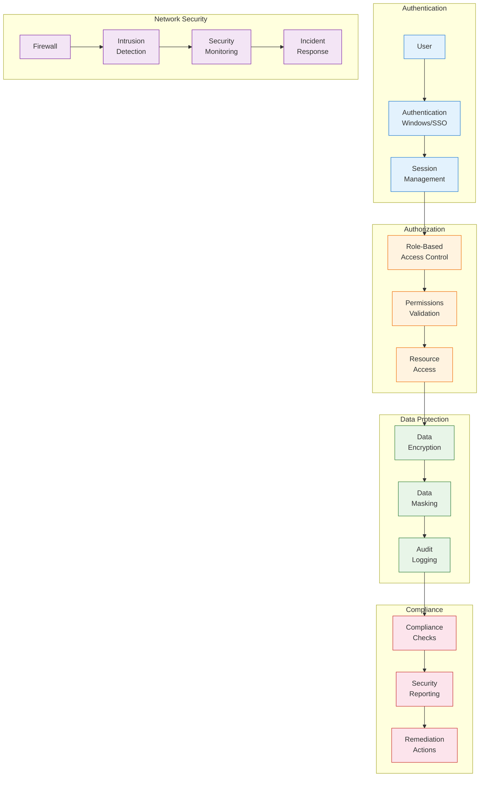

### Security Framework Comparison

| **Framework** | **Authentication** | **Authorization** | **Data Protection** | **Monitoring** | **BIS Fit** |
|---------------|-------------------|-------------------|-------------------|---------------|-----------|
| **Windows AD** | Domain credentials | Group policies | File encryption | Event logs | 🟢 Excellent |
| **OAuth 2.0** | Token-based | Scopes/roles | JWT encryption | Access logs | 🟡 Good for APIs |
| **SAML** | Federation | Claims-based | XML encryption | Federation logs | 🟡 Enterprise |
| **API Keys** | Static tokens | Key validation | Request signing | Usage metrics | 🟢 Current approach |
| **Certificate-based** | Client certificates | Certificate validation | TLS encryption | Certificate logs | 🟡 Future consideration |

#### Data Protection Strategies

| **Strategy** | **Data at Rest** | **Data in Transit** | **Data in Use** | **Key Management** | **Compliance** |
|-------------|------------------|-------------------|----------------|-------------------|---------------|
| **File-level Encryption** | AES-256 | TLS 1.3 | Application controls | Windows DPAPI | SOC 2, ISO 27001 |
| **Database Encryption** | Transparent encryption | SSL/TLS | Column encryption | HSM integration | HIPAA, PCI DSS |
| **Application-level** | Custom encryption | HTTPS | Memory encryption | Application managed | Custom compliance |
| **Zero-trust** | End-to-end encryption | Mutual TLS | Runtime protection | Distributed keys | Zero-trust frameworks |

#### Security Monitoring Approaches

| **Approach** | **Detection Speed** | **False Positives** | **Coverage** | **Maintenance** | **Best Use Case** |
|-------------|-------------------|-------------------|-------------|---------------|------------------|
| **Signature-based** | Fast | Low | Known threats | High | Standard security |
| **Anomaly Detection** | Variable | Medium | Unknown threats | Medium | Advanced threats |
| **Behavior Analysis** | Slow | High | Insider threats | Low | User activity monitoring |
| **Log Analysis** | Medium | Low | System events | Medium | Compliance auditing |
| **Real-time Monitoring** | Real-time | Medium | Active threats | High | Critical systems |

### Deployment Architecture

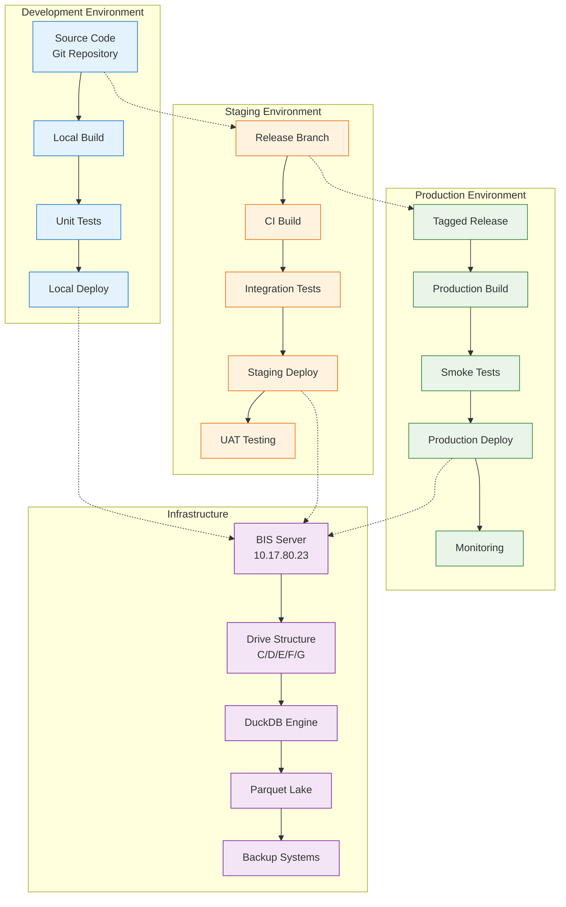

### Architecture Layers Explained

| **Layer** | **Purpose** | **Key Components** | **Example Use Case** |
|-----------|-------------|-------------------|---------------------|
| **GUI** | User interface and interaction | PySide6 desktop app, Workers | Launch pipeline, view results |
| **High** | Business logic and workspaces | Indicators, reports, practices | Generate monthly performance report |
| **Low** | Data processing and materialization | Snapshots, trends, styles | Calculate KPI trends over time |
| **Model** | Core engine and orchestration | Pipelines, scheduler, environment | Process raw data through ETL pipeline |
| **Excl** | Excel integration and formatting | Excel widgets, formats, charts | Create formatted Excel dashboard |
| **Tool** | Utilities and cross-cutting concerns | Logging, lineage, utilities | Track data dependencies |

### System Context & External Integrations
- **Stakeholders**: Analysts, operators, SREs, leadership (governed BI and ELT)
- **Core Engine**: Python + DuckDB (in-process) with Parquet lake: RAW/STAGE/PROD/MASTER
- **Modules**: Model (environment + pipelines + scheduler), Low (materialization components), High (workspaces/practices/indicators), Tool (utilities), GUI (PySide6 desktop app), Excl (Excel widgets)
- **External Systems**: Snowflake (speculative), Outlook (Windows COM), Teams webhook, filesystem
- **Security/PII**: Redact secrets/tokens; Windows-only COM guarded; headless UI guards
- **Non-functional**: Idempotent flows, deterministic sequencing, fail-soft logging, bounded payloads/timeouts

### End-to-End Execution Flows
- Workspace bootstrap → connect DuckDB → register lake views → load configs/macros
- ELT incremental: ingest RAW → normalize STAGE → consolidate PROD → create/replace views → quality artifacts
- Indicator/report: run components → snapshot/trend → Excel build/merge → optional Outlook delivery
- GUI: select workspace → background Workers execute tasks → live logs/results
- Data lineage: SQL dependency extraction → tables_dependency recorded → propagated via wrappers

---

## Infrastructure and Deployment

- **Single Machine Execution**: Local filesystem lake, optional headless mode
- **Outlook COM**: For delivery on Windows; guarded and optional
- **Future Experiments**: Robocorp for RPA, Databricks for scale while retaining DuckDB SQL

### Server Configuration
- **Location**: Machine 10.17.80.23
- **Connection**: RDP (Remote Desktop Protocol)
- **File Transfer**: Copy from local drive to RDP works, but no drag and drop
- **Mail Server**: Active, can send mails from this server

### Drive Structure
- **C:** System only (Windows OS)
- **D:** Development drive (source code, playground for testing, NO Excel installed)
- **E:** Data drive (all data, source code, specs, full Python environment)
- **F:** Tools drive (applications, software, editors, Python environments)
- **G:** PostgreSQL drive (database, currently not used)

### Deployment Model
- Single-host desktop/server; DuckDB in-process; filesystem lake
- GUI uses QThreadPool; Outlook COM only on Windows; Snowflake via external creds (speculative)

### Deployment Strategy Comparison

| **Strategy** | **Environment Fit** | **Scalability** | **Complexity** | **Cost** | **BIS Recommendation** |
|-------------|-------------------|----------------|---------------|----------|----------------------|
| **Single-Host Desktop** | Development, small teams | Low | Low | Low | 🟢 Recommended for current |
| **Containerized** | Cloud-native, microservices | High | Medium | Medium | 🟡 Future consideration |
| **Server-Based** | Enterprise, multi-user | Medium | Medium | High | 🟡 Optional for scale |
| **Hybrid Cloud** | Distributed teams | Very High | High | High | 🔴 Not recommended yet |
| **Edge Deployment** | Remote locations | Medium | High | Medium | 🟡 Future evaluation |

#### Infrastructure Architecture Options

| **Architecture** | **Data Storage** | **Processing** | **Deployment** | **Best For** | **Trade-offs** |
|------------------|-----------------|---------------|---------------|-------------|---------------|
| **Local Filesystem** | Parquet lake (D/E drives) | DuckDB in-process | Single server | Development, small scale | Limited concurrency |
| **Network Storage** | NAS/SAN with Parquet | DuckDB remote | Multi-server | Team collaboration | Network latency |
| **Cloud Object Storage** | S3/Blob with Parquet | DuckDB with extensions | Cloud-native | Global scale | Cost, complexity |
| **Database Backend** | PostgreSQL/MySQL | SQL processing | Traditional | Enterprise IT | Performance overhead |
| **Hybrid Lakehouse** | Multiple storage tiers | Mixed engines | Flexible | Complex requirements | Management complexity |

#### Scaling Strategy Matrix

| **Scaling Dimension** | **Current Approach** | **Near-term (6-12 months)** | **Future (1-2 years)** | **Key Considerations** |
|----------------------|---------------------|---------------------------|----------------------|----------------------|
| **Data Volume** | Single server (10TB) | Network storage (100TB) | Cloud storage (unlimited) | Storage cost vs. performance |
| **Concurrent Users** | 1-5 users | 10-20 users | 50+ users | Resource contention |
| **Query Complexity** | Simple to medium | Complex analytics | Advanced ML/AI | Processing power needs |
| **Geographic Distribution** | Single location | Regional hubs | Global deployment | Network latency, data sovereignty |

---

## External Data Integrations

Supported connectors exist under `engine/src/exts/*` (examples: ServiceNow Snow, ScienceLogic, Commvault). Details and usage tracked in module READMEs and workspace examples.

### Integration Promise
- Bring your data as files, APIs, or existing exports—we'll meet you where you are
- Normalize to standards that travel well across teams and audits

---

## Data Architecture and Storage

Lake zones: RAW → STAGE → PROD → MASTER with append-only history for trends and snapshots. Views created replaced deterministically, lineage recorded.

### Typical Layout and Registration
- Parquet files stored per table family under tenant directories
- Views registered in DuckDB during world initialization, then consumed by indicators and Excel
- CREATE VIEW pattern: `CREATE OR REPLACE VIEW prod.incident AS SELECT * FROM read_parquet('.../prod/incident/*.parquet')`

### Data Processing Concepts
- **OLTP**: Row-based storage for transactional systems. Optimized for small insert/update/delete operations
- **OLAP**: Column-based storage for analytics. Optimized for deep queries over millions of records

### BIS Data Flow
- **Extraction**: Connects to APIs, local storage, OneDrive, cloud databases. Data converted to Parquet files in RAW zone
- **Transformation**: Raw data cleaned and processed to STAGE (temporary), then to PROD (optimized for reads)
- **Quality**: Reports run to maintain Data Lake integrity and prevent data swamp conditions
- **Views**: Dynamic schema from data itself. Only PROD/MASTER folders used for processing. Views registered over Parquet files in memory database

### Why It Works
- Parquet is cheap, portable, and fast; views keep consumption simple and safe
- Append-only history preserves truth while enabling rich trend analysis

---

## Components and Layering

| Layer | Responsibilities | Key Classes |
|---|---|---|
| model | World bootstrap, pipelines, scheduler | TWorld, TPipeline, TScheduler |
| low | Materialization, tables, snapshots, trends, actions, symptoms, styles | TTable, TSnapshot, TTrend, TAction, TSymptom, TStyler |
| high | Workspaces, practices, indicators, reporting metadata, delivery | TWorkspace, TPractice, TIndicator, TReportMeta, ReportDeliveryService |
| excl | Excel orchestration and widgets | TExcelReport, TExcelSheet, TExcelTable, TExcelChart, TExcelFormat |
| gui | PySide6 app and tabs | TGuiMain and GUI tabs |
| tool | Utilities and logging | Logger, IO, helpers |

### Design Philosophy
- Separation of concerns: orchestration, materialization, presentation
- Contracts over conventions: stable APIs with additive evolution
- Small, composable units that agents and humans can reason about

---

## Reporting Components

Excel outputs built from stylers and widgets with formats registry. Templates can be merged, charts embedded but may be hidden by default, hyperlinks and captions supported.

- Example: Single indicator produces Excel sheet via TExcelTable with TExcelFormat styles and embedded TExcelChart referenced by name

### Why Excel
- It's where decisions happen. We lean in and make it beautiful, consistent, and fast
- Hidden charts, hyperlinks, captions, and formats achieve premium feel with minimal effort

---

## DuckDB Technical Details

DuckDB is the core analytical database engine for BIS, providing fast SQL processing on Parquet files.

### Date and Time Functions
```sql
-- Extract date components
strftime('%W-%Y', creation_date) as week_created
strftime('%Y-%m', creation_date) as creation_stamp  
strftime('%H', creation_date) as creation_hour
strftime('%A', creation_date) as creation_day

-- Calculate time differences
DATEDIFF('hours', start_date, end_date) AS duration_hours
```

### Performance Optimization with CTEs
```sql
-- Standard CTE (recalculates data multiple times)
WITH job_summary AS (
    SELECT COUNT(*) as total_jobs, AVG(duration) as avg_time
    FROM job_table
    WHERE status = 'completed'
)
SELECT * FROM job_summary;

-- Optimized with MATERIALIZED (calculates once)
WITH job_summary AS MATERIALIZED (
    SELECT COUNT(*) as total_jobs, AVG(duration) as avg_time  
    FROM job_table
    WHERE status = 'completed'
)
SELECT * FROM job_summary;
```

### Dynamic Column Selection
```sql
SELECT COLUMNS(c -> c LIKE '%error%') FROM log_table;
```

### PIVOT Operations
```sql
PIVOT incident_table
ON incident_type 
USING COUNT(incident_id) as total_incidents
GROUP BY department;
```

### Relative Paths in Queries
```sql
-- Set working directory for relative file access
SET file_search_path TO 'C:\data\BIS\workspace\tenant\data';

-- Then use relative paths
SELECT * FROM read_parquet('prod/incidents.parquet');
```

---

## Enterprise Architecture Details

### Architecture Highlights
- **Context (C4 L1)**: Stakeholders run and consume from BI Engine, orchestrates modules like Model, High, Low, Tool, EXCL, GUI
- **Container/Component (C4 L2/L3)**: Model manages ELT and scheduling, Low handles data materialization, High orchestrates workspaces, Tool provides utilities, EXCL builds Excel reports, GUI offers desktop interface
- **Use Cases**: Analysts select workspaces and execute tasks; operators monitor runs; leadership reviews reports
- **Sequence (Incremental Run)**: Bootstrap workspace, load data incrementally, process through stages, generate reports, deliver via Outlook
- **Data Flow / Lineage**: Data moves RAW→STAGE→PROD, dependencies tracked via SQL wrappers
- **Class/ER Views**: Key classes include TWorld (environment), TPipeline (orchestration), TScheduler (timing); ER diagrams show relationships between data tables
- **Deployment**: Single-host runtime with in-process DuckDB, filesystem-based lake for easy portability and no server dependencies

### Runtime Highlights
- **World Bootstrap**: Connect DuckDB, register lake views, load configs/macros
- **ELT Lifecycle**: RAW → STAGE → PROD; create or replace views; produce quality artifacts
- **Reporting**: Run components; snapshot/trend; Excel build and merge; optional Outlook delivery

### Benefits Customers Feel
- Snappy runs even on modest hardware thanks to DuckDB's in-process design
- Portable and secure: no central server, Windows COM guarded for Outlook integration
- Deterministic and idempotent: repeatable results, fail-soft with bounded timeouts
- Predictable month-close with reproducible artifacts and delivery
- Minimal setup; maximum leverage
- Comprehensive lineage for audit and troubleshooting
- Fail-soft operations that isolate failures without stopping runs

---

## DataOps Practices and Pipeline Management

### DataOps Framework Implementation

#### DataOps Principles
- **Automation First**: All data processes automated and version-controlled
- **Self-Service Access**: Business users can access data without IT bottlenecks
- **Continuous Improvement**: Regular monitoring and optimization of data pipelines
- **Collaboration Focus**: Cross-functional teams working together on data initiatives

#### Pipeline Orchestration
BIS implements comprehensive pipeline orchestration through YAML-driven configurations:

**Pipeline Stages**:
- **Ingestion**: Raw data collection from multiple sources
- **Validation**: Data quality checks and schema validation
- **Transformation**: Business logic application and data enrichment
- **Storage**: Optimized storage in Parquet format with partitioning
- **Consumption**: Data access through views and APIs

**Orchestration Components**:
- **Scheduler**: Time-based and event-driven execution
- **Dependency Management**: Automatic handling of data dependencies
- **Error Handling**: Graceful failure recovery and alerting
- **Monitoring**: Real-time pipeline health and performance tracking

### ETL Pipeline Management

#### Extract, Transform, Load (ETL) Architecture

##### Extraction Layer
- **Source Connectors**: Modular connectors for various data sources
- **Incremental Loading**: Change data capture and delta processing
- **Data Validation**: Schema validation and data type checking
- **Error Recovery**: Robust error handling and retry mechanisms

##### Transformation Layer
- **Data Cleaning**: Null handling, deduplication, and standardization
- **Business Logic**: Domain-specific transformations and calculations
- **Data Enrichment**: Joining with reference data and external sources
- **Quality Gates**: Automated validation rules and thresholds

##### Load Layer
- **Storage Optimization**: Partitioning strategies and compression
- **Indexing**: Performance optimization for query patterns
- **Metadata Management**: Automatic cataloging and lineage tracking
- **Access Control**: Row-level and column-level security

#### Advanced ETL Patterns

##### Slowly Changing Dimensions (SCD)
```sql
-- SCD Type 2: Historical tracking with effective dates
CREATE TABLE customer_history AS
SELECT
    customer_id,
    customer_name,
    address,
    effective_date,
    expiration_date,
    is_current
FROM customer_updates;
```

##### Change Data Capture (CDC)
- **Timestamp-based**: Using last_modified timestamps
- **Log-based**: Reading database transaction logs
- **Trigger-based**: Database triggers for change notification
- **Snapshot-based**: Periodic full table snapshots

##### Data Quality Frameworks
- **Completeness**: Ensuring all required fields are populated
- **Accuracy**: Data values match expected formats and ranges
- **Consistency**: Data relationships and constraints maintained
- **Timeliness**: Data freshness and latency requirements met

### Data Governance and Quality Management

#### Data Governance Framework

##### Data Stewardship
- **Data Owners**: Business responsibility for data quality and usage
- **Data Stewards**: Technical oversight of data management practices
- **Data Custodians**: Technical implementation and maintenance

##### Governance Policies
- **Data Classification**: Sensitivity levels and handling requirements
- **Retention Policies**: Data lifecycle management and archival
- **Access Policies**: Role-based access control and audit trails
- **Usage Policies**: Approved use cases and data sharing guidelines

#### Data Quality Management

##### Quality Dimensions
- **Accuracy**: Correctness and precision of data values
- **Completeness**: Presence of required data elements
- **Consistency**: Agreement across different data sources
- **Timeliness**: Currency and latency of data updates
- **Validity**: Conformance to defined business rules

##### Quality Monitoring
- **Automated Checks**: Continuous validation during pipeline execution
- **Quality Dashboards**: Visual monitoring of data quality metrics
- **Alerting**: Proactive notification of quality issues
- **Remediation**: Automated and manual correction processes

##### Data Profiling
- **Statistical Analysis**: Distribution analysis and outlier detection
- **Pattern Recognition**: Format validation and consistency checks
- **Dependency Analysis**: Relationship validation and referential integrity
- **Anomaly Detection**: Machine learning-based quality monitoring

### Metadata Management and Cataloging

#### Metadata Architecture

##### Technical Metadata
- **Data Structures**: Table schemas, column definitions, data types
- **Data Lineage**: Source-to-target mapping and transformation logic
- **Execution History**: Pipeline run logs and performance metrics
- **Quality Metrics**: Validation results and error statistics

##### Business Metadata
- **Data Definitions**: Business meaning and context
- **Usage Guidelines**: Approved use cases and limitations
- **Ownership**: Data stewards and responsible parties
- **Sensitivity**: Privacy and security classifications

#### Metadata Management Tools
- **Automated Discovery**: Scanning and cataloging data assets
- **Search and Discovery**: Self-service data exploration
- **Impact Analysis**: Change impact assessment and dependency tracking
- **Governance Workflow**: Approval processes for metadata changes

### Data Security and Compliance

#### Security Architecture

##### Data Protection
- **Encryption**: At-rest and in-transit data encryption
- **Tokenization**: Sensitive data replacement with tokens
- **Masking**: Dynamic data masking for different user roles
- **Redaction**: Permanent removal of sensitive information

##### Access Control
- **Authentication**: Multi-factor authentication and SSO integration
- **Authorization**: Role-based and attribute-based access control
- **Audit Logging**: Comprehensive activity tracking and monitoring
- **Privacy Controls**: Consent management and data subject rights

#### Compliance Frameworks

##### Regulatory Compliance
- **GDPR**: Data protection and privacy regulations
- **CCPA**: California Consumer Privacy Act requirements
- **SOX**: Financial reporting and internal controls
- **Industry Standards**: HIPAA, PCI-DSS, and sector-specific requirements

##### Compliance Automation
- **Automated Auditing**: Continuous compliance monitoring
- **Data Classification**: Automatic sensitivity assessment
- **Retention Management**: Automated data lifecycle enforcement
- **Reporting**: Compliance status dashboards and reports

### Performance Optimization and Scalability

#### Query Optimization

##### Indexing Strategies
- **Column Indexes**: Efficient access for analytical queries
- **Partitioning**: Data organization for query pruning
- **Materialized Views**: Pre-computed aggregations for performance
- **Caching**: Query result caching and reuse

##### Query Performance
- **Execution Planning**: Optimal query plan selection
- **Parallel Processing**: Multi-core query execution
- **Memory Management**: Efficient memory usage and spill handling
- **Resource Allocation**: CPU and memory optimization

#### Scalability Patterns

##### Horizontal Scaling
- **Data Partitioning**: Distributed data across multiple nodes
- **Load Balancing**: Query distribution across cluster nodes
- **Replication**: Data redundancy and read scaling
- **Federation**: Cross-system data access and integration

##### Vertical Scaling
- **Resource Optimization**: Memory and CPU utilization tuning
- **Storage Optimization**: Compression and encoding techniques
- **Caching Layers**: Multi-level caching for performance
- **Connection Pooling**: Efficient database connection management

### Monitoring and Observability

#### Operational Monitoring

##### Pipeline Monitoring
- **Execution Tracking**: Real-time pipeline status and progress
- **Performance Metrics**: Execution time, resource usage, throughput
- **Error Monitoring**: Failure detection and alerting
- **SLA Tracking**: Service level agreement compliance

##### Data Monitoring
- **Freshness Monitoring**: Data currency and update frequency
- **Volume Monitoring**: Data growth and storage utilization
- **Quality Monitoring**: Automated quality metric tracking
- **Usage Monitoring**: Query patterns and access statistics

#### Observability Framework

##### Logging and Tracing
- **Structured Logging**: Consistent log format and metadata
- **Distributed Tracing**: End-to-end request tracking
- **Performance Tracing**: Query execution and bottleneck identification
- **Error Correlation**: Related error grouping and analysis

##### Alerting and Notification
- **Threshold-based Alerts**: Configurable alerting rules
- **Escalation Policies**: Automated alert routing and escalation
- **Incident Response**: Automated remediation and notification
- **Status Dashboards**: Real-time system health visualization

This comprehensive DataOps framework ensures BIS delivers reliable, high-quality data products while maintaining operational excellence and regulatory compliance.

---

## Legacy Content from 03-Architecture.md

# Technical architecture and data model

> **Canonical** — Extracted from BIS Handbook  
> **Last Updated:** 2025-09-03  
> **Navigation:** [← BIS Executive Summary](../Handbook.md) | [📚 All Handbook Sections](../Handbook.md#handbook-sections)


### Design Principles and Core Concepts
BIS follows key design principles centered around infrastructure-as-code distribution:

**Distribution as Python Package**: BIS is distributed as a Python package with YAML configuration files, similar to infrastructure as code. No Ansible required for core operations - playbooks manage all package operations without traditional infrastructure management.

**ITSM Focus**: Core focus is on ITSM within business and management domains, solving business problems and enhancing service relevance and reliability.

**Standardization in Analytics**: High degree of standardization in analytics, resembling construction from templates or modular components with uniform APIs.

**Microservice-like Architecture**: Standardized APIs echo microservice architecture where elements are independent and interact via APIs. APIs are embedded within playbooks without requiring centralized deployment hubs.

**Edge Computing Approach**: Enables use of client and computing resources similar to edge computing, eliminating traditional client-server architecture needs.

**Edge Computing Approach**: Enables use of client and computing resources similar to edge computing, eliminating traditional client-server architecture needs.

**No Infrastructure Management**: Focus is on business problems rather than infrastructure management - BIS operates like infrastructure but manages ITSM processes.

### Core Design Principles and ROI Areas
**Backend-Only Architecture**: BIS is backend-only, designed as augmentation of existing platforms (SNOW, Kyndryl IntAIOPS). No frontend for end users, though simple UI exists for administration and development.

**Business Value Focus**: Main benefit is business value creation by combining different features into single pipeline. Not a generic data processing engine - takes 10% of each market solution (reports, dashboards, notifications) and integrates into end-to-end solution.

**Key ROI Areas**:
- **Experience Management (XLA)**: Maps IT value to business value, measures what's being managed, fixes watermelon effect (green SLAs, red XLAs)
- **Cross-Practice Integration**: Improves horizontal (cross-practices) and vertical (business-to-technology) integration through holistic indicator design
- **Relevant Actions**: Actions more relevant to current business needs due to customer business context (autoranking, contracts, organization)
- **RCA Integration**: Postmortems used as input for future development, enhances contractual SLA calculation with preventive actions
- **CSI Integration**: Strong integration with existing Continuous Service Improvement processes
- **Digital Communication**: Faster, more accurate communication between stakeholders via multiple methods
- **Rapid Development**: Close customer partnership and higher velocity of indicator updates, including self-service (DataOps)
- **Simplified Outputs**: Benchmark dashboard for exec management, actions on single wall of work (ranked, filtered by owner)
- **Maintainable Technology**: Modern data stack + in-process DB + data lake + playbooks, cloud-ready, Python-dependent
- **Everything-as-Code**: Simplifies scale-up and AI use for indicator creation, analytics designed for ML mass use
- **Data-Agnostic Design**: Modular design connects to multiple data sources, sends results to multiple visualization tools via API
- **Culture Transformation**: Strong integration with culture change - people behave according to how they are measured

**Business Outcomes**:
- Lower total cost of service management
- Better risk management
- Improved customer satisfaction
- Better service quality (more relevant)
- Higher organizational change velocity
- Standardization

### Layered Architecture (Monolith Solution)
BIS uses a layered monolith architecture for simplicity and performance:

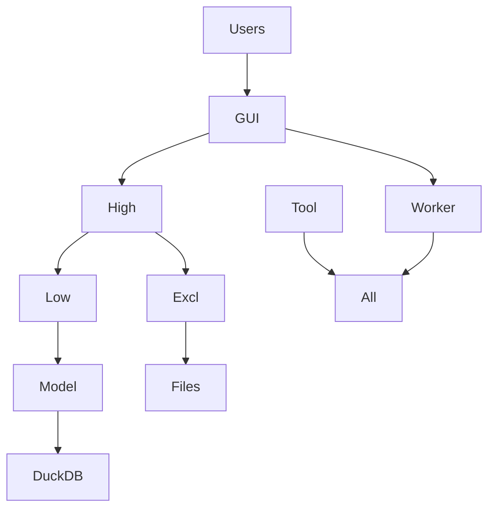

- **Model Layer**: Environment, pipelines, scheduler (RAW→STAGE→PROD).
- **Low Layer**: Materialization, snapshots, trends, styles.
- **High Layer**: Workspaces, indicators, reporting.
- **Excl Layer**: Excel widgets, formats.
- **GUI Layer**: PySide6 interface.
- **Tool Layer**: Utilities, logging, lineage.

This monolith ensures tight coupling for fast runs, with clear separation of concerns.

System Context & External Integrations
- Stakeholders: analysts, operators, SREs, leadership (governed BI and ELT).
- Core engine: Python + DuckDB (in-process) with Parquet lake: RAW/STAGE/PROD/MASTER.
- Modules: model (environment + pipelines + scheduler; RAW→STAGE→PROD orchestration), low (materialization components, trend/snapshot, schema validation, styles), high (../../workspace/practice/indicator orchestrators; Excel/specs/delivery), tool (utilities for IO/SQL/UI/logging/lineage/time anchors), gui (PySide6 desktop app; Worker pattern; logs streaming), excl (Excel report widgets/orchestrator on xlsxwriter/openpyxl).
- External systems: Snowflake (speculative), Outlook (Windows COM), Teams webhook, filesystem.
- Security/PII: redact secrets/tokens; Windows-only COM guarded; headless UI guards.
- Non-functional: idempotent flows, deterministic sequencing, fail-soft logging, bounded payloads/timeouts.

End-to-End Execution Flows
- Workspace bootstrap → connect DuckDB → register lake views → load configs/macros.
- ELT incremental: ingest RAW → normalize STAGE → consolidate PROD → create/replace views → quality artifacts.
- Indicator/report: run components → snapshot/trend → Excel build/merge → optional Outlook delivery.
- GUI: select workspace → background Workers execute tasks → live logs/results.
- Data lineage: SQL dependency extraction → tables_dependency recorded → propagated via wrappers.

Architecture Highlights
- Context (C4 L1): Stakeholders run and consume from the BI Engine, which orchestrates modules like Model, High, Low, Tool, EXCL, GUI.
- Container/Component (C4 L2/L3): Model manages ELT and scheduling, Low handles data materialization, High orchestrates workspaces, Tool provides utilities, EXCL builds Excel reports, GUI offers desktop interface.
- Use cases: Analysts select workspaces and execute tasks; operators monitor runs; leadership reviews reports.
- Sequence (incremental run): Bootstrap workspace, load data incrementally, process through stages, generate reports, deliver via Outlook.
- Data flow / lineage: Data moves from RAW to STAGE to PROD, with dependencies tracked via SQL wrappers.
- Class/ER views: Key classes include TWorld (environment), TPipeline (orchestration), TScheduler (timing); ER diagrams show relationships between data tables.
- Deployment: Single-host runtime with in-process DuckDB, filesystem-based lake for easy portability and no server dependencies.

## Legacy Content from 12-Advanced-Topics.md

# Advanced Topics and Best Practices

> **Canonical** — Extracted from BIS Handbook  
> **Last Updated:** 2025-09-03  
> **Navigation:** [← BIS Executive Summary](../Handbook.md) | [📚 All Handbook Sections](../Handbook.md#handbook-sections)


### AI Utilization in BIS
BIS leverages AI in two key areas: machine learning for pattern detection and predictive analytics from raw data, and generative AI for prompt engineering to create code for indicators. Machine learning use cases include anomaly detection and forecasting trends. Generative AI assists in rapid code generation for custom indicators, reducing development time.

**Machine Learning Use Cases:**
- Pattern finding over raw data for predictive analytics
- Anomaly detection in operational data
- Forecasting trends and future performance metrics

**Generative AI Use Cases:**
- Prompt engineering for indicator code generation
- Automated creation of SQL queries and YAML configurations
- Rapid prototyping of new business logic and rules

**AI-Augmented Indicator Flow Example:**
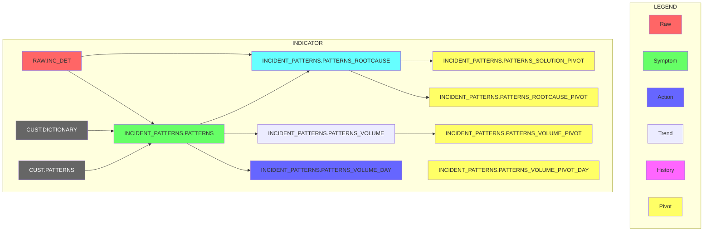

AI augments expertise and accelerates delivery by handling repetitive tasks, generating code, and validating configurations. Keep publishing deterministic through schema enforcement, validate with automated tests, and protect privacy by redacting PII and limiting data access.

### API and Workspace Management
Workspaces are defined with name, data sources, and practices. Practices include tables for benchmark logic. Indicators and reports are lists of actionable metrics. Symptoms handle SQL queries saved as Parquet files. Use YAML for configuration to ensure consistency.

The BIS API provides comprehensive schemas for YAML configurations with anchors for reusability and validation rules. Use for authoring jobs, validating structures, ensuring compatibility. For AI agents, reference for generating compliant configurations.

### Data Perspective and ELT Processes
Data extraction involves APIs, local storage, and cloud databases, transformed into Parquet files in the Data Lake. Transformation stages include raw data loading, basic cleaning, and storage in stage folders with timestamps. This supports incremental processing and data quality.

Ingestion → normalization → consolidation → publish, with profiling, drift detection, and lineage capture. Quality hooks run per stage, and lineage tables record dependencies.

### Components Overview
Key components include Indicators (end-to-end data processing), Symptoms (SQL queries), Actions (prioritized tasks), Snapshots (historical metrics), and Trends (daily level tracking). Analytics layers: Trend (engineers), Budget (managers), Benchmark (executives).

Report as a Code is the core of BIS, replacing manual Excel reports with code-driven generation. Components: Widgets (charts, tables, sparklines), sheets, captions, logos, headers, columns, aliases, overalls.

### Delivery Mechanisms
Delivery includes basic mail, Excel attachments, HTML mail, Teams notifications, channel messages, ChatOps, and dashboards. Triggers execute before delivery. Reports are defined as code with widgets like charts, tables, and summaries.

Delivery Components include Basic Mail, Excel Report in Mail, HTML Mail, Personal Notification, Channel Message, ChatOps, and Trigger.

### Best Practices for Development
- Use DuckDB for efficient SQL processing on Parquet files.
- Follow DataOps principles: measure progress, define semantic layers, automate pipelines.
- Ensure tenant isolation and deterministic runs.
- Leverage AI for code generation and pattern recognition.

DataOps combines lean manufacturing, agile culture, and data engineering to enable faster value generation from data. Principles include establishing measurements, defining semantic layers, validating with feedback loops, automating stages, optimizing bottlenecks, establishing governance, and designing for growth.

---

## What BIS is NOT

#### Not an Automation Platform
- **Suggests actions** but doesn't execute them
- **GPS analogy**: Shows where to go, human presses the button

#### Not a Dashboard Solution
- **Backend only** operation
- **Report generation** or atomic action sending
- **Connects to existing** visualization solutions (SNOW, ELK)

#### Not an Actionable Insight Solution
- **Augments existing insights** with business context
- **Direct actions focus** rather than pattern aggregation
- **Prefers first-class sources** like AIOPS for insights

---

## Navigation Tips

> 🎯 **For Humans:** Start with [Purpose & Value](01-Purpose-and-Value.md), then follow role-based navigation  
> 🤖 **For AI Agents:** Use [AI System Architecture](14-AI-System-Architecture.md) and [API Specification](BIS%20API.yml) as primary references  
> 📚 **For Complete Context:** All 19 handbook sections provide comprehensive coverage of BIS system  
> 🔄 **Stay Updated:** Check [Handbook Maintenance](13-Handbook-Maintenance.md) for content lifecycle and updates

[🔝 Back to Top](#technical-architecture) | [📖 All Sections](#detailed-handbook-sections) | [🎯 Quick Navigation](#complete-navigation-guide)

---

## Current-state Architecture

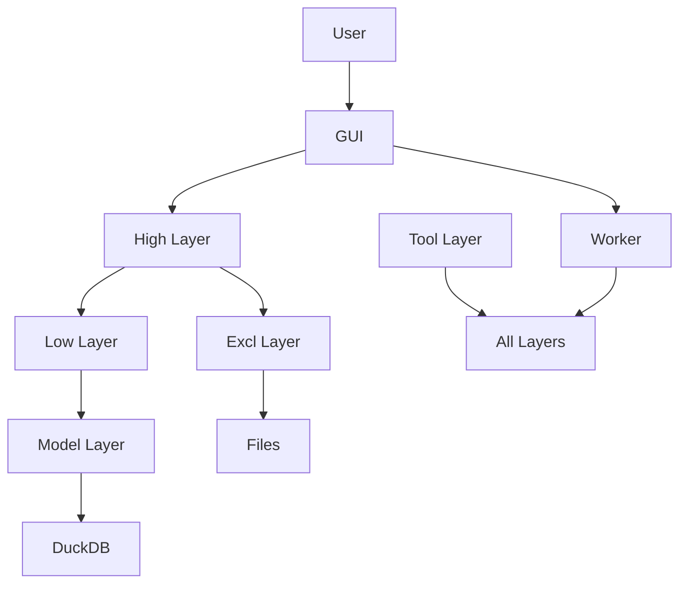

### Architecture Overview
- **Model Layer**: Environment, pipelines, scheduler (RAW→STAGE→PROD)
- **Low Layer**: Materialization, snapshots, trends, styles
- **High Layer**: Workspaces, indicators, reporting
- **Excl Layer**: Excel widgets, formats
- **GUI Layer**: PySide6 interface
- **Tool Layer**: Utilities, logging, lineage

This layered monolith ensures tight coupling for fast runs, with clear separation of concerns.

### System Context & External Integrations
- **Stakeholders**: Analysts, operators, SREs, leadership (governed BI and ELT)
- **Core Engine**: Python + DuckDB (in-process) with Parquet lake: RAW/STAGE/PROD/MASTER
- **Modules**: Model (environment + pipelines + scheduler), Low (materialization components), High (workspaces/practices/indicators), Tool (utilities), GUI (PySide6 desktop app), Excl (Excel widgets)
- **External Systems**: Snowflake (speculative), Outlook (Windows COM), Teams webhook, filesystem
- **Security/PII**: Redact secrets/tokens; Windows-only COM guarded; headless UI guards
- **Non-functional**: Idempotent flows, deterministic sequencing, fail-soft logging, bounded payloads/timeouts

### End-to-End Execution Flows
- Workspace bootstrap → connect DuckDB → register lake views → load configs/macros
- ELT incremental: ingest RAW → normalize STAGE → consolidate PROD → create/replace views → quality artifacts
- Indicator/report: run components → snapshot/trend → Excel build/merge → optional Outlook delivery
- GUI: select workspace → background Workers execute tasks → live logs/results
- Data lineage: SQL dependency extraction → tables_dependency recorded → propagated via wrappers

---

## Current-state Architecture (Detailed Implementation)

This section describes the on-prem/desktop-driven implementation (BIS 4.5 / 5.x).

## High-level architecture (current)
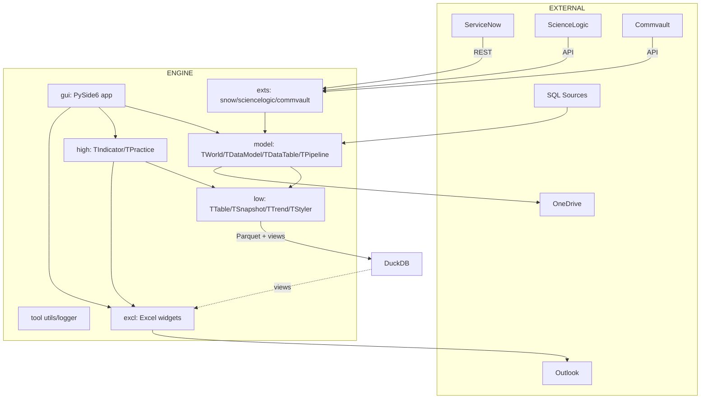

## End-to-end sequence (current)
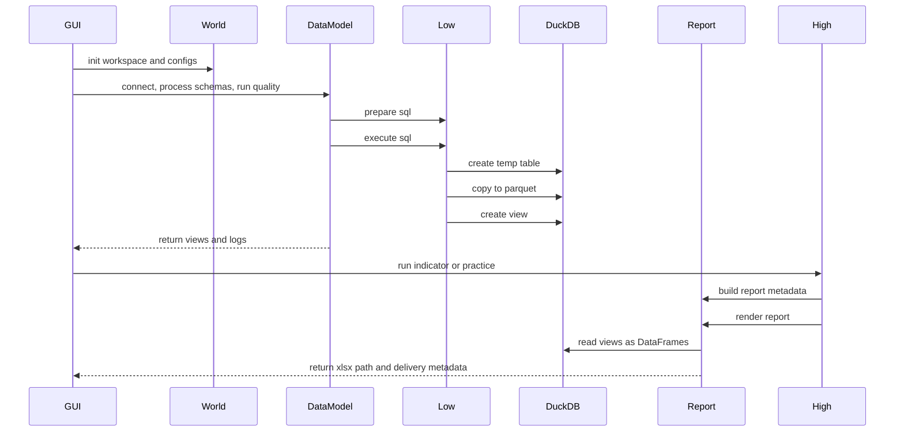

### Deep dive (current)

#### 1. Data architecture

- Data lifecycle
  - Ingestion via extractors or file scan into raw/stage folders
  - Transformation with SQL executed by low-layer tables (TTable)
  - Materialization to Parquet using DuckDB COPY; registration of schema-scoped views over Parquet
  - Publication via views to reporting; export to Excel via excl layer
- Storage model
  - Canonical store: Parquet files with KV metadata; compression typically ZSTD
  - Access plane: DuckDB views defined per logical schema (e.g., stage, prod)
  - Derived data: snapshots and trends maintained by low.snapshot/low.trend
- Naming and schemas
  - Views: CREATE OR REPLACE VIEW <schema>.<table> AS SELECT * FROM read_parquet('<path>')
  - Paths are provided by TWorld; schemas map to "raw", "stage", "prod" conventions
- Dependencies and lineage
  - Table dependency extraction from SQL (tool.utils.extract_table_names)
  - Indicator collects component dependencies to form execution ranks
- Data quality
  - Quality hooks in model: counts, summaries, drift checks (extensible)
  - Optional metadata sidecars derived from Parquet KV metadata
- Performance and scale
  - IO-bound COPY and Excel export dominate
  - Uses temp tables before COPY to constrain memory pressure


#### 2. Application architecture

- Layering
  - tool: cross-cutting utilities (logger bridge, SQL/file helpers, enums)
  - low: data materialization primitives (TTable, TSymptom, TAction, TSnapshot, TTrend, TStyler)
  - model: ELT façade (TDataModel/TDataTable), environment (TWorld), pipeline/scheduler
  - high: indicator/practice orchestration, spec/doc generation, delivery
  - excl: Excel workbook rendering (sheets, tables, charts, formats)
  - gui: PySide6 desktop app for orchestration and tooling
  - exts: external system adapters (ServiceNow, etc.)
- Control flows
  - GUI bootstraps TWorld, then invokes model to process schemas and quality
  - high.TIndicator orchestration invokes low components, then excl for reports
  - Pipelines/scheduler call model verbs in batch
- Public contracts
  - low.table.TTable: prepare_sql(), execute_sql(), view registration
  - model.TDataModel: connect/close, process_* (raw→stage, stage→prod), quality_*, deploy_*
  - high.TIndicator: indicator_execute(), create_excel_report(), deliver_excel_report(), collect_dependencies()
  - excl.TExcelReport: report_export(), widget rendering APIs
- Error handling & retries
  - Exceptions surface to GUI; long ops run in worker threads
  - File/DB operations grouped to allow idempotent re-runs
- Concurrency model
  - GUI uses worker threads via tool.logger.Worker
  - Data ops largely single-node; parallelization left to future enhancements


#### 3. Infrastructure and platform

- Runtime
  - Python 3.x application running on Windows; PySide6 for GUI
  - DuckDB embedded engine; Parquet I/O on local filesystem
- External integrations
  - ServiceNow/ScienceLogic/Commvault via exts drivers
  - Outlook (Windows COM) for email delivery
  - OneDrive for deployment/copy/sync of artifacts
- Filesystem layout (indicative)
  - workspace/<WS>/data/{raw,stage,prod}/…
  - workspace/<WS>/reports/… and specs/…
  - engine/cfg/*.yml for global configs
- Security
  - Local credentials/config files; Windows user context; Outlook integration

#### 4. Configuration and environment management

- engine/cfg/*.yml
  - const.yml, macros.yml, mail.yml, quality.yml, release.yml, sql.yml
- TWorld
  - Central provider of DB handle, root paths, macros, and configuration access
  - Applies macros to paths and SQL where appropriate
- Workspace definitions
  - workspace/workspaces.yml; per-workspace job/practice files (*.job)
- Secrets
  - Stored locally/configured via files; Outlook/OneDrive/ServiceNow credentials from config

#### 5. Business and functional perspective

- Domain language
  - Indicator (KPI/report unit), Practice (group of indicators), Pipeline (ELT composition)
- Outcomes
  - Governed datasets (Parquet + views), Excel reports, specification documents, delivery
- Operator workflows
  - Load/select workspace → run ELT and quality → run indicators/practices → build/export reports → deliver
- SLAs and cadence
  - Frequency encoded in job/practice configs; scheduler/pipeline facilitate routine runs

#### 6. Known constraints and technical debt

- Headless execution secondary to GUI-centric runs
- Local filesystem coupling; OneDrive specific deployment
- Limited standardized quality/lineage signals
- Outlook COM for delivery (Windows-only)

### Data & storage model (current)
- Storage format: Parquet files as the source of truth; DuckDB views over Parquet
- Pattern:
  - CREATE TEMP TABLE AS <SQL>
  - COPY temp table TO parquet (with KV metadata)
  - CREATE/REPLACE VIEW schema.table AS SELECT * FROM parquet
- Derived datasets: snapshots and trends; backup/restore; conversion utilities
- Metadata: Parquet key-value metadata + optional supplementary tables

### Cross-cutting concerns (current)
- Observability: Python logging to GUI; minimal machine-readable logs
- Quality: ad-hoc in model; potential to standardize checks/profiles
- Deployment: OneDrive sync/copy; Windows specifics
- Security: Local secrets/configs; Outlook delivery (Windows COM)
- Scalability: Single-node; IO-bound; suitable for small/medium workloads

### Module deep-dive (current)
- tool — shared utilities and logging
  - Responsibilities: logging bridge for GUI, background worker helpers, SQL/doc helpers, enums/constants.
  - Key APIs:
    - logger: TextHandlerNew, Worker, WorkerSignals
    - utils: extract_table_names, generate_df_base, process_sql_file, get_metadata_from_parquet
    - data: EObjectType, constants

- low — materialization components
  - Responsibilities: Normalize and materialize sources into Parquet + DuckDB views.
  - Key classes: TTable, TSymptom, TAction, TSnapshot, TTrend, TStyler
  - Flow: prepare_sql → execute_sql → COPY to Parquet → CREATE/REPLACE VIEW → UI hints

- model — ELT façade, environment, pipeline
  - Responsibilities: Orchestrate extraction, transforms, loads, quality, hygiene, deployment; provide TWorld.
  - Key classes: TDataModel, TDataTable, TWorld, TPipeline, TScheduler

- high — indicator/practice orchestration
  - Responsibilities: KPI orchestration; components → Excel/spec/docs → delivery
  - Key classes: TIndicator, TPractice, TWorkspace; utils/spec_builder, report_metadata, report_delivery

- excl — Excel report composition
  - Responsibilities: Render governed .xlsx with sheets, tables, charts, formats
  - Key classes: TExcelReport, TExcelSheet, TExcelTable, TExcelHeader, TExcelChart, TExcelSummary, TExcelFormat, TExcelLogo, TExcelCaption

- gui — desktop orchestration
  - Responsibilities: Workspace bootstrapping; ELT ops; indicators/practices; pipelines; SQL/Snow authoring; lake exploration

- exts — extractors
  - ServiceNow: REST pagination → DataFrame → transforms → save to Excel/Parquet/CSV/JSON
  - Commvault / others: placeholders for API drivers

### Appendices (current)
#### Appendix A — Module inventories (from code)
- low: table.py, symptom.py, action.py, snapshot.py, trend.py, component.py, styler.py
- model: data_model.py, data_table.py, world.py, pipeline.py, scheduler.py
- high: indicator.py, practice.py, workspace.py, utils/spec_builder.py, utils/report_metadata.py, utils/report_delivery.py
- excl: excel_report.py, excel_sheet.py, excel_table.py, excel_header.py, excel_chart.py, excel_caption.py, excel_widget.py, excel_summary.py, excel_format.py, excel_logo.py, excel_column.py
- gui: gui_main.py, gui_loader.py, gui_elt.py, gui_admin.py, gui_indicator.py, gui_practice.py, gui_pipeline.py, gui_sql.py, gui_snow.py, gui_search.py, gui_test.py
- tool: logger.py, utils.py
- exts: snow/readme.md (ServiceNow driver), commvault/readme.md (placeholder)
