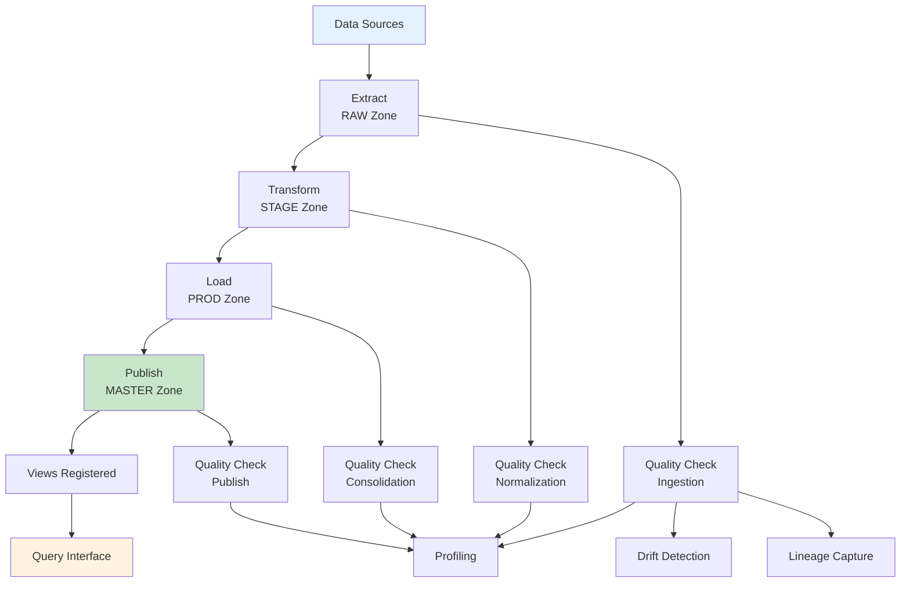
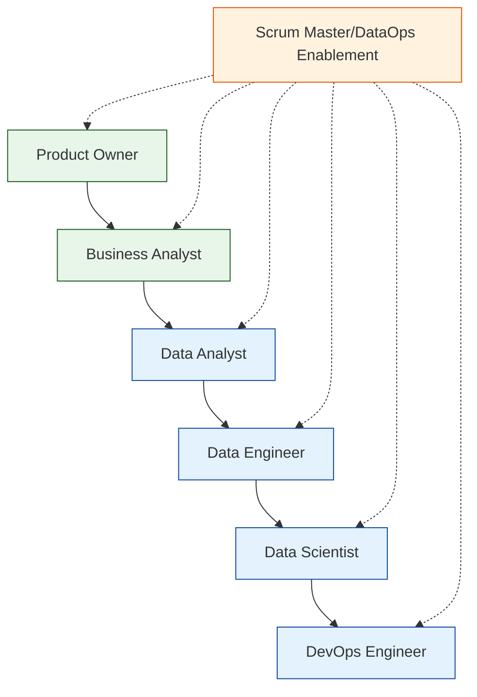
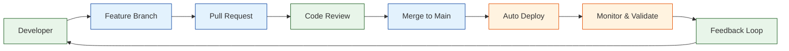
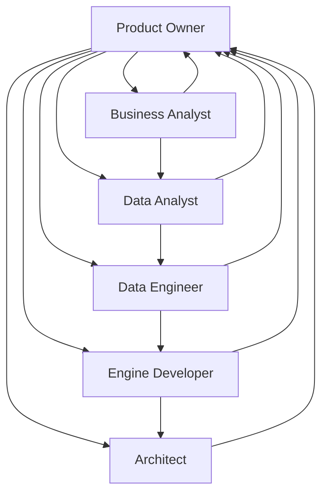
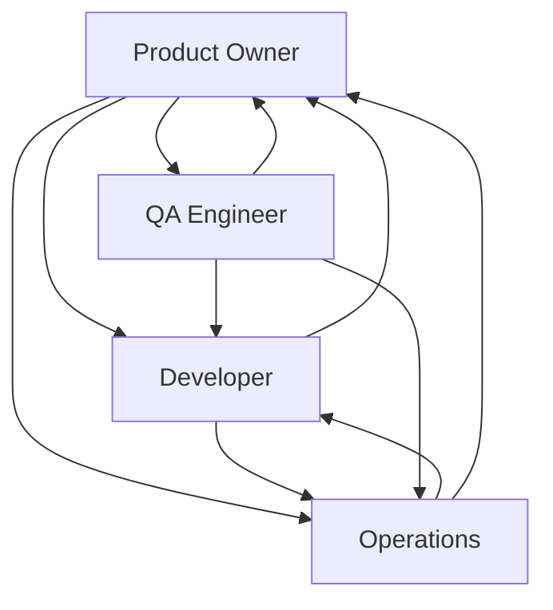

# Engineering Processes

> **BIS Handbook 2.0** — DataOps, DevOps, GitOps, and Development Workflow  
> **Last Updated:** September 13, 2025  
> **Navigation:** [🏠 Main Handbook](../README.md) | [Previous: Configuration](05-Configuration.md) | [Next: Team and Roles](07-Team-and-Roles.md)

---

## Section Overview

**Overview:** Comprehensive guide to DataOps, DevOps, GitOps, and development workflows. Covers the entire software development lifecycle.

**Target Audience:** Development teams, DevOps engineers, project managers, and engineering leaders.

**How to Use:** Follow for development workflow, CI/CD setup, quality assurance, and process improvement. Use checklists and templates for consistent engineering practices.

**Key Content:** Data lifecycle and quality, DataOps principles and squad, dev workflow and GitOps, CI/CD and environments, ELT process implementation.

**Use Cases:** Development planning, CI/CD setup, quality assurance, process improvement, team workflows.

---

## Table of Contents

- [Data Lifecycle and Quality](#data-lifecycle-and-quality)
- [DataOps Principles and Squad](#dataops-principles-and-squad)
- [Dev Workflow and GitOps](#dev-workflow-and-gitops)
- [CI/CD and Environments](#cicd-and-environments)
- [Developer Toolchain](#developer-toolchain)
- [GitHub Actions and Automation](#github-actions-and-automation)
- [Knowledge as Code and RAG](#knowledge-as-code-and-rag)
- [Observability and Reliability](#observability-and-reliability)
- [Security and Compliance](#security-and-compliance)
- [Navigation](#navigation)

---

## Data Lifecycle and Quality

Ingestion → normalization → consolidation → publish, with profiling, drift detection, and lineage capture. Quality hooks run per stage, and lineage tables record dependencies.



### ELT Process Flow
- **Extract**: Data sourced from APIs, local files, or remote systems. Loaded into pandas DataFrames for initial processing. Converted to Parquet format in RAW zone
- **Transform**: Raw data cleaned and deduplicated. Timestamps added for incremental tracking. Transformed data moved to STAGE (temporary) then PROD (optimized)
- **Load**: SQL logic executed via playbooks. Indicator components (symptoms, trends, actions, analytics) saved as separate Parquet files in MASTER zone
- **Registration**: Views automatically registered over Parquet files. Combined PROD/MASTER schema creates unified data lake for querying

### Detailed Lifecycle Steps
- **Ingestion**: Data pulled from sources into RAW Parquet, supporting incremental loads and error handling
- **Normalization**: Data cleaned, transformed, validated in STAGE, with type fixes, null handling, enrichment
- **Consolidation**: STAGE data aggregated and enriched to PROD, creating optimized views for analytics
- **Publish**: PROD views registered in DuckDB, with lineage captured for dependencies and audit trails

### Quality Processes
- **Profiling**: Statistical analysis for data quality, including distributions, outliers, completeness metrics
- **Drift Detection**: Monitoring for schema changes, data shifts, and anomalies over time
- **Lineage Capture**: Tracking data flow from source to report, enabling impact analysis and compliance
- **Quality Hooks**: Automated checks at each stage, configurable via YAML for custom rules

### Quality Gates
- Schema and nullability checks on STAGE and PROD: Ensure data types match expectations and handle missing values appropriately
- Unique keys and referential sanity for published views: Validate relationships, foreign keys, uniqueness constraints
- Trend and snapshot append-only guarantees: Prevent overwrites in historical data, ensuring data integrity
- Custom rules: From quality.yml, e.g., value ranges, format validations, business logic checks
- Performance checks: Query execution times within defined limits to ensure scalability

### Data Quality Measurement Patterns
Implement quality rules using SQL ratios and scoring for data completeness validation.

#### Quality Ratio Calculation
```sql
-- Calculate data quality score (0.1 for symptom, 0.2 for cause, 0.5 for resolution)
SELECT 
    TICKETID,
    SUM(
        CASE WHEN SYMPTOM IS NULL OR SYMPTOM = '' THEN 0 ELSE 0.1 END +
        CASE WHEN CAUSE IS NULL OR CAUSE = '' THEN 0 ELSE 0.2 END +
        CASE WHEN RESOLUTION IS NULL OR RESOLUTION = '' THEN 0 ELSE 0.5 END
    ) AS quality_ratio
FROM incident_table
GROUP BY TICKETID;
```

#### BIS Implementation Workflow
1. Load data into DuckDB using Mini BIS or direct CSV import
2. Create quality measurement table with ratio calculations
3. Export results for analysis and reporting
4. Use ratios to identify data completeness trends over time

#### Common Quality Checks
- Null value detection: `WHERE field IS NULL OR field = ''`
- Pattern validation: `WHERE field NOT LIKE '%expected_pattern%'`
- Range validation: `WHERE numeric_field < min_value OR numeric_field > max_value`
- Duplicate detection: `GROUP BY key_fields HAVING COUNT(*) > 1`

---

## DataOps Principles and Squad

**DataOps Overview**: DataOps combines lean manufacturing, agile culture, and data engineering to enable faster value generation from data. It applies DevOps principles to data pipelines, emphasizing collaboration, automation, and continuous improvement.

### Core DataOps Principles

| Principle | Description | BIS Implementation |
|-----------|-------------|-------------------|
| Establish measurements | Track progress and performance at every stage of the data flow, benchmark cycle times where possible | Quality gates, SLA tracking, lineage monitoring |
| Define semantic layer | Create rules for abstracted data definitions ensuring everyone speaks the same language | YAML configs, standardized schemas, API definitions |
| Validate with feedback | Include human feedback loops and "eyeball tests" for incremental validation and trust | Quality checks, manual validation steps, stakeholder reviews |
| Automate stages | Automate as many data flow stages as possible including BI, data science, and analytics | Pipeline automation, scheduled runs, auto-deployment |
| Optimize bottlenecks | Use performance benchmarks to identify and optimize bottlenecks through hardware or automation | Performance monitoring, query optimization, resource scaling |
| Establish governance | Focus on data ownership, transparency, and comprehensive lineage tracking | Role-based access, audit trails, comprehensive documentation |
| Design for growth | Ensure the data flow model accommodates increasing volume and variety affordably | Scalable architecture, cloud-native design, modular components |

### DataOps Squad Structure



- **Business Squad**: Product Backlog, Business Owner, Product Owner
- **Data Squad**: Business Analyst, Data Analyst, Data Engineer, Data Scientist, DevOps Engineer, DataOps Enablement (Scrum Master)

### Applied for Business Domains
- **ITSM as Code**: IT Service Management automated through code-driven processes
- **Business Observability**: Real-time visibility into business metrics and KPIs
- **Experience Management**: Customer and employee experience tracking and improvement
- **AI Support**: Machine learning and AI model lifecycle management

### Modern Data Stack Integration
Not a single tool, but a set of specialized tools integrated by code (Python, etc.) for efficient data processing and analytics.

### DataOps Model Components

| Layer | Tools & Practices | Purpose |
|-------|-------------------|---------|
| Data Tools & Practices | Python for analysis, business analysis techniques, machine learning algorithms | Core technical capabilities |
| Data as Code | Everything managed as code in repositories (GitHub) - Python, SQL, YAML with high automation | Version control and reproducibility |
| Agile & Scrum | Cross-skilled squad using scrum for governance, backlogs, sprints with reduced dependencies | Project management and delivery |
| Lean Methodologies | PDCA (Plan-Do-Check-Act), value stream mapping, ROI tracking, Kaizen for continuous improvement | Continuous optimization |

---

## Dev Workflow and GitOps

**GitOps Philosophy**: GitOps treats Git as the single source of truth for infrastructure and application configuration. Everything is version-controlled, reviewed, and deployed through Git workflows.

### BIS GitOps Implementation
Everything is handled by Git: engine code, reports, jobs, documentation, formatting. Issues are linked to GitHub, product backlog and scrum ceremonies are managed via GitHub Projects.

| Component | Location | Purpose | GitOps Benefit |
|-----------|----------|---------|----------------|
| Engine Code | `engine/src/` | Core Python modules and business logic | Version control, code review, automated testing |
| Reports/Jobs | `workspace/` | YAML configs for data pipelines and reports | Declarative configuration, change tracking |
| Documentation | `wiki/`, module READMEs | Project knowledge and API documentation | Living documentation, collaborative editing |
| Formatting | `workspace/*/formats.yml` | Excel styling and presentation configs | Consistent output formatting |
| Issues | GitHub Issues | Bug tracking, feature requests | Linked to PRs and branches for traceability |
| Product Backlog | GitHub Projects | Epic and story management | Integrated planning and execution |
| Scrum Process | Issues and Projects | Sprint planning and tracking | Transparent, auditable process |

### Practical GitOps Workflow Example

```yaml
# .github/workflows/bis-ci-cd.yml
name: BIS CI/CD Pipeline

on:
  push:
    branches: [ main, develop ]
  pull_request:
    branches: [ main ]

jobs:
  validate:
    runs-on: ubuntu-latest
    steps:
    - uses: actions/checkout@v3
    - name: Validate YAML configs
      run: |
        find workspace/ -name "*.yml" -exec python -c "import yaml; yaml.safe_load(open('{}'))" \;
    
  test:
    needs: validate
    runs-on: ubuntu-latest
    steps:
    - uses: actions/checkout@v3
    - name: Set up Python
      uses: actions/setup-python@v4
      with:
        python-version: '3.9'
    - name: Install dependencies
      run: pip install -r requirements.txt
    - name: Run unit tests
      run: python -m pytest tests/unit/ -v
    - name: Run integration tests
      run: python -m pytest tests/integration/ -v
  
  deploy-staging:
    needs: test
    runs-on: ubuntu-latest
    if: github.ref == 'refs/heads/develop'
    steps:
    - name: Deploy to staging
      run: echo "Deploying to staging environment"
  
  deploy-production:
    needs: test
    runs-on: ubuntu-latest
    if: github.ref == 'refs/heads/main'
    steps:
    - name: Deploy to production
      run: echo "Deploying to production environment"
```

### GitOps Workflow Principles



### Best Practices
- **Work in small branches** with clear, focused scope
- **Open PRs** with descriptive titles and comprehensive descriptions
- **Preserve public contracts** to maintain API compatibility
- **Keep release notes** detailed and stakeholder-friendly
- **Record decisions as ADRs** (Architecture Decision Records)

### Definition of Done

| Category | Requirements | Validation Method |
|----------|--------------|-------------------|
| Code Quality | Code and YAML validated, linted | Automated CI checks |
| Documentation | Docs and examples updated | Manual review, automated link checking |
| Testing | Tests or smoke scripts executed | Automated test suites |
| Change Management | Release notes and ADR updated if contracts changed | PR review checklist |
| Integration | End-to-end validation in test environment | Automated deployment pipeline |

### Playbook for Schema Changes
1. **Propose additive changes** - Backward compatibility maintained
2. **Include migration notes and tests** - Clear upgrade path documented
3. **Update family checks and quality rules** - Validation logic updated
4. **Validate in dev/test rings** - Multi-environment testing
5. **Gradual rollout** - Phased deployment with monitoring

---

## CI/CD and Environments

Environment matrix and promotion rules are maintained in release.yml. Packaging and scheduled jobs run with required checks for lint and validation.

| Env | Purpose | Data Policy | Promotion |
|----|---------|-------------|-----------|
| dev | rapid iteration, feature work | synthetic or limited real data | branch merge to mainline |
| test | validation and UAT | masked/approved datasets | tagged builds with checks |
| prod | customer delivery | governed real data | release per `release.yml` |

### CI/CD Pipeline Workflow

```mermaid
flowchart LR
    subgraph "Development"
        DEV[👨‍💻 Developer<br/>Feature Branch]
        COMMIT[Commit Changes]
        PUSH[Push to GitHub]
    end
    
    subgraph "Continuous Integration"
        CI_TRIGGER[CI Trigger]
        LINT[🔍 Lint & Validate<br/>YAML/Python]
        UNIT_TEST[🧪 Unit Tests]
        INTEGRATION_TEST[🔗 Integration Tests]
        BUILD[📦 Build Package]
    end
    
    subgraph "Continuous Deployment"
        DEPLOY_DEV[🚀 Deploy to Dev<br/>Synthetic Data]
        SMOKE_TEST[💨 Smoke Tests]
        DEPLOY_TEST[🚀 Deploy to Test<br/>Masked Data]
        UAT_TEST[👥 UAT Testing]
        APPROVAL[✅ Manual Approval]
        DEPLOY_PROD[🚀 Deploy to Prod<br/>Real Data]
    end
    
    subgraph "Monitoring"
        MONITOR[📊 Monitor & Alert]
        ROLLBACK[↩️ Rollback<br/>if needed]
    end
    
    DEV --> COMMIT
    COMMIT --> PUSH
    PUSH --> CI_TRIGGER
    
    CI_TRIGGER --> LINT
    LINT --> UNIT_TEST
    UNIT_TEST --> INTEGRATION_TEST
    INTEGRATION_TEST --> BUILD
    
    BUILD --> DEPLOY_DEV
    DEPLOY_DEV --> SMOKE_TEST
    SMOKE_TEST --> DEPLOY_TEST
    DEPLOY_TEST --> UAT_TEST
    UAT_TEST --> APPROVAL
    APPROVAL --> DEPLOY_PROD
    
    DEPLOY_PROD --> MONITOR
    MONITOR --> ROLLBACK
    
    ROLLBACK --> DEPLOY_DEV
    
    classDef dev fill:#E8F5E9,stroke:#1B5E20
    classDef ci fill:#E3F2FD,stroke:#0D47A1
    classDef cd fill:#FFF3E0,stroke:#E65100
    classDef monitor fill:#FCE4EC,stroke:#880E4F
    
    class DEV,COMMIT,PUSH dev
    class CI_TRIGGER,LINT,UNIT_TEST,INTEGRATION_TEST,BUILD ci
    class DEPLOY_DEV,SMOKE_TEST,DEPLOY_TEST,UAT_TEST,APPROVAL,DEPLOY_PROD cd
    class MONITOR,ROLLBACK monitor
```



### Deployment Strategy Comparison

| **Strategy** | **Use Case** | **Pros** | **Cons** | **BIS Fit** | **Risk Level** |
|-------------|-------------|----------|----------|------------|---------------|
| **Big Bang** | Small changes, critical fixes | Simple, fast deployment | High risk, no rollback | Low | 🔴 High |
| **Rolling Update** | Stateless applications | Zero downtime, gradual rollout | Complex monitoring, partial failures | Medium | 🟡 Medium |
| **Blue-Green** | Database changes, major releases | Instant rollback, thorough testing | Double resources, complex routing | High | 🟢 Low |
| **Canary** | New features, A/B testing | Risk mitigation, user feedback | Complex traffic routing, monitoring | High | 🟢 Low |
| **Feature Flags** | Gradual feature rollout | Instant enable/disable, A/B testing | Code complexity, flag management | High | 🟢 Low |

### CI/CD Pipeline Comparison

| **Pipeline Type** | **Best For** | **Build Time** | **Test Coverage** | **Deployment Speed** | **Maintenance** |
|------------------|-------------|---------------|------------------|-------------------|---------------|
| **Simple Linear** | Small teams, simple apps | Fast (< 5 min) | Basic (unit tests) | Fast | Low |
| **Multi-Stage** | Medium teams, complex apps | Medium (5-15 min) | Comprehensive | Medium | Medium |
| **Parallel Jobs** | Large teams, microservices | Fast (parallel) | Extensive | Fast | High |
| **Monorepo** | Single repo, multiple services | Variable | Comprehensive | Variable | High |
| **Multi-Repo** | Independent services | Fast per service | Focused | Fast | Medium |

### Version Control Strategy Comparison

| **Strategy** | **Branching Model** | **Merge Frequency** | **Code Review** | **Release Cadence** | **Complexity** |
|-------------|-------------------|-------------------|----------------|-------------------|---------------|
| **Git Flow** | Feature/develop/main | Weekly releases | Thorough | Monthly | High |
| **GitHub Flow** | Main + feature branches | Continuous | Light | Weekly | Low |
| **Trunk-Based** | Single trunk | Daily commits | Automated | Daily | Low |
| **Release Branch** | Main + release branches | Release-based | Comprehensive | Variable | Medium |

### Release Confidence
- Every release leaves the system better documented, easier to reason about, and more valuable

---

## Developer Toolchain

Recommended extensions: GitHub Copilot, Python, YAML, Markdown, Mermaid, GitLens, and a SQL extension. Tasks include launching the GUI from VS Code. Personas guide how to use AI safely; see Chatmodes.

### Task Launch
- Example: VS Code task "Run BIS GUI (VS Code Launch)" starts the GUI with the configured venv

### Experience Goals
- Onboard fast, iterate safely, and let the tools do the heavy lifting

---

## GitHub Actions and Automation

Workflows handle build, lint, and packaging; issues and PRs can be triaged by agents aligned to Planner, Janitor, and Knowledge Manager personas. Required checks must pass before merge.

### Automation Spirit
- Robots do the chores; humans do the judgment. Keep it that way

---

## Knowledge as Code and RAG

Docs, READMEs, and specs are curated for agents to consume locally, enabling offline or private RAG.

### Content Sources and Cadence
- **Sources**: wiki, module READMEs, workspace YAML, BIS API, architecture doc
- **Cadence**: update on release and when tenant specs materially change

---

## Observability and Reliability

Logging categories map to GUI tabs and background workers. Prioritize idempotency, retries, and fail-soft behavior. Metrics can be added incrementally.

### Categories
- GUI_* channels for per-tab logs
- Worker/Signals for background tasks
- Lineage tables for data dependencies

---

## Security and Compliance

| Threat | Mitigation |
|--------|------------|
| PII leakage | Redact or avoid storing PII, limit logs |
| Outlook COM misuse | Windows-only guard and opt-in |
| Cross-tenant data access | Strict path isolation and checks |
| Secrets exposure | Use OS stores or secret managers; never commit secrets |

---

## Navigation

**[🏠 Main Handbook](../handbook2/Handbook.md)** | **[Previous: Configuration](Configuration.md)** | **[Next: Team and Roles](Team-and-Roles.md)**

### Quick Links
- [📋 Complete Table of Contents](../handbook2/Handbook.md#table-of-contents)
- [🎯 Executive Summary](../handbook2/Handbook.md#executive-summary)
- [🔗 Key Resources](../handbook2/Handbook.md#key-resources)
- [📚 All Handbook Sections](../handbook2/Handbook.md#handbook-sections)

---

## Scrum Framework and Agile Ceremonies

### Scrum Methodology Overview

Scrum is an agile framework for developing, delivering, and sustaining complex products. BIS implements Scrum to manage development cycles, ensuring iterative delivery and continuous improvement.

#### Scrum Pillars
- **Transparency**: All aspects of the process must be visible to those responsible for the outcome
- **Inspection**: Scrum artifacts and progress toward goals must be inspected frequently
- **Adaptation**: If aspects deviate outside acceptable limits, they must be adjusted

#### Scrum Values
- **Commitment**: Team members individually commit to achieving their team goals
- **Courage**: Team has courage to do the right thing and work on tough problems
- **Focus**: Team focuses on high-priority work and goals
- **Openness**: Team and stakeholders are open about work and challenges
- **Respect**: Team members respect each other to be capable, independent people

### Scrum Roles and Responsibilities

#### Product Owner
- **Responsibilities**:
  - Define and communicate product vision and goals
  - Manage and prioritize product backlog
  - Accept or reject work results
  - Collaborate with stakeholders and team
  - Ensure backlog is visible, transparent, and understood

- **Success Criteria**:
  - Clear product roadmap and sprint goals
  - Well-refined backlog with detailed user stories
  - Strong stakeholder relationships
  - Data-driven prioritization decisions

#### Scrum Master
- **Responsibilities**:
  - Coach team and organization on Scrum principles
  - Remove impediments and obstacles
  - Facilitate Scrum ceremonies
  - Protect team from external distractions
  - Promote continuous improvement

- **Success Criteria**:
  - Smooth ceremony execution
  - Resolved impediments and blockers
  - Team self-organization and empowerment
  - Continuous process improvements

#### Development Team
- **Characteristics**:
  - Cross-functional (analysis, development, testing, operations)
  - Self-organizing and self-managing
  - No titles or sub-teams
  - Accountable for sprint commitments

- **Responsibilities**:
  - Deliver potentially releasable product increments
  - Participate in all ceremonies
  - Collaborate on technical decisions
  - Continuously improve practices

### Scrum Artifacts

#### Product Backlog
- **Purpose**: Living artifact containing all potential work
- **Content**:
  - Epics: Large features broken into smaller stories
  - User Stories: "As a [user], I want [feature] so that [benefit]"
  - Bugs and technical debt items
  - Spikes: Research and investigation tasks

- **Refinement Process**:
  - Regular backlog grooming sessions
  - Story point estimation using Fibonacci sequence
  - Acceptance criteria definition
  - Prioritization using MoSCoW or value/effort matrix

#### Sprint Backlog
- **Purpose**: Plan for current sprint work
- **Content**:
  - Selected product backlog items
  - Sprint goal statement
  - Task breakdown for each story
  - Capacity and velocity considerations

- **Maintenance**:
  - Daily updates during sprint
  - Burndown chart tracking
  - Scope change management

#### Increment
- **Definition**: Sum of all product backlog items completed during sprint plus value of increments from previous sprints
- **Requirements**:
  - Potentially releasable
  - Meets definition of done
  - Approved by product owner

### Scrum Ceremonies

#### Sprint Planning (4 hours for 2-week sprint)
**Purpose**: Plan work for upcoming sprint and commit to sprint goal

**Agenda**:
1. **What**: Product Owner presents prioritized backlog items
2. **How**: Team discusses approach, breaks down into tasks, estimates effort
3. **Commitment**: Team agrees on sprint goal and scope

**Inputs**:
- Refined product backlog
- Team velocity and capacity
- Sprint goal from product owner

**Outputs**:
- Sprint backlog with committed items
- Sprint goal statement
- Task breakdown and estimates

#### Daily Scrum (15 minutes)
**Purpose**: Inspect progress toward sprint goal and adapt plan

**Format** (Three Questions)**:
1. What did I accomplish yesterday?
2. What will I accomplish today?
3. What obstacles are impeding my progress?

**Best Practices**:
- Stand-up format to keep energy high
- Focus on collaboration and problem-solving
- Update task board and burndown chart
- Keep to time box and follow-up offline

#### Sprint Review (2 hours for 2-week sprint)
**Purpose**: Inspect increment and adapt product backlog

**Agenda**:
1. **Demonstration**: Team showcases completed work
2. **Feedback**: Stakeholders provide input and suggestions
3. **Metrics**: Review velocity, quality, and other metrics
4. **Backlog Adaptation**: Update priorities based on new information

**Success Factors**:
- Invite relevant stakeholders
- Focus on value delivered
- Gather actionable feedback
- Update backlog priorities

#### Sprint Retrospective (1.5 hours for 2-week sprint)
**Purpose**: Inspect process and identify improvements

**Format** (What Went Well, What Could Be Improved, Action Items)**:
1. **Data Gathering**: What went well? What didn't?
2. **Problem Analysis**: Why did issues occur?
3. **Solution Generation**: What can we improve?
4. **Action Planning**: Specific, measurable improvements

**Improvement Categories**:
- **People**: Team dynamics and collaboration
- **Process**: Ceremonies, tools, and workflows
- **Product**: Quality, features, and technical practices
- **Tools**: Development environment and automation

### Sprint Execution and Management

#### Sprint Duration and Cadence
- **Standard Length**: 2 weeks (balanced for planning overhead vs. delivery speed)
- **Special Sprints**: Hardening sprints, innovation sprints, release sprints
- **Sprint Zero**: Initial setup and preparation sprint

#### Capacity Planning
- **Team Capacity**: Available hours considering vacations, meetings, training
- **Focus Factor**: Percentage of time available for sprint work (typically 70-80%)
- **Velocity Tracking**: Historical story points completed per sprint

#### Definition of Ready (DoR)
Checklist ensuring backlog items are prepared for sprint:
- Clear and concise description
- Acceptance criteria defined
- Story points estimated
- Dependencies identified
- Sized appropriately (not too large)
- Business value understood

#### Definition of Done (DoD)
Checklist ensuring work is complete and potentially releasable:
- Code written and unit tested
- Code reviewed and approved
- Automated tests passing
- Documentation updated
- Acceptance criteria met
- No known bugs
- Product owner acceptance

### Metrics and Measurement

#### Velocity Metrics
- **Sprint Velocity**: Average story points completed per sprint
- **Team Velocity**: Individual contribution tracking
- **Velocity Trend**: Consistency and predictability over time

#### Quality Metrics
- **Defect Density**: Bugs per story point or per lines of code
- **Test Coverage**: Percentage of code covered by automated tests
- **Code Quality**: Static analysis and technical debt metrics

#### Delivery Metrics
- **Sprint Goal Success**: Percentage of sprints meeting goals
- **Burndown Accuracy**: How well team follows planned trajectory
- **Lead Time**: Time from backlog entry to production deployment
- **Cycle Time**: Time from work start to completion

### Scaling Scrum for BIS

#### Scrum of Scrums
For coordinating multiple teams working on BIS components:
- **Frequency**: Daily or every other day (15-30 minutes)
- **Participants**: Scrum Masters or team representatives
- **Focus**: Dependencies, impediments, integration points

#### Integration with DataOps
- **Data Pipeline Sprints**: Dedicated sprints for data engineering work
- **Quality Gate Integration**: Automated testing in sprint workflow
- **Continuous Delivery**: Automated deployment integrated with sprint cadence

#### Cross-Team Coordination
- **API Contracts**: Clear interfaces between engine, GUI, and workspace teams
- **Shared Backlog**: Common product backlog with team-specific views
- **Release Planning**: Coordinated releases across interdependent components

### Common Scrum Challenges and Solutions

#### Challenge: Scope Creep
**Symptoms**: Sprint goals changing mid-sprint, unplanned work added
**Solutions**:
- Strict adherence to sprint goal
- Product Owner shields team from external requests
- Clear acceptance criteria and definition of done

#### Challenge: Low Velocity Consistency
**Symptoms**: Highly variable sprint velocities, unpredictable delivery
**Solutions**:
- Consistent sprint length and team composition
- Improved estimation techniques
- Regular retrospectives to identify blockers

#### Challenge: Poor Product Backlog Quality
**Symptoms**: Unclear requirements, missing acceptance criteria, large stories
**Solutions**:
- Regular backlog refinement sessions
- Clear definition of ready
- Story splitting techniques

#### Challenge: Team Dysfunction
**Symptoms**: Lack of collaboration, finger-pointing, missed commitments
**Solutions**:
- Team-building activities
- Clear role definitions and expectations
- Focus on Scrum values and principles

### Integration with DevOps Practices

#### Continuous Integration
- **Automated Testing**: Unit tests run on every commit
- **Code Quality Gates**: Static analysis and linting
- **Automated Builds**: Consistent build process for all components

#### Continuous Delivery
- **Automated Deployment**: Environment-specific deployment pipelines
- **Feature Flags**: Controlled rollout of new functionality
- **Rollback Procedures**: Quick recovery from failed deployments

#### Infrastructure as Code
- **Version Control**: All infrastructure configurations in Git
- **Automated Provisioning**: Environment setup and configuration
- **Immutable Infrastructure**: Consistent, reproducible deployments

This comprehensive Scrum framework ensures BIS development follows agile best practices while maintaining the flexibility needed for data-driven product development.

## Legacy Content from 05-Engineering-Process.md

# Engineering process: DataOps, DevOps, and GitOps

> **Canonical** — Extracted from BIS Handbook  
> **Last Updated:** 2025-09-03  
> **Navigation:** [← BIS Executive Summary](../Handbook.md) | [📚 All Handbook Sections](../Handbook.md#handbook-sections)


### Data lifecycle and quality
Ingestion → normalization → consolidation → publish, with profiling, drift detection, and lineage capture. Quality hooks run per stage, and lineage tables record dependencies.

**ELT Process Flow:**
- **Extract**: Data sourced from APIs, local files, or remote systems. Loaded into pandas DataFrames for initial processing. Converted to Parquet format in RAW zone.
- **Transform**: Raw data cleaned and deduplicated. Timestamps added for incremental tracking. Transformed data moved to STAGE (temporary) then PROD (optimized).
- **Load**: SQL logic executed via playbooks. Indicator components (symptoms, trends, actions, analytics) saved as separate Parquet files in MASTER zone.
- **Registration**: Views automatically registered over Parquet files. Combined PROD/MASTER schema creates unified data lake for querying.

Detailed Lifecycle Steps
- Ingestion: Data is pulled from sources like APIs, files, or databases into RAW Parquet, supporting incremental loads and error handling.
- Normalization: Data is cleaned, transformed, and validated in STAGE, with type fixes, null handling, and enrichment from external sources.
- Consolidation: STAGE data is aggregated and enriched to PROD, creating optimized views for analytics and reporting.
- Publish: PROD views are registered in DuckDB, with lineage captured for dependencies and audit trails.

Quality Processes
- Profiling: Statistical analysis for data quality, including distributions, outliers, and completeness metrics.
- Drift detection: Monitoring for schema changes, data shifts, and anomalies over time.
- Lineage capture: Tracking data flow from source to report, enabling impact analysis and compliance.
- Quality hooks: Automated checks at each stage, configurable via YAML for custom rules.

Quality gates
- Schema and nullability checks on STAGE and PROD: Ensure data types match expectations and handle missing values appropriately.
- Unique keys and referential sanity for published views: Validate relationships, foreign keys, and uniqueness constraints.
- Trend and snapshot append-only guarantees: Prevent overwrites in historical data, ensuring data integrity.
- Custom rules: From quality.yml, e.g., value ranges, format validations, and business logic checks.
- Performance checks: Query execution times within defined limits to ensure scalability.

**Data quality measurement patterns:**
Implement quality rules using SQL ratios and scoring for data completeness validation.

*Quality ratio calculation:*
```sql
-- Calculate data quality score (0.1 for symptom, 0.2 for cause, 0.5 for resolution)
SELECT 
    TICKETID,
    SUM(
        CASE WHEN SYMPTOM IS NULL OR SYMPTOM = '' THEN 0 ELSE 0.1 END +
        CASE WHEN CAUSE IS NULL OR CAUSE = '' THEN 0 ELSE 0.2 END +
        CASE WHEN RESOLUTION IS NULL OR RESOLUTION = '' THEN 0 ELSE 0.5 END
    ) AS quality_ratio
FROM incident_table
GROUP BY TICKETID;
```

*BIS implementation workflow:*
1. Load data into DuckDB using Mini BIS or direct CSV import
2. Create quality measurement table with ratio calculations
3. Export results for analysis and reporting
4. Use ratios to identify data completeness trends over time

*Common quality checks:*
- Null value detection: `WHERE field IS NULL OR field = ''`
- Pattern validation: `WHERE field NOT LIKE '%expected_pattern%'`
- Range validation: `WHERE numeric_field < min_value OR numeric_field > max_value`
- Duplicate detection: `GROUP BY key_fields HAVING COUNT(*) > 1`

References
- Quality.yml and module hooks: `../../engine/cfg/quality.yml`, module READMEs

Operator confidence
- Quality gates fail fast with clear messages, stopping runs early on issues and providing actionable feedback.
- Lineage makes impact analysis and audits a breeze, tracing data from source to report for compliance.
- Idempotent operations ensure safe retries without side effects, maintaining system stability.
- Comprehensive logging provides detailed traces for troubleshooting and performance monitoring.

### DataOps Principles and Squad

**DataOps Overview:**
DataOps combines lean manufacturing, agile culture, and data engineering to enable faster value generation from data. It applies DevOps principles to data pipelines, emphasizing collaboration, automation, and continuous improvement.

📚 **Learn More About DataOps**: 
- [DataOps Manifesto](https://www.dataopsmanifesto.org/) - Core principles and values
- [IBM DataOps Guide](https://www.ibm.com/topics/dataops) - Comprehensive overview and best practices
- [Microsoft DataOps Framework](https://docs.microsoft.com/en-us/azure/architecture/data-guide/scenarios/dataops) - Implementation guidance

**Core DataOps Principles:**

| **Principle** | **Description** | **BIS Implementation** |
|---------------|-----------------|------------------------|
| **Establish measurements** | Track progress and performance at every stage of the data flow, benchmark cycle times where possible | Quality gates, SLA tracking, lineage monitoring |
| **Define semantic layer** | Create rules for abstracted data definitions ensuring everyone speaks the same language | YAML configs, standardized schemas, API definitions |
| **Validate with feedback** | Include human feedback loops and "eyeball tests" for incremental validation and trust | Quality checks, manual validation steps, stakeholder reviews |
| **Automate stages** | Automate as many data flow stages as possible including BI, data science, and analytics | Pipeline automation, scheduled runs, auto-deployment |
| **Optimize bottlenecks** | Use performance benchmarks to identify and optimize bottlenecks through hardware or automation | Performance monitoring, query optimization, resource scaling |
| **Establish governance** | Focus on data ownership, transparency, and comprehensive lineage tracking | Role-based access, audit trails, comprehensive documentation |
| **Design for growth** | Ensure the data flow model accommodates increasing volume and variety affordably | Scalable architecture, cloud-native design, modular components |

**DataOps Squad Structure:**



**DataOps Squad Roles:**
- **Product Owner (PO)**: Defines vision, prioritizes backlog, ensures business value delivery
- **Business Analyst (BA)**: Gathers requirements, defines KPIs, validates business logic
- **Data Analyst (DA)**: Translates requirements to SQL, designs data views, ensures quality
- **Data Engineer (DE)**: Builds pipelines, manages infrastructure, optimizes performance
- **Engine Developer**: Implements core modules, Excel generation, API integrations
- **Architect**: Designs system architecture, ensures scalability, guides technical decisions

**DataOps Workflow:**
1. **Requirements Gathering**: BA collects business needs and defines success criteria
2. **Data Design**: DA translates requirements into SQL views and quality checks
3. **Pipeline Development**: DE builds automated ELT pipelines with quality gates
4. **Indicator Creation**: Engine Developer implements symptoms, actions, and analytics
5. **Testing & Validation**: All roles participate in testing and stakeholder validation
6. **Deployment & Monitoring**: Automated deployment with continuous monitoring
7. **Feedback & Improvement**: Regular retrospectives and backlog refinement

**Key DataOps Benefits:**
- **Faster Time-to-Value**: Reduced cycle times from weeks to days
- **Higher Quality**: Automated quality gates and comprehensive testing
- **Better Collaboration**: Cross-functional teams with shared ownership
- **Scalable Operations**: Automated processes that grow with data volume
- **Continuous Improvement**: Regular feedback loops and optimization cycles

### DevOps Principles and Implementation

**DevOps Overview:**
DevOps integrates development and operations to enable faster, more reliable software delivery. It emphasizes automation, collaboration, and continuous improvement.

**Core DevOps Principles:**

| **Principle** | **Description** | **BIS Implementation** |
|---------------|-----------------|------------------------|
| **Automation** | Automate repetitive tasks and processes | CI/CD pipelines, automated testing, deployment scripts |
| **Collaboration** | Break down silos between teams | Cross-functional squads, shared tooling, joint ownership |
| **Continuous Integration** | Frequent code integration and testing | GitHub Actions, automated builds, quality gates |
| **Continuous Delivery** | Automated deployment to production | Environment promotion, rollback procedures, monitoring |
| **Monitoring & Feedback** | Real-time visibility and rapid response | Logging, alerting, performance monitoring |
| **Culture of Learning** | Embrace failure and continuous improvement | Blameless postmortems, retrospectives, knowledge sharing |

**DevOps Squad Structure:**



**DevOps Workflow:**
1. **Planning**: Define features and acceptance criteria
2. **Development**: Code implementation with automated testing
3. **Integration**: Continuous integration and automated builds
4. **Testing**: Automated and manual testing across environments
5. **Deployment**: Automated deployment with rollback capabilities
6. **Monitoring**: Real-time monitoring and alerting
7. **Feedback**: User feedback and performance metrics

**DevOps Tooling in BIS:**
- **Version Control**: Git with GitHub for collaboration and code review
- **CI/CD**: GitHub Actions for automated builds and deployments
- **Testing**: Pytest for unit testing, integration testing frameworks
- **Monitoring**: Logging frameworks, performance monitoring tools
- **Configuration**: YAML-based configuration management
- **Containerization**: Docker for consistent environments (future)

### GitOps Principles and Implementation

**GitOps Overview:**
GitOps uses Git as the single source of truth for infrastructure and application deployments, enabling declarative, version-controlled, and automated operations.

**Core GitOps Principles:**

| **Principle** | **Description** | **BIS Implementation** |
|---------------|-----------------|------------------------|
| **Declarative Configuration** | Describe desired state, not imperative steps | YAML configurations, infrastructure as code |
| **Version Control Everything** | All changes go through Git | Configuration files, deployment manifests, documentation |
| **Automated Deployments** | Changes to Git trigger automated deployments | GitHub Actions, webhook integrations |
| **Observability** | Monitor and observe system state | Logging, metrics, health checks |
| **Immutable Infrastructure** | Treat infrastructure as immutable | Environment consistency, rollback procedures |

**GitOps Workflow:**
1. **Change Request**: Propose changes via pull requests
2. **Review & Approval**: Code review and automated testing
3. **Merge**: Changes merged to main branch
4. **Automated Deployment**: GitOps operator detects changes and deploys
5. **Verification**: Automated tests and health checks
6. **Monitoring**: Continuous monitoring and alerting

**GitOps Benefits:**
- **Consistency**: Declarative configurations ensure consistent environments
- **Auditability**: Complete history of all changes in Git
- **Reliability**: Automated deployments reduce human error
- **Scalability**: Easy to manage multiple environments
- **Security**: Review processes and automated compliance checks

### Engineering Process Integration

**Unified Engineering Framework:**
BIS combines DataOps, DevOps, and GitOps into a cohesive engineering framework that supports the entire product lifecycle from data ingestion to user delivery.

**Integrated Workflow:**
1. **DataOps**: Ingest, transform, and quality-check data
2. **DevOps**: Develop, test, and deploy application code
3. **GitOps**: Manage configuration and infrastructure changes
4. **Monitoring**: Continuous monitoring across all layers
5. **Feedback**: User feedback and performance metrics drive improvements

**Key Integration Points:**
- **Shared Tooling**: Common tools for version control, CI/CD, and monitoring
- **Unified Metrics**: End-to-end visibility from data to user experience
- **Collaborative Culture**: Cross-functional teams with shared responsibilities
- **Automated Governance**: Policy as code for compliance and security
- **Continuous Learning**: Feedback loops drive process improvements

**Engineering Excellence Metrics:**
- **Deployment Frequency**: How often new features are deployed
- **Lead Time**: Time from code commit to production deployment
- **Change Failure Rate**: Percentage of deployments that fail
- **Mean Time to Recovery**: Time to recover from failures
- **Data Quality Score**: Percentage of data meeting quality standards
- **User Satisfaction**: Customer feedback and usage metrics

This integrated engineering framework ensures BIS delivers high-quality, reliable, and valuable solutions while maintaining operational excellence and continuous improvement.

---

## Comprehensive Development Workflow Templates

### Sprint Planning Template

```markdown
# Sprint Planning Template

## Sprint Information
**Sprint Number:** [Sprint Number]  
**Sprint Duration:** [Start Date] to [End Date]  
**Sprint Goal:** [One-sentence goal for the sprint]  
**Sprint Capacity:** [Total story points or hours available]  

## Team Capacity
| Team Member | Available Hours | Role | Notes |
|-------------|-----------------|------|-------|
| [Name] | [Hours] | [Role] | [Vacation, training, etc.] |
| [Name] | [Hours] | [Role] | [Vacation, training, etc.] |
| [Name] | [Hours] | [Role] | [Vacation, training, etc.] |

**Total Capacity:** [Sum of available hours]  
**Focus Factor:** [Percentage of time for sprint work, e.g., 80%]  
**Adjusted Capacity:** [Total × Focus Factor]  

## Product Backlog Items

### Committed Items
| ID | Title | Story Points | Priority | Assignee | Acceptance Criteria |
|----|-------|--------------|----------|----------|-------------------|
| [ID] | [Title] | [Points] | [Priority] | [Assignee] | [Criteria] |
| [ID] | [Title] | [Points] | [Priority] | [Assignee] | [Criteria] |

### Sprint Backlog Tasks
| Story ID | Task Description | Estimated Hours | Assignee | Status |
|----------|------------------|-----------------|----------|--------|
| [ID] | [Task] | [Hours] | [Assignee] | [Status] |
| [ID] | [Task] | [Hours] | [Assignee] | [Status] |

## Sprint Risks and Mitigations
| Risk | Probability | Impact | Mitigation Plan | Owner |
|------|-------------|--------|-----------------|-------|
| [Risk] | [High/Med/Low] | [High/Med/Low] | [Plan] | [Owner] |
| [Risk] | [High/Med/Low] | [High/Med/Low] | [Plan] | [Owner] |

## Definition of Done
- [ ] Code written and unit tests passing
- [ ] Code reviewed and approved
- [ ] Integration tests passing
- [ ] Documentation updated
- [ ] Acceptance criteria met
- [ ] Product Owner acceptance
- [ ] No known critical bugs

## Sprint Ceremonies Schedule
- **Daily Scrum:** [Time] via [Platform]
- **Sprint Review:** [Date/Time] - [Location/Platform]
- **Sprint Retrospective:** [Date/Time] - [Location/Platform]

## Success Metrics
- **Velocity Target:** [Story points to complete]
- **Quality Target:** [Test coverage %, defect rate]
- **Delivery Target:** [Items to be completed]

## Communication Plan
- **Daily Updates:** [Slack channel, email, etc.]
- **Stakeholder Updates:** [Frequency and method]
- **Blocker Escalation:** [Process for raising issues]

## Sprint Commitment
**Team Commitment:** We commit to completing the above items and achieving the sprint goal.

**Product Owner Acceptance:** [PO Name] - [Date]

**Scrum Master Confirmation:** [SM Name] - [Date]
```

### User Story Template

```markdown
# User Story: [Story Title]

## Story Information
**ID:** US-[Number]  
**Epic:** [Epic Name/ID]  
**Priority:** [High/Medium/Low]  
**Estimate:** [Story Points]  
**Assignee:** [Name]  

## As a [User Type]
**I want** [Functionality]  
**So that** [Business Value/Benefit]

## Acceptance Criteria
### Functional Requirements
- [ ] [Specific requirement with measurable outcome]
- [ ] [Specific requirement with measurable outcome]
- [ ] [Specific requirement with measurable outcome]

### Non-Functional Requirements
- [ ] [Performance, security, usability requirements]
- [ ] [Performance, security, usability requirements]

### Business Rules
- [ ] [Business rule that must be enforced]
- [ ] [Business rule that must be enforced]

## Definition of Done
- [ ] Code implemented and unit tests written
- [ ] Code reviewed and approved by peer
- [ ] Integration tests passing
- [ ] Documentation updated (if applicable)
- [ ] Product Owner acceptance
- [ ] No known defects

## Technical Notes
**Assumptions:**
- [Assumption 1]
- [Assumption 2]

**Dependencies:**
- [Dependency 1]
- [Dependency 2]

**Technical Approach:**
[High-level technical solution or approach]

## Test Cases
### Positive Test Cases
1. [Test case description]
2. [Test case description]

### Negative Test Cases
1. [Test case description]
2. [Test case description]

### Edge Cases
1. [Test case description]
2. [Test case description]

## Attachments
- [Mockups/Wireframes]
- [Related Documents]
- [Technical Specifications]
```

### Feature Branch Workflow Template

```markdown
# Feature Development Workflow

## Branch Naming Convention
**Branch Name:** feature/[ticket-id]-[short-description]  
**Example:** feature/US-123-add-user-authentication

## Development Process

### 1. Branch Creation
```bash
# Create and checkout feature branch
git checkout -b feature/US-123-add-user-authentication
```

### 2. Development Setup
- [ ] Pull latest changes from main
- [ ] Set up local development environment
- [ ] Install dependencies
- [ ] Run existing tests to ensure baseline

### 3. Implementation Steps
- [ ] Implement core functionality
- [ ] Write unit tests
- [ ] Update documentation
- [ ] Run tests locally
- [ ] Address any failing tests

### 4. Code Quality Checks
- [ ] Run linter (flake8, pylint)
- [ ] Check code formatting (black, autopep8)
- [ ] Run security scans
- [ ] Update type hints
- [ ] Add docstrings

### 5. Commit Strategy
```bash
# Make small, focused commits
git add [specific files]
git commit -m "feat: implement user authentication logic

- Add login endpoint
- Implement JWT token generation
- Add password hashing

Closes US-123"
```

### 6. Pull Request Preparation
- [ ] Push branch to remote
- [ ] Create pull request with detailed description
- [ ] Add relevant labels and assignees
- [ ] Link to related issues/tickets

### 7. Pull Request Template
```markdown
## Description
[Brief description of the changes]

## Changes Made
- [Change 1]
- [Change 2]
- [Change 3]

## Testing
- [ ] Unit tests added/updated
- [ ] Integration tests passing
- [ ] Manual testing completed
- [ ] No breaking changes

## Screenshots (if applicable)
[Add screenshots of UI changes]

## Checklist
- [ ] Code follows project standards
- [ ] Documentation updated
- [ ] Tests added/updated
- [ ] No linting errors
- [ ] Security review completed

## Related Issues
Closes #[issue-number]
```

## Code Review Checklist

### General Code Review Checklist

#### Code Quality
- [ ] Code follows language-specific best practices
- [ ] Naming conventions are consistent and meaningful
- [ ] Code is well-structured and easy to understand
- [ ] No hardcoded values (use constants or configuration)
- [ ] No unnecessary complexity or over-engineering
- [ ] Code is DRY (Don't Repeat Yourself)

#### Functionality
- [ ] Requirements are correctly implemented
- [ ] Edge cases are handled appropriately
- [ ] Error handling is comprehensive
- [ ] Input validation is implemented
- [ ] Business logic is correct
- [ ] No unintended side effects

#### Testing
- [ ] Unit tests are included and comprehensive
- [ ] Edge cases are covered in tests
- [ ] Test names are descriptive
- [ ] Tests follow AAA pattern (Arrange, Act, Assert)
- [ ] Mocking is used appropriately for external dependencies

#### Security
- [ ] No sensitive data is logged or exposed
- [ ] Input sanitization is implemented
- [ ] Authentication/authorization is properly handled
- [ ] SQL injection prevention is in place
- [ ] XSS/CSRF protections are implemented

#### Performance
- [ ] No obvious performance bottlenecks
- [ ] Database queries are optimized
- [ ] Memory usage is efficient
- [ ] Caching is implemented where appropriate
- [ ] Asynchronous processing is used for long-running tasks

#### Documentation
- [ ] Code is well-commented
- [ ] Complex logic is explained
- [ ] Public APIs are documented
- [ ] README files are updated if needed
- [ ] Inline documentation follows standards

#### Standards Compliance
- [ ] Code follows project coding standards
- [ ] Commit messages are clear and descriptive
- [ ] Branch naming follows conventions
- [ ] File structure follows project layout
- [ ] Dependencies are properly managed

### Python-Specific Code Review Checklist

#### Code Style
- [ ] PEP 8 compliance
- [ ] Type hints are used appropriately
- [ ] Docstrings follow Google/NumPy/Sphinx format
- [ ] Imports are organized (standard, third-party, local)
- [ ] Line length is within limits

#### Python Best Practices
- [ ] List/dict comprehensions used appropriately
- [ ] Context managers used for resource management
- [ ] Generators used for large data processing
- [ ] Exception handling follows EAFP principle
- [ ] String formatting uses f-strings or .format()

#### Data Handling
- [ ] Pandas operations are vectorized when possible
- [ ] Memory usage is optimized for large datasets
- [ ] Data validation is implemented
- [ ] DuckDB queries are optimized
- [ ] Parquet file handling is efficient

### Pull Request Review Template

```markdown
## Pull Request Review

### Review Summary
**Overall Assessment:** [Approve/Request Changes/Reject]  
**Risk Level:** [Low/Medium/High]  
**Testing Required:** [Unit/Integration/Manual/None]

### Detailed Review

#### Strengths
- [Positive aspect 1]
- [Positive aspect 2]

#### Areas for Improvement
- [Issue 1]: [Suggestion]
- [Issue 2]: [Suggestion]

#### Critical Issues
- [Blocking issue 1]: [Required fix]
- [Blocking issue 2]: [Required fix]

### Testing Recommendations
- [ ] [Specific test to run]
- [ ] [Edge case to verify]
- [ ] [Integration point to test]

### Security Considerations
- [ ] [Security review item 1]
- [ ] [Security review item 2]

### Performance Impact
- [ ] [Performance consideration 1]
- [ ] [Performance consideration 2]

### Documentation Updates Needed
- [ ] [Documentation update 1]
- [ ] [Documentation update 2]

## Review Decision
**Decision:** [Approve/Request Changes/Reject]  
**Reasoning:** [Brief explanation]

**Follow-up Required:** [Yes/No]  
**If yes, details:** [What needs to be done]

**Reviewer:** [Your Name]  
**Date:** [Date]
```

## CI/CD Pipeline Templates

### GitHub Actions CI/CD Pipeline Template

```yaml
# .github/workflows/bis-ci-cd.yml
name: BIS CI/CD Pipeline

on:
  push:
    branches: [ main, develop ]
  pull_request:
    branches: [ main, develop ]
  workflow_dispatch:
    inputs:
      environment:
        description: 'Target environment'
        required: true
        default: 'staging'
        type: choice
        options:
          - staging
          - production

env:
  PYTHON_VERSION: '3.9'
  NODE_VERSION: '18'
  DOCKER_REGISTRY: 'ghcr.io'
  IMAGE_NAME: ${{ github.repository }}

jobs:
  # Code Quality and Security
  quality:
    name: Code Quality Checks
    runs-on: ubuntu-latest
    steps:
      - name: Checkout code
        uses: actions/checkout@v4
        with:
          fetch-depth: 0

      - name: Set up Python
        uses: actions/setup-python@v4
        with:
          python-version: ${{ env.PYTHON_VERSION }}

      - name: Cache pip dependencies
        uses: actions/cache@v3
        with:
          path: ~/.cache/pip
          key: ${{ runner.os }}-pip-${{ hashFiles('**/requirements*.txt') }}
          restore-keys: |
            ${{ runner.os }}-pip-

      - name: Install dependencies
        run: |
          python -m pip install --upgrade pip
          pip install -r requirements.txt
          pip install -r requirements-dev.txt

      - name: Run linting
        run: |
          flake8 engine/src/ --count --select=E9,F63,F7,F82 --show-source --statistics
          flake8 engine/src/ --count --exit-zero --max-complexity=10 --max-line-length=127 --statistics

      - name: Run type checking
        run: |
          mypy engine/src/ --ignore-missing-imports

      - name: Run security scan
        run: |
          bandit -r engine/src/ -f json -o security-report.json
        continue-on-error: true

      - name: Upload security report
        uses: actions/upload-artifact@v3
        with:
          name: security-report
          path: security-report.json

  # Testing
  test:
    name: Run Tests
    runs-on: ubuntu-latest
    needs: quality
    strategy:
      matrix:
        python-version: [3.8, 3.9, '3.10']
    steps:
      - name: Checkout code
        uses: actions/checkout@v4

      - name: Set up Python ${{ matrix.python-version }}
        uses: actions/setup-python@v4
        with:
          python-version: ${{ matrix.python-version }}

      - name: Install dependencies
        run: |
          python -m pip install --upgrade pip
          pip install -r requirements.txt
          pip install -r requirements-dev.txt

      - name: Run unit tests
        run: |
          pytest tests/unit/ -v --cov=engine/src --cov-report=xml --cov-report=html

      - name: Run integration tests
        run: |
          pytest tests/integration/ -v --cov=engine/src --cov-report=xml --cov-append

      - name: Upload coverage reports
        uses: codecov/codecov-action@v3
        with:
          file: ./coverage.xml
          flags: unittests
          name: codecov-umbrella
          fail_ci_if_error: false

  # Build
  build:
    name: Build Application
    runs-on: ubuntu-latest
    needs: test
    if: github.ref == 'refs/heads/main' || github.ref == 'refs/heads/develop'
    steps:
      - name: Checkout code
        uses: actions/checkout@v4

      - name: Set up Python
        uses: actions/setup-python@v4
        with:
          python-version: ${{ env.PYTHON_VERSION }}

      - name: Install dependencies
        run: |
          python -m pip install --upgrade pip
          pip install -r requirements.txt

      - name: Build Python package
        run: |
          python setup.py sdist bdist_wheel

      - name: Upload build artifacts
        uses: actions/upload-artifact@v3
        with:
          name: bis-package
          path: dist/

  # Deploy to Staging
  deploy-staging:
    name: Deploy to Staging
    runs-on: ubuntu-latest
    needs: build
    if: github.ref == 'refs/heads/develop' && !contains(github.event.head_commit.message, 'skip-deploy')
    environment: staging
    steps:
      - name: Checkout code
        uses: actions/checkout@v4

      - name: Download build artifacts
        uses: actions/download-artifact@v3
        with:
          name: bis-package
          path: dist/

      - name: Configure AWS credentials
        uses: aws-actions/configure-aws-credentials@v2
        with:
          aws-access-key-id: ${{ secrets.AWS_ACCESS_KEY_ID }}
          aws-secret-access-key: ${{ secrets.AWS_SECRET_ACCESS_KEY }}
          aws-region: us-east-1

      - name: Deploy to staging environment
        run: |
          # Deployment script for staging
          echo "Deploying to staging environment"
          # Add your deployment commands here

      - name: Run smoke tests
        run: |
          # Basic health checks
          curl -f https://staging-api.example.com/health || exit 1

      - name: Notify deployment
        uses: 8398a7/action-slack@v3
        with:
          status: success
          text: 'Successfully deployed BIS to staging'
        env:
          SLACK_WEBHOOK_URL: ${{ secrets.SLACK_WEBHOOK_URL }}
        if: success()

  # Deploy to Production
  deploy-production:
    name: Deploy to Production
    runs-on: ubuntu-latest
    needs: [build, deploy-staging]
    if: github.ref == 'refs/heads/main' && !contains(github.event.head_commit.message, 'skip-deploy')
    environment: production
    steps:
      - name: Checkout code
        uses: actions/checkout@v4

      - name: Download build artifacts
        uses: actions/download-artifact@v3
        with:
          name: bis-package
          path: dist/

      - name: Configure AWS credentials
        uses: aws-actions/configure-aws-credentials@v2
        with:
          aws-access-key-id: ${{ secrets.AWS_ACCESS_KEY_ID }}
          aws-secret-access-key: ${{ secrets.AWS_SECRET_ACCESS_KEY }}
          aws-region: us-east-1

      - name: Deploy to production environment
        run: |
          # Deployment script for production
          echo "Deploying to production environment"
          # Add your deployment commands here

      - name: Run production validation
        run: |
          # Comprehensive validation tests
          curl -f https://api.example.com/health || exit 1
          # Add more validation tests

      - name: Notify deployment
        uses: 8398a7/action-slack@v3
        with:
          status: success
          text: 'Successfully deployed BIS to production'
        env:
          SLACK_WEBHOOK_URL: ${{ secrets.SLACK_WEBHOOK_URL }}
        if: success()

  # Rollback
  rollback:
    name: Rollback Deployment
    runs-on: ubuntu-latest
    if: failure() && (needs.deploy-staging.result == 'failure' || needs.deploy-production.result == 'failure')
    steps:
      - name: Notify rollback
        uses: 8398a7/action-slack@v3
        with:
          status: failure
          text: 'BIS deployment failed, initiating rollback'
        env:
          SLACK_WEBHOOK_URL: ${{ secrets.SLACK_WEBHOOK_URL }}

      - name: Rollback deployment
        run: |
          # Rollback script
          echo "Rolling back deployment"
          # Add rollback commands here
```

### Testing Strategy Framework

#### Test Pyramid Implementation

```yaml
# tests/test_strategy.yml
testing_strategy:
  unit_tests:
    scope: "Individual functions and methods"
    coverage_target: 80
    tools:
      - pytest
      - unittest.mock
    execution: "Every commit"
    ownership: "Developer"
    
  integration_tests:
    scope: "Component interactions and data flow"
    coverage_target: 60
    tools:
      - pytest
      - requests
      - duckdb
    execution: "Pull request + nightly"
    ownership: "Developer + QA"
    
  end_to_end_tests:
    scope: "Complete user workflows"
    coverage_target: 40
    tools:
      - selenium
      - playwright
      - api clients
    execution: "Daily + before release"
    ownership: "QA Team"
    
  performance_tests:
    scope: "System performance under load"
    coverage_target: 30
    tools:
      - locust
      - jmeter
      - custom scripts
    execution: "Weekly + before release"
    ownership: "Performance Team"
    
  security_tests:
    scope: "Security vulnerabilities and compliance"
    coverage_target: 25
    tools:
      - owasp_zap
      - bandit
      - safety
    execution: "Weekly + before release"
    ownership: "Security Team"
```

### Code Quality Standards Template

```yaml
# .pre-commit-config.yaml
repos:
  - repo: https://github.com/pre-commit/pre-commit-hooks
    rev: v4.4.0
    hooks:
      - id: trailing-whitespace
      - id: end-of-file-fixer
      - id: check-yaml
      - id: check-added-large-files
      - id: check-merge-conflict
      - id: debug-statements

  - repo: https://github.com/psf/black
    rev: 23.7.0
    hooks:
      - id: black
        language_version: python3.9

  - repo: https://github.com/pycqa/isort
    rev: 5.12.0
    hooks:
      - id: isort
        args: ["--profile", "black"]

  - repo: https://github.com/pycqa/flake8
    rev: 6.0.0
    hooks:
      - id: flake8
        args: ["--max-line-length=127", "--extend-ignore=E203,W503"]

  - repo: https://github.com/pre-commit/mirrors-mypy
    rev: v1.5.1
    hooks:
      - id: mypy
        additional_dependencies: [types-all]
        args: ["--ignore-missing-imports"]

  - repo: https://github.com/PyCQA/bandit
    rev: 1.7.5
    hooks:
      - id: bandit
        args: ["-c", "pyproject.toml"]
        exclude: tests/

  - repo: https://github.com/Lucas-C/pre-commit-hooks
    rev: v1.5.1
    hooks:
      - id: insert-license
        files: \.py$
        args:
          - --license-filepath
          - LICENSE
          - --comment-style
          - "#"
```

This comprehensive enhancement provides development teams with detailed, actionable templates and frameworks that significantly improve engineering processes, code quality, and delivery efficiency.
