# Augmented Workload

> **BIS Handbook 2.0** — AI System Architecture, Personas, and Intelligent Automation  
> **Last Updated:** September 13, 2025  
> **Navigation:** [🏠 Main Handbook](../README.md) | [Previous: Knowledge Management](08-Knowledge-Management.md) | [Next: Operating Model](10-Operating-Model.md)

---

## Section Overview

**Overview:** AI system architecture, personas, and intelligent automation frameworks. Covers AI integration and automated workflows.

**Target Audience:** AI specialists, automation engineers, technical architects, and innovation teams.

**How to Use:** Reference for AI system design, persona development, automation implementation, and intelligent workflow creation.

**Key Content:** AI system architecture, persona frameworks, intelligent automation, 4P framework (People, Process, Product, Platform).

**Use Cases:** AI integration, automation design, persona development, intelligent workflow implementation.

---

## Table of Contents

- [AI System Architecture and Analysis](#ai-system-architecture-and-analysis)
- [4P AI System](#4p-ai-system)
- [AI Model Ratings and Selection](#ai-model-ratings-and-selection)
- [AI Personas Catalog](#ai-personas-catalog)
- [AI Integration in Development](#ai-integration-in-development)
- [AI Utilization in BIS](#ai-utilization-in-bis)
- [Navigation](#navigation)

---

## AI System Architecture and Analysis

BIS implements a comprehensive AI-first approach with structured personas, prompts, practices, and processes.

### BIS AI Agent System Overview
The system features multiple AI personas designed for specific roles in the development and operation of BIS.

### AI Agent Principles and Responsibilities

#### Guiding Principles
- **Determinism:** Consistent, reproducible outputs
- **Security:** Safe operations with proper guardrails
- **Collaboration:** Human-AI partnership model
- **Continuous Learning:** Adaptation and improvement

#### BIS Agent Responsibilities
- **Code Generation:** High-quality, standards-compliant code
- **Documentation:** Clear, comprehensive documentation
- **Validation:** Thorough testing and validation
- **Integration:** Seamless system integration

---

## 4P AI System


### 4P Framework Components

| **Component** | **Purpose** | **Key Features** | **Examples** |
|---------------|-------------|------------------|--------------|
| **Prompts** | Structured AI interactions | Consistent outputs, context awareness | Code generation, documentation, analysis |
| **Personas** | Specialized AI roles | Domain expertise, role-specific behavior | Developer, Analyst, Architect, Manager |
| **Practices** | Development methodologies | Quality standards, collaboration models | Code reviews, testing, documentation |
| **Processes** | Workflow integration | Automation, quality gates, monitoring | CI/CD, deployment, monitoring |

---

## AI Model Ratings and Selection

Criteria for evaluating and selecting AI models for different BIS use cases.

### Model Evaluation Framework
- **Accuracy:** Output quality and correctness
- **Reliability:** Consistency and predictability
- **Performance:** Speed and resource efficiency
- **Security:** Safe and compliant operation
- **Integration:** Ease of integration with BIS systems

---

## AI Personas Catalog


### Core AI Personas Overview

| **Category** | **Count** | **Primary Focus** | **AI Scaling Role** | **Human Oversight** |
|--------------|-----------|-------------------|-------------------|-------------------|
| **🔵 Technical** | 8 | Code, architecture, testing | Implementation, debugging, documentation | Strategic decisions, complex design |
| **🟢 Operational** | 7 | Data, DevOps, support | Routine operations, monitoring, automation | Business logic, stakeholder management |
| **🟡 Business** | 6 | Analysis, product, sales | Data processing, report generation | Strategy, customer relationships |
| **⚪ Supporting** | 6+ | Content, planning, teaching | Knowledge management, coordination | Creative direction, final approvals |

### Digital Knowledge Manager
Curates and maintains Markdown documentation. Structured, concise, discoverability-focused.

### Digital Scrum Master
Facilitates agile delivery and Scrum best practices. Facilitative, outcome-focused, agile.

### Digital Product Owner
Key decision-maker for product value and backlog. Decisive, customer-centric, outcome.

### Technical Personas
- **Business Architect:** Strategic business analysis
- **Data Analyst:** Data processing and analytics
- **Data Engineer:** Data pipeline development
- **System Architect:** Technical architecture design

---

## AI Integration in Development

### AI Workflow Integration
- **Code Assistance:** Real-time coding support and validation
- **Documentation Generation:** Automated documentation creation
- **Testing Support:** AI-assisted test generation and validation
- **Review Process:** AI-powered code review and improvement suggestions

### Automation and Guardrails
- **Safety Measures:** Input validation and output sanitization
- **Quality Gates:** AI output validation before integration
- **Human Oversight:** Critical decisions require human approval
- **Continuous Monitoring:** Performance and quality monitoring

---

## AI Utilization in BIS

### AI Usage Principles and Safety

#### Do's and Don'ts
- **Do:** Use AI for repetitive tasks, code generation, documentation
- **Don't:** Rely on AI for critical business decisions without validation

#### Security Checklist for AI Operations
- Input sanitization
- Output validation
- Access control
- Audit logging

#### Personas and Chatmodes System
Structured AI personas with specific chat modes for different contexts.

#### Prompt Templates and Best Practices
Reusable prompt patterns for consistent AI interactions.

### AI Integration in Development Environment
- **VS Code Integration:** Copilot and AI extensions
- **Automated Workflows:** AI-assisted CI/CD processes
- **Quality Assurance:** AI-powered testing and validation

### Agent Roles and Responsibilities
Clear delineation of AI vs human responsibilities in development process.

### AI Personas Catalog (Single Source of Truth)
Comprehensive catalog of all AI personas used in BIS.

### Templates and Prompt Patterns
Standardized templates for AI interactions.

### Automation and Guardrails
Safety measures and quality controls for AI operations.

---

## Navigation

**[🏠 Main Handbook](../README.md)** | **[Previous: Knowledge Management](08-Knowledge-Management.md)** | **[Next: Operating Model](10-Operating-Model.md)**

### Quick Links
- [📋 Complete Table of Contents](../README.md#table-of-contents)
- [🎯 Executive Summary](../README.md#executive-summary)
- [🔗 Key Resources](../README.md#key-resources)
- [📚 All Handbook Sections](../README.md#handbook-sections)

---

## AI System Architecture and Agentic Workflows

### Comprehensive AI System Architecture

BIS implements a sophisticated multi-persona AI agentic system designed to scale human capacity by 10x across development, operations, and business domains.

#### System Architecture Overview

```mermaid
graph TB
    subgraph "Human Layer"
        PO[Product Owner]
        SM[Scrum Master]
        DEV[Development Team]
        STAKE[Stakeholders]
    end

    subgraph "AI Agent Layer"
        subgraph "Technical Agents"
            DEV_AGENT[👩‍💻 Developer]
            ARCH_AGENT[🏗️ Architect]
            TEST_AGENT[🧪 Tester]
        end

        subgraph "Operational Agents"
            DE_AGENT[⚡ Data Engineer]
            DO_AGENT[⚙️ DevOps]
            SUP_AGENT[🛠️ Support]
        end

        subgraph "Business Agents"
            BA_AGENT[📊 Business Analyst]
            PO_AGENT[📋 Product Owner]
            KM_AGENT[📚 Knowledge Manager]
        end

        subgraph "Supporting Agents"
            TEACH_AGENT[👨‍🏫 Teacher]
            PLAN_AGENT[🗂️ Task Planner]
            PROMPT_AGENT[🔧 Prompt Engineer]
        end
    end

    subgraph "Integration Layer"
        VS_CODE[VS Code Environment]
        GIT[Git Version Control]
        CI_CD[CI/CD Pipeline]
        DOCS[Documentation System]
    end

    subgraph "Knowledge Layer"
        WIKI[BIS Wiki]
        HANDBOOK[Handbook 2.0]
        API_DOC[BIS API Reference]
        PERSONAS[Persona Library]
    end

    PO --> PO_AGENT
    SM --> SM_AGENT[🏃‍♂️ Scrum Master]
    DEV --> DEV_AGENT
    STAKE --> KM_AGENT

    DEV_AGENT --> VS_CODE
    ARCH_AGENT --> DOCS
    TEST_AGENT --> CI_CD

    VS_CODE --> GIT
    CI_CD --> GIT
    DOCS --> WIKI

    WIKI --> KM_AGENT
    HANDBOOK --> ALL_AGENTS[All Agents]
    API_DOC --> TECH_AGENTS[Technical Agents]
    PERSONAS --> ALL_AGENTS
```



#### Architecture Components

##### Human-AI Collaboration Framework
- **Scaling Philosophy**: AI handles 80% of routine tasks, humans focus on strategy and complex decisions
- **Quality Assurance**: Human oversight for critical decisions and final approvals
- **Continuous Learning**: Agents improve through feedback and outcome analysis
- **Ethical Guardrails**: Safety measures and bias mitigation built into all interactions

##### Agent Communication Protocols
- **Structured Prompts**: Consistent input formats for reliable outputs
- **Context Preservation**: State management across multi-turn conversations
- **Error Handling**: Graceful failure recovery and user guidance
- **Audit Trails**: Complete logging of AI interactions and decisions

### Agentic Workflow Patterns

#### Development Workflow Integration

##### Code Generation and Review Cycle


##### Testing and Quality Assurance


#### Business Analysis Workflow

##### Requirements Engineering


##### Data Analysis and Reporting


### AI Integration Patterns

#### Development Environment Integration

##### VS Code Ecosystem
- **GitHub Copilot**: Real-time code suggestions and completions
- **AI Extensions**: Specialized tools for Python, YAML, and documentation
- **Task Integration**: AI-assisted task execution and validation
- **Debugging Support**: AI-powered error analysis and fix suggestions

##### Version Control Integration
- **Commit Message Generation**: AI-assisted commit message writing
- **Code Review Automation**: AI-powered code quality checks
- **Branch Management**: Intelligent branching strategies
- **Merge Conflict Resolution**: AI-assisted conflict resolution

#### CI/CD Pipeline Integration

##### Automated Quality Gates
```yaml
# Example GitHub Actions workflow with AI integration
name: AI-Enhanced CI/CD
on: [push, pull_request]

jobs:
  ai-code-review:
    runs-on: ubuntu-latest
    steps:
      - uses: actions/checkout@v3
      - name: AI Code Analysis
        uses: ai-code-review/action@v1
        with:
          persona: reviewer
          standards: bis-coding-standards
      - name: AI Test Generation
        uses: ai-test-gen/action@v1
        with:
          coverage_target: 85%
      - name: Human Approval Gate
        uses: manual-approval@v1
        with:
          approvers: scrum-master, tech-lead
```

##### Deployment Automation
- **AI Risk Assessment**: Automated deployment risk analysis
- **Rollback Planning**: AI-generated rollback strategies
- **Monitoring Setup**: Automated observability configuration
- **Documentation Updates**: AI-maintained deployment documentation

#### Knowledge Management Integration

##### Documentation Automation


##### Knowledge Base Maintenance
- **Content Curation**: AI-powered content organization and tagging
- **Search Optimization**: Intelligent search and recommendation systems
- **Quality Assurance**: Automated content validation and consistency checks
- **Usage Analytics**: AI-driven insights into documentation effectiveness

### Advanced AI Capabilities

#### Multi-Agent Collaboration

##### Agent Orchestration Patterns


##### Cross-Agent Communication
- **Shared Context**: Common knowledge base and state management
- **Result Handoffs**: Structured data transfer between agents
- **Conflict Resolution**: Automated resolution of conflicting outputs
- **Consensus Building**: Multi-agent decision validation

#### Learning and Adaptation

##### Continuous Improvement Framework


##### Feedback Integration
- **User Feedback Loops**: Direct input from human collaborators
- **Outcome Analysis**: Success/failure pattern recognition
- **Performance Optimization**: Automated parameter tuning
- **Capability Expansion**: New skill acquisition based on needs

### Security and Compliance in AI Systems

#### AI Security Framework

##### Input Validation and Sanitization
```yaml
ai_security:
  input_validation:
    - type: content_filter
      rules:
        - no_pii_exposure
        - no_sensitive_data
        - safe_code_only
    - type: rate_limiting
      max_requests: 100
      window_seconds: 3600
    - type: context_awareness
      allowed_domains: ["bis.internal", "trusted.sources"]
```

##### Output Validation and Safety
- **Content Filtering**: Automated detection of unsafe or inappropriate content
- **Code Security**: Static analysis for security vulnerabilities
- **Data Privacy**: PII detection and masking in outputs
- **Compliance Checking**: Regulatory requirement validation

#### Audit and Compliance

##### AI Interaction Logging
```json
{
  "interaction_id": "uuid-v4",
  "timestamp": "2025-09-13T10:30:00Z",
  "user_id": "developer@bis.com",
  "persona": "developer",
  "input_hash": "sha256-hash",
  "output_hash": "sha256-hash",
  "safety_checks": {
    "pii_detected": false,
    "security_issues": [],
    "compliance_violations": []
  },
  "performance_metrics": {
    "response_time_ms": 1250,
    "token_usage": 450,
    "quality_score": 0.92
  }
}
```

##### Compliance Monitoring
- **Regulatory Compliance**: GDPR, CCPA, SOX compliance validation
- **Ethical Guidelines**: Bias detection and fairness monitoring
- **Usage Policies**: Adherence to organizational AI policies
- **Audit Trails**: Complete history of AI interactions and decisions

### Performance Optimization and Scaling

#### AI System Performance

##### Response Time Optimization
- **Caching Strategies**: Intelligent result caching and reuse
- **Parallel Processing**: Multi-agent concurrent execution
- **Resource Management**: Dynamic resource allocation based on load
- **Model Optimization**: Efficient model selection and fine-tuning

##### Quality and Accuracy Improvements
- **Context Enhancement**: Rich context provision for better outputs
- **Iterative Refinement**: Multi-pass improvement cycles
- **Expert Validation**: Human expert review integration
- **Continuous Learning**: Performance-based model updates

#### Scalability Architecture

##### Horizontal Scaling


##### Resource Optimization
- **Dynamic Scaling**: Auto-scaling based on demand patterns
- **Load Distribution**: Intelligent task routing and queuing
- **Resource Pooling**: Shared resources for cost efficiency
- **Performance Monitoring**: Real-time metrics and alerting

### AI Model Comparison Framework

| **Model Type** | **Best For** | **Accuracy** | **Speed** | **Cost** | **BIS Use Case** | **Recommendation** |
|---------------|-------------|-------------|----------|----------|------------------|-------------------|
| **GPT-4** | Complex reasoning, code generation | Very High | Medium | High | Architecture design, complex analysis | 🟢 Primary for strategic tasks |
| **GPT-3.5** | General tasks, documentation | High | Fast | Medium | Routine documentation, basic coding | 🟢 Primary for operational tasks |
| **Claude 3** | Analysis, writing, safety | Very High | Medium | High | Business analysis, content creation | 🟡 Secondary for specialized tasks |
| **Gemini** | Multimodal, integration | High | Fast | Low | Data processing, multimodal tasks | 🟡 Backup and integration tasks |
| **Local Models** | Privacy, offline | Variable | Variable | Low | Sensitive data, offline work | 🟡 Specialized use cases |
| **Fine-tuned** | Domain-specific | Very High | Fast | Medium | BIS-specific patterns, custom workflows | 🟢 Future investment |

#### AI Persona Effectiveness Metrics

| **Persona** | **Task Completion Rate** | **Quality Score** | **Time Savings** | **Error Reduction** | **User Satisfaction** | **Current Usage** |
|-------------|-------------------------|------------------|----------------|-------------------|---------------------|------------------|
| **Developer** | 92% | 8.7/10 | 65% | 78% | 9.1/10 | High |
| **Data Analyst** | 89% | 8.9/10 | 70% | 82% | 9.0/10 | High |
| **Business Analyst** | 87% | 8.5/10 | 60% | 75% | 8.8/10 | Medium |
| **Architect** | 85% | 9.0/10 | 55% | 80% | 9.2/10 | Medium |
| **Technical Writer** | 94% | 8.8/10 | 75% | 85% | 9.3/10 | High |
| **Scrum Master** | 88% | 8.6/10 | 50% | 70% | 8.9/10 | Medium |

### Automation ROI Framework

| **Automation Category** | **Current Manual Effort** | **AI Automation Potential** | **Time Savings** | **Quality Improvement** | **ROI Timeline** | **Priority** |
|-------------------------|--------------------------|---------------------------|----------------|----------------------|----------------|------------|
| **Code Generation** | 40% of dev time | 80% coverage | 65% | 25% fewer bugs | 3-6 months | 🟢 High |
| **Documentation** | 25% of dev time | 90% coverage | 75% | 40% more consistent | 1-3 months | 🟢 High |
| **Testing** | 30% of dev time | 70% coverage | 60% | 35% better coverage | 3-6 months | 🟢 High |
| **Code Review** | 15% of dev time | 60% coverage | 50% | 30% faster feedback | 6-12 months | 🟡 Medium |
| **Deployment** | 20% of dev time | 85% coverage | 70% | 50% fewer incidents | 3-6 months | 🟢 High |
| **Monitoring** | 10% of dev time | 75% coverage | 55% | 60% faster detection | 6-12 months | 🟡 Medium |

#### AI Integration Maturity Levels

| **Maturity Level** | **Characteristics** | **Capabilities** | **Metrics** | **BIS Current Status** |
|-------------------|-------------------|-----------------|------------|----------------------|
| **Level 1: Assisted** | AI as helpful tool, manual oversight | Basic code completion, documentation help | Adoption rate, user satisfaction | ✅ Achieved |
| **Level 2: Integrated** | AI integrated into workflows, automated tasks | Automated testing, code review, deployment | Process efficiency, quality metrics | ✅ Achieved |
| **Level 3: Autonomous** | AI handles complex tasks independently | Self-healing systems, predictive maintenance | System uptime, incident reduction | 🟡 In Progress |
| **Level 4: Cognitive** | AI understands context and business outcomes | Strategic planning, business optimization | Business impact, ROI metrics | 🔴 Future State |
| **Level 5: Transformative** | AI drives fundamental business changes | Market disruption, new business models | Market share, innovation metrics | 🔴 Future State |

### AI Cost-Benefit Analysis

| **Investment Area** | **Initial Cost** | **Annual Benefit** | **ROI** | **Payback Period** | **Risk Level** |
|-------------------|------------------|-------------------|---------|------------------|---------------|
| **AI Model Access** | $50K/year | $200K productivity | 300% | 3 months | Low |
| **Persona Development** | $25K | $150K efficiency | 500% | 2 months | Low |
| **Integration Platform** | $75K | $300K automation | 300% | 3 months | Medium |
| **Training & Adoption** | $30K | $180K quality | 500% | 2 months | Low |
| **Monitoring & Governance** | $20K | $100K compliance | 400% | 2.5 months | Low |
| **Total Investment** | $200K | $930K | 365% | 2.6 months | Low |

This comprehensive AI system architecture enables BIS to leverage advanced AI capabilities while maintaining human oversight, security, and quality standards.
