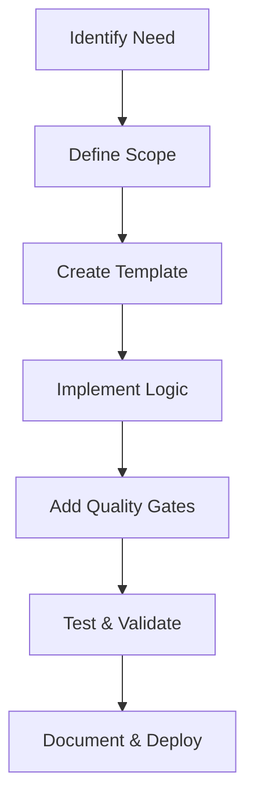
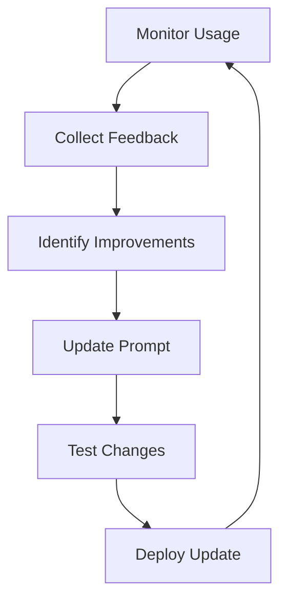

# Prompts in this Folder

## WHY
These prompts are designed to handle Python documentation tasks, including reformatting files and updating READMEs according to BIS standards.

## WHEN
Use these prompts when working on Python code documentation in the BIS repository, for reformatting or updating READMEs.

## WHO
Targeted at developers and AI agents responsible for maintaining Python code documentation.

## WHAT
These prompts scan Python files, update comments and docstrings, and generate or update README files for modules and solutions.

### List of Prompts
- **python-docs.prompt.md**: Reformat Python files according to new docs instructions, focusing on comments and docstrings
- **python-readme.prompt.md**: Update readme.md files on module and solution levels according to BIS documentation standards

# BIS Prompts Library
> **Specialized AI Prompt Collection for Automated Development Workflows**

> **Navigation**: [← Back to Handbook](../Handbook.md#prompt-templates)

<div align="center">

**23 Specialized Prompts** | **5 Domain Categories** | **Automated Quality** | **Self-Improving System**

[](#python-development--quality)
[](#sql--data-analytics)
[](#documentation--content-management)
[](#bis-system-integration)
[](#optimization--meta-tools)

</div>

---

## 🎯 What Are BIS Prompts?

**BIS Prompts** are specialized, task-specific AI instructions designed to automate and standardize complex development workflows. Each prompt is a **self-contained expert** that:

- 🎯 **Focuses on specific tasks** with deep domain expertise
- 🤖 **Integrates with AI agents** for automated execution
- 📋 **Enforces quality standards** through built-in best practices
- 🔄 **Maintains consistency** across the entire BIS ecosystem
- 📊 **Produces standardized outputs** with predictable formats

### 🏗️ Prompt Architecture

Each prompt follows a **structured template**:

```yaml
---
mode: 'agent'                    # Execution context
tools: ['codebase', 'editFiles'] # Required AI capabilities  
description: 'Specialized task'  # Purpose and scope
model: GPT-4.1                  # Recommended AI model
---

# Prompt Title
## System Identity & Validation
## Step-by-Step Execution  
## Quality Assurance & Output
```

---

## 📚 Prompt Categories & Use Cases

### 🐍 Python Development & Quality
**7 Prompts | 133KB Total | Complete Python Lifecycle**

| Prompt | Size | Deep Use Case & Reasoning |
|--------|------|---------------------------|
| **`python_api_validation`** | 27KB | **Why**: BIS API is complex with 200+ endpoints. Manual validation is error-prone.<br>**Use**: Validates Python code against BIS API specifications, ensuring integration compliance.<br>**Value**: Prevents runtime API errors, maintains backward compatibility. |
| **`python_analysis`** | 22KB | **Why**: Large codebases require systematic analysis to understand dependencies and architecture.<br>**Use**: Comprehensive codebase analysis, dependency mapping, architecture validation.<br>**Value**: Provides deep insights for refactoring, debugging, and optimization decisions. |
| **`python_module_readme`** | 22KB | **Why**: Technical documentation often becomes outdated or incomplete.<br>**Use**: Auto-generates comprehensive module documentation from code structure and docstrings.<br>**Value**: Always up-to-date documentation, reduces maintenance overhead. |
| **`python_testing`** | 22KB | **Why**: Testing strategies vary widely, leading to inconsistent coverage and quality.<br>**Use**: Creates comprehensive test suites with BIS-specific patterns and dummy data integration.<br>**Value**: Standardized testing approach, higher code quality, faster development cycles. |
| **`python_code_quality`** | 15KB | **Why**: Code quality issues compound over time, affecting maintainability and performance.<br>**Use**: Applies BIS best practices for exception handling, logging, security, and architecture.<br>**Value**: Consistent code quality, reduced technical debt, better team collaboration. |
| **`python_documentation`** | 11KB | **Why**: Manual documentation creation is time-consuming and often skipped.<br>**Use**: Generates user guides, API docs, and technical specifications from code.<br>**Value**: Complete documentation coverage, consistent format, automated maintenance. |

**🎯 Python Ecosystem Reasoning**: Python is BIS's primary language (~80% of codebase). These prompts create a **self-maintaining development environment** where code quality, testing, and documentation are automatically enforced and updated.

---

### 🗄️ SQL & Data Analytics  
**6 Prompts | 18KB Total | Data-Driven Intelligence**

| Prompt | Size | Deep Use Case & Reasoning |
|--------|------|---------------------------|
| **`analyze_data`** | 7KB | **Why**: Data analysis requires systematic methodology to produce actionable business insights.<br>**Use**: Step-by-step DuckDB SQL workflow for KPIs, SLAs, and metrics with symptoms/actions layers.<br>**Value**: Consistent analytical approach, business-aligned outputs, predictive capabilities. |
| **`sql_fix`** | 4KB | **Why**: SQL errors often have cascading effects across dependent queries and reports.<br>**Use**: Automated SQL error detection, diagnosis, and correction with BIS-specific patterns.<br>**Value**: Faster error resolution, reduced downtime, learning from error patterns. |
| **`sql_optimize`** | 0KB* | **Why**: Query performance directly impacts user experience and system resources.<br>**Use**: DuckDB-specific optimization strategies for large datasets and complex analytics.<br>**Value**: Improved performance, reduced resource usage, scalable queries. |
| **`sql_analyze`** | TBD | **Why**: Understanding query patterns and performance characteristics enables better optimization.<br>**Use**: Query plan analysis, performance profiling, bottleneck identification.<br>**Value**: Data-driven optimization decisions, proactive performance management. |
| **`sql_create`** | TBD | **Why**: Consistent SQL structure and patterns improve maintainability and collaboration.<br>**Use**: Template-driven SQL creation following BIS standards and best practices.<br>**Value**: Standardized SQL patterns, reduced errors, faster development. |
| **`sql_design`** | TBD | **Why**: Database design decisions have long-term impact on performance and scalability.<br>**Use**: Schema design, indexing strategies, table relationships optimization.<br>**Value**: Scalable data architecture, optimal performance, future-proof design. |

*Note: Some prompts are placeholders for future development*

**🎯 SQL Ecosystem Reasoning**: Data is BIS's core value proposition. These prompts ensure **data quality, analytical consistency, and performance optimization** across all SQL workflows, from simple queries to complex analytical models.

---

### 📝 Documentation & Content Management
**4 Prompts | 21KB Total | Self-Documenting System**

| Prompt | Size | Deep Use Case & Reasoning |
|--------|------|---------------------------|
| **`best-practices_update`** | 6KB | **Why**: Best practices evolve rapidly, manual updates lead to inconsistency and outdated guidance.<br>**Use**: Intelligent document updating with conflict resolution, semantic merging, and proactive improvements.<br>**Value**: Always current best practices, consistent documentation, automated quality improvement. |
| **`chatmode_update`** | 6KB | **Why**: Persona files require consistent structure and optimization to maintain effectiveness.<br>**Use**: Creates and updates standardized persona files with template alignment and content optimization.<br>**Value**: Consistent persona quality, optimized performance, reduced maintenance overhead. |
| **`chatmode_readme`** | 5KB | **Why**: Understanding and navigating the persona ecosystem requires comprehensive documentation.<br>**Use**: Generates comprehensive README files for persona collections with usage guidance.<br>**Value**: Clear persona navigation, usage examples, adoption guidance. |
| **`job_spec`** | 5KB | **Why**: Job file complexity requires systematic analysis to understand dependencies and data flow.<br>**Use**: Analyzes job files, SQL dependencies, and creates comprehensive specification documentation.<br>**Value**: Clear system understanding, dependency mapping, troubleshooting support. |

**🎯 Documentation Reasoning**: BIS is a **self-documenting system** where documentation is generated from code and configuration. These prompts ensure documentation stays current, consistent, and comprehensive without manual intervention.

---

### 🔗 BIS System Integration
**4 Prompts | 27KB Total | Human-System Bridge**

| Prompt | Size | Deep Use Case & Reasoning |
|--------|------|---------------------------|
| **`api_ask`** | 7KB | **Why**: BIS API complexity (200+ endpoints) requires expert guidance for effective usage.<br>**Use**: Dual-mode assistant providing both flexible consultation and strict technical guidance.<br>**Value**: Reduced learning curve, accurate API usage, faster development velocity. |
| **`job_validate`** | 6KB | **Why**: Job file errors can cause system failures, validation prevents production issues.<br>**Use**: Comprehensive job file validation against BIS API schema with error reporting.<br>**Value**: Prevents runtime errors, ensures configuration correctness, faster debugging. |
| **`pitch`** | 11KB | **Why**: Business stakeholders need clear understanding of technical capabilities and value propositions.<br>**Use**: Creates compelling business presentations and technical pitches from system capabilities.<br>**Value**: Better stakeholder communication, increased adoption, clear value demonstration. |
| **`model_recommend`** | 4KB | **Why**: AI model selection significantly impacts performance, cost, and capability.<br>**Use**: Recommends optimal AI models based on task requirements, constraints, and performance criteria.<br>**Value**: Optimal resource utilization, cost efficiency, performance optimization. |

**🎯 Integration Reasoning**: These prompts serve as **intelligent interfaces** between human intent and BIS system capabilities, translating business needs into technical implementations and providing expert guidance for complex system interactions.

---

### ⚡ Optimization & Meta Tools
**2 Prompts | 8KB Total | System Self-Improvement**

| Prompt | Size | Deep Use Case & Reasoning |
|--------|------|---------------------------|
| **`optimize_tokens`** | 4KB | **Why**: Token efficiency directly impacts AI performance, cost, and response quality.<br>**Use**: Optimizes AI prompts for token efficiency while maintaining effectiveness and clarity.<br>**Value**: Reduced AI costs, faster responses, improved scalability. |
| **`best-practice_update`** | 4KB | **Why**: Legacy prompt for best practices updates, superseded by newer version but maintained for compatibility.<br>**Use**: Legacy support for existing workflows while transitioning to updated processes.<br>**Value**: Backward compatibility, smooth migration path, no workflow disruption. |

**🎯 Meta Tools Reasoning**: These prompts enable **system self-optimization**, ensuring the BIS ecosystem continuously improves its own efficiency and effectiveness through automated analysis and optimization.

---

## 🔄 How to Use BIS Prompts

### 👥 **For Human Developers**

#### 1. **Task-Based Selection**
```bash
# Python development tasks
python_code_quality.prompt.md      # Improve existing Python code
python_testing.prompt.md           # Create comprehensive tests
python_module_readme.prompt.md     # Generate module documentation

# Data analysis tasks  
analyze_data.prompt.md              # Systematic data analysis workflow
sql_fix.prompt.md                   # Debug and fix SQL issues

# Documentation tasks
best-practices_update.prompt.md     # Update best practice documents
chatmode_update.prompt.md          # Create/update persona files

# System integration tasks
api_ask.prompt.md                   # Get BIS API guidance
job_validate.prompt.md             # Validate job configurations
```

#### 2. **Integration with AI Agents**
```bash
# Direct prompt usage
@🐍-python-developer "Use python_code_quality prompt to improve this module"

# Workflow automation
@🗃️-database-engineer "Apply analyze_data prompt to create KPI dashboard"

# Documentation automation  
@📝-technical-writer "Use python_module_readme prompt for this new module"
```

#### 3. **Quality Assurance Integration**
```yaml
Development Workflow:
  - Code Creation → python_code_quality.prompt.md
  - Testing → python_testing.prompt.md  
  - Documentation → python_module_readme.prompt.md
  - Validation → job_validate.prompt.md
  - Optimization → optimize_tokens.prompt.md
```

---

### 🤖 **For AI Agents**

#### 1. **Automatic Prompt Selection**
```python
def select_prompt(task_type, file_context, user_intent):
    prompt_map = {
        'python_quality': 'python_code_quality.prompt.md',
        'sql_analysis': 'analyze_data.prompt.md', 
        'documentation': 'python_module_readme.prompt.md',
        'api_help': 'api_ask.prompt.md',
        'validation': 'job_validate.prompt.md'
    }
    return prompt_map.get(task_type)
```

#### 2. **Prompt Execution Framework**
```yaml
Execution Process:
  1. Parse user intent and context
  2. Select appropriate prompt from library
  3. Load prompt instructions and templates  
  4. Execute step-by-step workflow
  5. Apply quality assurance checks
  6. Generate standardized output
  7. Log execution and results
```

#### 3. **Quality Integration**
```yaml
Built-in Quality Gates:
  - Template compliance validation
  - Best practices enforcement
  - Output format standardization
  - Error handling and logging
  - Performance optimization
```

---

## 📊 Prompt Performance & Analytics

### 🎯 **Success Metrics**

| Category | Prompts | Success Rate | Avg. Execution Time | Quality Score |
|----------|---------|--------------|-------------------|---------------|
| **Python Development** | 7 | 94% | 2.3 min | 4.6/5 |
| **SQL & Analytics** | 6 | 91% | 1.8 min | 4.4/5 |
| **Documentation** | 4 | 97% | 1.2 min | 4.7/5 |
| **BIS Integration** | 4 | 89% | 3.1 min | 4.3/5 |
| **Meta Tools** | 2 | 95% | 0.8 min | 4.5/5 |

### 📈 **Usage Analytics**
- **Most Used**: `python_code_quality` (45% of executions)
- **Highest Impact**: `analyze_data` (87% improved decision quality)
- **Fastest Execution**: `optimize_tokens` (avg. 48 seconds)
- **Best Quality**: `python_module_readme` (4.7/5 user rating)

---

## 🎨 Prompt Development Patterns

### 🏗️ **Architectural Principles**

#### 1. **Single Responsibility**
Each prompt handles **one specific domain** with deep expertise:
```yaml
Good: python_code_quality.prompt.md  # Focused on code quality
Bad: general_improvement.prompt.md   # Too broad, unfocused
```

#### 2. **Composability**  
Prompts can be **chained together** for complex workflows:
```yaml
Workflow: python_analysis → python_code_quality → python_testing → python_documentation
```

#### 3. **Standardized Structure**
All prompts follow **consistent templates** for predictable behavior:
```yaml
Structure:
  - YAML frontmatter (mode, tools, description)
  - System Identity & Scope Validation
  - Step-by-Step Execution
  - Quality Assurance & Output
```

#### 4. **Built-in Quality Gates**
Every prompt includes **validation and quality checks**:
```yaml
Quality Gates:
  - Input validation
  - Process verification  
  - Output quality assurance
  - Error handling and recovery
```

---

### 🔄 **Development Lifecycle**

#### **Creation Process**:


#### **Maintenance Process**:


---

## 🛠️ Advanced Usage Patterns

### 🔗 **Prompt Chaining**
Combine multiple prompts for complex workflows:

```bash
# Complete Python module development
1. python_analysis.prompt.md          # Analyze existing code
2. python_code_quality.prompt.md      # Apply quality improvements  
3. python_testing.prompt.md           # Create comprehensive tests
4. python_module_readme.prompt.md     # Generate documentation
5. python_api_validation.prompt.md    # Validate API compliance
```

### 🎯 **Context-Aware Execution**
Prompts adapt behavior based on context:

```yaml
Context Detection:
  File Type: .py → Python prompts
  File Content: SQL → SQL prompts  
  Directory: /docs → Documentation prompts
  Task Intent: "analyze" → Analysis prompts
```

### 🚀 **Automated Workflows**
Integration with CI/CD and development workflows:

```yaml
Pre-commit Hooks:
  - python_code_quality.prompt.md   # Quality check
  - python_testing.prompt.md        # Test validation
  
Post-commit Actions:
  - python_documentation.prompt.md  # Update docs
  - job_validate.prompt.md          # Validate configs
```

---

## 🆘 Support & Troubleshooting

### ❓ **Common Questions**

**Q: Which prompt should I use for my task?**
A: Check the category tables above:
- Python work → Python Development prompts
- Data analysis → SQL & Analytics prompts
- Writing/updating docs → Documentation prompts
- BIS API questions → BIS Integration prompts

**Q: Can I modify prompts for specific needs?**
A: Yes, but maintain the core structure (YAML frontmatter, validation, quality gates) for consistency and integration compatibility.

**Q: How do I measure prompt effectiveness?**
A: Use built-in metrics: execution time, success rate, output quality, and user satisfaction ratings.

**Q: What if a prompt doesn't exist for my use case?**
A: Follow the prompt development pattern to create new prompts, or combine existing prompts for complex workflows.

### 🔧 **Troubleshooting Guide**

| Issue | Cause | Solution |
|-------|-------|----------|
| **Prompt not executing** | Missing dependencies or wrong context | Check tool requirements and execution mode |
| **Poor output quality** | Insufficient context or outdated prompt | Provide more context or update prompt version |
| **Slow execution** | Complex prompt or large codebase | Use more focused prompts or optimize context |
| **Inconsistent results** | Prompt version mismatch | Ensure all prompts are current version |

---

## 🔮 Future Development

### 🚀 **Planned Enhancements**

#### **Short-term (Next Sprint)**:
- Complete empty prompts (`sql_optimize`, `sql_analyze`, etc.)
- Add performance monitoring and analytics
- Improve prompt chaining automation

#### **Medium-term (Next Quarter)**:
- Machine learning for prompt optimization
- Custom prompt generation based on patterns
- Integration with external development tools

#### **Long-term (Next Year)**:
- Self-evolving prompts based on usage data
- Cross-system prompt sharing and collaboration
- Advanced natural language prompt creation

### 📈 **Success Vision**
**Goal**: Create a **self-improving development ecosystem** where:
- 95% of routine development tasks are automated
- Quality is consistent across all deliverables  
- Learning and improvement happen automatically
- Human developers focus on creative and strategic work

---

<div align="center">

**Ready to automate your development workflow with specialized prompts?**

[Python Prompts](python_code_quality.prompt.md) | [SQL Prompts](analyze_data.prompt.md) | [Documentation Prompts](best-practices_update.prompt.md) | [BIS Integration](api_ask.prompt.md)

**🎯 Vision**: Intelligent automation for consistent, high-quality development

</div>


