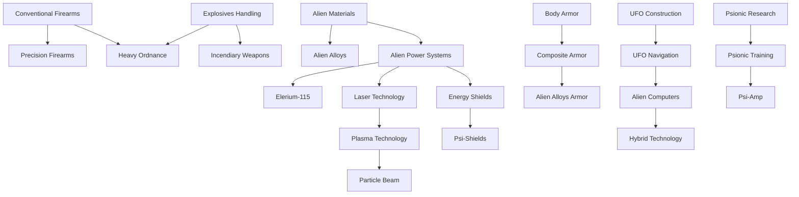

# Economy System

> **Status**: Design Document  
> **Last Updated**: 2025-10-28  
> **Related Systems**: Basescape.md, Items.md, DiplomaticRelations_Technical.md, Finance.md

## Table of Contents

- [Research Projects](#research-projects)
- [Research Technology Tree](#research-technology-tree)
- [Manufacturing Projects](#manufacturing-projects)
- [Marketplace](#marketplace)
- [Black Market](#black-market)
- [Supplier System](#supplier-system)
- [Transfer System](#transfer-system)

---

## Research Projects

### Overview
Research projects allow players to unlock new technologies and capabilities by conducting scientific research. Each project requires a specific combination of resources, facilities, personnel, and prerequisite research.

**Requirements**
- Research items (components, salvaged technology, alien artifacts)
- Dedicated research facility with available scientist capacity
- Research services from facilities
- Completion of prerequisite research projects
- Scientist man-days: Scientific work only progresses when scientists actively work
- Credits to fund research

**Mechanics**
- Progress calculation: If a project costs 30 man-days and 5 man-days per day are assigned, the project completes in 6 days
- Scientists are paid only for days they actively work
- Player views daily progress as a percentage
- Repeatable projects: Item-based research (e.g., analyzing alien prisoners) can be performed multiple times
- Research priority: Higher priority research completes faster
- Pause/Resume: Can temporarily halt research without losing progress

**Research Types**
- **Technology**: Unlocks new capabilities and manufacturing options
- **Item Analysis**: Reverse-engineer captured equipment (+20% better equipment understanding)
- **Alien Interrogation**: Extract intelligence from prisoners (gains faction knowledge)
- **Autopsy**: Study alien biology to unlock specialized abilities (enables new unit types)
- **Facility Upgrade**: Improve base facility capabilities (+10-30% facility efficiency)
- **Hybrid Research**: Combine multiple research streams for advanced discoveries

**Cost Scaling Mechanics**
- Base cost varies by project complexity (50-500 man-days typical)
- Research cost multiplier: 50%-150% (randomly determined at campaign start for replayability)
- **Multiplier calculation**: Each project has unique cost range (example: Basic Rifle: 50-150 man-days)
- Prerequisite research: Cannot start until dependencies complete
- Resource consumption: Each project may require specific components
- Facility bonuses: Advanced facilities reduce research time by 10-30%
- Scientist specialization: Scientists gain +10% efficiency per completed related research

**Balance Considerations**
- Control research pace through scientist allocation
- Multiple research tracks can run simultaneously but compete for scientist resources
- Early game bottleneck: Limited scientists force prioritization (2-5 typical)
- Mid game balance: 5-10 scientists allow broader research
- Late game flexibility: 15+ scientists allow rapid advancement
- Research speed scaling: Additional scientists provide diminishing returns (5th scientist = 80% efficiency, 10th = 60%)

**Research Progression**
- Early research unlocks basic manufacturing
- Mid-tier research enables specialized equipment and advanced facilities
- Late-tier research enables late-game weaponry and tactical advantages
- Alien research branches off with unique dependencies (requires captured aliens first)

**Failed Research**

- Research cannot fail but can be cancelled
- Cancelled research returns 50-75% of invested credits
- Partial progress retained (not lost on cancellation)

---

## Research Technology Tree

### Overview
Research projects form interconnected branches that build a comprehensive technology tree. Players progress through multiple research paths simultaneously.

**Mechanics**
- All research is global: Discoveries apply across all bases immediately
- Research cost scaling: Base cost multiplied by 50%-150% (randomly determined at campaign start) to add variety and replayability
- Strong dependencies create logical progression paths
- Completing research unlocks new items, manufacturing capabilities, and mission options

**Strategic Depth**
- Players must balance broad research against focused advancement
- Regional technology variations can impact mission strategies
- Faction research trees remain independent and separate

---

### Research Tree Structure

The research tree is organized into **5 major branches** with multiple tiers of advancement:

#### 1. Weapons Technology Branch

**Tier 1: Basic Weapons** (Starting Technologies)
- **Conventional Firearms** (0 man-days) - Pre-researched, enables rifle/pistol manufacturing
- **Explosives Handling** (50 man-days) - Enables grenade and explosive manufacturing
- **Melee Combat Training** (30 man-days) - Enables advanced melee weapons

**Tier 2: Advanced Weapons** (Requires Tier 1)
- **Precision Firearms** (100 man-days) - Unlocks sniper rifles, scoped weapons
  - *Prerequisites*: Conventional Firearms
  - *Unlocks*: Sniper Rifle, Marksman Rifle, Scope attachments
- **Heavy Ordnance** (150 man-days) - Unlocks heavy weapons, rocket launchers
  - *Prerequisites*: Explosives Handling
  - *Unlocks*: Rocket Launcher, Heavy Machine Gun, Grenade Launcher
- **Incendiary Weapons** (120 man-days) - Unlocks fire-based weapons
  - *Prerequisites*: Explosives Handling
  - *Unlocks*: Flamethrower, Incendiary Grenades, Molotov Cocktails

**Tier 3: Energy Weapons** (Requires Tier 2 + Alien Technology)
- **Laser Technology** (200 man-days) - Basic energy weapons
  - *Prerequisites*: Precision Firearms + Alien Power Systems
  - *Unlocks*: Laser Rifle, Laser Pistol
- **Plasma Technology** (300 man-days) - Advanced energy weapons
  - *Prerequisites*: Laser Technology + Alien Plasma Samples
  - *Unlocks*: Plasma Rifle, Plasma Cannon
- **Particle Beam Weapons** (400 man-days) - Ultimate energy weapons
  - *Prerequisites*: Plasma Technology + Advanced Alien Materials
  - *Unlocks*: Particle Beam Cannon, Heavy Plasma

**Tier 4: Exotic Weapons** (Late Game)
- **Psionic Amplification** (500 man-days) - Psionic weapons
  - *Prerequisites*: Psionic Research + Plasma Technology
  - *Unlocks*: Psi-Amp, Mind Control devices
- **Gravitational Weapons** (600 man-days) - Gravity manipulation
  - *Prerequisites*: Advanced Alien Physics + Particle Beam Weapons
  - *Unlocks*: Gravity Gun, Singularity Grenade

---

#### 2. Armor & Defense Branch

**Tier 1: Basic Armor**
- **Body Armor** (0 man-days) - Pre-researched, basic armor manufacturing
- **Tactical Vests** (40 man-days) - Light armor options
  - *Unlocks*: Scout Armor, Light Tactical Vest

**Tier 2: Advanced Armor**
- **Composite Armor** (120 man-days) - Improved protection
  - *Prerequisites*: Body Armor
  - *Unlocks*: Combat Armor, Heavy Armor
- **Powered Exoskeletons** (180 man-days) - Strength enhancement
  - *Prerequisites*: Body Armor + Basic Robotics
  - *Unlocks*: Exo-Suit, Power Armor frame

**Tier 3: Alien-Based Armor**
- **Alien Alloys** (250 man-days) - Lightweight strong materials
  - *Prerequisites*: Composite Armor + Alien Materials Analysis
  - *Unlocks*: Alloy Armor, Alloy Plating
- **Energy Shields** (350 man-days) - Shield technology
  - *Prerequisites*: Alien Power Systems + Alien Alloys
  - *Unlocks*: Personal Shield Generator, Shield Armor

**Tier 4: Ultimate Protection**
- **Psi-Shields** (500 man-days) - Psionic defense
  - *Prerequisites*: Energy Shields + Psionic Research
  - *Unlocks*: Psi-Armor, Mind Shield
- **Titan Armor** (600 man-days) - Maximum protection
  - *Prerequisites*: Alien Alloys + Powered Exoskeletons
  - *Unlocks*: Titan Suit, Juggernaut Armor

---

#### 3. Alien Technology Branch

**Tier 1: Initial Analysis**
- **Alien Materials Analysis** (100 man-days) - Study alien materials
  - *Prerequisites*: Captured Alien Equipment
  - *Unlocks*: Basic alien manufacturing, research progression
- **Alien Autopsy** (80 man-days per species) - Study alien biology
  - *Prerequisites*: Alien Corpse
  - *Unlocks*: Species vulnerabilities, biological research
- **UFO Construction** (150 man-days) - Analyze UFO wreckage
  - *Prerequisites*: Crashed UFO recovered
  - *Unlocks*: Understanding of alien engineering

**Tier 2: Power & Propulsion**
- **Alien Power Systems** (200 man-days) - Alien energy generation
  - *Prerequisites*: UFO Construction
  - *Unlocks*: Elerium research, power plant upgrades
- **UFO Navigation** (250 man-days) - Alien navigation systems
  - *Prerequisites*: UFO Construction
  - *Unlocks*: Advanced craft navigation, improved radar

**Tier 3: Advanced Alien Tech**
- **Elerium-115** (300 man-days) - Master alien fuel source
  - *Prerequisites*: Alien Power Systems + Alien Materials Analysis
  - *Unlocks*: Advanced craft engines, energy weapons
- **Alien Computers** (280 man-days) - Alien computing systems
  - *Prerequisites*: UFO Navigation
  - *Unlocks*: Advanced targeting, improved facility efficiency

**Tier 4: Alien Integration**
- **Hybrid Technology** (400 man-days) - Combine human + alien tech
  - *Prerequisites*: Elerium-115 + Alien Computers
  - *Unlocks*: Ultimate equipment, hybrid weapons/armor

---

#### 4. Facilities & Infrastructure Branch

**Tier 1: Basic Facilities**
- **Advanced Engineering** (60 man-days) - Improved construction
  - *Unlocks*: Workshop upgrades, faster construction
- **Logistics Management** (50 man-days) - Better resource management
  - *Unlocks*: Larger storage, transfer improvements

**Tier 2: Specialized Facilities**
- **Psionic Laboratory** (150 man-days) - Psionic research facilities
  - *Prerequisites*: Advanced Engineering + Alien Autopsy (Sectoid)
  - *Unlocks*: Psi-Lab facility, psionic training
- **Advanced Workshop** (120 man-days) - Enhanced manufacturing
  - *Prerequisites*: Advanced Engineering
  - *Unlocks*: Workshop upgrades, faster production
- **Genetic Laboratory** (180 man-days) - Biological research
  - *Prerequisites*: Advanced Engineering + Alien Autopsy (any)
  - *Unlocks*: Gene-Lab facility, unit enhancements

**Tier 3: Strategic Facilities**
- **Hyperwave Decoder** (300 man-days) - Advanced alien detection
  - *Prerequisites*: UFO Navigation + Alien Computers
  - *Unlocks*: Hyperwave facility, UFO mission detection
- **Grav-Shield** (350 man-days) - Base defense shield
  - *Prerequisites*: Alien Power Systems + Energy Shields
  - *Unlocks*: Grav-Shield facility, base protection

---

#### 5. Support & Utility Branch

**Tier 1: Basic Support**
- **Medical Training** (40 man-days) - Improved medical care
  - *Unlocks*: Hospital upgrades, faster healing
- **Tactical Training** (50 man-days) - Combat improvements
  - *Unlocks*: Academy facility, faster XP gain

**Tier 2: Advanced Support**
- **Cybernetics** (150 man-days) - Mechanical augmentation
  - *Prerequisites*: Medical Training + Basic Robotics
  - *Unlocks*: Cyborg transformations, mechanical units
- **Genetic Engineering** (180 man-days) - Biological augmentation
  - *Prerequisites*: Medical Training + Genetic Laboratory
  - *Unlocks*: Gene Mods, biological transformations

**Tier 3: Elite Enhancement**
- **Psionic Training** (250 man-days) - Unlock psionic abilities
  - *Prerequisites*: Psionic Laboratory + Alien Autopsy (Sectoid)
  - *Unlocks*: Psionic stat for units, psi abilities
- **Neural Interface** (300 man-days) - Direct brain-computer link
  - *Prerequisites*: Cybernetics + Alien Computers
  - *Unlocks*: Advanced pilot bonuses, improved reactions

---

### Research Dependencies Graph



---

### Research Progression Timeline

**Early Game (Months 1-3)**:
- Focus: Basic weapons and armor improvements
- Key Research: Precision Firearms, Composite Armor, Medical Training
- Goal: Establish solid foundation for tactical operations

**Mid Game (Months 4-8)**:
- Focus: Alien technology analysis, energy weapons
- Key Research: Alien Materials, Laser Technology, Advanced Facilities
- Goal: Begin integrating alien technology

**Late Game (Months 9-15)**:
- Focus: Advanced alien integration, ultimate weapons
- Key Research: Plasma Technology, Elerium-115, Hybrid Technology
- Goal: Achieve technological superiority

**End Game (Months 16+)**:
- Focus: Exotic technologies, psionic mastery
- Key Research: Psionic Training, Gravitational Weapons, Titan Armor
- Goal: Prepare for final confrontations

---

### Research Strategy Recommendations

**Balanced Approach**:
- 30% Weapons Research
- 30% Armor Research
- 20% Alien Technology
- 10% Facilities
- 10% Support

**Aggressive Approach**:
- 50% Weapons Research
- 20% Alien Technology
- 20% Armor Research
- 10% Support

**Defensive Approach**:
- 40% Armor Research
- 25% Facilities
- 20% Support
- 15% Weapons Research

**Scientific Approach**:
- 50% Alien Technology
- 20% Facilities
- 15% Weapons Research
- 15% Armor Research

---

### Special Research Projects

**Interrogation Projects** (Repeatable):
- **Alien Soldier Interrogation** (50 man-days) - Extract tactical information
- **Alien Engineer Interrogation** (80 man-days) - Learn about alien technology
- **Alien Commander Interrogation** (120 man-days) - Discover alien objectives

**Facility Research** (One-time unlocks):
- **Mind Shield** (200 man-days) - Base psionic defense facility
- **Alien Containment** (150 man-days) - Prison for live aliens
- **Fusion Ball Launcher** (350 man-days) - Ultimate base defense weapon

**Strategic Research** (Game-changing):
- **Hyperwave Decoder** (300 man-days) - See all UFO missions
- **Avenger Construction** (500 man-days) - Ultimate player craft
- **Cydonia or Bust** (No cost) - Final mission unlock

---

### Research Cost Summary

| Research Tier | Average Cost (man-days) | Time Required (10 scientists) |
|---------------|------------------------|------------------------------|
| **Tier 1** | 30-80 | 3-8 days |
| **Tier 2** | 100-200 | 10-20 days |
| **Tier 3** | 250-400 | 25-40 days |
| **Tier 4** | 500-600 | 50-60 days |

**Note**: Actual costs vary by 50-150% based on campaign randomization

---

## Manufacturing Projects

**Overview**
Once a technology is researched, players can begin manufacturing relevant items, weapons, armor, and craft equipment. Manufacturing is a resource-intensive operation requiring careful planning and facility investment.

**Requirements**
- Researched manufacturing capability
- Raw resources (materials, alien components)
- Manufacturing facility with available engineer capacity
- Credits to fund production (upfront cost or ongoing)
- Facility engineering man-days
- Warehouse capacity to store produced items

**Mechanics**
- Production can be paused and resumed without penalty
- Engineers are paid only for days they actively work
- Batch bonuses: Producing multiple units of the same item yields production efficiency bonuses (5-10% per unit in batch)
  - 1 unit: 100% time
  - 5 units: 95% per unit (batch bonus 5%)
  - 10 units: 90% per unit (batch bonus 10%)
- Manufacturing is base-specific; each base manages its own production queues
- Daily progress displays as a percentage
- Production halts if required resources become unavailable (not cancellation)

**Manufacturing Cost Calculation**
```
Total Cost = (Base Item Cost) × Quantity
Daily Cost = Total Cost / (Days to Complete)
Resource Consumption = Item Resource Requirements × Quantity
Engineer Hours = Item Complexity × Quantity
```

**Production Speed Factors**
- **Engineer Allocation**: More engineers = faster completion (but with diminishing returns)
  - 1 engineer: 100% speed
  - 5 engineers: 80% speed per engineer average
  - 10 engineers: 60% speed per engineer average
- **Facility Level**: Higher-tier facilities improve production speed by 10-30%
  - Workshop: +10%
  - Advanced Workshop: +20%
  - Manufacturing Hub: +30%
- **Technology Specialization**: Bonuses apply to specific item categories
- **Equipment Efficiency**: Better tools reduce production time by 5-15%
- **Facility Specialization**: Dedicated manufacturing facilities produce faster (category-specific +20%)

**Queue System**
- Players can queue multiple manufacturing projects (3-10 typical)
- When one project completes, the next automatically begins
- If raw materials become scarce, production enters pause state (not cancellation)
- Queue can be reordered or modified
- Switching projects in queue causes startup delay (1-2 days waste)
- Queue visualization shows all pending projects and completion times
- Priority queue: Can mark projects as high priority (skips queue)

**Manufacturing Economics**
- Production typically 30-50% cheaper than marketplace purchases
- High volume manufacturing reduces per-unit cost significantly
- Scrap materials from damaged items recovered (50-75% value)
- Bulk production enables export for additional income (+20-40% markup on bulk sales)
- Overproduction penalties: Excessive stockpiles reduce facility efficiency

**Strategic Advantages**
- Manufacturing facilities provide independence from marketplace fluctuations
- Specialized production enables customized equipment
- Bulk manufacturing of ammunition for prolonged operations
- Export surplus equipment for additional revenue
- Vertical integration: Control supply chain completely

---

## Marketplace

**Overview**
The marketplace provides access to items, weapons, armor, ammunition, and supplies through multiple competing suppliers. Marketplace availability is dynamic based on diplomatic relations, fame, black market access, and tech progress.

**Suppliers**
Six suppliers operate within the marketplace:

| Supplier | Specialty | Base Price Mod | Relation Impact | Exclusive Access |
|----------|-----------|----------------|-----------------|-----------------|
| Military Supply Corp. | Military equipment, ammo | 100% | Nations only | Tech prerequisites |
| Syndicate Trade Co. | Gray market goods, upgrades | 120-150% | Independent operators | Neutrality stance |
| Exotic Arms Dealer | Alien-tech weapons, special items | 200-300% | Faction relations | Tech prerequisites + High Fame |
| Research Materials Ltd. | Raw materials, components | 80-110% | Universal access | Stability varies |
| Tactical Supply Network | Armor, tactical gear | 90-110% | Combat-focused nations | Tech unlock gated |
| Black Market Operations | Restricted items, experimental gear | Variable | Criminal-aligned factions | Low Karma (<-40) |

**Pricing Mechanics**
```
Item Price = (Base Price) × Supplier Modifier × Relationship Modifier × Bulk Discount
Supplier Modifier: 0.8x to 3.0x depending on supplier and item category
Relationship Modifier: -50% (embargo) to +100% (favorable)
Bulk Discount: 5% per 5+ items, 15% per 20+ items, 25% per 50+ items
```

**Availability Mechanics**
- **Research Prerequisites**: Cannot purchase alien-tech items until researched
- **Tech Level Gates**: Higher-tier items require minimum tech level (1-4 scale)
- **Regional Restrictions**: Some items available only in specific regions (military equipment in war zones, etc.)
- **Supplier Relations**: Negative relations (-50 or below) restrict access to non-military suppliers
- **Fame Impact**: Low fame (0-24) prevents access to premium suppliers; high fame (90+) unlocks exclusive items
- **Alignment Restrictions**: 
  - Saint alignment: Blocks black market access, restricted weapons
  - Evil alignment: Blocks humanitarian supplier access
- **Diplomatic Status**: War-aligned nations block purchase from enemy-associated suppliers
- **Embargo Mechanics**: At -100 relationship, supplier completely cuts off access
- **Monthly Availability Limits**: 50-500 units per month depending on item type and supplier stability
- **Supply Fluctuations**: Unstable regions experience 10-40% availability reduction

**Purchase Mechanics**
- **Order Placement**: Specify quantity, supplier, delivery location
- **Payment Options**: 
  - Upfront payment (standard)
  - Credit-based payment (relations >50 required, 5% interest)
  - Subscription orders (recurring monthly purchases)
- **Delivery Time**: Varies by supplier (1-14 days typical)
  - Military suppliers: 3-5 days
  - Black market: 5-10 days (unpredictable)
  - Research materials: 2-4 days
- **Delivery Location**: Items delivered to specified base or regional transfer hub
- **Failed Delivery**: 10% chance of delivery loss; player receives partial refund (20-50%)
- **Delivery Delays**: Random delays (0-3 additional days) common during operations
- **Interception Risk**: 5-15% chance of enemy interception en route (depends on regional security)

**Special Features**
- **Bulk Orders**: Purchasing 50+ units of same item triggers 25% discount + priority delivery (1 day faster)
- **Recurring Orders**: Can set automatic re-supply of ammunition/supplies monthly (5% price premium but guaranteed availability)
- **Limited Stock**: Rare items have limited availability (1-3 units per month)
- **Seasonal Variation**: Prices fluctuate by 10-20% based on regional stability and warfare
- **Standing Orders**: Suppliers offer periodic exclusive deals to high-reputation customers (20-30% discount on next order)
- **Supplier Auctions**: Time-limited special items at discounted prices (30-50% off)

**Marketplace Analysis Tools**
- **Price Comparison**: View prices across suppliers before purchasing
- **Historical Tracking**: Track price trends over time (optional)
- **Supplier Ranking**: View supplier reliability, delivery time, and quality ratings
- **Market Intelligence**: Affects strategic purchasing decisions
- **Availability Predictions**: Forecast supply changes based on regional stability

**Strategic Considerations**
- Marketplace enables rapid equipment acquisition for deployed forces
- Supplier relationships provide political leverage and access to restricted items
- Manufacturing + Marketplace = complete supply chain control
- Bulk purchases for ammunition sustain long operations
- Black market provides access to experimental/restricted technologies
- High-risk interception routes offer lower prices but increased loss probability
- Scarcity Multiplier: Rare items have higher prices
- Competition Factor: Multiple suppliers in region reduce prices

**Purchase Mechanics**
- Purchased goods arrive via transfer system with delay (1-14 days)
- Standard resale value: 50% of purchase price
- Purchase orders integrate with transfer system
- International shipments may include transit time and cost
- Can place orders but funds deducted immediately
- Cancellation of orders results in partial refund (typically 75-90%)

**Supplier Relationships Impact**
- Positive: Discounts, priority delivery, exclusive access to special items
- Neutral: Standard pricing, normal delivery times
- Negative: Price increases, delayed delivery, access restrictions
- Hostile: Complete embargo; cannot purchase

**Inventory Management**
- Marketplace stock refreshes monthly
- Stock depletion from high demand
- Restocks prioritize friendly suppliers
- Special orders take longer but guaranteed delivery
- Expedited delivery available at premium cost

**Purchasing Strategy**
- Bulk purchases take time to receive but offer discounts
- Emergency purchases available at higher cost
- Subscribe to items for auto-delivery
- Negotiate better deals through diplomacy

---

## Black Market

**Overview**
The black market provides extensive underground economy access including restricted items, special units, craft purchases, mission generation, event purchasing, and corpse trading. All transactions carry karma/fame consequences and discovery risks.

**For Complete Black Market Mechanics**: See [BlackMarket.md](./BlackMarket.md)

**Quick Summary**:
- **Items**: Experimental weapons, banned tech, alien equipment (200-500% markup)
- **Units**: Mercenaries, defectors, augmented soldiers (-10 to -30 karma per unit)
- **Craft**: Stolen military craft, prototypes, captured UFOs (-15 to -30 karma)
- **Missions**: Purchase custom missions (assassination, sabotage, heist) to spawn on map
- **Events**: Trigger political/economic events (improve relations, sabotage economy, incite rebellion)
- **Corpses**: Trade dead unit bodies for credits (-10 to -30 karma per corpse)

**Access Requirements**:
- Karma below +40 (cannot be "too good")
- Fame above 25 (must be known to find contacts)
- Entry fee: 10,000 credits (one-time)

**Discovery Risk**: 5-15% per transaction, increases with fame and transaction count. Discovery results in -20 to -50 fame, -30 to -70 relations with discovering country.

---

## Supplier System

**Overview**
Each good available for purchase has an associated supplier. Supplier relationships directly impact pricing and availability, creating an economic web of dependencies and strategic considerations.

**Supplier Mechanics**
- Each item/equipment type has primary and secondary suppliers
- Relationship range: -100 (embargo/blocked) to +100 (favorable/preferred partner)
- Suppliers can be cultivated through diplomacy, consistent purchasing, and political alignment
- Multiple suppliers exist for most item categories, enabling relationship diversification
- Relationship changes: ±1 point per month based on purchase activity and diplomatic stance
- Monthly relationship decay: -1 point per month with no purchases (friendship atrophy)

**Supplier Types and Specialization**

| Supplier Type | Categories | Base Relations | Pricing Range | Exclusivity |
|---------------|------------|-----------------|---------------|------------|
| Military Suppliers | Weapons, ammo, combat armor | Stable: 0 to +40 | 80-120% | Nations only |
| Advanced Tech Suppliers | Electronics, radar, systems | Variable: -20 to +60 | 100-180% | Tech-dependent |
| Regional Suppliers | Local goods, regional items | Volatile: -50 to +80 | 90-150% | Region-specific |
| Scientific Suppliers | Materials, components, samples | Neutral: -10 to +50 | 85-120% | Stability varies |
| Aerospace Suppliers | Craft parts, fuel, engines | Stable: 0 to +40 | 100-160% | Tech prerequisites |
| Black Market Suppliers | Restricted, experimental items | Criminal: -100 to +40 | Variable: 150-500% | Karma gated |

**Relationship Mechanics**
```
Relation Change = (Purchase Amount / 1000) - Diplomatic Stance Conflict
Monthly Maintenance = -1 point per month (no purchases)
Pricing Modifier = 1.0 + (0.005 × (100 - Relation))
```
- At relation -100: 1.5x price modifier + complete access cut-off
- At relation -50: 1.25x price modifier + limited stock
- At relation 0: 1.0x price modifier (baseline)
- At relation +50: 0.75x price modifier + priority delivery
- At relation +100: 0.5x price modifier + exclusive items unlocked

**Availability Tiers by Relationship**

| Relation | Pricing | Availability | Delivery | Exclusives |
|----------|---------|--------------|----------|-----------|
| -100 | +500% | Blocked | N/A | None |
| -50 to -1 | +25% | 25% of normal | +5 days | None |
| 0 to +25 | Baseline | 100% | Normal | None |
| +26 to +50 | -15% | 100% | -2 days | Unlocks some |
| +51 to +75 | -25% | 120% | -3 days | Unlock more |
| +76 to +100 | -50% | 150% | -5 days | All exclusive items |

**Strategic Purchase Impact**
- Purchasing consistently from supplier: +0.5 relation per large order (50+ units)
- Purchasing from competing supplier: -0.5 relation with abandoned supplier
- Emergency purchases at 200% price: +1 relation (desperation indicator)
- Bulk contracts (monthly recurring): +0.3 relation per month
- Non-purchase months: -1 relation (decay)

**Special Supplier Mechanics**
- **Exclusivity Contracts**: Can negotiate exclusive sourcing rights (blocks competing suppliers but locks pricing)
- **Bulk Discounts**: 100+ units = 15%, 500+ = 25%, 1000+ = 40% discount from base price
- **Volume Bonuses**: Cumulative purchases trigger relationship bonuses (milestone at 10,000 credits = +1 relation)
- **Priority Access**: At +50 relation, can request priority restock of rare items
- **Embargo Mechanics**: At -100 relation, supplier cuts off completely (requires diplomatic reset or time passage)
- **Supplier Switching**: Changing primary suppliers takes 1 month for relationship transition
- **Black Market Escalation**: Criminal suppliers offer extra discounts for exclusive services (assassinations, espionage)

**Supplier Conflicts**
- Nation-aligned suppliers may restrict access during wars (relationship drops -10)
- Faction competition for same items creates bidding wars (+15-30% price increase)
- Diplomatic incidents affect all suppliers from offended nation (-20 relation minimum)
- Faction alignment restricts access: Saint = no black market, Evil = no humanitarian suppliers

**Supplier Specialization**
- Each supplier has core category with best pricing (e.g., Military = weapons -10%)
- Expansion categories available at neutral pricing
- Outside specialization expensive (150-200% price)
- Research unlocks new supplier specializations

**Economic Strategy Implications**
- Diversified supplier network ensures resilience against embargoes
- Specialized relationships reduce equipment costs by 40-50%
- Strategic alignment with powerful suppliers provides political advantages
- Black market supplier relationships enable restricted technology access
- Supplier switching costs: 1-month transition period + relation penalties

**Relationship Effects**
- **Pricing**: Relationships affect purchase prices (favorable = discounts up to 50%, hostile = prices increase up to 100%)
- **Availability**: Can restrict quantities or block sales entirely
- **Exclusive items**: Unique equipment only available from specific suppliers
- **Embargoes**: Poor relationships can result in complete trade blocks
- **Priority Delivery**: Friendly suppliers offer expedited shipping
- **Discounts**: Volume discounts and loyalty bonuses

**Supplier Management**
- Regular purchases improve supplier relationships
- Large orders strengthen bonds (+1-2 per large order)
- Diplomatic investments accelerate relationship growth (+3-5 per diplomatic action)
- Betrayal (switching suppliers) damages relationships (-10-20)
- Payment delays damage relationships (-5 per month overdue)
- Completing contracts improves relationships (+2-5)

**Exclusive Access**
- Some suppliers require minimum relationship levels
- Premium suppliers need Fame threshold
- Black market requires low Karma
- Research-locked suppliers need specific technologies
- Allied country suppliers restricted to countries with good relations

**Supplier Network**
- Different suppliers active in different regions
- Global suppliers available everywhere but at higher prices
- Regional suppliers cheaper but limited to regions
- Can maintain multiple supplier relationships for diversity
- Suppliers may compete for business (creating price wars)
- Coalition suppliers offer better prices for larger organizations

---

## Transfer System

**Overview**
The transfer system handles the movement of items, crafts, and personnel between bases, enabling logistics and supply chain management. It's the backbone of inter-base coordination and logistical warfare.

**Transfer Mechanics**
- Valid transfer items: Equipment, ammunition, personnel, craft, research results
- Bi-directional transfers: Send to or receive from other bases
- Simultaneous transfers: Multiple transfers can occur at once (limited by transport capacity)
- Auto-routing: System suggests most efficient routes based on cost/speed preference
- Transfer groups: Can batch multiple items into single transfer for efficiency
- Schedule transfers: Queue transfers to occur on specific dates

**Cost Calculation**
```
Transfer Cost = (Item Count × Item Mass × Distance Modifier × Transport Type Multiplier) + Base Fee
Distance Modifier = Distance in hexes × 0.5
Transport Type Multiplier: Air 2.0, Ground 1.0, Maritime 0.5
Base Fee: 50-200 credits depending on transport type
```
- Example: 50 rifles (1 mass each), 5 hexes, ground transport
  - Cost = (50 × 1 × 2.5 × 1.0) + 100 = 225 credits

**Transfer Time Calculation**
```
Transfer Time = (Base Distance / Transport Speed) + Loading Time + Unloading Time
Base Distance: Hex distance between bases
Transport Speed: Air 2 hexes/day, Ground 1.5 hexes/day, Maritime 1 hex/day
Loading Time: 1 day for small quantities, +1 per 500 items
Unloading Time: 1-2 days depending on destination capacity
```

**Transport Options**

| Transport | Speed | Cost Multiplier | Capacity | Reliability | Risk |
|-----------|-------|-----------------|----------|-------------|------|
| Aircraft | 2 hex/day | 2.0x | 500 units | 95% | Low (can intercept) |
| Ground Vehicle | 1.5 hex/day | 1.0x | 2000 units | 90% | Medium (route ambush) |
| Maritime | 1 hex/day | 0.5x | 5000 units | 85% | High (naval battles) |
| Craft (if available) | 1.5-3 hex/day | Variable | 100-1000 | 88% | Medium |

**Transfer Logistics**
- Can only transfer items available at origin base
- Destination base must have warehouse capacity (returns to origin if full)
- Personnel transfers include relocation time (3-5 days)
- Craft transfers require fuel (25% of tank) and crew assignment (3-5 personnel minimum)
- Emergency transfers available at 3x normal cost, 50% time reduction
- Canceled transfers: 75-90% cost refund

**Transfer Restrictions**
- Certain items restricted to specific bases (base-specific armor, alien containment)
- Research-locked items can't transfer until researched
- Military-aligned bases restricted from trading with enemy-aligned regions
- Craft transfers require destination with hangar capacity
- Personnel transfers limited by morale and preference

**Transfer Priority System**
- Standard: Normal speed and cost
- Expedited: +100% cost, -50% time
- Scheduled: Can defer to off-peak times for 10% discount
- Emergency: +200% cost, -75% time (bypasses normal queue)
- Bulk contract: Recurring transfers (10% discount if monthly)

**Supply Lines**
- Establish permanent supply routes between bases
- Recurring transfers for consumables and ammunition (monthly)
- Automatic replenishment when destination below threshold (configurable)
- Supplier contracts include delivery logistics (marketplace integration)
- Supply line disruption: Enemy operations can cut supply routes (random 20% delivery loss)
- Redundant supply lines: Backup routes ensure resilience

**Supply Line Mechanics**
```
Monthly Supply Cost = (Item Mass × Quantity) × Distance Modifier × 0.1
Auto-replenish triggers at: Current Stock < (Minimum Level × 1.2)
Delivery frequency: Weekly, Bi-weekly, or Monthly
Disruption chance: 20% per delivery during active warfare in region
```

**Strategic Transfer Uses**
- Consolidate resources to primary production bases
- Distribute equipment to forward-deployed combat forces
- Redistribute personnel during base reorganization
- Establish supply lines for extended operations
- Emergency reinforcements during crises (24-48 hour delivery)
- Regional specialization: Manufacturing in stable regions, deployment from forward bases
- Resource pooling: Centralized research funding from multiple bases

**Transfer Security**
- Transfer visibility: Routes visible to player, partially visible to enemies with sufficient intelligence
- Interception risk: 5-15% chance of enemy interception (higher in contested regions)
- Stealth routing: +50% cost, -20% interception chance
- Convoy protection: Assign combat craft to guard transfer (+25% cost)
- Decoy transfers: Create fake transfers to misdirect enemy forces
- Transfer tracking: Real-time visibility of transfer progress
- Route ambush: Enemy forces can ambush transfers in their territory

**Transfer Failure Mechanics**
- **Partial Loss**: 10-30% of cargo lost due to combat/accident
- **Complete Loss**: 5% chance of total loss during transfer
- **Delayed Delivery**: 10-25% extension due to complications
- **Damaged Goods**: 10-20% of delivered items degraded condition (50% value reduction)
- **Personnel Casualties**: Combat losses during transfer (1-5% of personnel)

**Transfer Analytics**
- Track all historical transfers
- Cost analysis per route
- Time tracking for efficiency optimization
- Delivery reliability statistics per transport type
- Bottleneck identification (bases with capacity issues)
- Forecast transfer needs based on consumption rates

**Advanced Transfer Mechanics**
- **Transfer Routing Network**: Create optimized routes that reduce intermediate base requirements
- **Logistics Hub**: Designate bases as distribution centers to consolidate transfers
- **Transport Fleet Management**: Assign specific transport vehicles to routes (visible in transfer queue)
- **Conditional Transfers**: Set transfer triggers based on events (low ammo → auto-resupply)
- **Transfer Insurance**: Optional premium (5% of cost) covers up to 100% loss
- **Regional Specialization**: Different regions excel at different goods (stability affects production speed)


---
## Salvage System
**Overview**
The salvage system processes recovered items, equipment, and materials from completed missions, crashed UFOs, destroyed enemies, and battlefield remnants. It's the primary source of alien technology, research materials, and economic gain from tactical operations.
**Salvage Sources**
| Source | Salvage Types | Average Value | Processing Required |
|--------|---------------|---------------|---------------------|
| **Defeated Enemies** | Weapons, armor, corpses | 200-2,000 credits | None (auto-collected) |
| **Crashed UFOs** | UFO components, alien tech, power cores | 5,000-50,000 credits | Research + Workshop |
| **Destroyed Equipment** | Scrap metal, components | 50-500 credits | Workshop processing |
| **Mission Objectives** | Special items, artifacts | 1,000-10,000 credits | None or Research |
| **Battlefield Debris** | Ammunition, supplies, misc | 100-1,000 credits | None |
### Automatic Salvage Collection
**Post-Mission Salvage**:
- All items on battlefield automatically collected after victory
- Dead units become corpses (salvageable)
- Equipment from dead enemies automatically looted
- Mission-specific items (artifacts, data) automatically secured
- Environmental objects (ammo crates, supplies) collected
**Collection Rules**:
- Player must win mission (retreat = salvage left behind)
- Maximum 50% of battlefield items if tactical victory (partial objectives)
- Zero salvage if mission failed (all items lost)
- Extraction required for special items (must carry to landing zone)
**Salvage Capacity**:
- Craft cargo capacity limits salvage (excess left behind)
- Priority salvage: Player-equipped items > Enemy equipment > Debris
- Overencumbered units cannot carry additional salvage
- Post-mission warning if salvage exceeds capacity (choose what to leave)
### Salvage Value Calculation
**Base Value Formula**:
\\\
Salvage Value = (Item Base Price � Condition Modifier � Rarity Modifier) + Alien Tech Bonus
Condition Modifier: 10-100% (destroyed items worth less)
Rarity Modifier: 1.0x (common) to 5.0x (unique alien artifacts)
Alien Tech Bonus: +500 to +10,000 credits depending on technology tier
\\\
**Condition States**:
- **Pristine** (90-100%): Fully functional, full price
- **Good** (70-90%): Minor damage, 90% value
- **Damaged** (40-70%): Significant damage, 50% value
- **Scrap** (10-40%): Mostly destroyed, 25% value
- **Destroyed** (<10%): Unsalvageable, 10% value
### Salvage Processing
**Immediate Salvage** (No Processing):
- Credits from selling items (50% of base value)
- Ammunition and consumables
- Corpses (research immediately)
- Common equipment
**Workshop Processing**:
- Alien Weapons: 2-5 days
- Alien Armor: 3-7 days
- UFO Components: 5-15 days
- Scrap Metal: 1-2 days
**Research Processing**:
- Alien Artifacts: 10-50 man-days
- UFO Navigation: 15-30 man-days
- Alien Corpses: 20-80 man-days
- Elerium-115: 30-60 man-days
### Salvage Economics
**Income Potential**:
- Early game mission: 500-2,000 credits
- Mid game mission: 3,000-10,000 credits
- Late game mission: 10,000-50,000 credits
- UFO crash: 20,000-100,000 credits
**Strategic Decisions**:
- Sell Immediately: Quick credits
- Process for Materials: Better long-term value
- Research First: Unlock manufacturing
- Keep for Use: Equip units
---
## Related Content
**For detailed information, see**:
- **Missions.md** - Mission types and salvage opportunities
- **Items.md** - Equipment specifications and values
- **Basescape.md** - Storage facilities and workshop capabilities
- **Finance.md** - Economic impact of salvage income
- **BlackMarket.md** - Selling salvage through black market
- **Units.md** - Unit equipment and inventory
- **Crafts.md** - Craft cargo capacity
---
## Implementation Notes
**Priority Systems**:
1. Research tree implementation (5 branches, dependencies)
2. Basic salvage collection (auto-collect after mission)
3. Salvage value calculation (condition, rarity modifiers)
4. Transfer system (basic routes and costs)
5. Advanced salvage processing (workshop/research integration)
**Balance Considerations**:
- Research tree should provide clear progression paths
- Salvage income should be significant but not replace mission funding
- Transfer costs should encourage base specialization
- Processing times should create meaningful decisions
**Testing Focus**:
- Research dependency validation
- Salvage value balance
- Transfer time/cost balance
- Storage capacity management
