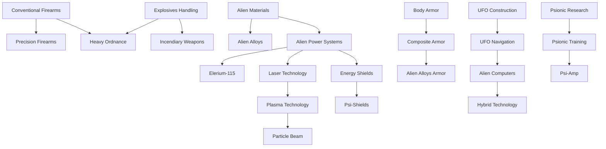

# Economy System

> **Status**: Design Document
> **Last Updated**: 2025-10-28
> **Related Systems**: Basescape.md, Items.md, DiplomaticRelations_Technical.md, Finance.md

## Table of Contents

- [Research Projects](#research-projects)
- [Research Technology Tree](#research-technology-tree)
- [Manufacturing Projects](#manufacturing-projects)
- [Marketplace](#marketplace)
- [Black Market](#black-market)
- [Supplier System](#supplier-system)
- [Transfer System](#transfer-system)
- [Examples](#examples)
- [Balance Parameters](#balance-parameters)
- [Difficulty Scaling](#difficulty-scaling)
- [Testing Scenarios](#testing-scenarios)
- [Related Features](#related-features)
- [Implementation Notes](#implementation-notes)
- [Review Checklist](#review-checklist)

---

## Research Projects

### Overview
Research projects allow players to unlock new technologies and capabilities by conducting scientific research. Each project requires a specific combination of resources, facilities, personnel, and prerequisite research.

**Requirements**
- Research items (components, salvaged technology, alien artifacts)
- Dedicated research facility with available scientist capacity
- Research services from facilities
- Completion of prerequisite research projects
- Scientist man-days: Scientific work only progresses when scientists actively work
- Credits to fund research

**Mechanics**
- Progress calculation: If a project costs 30 man-days and 5 man-days per day are assigned, the project completes in 6 days
- Scientists are paid only for days they actively work
- Player views daily progress as a percentage
- Repeatable projects: Item-based research (e.g., analyzing alien prisoners) can be performed multiple times
- Research priority: Higher priority research completes faster
- Pause/Resume: Can temporarily halt research without losing progress

**Research Types**
- **Technology**: Unlocks new capabilities and manufacturing options
- **Item Analysis**: Reverse-engineer captured equipment (+20% better equipment understanding)
- **Alien Interrogation**: Extract intelligence from prisoners (gains faction knowledge)
- **Autopsy**: Study alien biology to unlock specialized abilities (enables new unit types)
- **Facility Upgrade**: Improve base facility capabilities (+10-30% facility efficiency)
- **Hybrid Research**: Combine multiple research streams for advanced discoveries

**Cost Scaling Mechanics**
- Base cost varies by project complexity (50-500 man-days typical)
- Research cost multiplier: 50%-150% (randomly determined at campaign start for replayability)
- **Multiplier calculation**: Each project has unique cost range (example: Basic Rifle: 50-150 man-days)
- Prerequisite research: Cannot start until dependencies complete
- Resource consumption: Each project may require specific components
- Facility bonuses: Advanced facilities reduce research time by 10-30%
- Scientist specialization: Scientists gain +10% efficiency per completed related research

**Balance Considerations**
- Control research pace through scientist allocation
- Multiple research tracks can run simultaneously but compete for scientist resources
- Early game bottleneck: Limited scientists force prioritization (2-5 typical)
- Mid game balance: 5-10 scientists allow broader research
- Late game flexibility: 15+ scientists allow rapid advancement
- Research speed scaling: Additional scientists provide diminishing returns (5th scientist = 80% efficiency, 10th = 60%)

**Research Progression**
- Early research unlocks basic manufacturing
- Mid-tier research enables specialized equipment and advanced facilities
- Late-tier research enables late-game weaponry and tactical advantages
- Alien research branches off with unique dependencies (requires captured aliens first)

**Failed Research**

- Research cannot fail but can be cancelled
- Cancelled research returns 50-75% of invested credits
- Partial progress retained (not lost on cancellation)

---

## Research Technology Tree

### Overview
Research projects form interconnected branches that build a comprehensive technology tree. Players progress through multiple research paths simultaneously.

**Mechanics**
- All research is global: Discoveries apply across all bases immediately
- Research cost scaling: Base cost multiplied by 50%-150% (randomly determined at campaign start) to add variety and replayability
- Strong dependencies create logical progression paths
- Completing research unlocks new items, manufacturing capabilities, and mission options

**Strategic Depth**
- Players must balance broad research against focused advancement
- Regional technology variations can impact mission strategies
- Faction research trees remain independent and separate

---

### Research Tree Structure

The research tree is organized into **5 major branches** with multiple tiers of advancement:

#### 1. Weapons Technology Branch

**Tier 1: Basic Weapons** (Starting Technologies)
- **Conventional Firearms** (0 man-days) - Pre-researched, enables rifle/pistol manufacturing
- **Explosives Handling** (50 man-days) - Enables grenade and explosive manufacturing
- **Melee Combat Training** (30 man-days) - Enables advanced melee weapons

**Tier 2: Advanced Weapons** (Requires Tier 1)
- **Precision Firearms** (100 man-days) - Unlocks sniper rifles, scoped weapons
  - *Prerequisites*: Conventional Firearms
  - *Unlocks*: Sniper Rifle, Marksman Rifle, Scope attachments
- **Heavy Ordnance** (150 man-days) - Unlocks heavy weapons, rocket launchers
  - *Prerequisites*: Explosives Handling
  - *Unlocks*: Rocket Launcher, Heavy Machine Gun, Grenade Launcher
- **Incendiary Weapons** (120 man-days) - Unlocks fire-based weapons
  - *Prerequisites*: Explosives Handling
  - *Unlocks*: Flamethrower, Incendiary Grenades, Molotov Cocktails

**Tier 3: Energy Weapons** (Requires Tier 2 + Alien Technology)
- **Laser Technology** (200 man-days) - Basic energy weapons
  - *Prerequisites*: Precision Firearms + Alien Power Systems
  - *Unlocks*: Laser Rifle, Laser Pistol
- **Plasma Technology** (300 man-days) - Advanced energy weapons
  - *Prerequisites*: Laser Technology + Alien Plasma Samples
  - *Unlocks*: Plasma Rifle, Plasma Cannon
- **Particle Beam Weapons** (400 man-days) - Ultimate energy weapons
  - *Prerequisites*: Plasma Technology + Advanced Alien Materials
  - *Unlocks*: Particle Beam Cannon, Heavy Plasma

**Tier 4: Exotic Weapons** (Late Game)
- **Psionic Amplification** (500 man-days) - Psionic weapons
  - *Prerequisites*: Psionic Research + Plasma Technology
  - *Unlocks*: Psi-Amp, Mind Control devices
- **Gravitational Weapons** (600 man-days) - Gravity manipulation
  - *Prerequisites*: Advanced Alien Physics + Particle Beam Weapons
  - *Unlocks*: Gravity Gun, Singularity Grenade

---

#### 2. Armor & Defense Branch

**Tier 1: Basic Armor**
- **Body Armor** (0 man-days) - Pre-researched, basic armor manufacturing
- **Tactical Vests** (40 man-days) - Light armor options
  - *Unlocks*: Scout Armor, Light Tactical Vest

**Tier 2: Advanced Armor**
- **Composite Armor** (120 man-days) - Improved protection
  - *Prerequisites*: Body Armor
  - *Unlocks*: Combat Armor, Heavy Armor
- **Powered Exoskeletons** (180 man-days) - Strength enhancement
  - *Prerequisites*: Body Armor + Basic Robotics
  - *Unlocks*: Exo-Suit, Power Armor frame

**Tier 3: Alien-Based Armor**
- **Alien Alloys** (250 man-days) - Lightweight strong materials
  - *Prerequisites*: Composite Armor + Alien Materials Analysis
  - *Unlocks*: Alloy Armor, Alloy Plating
- **Energy Shields** (350 man-days) - Shield technology
  - *Prerequisites*: Alien Power Systems + Alien Alloys
  - *Unlocks*: Personal Shield Generator, Shield Armor

**Tier 4: Ultimate Protection**
- **Psi-Shields** (500 man-days) - Psionic defense
  - *Prerequisites*: Energy Shields + Psionic Research
  - *Unlocks*: Psi-Armor, Mind Shield
- **Titan Armor** (600 man-days) - Maximum protection
  - *Prerequisites*: Alien Alloys + Powered Exoskeletons
  - *Unlocks*: Titan Suit, Juggernaut Armor

---

#### 3. Alien Technology Branch

**Tier 1: Initial Analysis**
- **Alien Materials Analysis** (100 man-days) - Study alien materials
  - *Prerequisites*: Captured Alien Equipment
  - *Unlocks*: Basic alien manufacturing, research progression
- **Alien Autopsy** (80 man-days per species) - Study alien biology
  - *Prerequisites*: Alien Corpse
  - *Unlocks*: Species vulnerabilities, biological research
- **UFO Construction** (150 man-days) - Analyze UFO wreckage
  - *Prerequisites*: Crashed UFO recovered
  - *Unlocks*: Understanding of alien engineering

**Tier 2: Power & Propulsion**
- **Alien Power Systems** (200 man-days) - Alien energy generation
  - *Prerequisites*: UFO Construction
  - *Unlocks*: Elerium research, power plant upgrades
- **UFO Navigation** (250 man-days) - Alien navigation systems
  - *Prerequisites*: UFO Construction
  - *Unlocks*: Advanced craft navigation, improved radar

**Tier 3: Advanced Alien Tech**
- **Elerium-115** (300 man-days) - Master alien fuel source
  - *Prerequisites*: Alien Power Systems + Alien Materials Analysis
  - *Unlocks*: Advanced craft engines, energy weapons
- **Alien Computers** (280 man-days) - Alien computing systems
  - *Prerequisites*: UFO Navigation
  - *Unlocks*: Advanced targeting, improved facility efficiency

**Tier 4: Alien Integration**
- **Hybrid Technology** (400 man-days) - Combine human + alien tech
  - *Prerequisites*: Elerium-115 + Alien Computers
  - *Unlocks*: Ultimate equipment, hybrid weapons/armor

---

#### 4. Facilities & Infrastructure Branch

**Tier 1: Basic Facilities**
- **Advanced Engineering** (60 man-days) - Improved construction
  - *Unlocks*: Workshop upgrades, faster construction
- **Logistics Management** (50 man-days) - Better resource management
  - *Unlocks*: Larger storage, transfer improvements

**Tier 2: Specialized Facilities**
- **Psionic Laboratory** (150 man-days) - Psionic research facilities
  - *Prerequisites*: Advanced Engineering + Alien Autopsy (Sectoid)
  - *Unlocks*: Psi-Lab facility, psionic training
- **Advanced Workshop** (120 man-days) - Enhanced manufacturing
  - *Prerequisites*: Advanced Engineering
  - *Unlocks*: Workshop upgrades, faster production
- **Genetic Laboratory** (180 man-days) - Biological research
  - *Prerequisites*: Advanced Engineering + Alien Autopsy (any)
  - *Unlocks*: Gene-Lab facility, unit enhancements

**Tier 3: Strategic Facilities**
- **Hyperwave Decoder** (300 man-days) - Advanced alien detection
  - *Prerequisites*: UFO Navigation + Alien Computers
  - *Unlocks*: Hyperwave facility, UFO mission detection
- **Grav-Shield** (350 man-days) - Base defense shield
  - *Prerequisites*: Alien Power Systems + Energy Shields
  - *Unlocks*: Grav-Shield facility, base protection

---

#### 5. Support & Utility Branch

**Tier 1: Basic Support**
- **Medical Training** (40 man-days) - Improved medical care
  - *Unlocks*: Hospital upgrades, faster healing
- **Tactical Training** (50 man-days) - Combat improvements
  - *Unlocks*: Academy facility, faster XP gain

**Tier 2: Advanced Support**
- **Cybernetics** (150 man-days) - Mechanical augmentation
  - *Prerequisites*: Medical Training + Basic Robotics
  - *Unlocks*: Cyborg transformations, mechanical units
- **Genetic Engineering** (180 man-days) - Biological augmentation
  - *Prerequisites*: Medical Training + Genetic Laboratory
  - *Unlocks*: Gene Mods, biological transformations

**Tier 3: Elite Enhancement**
- **Psionic Training** (250 man-days) - Unlock psionic abilities
  - *Prerequisites*: Psionic Laboratory + Alien Autopsy (Sectoid)
  - *Unlocks*: Psionic stat for units, psi abilities
- **Neural Interface** (300 man-days) - Direct brain-computer link
  - *Prerequisites*: Cybernetics + Alien Computers
  - *Unlocks*: Advanced pilot bonuses, improved reactions

---

### Research Dependencies Graph



---

### Research Progression Timeline

**Early Game (Months 1-3)**:
- Focus: Basic weapons and armor improvements
- Key Research: Precision Firearms, Composite Armor, Medical Training
- Goal: Establish solid foundation for tactical operations

**Mid Game (Months 4-8)**:
- Focus: Alien technology analysis, energy weapons
- Key Research: Alien Materials, Laser Technology, Advanced Facilities
- Goal: Begin integrating alien technology

**Late Game (Months 9-15)**:
- Focus: Advanced alien integration, ultimate weapons
- Key Research: Plasma Technology, Elerium-115, Hybrid Technology
- Goal: Achieve technological superiority

**End Game (Months 16+)**:
- Focus: Exotic technologies, psionic mastery
- Key Research: Psionic Training, Gravitational Weapons, Titan Armor
- Goal: Prepare for final confrontations

---

### Research Strategy Recommendations

**Balanced Approach**:
- 30% Weapons Research
- 30% Armor Research
- 20% Alien Technology
- 10% Facilities
- 10% Support

**Aggressive Approach**:
- 50% Weapons Research
- 20% Alien Technology
- 20% Armor Research
- 10% Support

**Defensive Approach**:
- 40% Armor Research
- 25% Facilities
- 20% Support
- 15% Weapons Research

**Scientific Approach**:
- 50% Alien Technology
- 20% Facilities
- 15% Weapons Research
- 15% Armor Research

---

### Special Research Projects

**Interrogation Projects** (Repeatable):
- **Alien Soldier Interrogation** (50 man-days) - Extract tactical information
- **Alien Engineer Interrogation** (80 man-days) - Learn about alien technology
- **Alien Commander Interrogation** (120 man-days) - Discover alien objectives

**Facility Research** (One-time unlocks):
- **Mind Shield** (200 man-days) - Base psionic defense facility
- **Alien Containment** (150 man-days) - Prison for live aliens
- **Fusion Ball Launcher** (350 man-days) - Ultimate base defense weapon

**Strategic Research** (Game-changing):
- **Hyperwave Decoder** (300 man-days) - See all UFO missions
- **Avenger Construction** (500 man-days) - Ultimate player craft
- **Cydonia or Bust** (No cost) - Final mission unlock

---

### Research Cost Summary

| Research Tier | Average Cost (man-days) | Time Required (10 scientists) |
|---------------|------------------------|------------------------------|
| **Tier 1** | 30-80 | 3-8 days |
| **Tier 2** | 100-200 | 10-20 days |
| **Tier 3** | 250-400 | 25-40 days |
| **Tier 4** | 500-600 | 50-60 days |

**Note**: Actual costs vary by 50-150% based on campaign randomization

---

## Manufacturing Projects

**Overview**
Once a technology is researched, players can begin manufacturing relevant items, weapons, armor, and craft equipment. Manufacturing is a resource-intensive operation requiring careful planning and facility investment.

**Requirements**
- Researched manufacturing capability
- Raw resources (materials, alien components)
- Manufacturing facility with available engineer capacity
- Credits to fund production (upfront cost or ongoing)
- Facility engineering man-days
- Warehouse capacity to store produced items

**Mechanics**
- Production can be paused and resumed without penalty
- Engineers are paid only for days they actively work
- Batch bonuses: Producing multiple units of the same item yields production efficiency bonuses (5-10% per unit in batch)
  - 1 unit: 100% time
  - 5 units: 95% per unit (batch bonus 5%)
  - 10 units: 90% per unit (batch bonus 10%)
- Manufacturing is base-specific; each base manages its own production queues
- Daily progress displays as a percentage
- Production halts if required resources become unavailable (not cancellation)

**Manufacturing Cost Calculation**
```
Total Cost = (Base Item Cost) × Quantity
Daily Cost = Total Cost / (Days to Complete)
Resource Consumption = Item Resource Requirements × Quantity
Engineer Hours = Item Complexity × Quantity
```

**Production Speed Factors**
- **Engineer Allocation**: More engineers = faster completion (but with diminishing returns)
  - 1 engineer: 100% speed
  - 5 engineers: 80% speed per engineer average
  - 10 engineers: 60% speed per engineer average
- **Facility Level**: Higher-tier facilities improve production speed by 10-30%
  - Workshop: +10%
  - Advanced Workshop: +20%
  - Manufacturing Hub: +30%
- **Technology Specialization**: Bonuses apply to specific item categories
- **Equipment Efficiency**: Better tools reduce production time by 5-15%
- **Facility Specialization**: Dedicated manufacturing facilities produce faster (category-specific +20%)

**Queue System**
- Players can queue multiple manufacturing projects (3-10 typical)
- When one project completes, the next automatically begins
- If raw materials become scarce, production enters pause state (not cancellation)
- Queue can be reordered or modified
- Switching projects in queue causes startup delay (1-2 days waste)
- Queue visualization shows all pending projects and completion times
- Priority queue: Can mark projects as high priority (skips queue)

**Manufacturing Economics**
- Production typically 30-50% cheaper than marketplace purchases
- High volume manufacturing reduces per-unit cost significantly
- Scrap materials from damaged items recovered (50-75% value)
- Bulk production enables export for additional income (+20-40% markup on bulk sales)
- Overproduction penalties: Excessive stockpiles reduce facility efficiency

**Strategic Advantages**
- Manufacturing facilities provide independence from marketplace fluctuations
- Specialized production enables customized equipment
- Bulk manufacturing
- Export surplus equipment for additional revenue
- Vertical integration: Control supply chain completely

---

## Marketplace

**Overview**
The marketplace provides access to items, weapons, armor, ammunition, and supplies through multiple competing suppliers. Marketplace availability is dynamic based on diplomatic relations, fame, black market access, and tech progress.

**Suppliers**
Six suppliers operate within the marketplace:

| Supplier | Specialty | Base Price Mod | Relation Impact | Exclusive Access |
|----------|-----------|----------------|-----------------|-----------------|
| Military Supply Corp. | Military equipment, ammo | 100% | Nations only | Tech prerequisites |
| Syndicate Trade Co. | Gray market goods, upgrades | 120-150% | Independent operators | Neutrality stance |
| Exotic Arms Dealer | Alien-tech weapons, special items | 200-300% | Faction relations | Tech prerequisites + High Fame |
| Research Materials Ltd. | Raw materials, components | 80-110% | Universal access | Stability varies |
| Tactical Supply Network | Armor, tactical gear | 90-110% | Combat-focused nations | Tech unlock gated |
| Black Market Operations | Restricted items, experimental gear | Variable | Criminal-aligned factions | Low Karma (<-40) |

**Pricing Mechanics**
```
Item Price = (Base Price) × Supplier Modifier × Relationship Modifier × Bulk Discount
Supplier Modifier: 0.8x to 3.0x depending on supplier and item category
Relationship Modifier: -50% (embargo) to +100% (favorable)
Bulk Discount: 5% per 5+ items, 15% per 20+ items, 25% per 50+ items
```

**Availability Mechanics**
- **Research Prerequisites**: Cannot purchase alien-tech items until researched
- **Tech Level Gates**: Higher-tier items require minimum tech level (1-4 scale)
- **Regional Restrictions**: Some items available only in specific regions (military equipment in war zones, etc.)
- **Supplier Relations**: Negative relations (-50 or below) restrict access to non-military suppliers
- **Fame Impact**: Low fame (0-24) prevents access to premium suppliers; high fame (90+) unlocks exclusive items
- **Alignment Restrictions**:
  - Saint alignment: Blocks black market access, restricted weapons
  - Evil alignment: Blocks humanitarian supplier access
- **Diplomatic Status**: War-aligned nations block purchase from enemy-associated suppliers
- **Embargo Mechanics**: At -100 relationship, supplier completely cuts off access
- **Monthly Availability Limits**: 50-500 units per month depending on item type and supplier stability
- **Supply Fluctuations**: Unstable regions experience 10-40% availability reduction

**Purchase Mechanics**
- **Order Placement**: Specify quantity, supplier, delivery location
- **Payment Options**:
  - Upfront payment (standard)
  - Credit-based payment (relations >50 required, 5% interest)
  - Subscription orders (recurring monthly purchases)
- **Delivery Time**: Varies by supplier (1-14 days typical)
  - Military suppliers: 3-5 days
  - Black market: 5-10 days (unpredictable)
  - Research materials: 2-4 days
- **Delivery Location**: Items delivered to specified base or regional transfer hub
- **Failed Delivery**: 10% chance of delivery loss; player receives partial refund (20-50%)
- **Delivery Delays**: Random delays (0-3 additional days) common during operations
- **Interception Risk**: 5-15% chance of enemy interception en route (depends on regional security)

**Special Features**
- **Bulk Orders**: Purchasing 50+ units of same item triggers 25% discount + priority delivery (1 day faster)
- **Recurring Orders**: Can set automatic re-supply of ammunition/supplies monthly (5% price premium but guaranteed availability)
- **Limited Stock**: Rare items have limited availability (1-3 units per month)
- **Seasonal Variation**: Prices fluctuate by 10-20% based on regional stability and warfare
- **Standing Orders**: Suppliers offer periodic exclusive deals to high-reputation customers (20-30% discount on next order)
- **Supplier Auctions**: Time-limited special items at discounted prices (30-50% off)

**Marketplace Analysis Tools**
- **Price Comparison**: View prices across suppliers before purchasing
- **Historical Tracking**: Track price trends over time (optional)
- **Supplier Ranking**: View supplier reliability, delivery time, and quality ratings
- **Market Intelligence**: Affects strategic purchasing decisions
- **Availability Predictions**: Forecast supply changes based on regional stability

**Strategic Considerations**
- Marketplace enables rapid equipment acquisition for deployed forces
- Supplier relationships provide political leverage and access to restricted items
- Manufacturing + Marketplace = complete supply chain control
- Bulk purchases for ammunition sustain long operations
- Black market provides access to experimental/restricted technologies
- High-risk interception routes offer lower prices but increased loss probability
- Scarcity Multiplier: Rare items have higher prices
- Competition Factor: Multiple suppliers in region reduce prices

**Purchase Mechanics**
- Purchased goods arrive via transfer system with delay (1-14 days)
- Standard resale value: 50% of purchase price
- Purchase orders integrate with transfer system
- International shipments may include transit time and cost
- Can place orders but funds deducted immediately
- Cancellation of orders results in partial refund (typically 75-90%)

**Supplier Relationships Impact**
- Positive: Discounts, priority delivery, exclusive access to special items
- Neutral: Standard pricing, normal delivery times
- Negative: Price increases, delayed delivery, access restrictions
- Hostile: Complete embargo; cannot purchase

**Inventory Management**
- Marketplace stock refreshes monthly
- Stock depletion from high demand
- Restocks prioritize friendly suppliers
- Special orders take longer but guaranteed delivery
- Expedited delivery available at premium cost

**Purchasing Strategy**
- Bulk purchases take time to receive but offer discounts
- Emergency purchases available at higher cost
- Subscribe to items for auto-delivery
- Negotiate better deals through diplomacy

---

## Black Market

**Overview**
The black market provides extensive underground economy access including restricted items, special units, craft purchases, mission generation, event purchasing, and corpse trading. All transactions carry karma/fame consequences and discovery risks.

**For Complete Black Market Mechanics**: See [BlackMarket.md](./BlackMarket.md)

**Quick Summary**:
- **Items**: Experimental weapons, banned tech, alien equipment (200-500% markup)
- **Units**: Mercenaries, defectors, augmented soldiers (-10 to -30 karma per unit)
- **Craft**: Stolen military craft, prototypes, captured UFOs (-15 to -30 karma)
- **Missions**: Purchase custom missions (assassination, sabotage, heist) to spawn on map
- **Events**: Trigger political/economic events (improve relations, sabotage economy, incite rebellion)
- **Corpses**: Trade dead unit bodies for credits (-10 to -30 karma per corpse)

**Access Requirements**:
- Karma below +40 (cannot be "too good")
- Fame above 25 (must be known to find contacts)
- Entry fee: 10,000 credits (one-time)

**Discovery Risk**: 5-15% per transaction, increases with fame and transaction count. Discovery results in -20 to -50 fame, -30 to -70 relations with discovering country.

---

## Supplier System

**Overview**
Each good available for purchase has an associated supplier. Supplier relationships directly impact pricing and availability, creating an economic web of dependencies and strategic considerations.

**Supplier Mechanics**
- Each item/equipment type has primary and secondary suppliers
- Relationship range: -100 (embargo/blocked) to +100 (favorable/preferred partner)
- Suppliers can be cultivated through diplomacy, consistent purchasing, and political alignment
- Multiple suppliers exist for most item categories, enabling relationship diversification
- Relationship changes: ±1 point per month based on purchase activity and diplomatic stance
- Monthly relationship decay: -1 point per month with no purchases (friendship atrophy)

**Supplier Types and Specialization**

| Supplier Type | Categories | Base Relations | Pricing Range | Exclusivity |
|---------------|------------|-----------------|---------------|------------|
| Military Suppliers | Weapons, ammo, combat armor | Stable: 0 to +40 | 80-120% | Nations only |
| Advanced Tech Suppliers | Electronics, radar, systems | Variable: -20 to +60 | 100-180% | Tech-dependent |
| Regional Suppliers | Local goods, regional items | Volatile: -50 to +80 | 90-150% | Region-specific |
| Scientific Suppliers | Materials, components, samples | Neutral: -10 to +50 | 85-120% | Stability varies |
| Aerospace Suppliers | Craft parts, fuel, engines | Stable: 0 to +40 | 100-160% | Tech prerequisites |
| Black Market Suppliers | Restricted, experimental items | Criminal: -100 to +40 | Variable: 150-500% | Karma gated |

**Relationship Mechanics**
```
Relation Change = (Purchase Amount / 1000) - Diplomatic Stance Conflict
Monthly Maintenance = -1 point per month (no purchases)
Pricing Modifier = 1.0 + (0.005 × (100 - Relation))
```
- At relation -100: 1.5x price modifier + complete access cut-off
- At relation -50: 1.25x price modifier + limited stock
- At relation 0: 1.0x price modifier (baseline)
- At relation +50: 0.75x price modifier + priority delivery
- At relation +100: 0.5x price modifier + exclusive items unlocked

**Availability Tiers by Relationship**

| Relation | Pricing | Availability | Delivery | Exclusives |
|----------|---------|--------------|----------|-----------|
| -100 | +500% | Blocked | N/A | None |
| -50 to -1 | +25% | 25% of normal | +5 days | None |
| 0 to +25 | Baseline | 100% | Normal | None |
| +26 to +50 | -15% | 100% | -2 days | Unlocks some |
| +51 to +75 | -25% | 120% | -3 days | Unlock more |
| +76 to +100 | -50% | 150% | -5 days | All exclusive items |

**Strategic Purchase Impact**
- Purchasing consistently from supplier: +0.5 relation per large order (50+ units)
- Purchasing from competing supplier: -0.5 relation with abandoned supplier
- Emergency purchases at 200% price: +1 relation (desperation indicator)
- Bulk contracts (monthly recurring): +0.3 relation per month
- Non-purchase months: -1 relation (decay)

**Special Supplier Mechanics**
- **Exclusivity Contracts**: Can negotiate exclusive sourcing rights (blocks competing suppliers but locks pricing)
- **Bulk Discounts**: 100+ units = 15%, 500+ = 25%, 1000+ = 40% discount from base price
- **Volume Bonuses**: Cumulative purchases trigger relationship bonuses (milestone at 10,000 credits = +1 relation)
- **Priority Access**: At +50 relation, can request priority restock of rare items
- **Embargo Mechanics**: At -100 relation, supplier cuts off completely (requires diplomatic reset or time passage)
- **Supplier Switching**: Changing primary suppliers takes 1 month for relationship transition
- **Black Market Escalation**: Criminal suppliers offer extra discounts for exclusive services (assassinations, espionage)

**Supplier Conflicts**
- Nation-aligned suppliers may restrict access during wars (relationship drops -10)
- Faction competition for same items creates bidding wars (+15-30% price increase)
- Diplomatic incidents affect all suppliers from offended nation (-20 relation minimum)
- Faction alignment restricts access: Saint = no black market, Evil = no humanitarian suppliers

**Supplier Specialization**
- Each supplier has core category with best pricing (e.g., Military = weapons -10%)
- Expansion categories available at neutral pricing
- Outside specialization expensive (150-200% price)
- Research unlocks new supplier specializations

**Economic Strategy Implications**
- Diversified supplier network ensures resilience against embargoes
- Specialized relationships reduce equipment costs by 40-50%
- Strategic alignment with powerful suppliers provides political advantages
- Black market supplier relationships enable restricted technology access
- Supplier switching costs: 1-month transition period + relation penalties

**Relationship Effects**
- **Pricing**: Relationships affect purchase prices (favorable = discounts up to 50%, hostile = prices increase up to 100%)
- **Availability**: Can restrict quantities or block sales entirely
- **Exclusive items**: Unique equipment only available from specific suppliers
- **Embargoes**: Poor relationships can result in complete trade blocks
- **Priority Delivery**: Friendly suppliers offer expedited shipping
- **Discounts**: Volume discounts and loyalty bonuses

**Supplier Management**
- Regular purchases improve supplier relationships
- Large orders strengthen bonds (+1-2 per large order)
- Diplomatic investments accelerate relationship growth (+3-5 per diplomatic action)
- Betrayal (switching suppliers) damages relationships (-10-20)
- Payment delays damage relationships (-5 per month overdue)
- Completing contracts improves relationships (+2-5)

**Exclusive Access**
- Some suppliers require minimum relationship levels
- Premium suppliers need Fame threshold
- Black market requires low Karma
- Research-locked suppliers need specific technologies
- Allied country suppliers restricted to countries with good relations

**Supplier Network**
- Different suppliers active in different regions
- Global suppliers available everywhere but at higher prices
- Regional suppliers cheaper but limited to regions
- Can maintain multiple supplier relationships for diversity
- Suppliers may compete for business (creating price wars)
- Coalition suppliers offer better prices for larger organizations

---

## Supply Transfer System (A3: Supply Transfer Integration)

**Overview**
The Supply Transfer system provides the foundational logistics mechanics for moving resources between bases. This is distinct from the broader Transfer System (see below) which handles all inter-base movements. Supply Transfer specifically addresses routine resource movement, automatic routing, and interception integration.

**Core Supply Transfer Mechanics**

Supply Transfer operates on three principles:
1. **Automatic Routing**: System calculates optimal paths based on player preference (speed vs cost)
2. **Interception Integration**: Transfers are vulnerable to interception at specific transit points
3. **Supply Line Establishment**: Recurring transfers create permanent supply routes

**Transfer Types**

| Type | Recurring | Interception Risk | Speed | Cost |
|------|-----------|------------------|-------|------|
| Routine Supply | Yes | 8% per transfer | Base | Base |
| Emergency Resupply | No | 12% per transfer | -75% time | +200% cost |
| Bulk Contract | Yes (monthly) | 6% per transfer | Base | -10% cost |
| Stealth Route | Variable | 2% per transfer | +50% time | +50% cost |

**Supply Transfer Formula**

```
Base Transfer Cost = (Item Mass in tons × Distance in hexes × 0.25) + 100 credits
Total Cost = Base Transfer Cost × Transport Multiplier × Urgency Multiplier
  Transport Multiplier: Air 2.0x, Ground 1.0x, Maritime 0.5x, Craft 1.5x
  Urgency Multiplier: Routine 1.0x, Emergency 3.0x, Stealth 1.5x

Transfer Time (in days) = CEILING((Distance in hexes / Base Speed) + Loading + Unloading)
  Base Speed: Air 2, Ground 1, Maritime 1, Craft 1.5
  Loading Time: 1 day + (Quantity / 1000)
  Unloading Time: 1 day + (Destination Storage Utilization %)
```

**Example: Supply Transfer A3-1 - Routine Ammunition Resupply**
- Origin: Base Alpha (5 assault rifles ammunition, 10 tons mass)
- Destination: Base Beta (8 hexes away, 50% storage utilized)
- Transport: Ground vehicle (safest option)
- Calculation:
  - Base Cost: (10 × 8 × 0.25) + 100 = 120 credits
  - Total Cost: 120 × 1.0x × 1.0x = 120 credits
  - Time: CEILING((8 / 1.5) + 1 + 1.5) = CEILING(7.83) = 8 days
  - Interception Risk: 8%
  - Result: Arrives in 8 days, 120 credit cost, 8% interception risk

**Supply Line Establishment**

Permanent supply routes enable recurring, predictable logistics:

```
Supply Line Activation Cost = 500 + (Distance × 50)
Monthly Maintenance = Base Cost × 0.1 (automatic from funds)
Auto-replenishment trigger = Current Stock < (Minimum Threshold × 1.2)
Delivery frequency (player choice): Weekly, Bi-weekly, or Monthly
```

**Supply Line Features**
- Can establish up to 10 active supply lines per base
- Each supply line auto-initiates transfer on set schedule
- System manages loading/unloading automatically
- Disruption tracking: Records when route fails (due to interception/warfare)
- Supply line visibility: Player sees route, enemies may detect with intelligence (60% chance if active warfare)

**Example: Supply Line A3-2 - Regular Monthly Ammunition Resupply**
- Activation: Base Alpha → Base Beta, Monthly, Ammunition quota 50 units
- Setup Cost: 500 + (8 × 50) = 900 credits
- Monthly Cost: Base Cost (120 credits) automatically paid
- Benefit: Automatic resupply without manual interaction
- Disruption: During active warfare in region, 20% chance route is intercepted (ammunition lost, cost charged)

**Supply Transfer Restrictions & Logic**

1. **Capacity Checks**
   - Cannot transfer if origin storage below 105% of transfer quantity
   - Cannot transfer to destination if destination storage < transfer quantity
   - System holds failed transfers in queue (optional 7-day retry)

2. **Item-Specific Restrictions**
   - Alien prisoners: Restricted to containment-equipped bases only
   - Weapons/ammunition: No restrictions (tradeability based on relations)
   - Research data: Transfer restricted until technology researched
   - Base-specific equipment: Hangars, reactors, gardens don't transfer (facility upgrades not included)

3. **Relation-Based Restrictions**
   - Cannot transfer to enemy-aligned bases
   - Can transfer to neutral bases (cost +50% if not allied)
   - Allied bases: Standard cost/speed
   - Related to Relations system (see Politics.md): Trade embargo freezes supply lines

**Supply Transfer & Interception Integration (Details)**

Transfers create vulnerability windows:

```
Interception Event occurs when:
1. Transfer in transit (between origin and destination)
2. Within contested/enemy region (increases risk 2x)
3. Route passes through monitored interception points (increases risk 1.5x)
4. Enemy has active ground forces in region (increases risk 1x for each group)

Interception Risk Calculation = Base Risk × (1 + Region Factor) × (1 + Point Factor) × (1 + Force Factor)
  Base Risk: 8% routine, 12% emergency, 6% bulk, 2% stealth
  Region Factor: 0 safe, +1 contested, +2 enemy-controlled
  Point Factor: 0 no points, +0.5 per interception point on route
  Force Factor: 0 no forces, +0.1 per enemy group in region

Example Interception Calculation (A3-3):
- Routine supply (8% base)
- Through contested region (+1 factor = 1x multiplier)
- 2 interception points (+0.5 each = 1x multiplier)
- 3 enemy groups in region (+0.1 each = 1.3x multiplier)
- Total Risk: 8% × 2 × 1 × 1.3 = 20.8%
```

**Supply Transfer Player Decisions**

For each transfer, player chooses:
1. **Route Type**: Speed vs Cost (automatic routing suggests 3 options)
2. **Transport Method**: Air (fast/expensive), Ground (balanced), Maritime (slow/cheap), Craft (flexible)
3. **Risk Tolerance**: Standard (8%), Stealth (2%, +50% cost), Emergency (12%, +200% cost)
4. **Protection**: Unguarded, Convoy escort (+25% cost, -50% interception risk)
5. **Visibility**: Normal, Decoy transfer (send fake convoy to misdirect enemies)

---

## Manufacturing vs Marketplace Balance (R2: Manufacturing/Marketplace Tension)

**Overview**
Game design challenge: Players can either manufacture items at their bases (slower, cheaper, buildable) or purchase from the marketplace (faster, expensive, limited stock). This creates economic strategy decision points.

**Design Philosophy**
- Manufacturing should feel rewarding (player investment, base development)
- Marketplace should feel risky (price volatility, stock limitations, potential disruption)
- Neither should dominate; both remain viable throughout campaign
- Player choice determines economic path: self-sufficient vs market-dependent

**Manufacturing Advantage Profile**

```
Manufacturing Strategy Advantages:
✓ Unlimited production capacity (no stock limits)
✓ Economies of scale (production faster as volume increases)
✓ Self-sufficiency (not vulnerable to marketplace disruption)
✓ Research-locked items (only obtainable via manufacturing)
✓ Customization (can produce variants for specific use cases)
✓ Strategic resilience (survives marketplace interference)

Manufacturing Disadvantages:
✗ High upfront cost (facility construction 50-150K credits)
✗ Tech dependency (must research manufacturing recipes)
✗ Time cost (production takes 20-50 days per batch)
✗ Resource commitment (ties up production capacity)
✗ Requires base infrastructure (workshops, laboratories)
```

**Marketplace Advantage Profile**

```
Marketplace Strategy Advantages:
✓ Immediate availability (items arrive in 3-8 days via transfer)
✓ Price competition (marketplace prices lower than manufacturing if multiple suppliers)
✓ No infrastructure cost (no facilities to build)
✓ Technology-free access (don't need research to use items)
✓ Diversified supply (multiple items available without specialization)
✓ Quick iteration (test item types without long production commitment)

Marketplace Disadvantages:
✗ Price volatility (can spike 20-50% during shortages)
✗ Stock limitations (only 10-50 units per item type available)
✗ Disruption risk (supply interruption if suppliers attacked)
✗ Limited variety (not all items available in marketplace)
✗ Cost per unit higher than manufacturing (2-3x more expensive)
✗ Accessibility risk (marketplace closed during wartime)
```

**Manufacturing-Marketplace Tension Points**

**T1: Early Campaign (Months 1-3)**
- Marketplace dominates: Manufacturing infrastructure not yet built
- Player decision: Rush tech for manufacturing vs rely on market
- Balance mechanism: Marketplace is well-stocked, prices stable
- Strategic implications: Patience (build manufacturing) vs speed (marketplace)
- Recommendation: Marketplace should feel viable but temporary

**T2: Mid-Campaign (Months 4-9)**
- Manufacturing comes online: Factories operational
- Player decision: Shift to manufacturing vs maintain marketplace dependency
- Balance mechanism: Manufacturing now cheaper but slower; marketplace prices rising
- Strategic implications: Self-sufficiency vs market flexibility
- Recommendation: Manufacturing now cheaper; marketplace feels expensive but still available

**T3: Late Campaign (Months 10-15)**
- Manufacturing is most efficient: Research complete, scaling benefits active
- Player decision: Pure manufacturing vs hybrid (marketplace for specialized items)
- Balance mechanism: Manufacturing is both cheaper and faster for bulk orders; marketplace supplies niche items
- Strategic implications: Only marketplace items are non-manufacturable (alien tech, specialized weapons)
- Recommendation: Manufacturing should feel dominant; marketplace is luxury/emergency option

**Manufacturing Economics**

```
Manufacturing Cost Formula:
Item Production Cost = Base Production Cost × Research Efficiency × Facility Efficiency × Scaling Factor
  Base Production Cost: Varies by item (50-5000 credits) [see Items.md]
  Research Efficiency: 1.0x baseline, -10% per research level (scales to 0.7x at max)
  Facility Efficiency: 1.0x if new facility, +10% per upgrade level (scales to 1.5x at max upgrades)
  Scaling Factor: 1.0x for first 100 units, -5% for each 100 units (batching bonus)

Production Time Formula:
Item Production Time = Base Production Time × (Difficulty Multiplier) × (Facility Speed Modifier)
  Base Production Time: Varies by item (5-50 days) [see Items.md]
  Difficulty Multiplier: 1.0x baseline, +10% per research level skipped (requires base research)
  Facility Speed Modifier: 1.0x standard facility, +25% if facility upgraded, +50% if specialty facility
```

**Example: Manufacturing R2-1 - Assault Rifle Production**
- Item: Assault Rifle (Base cost 250 credits, Base time 7 days)
- Research: Advanced Ballistics (3 levels researched) = 0.7x efficiency
- Facility: Weapons Workshop (upgraded 2 levels) = 1.2x speed, 1.2x cost efficiency
- Batch size: 100 rifles = 1.0x scaling
- Calculation:
  - Cost: 250 × 0.7 × 1.2 × 1.0 = 210 credits per rifle (21,000 total for 100-unit batch)
  - Time: 7 × 1.0 × 0.8 (2 upgrades = +25% speed per level) = 5.6 days = 6 days CEILING
  - Batch discount: 100 units get -5% scaling benefit
  - Final: 100 rifles in 6 days, 20,000 total cost (200 credits/rifle)

**Marketplace Economics**

```
Marketplace Price Formula:
Market Price = Base Price × Demand Multiplier × Supply Multiplier × Supplier Competition Multiplier
  Base Price: Varies by item (typically 2-3x manufacturing cost) [see Items.md]
  Demand Multiplier: 0.8x if low demand, 1.0x baseline, 1.2x high demand, 1.5x critical shortage
  Supply Multiplier: 2.0x if very low stock, 1.0x if normal stock, 0.8x if oversupply
  Supplier Competition Multiplier: 1.0x 1 supplier, 0.85x 2 suppliers, 0.7x 3+ suppliers

Supply Limit Formula:
Available Stock = (Base Supply × Supplier Count) × Availability Modifier
  Base Supply: 10-50 units per item type
  Supplier Count: 1-3 suppliers per item
  Availability Modifier: 0.5x wartime, 0.7x contested region, 1.0x peacetime
```

**Example: Marketplace R2-2 - Assault Rifle Purchase**
- Item: Assault Rifle (Base marketplace price 500 credits)
- Demand: High (many players buying) = 1.2x multiplier
- Supply: Low (only 20 units in stock) = 2.0x multiplier (shortage)
- Competition: 2 suppliers = 0.85x multiplier
- Calculation:
  - Price: 500 × 1.2 × 2.0 × 0.85 = 1,020 credits per rifle
  - Stock available: 20 rifles before stockout
  - Result: Expensive due to shortage, but immediate availability (transfer in 5 days)

**Balancing Manufacturing vs Marketplace**

**Design Variables** (game designer can tune):

1. **Manufacturing Efficiency Curves**
   - Parameter: Research efficiency gain per level (default -10%)
   - Tuning: Increase to -15% makes manufacturing dominant too fast; decrease to -5% keeps marketplace viable longer

2. **Marketplace Price Volatility**
   - Parameter: Price spike multiplier for high demand (default 1.5x)
   - Tuning: Increase to 2.0x makes marketplace expensive, forcing manufacturing; decrease to 1.2x keeps marketplace competitive

3. **Stock Availability**
   - Parameter: Base supply per item (default 10-50)
   - Tuning: Increase makes marketplace reliable; decrease creates supply anxiety, pushes manufacturing

4. **Facility Upgrade Benefits**
   - Parameter: Speed bonus per upgrade level (default +25%)
   - Tuning: Increase to +50% makes manufacturing rapidly dominant; decrease to +10% keeps marketplace needed

**Strategic Balancing Table**

| Campaign Phase | Manufacturing Cost | Marketplace Price | Recommendation |
|---|---|---|---|
| Month 1-2 | 300 credits/rifle | 500 credits/rifle | Marketplace viable, cheaper |
| Month 3-4 | 250 credits/rifle | 550 credits/rifle | Marketplace slightly more expensive |
| Month 6-9 | 180 credits/rifle | 700+ credits/rifle | Manufacturing dominant, marketplace expensive |
| Month 12+ | 150 credits/rifle | 1000+ credits/rifle | Manufacturing optimal; marketplace for specialties |

**Manufacturing vs Marketplace Integration**

Players typically follow progression:
1. **Phase 1 (Early)**: Marketplace primary, manufacturing secondary (facilities not built)
2. **Phase 2 (Mid)**: Hybrid approach, gradually shifting to manufacturing
3. **Phase 3 (Late)**: Manufacturing primary, marketplace for emergency/specialized items

Design goal: Enable all three progression paths:
- **Speed Runner**: Marketplace-heavy throughout (expensive but keeps operations lean)
- **Balanced**: Hybrid manufacturing/marketplace mix (moderate cost, flexible)
- **Industrialist**: Manufacturing-heavy (cheapest long-term, requires infrastructure)

---

## Manufacturing Profit Margins

Manufacturing generates income through production and sale of equipment to marketplace suppliers or other bases. Profit margins scale with facility upgrades and production volume.

**Early Game Manufacturing (Basic Facilities)**
- Monthly Profit: 5-15K credits
- Production Scale: 10-50 units per month
- Profit per Unit: 100-300 credits (after material costs)
- Facilities Required: Basic Workshop + Storage

**Mid Game Manufacturing (Upgraded Facilities)**
- Monthly Profit: 20-40K credits
- Production Scale: 50-200 units per month
- Profit per Unit: 200-400 credits (efficiency gains)
- Facilities Required: Upgraded Workshop + Large Storage + Research Lab synergy

**Late Game Manufacturing (Advanced Facilities)**
- Monthly Profit: 50-100K credits
- Production Scale: 200-500 units per month
- Profit per Unit: 300-500 credits (automation and specialization)
- Facilities Required: Advanced Workshop + Automated Production + Supply Chain

**Manufacturing Profit Formula**
```
Monthly Profit = (Units Produced × Profit per Unit) × Efficiency Multiplier × Market Demand
  Units Produced: Based on facility capacity and production queues
  Profit per Unit: Base item value - material costs - labor costs
  Efficiency Multiplier: 1.0x basic, 1.5x upgraded, 2.0x advanced
  Market Demand: 0.8x oversupply, 1.0x balanced, 1.2x high demand
```

**Example: Early Game Manufacturing Profit**
- Production: 30 assault rifles per month
- Profit per Unit: 200 credits (sale price 500 - costs 300)
- Efficiency: 1.0x (basic facilities)
- Market Demand: 1.0x (balanced)
- Monthly Profit: 30 × 200 × 1.0 × 1.0 = 6,000 credits

---

## Research Milestone Bonuses

Completing major research projects provides one-time financial bonuses to reward technological advancement and provide economic relief for further development.

**Basic Technology Completion Bonuses**
- Ballistics Research: 15K credits (unlocks basic weapons manufacturing)
- Body Armor Research: 12K credits (unlocks basic armor production)
- Vehicle Research: 18K credits (unlocks craft improvements)
- Facility Research: 10K credits (unlocks base expansion options)

**Advanced Technology Completion Bonuses**
- Energy Weapons Research: 35K credits (unlocks plasma/laser weapons)
- Advanced Armor Research: 30K credits (unlocks power armor)
- Interception Systems: 40K credits (unlocks advanced craft capabilities)
- Production Speed Research: 25K credits (unlocks manufacturing efficiency)

**Major Technology Tree Completion Bonuses**
- Complete Weapons Tree: 75K credits (all weapon technologies researched)
- Complete Armor Tree: 60K credits (all armor technologies researched)
- Complete Vehicle Tree: 80K credits (all craft technologies researched)
- Complete Facility Tree: 50K credits (all base technologies researched)
- Complete Strategic Tree: 90K credits (all diplomatic/espionage technologies)

**Research Bonus Timing**
- Bonuses awarded immediately upon research completion
- Can be used for facility construction, unit recruitment, or saved for emergencies
- Provides economic relief during technology transition periods
- Encourages research investment by providing tangible financial returns

**Example: Research Milestone Bonus Impact**
- Player completes Energy Weapons research (35K bonus)
- Uses bonus to construct Advanced Workshop (30K cost)
- Remaining 5K provides breathing room for next month's expenses
- New workshop enables higher manufacturing profits (20K+ monthly)

---

## Research Dependencies & Edge Cases (C2: Research Tree Integration)

**Overview**
Research tree mechanics create technology gating and progression dependencies. This specification details how research interacts with manufacturing, unlocks, and creates strategic branching paths.

**Research Tree Structure**

The research tree consists of 5 major branches with hierarchical dependencies:

```
RESEARCH TREE HIERARCHY:

1. WEAPONS RESEARCH
   ├─ Basic Ballistics (unlock)
   │  ├─ Advanced Ballistics (requires Basic)
   │  │  ├─ Heavy Ballistics (requires Advanced)
   │  │  └─ Precision Ballistics (requires Advanced)
   │  └─ Energy Weapons (requires Basic)
   │     ├─ Plasma Weapons (requires Energy)
   │     └─ Laser Weapons (requires Energy)
   ├─ Explosives (unlock)
   │  ├─ Advanced Explosives (requires Explosives)
   │  └─ Rocket Systems (requires Advanced)
   └─ Melee Enhancement (unlock)
      └─ Power Melee (requires Melee Enhancement)

2. ARMOR RESEARCH
   ├─ Body Armor Mk1 (unlock)
   │  ├─ Body Armor Mk2 (requires Mk1)
   │  │  └─ Body Armor Mk3 (requires Mk2)
   │  └─ Specialized Armor (requires Mk1)
   ├─ Shield Technology (unlock)
   │  └─ Advanced Shields (requires Shield Tech)
   └─ Environmental Suits (unlock)

3. VEHICLE RESEARCH
   ├─ Craft Improvement (unlock)
   │  ├─ Speed Enhancement (requires Craft Improvement)
   │  └─ Armor Enhancement (requires Craft Improvement)
   ├─ Interception Systems (unlock)
   │  └─ Advanced Interception (requires Interception)
   └─ Transport Optimization (unlock)

4. FACILITY RESEARCH
   ├─ Power Efficiency (unlock)
   │  └─ Advanced Power (requires Power Efficiency)
   ├─ Storage Optimization (unlock)
   │  └─ Advanced Storage (requires Storage)
   └─ Production Speed (unlock)
      └─ Advanced Production (requires Production Speed)

5. STRATEGIC RESEARCH
   ├─ Diplomacy (unlock)
   │  └─ Enhanced Diplomacy (requires Diplomacy)
   ├─ Espionage (unlock) [NOTE: Espionage not available - see Politics.md Relations]
   │  [REMOVED - diplomacy-only system]
   └─ Ancient Technology (unlock)
      └─ Advanced Ancient Tech (requires Ancient Tech)
```

**Research Dependencies: Edge Cases**

**Dependency Rule 1: Linear Prerequisites**
- Cannot research Advanced tech before Basic tech
- Exception: Player can skip Basic research for 2x cost (represents "catch-up" research)
- Example: Research Advanced Ballistics without Basic Ballistics = 2x cost
- Balance note: Encourages natural progression but allows flexibility

**Dependency Rule 2: Branching Paths (Exclusive Research)**
Some technologies are mutually exclusive (represent opposing tech philosophies):

```
Mutually Exclusive Pairs:
- Energy Weapons vs Advanced Ballistics (player chooses specialization)
  Cost: Each blocks 20% efficiency of the other
  Resolution: Researching both is possible but penalizes both

- Stealth Focus vs Heavy Armor Focus
  Cost: Each provides -15% benefit if researching opposite path
  Resolution: Player picks specialization or accepts hybrid penalty

- Underground Bases vs Mobile Operations
  Cost: Cannot have both (only one can be active per base)
  Resolution: Must build facility to change focus
```

**Dependency Rule 3: Prerequisite Chains (Multi-level)**
Long chains force strategic sequencing:

```
Example Chain: Heavy Weapons Path
Basic Ballistics (Week 1)
  → Advanced Ballistics (Week 3)
    → Heavy Ballistics (Week 6)
      → Experimental Weapons (Week 10)

Total progression: 10 weeks to access Experimental Weapons

Alternative: Skip Advanced, go directly to Heavy (2x cost)
- Basic Ballistics (Week 1)
  → Heavy Ballistics via catch-up (Week 4, 2x cost)
    → Experimental Weapons (Week 8)

Total progression: 8 weeks but at 2x cost for catch-up
```

**Dependency Rule 4: Cross-Branch Requirements**
Some technologies require research from multiple branches:

```
Example: Advanced Armor Suits
Required:
- Body Armor Mk2 (from Armor Research branch)
- Power Efficiency (from Facility Research branch)
- Environmental Engineering (5K separate research cost)

Result: Designed armor suits require investment in 2+ branches
Strategic implication: Forces specialization vs generalization decisions
```

**Research Edge Cases**

**Edge Case C2-1: Abandoned Research Path**
- Situation: Player researches Ballistics heavily, then wants to switch to Energy Weapons
- Current status: Ballistics research at 80%, Diplomacy at 0%
- Consequence: Ballistics research doesn't reset, but Energy Weapons starts at 0%
- Cost: Must pay full cost for Energy Weapons despite Ballistics investment
- Design rationale: Prevents "free switching"; costs real resources to pivot
- Mitigation: Some research points transfer (20% efficiency gain if switching within category)

**Edge Case C2-2: Conflict Research Penalty**
- Situation: Player researches both Energy Weapons (efficiency -15%) and Advanced Ballistics (efficiency -15%)
- Current status: Both at 50% completion
- Effect: Total research cost increases by mutual penalty
- Result: Both take 20% longer to complete (diminishing returns on conflicting research)
- Resolution: Player can continue or abandon one path
- Strategic lesson: Specialize rather than generalize

**Edge Case C2-3: Prerequisite Not Yet Researched**
- Situation: Technology requires Basic Ballistics as prerequisite
- Current status: Basic Ballistics researched at 80% (not yet complete)
- Can player start Advanced Ballistics research? NO
- Design rule: All prerequisites must be 100% complete before dependent tech can start
- Exception: If player has Advanced Ballistics in queue and Basic completes, research auto-starts

**Edge Case C2-4: Technology Unlock Without Research**
- Situation: Player captures alien armor (grants Armor knowledge)
- Question: Does this count as "researched"?
- Answer: Partial credit (50% of research completed)
- Implication: Can research follow-on techs but at higher cost until full research completed
- Example: Captured alien armor = 50% of Body Armor Mk3 complete; still need 50% normal research cost

**Edge Case C2-5: Research Facility Destroyed**
- Situation: Laboratory with active research is destroyed
- Question: Is research lost?
- Answer: Research saved but paused until new facility built
- Consequence: Research progress doesn't reset (50% complete research remains 50%) but can't advance
- Cost: Must rebuild facility before research can resume
- Exception: Research transferred to other active laboratory (if available)

**Research Time Calculation**

```
Research Completion Time = Base Time × Difficulty Multiplier × Catch-up Multiplier × Tech Level Multiplier
  Base Time: 5-20 weeks depending on technology [see Research Tree details]
  Difficulty Multiplier: 1.0x baseline, +10% per research level skipped
  Catch-up Multiplier: 1.0x normal progression, 2.0x if using catch-up (skip prerequisites)
  Tech Level Multiplier: 1.0x for Mk1/Basic, 1.2x for Mk2/Advanced, 1.5x for Mk3/Experimental

Research Speed Modifiers (multiplicative):
- Laboratory basic: 1.0x baseline
- Laboratory upgraded: 0.85x per upgrade level (max 0.5x with 3 upgrades)
- Scientists assigned: -10% per additional scientist (max -30% with 3 scientists)
- Related research complete: -15% if related technology already researched
- Experimentation bonus: -20% if experimenting with similar captured tech
```

**Example: Research C2-1 - Advanced Ballistics Path**
- Technology: Advanced Ballistics
- Prerequisites: Basic Ballistics (100% complete ✓)
- Base time: 12 weeks
- Difficulty: Normal (no skipped levels) = 1.0x
- Facility: Laboratory upgraded 2 levels = 0.85^2 = 0.72x (28% faster)
- Scientists: 2 scientists assigned = -10% -10% = 0.8x
- Related research: Basic Ballistics complete = -15% = 0.85x
- Calculation: 12 × 1.0 × 1.0 × 1.2 × 0.72 × 0.8 × 0.85 = 8.3 weeks ≈ 9 weeks
- Result: Advanced Ballistics completes in 9 weeks with optimized facility

---

## Economic-Strategic Integration (CROSS-2: Transfer/Interception Integration)

**Overview**
This specification bridges Economy system (transfers, manufacturing, marketplace) with Strategic/Geoscape systems (interception, combat, warfare). The integration creates economic consequences for military actions and military consequences for economic operations.

**Core Integration Principle**
Every transfer is a strategic target. Every military operation has economic consequences. This creates emergent decision-making:
- Military: "Should we intercept this supply run?" (disrupts enemy economy)
- Economic: "Do we risk expensive transfer through contested area?" (potential loss, opportunity cost)
- Strategic: "Should we conquer marketplace supplier region?" (economic domination)

**Transfer Vulnerability System**

Transfers become vulnerable based on game state:

```
Interception Risk Factors:
1. Geographic: Transfer passes through contested/enemy territory
2. Military: Enemy forces present in transit region
3. Strategic: Active warfare in region increases risk
4. Infrastructure: Interception points (bases) increase risk
5. Player visibility: Enemy intelligence networks detect transfer

Base Interception Chance = Route Risk × Military Presence × Strategic State
  Route Risk: 0% safe territory, 20% neutral, 50% contested, 80% enemy
  Military Presence: 0% no forces, +10% per enemy group in region
  Strategic State: 1.0x peacetime, 1.5x active warfare, 2.0x invasion

Example Interception Risk (CROSS-2-1):
- Transfer through contested region (50% base risk)
- 2 enemy groups nearby (+20%)
- Active warfare state (1.5x multiplier)
- Total Risk: (50% + 20%) × 1.5 = 105% capped at 90%
- Result: 90% chance of interception if attempted
- Player Decision: Accept risk, find alternate route, or abandon transfer
```

**Interception as Military Action**

When enemy forces intercept a transfer:

```
Interception Engagement Resolution:
1. Transfer assets meet intercepting force
2. Combat initiates (transfer cargo vs enemy squad)
3. Outcome determines cargo fate:
   - Player Victory: Transfer completes, combat XP awarded
   - Enemy Victory: Cargo confiscated, economic loss, no XP to enemy (represents raid)
   - Stalemate: Transfer continues, interceptor withdraws

Transfer Combat Mechanics:
- Cargo defenders: Transfer escort units (if player assigned protection)
- Cargo value: Economic loss if captured
- XP value: Combat XP for victor
- Strategic consequence: Enemy gains resources, player economy disrupted

Example Interception Combat (CROSS-2-2):
- Transfer: 100 assault rifles + 5 personnel (500 credit value)
- Escort: 1 squad of 4 soldiers (minimal defense)
- Enemy: 2 squads intercepting transfer
- Combat: 4 vs 8, player outnumbered
- Result: Enemy wins, captures rifles and soldiers
- Consequence: Player loses 500 credits of resources + 5 personnel
- Enemy gain: 100 rifles (economic value ~300 credits as captured tech)
- Strategic impact: Player economy set back 3-4 days; enemy gain operational weapons
```

**Marketplace Disruption through Military Operations**

Attacking marketplace supplier regions creates economic cascades:

```
Marketplace Disruption Cascade:
1. Player attacks marketplace supplier region
2. Supplier warehouses damaged (reduces supply)
3. Regional supply drops by 30-60%
4. Marketplace prices spike (+30-60% price increase)
5. Other suppliers flee region (leave marketplace)
6. Supply recovery: Takes 1-4 weeks as suppliers rebuild/return

Supply Recovery Formula:
Weekly Recovery % = (Supplier Infrastructure × Security State × Distance from Supply Source) / 100
  Supplier Infrastructure: 10-50% depending on base damage
  Security State: 0% if military active, 50% if occupied, 100% if secure
  Distance from Supply Source: Closer = faster recovery

Example Marketplace Disruption (CROSS-2-3):
- Attack: Marketplace supplier base in Region X
- Supply before: 50 rifles available at 500 credits each
- Base destroyed: 60% damage
- Supply immediately: 20 rifles available (40% reduction)
- Price spike: 500 × 1.4 = 700 credits per rifle (40% increase)
- Recovery rate: (40% × 50% × 1.2) / 100 = 0.24 = 24% per week
- Timeline: 4 weeks to full recovery (~25% + 25% + 24% + 24%)
- Strategic lesson: Military action = marketplace consequence; forces economic planning
```

**Supply Line Warfare (Supply Line Sabotage)**

Enemy forces can specifically target supply lines:

```
Supply Line Sabotage Mechanics:
1. Enemy identifies active supply line (intelligence check)
2. Enemy positions force near supply line route
3. Sabotage attempt: 50% success chance if force present
4. If successful: Supply line destroyed, transfer intercepted
5. Result: Player loses 1 month of supply line transfers
6. Consequence: Must rebuild supply line (+900 cost if re-establishing)

Supply Line Detection:
- Hidden if no enemy intelligence in region: Safe
- Visible if enemy has 1+ intelligence points in region: 70% detection
- Visible if enemy controls region: 100% detection
- Player decision: Accept risk or build redundant supply lines

Sabotage Prevention:
- Assign escort craft to supply line (+25% cost) = 80% interception prevention
- Use stealth route (+50% cost) = 85% interception prevention
- Combo: Stealth + escort (+75% cost) = 95% interception prevention

Example Supply Line Sabotage (CROSS-2-4):
- Supply Line: Base Alpha → Base Beta (monthly ammunition, 120 credit cost)
- Enemy detection: 70% chance detected
- Detected: Enemy can attempt sabotage (50% success)
- Sabotage success: Supply line destroyed, player loses ammunition shipment
- Recovery: Rebuild supply line for 900 credits, restart deliveries next month
- Prevention cost: 25% for escort = 30 credit per transfer avoided (cost-benefit analysis)
```

**Economic Victory Conditions**

Military operations can create economic dominance:

```
Economic Victory Criteria (Alternative Win Condition):
- Control 70%+ of marketplace suppliers (military occupation)
- Generate 500+ credits/month from conquered regions (economic dominance)
- Establish 50+ active supply lines (logistic dominance)
- Achieve monopoly on 3+ critical resources (control specific items)

Strategic implication: Military campaigns can achieve economic victory through marketplace control
Example: Conquer all supplier regions → control all marketplace prices → can force enemy surrender through starvation
```

---

## Transfer System

**Overview**
The transfer system handles the movement of items, crafts, and personnel between bases, enabling logistics and supply chain management. It's the backbone of inter-base coordination and logistical warfare.

**Transfer Mechanics**
- Valid transfer items: Equipment, ammunition, personnel, craft, research results
- Bi-directional transfers: Send to or receive from other bases
- Simultaneous transfers: Multiple transfers can occur at once (limited by transport capacity)
- Auto-routing: System suggests most efficient routes based on cost/speed preference
- Transfer groups: Can batch multiple items into single transfer for efficiency
- Schedule transfers: Queue transfers to occur on specific dates

**Cost Calculation**
```
Transfer Cost = (Item Count × Item Mass × Distance Modifier × Transport Type Multiplier) + Base Fee
Distance Modifier = Distance in hexes × 0.5
Transport Type Multiplier: Air 2.0, Ground 1.0, Maritime 0.5
Base Fee: 50-200 credits depending on transport type
```
- Example: 50 rifles (1 mass each), 5 hexes, ground transport
  - Cost = (50 × 1 × 2.5 × 1.0) + 100 = 225 credits

**Transfer Time Calculation**
```
Transfer Time = (Base Distance / Transport Speed) + Loading Time + Unloading Time
Base Distance: Hex distance between bases
Transport Speed: Air 2 hexes/day, Ground 1.5 hexes/day, Maritime 1 hex/day
Loading Time: 1 day for small quantities, +1 per 500 items
Unloading Time: 1-2 days depending on destination capacity
```

**Transport Options**

| Transport | Speed | Cost Multiplier | Capacity | Reliability | Risk |
|-----------|-------|-----------------|----------|-------------|------|
| Aircraft | 2 hex/day | 2.0x | 500 units | 95% | Low (can intercept) |
| Ground Vehicle | 1.5 hex/day | 1.0x | 2000 units | 90% | Medium (route ambush) |
| Maritime | 1 hex/day | 0.5x | 5000 units | 85% | High (naval battles) |
| Craft (if available) | 1.5-3 hex/day | Variable | 100-1000 | 88% | Medium |

**Transfer Logistics**
- Can only transfer items available at origin base
- Destination base must have warehouse capacity (returns to origin if full)
- Personnel transfers include relocation time (3-5 days)
- Craft transfers require fuel (25% of tank) and crew assignment (3-5 personnel minimum)
- Emergency transfers available at 3x normal cost, 50% time reduction
- Canceled transfers: 75-90% cost refund

**Transfer Restrictions**
- Certain items restricted to specific bases (base-specific armor, alien containment)
- Research-locked items can't transfer until researched
- Military-aligned bases restricted from trading with enemy-aligned regions
- Craft transfers require destination with hangar capacity
- Personnel transfers limited by morale and preference

**Transfer Priority System**
- Standard: Normal speed and cost
- Expedited: +100% cost, -50% time
- Scheduled: Can defer to off-peak times for 10% discount
- Emergency: +200% cost, -75% time (bypasses normal queue)
- Bulk contract: Recurring transfers (10% discount if monthly)

**Supply Lines**
- Establish permanent supply routes between bases
- Recurring transfers for consumables and ammunition (monthly)
- Automatic replenishment when destination below threshold (configurable)
- Supplier contracts include delivery logistics (marketplace integration)
- Supply line disruption: Enemy operations can cut supply routes (random 20% delivery loss)
- Redundant supply lines: Backup routes ensure resilience

**Supply Line Mechanics**
```
Monthly Supply Cost = (Item Mass × Quantity) × Distance Modifier × 0.1
Auto-replenish triggers at: Current Stock < (Minimum Level × 1.2)
Delivery frequency: Weekly, Bi-weekly, or Monthly
Disruption chance: 20% per delivery during active warfare in region
```

**Strategic Transfer Uses**
- Consolidate resources to primary production bases
- Distribute equipment to forward-deployed combat forces
- Redistribute personnel during base reorganization
- Establish supply lines for extended operations
- Emergency reinforcements during crises (24-48 hour delivery)
- Regional specialization: Manufacturing in stable regions, deployment from forward bases
- Resource pooling: Centralized research funding from multiple bases

**Transfer Security**
- Transfer visibility: Routes visible to player, partially visible to enemies with sufficient intelligence
- Interception risk: 5-15% chance of enemy interception (higher in contested regions)
- Stealth routing: +50% cost, -20% interception chance
- Convoy protection: Assign combat craft to guard transfer (+25% cost)
- Decoy transfers: Create fake transfers to misdirect enemy forces
- Transfer tracking: Real-time visibility of transfer progress
- Route ambush: Enemy forces can ambush transfers in their territory

**Transfer Failure Mechanics**
- **Partial Loss**: 10-30% of cargo lost due to combat/accident
- **Complete Loss**: 5% chance of total loss during transfer
- **Delayed Delivery**: 10-25% extension due to complications
- **Damaged Goods**: 10-20% of delivered items degraded condition (50% value reduction)
- **Personnel Casualties**: Combat losses during transfer (1-5% of personnel)

**Transfer Analytics**
- Track all historical transfers
- Cost analysis per route
- Time tracking for efficiency optimization
- Delivery reliability statistics per transport type
- Bottleneck identification (bases with capacity issues)
- Forecast transfer needs based on consumption rates

**Advanced Transfer Mechanics**
- **Transfer Routing Network**: Create optimized routes that reduce intermediate base requirements
- **Logistics Hub**: Designate bases as distribution centers to consolidate transfers
- **Transport Fleet Management**: Assign specific transport vehicles to routes (visible in transfer queue)
- **Conditional Transfers**: Set transfer triggers based on events (low ammo → auto-resupply)
- **Transfer Insurance**: Optional premium (5% of cost) covers up to 100% loss
- **Regional Specialization**: Different regions excel at different goods (stability affects production speed)


---
## Salvage System
**Overview**
The salvage system processes recovered items, equipment, and materials from completed missions, crashed UFOs, destroyed enemies, and battlefield remnants. It's the primary source of alien technology, research materials, and economic gain from tactical operations.
**Salvage Sources**
| Source | Salvage Types | Average Value | Processing Required |
|--------|---------------|---------------|---------------------|
| **Defeated Enemies** | Weapons, armor, corpses | 200-2,000 credits | None (auto-collected) |
| **Crashed UFOs** | UFO components, alien tech, power cores | 5,000-50,000 credits | Research + Workshop |
| **Destroyed Equipment** | Scrap metal, components | 50-500 credits | Workshop processing |
| **Mission Objectives** | Special items, artifacts | 1,000-10,000 credits | None or Research |
| **Battlefield Debris** | Ammunition, supplies, misc | 100-1,000 credits | None |
### Automatic Salvage Collection
**Post-Mission Salvage**:
- All items on battlefield automatically collected after victory
- Dead units become corpses (salvageable)
- Equipment from dead enemies automatically looted
- Mission-specific items (artifacts, data) automatically secured
- Environmental objects (ammo crates, supplies) collected
**Collection Rules**:
- Player must win mission (retreat = salvage left behind)
- Maximum 50% of battlefield items if tactical victory (partial objectives)
- Zero salvage if mission failed (all items lost)
- Extraction required for special items (must carry to landing zone)
**Salvage Capacity**:
- Craft cargo capacity limits salvage (excess left behind)
- Priority salvage: Player-equipped items > Enemy equipment > Debris
- Overencumbered units cannot carry additional salvage
- Post-mission warning if salvage exceeds capacity (choose what to leave)
### Salvage Value Calculation
**Base Value Formula**:
\\\
Salvage Value = (Item Base Price � Condition Modifier � Rarity Modifier) + Alien Tech Bonus
Condition Modifier: 10-100% (destroyed items worth less)
Rarity Modifier: 1.0x (common) to 5.0x (unique alien artifacts)
Alien Tech Bonus: +500 to +10,000 credits depending on technology tier
\\\
**Condition States**:
- **Pristine** (90-100%): Fully functional, full price
- **Good** (70-90%): Minor damage, 90% value
- **Damaged** (40-70%): Significant damage, 50% value
- **Scrap** (10-40%): Mostly destroyed, 25% value
- **Destroyed** (<10%): Unsalvageable, 10% value
### Salvage Processing
**Immediate Salvage** (No Processing):
- Credits from selling items (50% of base value)
- Ammunition and consumables
- Corpses (research immediately)
- Common equipment
**Workshop Processing**:
- Alien Weapons: 2-5 days
- Alien Armor: 3-7 days
- UFO Components: 5-15 days
- Scrap Metal: 1-2 days
**Research Processing**:
- Alien Artifacts: 10-50 man-days
- UFO Navigation: 15-30 man-days
- Alien Corpses: 20-80 man-days
- Elerium-115: 30-60 man-days
### Salvage Economics
**Income Potential**:
- Early game mission: 500-2,000 credits
- Mid game mission: 3,000-10,000 credits
- Late game mission: 10,000-50,000 credits
- UFO crash: 20,000-100,000 credits
**Strategic Decisions**:
- Sell Immediately: Quick credits
- Process for Materials: Better long-term value
- Research First: Unlock manufacturing
- Keep for Use: Equip units
---
## Related Content
**For detailed information, see**:
- **Missions.md** - Mission types and salvage opportunities
- **Items.md** - Equipment specifications and values
- **Basescape.md** - Storage facilities and workshop capabilities
- **Finance.md** - Economic impact of salvage income
- **BlackMarket.md** - Selling salvage through black market
- **Units.md** - Unit equipment and inventory
- **Crafts.md** - Craft cargo capacity
---
## Implementation Notes
**Priority Systems**:
1. Research tree implementation (5 branches, dependencies)
2. Basic salvage collection (auto-collect after mission)
3. Salvage value calculation (condition, rarity modifiers)
4. Transfer system (basic routes and costs)
5. Advanced salvage processing (workshop/research integration)
**Balance Considerations**:
- Research tree should provide clear progression paths
- Salvage income should be significant but not replace mission funding
- Transfer costs should encourage base specialization
- Processing times should create meaningful decisions
**Testing Focus**:
- Research dependency validation
- Salvage value balance
- Transfer time/cost balance
- Storage capacity management

---

## Examples

### Scenario 1: Early Game Research Priority
**Setup**: Starting campaign with basic facilities and limited funding
**Action**: Prioritize research projects that unlock better weapons and armor for initial units
**Result**: Improved combat effectiveness allows tackling harder missions, creating positive feedback loop

### Scenario 2: Salvage Processing Dilemma
**Setup**: Successful UFO crash mission yields valuable alien technology
**Action**: Choose between immediate sale for quick credits vs. research for long-term manufacturing capability
**Result**: Research investment unlocks new production options, enabling self-sufficiency

### Scenario 3: Manufacturing Optimization
**Setup**: Multiple bases with different facilities, competing for limited resources
**Action**: Specialize bases for different production types, establish transfer routes for components
**Result**: Efficient production network maximizes output while minimizing transport costs

### Scenario 4: Black Market Trading
**Setup**: Excess alien artifacts with high black market value but diplomatic risk
**Action**: Sell through black market for premium prices while managing karma impact
**Result**: Significant funding boost but potential diplomatic consequences

---

## Balance Parameters

| Parameter | Value | Range | Reasoning | Difficulty Scaling |
|-----------|-------|-------|-----------|-------------------|
| Research Speed | 5 man-days/day | 3-8 | Progress pacing | ×1.5 on Easy |
| Base Research Cost | 100 credits/day | 50-200 | Funding requirement | ×0.7 on Easy |
| Salvage Value | 50% market price | 25-75% | Recovery incentive | +10% on Easy |
| Manufacturing Time | 7 days base | 3-14 | Production pacing | ×0.75 on Easy |
| Transfer Cost | 10% item value | 5-20% | Logistics penalty | ×0.5 on Easy |
| Black Market Premium | +50% value | 25-100% | Risk/reward balance | ×1.25 on Hard |
| Storage Capacity | 1000 units | 500-2000 | Resource management | No scaling |

---

## Research Cost Calculation System

### Research Cost Formula

The research cost calculation determines funding requirements for technology development:

```
Final Cost = Base Cost × Complexity Multiplier × Prerequisite Modifier × Difficulty Modifier × Tier Modifier
```

### Tier 1: Base Cost by Research Category

Research costs are categorized by technology type and advancement level:

**Weapons Research:**
- Basic weapons (Rifle, Pistol): 50,000 funds
- Advanced weapons (Sniper, Plasma): 150,000 funds
- Exotic weapons (Particle, Exotic): 300,000 funds

**Armor Research:**
- Basic armor (Combat Fatigues): 40,000 funds
- Advanced armor (Combat Suit): 120,000 funds
- Exotic armor (Power Suit, Alien): 250,000 funds

**Alien Tech Research:**
- Alien Weapons: 200,000 funds
- Alien Armor: 180,000 funds
- Alien Equipment: 150,000 funds
- Mind Control: 400,000 funds

**Facilities Research:**
- Basic facilities (Barracks, Storage): 30,000 funds
- Advanced facilities (Lab, Hospital): 80,000 funds
- Exotic facilities (Grav Lab, Psion Chamber): 200,000 funds

### Tier 2: Complexity Multiplier

Each technology has a complexity rating that increases cost:

**Weapons Complexity:**
- Pistol: 1.0×
- Rifle: 1.1×
- Sniper: 1.2×
- Plasma: 1.5×
- Particle Beam: 2.0×

**Armor Complexity:**
- Fatigues: 1.0×
- Combat Suit: 1.2×
- Power Armor: 1.8×
- Alien Armor: 2.2×

**Example:** Plasma Rifle = 150,000 × 1.5 = 225,000 funds

### Tier 3: Prerequisite Modifier

Each completed prerequisite increases research cost by 10% (cumulative):

**Prerequisite Impact:**
- 0 prerequisites: ×1.0
- 1 prerequisite: ×1.1
- 2 prerequisites: ×1.21
- 3 prerequisites: ×1.331
- 4 prerequisites: ×1.464

**Example:** Plasma Rifle with 3 prerequisites = 225,000 × 1.331 = 299,475 funds

**Prerequisite Requirements:**
- All prerequisites must be completed before research can begin
- Incomplete prerequisites block research (grayed out in UI)
- Prerequisites cannot be in progress (half-completed)

### Tier 4: Difficulty Modifier

Research costs scale with game difficulty:

- Easy: ×0.7 (30% reduction)
- Normal: ×1.0 (baseline)
- Hard: ×1.25 (25% increase)
- Impossible: ×1.5 (50% increase)

### Tier 5: Technology Tier Modifier

Advanced technologies cost more due to increasing complexity:

**Technology Tiers:**
- Tier 1 (Beginning): ×1.0 (available immediately)
- Tier 2 (Mid Game): ×1.2 (requires 5 Tier 1 techs)
- Tier 3 (Late Game): ×1.5 (requires 8 Tier 2 techs)
- Tier 4 (End Game): ×2.0 (requires 10 Tier 3 techs)

**Example:** Plasma Rifle (Tier 3) = 299,475 × 1.5 = 449,212 funds

### Research Time Calculation

Research time converts funding cost to development duration:

```
Research Time (days) = Cost ÷ 10,000
```

**Time Examples:**
- 50,000 cost = 5 days
- 150,000 cost = 15 days
- 300,000 cost = 30 days
- 449,212 cost = 45 days

### Parallel Research System

Multiple research projects can run simultaneously:

**Parallel Limits:**
- Maximum: 3 research projects simultaneously
- Funding splits across all active projects
- Each project progresses at reduced speed

**Funding Split Example:**
- Total funding: 100,000/month
- 3 projects: ~33,333 per project per month
- Project A (300,000 cost): 33,333/month = 9 months
- Project B (200,000 cost): 33,333/month = 6 months
- Project C (100,000 cost): 33,333/month = 3 months

### Rush Research (Optional)

Players can rush research for immediate completion:

**Rush Cost:** 2× normal research cost
**Rush Time:** Completes next day
**Strategic Choice:** Expensive but provides immediate access

**Example:**
- Normal: Plasma Rifle = 449,212 funds, 45 days
- Rush: Plasma Rifle = 898,424 funds, 1 day

### Complete Cost Calculation Example

**Plasma Rifle Research (Tier 3, Hard Difficulty):**

```
Base Cost: 150,000 (advanced weapon)
× Complexity: ×1.5 (plasma technology)
× Prerequisites: ×1.331 (3 prerequisites completed)
× Difficulty: ×1.25 (hard mode)
× Tier: ×1.5 (tier 3 technology)
= Final Cost: 449,212 × 1.25 = 561,515 funds

Research Time: 561,515 ÷ 10,000 = 56 days
Monthly Funding: 100,000/month
Completion Time: 6 months (with parallel research split)
```

### Research Progression Timeline

**Month 1-3 (Early Game):**
- Research: Rifle (55,000), Sniper (60,000), Ballistics (33,000)
- Parallel funding: 100,000/month split across projects
- Result: All complete by Month 3, basic weapons unlocked

**Month 4-6 (Mid Game):**
- Research: Plasma Rifle (449,212), Advanced Armor (180,000), Lab (80,000)
- Parallel funding: 150,000/month (increased income)
- Result: Gradual progression, requires strategic choices

**Month 7+ (Late Game):**
- Research: Mind Control (800,000+), Alien Tech (400,000+)
- Parallel funding: 200,000/month
- Result: Major time investments for endgame capabilities

---

## Difficulty Scaling

### Easy Mode
- Research costs: 30% reduction
- Research speed: +50% increase
- Manufacturing time: 25% reduction
- Transfer costs: 50% reduction
- Salvage value: +20% increase

### Normal Mode
- All parameters at standard values
- Balanced research and production
- Standard resource management
- Normal economic challenges

### Hard Mode
- Research costs: +25% increase
- Research speed: -20% reduction
- Manufacturing time: +25% increase
- Transfer costs: +50% increase
- Salvage value: -15% reduction

### Impossible Mode
- Research costs: +50% increase
- Research speed: -40% reduction
- Manufacturing time: +50% increase
- Transfer costs: +100% increase
- Salvage value: -30% reduction
- Black market penalties: Doubled

---

## Testing Scenarios

- [ ] **Research Tree Dependencies**: Verify prerequisite system prevents invalid research progression
  - **Setup**: Attempt to research advanced project without prerequisites
  - **Action**: Try to start research project
  - **Expected**: System blocks invalid research attempts
  - **Verify**: Error messages and blocked research options

- [ ] **Salvage Value Calculation**: Test that salvage values reflect item rarity and condition
  - **Setup**: Mission with mixed salvage (weapons, armor, artifacts)
  - **Action**: Calculate total salvage value
  - **Expected**: Values scale appropriately with item quality
  - **Verify**: Compare calculated vs. expected values

- [ ] **Manufacturing Queue**: Verify production queuing and resource allocation work correctly
  - **Setup**: Manufacturing facility with multiple queued projects
  - **Action**: Process production over time
  - **Expected**: Items complete in correct order with proper resource consumption
  - **Verify**: Inventory updates and completion timing

- [ ] **Transfer System**: Test inter-base transfers work with correct costs and timing
  - **Setup**: Two bases connected by transfer route
  - **Action**: Transfer items between bases
  - **Expected**: Items arrive with correct delay and cost deduction
  - **Verify**: Inventory changes and credit deductions

- [ ] **Black Market Trading**: Verify black market transactions affect karma and relations
  - **Setup**: Sell high-value item through black market
  - **Action**: Complete transaction
  - **Expected**: Credits gained but karma/relations reduced
  - **Verify**: Economic and diplomatic state changes

---

## Related Features

- **[Mission System]**: Salvage collection and research opportunities (Missions.md)
- **[Items System]**: Equipment specifications and manufacturing requirements (Items.md)
- **[Basescape System]**: Facilities for research and manufacturing (Basescape.md)
- **[Finance System]**: Economic impact and funding mechanics (Finance.md)
- **[Black Market System]**: Alternative trading and special purchases (BlackMarket.md)
- **[Units System]**: Equipment requirements and inventory management (Units.md)
- **[Crafts System]**: Cargo capacity and transfer mechanics (Crafts.md)

---

## Review Checklist

- [ ] Research project system clearly defined with prerequisites
- [ ] Technology tree structure documented
- [ ] Manufacturing system mechanics specified
- [ ] Marketplace and black market systems balanced
- [ ] Supplier and transfer systems implemented
- [ ] Balance parameters quantified with reasoning
- [ ] Difficulty scaling implemented
- [ ] Testing scenarios comprehensive
- [ ] Related systems properly linked
- [ ] No undefined terminology
- [ ] Implementation feasible
