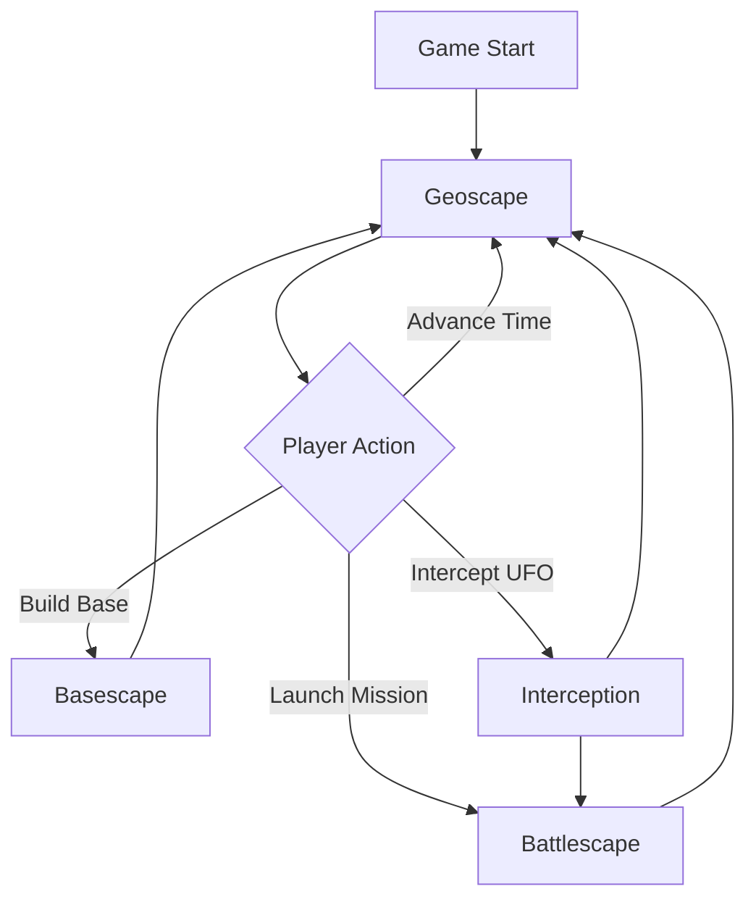
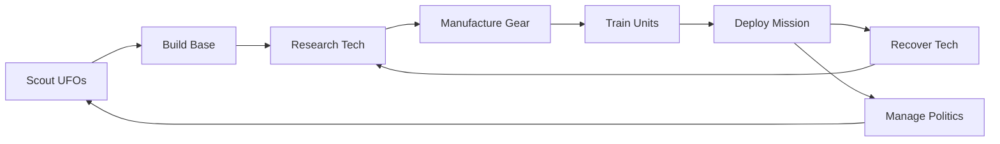

# AlienFall - Game Design Overview

> **Quick Links**: [Glossary](GLOSSARY.md) | [Core Systems](01-core/) | [Implementation](../engine/) | [Tests](../tests/)

## Game Concept

AlienFall is a **turn-based strategy game** inspired by X-COM, featuring three interconnected gameplay layers:

1. **Geoscape** - Strategic world management
2. **Basescape** - Base building and resource management  
3. **Battlescape** - Tactical combat missions

**Core Philosophy**: Open-ended sandbox gameplay with no fixed win/loss conditions, emphasizing player-driven goals and extensive modding support.

## Game Flow



## Layer Overview

### Geoscape (Strategic Layer)
- **Scale**: Global world map (80×40 hex grid)
- **Time**: Turn-based (1 turn = 1 day)
- **Focus**: Strategic decisions, resource allocation, global operations
- **Key Systems**: UFO tracking, mission deployment, world events, diplomacy

**Links**: [Design](02-geoscape/) | [Code](../engine/geoscape/) | [Tests](../tests/geoscape/)

### Basescape (Base Management)
- **Scale**: Single base (5×5 facility grid)
- **Time**: Turn-based (actions complete over multiple days)
- **Focus**: Construction, research, manufacturing, personnel management
- **Key Systems**: Facilities, research tech tree, manufacturing, storage

**Links**: [Design](03-basescape/) | [Code](../engine/basescape/) | [Tests](../tests/)

### Interception (Air Combat)
- **Scale**: Province-to-province craft movement
- **Time**: Turn-based card game style
- **Focus**: Craft vs UFO/base combat
- **Key Systems**: Craft weapons, damage, fuel, equipment

**Links**: [Design](04-interception/) | [Code](../engine/interception/) | [Tests](../tests/)

### Battlescape (Tactical Combat)
- **Scale**: Procedurally generated tactical maps
- **Time**: Turn-based (unit-by-unit activation)
- **Focus**: Squad tactics, cover, positioning
- **Key Systems**: Combat, movement, line-of-sight, AI

**Links**: [Design](05-battlescape/) | [Code](../engine/battlescape/) | [Tests](../tests/battlescape/)

## Core Game Loop



## Interconnected Systems

### Economy Flow
```
Countries → Funding → Base Operations
              ↓
        Research → Manufacturing → Equipment
              ↓
        Mission Success → Recovered Tech → Research
```

### Politics Flow
```
Mission Success → Country Relations → Funding Increase
Mission Failure → Country Relations → Funding Decrease
                        ↓
                  Potential Hostility
```

### Progression Flow
```
Complete Missions → XP → Unit Advancement
Recover Tech → Research → New Equipment
Build Facilities → Capacity → Larger Operations
```

## Key Game Concepts

### Turn-Based Everything
- **Geoscape**: 1 day per turn
- **Interception**: Card-based turns
- **Battlescape**: Individual unit turns
- **No real-time** - All decisions are deliberate

### Data-Driven Design
- **Moddable**: All content defined in TOML/data files
- **Configurable**: Easy balance tuning
- **Extensible**: Mod support from ground up

### Procedural Generation
- **Battlescape maps**: Generated from mapblocks
- **Mission variety**: Dynamic objectives and enemy composition
- **Replayability**: No two playthroughs identical

### Open-Ended Gameplay
- **No fixed ending**: Player sets their own goals
- **Multiple strategies**: Various paths to success
- **Sandbox mode**: Freedom to experiment

## Visual Style

- **Resolution**: 960×720 (40×30 tiles at 24×24px)
- **Style**: Pixel art with clear visual hierarchy
- **UI**: 24×24 pixel grid system for consistent layout
- **Perspective**: 
  - 2D tactical mode (top-down tile view)
  - 3D tactical mode (first-person Wolfenstein-style)

## Target Experience

### Strategic Depth
- **Long-term planning**: Research trees, base expansion
- **Resource management**: Budget, personnel, equipment
- **Risk/reward**: Balancing expansion vs overextension

### Tactical Challenge
- **Squad tactics**: Cover, flanking, suppression
- **Permadeath**: Unit loss has consequences
- **Adaptability**: Dynamic AI and situations

### Player Agency
- **Meaningful choices**: Decisions have lasting impact
- **Multiple approaches**: No single "correct" strategy
- **Emergent gameplay**: Systems interact in unexpected ways

## Documentation Map

```
01-core/          → Fundamental mechanics (turns, calendar, saves)
02-geoscape/      → World map, UFOs, deployment
03-basescape/     → Facilities, research, manufacturing
04-interception/  → Air combat mechanics
05-battlescape/   → Tactical combat (largest section)
06-economy/       → Funding, production, research
07-politics/      → Diplomacy, relations, reputation
08-content/       → Units, weapons, items definitions
09-lore/          → Story, campaign, narrative
10-progression/   → Advancement systems
11-ui-ux/         → Interface design
12-systems/       → Modding, audio, localization
13-balancing/     → Balance philosophy and tuning
14-technical/     → Technical design decisions
99-references/    → X-COM inspiration, external refs
```

## Next Steps

1. **Read [GLOSSARY.md](GLOSSARY.md)** - Understand terminology
2. **Explore layer docs** - Pick a game layer to study
3. **Check implementation** - See how design is realized in code
4. **Review tests** - Understand verification approach

---

**Last Updated**: October 15, 2025  
**Status**: Initial structure - content migration in progress
