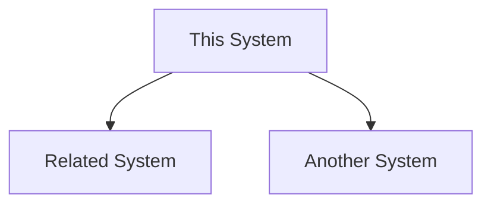

# AlienFall Game Design Documentation

> **Purpose**: Game design, mechanics, and rules documentation
> **Implementation**: See `engine/` folder for actual code
> **Testing**: See `tests/` folder for test cases

This folder contains the complete game design documentation for AlienFall. Each section describes game mechanics, rules, and player interactions **without implementation details**.

## 📁 Documentation Structure

### Core Systems
- **[core/](core/)** - Fundamental game mechanics (turns, calendar, saves)

### Game Layers
- **[geoscape/](geoscape/)** - Strategic world map layer
- **[basescape/](basescape/)** - Base management layer
- **[interception/](interception/)** - Air combat layer
- **[battlescape/](battlescape/)** - Tactical combat layer

### Supporting Systems
- **[ai/](ai/)** - AI behavior and decision making
- **[economy/](economy/)** - Economic systems (research, manufacturing, funding)
- **[politics/](politics/)** - Political systems (diplomacy, relations, reputation)

### Content & Meta Systems
- **[content/](content/)** - Game content (units, weapons, items, crafts, facilities)
- **[lore/](lore/)** - Story, campaign, and narrative design
- **[ui/](ui/)** - User interface and experience design
- **[tutorial/](tutorial/)** - Tutorial system design
- **[localization/](localization/)** - Internationalization design
- **[mods/](mods/)** - Modding system design
- **[analytics/](analytics/)** - Telemetry and metrics design

### Infrastructure
- **[scenes/](scenes/)** - Scene management and navigation
- **[assets/](assets/)** - Asset management design
- **[utils/](utils/)** - Utility systems design
- **[widgets/](widgets/)** - UI widget design
- **[network/](network/)** - Multiplayer architecture (future)

## 🔗 How to Use This Documentation

### For Game Designers
1. Start with OVERVIEW.md for high-level concepts
2. Use GLOSSARY.md for terminology
3. Navigate to specific layer/system documentation
4. Follow implementation links to see current code

### For Developers
1. Read design docs before implementing features
2. Check implementation links to understand current code
3. Update docs when mechanics change
4. Link new code to relevant design docs

### For Testers
1. Use docs to understand expected behavior
2. Follow test links to see test coverage
3. Report gaps between design and implementation

## � Relationship to Other Folders

```
docs/           ← Game design (mechanics, rules, concepts)
  ↓ implements
engine/         ← Implementation (Lua code) - MIRRORS docs/ structure
  ↓ tested by
tests/          ← Test cases (verification) - MIRRORS engine/ structure
  ↓ documents
wiki/           ← Developer docs (API, guides, technical details)
```

## 📝 Document Standards

All design documents follow these principles:

- **Concise**: Focus on concepts and interactions, not exhaustive details
- **Mechanical**: Describe rules, formulas, and gameplay mechanics
- **Linked**: Connect to implementation (`engine/`) and tests (`tests/`)
- **Visual**: Use diagrams, tables, and examples
- **No Code**: Pure design, no Lua implementation details

### Standard Document Structure
```markdown
# Document Title

> **Implementation**: `engine/path/to/files`
> **Tests**: `tests/path/to/tests`
> **Related**: Related design documents

Brief description of the mechanic/system.

## 🎯 Key Concepts

- Bullet point explanations
- Focus on gameplay impact
- Player-visible mechanics

## 🔧 Game Rules

- Specific rules and formulas
- Balance considerations
- Edge cases

## 🔗 System Interactions



## 📊 Data Structure

| Field | Type | Description |
|-------|------|-------------|
| field | type | description |

## 🎮 Player Experience

- How players interact
- UI considerations
- Feedback mechanisms
```

## 🎯 Current Status

**Structure**: Complete engine-mirroring folder structure created
**Content**: README files created for core sections
**Next Phase**: Migrate content from wiki/ and create detailed design docs

### Migration Progress
- ✅ **Structure Created**: All directories mirroring `engine/` organization
- ✅ **README Framework**: Core section READMEs with navigation
- 🔄 **Content Migration**: Begin moving design content from `wiki/`
- ⏳ **Detail Documents**: Create specific mechanic descriptions
- ⏳ **Cross-linking**: Connect design ↔ implementation ↔ tests

See [GAME_DESIGN_DOCS_PLAN.md](../GAME_DESIGN_DOCS_PLAN.md) for detailed migration roadmap.

---

**Note**: This documentation represents the **design intent**. Always check `engine/` for actual implementation status.
