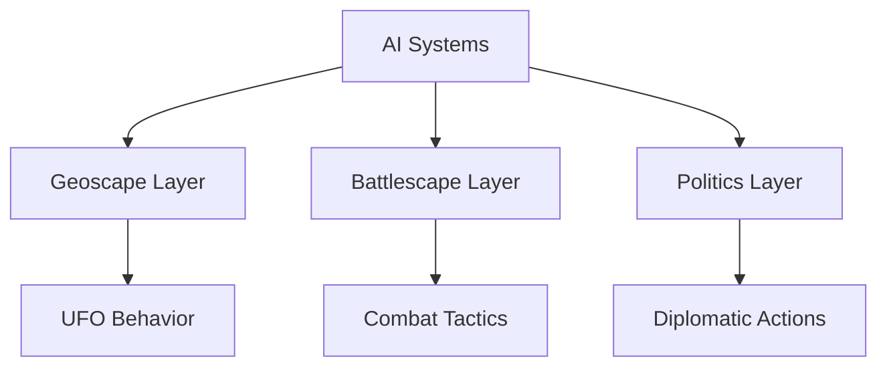

# AI Systems

> **Implementation**: `engine/ai/`
> **Tests**: `tests/ai/`
> **Related**: `docs/battlescape/ai-system/`, `docs/geoscape/`, `docs/politics/`

Artificial intelligence systems that control non-player entities across all game layers. AI handles alien behavior, diplomatic decisions, and strategic planning.

## 🎯 Core Philosophy

**Believable, challenging opponents** that provide engaging gameplay without being unfair. AI systems balance predictability for learning with unpredictability for replayability.

## 🤖 AI Types by Layer

### Strategic AI (Geoscape)
- **UFO Behavior**: Patrol patterns, crash site selection, terror target choice
- **Alien Expansion**: Territory control and resource management
- **Response to Player**: Adaptation to interception success/failure

### Diplomatic AI (Politics)
- **Country Relations**: Funding adjustments based on performance
- **Alliance Formation**: Coalition building against common threats
- **Espionage**: Covert operations and information gathering

### Tactical AI (Battlescape)
- **Combat Behavior**: Unit positioning, target selection, ability usage
- **Squad Coordination**: Group tactics and formation management
- **Difficulty Scaling**: AI strength adjustment based on player skill

## 🧠 Decision Making

### Behavior Trees
- **Hierarchical Structure**: Decision trees for complex behavior
- **Modular Design**: Reusable behavior components
- **Context Awareness**: State-based decision modification

### Utility Systems
- **Weighted Options**: Score-based action selection
- **Risk Assessment**: Danger evaluation for conservative/aggressive play
- **Goal Orientation**: Long-term objective pursuit

## 📊 Difficulty Scaling

### Rookie Mode
- **Predictable Patterns**: Clear UFO flight paths
- **Basic Tactics**: Simple positioning and targeting
- **Forgiving AI**: Allows player mistakes and recovery

### Veteran Mode
- **Adaptive Behavior**: Response to player tactics
- **Coordinated Attacks**: Squad-level cooperation
- **Resource Management**: Efficient use of abilities and positioning

### Commander/Legend Mode
- **Optimal Play**: Near-perfect tactical decisions
- **Strategic Depth**: Long-term planning and adaptation
- **Information Asymmetry**: AI uses full knowledge effectively

## 🎯 AI Goals & Behaviors

### UFO Operations
- **Scout Missions**: Gather intelligence on player bases
- **Terror Attacks**: Create panic and reduce funding
- **Resource Harvesting**: Collect materials for alien operations
- **Technology Recovery**: Retrieve crashed craft and personnel

### Political Actions
- **Diplomacy**: Negotiate with other countries
- **Sabotage**: Undermine player operations covertly
- **Alliance Building**: Form coalitions against player organization

### Combat Tactics
- **Positioning**: Use cover and elevation effectively
- **Suppression**: Control battlefield through fire superiority
- **Flanking**: Attack from unexpected angles
- **Objective Focus**: Prioritize mission goals over unit preservation

## 🔧 Technical Implementation

### Pathfinding
- **A* Algorithm**: Optimal path calculation
- **Terrain Costs**: Movement penalty integration
- **Dynamic Obstacles**: Real-time path recalculation

### State Machines
- **Behavior States**: Patrol, combat, retreat, etc.
- **Transition Conditions**: Health, morale, objectives
- **Memory Systems**: Learning from past encounters

## 📈 Performance Considerations

### Computational Limits
- **Turn-based Processing**: AI calculations during player turns
- **Background Updates**: Continuous world simulation
- **Resource Budgeting**: CPU time allocation per AI entity

### Balancing Challenges
- **Fairness**: AI should be beatable with good play
- **Engagement**: Provide meaningful tactical choices
- **Replayability**: Different strategies should succeed

## 🎮 Player Experience

### Learning Curve
- **Progressive Difficulty**: AI adapts to player skill
- **Pattern Recognition**: Learnable behaviors with exceptions
- **Counter-play**: Multiple strategies to defeat AI

### Emergent Behavior
- **Unpredictable Events**: Random elements prevent perfect planning
- **Adaptive Tactics**: AI changes behavior based on success/failure
- **Strategic Depth**: Long-term AI planning creates dynamic campaigns

## 🔗 System Integration

## 📁 Design Documents

- **[diplomacy.md](diplomacy/diplomacy.md)** - Political AI behavior
- **[pathfinding.md](pathfinding/pathfinding.md)** - Navigation algorithms
- **[strategic.md](strategic/strategic.md)** - High-level planning
- **[tactical.md](tactical/tactical.md)** - Combat decision making

## 🎯 AI Design Principles

### Believability
- **Consistent Motivation**: Clear goals and priorities
- **Realistic Limitations**: Resource and information constraints
- **Cultural Differences**: Varied behavior patterns

### Challenge Balance
- **Skill-based Scaling**: Difficulty matches player ability
- **Multiple Solutions**: Different strategies should work
- **Fair Competition**: No "cheap" AI tricks or exploits

### Performance
- **Efficient Processing**: Minimal computational overhead
- **Scalable Complexity**: AI depth based on hardware capabilities
- **Background Operation**: Non-intrusive world simulation